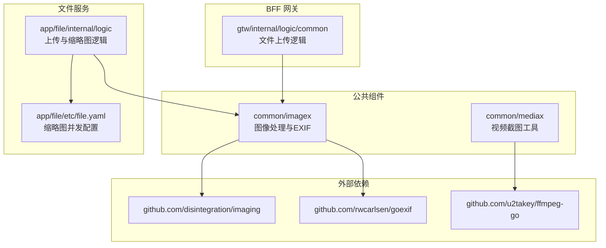
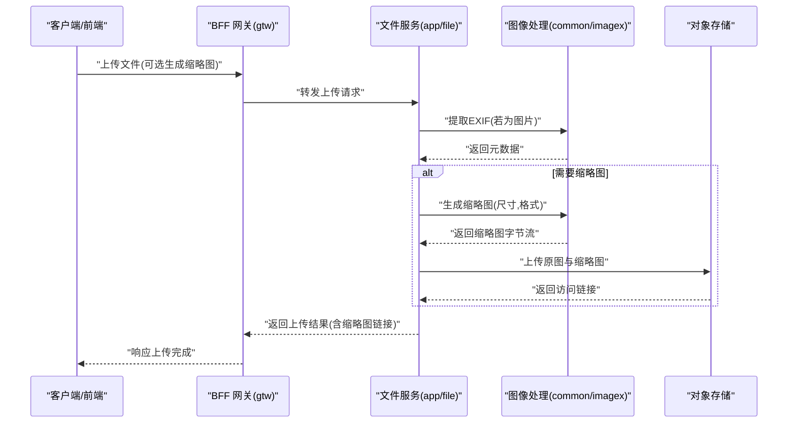
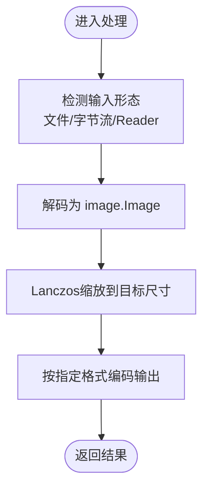
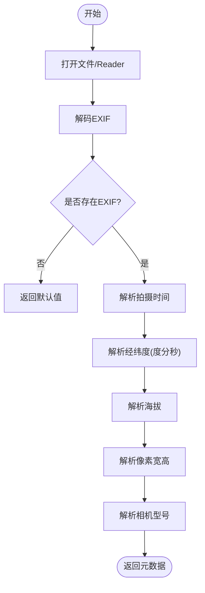
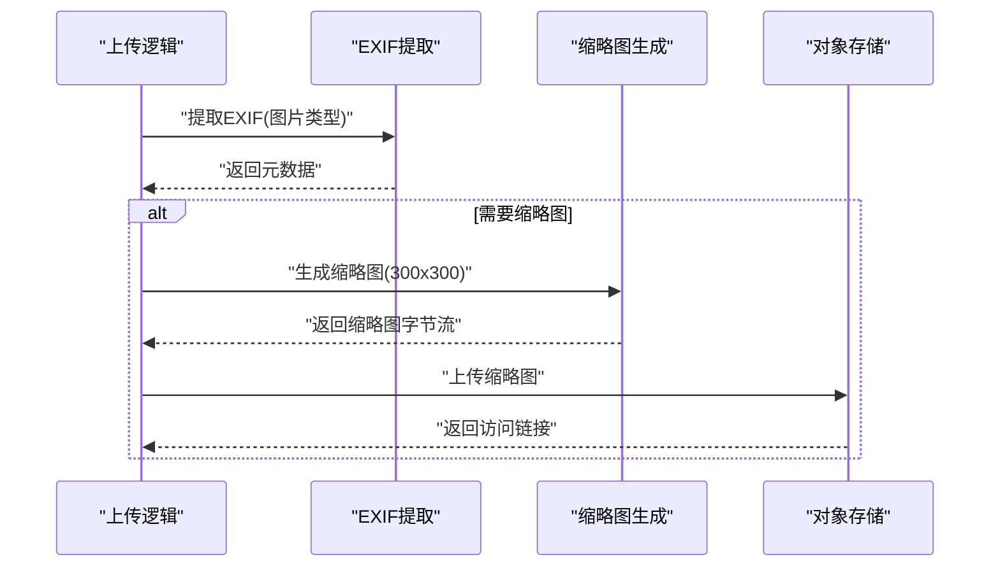
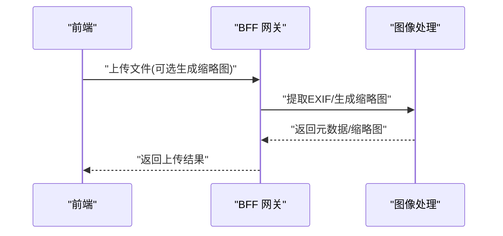
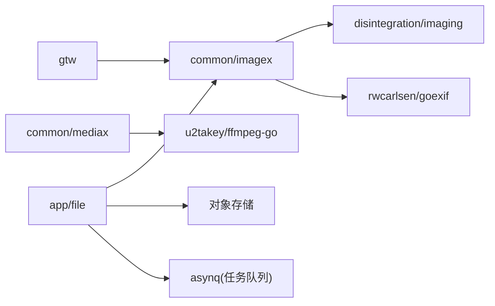
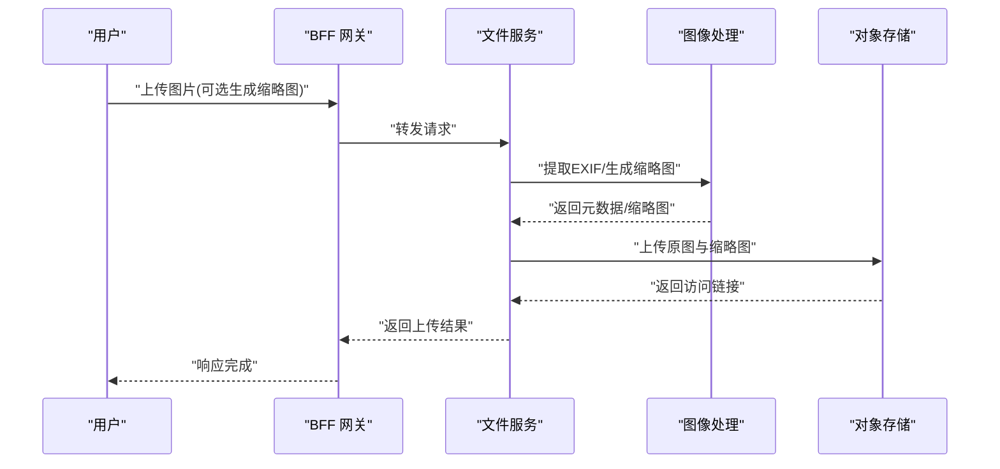

# 图像处理工具

<cite>
**本文引用的文件**
- [imaging.go](file://common/imagex/imaging.go)
- [exifx.go](file://common/imagex/exifx.go)
- [mediax.go](file://common/mediax/mediax.go)
- [putchunkfilelogic.go](file://app/file/internal/logic/putchunkfilelogic.go)
- [mfsuploadfilelogic.go](file://gtw/internal/logic/common/mfsuploadfilelogic.go)
- [file.yaml](file://app/file/etc/file.yaml)
- [go.mod](file://go.mod)
- [README.md](file://README.md)
</cite>

## 目录
1. [简介](#简介)
2. [项目结构](#项目结构)
3. [核心组件](#核心组件)
4. [架构总览](#架构总览)
5. [详细组件分析](#详细组件分析)
6. [依赖分析](#依赖分析)
7. [性能考虑](#性能考虑)
8. [故障排查指南](#故障排查指南)
9. [结论](#结论)
10. [附录](#附录)

## 简介
本技术文档围绕 Zero-Service 中的图像处理工具进行系统化说明，重点覆盖以下方面：
- 图像处理能力：缩放、格式转换、质量调整
- 支持的图像格式与处理参数
- 性能优化策略与内存管理
- 图像质量控制、尺寸限制与并发控制
- 实际应用场景与端到端流程（批量处理、格式转换、质量优化）
- 与文件服务、对象存储、任务队列等组件的集成方式与最佳实践

该工具位于 common/imagex 目录，提供多种输入/输出形态（文件路径、字节流、Reader/Writer），并结合 EXIF 元数据提取能力，广泛应用于文件上传、缩略图生成与质量优化等场景。

## 项目结构
图像处理工具主要分布在以下位置：
- common/imagex：图像处理与 EXIF 元数据提取
- app/file：文件服务，负责上传、缩略图生成与对象存储集成
- gtw：BFF 网关，提供前端直传与缩略图生成入口
- common/mediax：视频截图工具（与图像处理互补）

图表来源
- [imaging.go:1-68](file://common/imagex/imaging.go#L1-L68)
- [exifx.go:1-294](file://common/imagex/exifx.go#L1-L294)
- [mediax.go:1-194](file://common/mediax/mediax.go#L1-L194)
- [putchunkfilelogic.go:200-270](file://app/file/internal/logic/putchunkfilelogic.go#L200-L270)
- [mfsuploadfilelogic.go:90-123](file://gtw/internal/logic/common/mfsuploadfilelogic.go#L90-L123)
- [file.yaml:1-23](file://app/file/etc/file.yaml#L1-L23)

章节来源
- [README.md: 项目结构与模块职责:59-108](file://README.md#L59-L108)
- [go.mod: 外部依赖声明:10-46](file://go.mod#L10-L46)

## 核心组件
- 图像处理核心（imaging.go）
  - 提供从文件路径、字节流、Reader 到 Writer 的多种输入/输出形态
  - 使用 Lanczos 插值算法进行高质量缩放
  - 支持 JPEG 编码输出（缩略图常用）
- EXIF 元数据提取（exifx.go）
  - 支持 JPG/JPEG 文件的经纬度、拍摄时间、像素宽高、海拔、相机型号等提取
  - 包含对度分秒格式的解析与容错处理
- 视频截图工具（mediax.go）
  - 基于 ffmpeg-go 的视频截图能力，用于非图像文件的媒体处理补充
- 文件服务集成（app/file）
  - 在上传流程中自动提取 EXIF 并按需生成缩略图
  - 通过配置控制缩略图生成并发度
- BFF 网关集成（gtw）
  - 提供前端直传入口，支持缩略图生成与元数据回传

章节来源
- [imaging.go: 图像处理核心函数:12-68](file://common/imagex/imaging.go#L12-L68)
- [exifx.go: EXIF 元数据结构与解析:20-170](file://common/imagex/exifx.go#L20-L170)
- [mediax.go: 视频截图工具:17-194](file://common/mediax/mediax.go#L17-L194)
- [putchunkfilelogic.go: 缩略图生成与上传:212-255](file://app/file/internal/logic/putchunkfilelogic.go#L212-L255)
- [mfsuploadfilelogic.go: 前端直传与缩略图:102-119](file://gtw/internal/logic/common/mfsuploadfilelogic.go#L102-L119)
- [file.yaml: 缩略图并发配置](file://app/file/etc/file.yaml#L20)

## 架构总览
图像处理在系统中的典型调用链如下：

图表来源
- [mfsuploadfilelogic.go:90-123](file://gtw/internal/logic/common/mfsuploadfilelogic.go#L90-L123)
- [putchunkfilelogic.go:212-255](file://app/file/internal/logic/putchunkfilelogic.go#L212-L255)
- [imaging.go:18-32](file://common/imagex/imaging.go#L18-L32)

## 详细组件分析

### 图像处理核心（imaging.go）
- 输入/输出形态
  - 文件路径输入 → 文件路径输出
  - 文件路径输入 → 字节流输出
  - 字节流输入 → 字节流输出
  - Reader 输入 → Reader 输出
- 处理参数
  - 目标宽高：整数像素
  - 编码格式：通过参数传入（例如 JPEG）
  - 插值算法：Lanczos（高质量缩放）
- 错误处理
  - 打开/解码失败、编码失败、文件创建失败等均向上抛出
- 性能与内存
  - 使用 bytes.Buffer 进行中间编码，避免多余拷贝
  - Reader/Writer 形态减少磁盘 IO，适合流式处理

图表来源
- [imaging.go:12-68](file://common/imagex/imaging.go#L12-L68)

章节来源
- [imaging.go: 核心处理函数:12-68](file://common/imagex/imaging.go#L12-L68)

### EXIF 元数据提取（exifx.go）
- 支持字段
  - 经纬度（支持度分秒格式解析与方向修正）
  - 拍摄时间（标准化为统一格式）
  - 像素宽高（优先使用 ImageWidth/ImageLength，兼容 PixelXDimension/PixelYDimension）
  - 海拔（支持正负参考）
  - 相机型号
- 解析流程
  - 注册解析器并解码 EXIF
  - 清洗字符串（去引号、去方括号、去空白）
  - 度分秒拆分与分数转十进制
  - 方向参考（N/S/E/W）决定正负
- 错误处理
  - 无 EXIF 数据时返回默认值
  - 解析失败返回带上下文的错误

图表来源
- [exifx.go:94-170](file://common/imagex/exifx.go#L94-L170)
- [exifx.go:189-256](file://common/imagex/exifx.go#L189-L256)

章节来源
- [exifx.go: EXIF 结构与解析:20-170](file://common/imagex/exifx.go#L20-L170)
- [exifx.go: 经纬度解析细节:189-256](file://common/imagex/exifx.go#L189-L256)

### 文件服务中的图像处理集成（app/file）
- EXIF 提取
  - 在分片上传与流式上传中，针对图片类型自动提取 EXIF 并注入文件元数据
- 缩略图生成
  - 当启用缩略图时，复制临时文件并异步生成指定尺寸的缩略图
  - 生成完成后上传至对象存储，并记录访问链接
- 并发控制
  - 通过配置项控制缩略图生成并发度，避免 CPU/IO 抖动

图表来源
- [putchunkfilelogic.go:212-255](file://app/file/internal/logic/putchunkfilelogic.go#L212-L255)
- [file.yaml](file://app/file/etc/file.yaml#L20)

章节来源
- [putchunkfilelogic.go: 缩略图生成与上传:212-255](file://app/file/internal/logic/putchunkfilelogic.go#L212-L255)
- [file.yaml: 缩略图并发配置](file://app/file/etc/file.yaml#L20)

### BFF 网关中的图像处理集成（gtw）
- 前端直传
  - 支持前端直接上传文件，网关侧提取 EXIF 并按需生成缩略图
  - 返回原图与缩略图的访问路径
- 参数控制
  - 通过请求参数控制是否生成缩略图及缩略图尺寸

图表来源
- [mfsuploadfilelogic.go:90-123](file://gtw/internal/logic/common/mfsuploadfilelogic.go#L90-L123)

章节来源
- [mfsuploadfilelogic.go: 前端直传与缩略图:90-123](file://gtw/internal/logic/common/mfsuploadfilelogic.go#L90-L123)

### 与视频处理的协同（common/mediax）
- 视频截图工具基于 ffmpeg-go，支持按时间点或帧索引截图
- 输出格式为 mjpeg（质量参数可调），便于后续与图像处理工具配合
- 适用于“先视频截图，再图像处理”的复合流程

章节来源
- [mediax.go: 视频截图工具:17-194](file://common/mediax/mediax.go#L17-L194)

## 依赖分析
- 图像处理依赖
  - disintegration/imaging：高质量图像缩放与编码
  - rwcarlsen/goexif：EXIF 解析
- 视频处理依赖
  - u2takey/ffmpeg-go：视频截图与编码
- 文件服务依赖
  - 对象存储（MinIO/阿里 OSS/腾讯 COS）：缩略图上传
  - asynq：异步任务队列（缩略图生成任务）

图表来源
- [go.mod:10-46](file://go.mod#L10-L46)
- [imaging.go:3-10](file://common/imagex/imaging.go#L3-L10)
- [exifx.go:3-18](file://common/imagex/exifx.go#L3-L18)
- [mediax.go:3-15](file://common/mediax/mediax.go#L3-L15)

章节来源
- [go.mod: 外部依赖声明:10-46](file://go.mod#L10-L46)

## 性能考虑
- 缩放算法
  - 使用 Lanczos 插值，保证缩放质量，适合缩略图生成
- 编码格式
  - 缩略图默认采用 JPEG，兼顾体积与质量
  - 可通过参数切换其他格式以满足不同场景
- 内存与 IO
  - Reader/Writer 形态减少磁盘 IO，适合流式处理
  - 字节流中间缓冲区避免重复分配
- 并发控制
  - 文件服务通过配置项控制缩略图生成并发度，防止资源争抢
- 资源清理
  - 临时文件在任务结束后及时清理，避免磁盘占用

章节来源
- [imaging.go: 缩放与编码:13-15](file://common/imagex/imaging.go#L13-L15)
- [file.yaml: 并发配置](file://app/file/etc/file.yaml#L20)
- [putchunkfilelogic.go: 临时文件清理:233-235](file://app/file/internal/logic/putchunkfilelogic.go#L233-L235)

## 故障排查指南
- 常见问题
  - EXIF 解析失败：检查文件是否为 JPG/JPEG，确认 EXIF 是否存在
  - 缩略图生成失败：检查输入尺寸是否合理，确认磁盘空间与权限
  - 缩略图并发过高导致性能抖动：降低并发配置或增加机器资源
- 排查步骤
  - 查看文件服务日志，定位 EXIF 提取与缩略图生成阶段的错误
  - 验证对象存储上传状态，确认缩略图访问链接可用
  - 使用 Reader/Writer 形态进行最小化复现，排除磁盘 IO 问题

章节来源
- [exifx.go: 错误处理与默认值:98-104](file://common/imagex/exifx.go#L98-L104)
- [putchunkfilelogic.go: 错误日志与清理:248-250](file://app/file/internal/logic/putchunkfilelogic.go#L248-L250)
- [file.yaml: 并发配置](file://app/file/etc/file.yaml#L20)

## 结论
Zero-Service 的图像处理工具以高质量缩放与 EXIF 元数据提取为核心，结合文件服务与 BFF 网关实现了从上传到缩略图生成与存储的完整闭环。通过合理的并发控制与内存管理策略，能够在保证质量的同时提升吞吐与稳定性。建议在生产环境中：
- 明确缩略图尺寸与质量参数，统一格式策略
- 控制缩略图生成并发度，结合资源监控动态调整
- 对异常场景（无 EXIF、空文件、格式不支持）做好降级与告警

## 附录

### 支持的图像格式与处理参数
- 输入格式
  - JPG/JPEG（EXIF 提取）
  - 任意 image.Decode 支持的格式（图像处理）
- 处理参数
  - 目标宽高：整数像素
  - 编码格式：通过参数传入（常见为 JPEG）
  - 插值算法：Lanczos

章节来源
- [exifx.go: 仅支持 JPG/JPEG:175-178](file://common/imagex/exifx.go#L175-L178)
- [imaging.go: 缩放与编码:13-15](file://common/imagex/imaging.go#L13-L15)

### 实际应用场景与端到端流程
- 场景一：分片上传自动缩略图
  - 上传图片 → 提取 EXIF → 按需生成缩略图 → 异步上传对象存储 → 返回访问链接
- 场景二：前端直传缩略图
  - 前端直传 → 网关侧提取 EXIF → 生成缩略图 → 返回原图与缩略图链接

图表来源
- [mfsuploadfilelogic.go:90-123](file://gtw/internal/logic/common/mfsuploadfilelogic.go#L90-L123)
- [putchunkfilelogic.go:212-255](file://app/file/internal/logic/putchunkfilelogic.go#L212-L255)