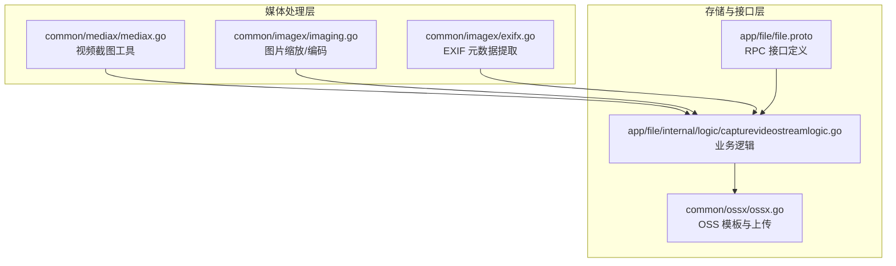
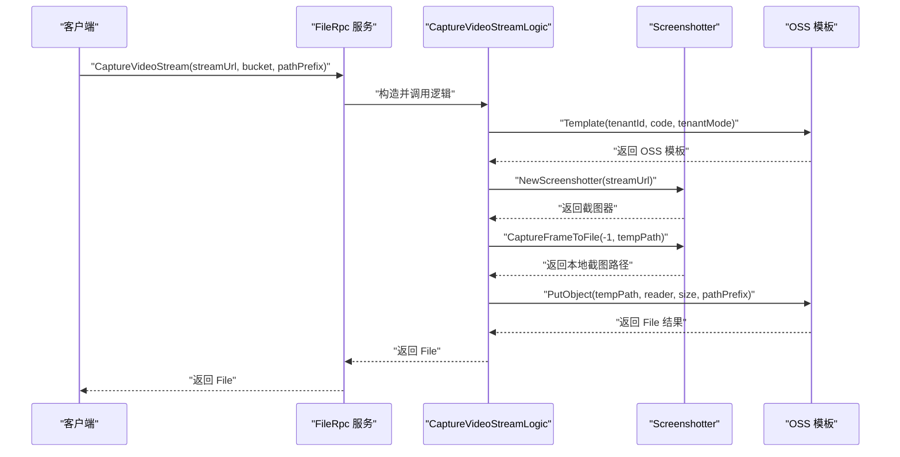
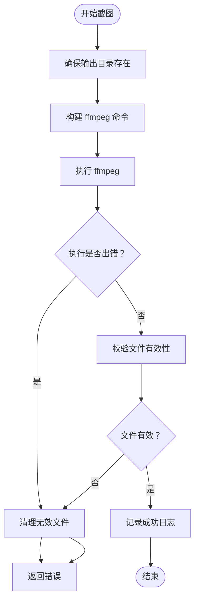
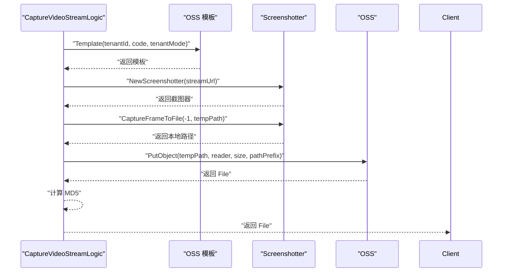
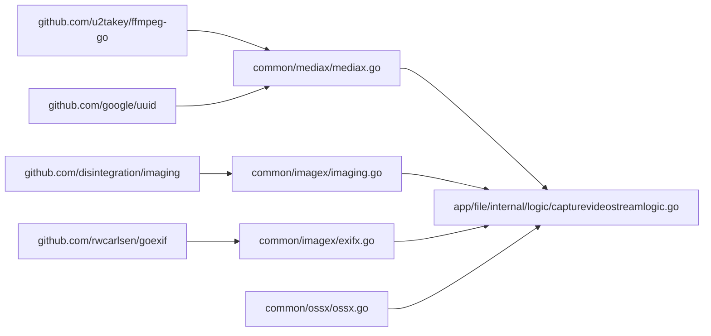

# 媒体处理工具

<cite>
**本文引用的文件**
- [common/mediax/mediax.go](file://common/mediax/mediax.go)
- [app/file/internal/logic/capturevideostreamlogic.go](file://app/file/internal/logic/capturevideostreamlogic.go)
- [common/imagex/exifx.go](file://common/imagex/exifx.go)
- [common/imagex/imaging.go](file://common/imagex/imaging.go)
- [common/ossx/ossx.go](file://common/ossx/ossx.go)
- [app/file/file.proto](file://app/file/file.proto)
- [go.mod](file://go.mod)
</cite>

## 目录
1. [简介](#简介)
2. [项目结构](#项目结构)
3. [核心组件](#核心组件)
4. [架构概览](#架构概览)
5. [详细组件分析](#详细组件分析)
6. [依赖分析](#依赖分析)
7. [性能考虑](#性能考虑)
8. [故障排查指南](#故障排查指南)
9. [结论](#结论)
10. [附录](#附录)

## 简介
本文件面向 Zero-Service 的媒体处理工具 Mediax，系统性阐述其媒体文件处理能力，包括：
- 媒体格式检测与兼容性检查
- 视频截图与图片处理
- 元数据提取（以 EXIF 为例）
- 与外部媒体处理库的集成方式
- 性能优化策略
- 实际使用场景与流程说明

Mediax 当前以视频截图为核心能力，结合对象存储（OSS）上传与图片处理库，形成“采集—处理—存储—查询”的闭环。

## 项目结构
围绕媒体处理的关键模块如下：
- common/mediax：视频截图工具（基于 ffmpeg-go），提供按时间点与帧索引截图的能力
- common/imagex：图片处理与元数据提取（基于 imaging 与 goexif）
- common/ossx：对象存储模板与上传封装（当前最小实现）
- app/file：文件服务 RPC 接口与业务逻辑（包含视频流截图能力）

图表来源
- [common/mediax/mediax.go:1-194](file://common/mediax/mediax.go#L1-L194)
- [common/imagex/imaging.go:1-69](file://common/imagex/imaging.go#L1-L69)
- [common/imagex/exifx.go:1-294](file://common/imagex/exifx.go#L1-L294)
- [common/ossx/ossx.go:1-152](file://common/ossx/ossx.go#L1-L152)
- [app/file/file.proto:257-287](file://app/file/file.proto#L257-L287)
- [app/file/internal/logic/capturevideostreamlogic.go:1-93](file://app/file/internal/logic/capturevideostreamlogic.go#L1-L93)

章节来源
- [common/mediax/mediax.go:1-194](file://common/mediax/mediax.go#L1-L194)
- [common/imagex/imaging.go:1-69](file://common/imagex/imaging.go#L1-L69)
- [common/imagex/exifx.go:1-294](file://common/imagex/exifx.go#L1-L294)
- [common/ossx/ossx.go:1-152](file://common/ossx/ossx.go#L1-L152)
- [app/file/file.proto:257-287](file://app/file/file.proto#L257-L287)
- [app/file/internal/logic/capturevideostreamlogic.go:1-93](file://app/file/internal/logic/capturevideostreamlogic.go#L1-L93)

## 核心组件
- Screenshotter（视频截图工具）
  - 支持按时间点截图与按帧索引截图
  - 输出 JPEG（MJPEG）格式，内置质量参数
  - 提供临时文件路径生成、目录确保、文件校验与清理
- 图片处理（imagex）
  - 提供多种输入输出形态的缩放与编码（文件/字节流/Reader）
  - 默认使用 Lanczos 插值算法进行高质量缩放
- EXIF 元数据提取（imagex）
  - 支持经纬度、拍摄时间、分辨率、海拔、相机型号等字段提取
  - 对常见格式（JPG/JPEG）进行严格校验
- OSS 上传（ossx）
  - 提供模板池化、租户模式、路径规则与上传接口
  - 当前最小实现支持 MinIO，后续可扩展更多厂商

章节来源
- [common/mediax/mediax.go:17-194](file://common/mediax/mediax.go#L17-L194)
- [common/imagex/imaging.go:12-68](file://common/imagex/imaging.go#L12-L68)
- [common/imagex/exifx.go:20-170](file://common/imagex/exifx.go#L20-L170)
- [common/ossx/ossx.go:28-152](file://common/ossx/ossx.go#L28-L152)

## 架构概览
Mediax 在 Zero-Service 中采用“服务化 + 工具库”的组合：
- 服务侧（app/file）通过 RPC 暴露 CaptureVideoStream 接口
- 业务逻辑负责 OSS 配置解析、截图执行、临时文件管理与上传
- 工具库（mediax/imagex/ossx）提供可复用能力

图表来源
- [app/file/file.proto:257-287](file://app/file/file.proto#L257-L287)
- [app/file/internal/logic/capturevideostreamlogic.go:35-92](file://app/file/internal/logic/capturevideostreamlogic.go#L35-L92)
- [common/mediax/mediax.go:32-87](file://common/mediax/mediax.go#L32-L87)
- [common/ossx/ossx.go:109-151](file://common/ossx/ossx.go#L109-L151)

## 详细组件分析

### Screenshotter（视频截图工具）
- 功能要点
  - 输入：视频源（本地文件或实时流 URL）
  - 输出：本地 JPEG 文件（MJPEG，质量参数内置）
  - 支持两种截图模式
    - 按时间点截图：适用于实时流抓拍当前帧
    - 按帧索引截图：通过 filter 精确选择指定帧
- 参数与行为
  - 时间点参数：秒；实时流传 -1 表示当前帧
  - 帧索引参数：从 0 开始
  - 输出格式：JPEG（MJPEG），质量参数内置
  - 目录自动创建、文件有效性校验、错误清理
- 错误处理
  - 捕获 ffmpeg 错误输出并记录
  - 执行失败与文件校验失败均清理临时文件
- 日志与可观测性
  - 成功/失败日志包含路径、大小与时长
  - 调试日志输出 ffmpeg 原始输出

图表来源
- [common/mediax/mediax.go:32-87](file://common/mediax/mediax.go#L32-L87)
- [common/mediax/mediax.go:89-143](file://common/mediax/mediax.go#L89-L143)

章节来源
- [common/mediax/mediax.go:17-194](file://common/mediax/mediax.go#L17-L194)

### 图片处理（imagex）
- 缩放与编码
  - 支持文件路径/字节流/Reader 多种输入
  - 默认使用 Lanczos 插值，保证缩放质量
  - 输出格式可配置（如 JPEG）
- 典型用途
  - 截图后生成缩略图
  - 将字节流转为指定尺寸的图片

章节来源
- [common/imagex/imaging.go:12-68](file://common/imagex/imaging.go#L12-L68)

### EXIF 元数据提取（imagex）
- 支持字段
  - 经纬度（支持 N/S/E/W 方向修正）
  - 拍摄时间（标准化格式）
  - 分辨率（宽高）
  - 海拔（含正负参考）
  - 相机型号
- 格式限制
  - 仅支持 JPG/JPEG
- 错误处理
  - 无 EXIF 数据时返回默认值
  - 解析失败抛出明确错误

章节来源
- [common/imagex/exifx.go:20-170](file://common/imagex/exifx.go#L20-L170)
- [common/imagex/exifx.go:172-294](file://common/imagex/exifx.go#L172-L294)

### OSS 上传（ossx）
- 能力范围
  - 模板池化（按租户缓存模板与连接信息）
  - 路径规则（支持租户模式、日期目录、UUID 文件名）
  - 上传接口（文件/流/Reader）
- 当前实现
  - 仅支持 MinIO 类型
  - 未来可扩展更多厂商

章节来源
- [common/ossx/ossx.go:28-152](file://common/ossx/ossx.go#L28-L152)

### FileRpc 服务与业务逻辑
- 接口定义
  - CaptureVideoStream：接收 streamUrl、bucket、pathPrefix 等参数
  - 返回 File（包含链接、大小、MD5、缩略图等）
- 业务流程
  - 解析 OSS 配置并获取模板
  - 创建截图器并执行截图（-1 表示当前帧）
  - 计算 MD5 并上传到 OSS
  - 返回 File 结果

图表来源
- [app/file/file.proto:257-287](file://app/file/file.proto#L257-L287)
- [app/file/internal/logic/capturevideostreamlogic.go:35-92](file://app/file/internal/logic/capturevideostreamlogic.go#L35-L92)
- [common/mediax/mediax.go:32-87](file://common/mediax/mediax.go#L32-L87)
- [common/ossx/ossx.go:109-151](file://common/ossx/ossx.go#L109-L151)

章节来源
- [app/file/file.proto:257-287](file://app/file/file.proto#L257-L287)
- [app/file/internal/logic/capturevideostreamlogic.go:35-92](file://app/file/internal/logic/capturevideostreamlogic.go#L35-L92)

## 依赖分析
- 外部库
  - ffmpeg-go：执行视频截图与编码
  - disintegration/imaging：图片缩放与编码
  - rwcarlsen/goexif：EXIF 元数据解析
  - google/uuid：生成临时文件名
- 内部依赖
  - Mediax 依赖 OSS 模板与日志库
  - File 服务逻辑依赖 Mediax、OSS 模板与模型

图表来源
- [go.mod:46-18](file://go.mod#L46-L18)
- [common/mediax/mediax.go:3-15](file://common/mediax/mediax.go#L3-L15)
- [common/imagex/imaging.go:3-10](file://common/imagex/imaging.go#L3-L10)
- [common/imagex/exifx.go:3-18](file://common/imagex/exifx.go#L3-L18)
- [common/ossx/ossx.go:3-15](file://common/ossx/ossx.go#L3-L15)

章节来源
- [go.mod:5-62](file://go.mod#L5-L62)

## 性能考虑
- 截图参数
  - 输出 JPEG（MJPEG）并设置质量参数，兼顾体积与清晰度
  - 仅抽取单帧（vframes=1），降低 CPU 与 I/O 开销
- I/O 与临时文件
  - 自动创建输出目录，避免重复 I/O 失败
  - 截图完成后及时删除临时文件，减少磁盘占用
- 并发与缓存
  - OSS 模板按租户缓存，减少重复初始化成本
- 建议优化
  - 对高频请求可引入本地缓存（如 Redis）存储热点截图
  - 对大规模缩略图生成可采用并发池（如 ants）控制并发度
  - 对网络流不稳定场景，建议增加重试与超时控制

## 故障排查指南
- 常见问题与定位
  - ffmpeg 执行失败：检查输入 URL/路径合法性、权限与网络连通性；查看调试日志中的 ffmpeg 输出
  - 文件为空：确认截图是否成功写入，检查 validateFile 校验逻辑
  - OSS 上传失败：核对 OSS 配置（Endpoint、AccessKey、Bucket）、租户模式与路径规则
  - EXIF 解析失败：确认文件为 JPG/JPEG 格式，且包含 EXIF 数据
- 建议措施
  - 在业务逻辑中增加重试与降级策略
  - 对关键路径增加监控指标（耗时、成功率、错误码分布）
  - 对临时文件清理失败进行告警

章节来源
- [common/mediax/mediax.go:69-87](file://common/mediax/mediax.go#L69-L87)
- [common/mediax/mediax.go:125-143](file://common/mediax/mediax.go#L125-L143)
- [common/ossx/ossx.go:109-151](file://common/ossx/ossx.go#L109-L151)
- [common/imagex/exifx.go:94-170](file://common/imagex/exifx.go#L94-L170)

## 结论
Mediax 以简洁稳定的 API 提供了视频截图与图片处理能力，并通过 OSS 模板实现跨厂商的对象存储抽象。当前实现聚焦于“按时间点/帧索引截图 + JPEG 输出 + EXIF 元数据提取”，满足大多数视频流截图与图片处理场景。后续可在以下方面演进：
- 扩展更多媒体格式与编码参数
- 引入更丰富的图片处理（滤镜、水印、多尺寸缩略图）
- 增强流式处理与批量任务能力
- 加强错误恢复与性能监控

## 附录

### 支持的媒体格式与参数
- 视频截图
  - 输入：本地文件或实时流 URL
  - 输出：JPEG（MJPEG），质量参数内置
  - 截图模式：按时间点（秒）、按帧索引（从 0 开始）
- 图片处理
  - 输入：文件路径/字节流/Reader
  - 输出：JPEG（可配置）
  - 算法：Lanczos 插值
- EXIF 元数据
  - 支持：经纬度、拍摄时间、分辨率、海拔、相机型号
  - 格式：JPG/JPEG

章节来源
- [common/mediax/mediax.go:32-87](file://common/mediax/mediax.go#L32-L87)
- [common/mediax/mediax.go:89-143](file://common/mediax/mediax.go#L89-L143)
- [common/imagex/imaging.go:12-68](file://common/imagex/imaging.go#L12-L68)
- [common/imagex/exifx.go:20-170](file://common/imagex/exifx.go#L20-L170)

### 使用场景与流程
- 实时视频流截图
  - 调用 CaptureVideoStream，传入 streamUrl、bucket、pathPrefix
  - 服务端自动截图并上传到 OSS，返回 File 结果（包含 MD5、链接等）
- 元数据提取
  - 对 JPG/JPEG 图片进行 EXIF 解析，获取经纬度、拍摄时间、分辨率等
- 图片缩略图
  - 使用 imagex 提供的多种输入输出形态生成缩略图

章节来源
- [app/file/file.proto:257-287](file://app/file/file.proto#L257-L287)
- [app/file/internal/logic/capturevideostreamlogic.go:35-92](file://app/file/internal/logic/capturevideostreamlogic.go#L35-L92)
- [common/imagex/exifx.go:172-294](file://common/imagex/exifx.go#L172-L294)