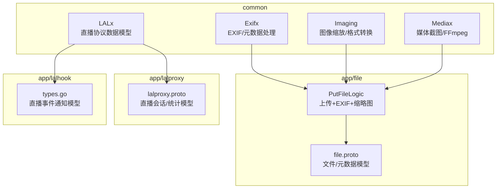
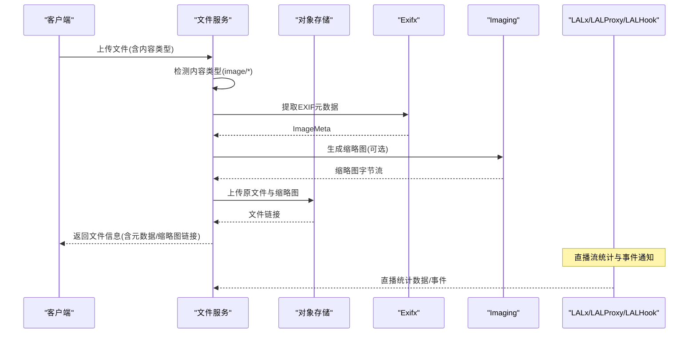
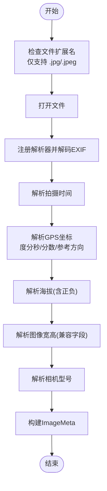
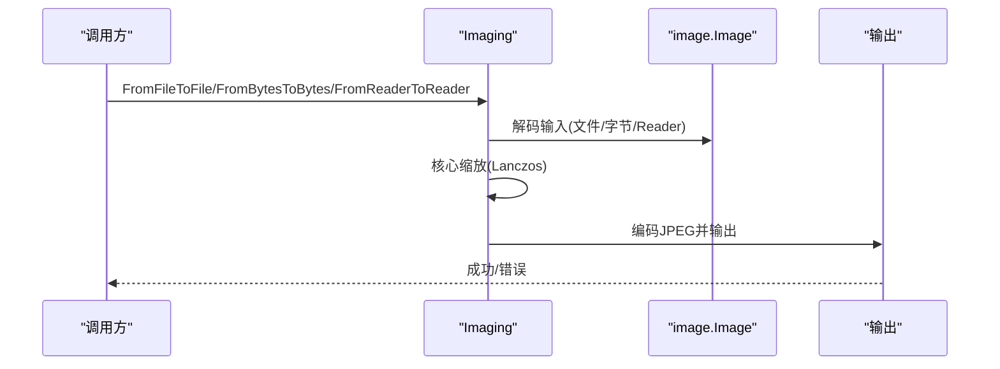
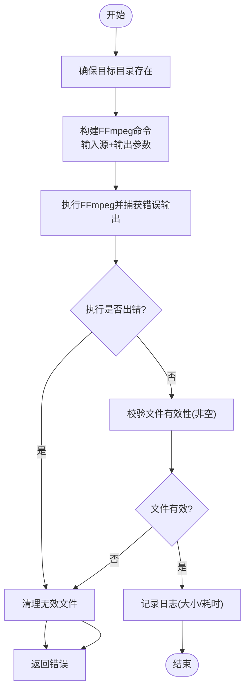
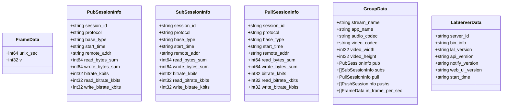
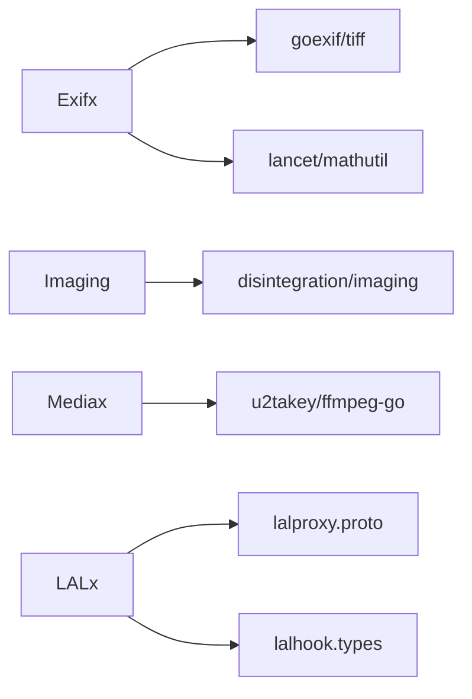

# 媒体文件工具

<cite>
**本文引用的文件**
- [exifx.go](file://common/imagex/exifx.go)
- [imaging.go](file://common/imagex/imaging.go)
- [mediax.go](file://common/mediax/mediax.go)
- [laltype.go](file://common/lalx/laltype.go)
- [file.proto](file://app/file/file/file.proto)
- [putfilelogic.go](file://app/file/internal/logic/putfilelogic.go)
- [putchunkfilelogic.go](file://app/file/internal/logic/putchunkfilelogic.go)
- [putstreamfilelogic.go](file://app/file/internal/logic/putstreamfilelogic.go)
- [lalproxy.proto](file://app/lalproxy/lalproxy.proto)
- [types.go](file://app/lalhook/internal/types/types.go)
</cite>

## 目录
1. [简介](#简介)
2. [项目结构](#项目结构)
3. [核心组件](#核心组件)
4. [架构概览](#架构概览)
5. [详细组件分析](#详细组件分析)
6. [依赖分析](#依赖分析)
7. [性能考虑](#性能考虑)
8. [故障排查指南](#故障排查指南)
9. [结论](#结论)
10. [附录](#附录)

## 简介
本技术文档面向 Zero-Service 的媒体文件工具模块，系统性介绍以下四个核心子系统：
- Exifx：EXIF 元数据提取、GPS 坐标解析与图片元数据处理
- Imaging：图像缩放、裁剪、格式转换与质量调整
- Mediax：媒体文件处理、格式检测与基于 FFmpeg 的截图与转码能力
- LALx：直播协议处理、音视频流管理与协议转换能力

文档将从架构、数据流、处理逻辑、错误处理、性能特征与最佳实践等维度进行深入剖析，并提供可视化图示帮助理解。

## 项目结构
媒体文件工具分布在如下位置：
- common/imagex：图像与 EXIF 相关工具
- common/mediax：媒体处理与截图工具
- common/lalx：直播协议相关数据模型
- app/file：文件服务，集成 EXIF 提取与缩略图生成
- app/lalproxy：直播代理服务，定义直播协议相关消息
- app/lalhook：直播钩子服务，定义直播事件通知结构

图表来源
- [exifx.go:1-294](file://common/imagex/exifx.go#L1-L294)
- [imaging.go:1-69](file://common/imagex/imaging.go#L1-L69)
- [mediax.go:1-194](file://common/mediax/mediax.go#L1-L194)
- [laltype.go:1-126](file://common/lalx/laltype.go#L1-L126)
- [file.proto:1-200](file://app/file/file/file.proto#L1-L200)
- [putfilelogic.go:1-78](file://app/file/internal/logic/putfilelogic.go#L1-L78)
- [lalproxy.proto:1-40](file://app/lalproxy/lalproxy.proto#L1-L40)
- [types.go:62-158](file://app/lalhook/internal/types/types.go#L62-L158)

章节来源
- [exifx.go:1-294](file://common/imagex/exifx.go#L1-L294)
- [imaging.go:1-69](file://common/imagex/imaging.go#L1-L69)
- [mediax.go:1-194](file://common/mediax/mediax.go#L1-L194)
- [laltype.go:1-126](file://common/lalx/laltype.go#L1-L126)
- [file.proto:1-200](file://app/file/file/file.proto#L1-L200)
- [putfilelogic.go:1-78](file://app/file/internal/logic/putfilelogic.go#L1-L78)
- [lalproxy.proto:1-40](file://app/lalproxy/lalproxy.proto#L1-L40)
- [types.go:62-158](file://app/lalhook/internal/types/types.go#L62-L158)

## 核心组件
- Exifx：提供从 JPG/JPEG 图像中提取 EXIF 元数据的能力，包括拍摄时间、经纬度、海拔、图像宽高、相机型号等；并对 GPS 度分秒格式进行解析与校正。
- Imaging：提供多种输入输出形式的图像缩放与格式转换，支持文件路径、字节流、Reader 等输入，统一采用 Lanczos 插值算法与 JPEG 编码。
- Mediax：封装 FFmpeg 截图能力，支持按时间点与帧索引截图，输出本地文件；具备目录创建、文件校验与清理机制。
- LALx：定义直播协议相关数据模型，包括帧率统计、发布者/订阅者/中继会话信息以及服务器基础信息，支撑直播流管理与监控。

章节来源
- [exifx.go:20-170](file://common/imagex/exifx.go#L20-L170)
- [imaging.go:12-68](file://common/imagex/imaging.go#L12-L68)
- [mediax.go:17-194](file://common/mediax/mediax.go#L17-L194)
- [laltype.go:3-126](file://common/lalx/laltype.go#L3-L126)

## 架构概览
媒体处理在应用层通过文件服务进行编排：上传时根据内容类型判断是否为图片，若为图片则提取 EXIF 并生成缩略图；直播侧通过 LALx 数据模型与 LALProxy/LALHook 服务交互，实现直播流的统计与事件通知。

图表来源
- [putfilelogic.go:33-77](file://app/file/internal/logic/putfilelogic.go#L33-L77)
- [exifx.go:89-170](file://common/imagex/exifx.go#L89-L170)
- [imaging.go:18-32](file://common/imagex/imaging.go#L18-L32)
- [file.proto:48-56](file://app/file/file/file.proto#L48-L56)

## 详细组件分析

### Exifx 组件分析
- 功能要点
  - 支持 JPG/JPEG 文件的 EXIF 解析，提取拍摄时间、经纬度、海拔、图像宽高、相机型号等。
  - GPS 坐标解析支持度分秒格式与分数格式，自动处理参考方向（N/S/E/W），并进行十进制转换与正负校正。
  - 对常见 EXIF 字段进行容错处理，如时间字段的双引号清洗、像素宽高的两种候选字段兼容。
- 关键流程
  - 打开文件并限制仅支持 JPG/JPEG。
  - 注册解析器并解码 EXIF。
  - 逐项提取并清洗字段，必要时进行格式转换与单位修正。
  - 返回标准化的 ImageMeta 结构体。

图表来源
- [exifx.go:172-187](file://common/imagex/exifx.go#L172-L187)
- [exifx.go:94-170](file://common/imagex/exifx.go#L94-L170)
- [exifx.go:189-256](file://common/imagex/exifx.go#L189-L256)

章节来源
- [exifx.go:20-29](file://common/imagex/exifx.go#L20-L29)
- [exifx.go:89-170](file://common/imagex/exifx.go#L89-L170)
- [exifx.go:189-256](file://common/imagex/exifx.go#L189-L256)

### Imaging 组件分析
- 功能要点
  - 提供统一的核心缩放函数，使用 Lanczos 插值算法保证缩放质量。
  - 支持多种输入输出形式：文件路径、字节流、Reader 等，便于在不同场景复用。
  - 输出统一为 JPEG 格式，便于 Web 展示与存储。
- 使用场景
  - 上传图片时生成缩略图。
  - 在内存中进行快速缩放以减少磁盘 IO。

图表来源
- [imaging.go:12-68](file://common/imagex/imaging.go#L12-L68)

章节来源
- [imaging.go:12-68](file://common/imagex/imaging.go#L12-L68)

### Mediax 组件分析
- 功能要点
  - 基于 FFmpeg 的视频截图工具，支持按时间点与帧索引截图。
  - 自动创建目标目录、捕获 FFmpeg 错误输出、校验生成文件有效性、失败时清理无效文件。
  - 输出格式为 mjpeg，质量参数可控，适合截图场景。
- 关键流程
  - 构造 FFmpeg 命令，设置输入源与输出参数。
  - 执行命令并捕获标准错误输出，记录日志。
  - 校验文件存在且非空，记录耗时与大小。
  - 返回成功路径或错误信息。

图表来源
- [mediax.go:32-87](file://common/mediax/mediax.go#L32-L87)
- [mediax.go:89-143](file://common/mediax/mediax.go#L89-L143)
- [mediax.go:158-194](file://common/mediax/mediax.go#L158-L194)

章节来源
- [mediax.go:17-194](file://common/mediax/mediax.go#L17-L194)

### LALx 组件分析
- 功能要点
  - 定义直播协议相关数据模型，包括帧率统计、发布者/订阅者/中继会话信息以及服务器基础信息。
  - 为直播代理与钩子服务提供统一的数据契约，便于跨服务通信与监控。
- 数据模型
  - FrameData：最近32秒内每秒视频帧数统计。
  - PubSessionInfo/SubSessionInfo/PullSessionInfo：发布/订阅/中继会话的统计指标。
  - GroupData：分组聚合数据，包含流名称、应用名、音视频编解码信息及会话列表。
  - LalServerData：服务器基础信息。

图表来源
- [laltype.go:3-126](file://common/lalx/laltype.go#L3-L126)

章节来源
- [laltype.go:3-126](file://common/lalx/laltype.go#L3-L126)

## 依赖分析
- Exifx 依赖 goexif/tiff 与 lancet/mathutil，用于 EXIF 解码与数值四舍五入。
- Imaging 依赖 disintegration/imaging，用于高质量图像缩放与编码。
- Mediax 依赖 u2takey/ffmpeg-go，用于 FFmpeg 命令封装与执行。
- LALx 作为数据模型，与 LALProxy/LALHook 服务的消息契约保持一致。

图表来源
- [exifx.go:3-18](file://common/imagex/exifx.go#L3-L18)
- [imaging.go:3-10](file://common/imagex/imaging.go#L3-L10)
- [mediax.go:3-15](file://common/mediax/mediax.go#L3-L15)
- [laltype.go:1-126](file://common/lalx/laltype.go#L1-L126)
- [lalproxy.proto:1-40](file://app/lalproxy/lalproxy.proto#L1-L40)
- [types.go:62-158](file://app/lalhook/internal/types/types.go#L62-L158)

章节来源
- [exifx.go:3-18](file://common/imagex/exifx.go#L3-L18)
- [imaging.go:3-10](file://common/imagex/imaging.go#L3-L10)
- [mediax.go:3-15](file://common/mediax/mediax.go#L3-L15)
- [laltype.go:1-126](file://common/lalx/laltype.go#L1-L126)
- [lalproxy.proto:1-40](file://app/lalproxy/lalproxy.proto#L1-L40)
- [types.go:62-158](file://app/lalhook/internal/types/types.go#L62-L158)

## 性能考虑
- Exifx
  - 仅支持 JPG/JPEG，避免不必要的解码开销。
  - GPS 坐标解析采用分数到十进制转换与参考方向校正，复杂度低但需注意输入格式一致性。
- Imaging
  - Lanczos 插值算法质量高但计算量较大，建议在批量处理时控制并发与缓存中间结果。
  - 输出统一为 JPEG，有利于网络传输与浏览器渲染。
- Mediax
  - FFmpeg 执行为外部进程，资源占用较高；建议限制并发与超时，避免阻塞。
  - 截图质量参数 q:v=2 已在质量与体积间取得平衡，可根据场景调整。
- LALx
  - 数据模型轻量，主要用于统计与监控，对性能影响较小。

## 故障排查指南
- Exifx
  - 若无 EXIF 数据，返回默认值而非报错，属于预期行为。
  - GPS 坐标解析失败通常由格式异常导致，检查度分秒与参考方向字段。
- Imaging
  - 输入无法解码或输出编码失败时，检查输入格式与权限。
- Mediax
  - FFmpeg 执行失败时，查看错误输出缓冲区日志；若文件为空，检查输入源与权限。
  - 目录创建失败时，确认目标路径权限与磁盘空间。
- LALx
  - 会话统计字段缺失或为空时，检查直播代理服务状态与钩子事件是否正常触发。

章节来源
- [exifx.go:96-104](file://common/imagex/exifx.go#L96-L104)
- [exifx.go:189-256](file://common/imagex/exifx.go#L189-L256)
- [imaging.go:18-32](file://common/imagex/imaging.go#L18-L32)
- [mediax.go:50-73](file://common/mediax/mediax.go#L50-L73)
- [mediax.go:158-194](file://common/mediax/mediax.go#L158-L194)

## 结论
Zero-Service 的媒体文件工具以模块化方式提供从 EXIF 元数据提取、图像缩放到媒体截图与直播协议数据模型的完整能力。通过清晰的接口设计与完善的错误处理，这些工具能够稳定地支撑文件服务与直播服务的媒体处理需求。建议在生产环境中结合并发控制、资源限制与日志监控，持续优化性能与可靠性。

## 附录

### 使用示例与最佳实践
- 图片上传与缩略图生成
  - 在上传逻辑中检测内容类型，若为图片则提取 EXIF 并生成缩略图，随后上传至对象存储并返回文件信息。
  - 示例路径：[putfilelogic.go:33-77](file://app/file/internal/logic/putfilelogic.go#L33-L77)
- 图片缩放与格式转换
  - 使用 Imaging 的多输入输出接口，在内存或磁盘间灵活切换，统一输出 JPEG。
  - 示例路径：[imaging.go:18-32](file://common/imagex/imaging.go#L18-L32)
- 视频截图
  - 使用 Mediax 的截图器按时间点或帧索引截图，确保目标目录存在并校验文件有效性。
  - 示例路径：[mediax.go:32-87](file://common/mediax/mediax.go#L32-L87)
- 直播协议处理
  - 使用 LALx 数据模型对接 LALProxy/LALHook 服务，获取直播流统计与事件通知。
  - 示例路径：[laltype.go:88-126](file://common/lalx/laltype.go#L88-L126)