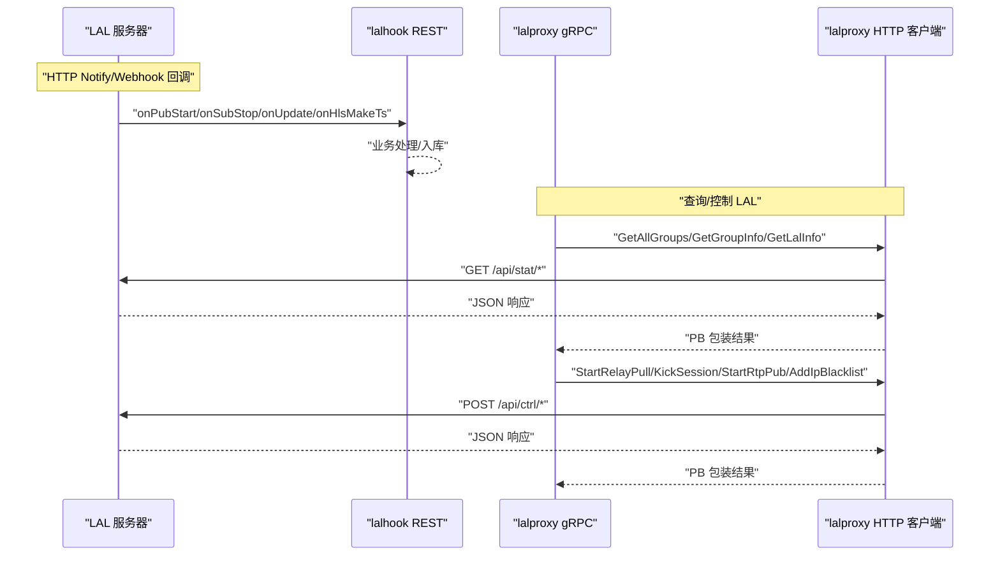
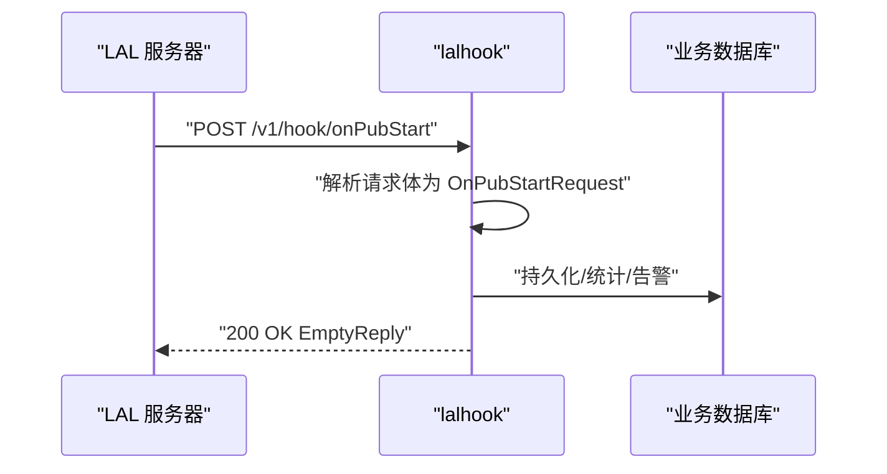
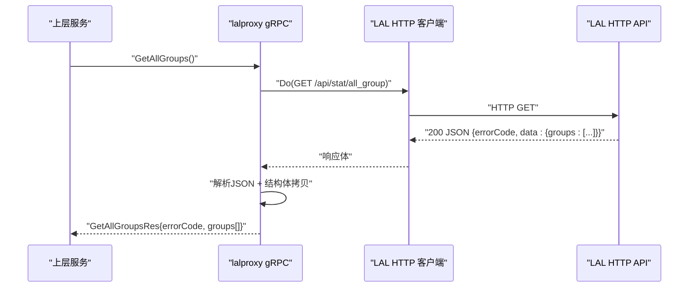
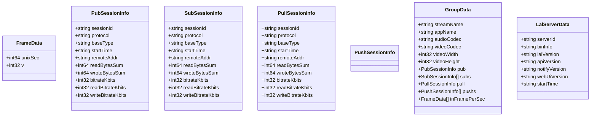
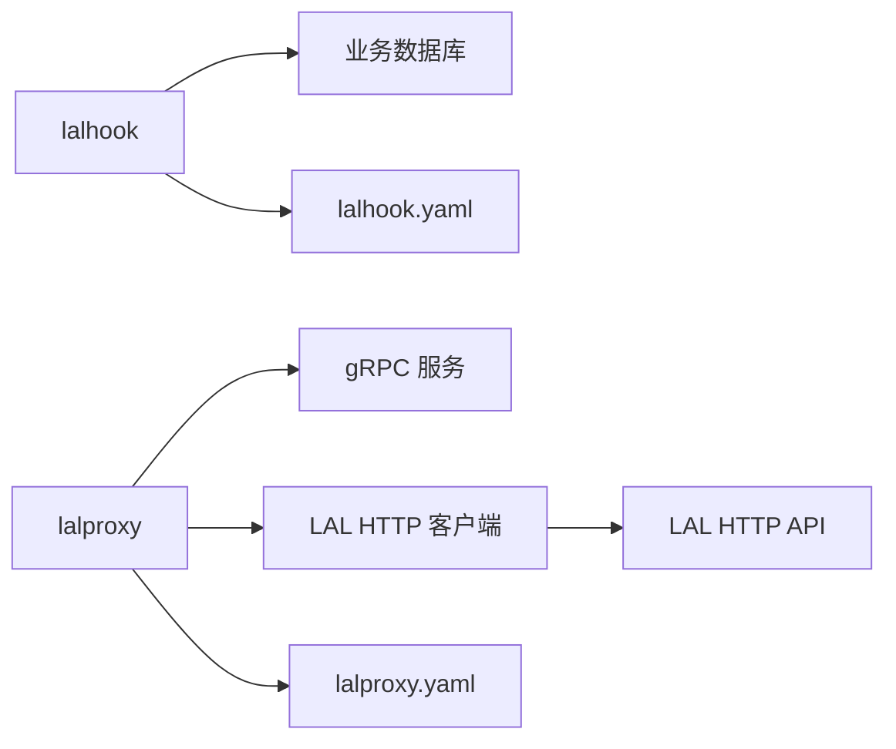

# 直播协议处理

<cite>
**本文引用的文件**
- [common/lalx/laltype.go](file://common/lalx/laltype.go)
- [app/lalhook/lalhook.go](file://app/lalhook/lalhook.go)
- [app/lalhook/etc/lalhook.yaml](file://app/lalhook/etc/lalhook.yaml)
- [app/lalhook/internal/config/config.go](file://app/lalhook/internal/config/config.go)
- [app/lalhook/internal/handler/routes.go](file://app/lalhook/internal/handler/routes.go)
- [app/lalhook/lalhook.api](file://app/lalhook/lalhook.api)
- [app/lalhook/internal/logic/webhook/onpubstartlogic.go](file://app/lalhook/internal/logic/webhook/onpubstartlogic.go)
- [app/lalhook/internal/logic/webhook/onsubstoplogic.go](file://app/lalhook/internal/logic/webhook/onsubstoplogic.go)
- [app/lalproxy/lalproxy.go](file://app/lalproxy/lalproxy.go)
- [app/lalproxy/etc/lalproxy.yaml](file://app/lalproxy/etc/lalproxy.yaml)
- [app/lalproxy/internal/config/config.go](file://app/lalproxy/internal/config/config.go)
- [app/lalproxy/internal/server/lalproxyserver.go](file://app/lalproxy/internal/server/lalproxyserver.go)
- [app/lalproxy/lalproxy.proto](file://app/lalproxy/lalproxy.proto)
- [app/lalproxy/internal/logic/getallgroupslogic.go](file://app/lalproxy/internal/logic/getallgroupslogic.go)
- [app/lalproxy/internal/logic/startrelaypulllogic.go](file://app/lalproxy/internal/logic/startrelaypulllogic.go)
</cite>

## 目录
1. [简介](#简介)
2. [项目结构](#项目结构)
3. [核心组件](#核心组件)
4. [架构总览](#架构总览)
5. [详细组件分析](#详细组件分析)
6. [依赖分析](#依赖分析)
7. [性能考虑](#性能考虑)
8. [故障排查指南](#故障排查指南)
9. [结论](#结论)
10. [附录](#附录)

## 简介
本技术文档围绕 Zero-Service 的直播协议处理工具进行系统化梳理，重点覆盖以下方面：
- LALx 工具的直播协议处理能力：RTMP、HLS、HTTP-FLV 等协议的接收、转发、录制与播放链路的集成方式
- 直播流的接收、转发、录制与播放：基于 LAL（Lean Audio Video）框架的 HTTP Notify/Webhook 与 HTTP API 的联动
- 协议转换与流媒体服务器集成：通过 lalhook 接收 LAL 通知，通过 lalproxy 将 LAL HTTP API 能力映射为 gRPC 接口
- 实时传输优化策略：基于会话统计、帧率统计、码率监控与黑名单控制的运行期优化
- 架构设计与部署指南：包含负载均衡、高可用与性能监控建议
- 与 LAL 框架的集成与扩展：以 lalhook 与 lalproxy 为核心，结合配置与服务注册实现可扩展的直播处理体系

## 项目结构
本项目围绕两个关键应用展开：
- lalhook：接收 LAL 的 HTTP Notify/Webhook 回调，用于统计、日志与二次开发
- lalproxy：将 LAL 的 HTTP API 能力封装为 gRPC 接口，便于上层系统统一调用

```mermaid
graph TB
subgraph "LAL 服务器"
LAL["LAL(HTTP API)<br/>/api/stat, /api/ctrl"]
end
subgraph "Zero-Service"
subgraph "lalhook"
HK_API["REST API<br/>/v1/hook, /v1/api"]
HK_DB["业务数据库"]
end
subgraph "lalproxy"
GPB["gRPC 服务<br/>lalProxy"]
LAL_CLI["LAL HTTP 客户端"]
end
end
LAL <- --> HK_API
HK_API --> HK_DB
GPB <- --> LAL_CLI
LAL_CLI --> LAL
```

图表来源
- [app/lalhook/internal/handler/routes.go:17-96](file://app/lalhook/internal/handler/routes.go#L17-L96)
- [app/lalproxy/internal/server/lalproxyserver.go:26-79](file://app/lalproxy/internal/server/lalproxyserver.go#L26-L79)
- [app/lalproxy/internal/logic/getallgroupslogic.go:31-88](file://app/lalproxy/internal/logic/getallgroupslogic.go#L31-L88)

章节来源
- [app/lalhook/lalhook.go:19-48](file://app/lalhook/lalhook.go#L19-L48)
- [app/lalproxy/lalproxy.go:27-70](file://app/lalproxy/lalproxy.go#L27-L70)

## 核心组件
- LALx 数据模型：定义了帧率、发布/订阅/中继会话、分组信息与服务器基础信息等结构，用于在 lalhook 与 lalproxy 之间传递与转换
- lalhook：提供 REST API，接收 LAL 的 onPubStart/onSubStop/onUpdate/onHlsMakeTs 等回调，并暴露 /v1/api/ts/list 查询 TS 文件列表
- lalproxy：提供 gRPC 服务 lalProxy，封装 LAL 的 /api/stat 与 /api/ctrl 能力，包括查询分组、服务器信息、启动/停止中继拉流、踢出会话、RTP 接收端口、添加 HLS 黑名单等

章节来源
- [common/lalx/laltype.go:1-126](file://common/lalx/laltype.go#L1-L126)
- [app/lalhook/lalhook.api:200-245](file://app/lalhook/lalhook.api#L200-L245)
- [app/lalproxy/lalproxy.proto:288-308](file://app/lalproxy/lalproxy.proto#L288-L308)

## 架构总览
下图展示了 Zero-Service 如何与 LAL 协作，完成直播协议处理与控制：



图表来源
- [app/lalhook/internal/handler/routes.go:17-96](file://app/lalhook/internal/handler/routes.go#L17-L96)
- [app/lalproxy/internal/server/lalproxyserver.go:26-79](file://app/lalproxy/internal/server/lalproxyserver.go#L26-L79)
- [app/lalproxy/internal/logic/getallgroupslogic.go:31-88](file://app/lalproxy/internal/logic/getallgroupslogic.go#L31-L88)
- [app/lalproxy/internal/logic/startrelaypulllogic.go:49-93](file://app/lalproxy/internal/logic/startrelaypulllogic.go#L49-L93)

## 详细组件分析

### 组件一：lalhook（Webhook 接收与 TS 文件查询）
- 职责
  - 接收 LAL 的 HTTP Notify/Webhook 回调，包括推流开始、拉流开始/停止、回源拉流开始/停止、RTMP 连接、服务器启动、HLS 分片生成等
  - 提供 /v1/api/ts/list 接口，按时间区间查询 TS 文件列表，便于录制管理与回放检索
- 关键路由
  - /v1/hook/onPubStart、/onSubStart、/onSubStop、/onRelayPullStart、/onRelayPullStop、/onRtmpConnect、/onServerStart、/onUpdate、/onHlsMakeTs
  - /v1/api/ts/list
- 处理流程（以 onPubStart 为例）
  - 解析请求体为 OnPubStartRequest
  - 业务逻辑占位，后续可接入统计、告警、录制触发等



图表来源
- [app/lalhook/internal/handler/routes.go:31-92](file://app/lalhook/internal/handler/routes.go#L31-L92)
- [app/lalhook/lalhook.api:72-87](file://app/lalhook/lalhook.api#L72-L87)

章节来源
- [app/lalhook/lalhook.go:19-48](file://app/lalhook/lalhook.go#L19-L48)
- [app/lalhook/etc/lalhook.yaml:1-10](file://app/lalhook/etc/lalhook.yaml#L1-L10)
- [app/lalhook/internal/config/config.go:5-10](file://app/lalhook/internal/config/config.go#L5-L10)
- [app/lalhook/internal/handler/routes.go:17-96](file://app/lalhook/internal/handler/routes.go#L17-L96)
- [app/lalhook/lalhook.api:200-245](file://app/lalhook/lalhook.api#L200-L245)
- [app/lalhook/internal/logic/webhook/onpubstartlogic.go:18-31](file://app/lalhook/internal/logic/webhook/onpubstartlogic.go#L18-L31)
- [app/lalhook/internal/logic/webhook/onsubstoplogic.go:18-31](file://app/lalhook/internal/logic/webhook/onsubstoplogic.go#L18-L31)

### 组件二：lalproxy（LAL HTTP API 的 gRPC 映射）
- 职责
  - 将 LAL 的 /api/stat 与 /api/ctrl 能力封装为 gRPC 接口，便于上层系统统一调用
  - 通过内部 HTTP 客户端访问 LAL 的 HTTP API，并将 JSON 响应转换为 PB 结构
- 关键 RPC
  - GetGroupInfo、GetAllGroups、GetLalInfo：查询类
  - StartRelayPull、StopRelayPull、KickSession、StartRtpPub、StopRtpPub、AddIpBlacklist：控制类
- 处理流程（以 GetAllGroups 为例）
  - 构造 LAL HTTP API URL
  - 发起 GET 请求
  - 校验状态码、读取响应体、解析 JSON
  - 使用结构体拷贝将 lalx.GroupData 转换为 PB GroupData 并返回



图表来源
- [app/lalproxy/internal/server/lalproxyserver.go:31-36](file://app/lalproxy/internal/server/lalproxyserver.go#L31-L36)
- [app/lalproxy/internal/logic/getallgroupslogic.go:31-88](file://app/lalproxy/internal/logic/getallgroupslogic.go#L31-L88)

章节来源
- [app/lalproxy/lalproxy.go:27-70](file://app/lalproxy/lalproxy.go#L27-L70)
- [app/lalproxy/etc/lalproxy.yaml:1-19](file://app/lalproxy/etc/lalproxy.yaml#L1-L19)
- [app/lalproxy/internal/config/config.go:5-25](file://app/lalproxy/internal/config/config.go#L5-L25)
- [app/lalproxy/internal/server/lalproxyserver.go:26-79](file://app/lalproxy/internal/server/lalproxyserver.go#L26-L79)
- [app/lalproxy/lalproxy.proto:288-308](file://app/lalproxy/lalproxy.proto#L288-L308)
- [app/lalproxy/internal/logic/getallgroupslogic.go:31-88](file://app/lalproxy/internal/logic/getallgroupslogic.go#L31-L88)
- [app/lalproxy/internal/logic/startrelaypulllogic.go:49-93](file://app/lalproxy/internal/logic/startrelaypulllogic.go#L49-L93)

### 组件三：LALx 数据模型（跨模块共享）
- 作用
  - 统一帧率、会话、分组与服务器信息的数据结构，确保 lalhook 与 lalproxy 在数据层面的一致性
- 关键结构
  - FrameData、PubSessionInfo、SubSessionInfo、PullSessionInfo、PushSessionInfo、GroupData、LalServerData



图表来源
- [common/lalx/laltype.go:3-126](file://common/lalx/laltype.go#L3-L126)

章节来源
- [common/lalx/laltype.go:1-126](file://common/lalx/laltype.go#L1-L126)

## 依赖分析
- lalhook 依赖
  - REST 框架：接收 LAL 的 HTTP Notify/Webhook
  - 数据库：持久化 TS 文件列表与业务统计
- lalproxy 依赖
  - gRPC 服务：对外提供统一接口
  - LAL HTTP 客户端：访问 LAL 的 /api/stat 与 /api/ctrl
  - 结构体拷贝：将 LALx 数据模型转换为 PB 消息
- 配置
  - lalhook：REST 配置、数据库连接
  - lalproxy：gRPC 监听、日志、Nacos 注册、LAL 服务器地址与超时



图表来源
- [app/lalhook/etc/lalhook.yaml:1-10](file://app/lalhook/etc/lalhook.yaml#L1-L10)
- [app/lalproxy/etc/lalproxy.yaml:1-19](file://app/lalproxy/etc/lalproxy.yaml#L1-L19)

章节来源
- [app/lalhook/etc/lalhook.yaml:1-10](file://app/lalhook/etc/lalhook.yaml#L1-L10)
- [app/lalproxy/etc/lalproxy.yaml:1-19](file://app/lalproxy/etc/lalproxy.yaml#L1-L19)

## 性能考虑
- 会话与帧率监控
  - 通过 lalhook 的 onUpdate 回调与 lalproxy 的查询接口，周期性获取 GroupData 与帧率统计，辅助动态调度与资源预警
- 码率与带宽优化
  - 基于 Pub/Sub/Pull 的码率指标，结合业务侧限速策略，避免过载
- HLS 黑名单
  - 通过 AddIpBlacklist 控制 HLS 播放端的异常 IP，降低无效流量
- 录制与回放
  - 通过 /v1/api/ts/list 按时间区间查询 TS 文件，支撑录制归档与回放检索
- 传输优化
  - 对于 RTSP 拉流，合理设置 rtspMode、pullTimeoutMs、pullRetryNum，提升稳定性
  - 对于 RTP 接收，合理设置端口与超时，避免僵尸端口占用

## 故障排查指南
- 常见错误码与定位
  - LAL API 返回非 200：检查 LAL 服务器状态与网络连通性
  - 参数缺失/非法：核对请求体字段（如 streamName、sessionId、url 等）
  - 会话不存在：确认会话 ID 来源与生命周期
- 日志与追踪
  - lalhook：关注回调处理日志与数据库写入
  - lalproxy：关注 HTTP 客户端调用日志、状态码与响应解析
- 建议流程
  - 确认 LAL 服务器可达与端口开放
  - 校验 lalhook/lalproxy 的配置文件（主机、端口、超时、数据库连接）
  - 使用最小化请求复现问题，逐步缩小范围

章节来源
- [app/lalproxy/internal/logic/getallgroupslogic.go:36-48](file://app/lalproxy/internal/logic/getallgroupslogic.go#L36-L48)
- [app/lalproxy/internal/logic/startrelaypulllogic.go:57-69](file://app/lalproxy/internal/logic/startrelaypulllogic.go#L57-L69)

## 结论
本方案以 lalhook 与 lalproxy 为核心，构建了面向 LAL 的直播协议处理与控制体系：
- lalhook 负责接收 LAL 的 Webhook 回调与提供 TS 文件查询接口，满足统计、日志与录制管理需求
- lalproxy 将 LAL 的 HTTP API 能力映射为 gRPC，便于上层系统统一编排与扩展
- 通过会话统计、帧率统计、码率监控与黑名单控制，实现运行期优化与风险隔离
- 结合合理的配置与部署策略，可支撑高并发直播场景下的稳定运行

## 附录
- 配置要点
  - lalhook：Host/Port、超时、数据库连接
  - lalproxy：ListenOn、日志级别、Nacos 注册、LAL 服务器地址与超时
- 扩展建议
  - 在 lalhook 中完善 onPubStart/onSubStop 等回调的业务逻辑，接入告警与录制触发
  - 在 lalproxy 中增加鉴权、熔断与重试策略，增强鲁棒性
  - 引入指标采集与可视化，配合 onUpdate 回调实现动态扩缩容