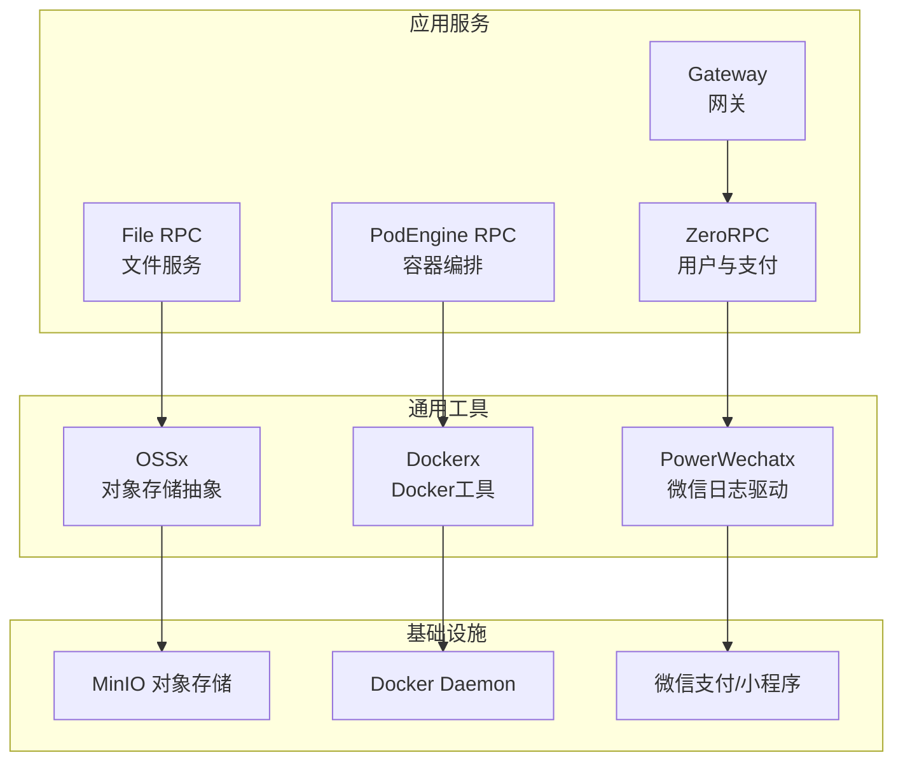
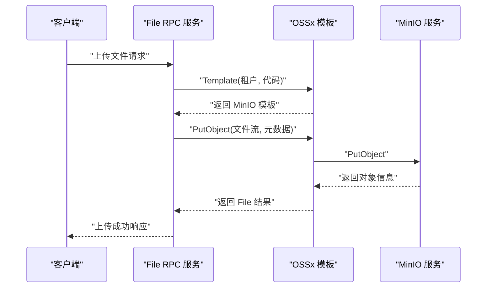
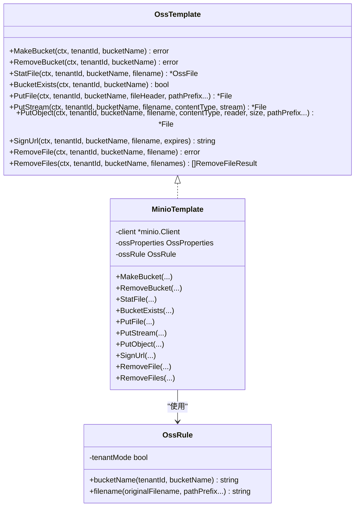
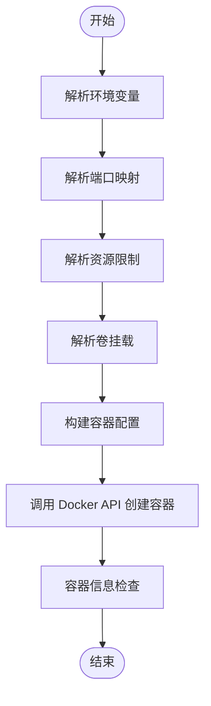
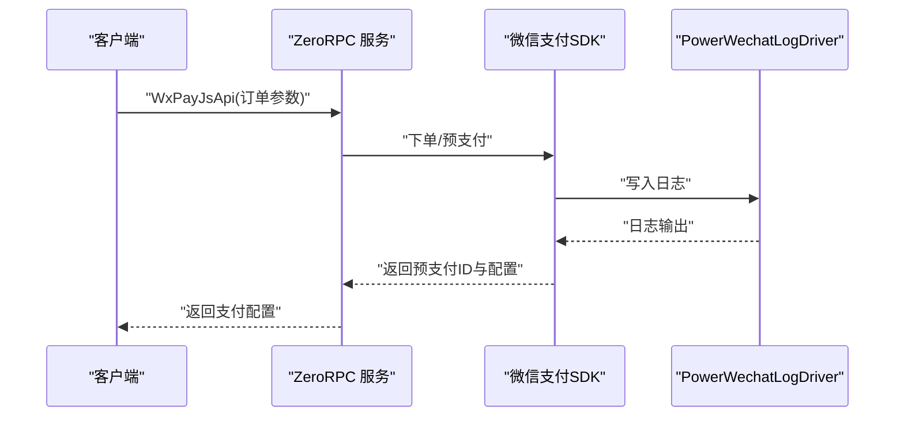
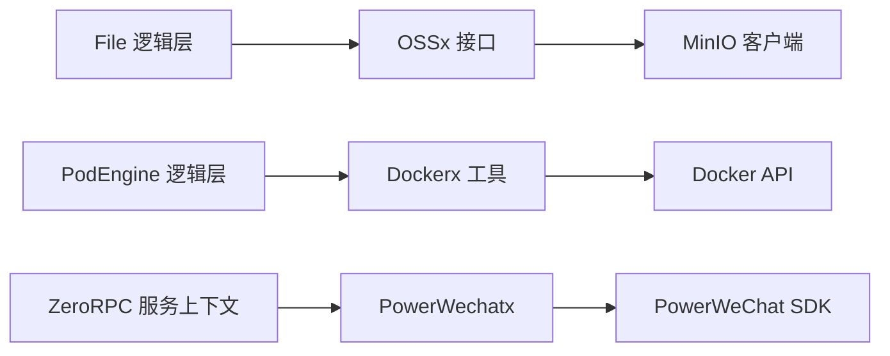

# 存储网络工具

<cite>
**本文档引用的文件**
- [ossx.go](file://common/ossx/ossx.go)
- [minio_oss.go](file://common/ossx/minio_oss.go)
- [ossconfig.go](file://common/ossx/osssconfig/ossconfig.go)
- [dockerx.go](file://common/dockerx/dockerx.go)
- [types.go](file://common/powerwechatx/types.go)
- [putfilelogic.go](file://app/file/internal/logic/putfilelogic.go)
- [signurllogic.go](file://app/file/internal/logic/signurllogic.go)
- [file.yaml](file://app/file/etc/file.yaml)
- [createpodlogic.go](file://app/podengine/internal/logic/createpodlogic.go)
- [wxpayjsapilogic.go](file://zerorpc/internal/logic/wxpayjsapilogic.go)
- [servicecontext.go](file://zerorpc/internal/svc/servicecontext.go)
- [servicecontext.go](file://gtw/internal/svc/servicecontext.go)
- [tool.go](file://common/tool/tool.go)
- [ossmodel.go](file://model/ossmodel.go)
- [file.proto](file://app/file/file.proto)
- [zerorpc.proto](file://zerorpc/zerorpc.proto)
</cite>

## 目录
1. [简介](#简介)
2. [项目结构](#项目结构)
3. [核心组件](#核心组件)
4. [架构总览](#架构总览)
5. [详细组件分析](#详细组件分析)
6. [依赖分析](#依赖分析)
7. [性能考虑](#性能考虑)
8. [故障排查指南](#故障排查指南)
9. [结论](#结论)
10. [附录](#附录)

## 简介
本技术文档聚焦 Zero-Service 中的三大网络与存储工具：OSSx 对象存储工具、Dockerx 容器工具以及 PowerWechatx 微信工具。文档系统性阐述各工具的设计理念、接口能力、数据模型、使用流程与最佳实践，并提供可直接落地到业务中的示例路径与参考实现。

- OSSx：统一抽象对象存储模板接口，当前实现基于 MinIO，提供存储桶管理、文件上传下载、URL 签名与批量删除等能力；支持租户模式与多存储后端扩展点。
- Dockerx：封装 Docker 客户端常用解析与构建函数，便于在 Pod 引擎中快速构建容器运行时配置。
- PowerWechatx：适配微信生态日志驱动，支撑小程序与支付模块的日志统一输出。

## 项目结构
围绕存储网络工具的相关目录与文件组织如下：
- common/ossx：对象存储抽象与 MinIO 实现
- common/dockerx：Docker 客户端工具函数
- common/powerwechatx：微信日志驱动
- app/file：文件服务 RPC 与逻辑层，演示 OSSx 的典型用法
- app/podengine：容器编排服务，演示 Dockerx 的典型用法
- zerorpc/gtw：微信小程序与支付服务，演示 PowerWechatx 的典型用法
- model：数据库模型，包括 OSS 配置模型
- 配置文件：app/file/etc/file.yaml、zerorpc/etc/zerorpc.yaml 等

**图表来源**
- [ossx.go:1-152](file://common/ossx/ossx.go#L1-L152)
- [minio_oss.go:1-243](file://common/ossx/minio_oss.go#L1-L243)
- [dockerx.go:1-95](file://common/dockerx/dockerx.go#L1-L95)
- [types.go:1-66](file://common/powerwechatx/types.go#L1-L66)
- [createpodlogic.go:1-288](file://app/podengine/internal/logic/createpodlogic.go#L1-L288)
- [putfilelogic.go:1-78](file://app/file/internal/logic/putfilelogic.go#L1-L78)
- [wxpayjsapilogic.go:1-100](file://zerorpc/internal/logic/wxpayjsapilogic.go#L1-L100)

**章节来源**
- [ossx.go:1-152](file://common/ossx/ossx.go#L1-L152)
- [dockerx.go:1-95](file://common/dockerx/dockerx.go#L1-L95)
- [types.go:1-66](file://common/powerwechatx/types.go#L1-L66)

## 核心组件
本节对三大工具的核心接口、数据结构与职责边界进行深入剖析。

- OSSx 对象存储工具
  - 抽象接口：提供创建/删除存储桶、文件状态查询、存在性检查、文件上传（表单/流/Reader）、URL 签名、单/批量删除等能力。
  - 当前实现：MinIOTemplate，封装 minio-go 客户端，支持租户模式下的桶命名规则与文件名生成策略。
  - 配置与池化：通过模板工厂函数按租户维度缓存模板实例，避免重复初始化。
  - 数据模型：File、OssFile、RemoveFileResult 等用于跨层传递文件元数据与操作结果。

- Dockerx 容器工具
  - 客户端封装：MustNewClient 基于 OpenTelemetry 注入追踪 Provider。
  - 配置解析：环境变量解析、端口映射提取、卷挂载解析、资源限制解析、资源列表构建等。
  - 用途：在 PodEngine 中将上层 Pod 规约转换为 Docker 客户端可理解的容器配置。

- PowerWechatx 微信工具
  - 日志驱动：实现微信 SDK 所需的 Logger 接口，将日志桥接到 go-zero 的 logx，支持上下文传播。
  - 用途：在 ZeroRPC 与 Gateway 中为微信小程序与支付模块提供统一日志输出。

**章节来源**
- [ossx.go:28-92](file://common/ossx/ossx.go#L28-L92)
- [minio_oss.go:20-243](file://common/ossx/minio_oss.go#L20-L243)
- [dockerx.go:11-95](file://common/dockerx/dockerx.go#L11-L95)
- [types.go:9-66](file://common/powerwechatx/types.go#L9-L66)

## 架构总览
下图展示了 OSSx、Dockerx、PowerWechatx 在系统中的交互位置与调用关系：

**图表来源**
- [putfilelogic.go:33-77](file://app/file/internal/logic/putfilelogic.go#L33-L77)
- [ossx.go:109-151](file://common/ossx/ossx.go#L109-L151)
- [minio_oss.go:124-148](file://common/ossx/minio_oss.go#L124-L148)

## 详细组件分析

### OSSx 对象存储工具
- 设计要点
  - 模板工厂：按租户维度缓存模板实例，减少重复初始化开销。
  - 租户模式：支持在桶名前缀加入租户 ID，实现多租户隔离。
  - 文件命名：基于 UUID 与日期生成唯一文件名，支持自定义路径前缀。
  - MinIO 实现：封装 PutObject、StatObject、PresignedGetObject、RemoveObject/RemoveObjects 等常用操作。
- 关键接口与流程
  - Template：根据租户与代码获取 OSS 配置，选择 MinIO 模板并缓存。
  - PutObject/PutFile/PutStream：支持多种输入源，自动设置 Content-Type 并返回标准化 File 结果。
  - SignUrl：生成带过期时间的预签名 URL。
  - RemoveFile/RemoveFiles：单文件与批量删除，收集失败项并按输入顺序返回结果。
- 数据模型
  - OssProperties：存储 Endpoint、AccessKey、SecretKey、BucketName 等配置。
  - File/OssFile：标准化文件元数据，便于跨层传输。
  - RemoveFileResult：批量删除结果条目。

**图表来源**
- [ossx.go:28-92](file://common/ossx/ossx.go#L28-L92)
- [minio_oss.go:20-243](file://common/ossx/minio_oss.go#L20-L243)

- 使用示例与最佳实践
  - 文件上传：在 File RPC 的逻辑层调用 Template 获取模板，然后调用 PutObject/PutStream/PutFile，最后将结果转换为 PB 类型返回。
  - URL 签名：在逻辑层校验参数后，调用 SignUrl 生成临时访问链接，默认有效期为 1 小时，可通过请求参数覆盖。
  - 批量删除：调用 RemoveFiles，遍历结果收集失败项，保证幂等与可观测性。
  - 租户模式：通过配置文件开启 Oss.TenantMode，确保桶名与文件名具备租户隔离。
  - 文件名策略：可自定义 pathPrefix 控制文件存放目录，避免冲突。

**章节来源**
- [putfilelogic.go:33-77](file://app/file/internal/logic/putfilelogic.go#L33-L77)
- [signurllogic.go:29-60](file://app/file/internal/logic/signurllogic.go#L29-L60)
- [ossx.go:109-151](file://common/ossx/ossx.go#L109-L151)
- [minio_oss.go:65-204](file://common/ossx/minio_oss.go#L65-L204)
- [file.yaml:17-19](file://app/file/etc/file.yaml#L17-L19)

### Dockerx 容器工具
- 设计要点
  - 客户端初始化：MustNewClient 自动注入 OpenTelemetry TracerProvider，便于链路追踪。
  - 配置解析：ParseContainerEnv、ExtractContainerPorts、ExtractContainerVolumeMounts、ParseContainerResources、BuildEnvList 等函数将字符串形式的容器配置转换为 Docker API 所需的数据结构。
- 在 PodEngine 中的应用
  - CreatePod 逻辑将上层 Pod 规约转换为 container.Config、HostConfig、NetworkingConfig 等，再调用 Docker API 创建容器。
  - 支持端口映射、资源限制、卷挂载、重启策略与网络模式等常见容器运行时参数。

**图表来源**
- [dockerx.go:20-94](file://common/dockerx/dockerx.go#L20-L94)
- [createpodlogic.go:154-287](file://app/podengine/internal/logic/createpodlogic.go#L154-L287)

**章节来源**
- [dockerx.go:11-95](file://common/dockerx/dockerx.go#L11-L95)
- [createpodlogic.go:34-152](file://app/podengine/internal/logic/createpodlogic.go#L34-L152)

### PowerWechatx 微信工具
- 设计要点
  - 日志驱动：PowerWechatLogDriver 实现微信 SDK 所需的 Logger 接口，内部委托到 logx.WithContext，支持上下文传播。
  - 在 ZeroRPC 与 Gateway 中作为微信小程序与支付模块的日志驱动，确保日志格式与级别一致。
- 集成场景
  - 小程序登录与用户信息：通过 ZeroRPC 的 MiniProgramLogin、GetUserInfo、EditUserInfo 等接口完成。
  - 微信支付：通过 WxPayJsApi 接口发起 JSAPI 支付，生成前端调起支付所需的配置。

**图表来源**
- [wxpayjsapilogic.go:37-99](file://zerorpc/internal/logic/wxpayjsapilogic.go#L37-L99)
- [types.go:9-66](file://common/powerwechatx/types.go#L9-L66)
- [servicecontext.go:35-89](file://zerorpc/internal/svc/servicecontext.go#L35-L89)

**章节来源**
- [types.go:9-66](file://common/powerwechatx/types.go#L9-L66)
- [servicecontext.go:35-89](file://zerorpc/internal/svc/servicecontext.go#L35-L89)
- [servicecontext.go:23-65](file://gtw/internal/svc/servicecontext.go#L23-L65)
- [zerorpc.proto:124-138](file://zerorpc/zerorpc.proto#L124-L138)

## 依赖分析
- 组件耦合
  - OSSx 与 MinIO：OSSx 通过接口抽象与具体实现解耦，当前实现为 MinIOTemplate。
  - Dockerx 与 Docker API：Dockerx 提供解析与构建函数，PodEngine 负责调用 Docker API。
  - PowerWechatx 与微信 SDK：PowerWechatx 仅负责日志桥接，不直接依赖业务逻辑。
- 外部依赖
  - MinIO 客户端：用于对象存储操作。
  - Docker 客户端：用于容器生命周期管理。
  - PowerWeChat SDK：用于微信小程序与支付。
- 潜在循环依赖
  - 未发现直接循环依赖；各工具通过服务层间接调用，保持清晰边界。

**图表来源**
- [ossx.go:28-41](file://common/ossx/ossx.go#L28-L41)
- [minio_oss.go:214-234](file://common/ossx/minio_oss.go#L214-L234)
- [dockerx.go:11-18](file://common/dockerx/dockerx.go#L11-L18)
- [types.go:9-17](file://common/powerwechatx/types.go#L9-L17)
- [putfilelogic.go:33-60](file://app/file/internal/logic/putfilelogic.go#L33-L60)
- [createpodlogic.go:42-45](file://app/podengine/internal/logic/createpodlogic.go#L42-L45)
- [servicecontext.go:35-51](file://zerorpc/internal/svc/servicecontext.go#L35-L51)

**章节来源**
- [ossx.go:109-151](file://common/ossx/ossx.go#L109-L151)
- [dockerx.go:11-95](file://common/dockerx/dockerx.go#L11-L95)
- [types.go:9-66](file://common/powerwechatx/types.go#L9-L66)

## 性能考虑
- OSSx
  - 模板池化：按租户维度缓存模板实例，减少重复初始化成本。
  - 批量删除：使用 RemoveObjects 并发删除，降低多次往返开销。
  - 文件名生成：UUID + 日期策略避免冲突，同时支持自定义前缀优化存储布局。
- Dockerx
  - 配置解析：将字符串配置转换为结构化数据，减少运行时解析成本。
  - 资源限制：CPUQuota、Memory 等参数精确设置，避免过度分配。
- PowerWechatx
  - 日志桥接：统一日志驱动，减少日志适配成本，提升可观测性。

## 故障排查指南
- OSSx
  - 客户端为空：validateClient 返回错误，检查模板初始化是否成功。
  - 桶不存在或权限不足：BucketExists 与 MakeBucket 调用失败，确认 Endpoint、AccessKey、SecretKey 与桶名。
  - URL 签名失败：检查过期时间与签名参数，确认 MinIO 服务可达。
  - 批量删除部分失败：遍历 RemoveFiles 返回结果，定位失败文件并重试。
- Dockerx
  - 端口映射无效：检查 hostPort/containerPort 格式与网络模式。
  - 卷挂载只读：确认挂载字符串末尾 ro 标记正确。
  - 资源限制解析失败：核对 CPU/Memory 字符串格式与单位。
- PowerWechatx
  - 日志未输出：确认 ServiceContext 中 Log.Driver 设置为 PowerWechatLogDriver。
  - 微信支付异常：检查 AppID、MchID、证书路径与 NotifyURL 配置。

**章节来源**
- [minio_oss.go:237-242](file://common/ossx/minio_oss.go#L237-L242)
- [createpodlogic.go:154-287](file://app/podengine/internal/logic/createpodlogic.go#L154-L287)
- [servicecontext.go:35-89](file://zerorpc/internal/svc/servicecontext.go#L35-L89)

## 结论
OSSx、Dockerx、PowerWechatx 三类工具分别覆盖了对象存储、容器编排与微信生态的日志桥接需求。通过接口抽象与工具函数封装，项目实现了良好的可扩展性与可维护性。结合配置文件与服务上下文，开发者可在 File、PodEngine、ZeroRPC/Gateway 等服务中快速集成并落地使用。

## 附录
- 配置参考
  - File 服务 OSS 租户模式：app/file/etc/file.yaml
  - ZeroRPC 小程序与支付配置：zerorpc/etc/zerorpc.yaml
- 数据模型参考
  - OSS 配置模型：model/ossmodel.go
  - 文件服务协议：app/file/file.proto
  - 用户与支付协议：zerorpc/zerorpc.proto
- 工具函数参考
  - 文件名生成与字节格式化：common/tool/tool.go

**章节来源**
- [file.yaml:17-19](file://app/file/etc/file.yaml#L17-L19)
- [ossmodel.go:1-32](file://model/ossmodel.go#L1-L32)
- [file.proto](file://app/file/file.proto)
- [zerorpc.proto:124-138](file://zerorpc/zerorpc.proto#L124-L138)
- [tool.go:82-88](file://common/tool/tool.go#L82-L88)