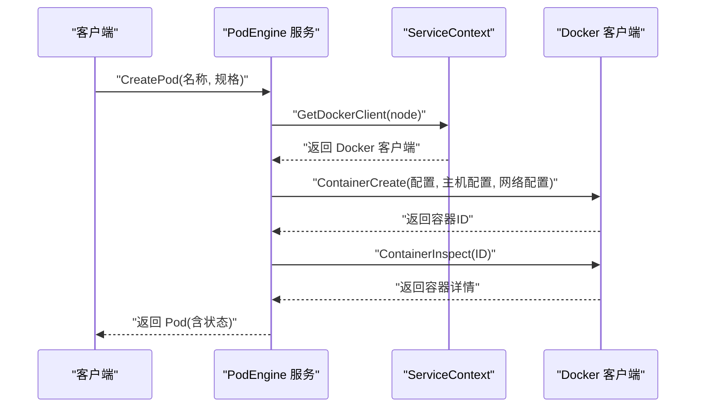
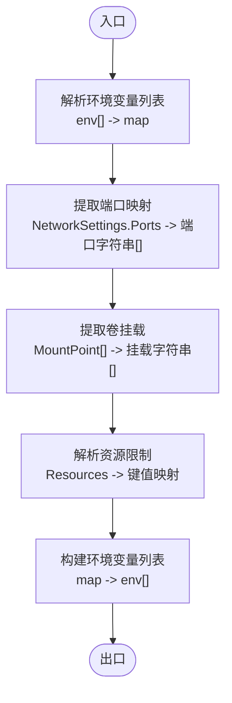
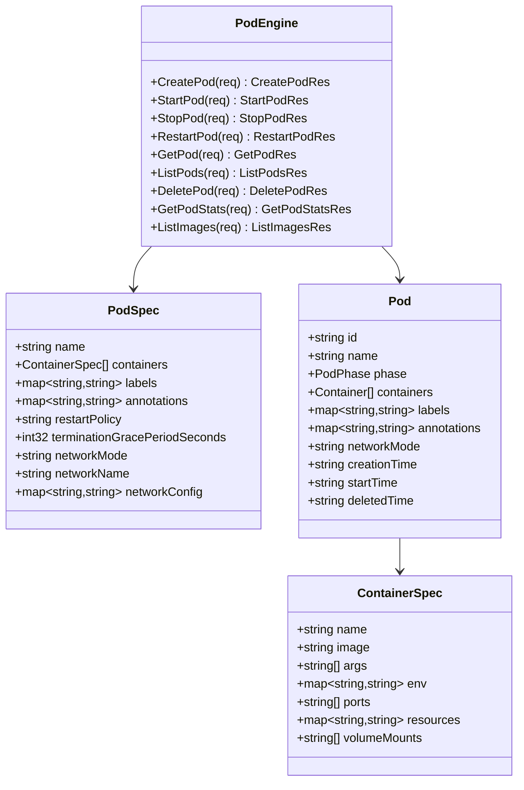
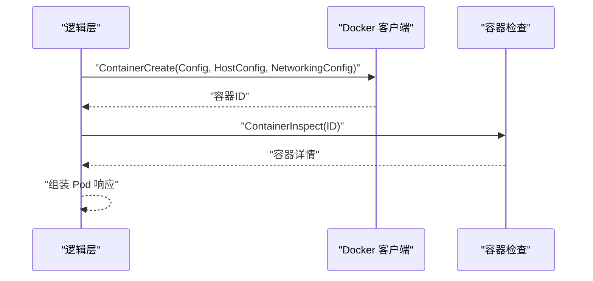
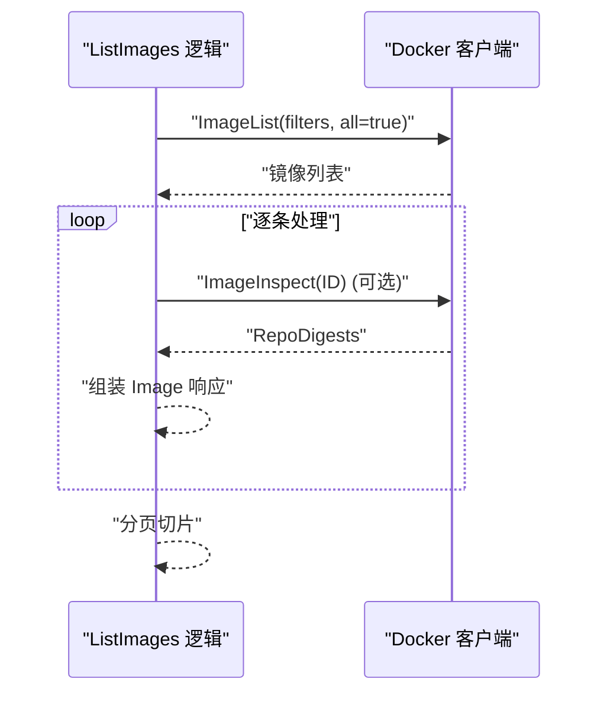
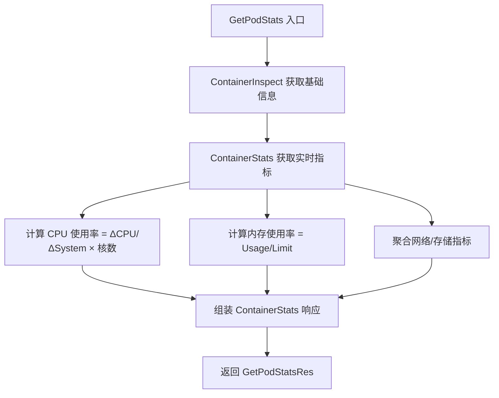
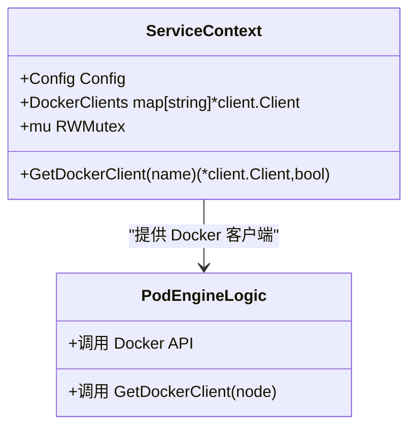
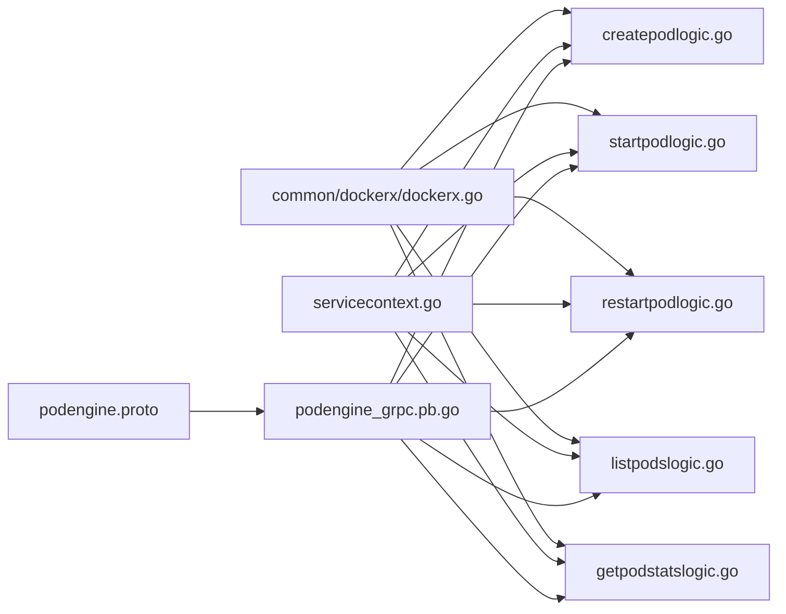

# 容器管理工具 (Dockerx)

<cite>
**本文引用的文件**
- [common/dockerx/dockerx.go](file://common/dockerx/dockerx.go)
- [app/podengine/podengine.proto](file://app/podengine/podengine.proto)
- [app/podengine/podengine_grpc.pb.go](file://app/podengine/podengine_grpc.pb.go)
- [app/podengine/internal/logic/createpodlogic.go](file://app/podengine/internal/logic/createpodlogic.go)
- [app/podengine/internal/logic/startpodlogic.go](file://app/podengine/internal/logic/startpodlogic.go)
- [app/podengine/internal/logic/stoppodlogic.go](file://app/podengine/internal/logic/stoppodlogic.go)
- [app/podengine/internal/logic/restartpodlogic.go](file://app/podengine/internal/logic/restartpodlogic.go)
- [app/podengine/internal/logic/deletepodlogic.go](file://app/podengine/internal/logic/deletepodlogic.go)
- [app/podengine/internal/logic/listpodslogic.go](file://app/podengine/internal/logic/listpodslogic.go)
- [app/podengine/internal/logic/listimageslogic.go](file://app/podengine/internal/logic/listimageslogic.go)
- [app/podengine/internal/logic/getpodstatslogic.go](file://app/podengine/internal/logic/getpodstatslogic.go)
- [app/podengine/internal/svc/servicecontext.go](file://app/podengine/internal/svc/servicecontext.go)
- [app/podengine/etc/podengine.yaml](file://app/podengine/etc/podengine.yaml)
- [util/dockeru/main.go](file://util/dockeru/main.go)
- [util/dockeru/pod-log-app.sh](file://util/dockeru/pod-log-app.sh)
- [util/main.go](file://util/main.go)
</cite>

## 目录
1. [简介](#简介)
2. [项目结构](#项目结构)
3. [核心组件](#核心组件)
4. [架构总览](#架构总览)
5. [详细组件分析](#详细组件分析)
6. [依赖分析](#依赖分析)
7. [性能考虑](#性能考虑)
8. [故障排除指南](#故障排除指南)
9. [结论](#结论)
10. [附录](#附录)

## 简介
本技术文档面向 Zero-Service 的容器管理工具 Dockerx 及其上层服务 PodEngine，系统性阐述基于 Docker API 的容器与镜像管理能力，覆盖容器生命周期（创建、启动、停止、重启、删除）、镜像列表查询、资源监控、网络与卷挂载解析、以及在微服务中通过 gRPC 集成的编排实践。文档同时提供安全与资源限制建议、故障排除清单与最佳实践，帮助读者在生产环境中稳定地使用 Dockerx 进行自动化运维。

## 项目结构
围绕 Dockerx 与 PodEngine 的相关模块组织如下：
- 公共 Docker 工具库：common/dockerx，提供 Docker 客户端初始化、环境变量解析、端口与卷挂载提取、资源限制解析等通用方法。
- PodEngine 服务：app/podengine，定义 gRPC 接口与消息模型，提供容器生命周期与镜像管理的 RPC 能力，并在内部逻辑中调用 Docker API。
- 服务上下文：app/podengine/internal/svc，负责按节点（本地/远端）管理 Docker 客户端实例。
- 配置：app/podengine/etc/podengine.yaml，定义监听地址、日志、注册中心及 Docker 主机映射。
- 辅助工具：util/dockeru 与 util/main，提供命令行辅助脚本与日志查看、容器交互等实用功能。

```mermaid
graph TB
subgraph "公共库"
DX["common/dockerx/dockerx.go"]
end
subgraph "PodEngine 服务"
PB["app/podengine/podengine.proto"]
GRPC["app/podengine/podengine_grpc.pb.go"]
SVC["app/podengine/internal/svc/servicecontext.go"]
LOGIC_CREATE["internal/logic/createpodlogic.go"]
LOGIC_START["internal/logic/startpodlogic.go"]
LOGIC_STOP["internal/logic/stoppodlogic.go"]
LOGIC_RESTART["internal/logic/restartpodlogic.go"]
LOGIC_DELETE["internal/logic/deletepodlogic.go"]
LOGIC_LISTPODS["internal/logic/listpodslogic.go"]
LOGIC_LISTIMAGES["internal/logic/listimageslogic.go"]
LOGIC_STATS["internal/logic/getpodstatslogic.go"]
end
subgraph "配置"
CFG["app/podengine/etc/podengine.yaml"]
end
subgraph "辅助工具"
UCLI["util/dockeru/main.go"]
ULOG["util/dockeru/pod-log-app.sh"]
UMAIN["util/main.go"]
end
DX --> LOGIC_CREATE
DX --> LOGIC_START
DX --> LOGIC_RESTART
DX --> LOGIC_LISTPODS
DX --> LOGIC_STATS
PB --> GRPC
GRPC --> LOGIC_CREATE
GRPC --> LOGIC_START
GRPC --> LOGIC_STOP
GRPC --> LOGIC_RESTART
GRPC --> LOGIC_DELETE
GRPC --> LOGIC_LISTPODS
GRPC --> LOGIC_LISTIMAGES
GRPC --> LOGIC_STATS
SVC --> LOGIC_CREATE
SVC --> LOGIC_START
SVC --> LOGIC_STOP
SVC --> LOGIC_RESTART
SVC --> LOGIC_DELETE
SVC --> LOGIC_LISTPODS
SVC --> LOGIC_LISTIMAGES
SVC --> LOGIC_STATS
CFG --> SVC
CFG --> GRPC
UCLI --> GRPC
ULOG --> GRPC
UMAIN --> GRPC
```

**图表来源**
- [common/dockerx/dockerx.go:1-95](file://common/dockerx/dockerx.go#L1-L95)
- [app/podengine/podengine.proto:1-299](file://app/podengine/podengine.proto#L1-L299)
- [app/podengine/podengine_grpc.pb.go:33-173](file://app/podengine/podengine_grpc.pb.go#L33-L173)
- [app/podengine/internal/svc/servicecontext.go:1-51](file://app/podengine/internal/svc/servicecontext.go#L1-L51)
- [app/podengine/etc/podengine.yaml:1-20](file://app/podengine/etc/podengine.yaml#L1-L20)
- [util/dockeru/main.go:86-288](file://util/dockeru/main.go#L86-L288)
- [util/dockeru/pod-log-app.sh:1-23](file://util/dockeru/pod-log-app.sh#L1-L23)
- [util/main.go:361-433](file://util/main.go#L361-L433)

**章节来源**
- [common/dockerx/dockerx.go:1-95](file://common/dockerx/dockerx.go#L1-L95)
- [app/podengine/etc/podengine.yaml:1-20](file://app/podengine/etc/podengine.yaml#L1-L20)

## 核心组件
- Dockerx 工具库：提供 MustNewClient、环境变量解析、端口与卷挂载提取、资源限制解析、以及反向拼装环境变量列表等方法，统一了对 Docker API 的数据转换与格式化。
- PodEngine gRPC 服务：定义容器生命周期（创建、启动、停止、重启、删除、查询）、镜像列表查询、容器资源统计等接口；通过 ServiceContext 支持多节点 Docker 客户端管理。
- 业务逻辑层：各 RPC 请求由对应逻辑文件处理，解析请求参数、构造 Docker API 参数、调用 Docker 客户端并返回标准化响应。
- 配置与上下文：支持本地与远端 Docker 主机映射，按 node 字段选择对应客户端；默认启用 API 版本协商与链路追踪。

**章节来源**
- [common/dockerx/dockerx.go:11-95](file://common/dockerx/dockerx.go#L11-L95)
- [app/podengine/podengine.proto:14-26](file://app/podengine/podengine.proto#L14-L26)
- [app/podengine/internal/svc/servicecontext.go:18-50](file://app/podengine/internal/svc/servicecontext.go#L18-L50)

## 架构总览
PodEngine 将“Pod/容器”的抽象与 Docker 运行时对接，屏蔽不同运行时差异（未来可适配 Kubernetes）。服务通过 gRPC 暴露统一接口，内部以 ServiceContext 管理 Docker 客户端，逻辑层负责参数校验、资源解析与 Docker API 调用。

**图表来源**
- [app/podengine/internal/logic/createpodlogic.go:34-152](file://app/podengine/internal/logic/createpodlogic.go#L34-L152)
- [app/podengine/internal/svc/servicecontext.go:42-50](file://app/podengine/internal/svc/servicecontext.go#L42-L50)

## 详细组件分析

### Dockerx 工具库
- MustNewClient：基于环境变量与 API 版本协商创建 Docker 客户端，并注入链路追踪提供者，便于可观测性。
- ParseContainerEnv/BuildEnvList：双向转换容器环境变量列表与键值映射，便于存储与传输。
- ExtractContainerPorts/ExtractContainerVolumeMounts：从 Docker 返回的网络与挂载结构中提取人类可读的端口与卷挂载字符串。
- ParseContainerResources：将 Docker 资源限制（CPUQuota/Memory/CPUShares/MemoryReservation）转换为统一的键值映射，便于前端展示与比较。

**图表来源**
- [common/dockerx/dockerx.go:20-94](file://common/dockerx/dockerx.go#L20-L94)

**章节来源**
- [common/dockerx/dockerx.go:11-95](file://common/dockerx/dockerx.go#L11-L95)

### PodEngine gRPC 接口与消息模型
- 服务定义：PodEngine 提供创建、启动、停止、重启、删除、查询单个 Pod、列出 Pod、获取 Pod 统计、列出镜像等 RPC。
- Pod/Container 模型：抽象 Pod 阶段（Pending/Running/Succeeded/Failed/Stopped/Unknown），容器状态与资源统计字段完整。
- 请求/响应：每个 RPC 带有 node 字段（默认 local），支持分页与过滤（如 ListPods 的 ids/names/labels）。

**图表来源**
- [app/podengine/podengine.proto:14-299](file://app/podengine/podengine.proto#L14-L299)

**章节来源**
- [app/podengine/podengine.proto:14-299](file://app/podengine/podengine.proto#L14-L299)
- [app/podengine/podengine_grpc.pb.go:33-173](file://app/podengine/podengine_grpc.pb.go#L33-L173)

### 容器生命周期管理
- 创建（CreatePod）：校验请求，解析容器规格（镜像、环境、命令、标签、端口、资源、卷挂载、重启策略、终止宽限期），构造 Docker Config/HostConfig/NetworkingConfig 并创建容器；随后检查容器信息返回标准化 Pod。
- 启动（StartPod）：调用容器启动，随后检查容器信息，填充运行态字段（Running/StartedAt/Ports/Env/Args/Resources/Mounts）。
- 停止（StopPod）：调用容器停止，随后检查容器信息确认状态。
- 重启（RestartPod）：调用容器重启，随后检查容器信息返回最新运行态。
- 删除（DeletePod）：根据 force/removeVolumes 参数调用容器删除。

**图表来源**
- [app/podengine/internal/logic/createpodlogic.go:34-152](file://app/podengine/internal/logic/createpodlogic.go#L34-L152)
- [app/podengine/internal/logic/startpodlogic.go:29-87](file://app/podengine/internal/logic/startpodlogic.go#L29-L87)
- [app/podengine/internal/logic/stoppodlogic.go:28-48](file://app/podengine/internal/logic/stoppodlogic.go#L28-L48)
- [app/podengine/internal/logic/restartpodlogic.go:30-83](file://app/podengine/internal/logic/restartpodlogic.go#L30-L83)
- [app/podengine/internal/logic/deletepodlogic.go:28-49](file://app/podengine/internal/logic/deletepodlogic.go#L28-L49)

**章节来源**
- [app/podengine/internal/logic/createpodlogic.go:34-152](file://app/podengine/internal/logic/createpodlogic.go#L34-L152)
- [app/podengine/internal/logic/startpodlogic.go:29-87](file://app/podengine/internal/logic/startpodlogic.go#L29-L87)
- [app/podengine/internal/logic/stoppodlogic.go:28-48](file://app/podengine/internal/logic/stoppodlogic.go#L28-L48)
- [app/podengine/internal/logic/restartpodlogic.go:30-83](file://app/podengine/internal/logic/restartpodlogic.go#L30-L83)
- [app/podengine/internal/logic/deletepodlogic.go:28-49](file://app/podengine/internal/logic/deletepodlogic.go#L28-L49)

### 镜像管理
- 列表查询（ListImages）：支持按 references 过滤、分页 offset/limit、可选返回 digests；通过镜像 inspect 获取 RepoDigests，统一显示 CreatedAt 与 Size。

**图表来源**
- [app/podengine/internal/logic/listimageslogic.go:30-110](file://app/podengine/internal/logic/listimageslogic.go#L30-L110)

**章节来源**
- [app/podengine/internal/logic/listimageslogic.go:30-110](file://app/podengine/internal/logic/listimageslogic.go#L30-L110)

### 容器信息获取与资源监控
- 信息获取（GetPod）：通过容器 ID 检索容器详情，返回 Pod 结构。
- 资源监控（GetPodStats）：获取容器 stats JSON，计算 CPU 使用率百分比、内存使用率、网络收发字节、存储读写字节，并返回带单位显示的指标。

**图表来源**
- [app/podengine/internal/logic/getpodstatslogic.go:32-133](file://app/podengine/internal/logic/getpodstatslogic.go#L32-L133)

**章节来源**
- [app/podengine/internal/logic/getpodstatslogic.go:32-133](file://app/podengine/internal/logic/getpodstatslogic.go#L32-L133)

### 网络与卷挂载管理
- 网络模式：支持 bridge/host/none 与自定义网络名称；当非 host/none 时解析端口映射。
- 卷挂载：解析 bind 挂载字符串（host:container[:ro]），构造 Docker Mount 结构。
- 环境变量：支持 env 键值对与 env 列表互转，便于配置注入与展示。

**章节来源**
- [app/podengine/internal/logic/createpodlogic.go:154-287](file://app/podengine/internal/logic/createpodlogic.go#L154-L287)
- [common/dockerx/dockerx.go:20-94](file://common/dockerx/dockerx.go#L20-L94)

### 多节点 Docker 客户端管理
- ServiceContext：默认注册本地 Docker 客户端；若配置中存在 DockerConfig，则按名称注册多个远端 Docker 客户端；GetDockerClient 支持 node 选择，默认 local。
- 配置样例：etc/podengine.yaml 中包含 DockerConfig 映射，便于跨主机管理。

**图表来源**
- [app/podengine/internal/svc/servicecontext.go:11-50](file://app/podengine/internal/svc/servicecontext.go#L11-L50)

**章节来源**
- [app/podengine/internal/svc/servicecontext.go:18-50](file://app/podengine/internal/svc/servicecontext.go#L18-L50)
- [app/podengine/etc/podengine.yaml:19-20](file://app/podengine/etc/podengine.yaml#L19-L20)

### 日志查看与容器交互
- 命令行工具：util/dockeru/main.go 提供镜像与容器列表查看、交互式选择与执行动作的能力。
- 日志查看脚本：util/dockeru/pod-log-app.sh 展示如何在 Kubernetes 环境下选择 Pod 并查看日志（可类推到 Docker 场景）。
- Compose 日志：util/main.go 提供通过 docker compose 查看服务日志与进入容器的便捷命令。

**章节来源**
- [util/dockeru/main.go:86-288](file://util/dockeru/main.go#L86-L288)
- [util/dockeru/pod-log-app.sh:1-23](file://util/dockeru/pod-log-app.sh#L1-L23)
- [util/main.go:361-433](file://util/main.go#L361-L433)

## 依赖分析
- 组件内聚与耦合：
  - ServiceContext 与逻辑层松耦合，通过 GetDockerClient 解耦节点选择与 Docker API 调用。
  - Dockerx 工具库被多逻辑复用，形成通用数据转换层。
- 外部依赖：
  - Docker SDK（github.com/docker/docker）：用于容器与镜像管理。
  - Go Zero（github.com/zeromicro/go-zero）：日志、验证与 RPC 框架。
  - OpenTelemetry：链路追踪集成。

**图表来源**
- [common/dockerx/dockerx.go:1-95](file://common/dockerx/dockerx.go#L1-L95)
- [app/podengine/internal/svc/servicecontext.go:1-51](file://app/podengine/internal/svc/servicecontext.go#L1-L51)
- [app/podengine/podengine.proto:1-299](file://app/podengine/podengine.proto#L1-L299)
- [app/podengine/podengine_grpc.pb.go:33-173](file://app/podengine/podengine_grpc.pb.go#L33-L173)

**章节来源**
- [common/dockerx/dockerx.go:1-95](file://common/dockerx/dockerx.go#L1-L95)
- [app/podengine/internal/svc/servicecontext.go:1-51](file://app/podengine/internal/svc/servicecontext.go#L1-L51)

## 性能考虑
- 资源限制解析：CPU 与内存限制采用 Docker 原生字段，解析后以统一键值返回，便于前端展示与对比，避免重复计算。
- 统计指标计算：GetPodStats 使用两次采样差值计算 CPU 使用率，减少瞬时波动影响；内存使用率直接使用 limit，避免不必要的系统调用。
- 列表与过滤：ListPods/ListImages 支持过滤与分页，降低大集群下的网络与序列化开销。
- 客户端复用：ServiceContext 缓存多节点 Docker 客户端，避免频繁创建连接。

[本节为通用指导，不直接分析具体文件]

## 故障排除指南
- 客户端未找到节点：当 node 不存在或为空时，逻辑层会返回“node not found”，请检查配置与传参。
- 镜像过滤无效：ListImages 的 references 过滤需确保镜像引用格式正确；必要时开启 IncludeDigests 获取更精确标识。
- 端口映射冲突：创建容器时若端口已在 host 使用，Docker 会报错；请调整 hostPort 或容器端口。
- 资源限制解析失败：resources 字符串需符合解析规则（CPU 支持小数，内存支持 K/M/G/T 后缀），否则会被忽略。
- 统计数据缺失：首次调用 ContainerStats 可能因采样间隔导致 delta 为 0，属正常现象；稍后重试即可。

**章节来源**
- [app/podengine/internal/logic/createpodlogic.go:34-45](file://app/podengine/internal/logic/createpodlogic.go#L34-L45)
- [app/podengine/internal/logic/listimageslogic.go:30-55](file://app/podengine/internal/logic/listimageslogic.go#L30-L55)
- [app/podengine/internal/logic/getpodstatslogic.go:32-59](file://app/podengine/internal/logic/getpodstatslogic.go#L32-L59)

## 结论
Dockerx 与 PodEngine 将 Docker API 封装为统一的 gRPC 接口，结合 ServiceContext 的多节点客户端管理与 Dockerx 的数据转换工具，实现了容器生命周期、镜像管理、资源监控与网络/卷挂载的全栈能力。通过合理的资源限制、日志与监控策略，可在微服务场景中实现稳定高效的容器编排与自动化运维。

[本节为总结性内容，不直接分析具体文件]

## 附录

### Docker API 集成示例（微服务使用建议）
- 在微服务中引入 PodEngine 客户端，按需调用 CreatePod/StartPod/StopPod/RestartPod/DeletePod/ListPods/ListImages/GetPodStats。
- 使用 node 字段选择本地或远端 Docker 主机构建的客户端，实现跨主机编排。
- 将容器环境变量、端口与卷挂载通过 PodSpec 注入，配合 Dockerx 的解析/拼装函数保证一致性。
- 结合日志与统计接口，建立统一的可观测性平台。

**章节来源**
- [app/podengine/podengine_grpc.pb.go:33-173](file://app/podengine/podengine_grpc.pb.go#L33-L173)
- [app/podengine/internal/svc/servicecontext.go:18-50](file://app/podengine/internal/svc/servicecontext.go#L18-L50)
- [common/dockerx/dockerx.go:20-94](file://common/dockerx/dockerx.go#L20-L94)