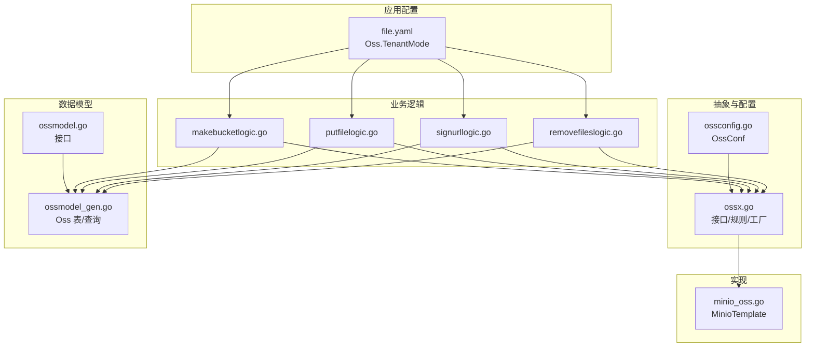
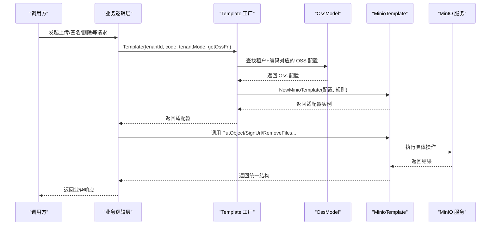
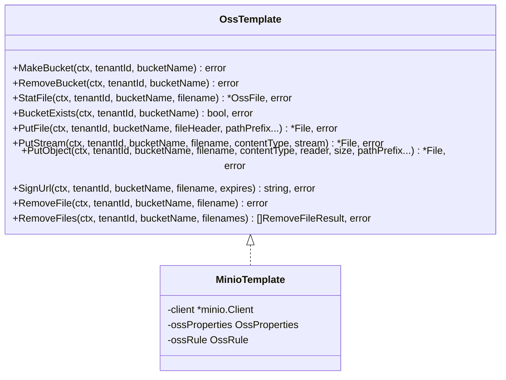
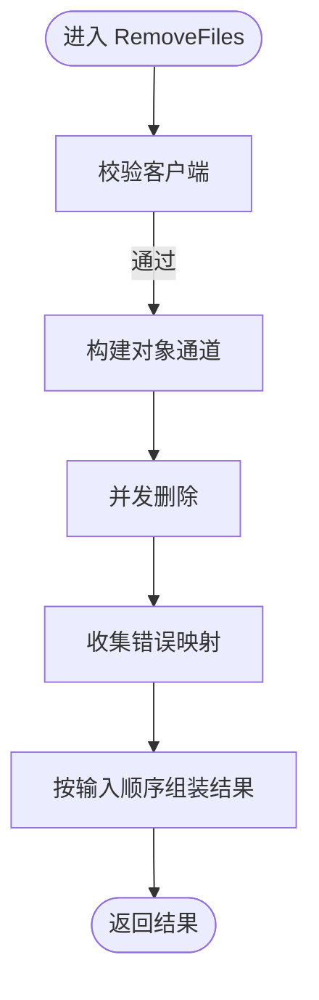
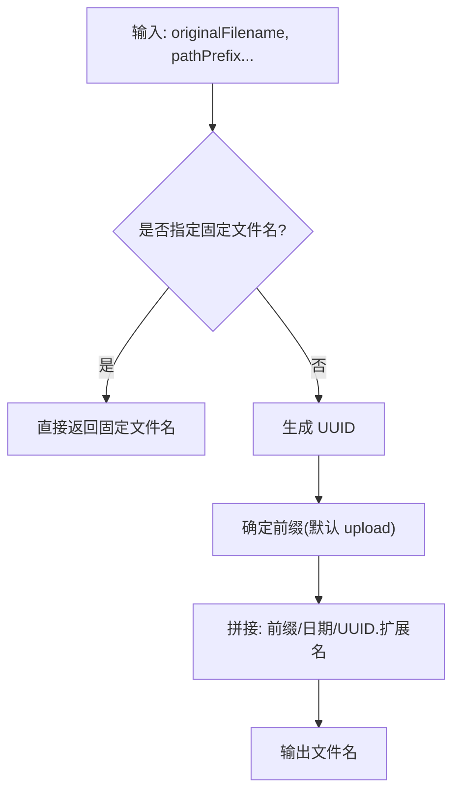
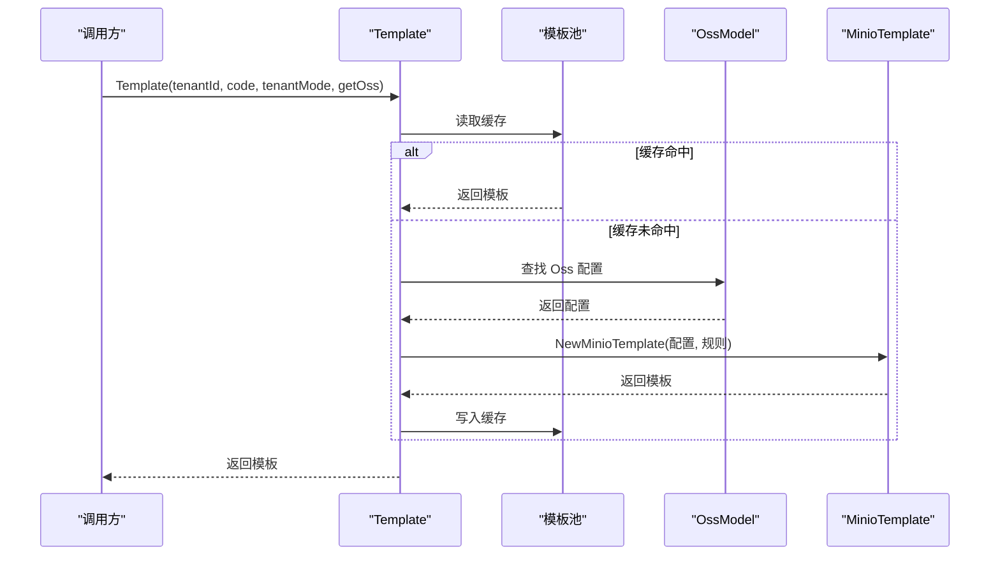
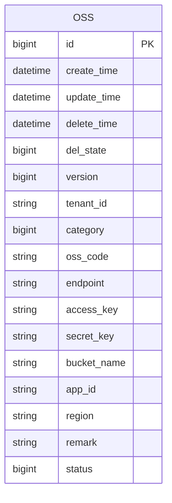
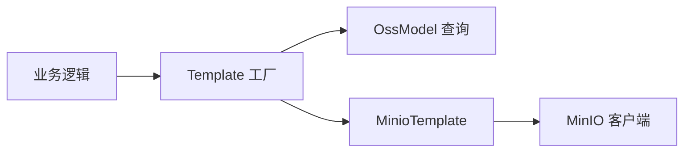

# 对象存储工具 (OSSx)

<cite>
**本文引用的文件**
- [common/ossx/ossx.go](file://common/ossx/ossx.go)
- [common/ossx/minio_oss.go](file://common/ossx/minio_oss.go)
- [common/ossx/osssconfig/ossconfig.go](file://common/ossx/osssconfig/ossconfig.go)
- [model/ossmodel.go](file://model/ossmodel.go)
- [model/ossmodel_gen.go](file://model/ossmodel_gen.go)
- [app/file/etc/file.yaml](file://app/file/etc/file.yaml)
- [app/file/internal/logic/makebucketlogic.go](file://app/file/internal/logic/makebucketlogic.go)
- [app/file/internal/logic/putfilelogic.go](file://app/file/internal/logic/putfilelogic.go)
- [app/file/internal/logic/signurllogic.go](file://app/file/internal/logic/signurllogic.go)
- [app/file/internal/logic/removefileslogic.go](file://app/file/internal/logic/removefileslogic.go)
</cite>

## 目录
1. [简介](#简介)
2. [项目结构](#项目结构)
3. [核心组件](#核心组件)
4. [架构总览](#架构总览)
5. [组件详解](#组件详解)
6. [依赖关系分析](#依赖关系分析)
7. [性能与优化](#性能与优化)
8. [故障排查指南](#故障排查指南)
9. [结论](#结论)
10. [附录：API 使用示例与最佳实践](#附录api-使用示例与最佳实践)

## 简介
本文件面向 Zero-Service 的 OSSx 对象存储工具，系统性阐述其统一抽象接口、Minio 模板实现、存储配置管理、租户模式与命名规则机制，以及在实际业务中的使用方式。OSSx 提供了跨供应商的统一能力：存储桶管理、文件上传（本地文件、字节流、Reader）、批量删除、URL 签名、文件信息查询等。当前实现以 Minio 为主要适配器，后续可扩展至七牛、阿里云、腾讯云等。

## 项目结构
围绕 OSSx 的关键目录与文件如下：
- 抽象与实现
  - common/ossx/ossx.go：统一接口 OssTemplate、OssRule 规则、OssProperties 配置、模板工厂方法 Template
  - common/ossx/minio_oss.go：MinioTemplate 实现，封装 MinIO 客户端调用
  - common/ossx/osssconfig/ossconfig.go：OSS 配置结构体（租户模式）
- 数据模型与持久化
  - model/ossmodel.go：OssModel 接口与自定义实现入口
  - model/ossmodel_gen.go：Oss 表结构与数据库访问方法（含按租户+编码查询）
- 应用层逻辑
  - app/file/etc/file.yaml：应用配置（含 Oss.TenantMode）
  - app/file/internal/logic/*.go：典型业务逻辑封装（创建存储桶、上传文件、签名 URL、批量删除）

**图表来源**
- [common/ossx/ossx.go:28-151](file://common/ossx/ossx.go#L28-L151)
- [common/ossx/minio_oss.go:20-242](file://common/ossx/minio_oss.go#L20-L242)
- [common/ossx/osssconfig/ossconfig.go:4-7](file://common/ossx/osssconfig/ossconfig.go#L4-L7)
- [model/ossmodel.go:10-31](file://model/ossmodel.go#L10-L31)
- [model/ossmodel_gen.go:63-81](file://model/ossmodel_gen.go#L63-L81)
- [app/file/etc/file.yaml:17-19](file://app/file/etc/file.yaml#L17-L19)
- [app/file/internal/logic/makebucketlogic.go:26-44](file://app/file/internal/logic/makebucketlogic.go#L26-L44)
- [app/file/internal/logic/putfilelogic.go:33-77](file://app/file/internal/logic/putfilelogic.go#L33-L77)
- [app/file/internal/logic/signurllogic.go:29-60](file://app/file/internal/logic/signurllogic.go#L29-L60)
- [app/file/internal/logic/removefileslogic.go:28-45](file://app/file/internal/logic/removefileslogic.go#L28-L45)

**章节来源**
- [common/ossx/ossx.go:17-26](file://common/ossx/ossx.go#L17-L26)
- [common/ossx/osssconfig/ossconfig.go:4-7](file://common/ossx/osssconfig/ossconfig.go#L4-L7)
- [model/ossmodel_gen.go:63-81](file://model/ossmodel_gen.go#L63-L81)
- [app/file/etc/file.yaml:17-19](file://app/file/etc/file.yaml#L17-L19)

## 核心组件
- 统一接口 OssTemplate
  - 能力覆盖：创建/删除存储桶、存储桶存在性判断、文件上传（多形态）、文件信息查询、URL 签名、单文件删除、批量删除
  - 设计要点：通过租户 ID 与资源编码定位具体 OSS 配置；通过路径前缀与 UUID 生成策略控制文件命名与组织
- MinioTemplate
  - 基于 MinIO 客户端实现上述接口，负责与 MinIO 服务交互
- OssRule
  - 租户模式开关：当开启时，存储桶名与文件名均带租户前缀
  - 文件命名策略：默认按“路径前缀/日期/UUID.扩展名”生成，支持固定文件名覆盖
- 配置与工厂
  - OssProperties：Endpoint、AccessKey、SecretKey、BucketName、AppId、Region、Args 等
  - Template 工厂：按租户维度缓存模板实例，避免重复初始化；根据分类选择适配器（当前仅 Minio）

**章节来源**
- [common/ossx/ossx.go:28-92](file://common/ossx/ossx.go#L28-L92)
- [common/ossx/ossx.go:109-151](file://common/ossx/ossx.go#L109-L151)
- [common/ossx/minio_oss.go:20-242](file://common/ossx/minio_oss.go#L20-L242)

## 架构总览
OSSx 采用“抽象接口 + 具体适配器”的分层设计。应用侧通过 Template 获取适配器实例，再调用统一接口完成对象存储操作。配置由数据库模型提供，结合应用配置决定是否启用租户模式。

**图表来源**
- [common/ossx/ossx.go:109-151](file://common/ossx/ossx.go#L109-L151)
- [model/ossmodel_gen.go:116-128](file://model/ossmodel_gen.go#L116-L128)
- [common/ossx/minio_oss.go:214-235](file://common/ossx/minio_oss.go#L214-L235)
- [app/file/internal/logic/putfilelogic.go:33-63](file://app/file/internal/logic/putfilelogic.go#L33-L63)
- [app/file/internal/logic/signurllogic.go:29-56](file://app/file/internal/logic/signurllogic.go#L29-L56)
- [app/file/internal/logic/removefileslogic.go:28-44](file://app/file/internal/logic/removefileslogic.go#L28-L44)

## 组件详解

### 统一接口 OssTemplate
- 关键方法
  - MakeBucket/RemoveBucket/BucketExists：存储桶生命周期管理
  - PutFile/PutStream/PutObject：三种上传形态，分别面向 multipart 文件头、字节数组、Reader
  - StatFile：查询文件元信息
  - SignUrl：生成预签名 URL
  - RemoveFile/RemoveFiles：单文件与批量删除
- 设计原则
  - 统一返回值结构 File/OssFile/RemoveFileResult，便于上层处理
  - 通过 pathPrefix 控制文件路径前缀，filename 回退策略保证唯一性

**图表来源**
- [common/ossx/ossx.go:28-39](file://common/ossx/ossx.go#L28-L39)
- [common/ossx/minio_oss.go:20-24](file://common/ossx/minio_oss.go#L20-L24)

**章节来源**
- [common/ossx/ossx.go:28-39](file://common/ossx/ossx.go#L28-L39)

### MinioTemplate 实现
- 客户端校验：validateClient 防止空指针
- 存储桶与文件操作：基于 MinIO 客户端的对应 API
- URL 签名：PresignedGetObject 生成带过期时间的 URL
- 批量删除：并发通道 + RemoveObjects，收集失败项并按输入顺序返回

**图表来源**
- [common/ossx/minio_oss.go:174-204](file://common/ossx/minio_oss.go#L174-L204)

**章节来源**
- [common/ossx/minio_oss.go:26-204](file://common/ossx/minio_oss.go#L26-L204)

### OssRule 租户模式与命名规则
- 存储桶命名：租户模式下为 tenantId-bucketName
- 文件命名：默认前缀 upload，后接年月日，再加 UUID，最后拼接原扩展名；支持固定文件名覆盖
- 路径前缀：可通过 pathPrefix 参数传入，优先级高于默认

**图表来源**
- [common/ossx/ossx.go:55-68](file://common/ossx/ossx.go#L55-L68)

**章节来源**
- [common/ossx/ossx.go:43-68](file://common/ossx/ossx.go#L43-L68)

### 配置与工厂：Template
- 按租户维度缓存模板实例，减少重复初始化
- 依据 Oss.Category 选择适配器（当前仅支持 Minio）
- 通过 OssProperties 注入 Endpoint、AccessKey、SecretKey、BucketName 等

**图表来源**
- [common/ossx/ossx.go:109-151](file://common/ossx/ossx.go#L109-L151)
- [model/ossmodel_gen.go:116-128](file://model/ossmodel_gen.go#L116-L128)
- [common/ossx/minio_oss.go:214-235](file://common/ossx/minio_oss.go#L214-L235)

**章节来源**
- [common/ossx/ossx.go:109-151](file://common/ossx/ossx.go#L109-L151)

### 数据模型与配置
- Oss 表字段：包含租户 ID、分类（Minio/Qiniu/Ali/Tencent）、Endpoint、AccessKey、SecretKey、BucketName、AppId、Region、状态等
- OssModel 提供按租户+编码查询的方法，用于 Template 工厂解析具体配置
- 应用配置 file.yaml 中的 Oss.TenantMode 决定是否启用租户模式

**图表来源**
- [model/ossmodel_gen.go:63-81](file://model/ossmodel_gen.go#L63-L81)

**章节来源**
- [model/ossmodel_gen.go:116-128](file://model/ossmodel_gen.go#L116-L128)
- [app/file/etc/file.yaml:17-19](file://app/file/etc/file.yaml#L17-L19)

## 依赖关系分析
- 抽象层与实现层解耦：OssTemplate 与 MinioTemplate 通过接口绑定，便于扩展其他供应商
- 配置来源：OssModel 提供租户+编码的配置查询，Template 工厂负责实例化与缓存
- 应用层逻辑：各业务逻辑通过 Template 获取适配器，屏蔽底层差异

**图表来源**
- [common/ossx/ossx.go:109-151](file://common/ossx/ossx.go#L109-L151)
- [model/ossmodel_gen.go:116-128](file://model/ossmodel_gen.go#L116-L128)
- [common/ossx/minio_oss.go:214-235](file://common/ossx/minio_oss.go#L214-L235)

**章节来源**
- [common/ossx/ossx.go:109-151](file://common/ossx/ossx.go#L109-L151)
- [model/ossmodel_gen.go:116-128](file://model/ossmodel_gen.go#L116-L128)

## 性能与优化
- 连接复用与缓存
  - Template 工厂按租户缓存适配器实例，避免重复初始化 MinIO 客户端
  - 建议在高并发场景下保持租户维度的连接池配置一致
- 并发上传与批量删除
  - PutObject/Reader 上传适合大文件或流式场景；批量删除使用并发通道 + RemoveObjects，提升吞吐
- 命名与路径
  - 合理设置 pathPrefix 可降低单桶对象数量，提升列举与删除效率
- URL 签名
  - 合理设置过期时间，避免长期有效的链接带来安全风险与带宽压力

[本节为通用建议，无需特定文件引用]

## 故障排查指南
- 客户端为空
  - 现象：调用接口报错提示客户端为空
  - 排查：确认 Template 工厂已成功创建 MinioTemplate；检查 Oss 配置是否正确
- 存储桶不存在
  - 现象：创建/删除存储桶失败或文件上传报错
  - 排查：先执行存储桶创建流程，确保 BucketExists 为真后再进行文件操作
- 文件不存在
  - 现象：StatFile/SignUrl 报错
  - 排查：确认文件名与路径前缀拼接正确；检查文件是否已成功上传
- 批量删除异常
  - 现象：部分文件删除失败但整体报错
  - 排查：RemoveFiles 返回每个文件的错误，逐条检查失败原因

**章节来源**
- [common/ossx/minio_oss.go:237-242](file://common/ossx/minio_oss.go#L237-L242)
- [app/file/internal/logic/makebucketlogic.go:26-44](file://app/file/internal/logic/makebucketlogic.go#L26-L44)
- [app/file/internal/logic/removefileslogic.go:28-45](file://app/file/internal/logic/removefileslogic.go#L28-L45)

## 结论
OSSx 通过统一抽象接口与 Minio 适配器，提供了稳定、可扩展的对象存储能力。结合租户模式与命名规则，能够满足多租户场景下的隔离与组织需求。建议在生产环境中合理设置过期时间、路径前缀与连接池参数，并通过批量删除与并发上传提升性能。

[本节为总结，无需特定文件引用]

## 附录：API 使用示例与最佳实践

### API 使用示例（步骤说明）
- 创建存储桶
  - 步骤：调用 Template 获取适配器 → BucketExists 检查 → 不存在则 MakeBucket
  - 参考实现位置：[app/file/internal/logic/makebucketlogic.go:26-44](file://app/file/internal/logic/makebucketlogic.go#L26-L44)
- 上传文件（本地文件）
  - 步骤：打开本地文件 → 识别 Content-Type → 调用 PutObject 上传
  - 参考实现位置：[app/file/internal/logic/putfilelogic.go:33-77](file://app/file/internal/logic/putfilelogic.go#L33-L77)
- 流式上传（字节数组）
  - 步骤：准备字节流与 MIME 类型 → 调用 PutStream
  - 参考实现位置：[common/ossx/minio_oss.go:96-122](file://common/ossx/minio_oss.go#L96-L122)
- Reader 上传（适合大文件）
  - 步骤：构造 io.Reader 与对象大小 → 调用 PutObject
  - 参考实现位置：[common/ossx/minio_oss.go:124-148](file://common/ossx/minio_oss.go#L124-L148)
- URL 签名
  - 步骤：调用 Template 获取适配器 → 设置过期时间 → 调用 SignUrl
  - 参考实现位置：[app/file/internal/logic/signurllogic.go:29-60](file://app/file/internal/logic/signurllogic.go#L29-L60)
- 批量删除
  - 步骤：调用 Template 获取适配器 → 调用 RemoveFiles → 检查每条结果
  - 参考实现位置：[app/file/internal/logic/removefileslogic.go:28-45](file://app/file/internal/logic/removefileslogic.go#L28-L45)

### 最佳实践
- 租户模式
  - 在应用配置中启用 Oss.TenantMode，确保不同租户的存储桶与文件相互隔离
  - 参考配置位置：[app/file/etc/file.yaml:17-19](file://app/file/etc/file.yaml#L17-L19)
- 命名策略
  - 使用 pathPrefix 将业务模块或日期归档到不同目录，避免单桶对象过多
  - 参考规则位置：[common/ossx/ossx.go:55-68](file://common/ossx/ossx.go#L55-L68)
- 错误处理
  - 对批量删除的结果逐条校验，记录失败原因以便重试或告警
  - 参考实现位置：[app/file/internal/logic/removefileslogic.go:39-43](file://app/file/internal/logic/removefileslogic.go#L39-L43)
- 安全与性能
  - URL 签名设置合理的过期时间；上传时尽量使用流式与 Reader 方式，避免一次性加载大文件到内存
  - 参考实现位置：[common/ossx/minio_oss.go:150-162](file://common/ossx/minio_oss.go#L150-L162)