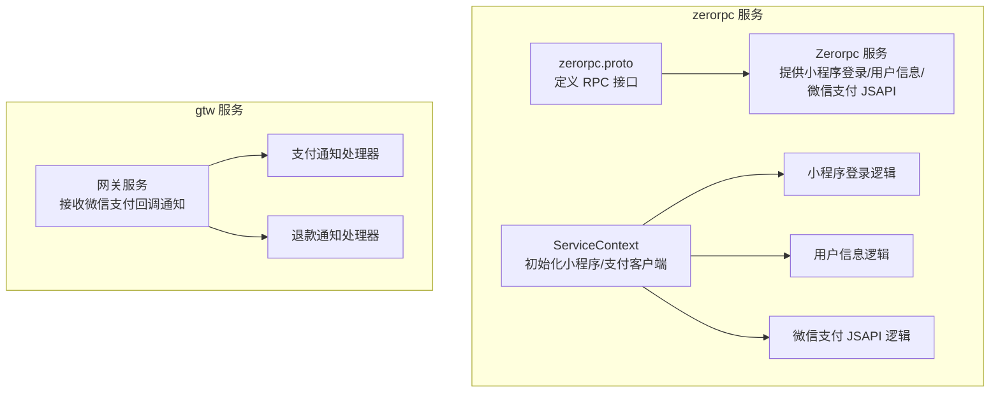
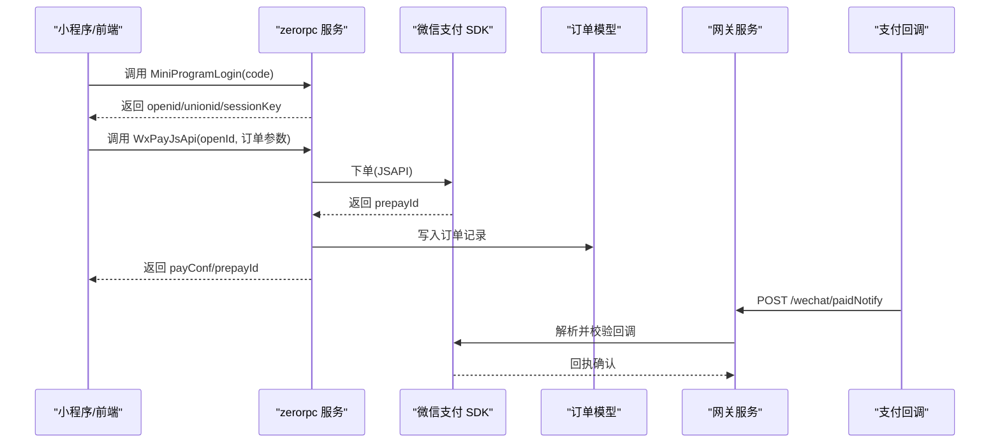
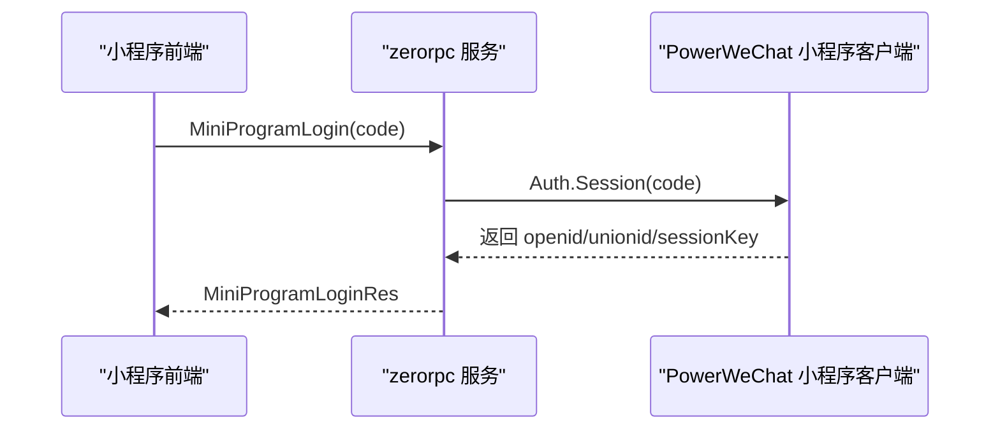
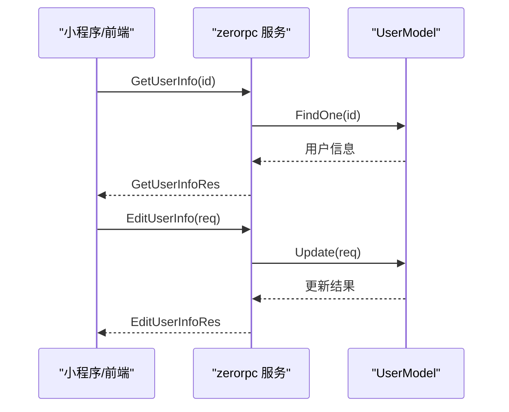
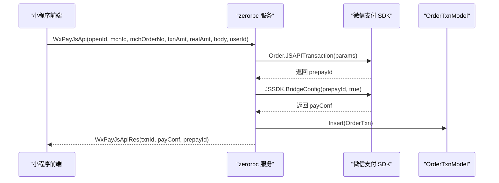
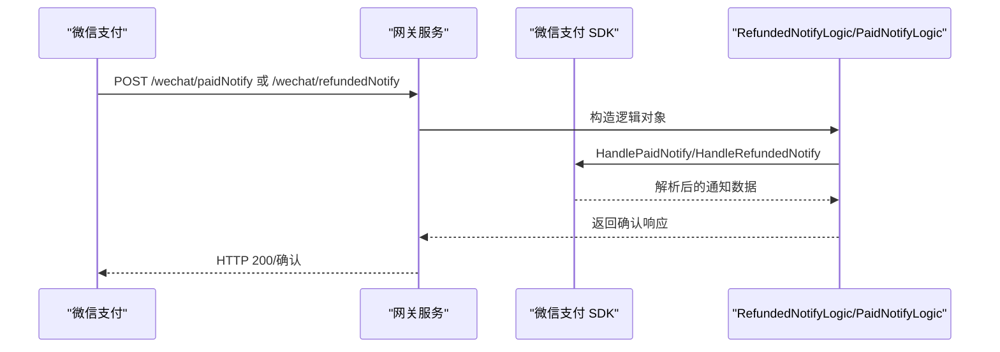
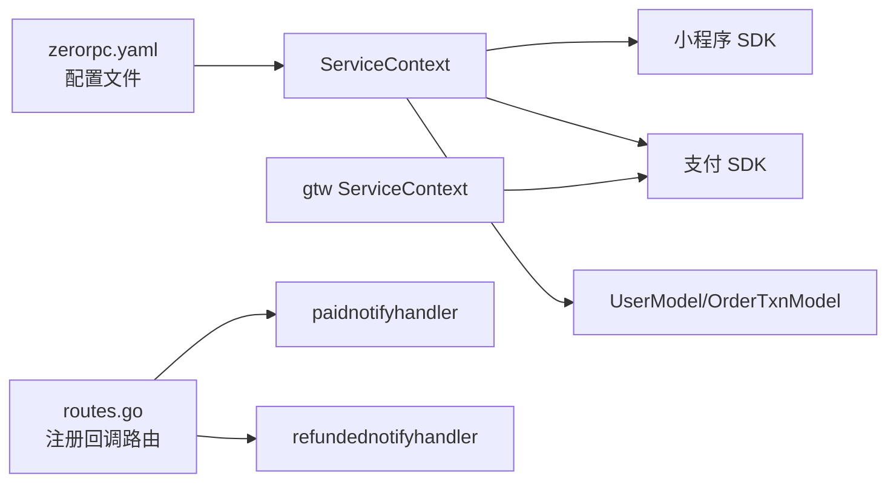

# 微信集成工具（PowerWechatx）

<cite>
**本文引用的文件**
- [common/powerwechatx/types.go](file://common/powerwechatx/types.go)
- [zerorpc/zerorpc.proto](file://zerorpc/zerorpc.proto)
- [zerorpc/internal/svc/servicecontext.go](file://zerorpc/internal/svc/servicecontext.go)
- [zerorpc/internal/logic/miniprogramloginlogic.go](file://zerorpc/internal/logic/miniprogramloginlogic.go)
- [zerorpc/internal/logic/getuserinfologic.go](file://zerorpc/internal/logic/getuserinfologic.go)
- [zerorpc/internal/logic/edituserinfologic.go](file://zerorpc/internal/logic/edituserinfologic.go)
- [zerorpc/internal/logic/wxpayjsapilogic.go](file://zerorpc/internal/logic/wxpayjsapilogic.go)
- [zerorpc/etc/zerorpc.yaml](file://zerorpc/etc/zerorpc.yaml)
- [zerorpc/zerorpc/zerorpc_grpc.pb.go](file://zerorpc/zerorpc/zerorpc_grpc.pb.go)
- [zerorpc/zerorpc/zerorpc.pb.go](file://zerorpc/zerorpc/zerorpc.pb.go)
- [gtw/internal/handler/pay/paidnotifyhandler.go](file://gtw/internal/handler/pay/paidnotifyhandler.go)
- [gtw/internal/handler/pay/refundednotifyhandler.go](file://gtw/internal/handler/pay/refundednotifyhandler.go)
- [gtw/internal/logic/pay/refundednotifylogic.go](file://gtw/internal/logic/pay/refundednotifylogic.go)
- [gtw/internal/svc/servicecontext.go](file://gtw/internal/svc/servicecontext.go)
- [gtw/internal/handler/routes.go](file://gtw/internal/handler/routes.go)
</cite>

## 目录
1. [简介](#简介)
2. [项目结构](#项目结构)
3. [核心组件](#核心组件)
4. [架构总览](#架构总览)
5. [详细组件分析](#详细组件分析)
6. [依赖分析](#依赖分析)
7. [性能考虑](#性能考虑)
8. [故障排查指南](#故障排查指南)
9. [结论](#结论)
10. [附录](#附录)

## 简介
本技术文档面向 Zero-Service 的微信集成工具 PowerWechatx，系统性阐述其在微信支付、小程序开发与微信接口集成方面的实现与使用方法。重点覆盖：
- 微信支付：统一下单、支付通知、退款通知、账单下载（概念性说明）
- 小程序：登录授权、用户信息获取与编辑、模板消息发送（概念性说明）、微信客服集成（概念性说明）
- 微信接口：AccessToken 管理、JSSDK 配置、微信分享、二维码生成功能（概念性说明）
- 提供完整微信集成示例：支付流程、小程序开发与公众号对接的代码路径指引
- 开发者工具使用、调试技巧与常见问题解决方案
- 微信生态开发最佳实践与安全注意事项

## 项目结构
PowerWechatx 在本仓库中主要通过两个服务协同工作：
- zerorpc：提供小程序登录、用户信息管理、微信支付 JSAPI 统一下单等 RPC 接口
- gtw：提供微信支付回调通知（支付/退款）HTTP 入口

图表来源
- [zerorpc/zerorpc.proto:140-167](file://zerorpc/zerorpc.proto#L140-L167)
- [zerorpc/internal/svc/servicecontext.go:35-101](file://zerorpc/internal/svc/servicecontext.go#L35-L101)
- [zerorpc/internal/logic/miniprogramloginlogic.go:27-42](file://zerorpc/internal/logic/miniprogramloginlogic.go#L27-L42)
- [zerorpc/internal/logic/getuserinfologic.go:26-41](file://zerorpc/internal/logic/getuserinfologic.go#L26-L41)
- [zerorpc/internal/logic/edituserinfologic.go:27-48](file://zerorpc/internal/logic/edituserinfologic.go#L27-L48)
- [zerorpc/internal/logic/wxpayjsapilogic.go:36-99](file://zerorpc/internal/logic/wxpayjsapilogic.go#L36-L99)
- [gtw/internal/handler/pay/paidnotifyhandler.go:11-22](file://gtw/internal/handler/pay/paidnotifyhandler.go#L11-L22)
- [gtw/internal/handler/pay/refundednotifyhandler.go:11-22](file://gtw/internal/handler/pay/refundednotifyhandler.go#L11-L22)

章节来源
- [zerorpc/zerorpc.proto:1-167](file://zerorpc/zerorpc.proto#L1-L167)
- [zerorpc/internal/svc/servicecontext.go:1-102](file://zerorpc/internal/svc/servicecontext.go#L1-L102)
- [zerorpc/etc/zerorpc.yaml:1-39](file://zerorpc/etc/zerorpc.yaml#L1-L39)
- [gtw/internal/svc/servicecontext.go:1-40](file://gtw/internal/svc/servicecontext.go#L1-L40)
- [gtw/internal/handler/routes.go:100-115](file://gtw/internal/handler/routes.go#L100-L115)

## 核心组件
- PowerWechatx 日志驱动：统一微信 SDK 日志输出到 go-zero 日志体系
- 小程序客户端：封装微信小程序登录、用户信息等能力
- 微信支付客户端：封装统一下单、JSSDK 桥接配置、回调通知处理等能力
- RPC 接口：MiniProgramLogin、GetUserInfo、EditUserInfo、WxPayJsApi 等
- 网关回调：支付成功通知、退款通知 HTTP 处理器

章节来源
- [common/powerwechatx/types.go:9-66](file://common/powerwechatx/types.go#L9-L66)
- [zerorpc/internal/svc/servicecontext.go:35-101](file://zerorpc/internal/svc/servicecontext.go#L35-L101)
- [zerorpc/zerorpc.proto:86-138](file://zerorpc/zerorpc.proto#L86-L138)

## 架构总览
PowerWechatx 的整体交互流程如下：

图表来源
- [zerorpc/internal/logic/miniprogramloginlogic.go:27-42](file://zerorpc/internal/logic/miniprogramloginlogic.go#L27-L42)
- [zerorpc/internal/logic/wxpayjsapilogic.go:36-99](file://zerorpc/internal/logic/wxpayjsapilogic.go#L36-L99)
- [gtw/internal/handler/pay/paidnotifyhandler.go:11-22](file://gtw/internal/handler/pay/paidnotifyhandler.go#L11-L22)

## 详细组件分析

### 小程序登录授权
- 功能概述：使用小程序 code 换取 openid、unionid、session_key
- 关键实现路径：
  - [miniprogramloginlogic.go:27-42](file://zerorpc/internal/logic/miniprogramloginlogic.go#L27-L42)
  - [zerorpc.proto 中 MiniProgramLogin 接口定义:86-94](file://zerorpc/zerorpc.proto#L86-L94)
  - [zerorpc 服务上下文初始化小程序客户端:35-54](file://zerorpc/internal/svc/servicecontext.go#L35-L54)

图表来源
- [zerorpc/internal/logic/miniprogramloginlogic.go:27-42](file://zerorpc/internal/logic/miniprogramloginlogic.go#L27-L42)
- [zerorpc/zerorpc.proto:86-94](file://zerorpc/zerorpc.proto#L86-L94)

章节来源
- [zerorpc/internal/logic/miniprogramloginlogic.go:1-43](file://zerorpc/internal/logic/miniprogramloginlogic.go#L1-L43)
- [zerorpc/zerorpc.proto:86-94](file://zerorpc/zerorpc.proto#L86-L94)
- [zerorpc/internal/svc/servicecontext.go:35-54](file://zerorpc/internal/svc/servicecontext.go#L35-L54)

### 用户信息获取与编辑
- 功能概述：根据用户 ID 查询与更新用户信息（昵称、头像、性别、手机号等）
- 关键实现路径：
  - [getuserinfologic.go:26-41](file://zerorpc/internal/logic/getuserinfologic.go#L26-L41)
  - [edituserinfologic.go:27-48](file://zerorpc/internal/logic/edituserinfologic.go#L27-L48)
  - [zerorpc.proto 中 GetUserInfo/EditUserInfo 接口定义:96-113](file://zerorpc/zerorpc.proto#L96-L113)

图表来源
- [zerorpc/internal/logic/getuserinfologic.go:26-41](file://zerorpc/internal/logic/getuserinfologic.go#L26-L41)
- [zerorpc/internal/logic/edituserinfologic.go:27-48](file://zerorpc/internal/logic/edituserinfologic.go#L27-L48)
- [zerorpc/zerorpc.proto:96-113](file://zerorpc/zerorpc.proto#L96-L113)

章节来源
- [zerorpc/internal/logic/getuserinfologic.go:1-42](file://zerorpc/internal/logic/getuserinfologic.go#L1-L42)
- [zerorpc/internal/logic/edituserinfologic.go:1-49](file://zerorpc/internal/logic/edituserinfologic.go#L1-L49)
- [zerorpc/zerorpc.proto:96-113](file://zerorpc/zerorpc.proto#L96-L113)

### 微信支付：统一下单与 JSSDK 调起
- 功能概述：基于 JSAPI 场景进行统一下单，返回预支付参数供前端调起支付；同时写入本地订单记录
- 关键实现路径：
  - [wxpayjsapilogic.go:36-99](file://zerorpc/internal/logic/wxpayjsapilogic.go#L36-L99)
  - [zerorpc.proto 中 WxPayJsApi 接口定义:124-138](file://zerorpc/zerorpc.proto#L124-L138)
  - [zerorpc 服务上下文初始化支付客户端与回调地址:55-86](file://zerorpc/internal/svc/servicecontext.go#L55-L86)

图表来源
- [zerorpc/internal/logic/wxpayjsapilogic.go:36-99](file://zerorpc/internal/logic/wxpayjsapilogic.go#L36-L99)
- [zerorpc/zerorpc.proto:124-138](file://zerorpc/zerorpc.proto#L124-L138)
- [zerorpc/internal/svc/servicecontext.go:55-86](file://zerorpc/internal/svc/servicecontext.go#L55-L86)

章节来源
- [zerorpc/internal/logic/wxpayjsapilogic.go:1-100](file://zerorpc/internal/logic/wxpayjsapilogic.go#L1-L100)
- [zerorpc/zerorpc.proto:124-138](file://zerorpc/zerorpc.proto#L124-L138)
- [zerorpc/internal/svc/servicecontext.go:55-86](file://zerorpc/internal/svc/servicecontext.go#L55-L86)

### 支付通知与退款通知
- 功能概述：接收微信支付回调，解析并校验通知，执行业务逻辑（如更新订单状态），返回确认响应
- 关键实现路径：
  - [paidnotifyhandler.go:11-22](file://gtw/internal/handler/pay/paidnotifyhandler.go#L11-L22)
  - [refundednotifyhandler.go:11-22](file://gtw/internal/handler/pay/refundednotifyhandler.go#L11-L22)
  - [refundednotifylogic.go:32-53](file://gtw/internal/logic/pay/refundednotifylogic.go#L32-L53)
  - [gtw 服务上下文初始化支付客户端与回调地址:25-40](file://gtw/internal/svc/servicecontext.go#L25-L40)
  - [网关路由注册支付/退款回调:104-110](file://gtw/internal/handler/routes.go#L104-L110)

图表来源
- [gtw/internal/handler/pay/paidnotifyhandler.go:11-22](file://gtw/internal/handler/pay/paidnotifyhandler.go#L11-L22)
- [gtw/internal/handler/pay/refundednotifyhandler.go:11-22](file://gtw/internal/handler/pay/refundednotifyhandler.go#L11-L22)
- [gtw/internal/logic/pay/refundednotifylogic.go:32-53](file://gtw/internal/logic/pay/refundednotifylogic.go#L32-L53)
- [gtw/internal/svc/servicecontext.go:25-40](file://gtw/internal/svc/servicecontext.go#L25-L40)
- [gtw/internal/handler/routes.go:104-110](file://gtw/internal/handler/routes.go#L104-L110)

章节来源
- [gtw/internal/handler/pay/paidnotifyhandler.go:1-22](file://gtw/internal/handler/pay/paidnotifyhandler.go#L1-L22)
- [gtw/internal/handler/pay/refundednotifyhandler.go:1-22](file://gtw/internal/handler/pay/refundednotifyhandler.go#L1-L22)
- [gtw/internal/logic/pay/refundednotifylogic.go:1-53](file://gtw/internal/logic/pay/refundednotifylogic.go#L1-L53)
- [gtw/internal/svc/servicecontext.go:1-40](file://gtw/internal/svc/servicecontext.go#L1-L40)
- [gtw/internal/handler/routes.go:100-115](file://gtw/internal/handler/routes.go#L100-L115)

### AccessToken 管理、JSSDK 配置、分享与二维码（概念性说明）
- AccessToken 管理：通过 PowerWeChat 客户端自动维护与刷新，无需手动干预
- JSSDK 配置：统一下单后由 SDK 提供 BridgeConfig 生成前端调起参数
- 微信分享：结合 JSSDK 使用，需在前端页面注入配置并调用相应接口
- 二维码生成功能：可使用微信二维码接口生成临时/永久二维码，配合业务场景使用

说明：以上为微信生态通用能力，具体实现可参考 PowerWeChat 官方文档与本项目中已启用的日志与缓存配置。

## 依赖分析
- zerorpc 服务依赖：
  - 小程序 SDK：用于小程序登录与用户信息相关能力
  - 支付 SDK：用于统一下单、JSSDK 配置与回调处理
  - go-zero Redis/SQL：用于缓存与持久化
- gtw 服务依赖：
  - 支付 SDK：用于解析微信回调并回执确认
  - go-zero HTTP：用于接收回调请求

图表来源
- [zerorpc/etc/zerorpc.yaml:1-39](file://zerorpc/etc/zerorpc.yaml#L1-L39)
- [zerorpc/internal/svc/servicecontext.go:35-101](file://zerorpc/internal/svc/servicecontext.go#L35-L101)
- [gtw/internal/svc/servicecontext.go:25-40](file://gtw/internal/svc/servicecontext.go#L25-L40)
- [gtw/internal/handler/routes.go:104-110](file://gtw/internal/handler/routes.go#L104-L110)

章节来源
- [zerorpc/etc/zerorpc.yaml:1-39](file://zerorpc/etc/zerorpc.yaml#L1-L39)
- [zerorpc/internal/svc/servicecontext.go:1-102](file://zerorpc/internal/svc/servicecontext.go#L1-L102)
- [gtw/internal/svc/servicecontext.go:1-40](file://gtw/internal/svc/servicecontext.go#L1-L40)
- [gtw/internal/handler/routes.go:100-115](file://gtw/internal/handler/routes.go#L100-L115)

## 性能考虑
- 异步处理：建议对支付回调与退款回调采用异步队列处理，避免阻塞 HTTP 请求
- 缓存策略：利用 Redis 缓存小程序/支付相关票据与幂等键，降低重复请求
- 幂等设计：回调处理需保证幂等，防止重复更新订单状态
- 超时控制：支付 SDK 的 HTTP 超时应合理设置，避免长时间占用连接
- 日志与监控：通过 PowerWechatLogDriver 输出统一日志，便于定位问题

## 故障排查指南
- 小程序登录失败
  - 检查 code 是否过期或已被使用
  - 核对 AppId/Secret 配置是否正确
  - 查看日志输出以定位错误码
  - 参考路径：[miniprogramloginlogic.go:27-42](file://zerorpc/internal/logic/miniprogramloginlogic.go#L27-L42)
- 支付下单失败
  - 校验金额、货币单位、描述、商户订单号等参数
  - 确认回调地址与证书配置正确
  - 参考路径：[wxpayjsapilogic.go:36-99](file://zerorpc/internal/logic/wxpayjsapilogic.go#L36-L99)
- 回调未生效或重复回调
  - 确认网关路由已注册回调地址
  - 校验回调处理器是否正确解析并回执
  - 参考路径：[paidnotifyhandler.go:11-22](file://gtw/internal/handler/pay/paidnotifyhandler.go#L11-L22)、[refundednotifyhandler.go:11-22](file://gtw/internal/handler/pay/refundednotifyhandler.go#L11-L22)
- 日志与调试
  - 使用 PowerWechatLogDriver 统一日志输出
  - 参考路径：[types.go:9-66](file://common/powerwechatx/types.go#L9-L66)

章节来源
- [zerorpc/internal/logic/miniprogramloginlogic.go:27-42](file://zerorpc/internal/logic/miniprogramloginlogic.go#L27-L42)
- [zerorpc/internal/logic/wxpayjsapilogic.go:36-99](file://zerorpc/internal/logic/wxpayjsapilogic.go#L36-L99)
- [gtw/internal/handler/pay/paidnotifyhandler.go:11-22](file://gtw/internal/handler/pay/paidnotifyhandler.go#L11-L22)
- [gtw/internal/handler/pay/refundednotifyhandler.go:11-22](file://gtw/internal/handler/pay/refundednotifyhandler.go#L11-L22)
- [common/powerwechatx/types.go:9-66](file://common/powerwechatx/types.go#L9-L66)

## 结论
PowerWechatx 在本项目中提供了稳定的小程序登录、用户信息管理与微信支付 JSAPI 统一下单能力，并通过网关服务完成支付与退款回调处理。通过统一的日志驱动与合理的配置，能够满足大多数微信生态集成场景。后续可在模板消息、客服集成、JSSDK 分享与二维码生成等方面扩展，以覆盖更广泛的微信功能。

## 附录
- 开发者工具与调试
  - 使用 goctl 生成/更新 RPC 接口与服务
  - 使用 Postman/浏览器直接访问网关回调地址进行联调
  - 打开支付 SDK HttpDebug 以便查看网络请求细节
- 最佳实践与安全
  - 严格校验回调参数与签名
  - 对敏感字段（如证书、密钥）进行最小权限存储与传输
  - 使用 HTTPS 与域名白名单，避免明文传输
  - 对回调与重试机制进行幂等设计