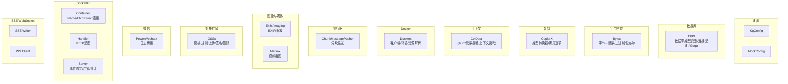
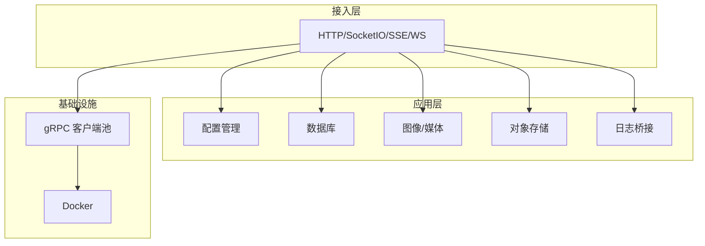
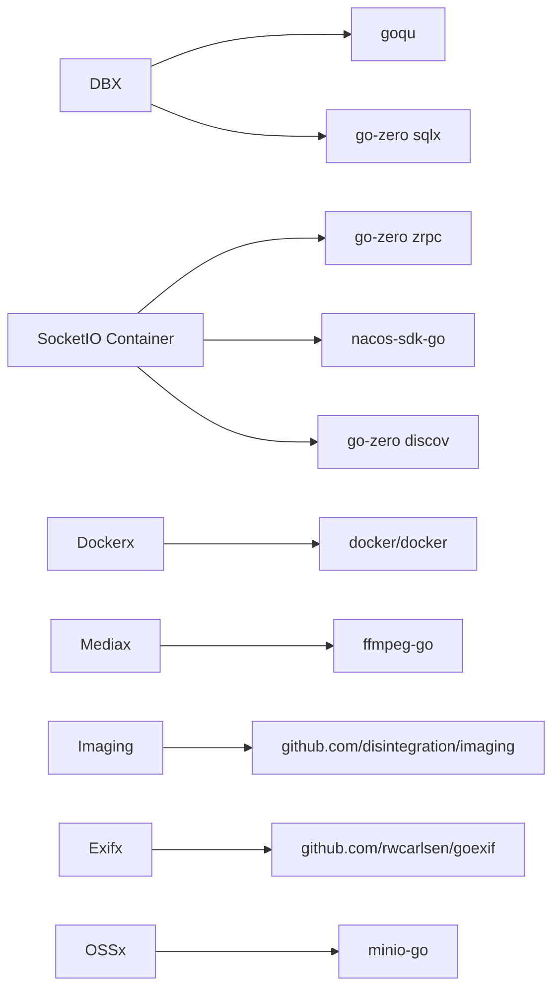

# 工具组件

<cite>
**本文引用的文件**
- [common/configx/kqConfig.go](file://common/configx/kqConfig.go)
- [common/configx/mockconfig.go](file://common/configx/mockconfig.go)
- [common/dbx/dbx.go](file://common/dbx/dbx.go)
- [common/bytex/bytex.go](file://common/bytex/bytex.go)
- [common/copierx/type.go](file://common/copierx/type.go)
- [common/ctxdata/ctxData.go](file://common/ctxdata/ctxData.go)
- [common/dockerx/dockerx.go](file://common/dockerx/dockerx.go)
- [common/executorx/chunkmessagespusher.go](file://common/executorx/chunkmessagespusher.go)
- [common/imagex/exifx.go](file://common/imagex/exifx.go)
- [common/imagex/imaging.go](file://common/imagex/imaging.go)
- [common/mediax/mediax.go](file://common/mediax/mediax.go)
- [common/ossx/ossx.go](file://common/ossx/ossx.go)
- [common/powerwechatx/types.go](file://common/powerwechatx/types.go)
- [common/socketiox/container.go](file://common/socketiox/container.go)
- [common/socketiox/handler.go](file://common/socketiox/handler.go)
- [common/socketiox/server.go](file://common/socketiox/server.go)
- [common/ssex/writer.go](file://common/ssex/writer.go)
- [common/wsx/client.go](file://common/wsx/client.go)
</cite>

## 目录
1. [简介](#简介)
2. [项目结构](#项目结构)
3. [核心组件](#核心组件)
4. [架构总览](#架构总览)
5. [详细组件分析](#详细组件分析)
6. [依赖分析](#依赖分析)
7. [性能考虑](#性能考虑)
8. [故障排查指南](#故障排查指南)
9. [结论](#结论)
10. [附录](#附录)

## 简介
本文件系统性梳理 Zero-Service 的工具组件，覆盖配置管理、数据库访问、字节与位运算、对象存储、图像与媒体处理、Docker 客户端、执行器、SocketIO、SSE、WebSocket 等模块。针对每个工具，给出职责边界、关键 API、参数与返回说明、典型使用场景、注意事项以及组合使用与性能优化建议，帮助开发者快速上手并安全高效地集成。

## 项目结构
工具组件主要位于 common 目录下的子包中，按功能域划分清晰：
- 配置管理：configx（KqConfig、MockConfig）
- 数据库工具：dbx（数据库类型识别、连接适配、Goqu封装）
- 字节处理：bytex（字节↔整数/二进制互转、位布尔互转）
- 复制工具：copierx（类型转换器与拷贝选项）
- 上下文数据：ctxdata（gRPC 元数据键与上下文读取）
- Docker 工具：dockerx（客户端、环境解析、资源解析）
- 执行器工具：executorx（分块消息推送器）
- 图像处理：imagex（EXIF 元数据提取、图像缩放）
- 媒体处理：mediax（基于 ffmpeg 的视频截图）
- 对象存储：ossx（多厂商抽象、租户规则、上传/签名/删除）
- 微信工具：powerwechatx（日志桥接）
- SocketIO 工具：socketiox（容器、处理器、服务器）
- SSE 工具：ssex（事件流写入器）
- WebSocket 工具：wsx（客户端）

**图表来源**
- [common/configx/kqConfig.go:1-7](file://common/configx/kqConfig.go#L1-L7)
- [common/configx/mockconfig.go:1-147](file://common/configx/mockconfig.go#L1-L147)
- [common/dbx/dbx.go:1-155](file://common/dbx/dbx.go#L1-L155)
- [common/bytex/bytex.go:1-239](file://common/bytex/bytex.go#L1-L239)
- [common/copierx/type.go:1-57](file://common/copierx/type.go#L1-L57)
- [common/ctxdata/ctxData.go:1-76](file://common/ctxdata/ctxData.go#L1-L76)
- [common/dockerx/dockerx.go:1-95](file://common/dockerx/dockerx.go#L1-L95)
- [common/executorx/chunkmessagespusher.go:1-45](file://common/executorx/chunkmessagespusher.go#L1-L45)
- [common/imagex/exifx.go:1-294](file://common/imagex/exifx.go#L1-L294)
- [common/imagex/imaging.go:1-69](file://common/imagex/imaging.go#L1-L69)
- [common/mediax/mediax.go:1-194](file://common/mediax/mediax.go#L1-L194)
- [common/ossx/ossx.go:1-152](file://common/ossx/ossx.go#L1-L152)
- [common/powerwechatx/types.go:1-66](file://common/powerwechatx/types.go#L1-L66)
- [common/socketiox/container.go:1-426](file://common/socketiox/container.go#L1-L426)
- [common/socketiox/handler.go:1-41](file://common/socketiox/handler.go#L1-L41)
- [common/socketiox/server.go:1-814](file://common/socketiox/server.go#L1-L814)
- [common/ssex/writer.go](file://common/ssex/writer.go)
- [common/wsx/client.go](file://common/wsx/client.go)

**章节来源**
- [common/configx/kqConfig.go:1-7](file://common/configx/kqConfig.go#L1-L7)
- [common/configx/mockconfig.go:1-147](file://common/configx/mockconfig.go#L1-L147)
- [common/dbx/dbx.go:1-155](file://common/dbx/dbx.go#L1-L155)
- [common/bytex/bytex.go:1-239](file://common/bytex/bytex.go#L1-L239)
- [common/copierx/type.go:1-57](file://common/copierx/type.go#L1-L57)
- [common/ctxdata/ctxData.go:1-76](file://common/ctxdata/ctxData.go#L1-L76)
- [common/dockerx/dockerx.go:1-95](file://common/dockerx/dockerx.go#L1-L95)
- [common/executorx/chunkmessagespusher.go:1-45](file://common/executorx/chunkmessagespusher.go#L1-L45)
- [common/imagex/exifx.go:1-294](file://common/imagex/exifx.go#L1-L294)
- [common/imagex/imaging.go:1-69](file://common/imagex/imaging.go#L1-L69)
- [common/mediax/mediax.go:1-194](file://common/mediax/mediax.go#L1-L194)
- [common/ossx/ossx.go:1-152](file://common/ossx/ossx.go#L1-L152)
- [common/powerwechatx/types.go:1-66](file://common/powerwechatx/types.go#L1-L66)
- [common/socketiox/container.go:1-426](file://common/socketiox/container.go#L1-L426)
- [common/socketiox/handler.go:1-41](file://common/socketiox/handler.go#L1-L41)
- [common/socketiox/server.go:1-814](file://common/socketiox/server.go#L1-L814)
- [common/ssex/writer.go](file://common/ssex/writer.go)
- [common/wsx/client.go](file://common/wsx/client.go)

## 核心组件
- 配置管理
  - KqConfig：轻量级 Kafka 配置载体（Broker 列表、Topic）。
  - MockConfig：基于 JSON 模板的响应模拟器，支持延迟场景、随机数据函数、并发安全。
- 数据库工具
  - DBX：自动识别数据库类型（MySQL/Postgres/SQLite/TAOS），统一连接与 Goqu 适配，提供日志桥接。
- 字节处理
  - Bytex：字节与 uint16/int16/uint32/int32 的双向转换，二进制字符串与位布尔互转。
- 复制工具
  - CopierX：基于 Copier 的深度拷贝与类型转换器（时间戳、字符串转整数、自定义 DateTime）。
- 上下文数据
  - CtxData：统一的 gRPC 元数据键与上下文读取方法（用户ID、用户名、部门编码、授权、TraceId）。
- Docker 工具
  - Dockerx：Docker 客户端封装、环境变量解析、端口/卷挂载/资源解析、构建环境列表。
- 执行器工具
  - ChunkMessagePusher：基于 go-zero ChunkExecutor 的分块消息推送器，支持并发写入与批量发送。
- 图像处理
  - Exifx：JPG EXIF 元数据提取（经纬度、海拔、拍摄时间、分辨率、相机型号）。
  - Imaging：图像缩放（文件/字节/Reader 输入，统一输出 JPEG 或指定格式）。
- 媒体处理
  - Mediax：基于 ffmpeg 的视频截图（按时间点/帧索引），本地文件写入与校验。
- 对象存储
  - OSSx：对象存储模板接口与规则（租户模式、桶命名、文件名策略），支持 MinIO 等。
- 微信工具
  - PowerWechatx：将第三方微信 SDK 日志桥接到 go-zero logx。
- SocketIO 工具
  - Container：多注册中心（Etcd/Nacos/Direct）动态发现与 gRPC 客户端池。
  - Handler：HTTP 适配器，将 SocketIO 服务暴露为标准 http.HandlerFunc。
  - Server：事件绑定、鉴权、房间管理、全局/房间广播、统计上报、会话管理。
- SSE 工具
  - SSE Writer：事件流写入器（事件/数据/心跳/重连）。
- WebSocket 工具
  - WS Client：WebSocket 客户端（连接/发送/接收/关闭）。

**章节来源**
- [common/configx/kqConfig.go:1-7](file://common/configx/kqConfig.go#L1-L7)
- [common/configx/mockconfig.go:1-147](file://common/configx/mockconfig.go#L1-L147)
- [common/dbx/dbx.go:1-155](file://common/dbx/dbx.go#L1-L155)
- [common/bytex/bytex.go:1-239](file://common/bytex/bytex.go#L1-L239)
- [common/copierx/type.go:1-57](file://common/copierx/type.go#L1-L57)
- [common/ctxdata/ctxData.go:1-76](file://common/ctxdata/ctxData.go#L1-L76)
- [common/dockerx/dockerx.go:1-95](file://common/dockerx/dockerx.go#L1-L95)
- [common/executorx/chunkmessagespusher.go:1-45](file://common/executorx/chunkmessagespusher.go#L1-L45)
- [common/imagex/exifx.go:1-294](file://common/imagex/exifx.go#L1-L294)
- [common/imagex/imaging.go:1-69](file://common/imagex/imaging.go#L1-L69)
- [common/mediax/mediax.go:1-194](file://common/mediax/mediax.go#L1-L194)
- [common/ossx/ossx.go:1-152](file://common/ossx/ossx.go#L1-L152)
- [common/powerwechatx/types.go:1-66](file://common/powerwechatx/types.go#L1-L66)
- [common/socketiox/container.go:1-426](file://common/socketiox/container.go#L1-L426)
- [common/socketiox/handler.go:1-41](file://common/socketiox/handler.go#L1-L41)
- [common/socketiox/server.go:1-814](file://common/socketiox/server.go#L1-L814)
- [common/ssex/writer.go](file://common/ssex/writer.go)
- [common/wsx/client.go](file://common/wsx/client.go)

## 架构总览
以下图展示工具组件在系统中的交互关系与职责边界。

**图表来源**
- [common/socketiox/container.go:1-426](file://common/socketiox/container.go#L1-L426)
- [common/socketiox/server.go:1-814](file://common/socketiox/server.go#L1-L814)
- [common/dbx/dbx.go:1-155](file://common/dbx/dbx.go#L1-L155)
- [common/imagex/exifx.go:1-294](file://common/imagex/exifx.go#L1-L294)
- [common/mediax/mediax.go:1-194](file://common/mediax/mediax.go#L1-L194)
- [common/ossx/ossx.go:1-152](file://common/ossx/ossx.go#L1-L152)
- [common/powerwechatx/types.go:1-66](file://common/powerwechatx/types.go#L1-L66)
- [common/dockerx/dockerx.go:1-95](file://common/dockerx/dockerx.go#L1-L95)

## 详细组件分析

### 配置管理工具
- KqConfig
  - 结构：Brokers（字符串切片）、Topic（字符串）。
  - 用途：作为 Kafka 客户端配置载体，便于注入与传递。
  - 注意事项：确保 Broker 地址合法，Topic 存在。
- MockConfig
  - 关键能力
    - 并发安全：内部读写锁保护。
    - 模板渲染：基于 Go text/template，内置 fake 函数族（姓名、城市、电话、邮箱、日期、单词、应用名）。
    - 延迟场景：以特定前缀标记的场景可触发延迟后回落 default 场景。
    - 响应获取：GetResponse(method, path, scene) -> string, error。
  - API
    - MustNewMockConfig(path) -> *MockConfig
    - NewMockConfig(path) -> (*MockConfig, error)
    - GetResponse(method, path, scene) -> (string, error)
  - 参数与返回
    - path：模板文件路径（JSON Raw 结构，保留原始字节）。
    - 返回：渲染后的字符串；错误：找不到键/场景/模板解析/执行错误。
  - 使用示例（路径）
    - [common/configx/mockconfig.go:24-51](file://common/configx/mockconfig.go#L24-L51)
    - [common/configx/mockconfig.go:104-146](file://common/configx/mockconfig.go#L104-L146)
  - 注意事项
    - 模板中使用 fake 函数时注意类型匹配。
    - 延迟场景字符串格式要求严格，否则回退 default。
    - 并发调用 GetResponse 时注意锁竞争。

**章节来源**
- [common/configx/kqConfig.go:1-7](file://common/configx/kqConfig.go#L1-L7)
- [common/configx/mockconfig.go:1-147](file://common/configx/mockconfig.go#L1-L147)

### 数据库工具（DBX、SQL 工具）
- 数据库类型识别
  - ParseDatabaseType(datasource) -> DatabaseType：根据数据源字符串识别类型（MySQL/Postgres/SQLite/TAOS）。
- 连接与适配
  - New(datasource, opts...) -> sqlx.SqlConn：自动选择具体实现。
  - NewSqlConnAdapter(conn) -> (*SqlConnAdapter, error)：将 sqlx.SqlConn 适配为 *sql.DB，支持 Begin/BeginTx/ExecContext/PrepareContext/QueryContext/QueryRowContext。
- Goqu 封装
  - NewQoqu(datasource, opts...) -> (*goqu.Database, error)：返回带日志桥接的 goqu 实例。
  - QoquLog：实现 goqu Logger 接口，统一输出到 logx。
- SQL 工具
  - sqlite/postgres/taos 的专用构造函数（见 dbx.go 中的 NewSqlite/NewTaos 等）。
- API
  - ParseDatabaseType(datasource) -> DatabaseType
  - New(datasource, opts...) -> sqlx.SqlConn
  - NewSqlConnAdapter(conn) -> (*SqlConnAdapter, error)
  - NewQoqu(datasource, opts...) -> (*goqu.Database, error)
- 参数与返回
  - datasource：连接字符串（含协议/主机/端口/数据库/凭据等）。
  - opts：可选的 sqlx.SqlOption。
  - 返回：适配器或数据库实例；错误：连接/解析失败。
- 使用示例（路径）
  - [common/dbx/dbx.go:31-64](file://common/dbx/dbx.go#L31-L64)
  - [common/dbx/dbx.go:71-104](file://common/dbx/dbx.go#L71-L104)
  - [common/dbx/dbx.go:112-138](file://common/dbx/dbx.go#L112-L138)
- 注意事项
  - 不同数据库方言需正确配置驱动与 DSN。
  - Goqu 日志通过 QoquLog 桥接，便于统一观测。

**章节来源**
- [common/dbx/dbx.go:1-155](file://common/dbx/dbx.go#L1-L155)

### 字节处理工具（Bytex）
- 核心类型
  - BinaryValues：包含 Hex、Uint16、Int16、Bytes、Binary。
  - BitValues：包含 Bytes、Bools、Binary。
- 转换函数
  - 字节↔Uint16：BytesToUint16Slice、Uint16SliceToBytes。
  - Uint16↔Int16：Uint16ToInt16、Uint16SliceToInt16Slice。
  - Uint16↔Uint32/Int32：Uint16ToUint32、Uint16ToInt32、Uint16SliceToUint32Slice、Uint16SliceToInt32Slice、Int16SliceToInt32Slice。
  - Uint32/Int32↔Uint16/Int16：Uint32ToUint16、Int32ToInt16、Uint32SliceToUint16Slice、Int32SliceToInt16Slice。
  - 字节↔BinaryValues：BytesToBinaryValues、Uint16SliceToBinaryValues。
  - 字节↔布尔位：BytesToBools、BoolsToBytes、BytesToBitValues、BoolsToBitValues。
- API
  - BytesToUint16Slice(data) -> []uint16
  - Uint16SliceToBytes(values) -> []byte
  - Uint16ToInt16(u) -> int16
  - Uint16SliceToInt16Slice(values) -> []int16
  - Uint16ToUint32(u) -> uint32
  - Uint16ToInt32(u) -> int32
  - Uint16SliceToUint32Slice(values) -> []uint32
  - Uint16SliceToInt32Slice(values) -> []int32
  - Int16SliceToInt32Slice(values) -> []int32
  - Uint32ToUint16(u) -> uint16
  - Int32ToInt16(i) -> int16
  - Uint32SliceToUint16Slice(values) -> []uint16
  - Int32SliceToInt16Slice(values) -> []int16
  - BytesToBinaryValues(data) -> *BinaryValues
  - Uint16SliceToBinaryValues(values) -> *BinaryValues
  - BytesToBools(data, quantity) -> []bool
  - BoolsToBytes(bools) -> []byte
  - BytesToBitValues(data, quantity) -> *BitValues
  - BoolsToBitValues(bools) -> *BitValues
- 参数与返回
  - data：字节切片；values：Uint16 切片；quantity：布尔位数量。
  - 返回：转换后的切片或结构体；错误：无（内部异常通过 panic 抛出）。
- 使用示例（路径）
  - [common/bytex/bytex.go:25-40](file://common/bytex/bytex.go#L25-L40)
  - [common/bytex/bytex.go:136-161](file://common/bytex/bytex.go#L136-L161)
  - [common/bytex/bytex.go:194-238](file://common/bytex/bytex.go#L194-L238)
- 注意事项
  - 奇数字节长度时，末尾补零处理。
  - 转换链路较长时注意内存分配与拷贝成本。

**章节来源**
- [common/bytex/bytex.go:1-239](file://common/bytex/bytex.go#L1-L239)

### 复制工具（CopierX）
- 功能概述
  - 基于 github.com/jinzhu/copier，提供默认选项与类型转换器：
    - time.Time → string（使用 Carbon 格式化微秒时间）。
    - string → int（Atoi）。
    - time.Time → common.DateTime（类型转换）。
  - IgnoreEmpty=true、DeepCopy=true。
- API
  - Option：全局拷贝选项（包含上述转换器）。
- 参数与返回
  - 无额外参数；返回：Option 对象。
- 使用示例（路径）
  - [common/copierx/type.go:12-56](file://common/copierx/type.go#L12-L56)
- 注意事项
  - 转换器严格匹配 SrcType/DstType，类型不匹配会报错。
  - DeepCopy 会递归复制嵌套结构，注意大对象的内存占用。

**章节来源**
- [common/copierx/type.go:1-57](file://common/copierx/type.go#L1-L57)

### 上下文数据工具（CtxData）
- 功能概述
  - 定义统一的上下文键与 gRPC 元数据头键（用户ID、用户名、部门编码、授权、TraceId）。
  - 提供从 context 中读取这些值的便捷方法。
- API
  - GetUserId(ctx) -> string
  - GetUserName(ctx) -> string
  - GetAuthorization(ctx) -> string
  - GetTraceId(ctx) -> string
  - GetDeptCode(ctx) -> string
- 参数与返回
  - ctx：context.Context。
  - 返回：对应键的字符串值（不存在则为空）。
- 使用示例（路径）
  - [common/ctxdata/ctxData.go:42-75](file://common/ctxdata/ctxData.go#L42-L75)
- 注意事项
  - 键名与 gRPC 头名需与上游一致，避免跨服务丢失。

**章节来源**
- [common/ctxdata/ctxData.go:1-76](file://common/ctxdata/ctxData.go#L1-L76)

### Docker 工具（Dockerx）
- 功能概述
  - MustNewClient：创建带 OpenTelemetry TracerProvider 的 Docker 客户端。
  - ParseContainerEnv：将 env 列表解析为 map。
  - ExtractContainerPorts：从 NetworkSettings 提取端口映射字符串列表。
  - ExtractContainerVolumeMounts：从 Mounts 提取卷挂载字符串列表。
  - ParseContainerResources：解析 CPU/Memory/CPUShares/MemoryReservation。
  - BuildEnvList：将 env map 转回 env 列表。
- API
  - MustNewClient(ops...) -> *client.Client
  - ParseContainerEnv(env) -> map[string]string
  - ExtractContainerPorts(settings) -> []string
  - ExtractContainerVolumeMounts(mounts) -> []string
  - ParseContainerResources(resources) -> map[string]string
  - BuildEnvList(envMap) -> []string
- 参数与返回
  - ops：client.Opt 列表。
  - settings：container.NetworkSettings。
  - mounts：container.MountPoint 切片。
  - resources：container.Resources。
  - env/envMap：字符串/映射。
  - 返回：解析结果或客户端。
- 使用示例（路径）
  - [common/dockerx/dockerx.go:11-18](file://common/dockerx/dockerx.go#L11-L18)
  - [common/dockerx/dockerx.go:20-94](file://common/dockerx/dockerx.go#L20-L94)
- 注意事项
  - 端口/卷解析依赖 Docker API 返回结构，需确保字段存在。
  - 资源解析按百分比/绝对值计算，注意单位换算。

**章节来源**
- [common/dockerx/dockerx.go:1-95](file://common/dockerx/dockerx.go#L1-L95)

### 执行器工具（ChunkMessagePusher）
- 功能概述
  - 将字符串消息按字节大小分块，批量推送到回调函数。
  - 内部使用 go-zero executors.ChunkExecutor，保证并发安全与吞吐。
- API
  - NewChunkMessagesPusher(chunkSender, chunkBytes) -> *ChunkMessagesPusher
  - Write(val string) -> error
- 参数与返回
  - chunkSender：批量处理函数（接收 []string）。
  - chunkBytes：分块阈值（字节）。
  - 返回：写入错误。
- 使用示例（路径）
  - [common/executorx/chunkmessagespusher.go:17-30](file://common/executorx/chunkmessagespusher.go#L17-L30)
  - [common/executorx/chunkmessagespusher.go:32-44](file://common/executorx/chunkmessagespusher.go#L32-L44)
- 注意事项
  - 分块大小需结合下游限流与网络条件调优。
  - 写入线程安全，但批量回调内应避免阻塞。

**章节来源**
- [common/executorx/chunkmessagespusher.go:1-45](file://common/executorx/chunkmessagespusher.go#L1-L45)

### 图像处理工具（Exifx、Imaging）
- Exifx
  - 结构：ImageMeta（经度、纬度、拍摄时间、宽、高、海拔、相机型号）。
  - 能力：从 JPG/JPEG 文件/Reader/字节流提取 EXIF，解析经纬度、海拔、分辨率、拍摄时间、相机型号。
  - API
    - ExtractImageMeta(path) -> (ImageMeta, error)
    - ExtractImageMetaReader(reader) -> (ImageMeta, error)
    - ExtractImageMetaFromBytes(data) -> (ImageMeta, error)
  - 参数与返回
    - path：JPG/JPEG 文件路径。
    - reader：io.Reader。
    - data：[]byte。
    - 返回：ImageMeta；错误：文件/解析失败。
  - 使用示例（路径）
    - [common/imagex/exifx.go:173-187](file://common/imagex/exifx.go#L173-L187)
    - [common/imagex/exifx.go:94-170](file://common/imagex/exifx.go#L94-L170)
- Imaging
  - 能力：统一缩放算法（Lanczos），支持文件/字节/Reader 输入，输出 JPEG 或指定格式。
  - API
    - FromFileToFile(inputPath, outputPath, width, height) -> error
    - FromFileToBytes(inputPath, width, height, format) -> ([]byte, error)
    - FromBytesToBytes(data, width, height, format) -> ([]byte, error)
    - FromReaderToReader(r, width, height, format) -> (io.Reader, error)
  - 参数与返回
    - width/height：目标尺寸。
    - format：输出格式（imaging.Format）。
    - 返回：错误或字节/Reader。
  - 使用示例（路径）
    - [common/imagex/imaging.go:18-32](file://common/imagex/imaging.go#L18-L32)
    - [common/imagex/imaging.go:34-68](file://common/imagex/imaging.go#L34-L68)
- 注意事项
  - EXIF 解析对格式敏感，仅支持 JPG/JPEG。
  - 缩放质量可通过 format 与 q 参数控制。

**章节来源**
- [common/imagex/exifx.go:1-294](file://common/imagex/exifx.go#L1-L294)
- [common/imagex/imaging.go:1-69](file://common/imagex/imaging.go#L1-L69)

### 媒体处理工具（Mediax）
- 功能概述
  - 基于 ffmpeg 的视频截图工具，支持按时间点/帧索引截图，本地文件写入与校验。
- API
  - NewScreenshotter(inputPath) -> (*Screenshotter, error)
  - CaptureFrameToFile(ctx, timePoint, localFilePath) -> (string, error)
  - CaptureFrameByIndexToFile(ctx, frameIndex, localFilePath) -> (string, error)
  - GenerateTempFilePath(baseDir, ext) -> string
- 参数与返回
  - inputPath：视频源（本地路径或流地址）。
  - timePoint：截图时间点（秒；-1 表示当前帧）。
  - frameIndex：帧索引（从0开始）。
  - localFilePath：目标文件路径。
  - 返回：成功写入的文件路径或错误。
- 使用示例（路径）
  - [common/mediax/mediax.go:22-30](file://common/mediax/mediax.go#L22-L30)
  - [common/mediax/mediax.go:37-87](file://common/mediax/mediax.go#L37-L87)
  - [common/mediax/mediax.go:92-143](file://common/mediax/mediax.go#L92-L143)
  - [common/mediax/mediax.go:148-154](file://common/mediax/mediax.go#L148-L154)
- 注意事项
  - 需安装 ffmpeg，并确保其在 PATH 中。
  - 截图质量与输出格式可调，注意磁盘空间与 I/O 压力。

**章节来源**
- [common/mediax/mediax.go:1-194](file://common/mediax/mediax.go#L1-L194)

### 对象存储工具（OSSx）
- 功能概述
  - 抽象对象存储模板接口，支持桶/文件操作、签名、批量删除。
  - 支持租户模式（tenantId 前缀）与文件名策略（UUID+日期+扩展名）。
  - 模板池缓存，避免重复初始化。
- API
  - Template(TenantId, Code, tenantMode, getOss) -> (OssTemplate, error)
  - OssTemplate 接口：MakeBucket/RemoveBucket/StatFile/BucketExists/PutFile/PutStream/PutObject/SignUrl/RemoveFile/RemoveFiles
  - OssRule：bucketName/filename
- 参数与返回
  - TenantId/Code：租户与存储配置标识。
  - tenantMode：是否启用租户模式。
  - getOss：查询 OSS 配置的回调。
  - 返回：模板实例或错误。
- 使用示例（路径）
  - [common/ossx/ossx.go:109-151](file://common/ossx/ossx.go#L109-L151)
  - [common/ossx/ossx.go:43-92](file://common/ossx/ossx.go#L43-L92)
- 注意事项
  - 当前实现支持 Minio；其他厂商需扩展实现。
  - 模板池基于 TenantId 缓存，变更 Endpoint/AccessKey 会重建。

**章节来源**
- [common/ossx/ossx.go:1-152](file://common/ossx/ossx.go#L1-L152)

### 微信工具（PowerWechatx）
- 功能概述
  - 将 ArtisanCloud/PowerWechat SDK 的日志桥接到 go-zero logx，支持 Debug/Info/Warn/Error/Fatal 系列方法。
- API
  - PowerWechatLogDriver：WithContext(ctx)、Debug/Info/Warn/Error/Panic/Fatal 及其 F 版本。
- 参数与返回
  - ctx：context.Context。
  - 返回：实现 contract.LoggerInterface 的驱动。
- 使用示例（路径）
  - [common/powerwechatx/types.go:13-41](file://common/powerwechatx/types.go#L13-L41)
- 注意事项
  - 确保传入的 ctx 包含必要的 Trace 信息以便统一追踪。

**章节来源**
- [common/powerwechatx/types.go:1-66](file://common/powerwechatx/types.go#L1-L66)

### SocketIO 工具（Container、Handler、Server）
- Container
  - 功能：支持直连、Etcd、Nacos 三种方式动态发现 gRPC 服务端，维护客户端池，限制订阅子集大小，过滤健康实例。
  - API
    - MustNewPubContainer(c zrpc.RpcClientConf) -> *SocketContainer
    - GetClient(key) -> socketgtw.SocketGtwClient
    - GetClients() -> map[string]socketgtw.SocketGtwClient
  - 参数与返回
    - c：zrpc 客户端配置（Endpoints/Etcd/Target）。
    - 返回：容器实例或错误。
  - 使用示例（路径）
    - [common/socketiox/container.go:35-61](file://common/socketiox/container.go#L35-L61)
    - [common/socketiox/container.go:83-130](file://common/socketiox/container.go#L83-L130)
    - [common/socketiox/container.go:156-242](file://common/socketiox/container.go#L156-L242)
- Handler
  - 功能：将 SocketIO 服务暴露为 http.HandlerFunc，支持 WithServer 选项。
  - API
    - NewSocketioHandler(opts...) -> http.HandlerFunc
    - SocketioHandler(server) -> http.HandlerFunc
  - 参数与返回
    - server：*Server。
    - 返回：HTTP 处理函数。
  - 使用示例（路径）
    - [common/socketiox/handler.go:19-40](file://common/socketiox/handler.go#L19-L40)
- Server
  - 功能：事件绑定（认证/连接/断开/自定义事件）、鉴权（TokenValidator/WithClaims）、房间管理（加入/离开/广播）、统计上报、会话管理。
  - API
    - MustServer(opts...) -> *Server
    - NewServer(opts...) -> (*Server, error)
    - WithEventHandlers/WithContextKeys/WithStatInterval/WithHandler/WithTokenValidator/WithTokenValidatorWithClaims/WithConnectHook/WithPreJoinRoomHook/WithDisconnectHook
    - OnAuthentication/OnConnection/JoinRoom/LeaveRoom/BroadcastRoom/BroadcastGlobal/statLoop
  - 参数与返回
    - opts：选项函数集合。
    - 返回：Server 实例或错误。
  - 使用示例（路径）
    - [common/socketiox/server.go:314-335](file://common/socketiox/server.go#L314-L335)
    - [common/socketiox/server.go:337-676](file://common/socketiox/server.go#L337-L676)
- 注意事项
  - Nacos 实例需包含 gRPC_port 元数据且健康可用。
  - 广播事件名不可使用保留事件名（如 EventDown）。
  - 会话元数据仅接受非空字符串键值。

**章节来源**
- [common/socketiox/container.go:1-426](file://common/socketiox/container.go#L1-L426)
- [common/socketiox/handler.go:1-41](file://common/socketiox/handler.go#L1-L41)
- [common/socketiox/server.go:1-814](file://common/socketiox/server.go#L1-L814)

### SSE 工具（Writer）
- 功能概述
  - 提供事件流写入器，支持事件/数据/心跳/重连等机制。
- 使用示例（路径）
  - [common/ssex/writer.go](file://common/ssex/writer.go)

**章节来源**
- [common/ssex/writer.go](file://common/ssex/writer.go)

### WebSocket 工具（WS Client）
- 功能概述
  - 提供 WebSocket 客户端的连接、发送、接收、关闭等基础能力。
- 使用示例（路径）
  - [common/wsx/client.go](file://common/wsx/client.go)

**章节来源**
- [common/wsx/client.go](file://common/wsx/client.go)

## 依赖分析
- 组件耦合
  - DBX 与 goqu/sqlx：数据库访问层依赖 goqu 与 go-zero sqlx。
  - SocketIO Container 与 Nacos/Etcd：服务发现依赖外部注册中心。
  - Dockerx 依赖 Docker Engine API。
  - Mediax 依赖 ffmpeg。
  - OSSx 依赖 Minio SDK（当前实现）。
- 外部依赖
  - go-zero（logx、executors、discov、zrpc、mapping、threading）。
  - goqu（MySQL/Postgres 方言注册）。
  - socketio（SocketIO 协议实现）。
  - exif（EXIF 解析）。
  - imaging（图像处理）。
  - ffmpeg-go（媒体处理）。
  - nacos-sdk-go（服务发现）。
  - docker/docker（Docker 客户端）。

**图表来源**
- [common/dbx/dbx.go:1-20](file://common/dbx/dbx.go#L1-L20)
- [common/socketiox/container.go:17-27](file://common/socketiox/container.go#L17-L27)
- [common/dockerx/dockerx.go:3-9](file://common/dockerx/dockerx.go#L3-L9)
- [common/mediax/mediax.go:13-15](file://common/mediax/mediax.go#L13-L15)
- [common/imagex/imaging.go:9-10](file://common/imagex/imaging.go#L9-L10)
- [common/imagex/exifx.go:14-18](file://common/imagex/exifx.go#L14-L18)
- [common/ossx/ossx.go:14-15](file://common/ossx/ossx.go#L14-L15)

**章节来源**
- [common/dbx/dbx.go:1-155](file://common/dbx/dbx.go#L1-L155)
- [common/socketiox/container.go:1-426](file://common/socketiox/container.go#L1-L426)
- [common/dockerx/dockerx.go:1-95](file://common/dockerx/dockerx.go#L1-L95)
- [common/mediax/mediax.go:1-194](file://common/mediax/mediax.go#L1-L194)
- [common/imagex/imaging.go:1-69](file://common/imagex/imaging.go#L1-L69)
- [common/imagex/exifx.go:1-294](file://common/imagex/exifx.go#L1-L294)
- [common/ossx/ossx.go:1-152](file://common/ossx/ossx.go#L1-L152)

## 性能考虑
- 分块推送（ChunkMessagePusher）
  - 通过 WithChunkBytes 控制分块大小，平衡吞吐与延迟。
  - 批量回调内避免阻塞 IO，必要时异步处理。
- 数据库（DBX）
  - 自动识别数据库类型，优先使用原生驱动与连接池。
  - Goqu 日志桥接有助于定位慢查询。
- SocketIO
  - Nacos/Etcd 订阅子集限制，减少大规模实例带来的抖动。
  - 广播前进行事件名校验，避免非法事件导致的异常。
- Docker
  - 环境变量解析与资源解析为 O(n) 操作，注意容器数量增长的影响。
- 媒体处理
  - ffmpeg 截图需评估磁盘 I/O 与 CPU 开销，合理设置输出质量与并发。
- 图像处理
  - 缩放算法 Lanczos 质量较高但计算量大，可根据场景选择更高效的算法。
- 对象存储
  - 模板池缓存减少重复初始化开销；上传/签名/删除操作建议异步化并加限流。

[本节为通用指导，无需列出具体文件来源]

## 故障排查指南
- MockConfig
  - 模板解析失败：检查模板语法与 fake 函数使用。
  - 延迟场景回退：确认延迟字符串格式与 default 场景存在。
- DBX
  - 连接失败：核对 DSN 与驱动加载。
  - Goqu 日志：查看 QoquLog 输出定位问题。
- Bytex
  - 转换异常：检查输入长度与类型匹配。
- Dockerx
  - 端口/卷解析为空：确认 Docker API 返回结构完整。
- Mediax
  - ffmpeg 未找到：确保 ffmpeg 在 PATH 中，或显式指定路径。
- OSSx
  - 模板类型错误：当前仅支持 Minio，其他厂商需扩展实现。
- SocketIO
  - 认证失败：检查 TokenValidator 返回值。
  - 广播事件名被拒绝：避免使用保留事件名。
  - Nacos 实例健康检查：确认 gRPC_port 与健康状态。
- SSE/WS
  - 事件流/连接异常：检查客户端与服务端握手参数。

**章节来源**
- [common/configx/mockconfig.go:94-146](file://common/configx/mockconfig.go#L94-L146)
- [common/dbx/dbx.go:143-145](file://common/dbx/dbx.go#L143-L145)
- [common/mediax/mediax.go:70-86](file://common/mediax/mediax.go#L70-L86)
- [common/ossx/ossx.go:141-143](file://common/ossx/ossx.go#L141-L143)
- [common/socketiox/server.go:337-349](file://common/socketiox/server.go#L337-L349)
- [common/socketiox/server.go:678-688](file://common/socketiox/server.go#L678-L688)

## 结论
Zero-Service 的工具组件围绕“易用、可观测、可扩展”设计，覆盖配置、数据库、字节与位运算、复制、上下文、Docker、执行器、图像/媒体、对象存储、微信、SocketIO、SSE、WebSocket 等关键领域。通过统一的日志桥接、并发安全与参数校验，开发者可在复杂场景中快速集成并稳定运行。建议在生产环境中结合监控与限流策略，持续优化分块大小、连接池与资源解析效率。

[本节为总结性内容，无需列出具体文件来源]

## 附录
- 最佳实践
  - 组合使用：MockConfig + DBX + Bytex + CopierX，可快速搭建数据模拟与转换流水线。
  - 服务发现：SocketIO Container 与 Nacos/Etcd 结合，提升弹性与可观测性。
  - 媒体处理：Mediax 与 OSSx 组合，实现“截图+上传+签名”的完整链路。
  - 日志统一：PowerWechatx 与 go-zero logx 对齐，便于全链路追踪。
- 性能优化建议
  - 分块推送：根据下游限流与网络带宽调整 chunkBytes。
  - 数据库：合理设置连接池与超时，开启慢查询日志。
  - SocketIO：限制订阅子集大小，避免大规模实例抖动。
  - Docker：批量解析环境与资源时采用并发与缓存。
  - 媒体/图像：按需降低质量参数，控制磁盘 I/O 与 CPU 占用。

[本节为通用指导，无需列出具体文件来源]