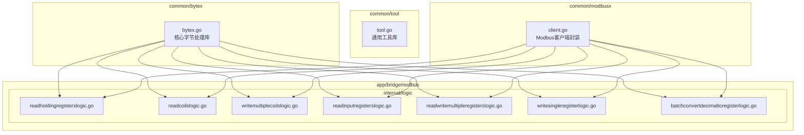
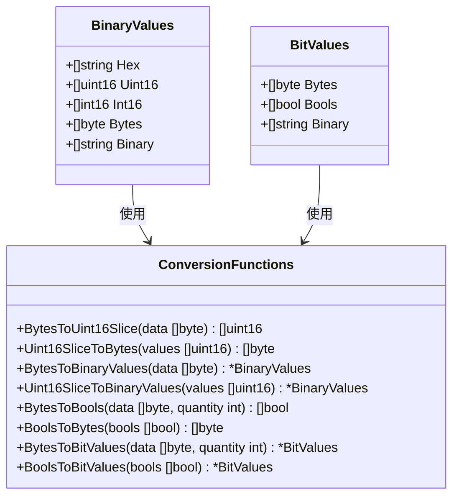
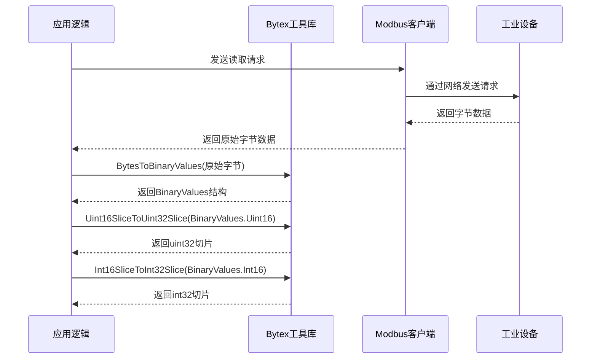
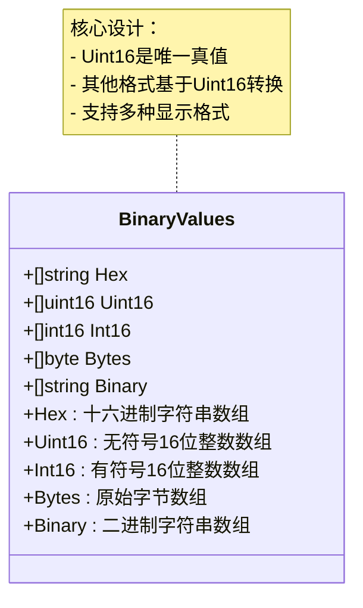
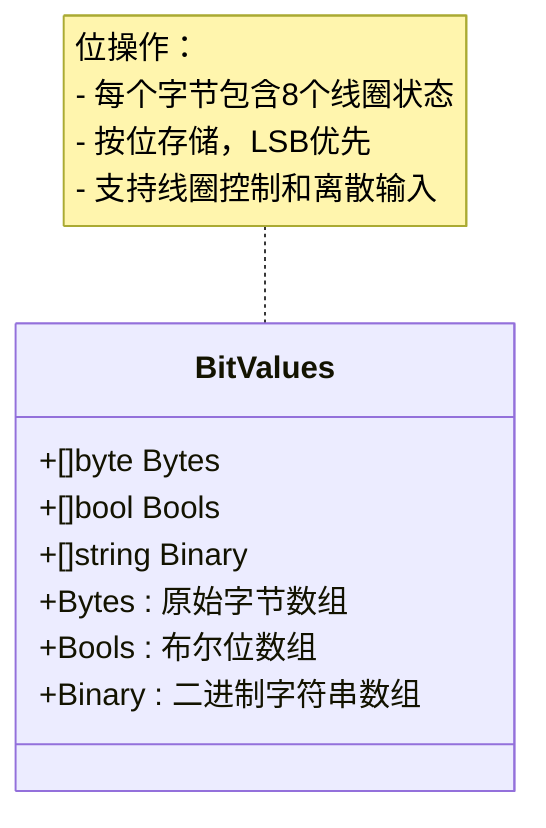
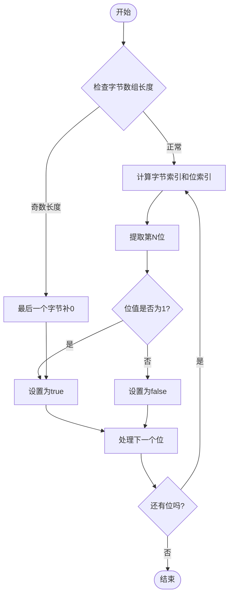
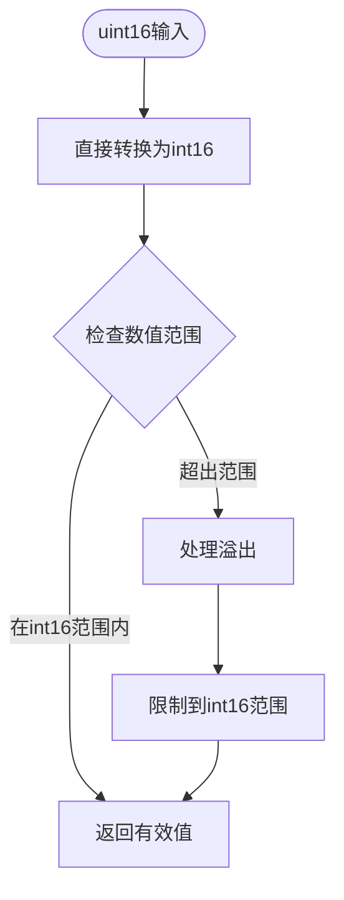
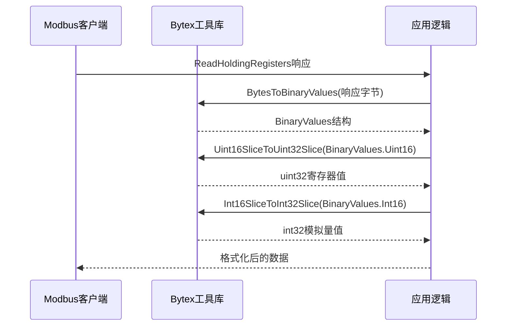
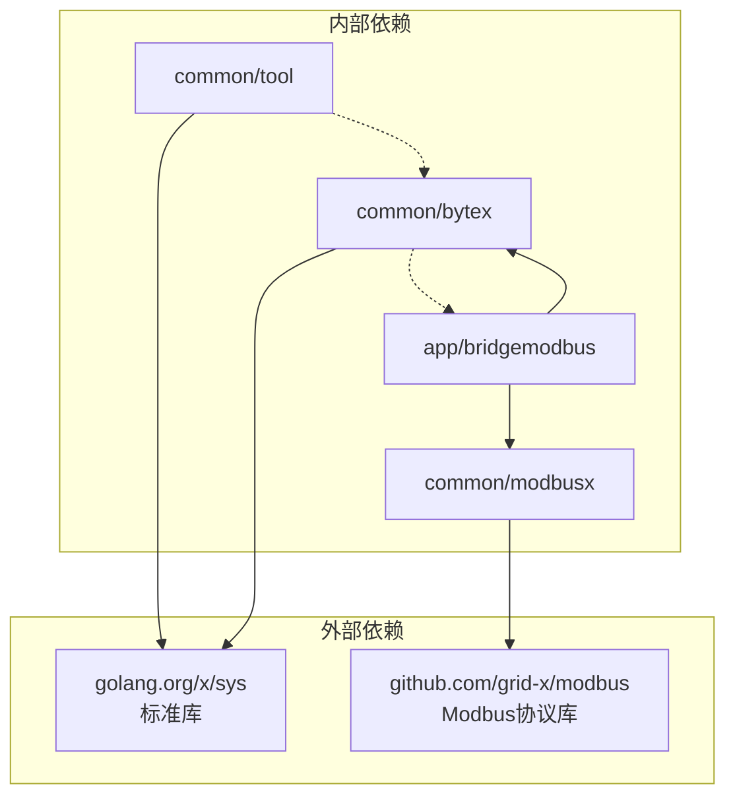

# Bytex字节处理工具

<cite>
**本文档引用的文件**
- [bytex.go](file://common/bytex/bytex.go)
- [tool.go](file://common/tool/tool.go)
- [client.go](file://common/modbusx/client.go)
- [readholdingregisterslogic.go](file://app/bridgemodbus/internal/logic/readholdingregisterslogic.go)
- [readcoilslogic.go](file://app/bridgemodbus/internal/logic/readcoilslogic.go)
- [writemultiplecoilslogic.go](file://app/bridgemodbus/internal/logic/writemultiplecoilslogic.go)
- [readinputregisterslogic.go](file://app/bridgemodbus/internal/logic/readinputregisterslogic.go)
- [readwritemultipleregisterslogic.go](file://app/bridgemodbus/internal/logic/readwritemultipleregisterslogic.go)
- [writesingleregisterlogic.go](file://app/bridgemodbus/internal/logic/writesingleregisterlogic.go)
- [batchconvertdecimaltoregisterlogic.go](file://app/bridgemodbus/internal/logic/batchconvertdecimaltoregisterlogic.go)
- [bridgemodbus.pb.go](file://app/bridgemodbus/bridgemodbus/bridgemodbus.pb.go)
</cite>

## 目录
1. [简介](#简介)
2. [项目结构](#项目结构)
3. [核心组件](#核心组件)
4. [架构概览](#架构概览)
5. [详细组件分析](#详细组件分析)
6. [依赖关系分析](#依赖关系分析)
7. [性能考虑](#性能考虑)
8. [故障排除指南](#故障排除指南)
9. [结论](#结论)

## 简介

Bytex是Zero-Service项目中的核心字节处理工具库，专门用于工业通信协议的数据格式转换。该工具提供了完整的字节与数值类型之间的转换功能，支持Modbus协议、IEC 61850协议等工业标准的数据处理需求。

本工具库的核心设计理念是提供统一的字节处理接口，支持多种数据类型的无缝转换，包括：
- 字节与uint16/uint32之间的转换
- 有符号与无符号整数之间的转换
- 布尔位操作与字节序列的互转
- 二进制数据的格式化输出

## 项目结构

Bytex工具库在项目中的组织结构如下：



**图表来源**
- [bytex.go:1-239](file://common/bytex/bytex.go#L1-L239)
- [client.go:1-218](file://common/modbusx/client.go#L1-L218)

**章节来源**
- [bytex.go:1-239](file://common/bytex/bytex.go#L1-L239)
- [client.go:1-218](file://common/modbusx/client.go#L1-L218)

## 核心组件

Bytex工具库包含以下核心组件：

### 数据结构设计



**图表来源**
- [bytex.go:8-20](file://common/bytex/bytex.go#L8-L20)

### 主要转换函数

Bytex提供了以下核心转换函数：

1. **字节与uint16转换**
   - `BytesToUint16Slice`: 将字节数组转换为uint16切片
   - `Uint16SliceToBytes`: 将uint16切片转换回字节数组

2. **有符号与无符号转换**
   - `Uint16ToInt16`: uint16到int16转换
   - `Uint16SliceToInt16Slice`: uint16切片到int16切片转换

3. **扩展类型转换**
   - `Uint16ToUint32`: uint16到uint32转换
   - `Uint16ToInt32`: uint16到int32转换
   - `Uint32ToUint16`: uint32到uint16转换
   - `Int32ToInt16`: int32到int16转换

4. **布尔位操作**
   - `BytesToBools`: 字节数组到布尔位切片转换
   - `BoolsToBytes`: 布尔位切片到字节数组转换

**章节来源**
- [bytex.go:25-131](file://common/bytex/bytex.go#L25-L131)
- [bytex.go:194-238](file://common/bytex/bytex.go#L194-L238)

## 架构概览

Bytex工具库采用模块化设计，提供独立的字节处理功能，同时与上层应用逻辑解耦：



**图表来源**
- [readholdingregisterslogic.go:49-56](file://app/bridgemodbus/internal/logic/readholdingregisterslogic.go#L49-L56)
- [bytex.go:136-161](file://common/bytex/bytex.go#L136-L161)

## 详细组件分析

### BinaryValues结构体分析

BinaryValues是Bytex的核心数据结构，用于存储不同格式的同一数据：



**图表来源**
- [bytex.go:8-14](file://common/bytex/bytex.go#L8-L14)

#### 设计理念

BinaryValues的设计遵循"单一真实来源"原则：
- **Uint16数组**作为唯一真值，确保数据一致性
- **其他格式**通过Uint16进行转换，避免重复计算
- **多格式支持**满足不同场景的显示和处理需求

#### 使用场景

1. **Modbus寄存器数据处理**
   - 保持寄存器：16位无符号整数
   - 输入寄存器：需要有符号转换的温度、压力等模拟量

2. **数据格式化输出**
   - 十六进制格式用于调试和日志
   - 二进制格式用于底层数据分析

**章节来源**
- [bytex.go:8-14](file://common/bytex/bytex.go#L8-L14)
- [bytex.go:136-161](file://common/bytex/bytex.go#L136-L161)

### BitValues结构体分析

BitValues专门处理布尔位操作：



**图表来源**
- [bytex.go:16-20](file://common/bytex/bytex.go#L16-L20)

#### 布尔位转换机制



**图表来源**
- [bytex.go:194-202](file://common/bytex/bytex.go#L194-L202)

**章节来源**
- [bytex.go:16-20](file://common/bytex/bytex.go#L16-L20)
- [bytex.go:194-202](file://common/bytex/bytex.go#L194-L202)

### 核心转换函数分析

#### 字节到uint16转换

```mermaid
flowchart TD
Start([输入字节数组]) --> CalcPairs[计算配对数量]
CalcPairs --> Loop[遍历每个配对]
Loop --> CheckPair{是否有完整配对?}
CheckPair --> |是| Combine[高位<<8 | 低位]
CheckPair --> |否| PadHigh[高位<<8，低位补0]
Combine --> AppendResult[添加到结果数组]
PadHigh --> AppendResult
AppendResult --> MorePairs{还有配对吗?}
MorePairs --> |是| Loop
MorePairs --> |否| End([返回uint16数组])
```

**图表来源**
- [bytex.go:25-40](file://common/bytex/bytex.go#L25-L40)

#### 有符号转换机制

Bytex采用直接类型转换的方式处理有符号转换：



**图表来源**
- [bytex.go:57-67](file://common/bytex/bytex.go#L57-L67)

**章节来源**
- [bytex.go:25-40](file://common/bytex/bytex.go#L25-L40)
- [bytex.go:57-67](file://common/bytex/bytex.go#L57-L67)

### 实际应用场景

#### Modbus协议数据处理

Bytex在Modbus协议处理中的应用：



**图表来源**
- [readholdingregisterslogic.go:49-56](file://app/bridgemodbus/internal/logic/readholdingregisterslogic.go#L49-L56)

#### 工业设备通信

在工业设备通信中的典型流程：

1. **读取线圈状态**
   ```go
   results, err := mbCli.ReadCoils(address, quantity)
   if err != nil {
       return err
   }
   bools := bytex.BytesToBools(results, int(quantity))
   ```

2. **写入多个线圈**
   ```go
   bitValues := bytex.BoolsToBitValues(in.Values)
   results, err := mbCli.WriteMultipleCoils(address, quantity, bitValues.Bytes)
   ```

3. **寄存器数据处理**
   ```go
   bv := bytex.BytesToBinaryValues(results)
   uint32Values := bytex.Uint16SliceToUint32Slice(bv.Uint16)
   int32Values := bytex.Int16SliceToInt32Slice(bv.Int16)
   ```

**章节来源**
- [readcoilslogic.go:35-42](file://app/bridgemodbus/internal/logic/readcoilslogic.go#L35-L42)
- [writemultiplecoilslogic.go:42-44](file://app/bridgemodbus/internal/logic/writemultiplecoilslogic.go#L42-L44)
- [readholdingregisterslogic.go:49-56](file://app/bridgemodbus/internal/logic/readholdingregisterslogic.go#L49-L56)

## 依赖关系分析

Bytex工具库的依赖关系图：



**图表来源**
- [bytex.go:3-5](file://common/bytex/bytex.go#L3-L5)
- [client.go:3-18](file://common/modbusx/client.go#L3-L18)

### 模块间耦合分析

Bytex工具库采用松耦合设计：
- **低内聚高内聚**：每个转换函数职责单一
- **无循环依赖**：上层应用依赖Bytex，而非相反
- **接口清晰**：所有公共函数都有明确的输入输出规范

**章节来源**
- [bytex.go:1-239](file://common/bytex/bytex.go#L1-L239)
- [client.go:1-218](file://common/modbusx/client.go#L1-L218)

## 性能考虑

### 时间复杂度分析

1. **字节转换函数**
   - 时间复杂度：O(n)，其中n为输入数据长度
   - 空间复杂度：O(n)，需要创建新的切片

2. **批量转换函数**
   - 时间复杂度：O(n)，线性扫描整个数组
   - 空间复杂度：O(n)，创建新数组存储结果

3. **布尔位转换**
   - 时间复杂度：O(n)，n为位的数量
   - 空间复杂度：O(n)，创建布尔数组

### 内存优化策略

1. **预分配容量**
   ```go
   result := make([]uint16, 0, n)  // 预分配容量
   ```

2. **就地转换**
   - 对于大型数据集，考虑重用现有切片减少内存分配

3. **延迟计算**
   - BinaryValues结构允许按需生成不同格式，避免不必要的转换

## 故障排除指南

### 常见问题及解决方案

#### 1. 数据长度不匹配错误

**问题描述**：当字节数组长度与预期不符时出现panic

**解决方案**：
- 确保输入数据长度正确
- 在调用前验证数据完整性

#### 2. 数值范围溢出

**问题描述**：uint16转换为int16时可能出现范围问题

**解决方案**：
- 检查数据范围是否在int16有效范围内
- 使用适当的边界检查

#### 3. Modbus通信错误

**问题描述**：与工业设备通信失败

**排查步骤**：
1. 验证设备地址和寄存器地址
2. 检查网络连接状态
3. 确认Modbus配置参数

**章节来源**
- [bytex.go:150-152](file://common/bytex/bytex.go#L150-L152)
- [readholdingregisterslogic.go:35-38](file://app/bridgemodbus/internal/logic/readholdingregisterslogic.go#L35-L38)

## 结论

Bytex字节处理工具库为Zero-Service项目提供了完整的工业通信数据处理能力。其设计特点包括：

1. **模块化设计**：功能清晰分离，易于维护和扩展
2. **类型安全**：严格的类型转换机制，避免数据丢失
3. **性能优化**：高效的算法实现，适合实时工业应用
4. **广泛适用**：支持多种工业协议和数据格式

通过Bytex工具库，开发者可以专注于业务逻辑实现，而无需担心底层的数据格式转换细节。该工具库在Modbus协议处理、工业设备通信等领域展现了强大的实用价值。