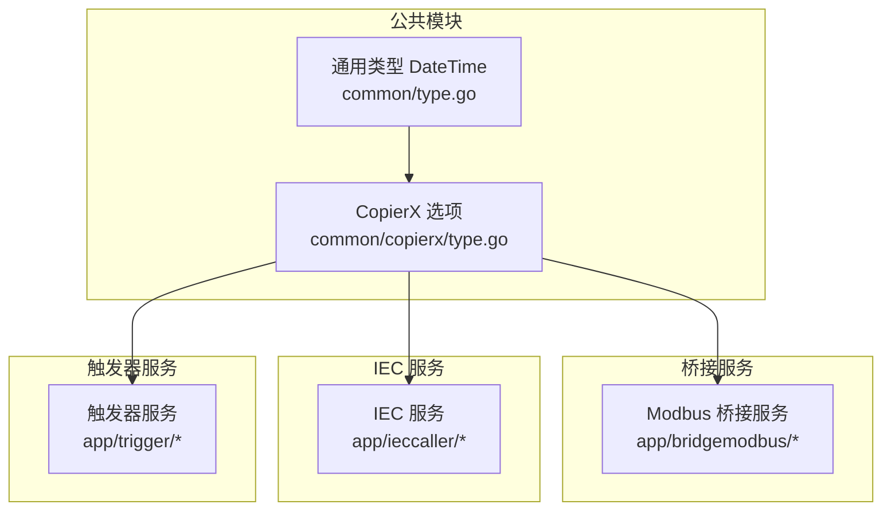
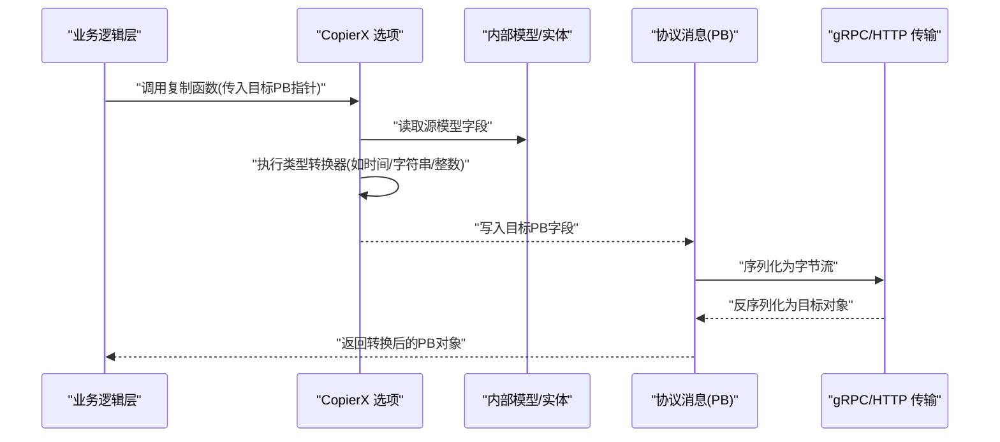
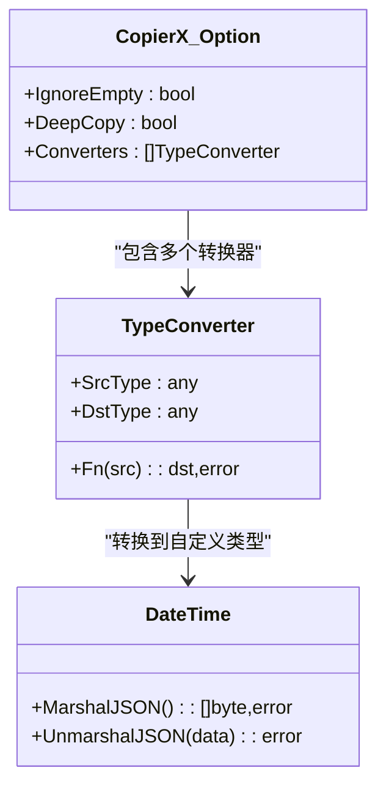
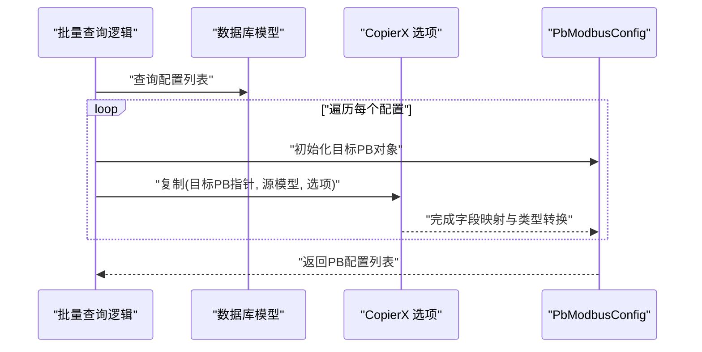
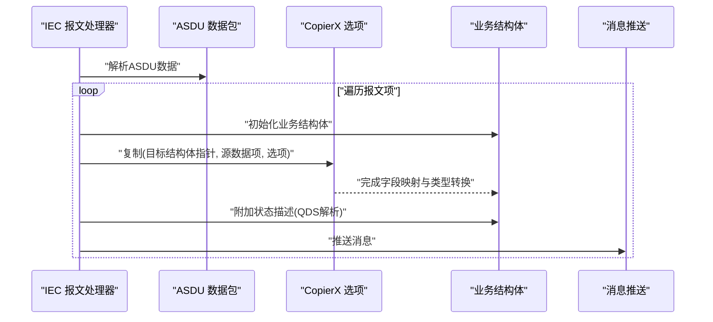
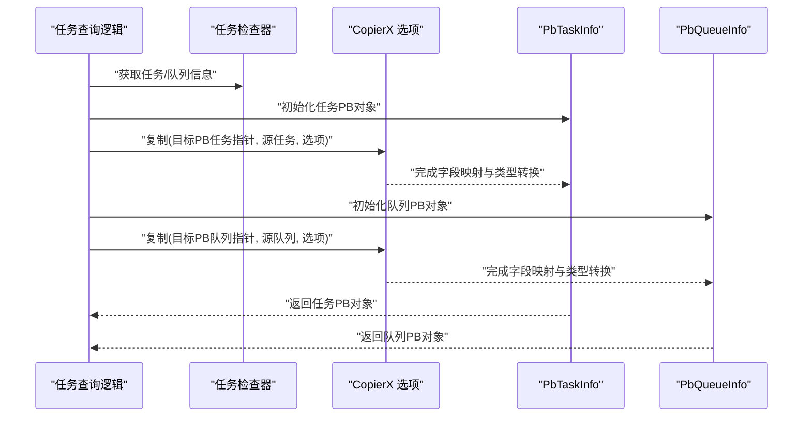
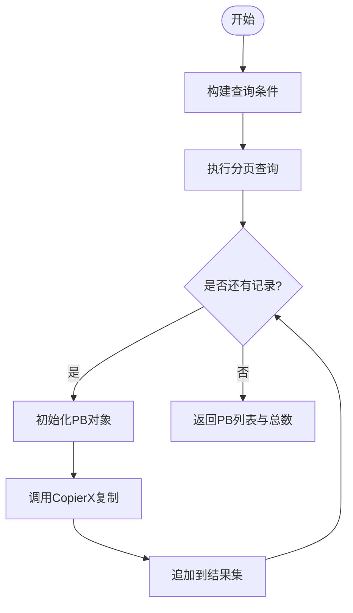
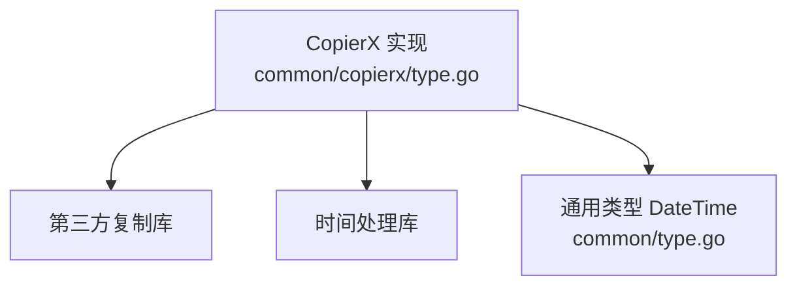

# CopierX结构体复制工具

<cite>
**本文档引用的文件**
- [common/copierx/type.go](file://common/copierx/type.go)
- [common/type.go](file://common/type.go)
- [app/bridgemodbus/internal/logic/batchgetconfigbycodelogic.go](file://app/bridgemodbus/internal/logic/batchgetconfigbycodelogic.go)
- [app/ieccaller/internal/iec/clienthandler.go](file://app/ieccaller/internal/iec/clienthandler.go)
- [app/ieccaller/internal/logic/pagelistpointmappinglogic.go](file://app/ieccaller/internal/logic/pagelistpointmappinglogic.go)
- [app/ieccaller/internal/logic/querypointmappingbyidlogic.go](file://app/ieccaller/internal/logic/querypointmappingbyidlogic.go)
- [app/trigger/internal/logic/gettaskinfologic.go](file://app/trigger/internal/logic/gettaskinfologic.go)
- [app/trigger/internal/logic/listactivetaskslogic.go](file://app/trigger/internal/logic/listactivetaskslogic.go)
- [app/bridgemodbus/bridgemodbus/bridgemodbus.pb.go](file://app/bridgemodbus/bridgemodbus/bridgemodbus.pb.go)
- [app/ieccaller/ieccaller/ieccaller.pb.go](file://app/ieccaller/ieccaller/ieccaller.pb.go)
- [go.mod](file://go.mod)
</cite>

## 目录
1. [简介](#简介)
2. [项目结构](#项目结构)
3. [核心组件](#核心组件)
4. [架构概览](#架构概览)
5. [详细组件分析](#详细组件分析)
6. [依赖分析](#依赖分析)
7. [性能考虑](#性能考虑)
8. [故障排除指南](#故障排除指南)
9. [结论](#结论)
10. [附录](#附录)

## 简介
CopierX 是 Zero-Service 中用于在不同结构体之间进行安全、高效复制与类型转换的工具。它基于第三方库进行深度复制、空值忽略以及自定义类型转换器，确保在微服务架构中进行数据传输时，结构体字段映射、类型兼容性检查与默认值处理能够稳定可靠地工作。本文将系统介绍 CopierX 的设计思想、实现细节与最佳实践，并通过多个真实场景展示其在 gRPC 接口调用、HTTP 请求处理与数据库模型转换中的使用方式。

## 项目结构
CopierX 的核心实现位于公共模块中，同时在多个业务服务中被广泛复用。下图展示了 CopierX 在项目中的组织结构与主要依赖关系：

**图表来源**
- [common/copierx/type.go:1-57](file://common/copierx/type.go#L1-L57)
- [common/type.go:27-45](file://common/type.go#L27-L45)
- [app/bridgemodbus/internal/logic/batchgetconfigbycodelogic.go:38](file://app/bridgemodbus/internal/logic/batchgetconfigbycodelogic.go#L38)
- [app/ieccaller/internal/iec/clienthandler.go:151](file://app/ieccaller/internal/iec/clienthandler.go#L151)
- [app/trigger/internal/logic/gettaskinfologic.go:38](file://app/trigger/internal/logic/gettaskinfologic.go#L38)

**章节来源**
- [common/copierx/type.go:1-57](file://common/copierx/type.go#L1-L57)
- [common/type.go:27-45](file://common/type.go#L27-L45)
- [go.mod:27](file://go.mod#L27)

## 核心组件
CopierX 的核心由以下部分组成：
- 全局复制选项：包含忽略空值、深度复制与类型转换器集合
- 类型转换器：针对时间戳、字符串与整数、以及自定义 DateTime 类型的转换逻辑
- 通用类型 DateTime：对 JSON 序列化的定制支持

关键特性：
- 忽略空值：避免将源对象中的零值覆盖目标对象已有有效值
- 深度复制：递归复制嵌套结构，防止共享引用导致的数据污染
- 自定义转换器：统一处理常见类型转换，减少重复代码与潜在错误

**章节来源**
- [common/copierx/type.go:12-56](file://common/copierx/type.go#L12-L56)
- [common/type.go:27-45](file://common/type.go#L27-L45)

## 架构概览
下图展示了 CopierX 在微服务架构中的典型调用流程：业务逻辑层通过统一的复制选项将内部模型转换为 gRPC/HTTP 协议消息，再在网络层进行序列化与传输。

**图表来源**
- [app/bridgemodbus/internal/logic/batchgetconfigbycodelogic.go:38](file://app/bridgemodbus/internal/logic/batchgetconfigbycodelogic.go#L38)
- [app/ieccaller/internal/iec/clienthandler.go:151](file://app/ieccaller/internal/iec/clienthandler.go#L151)
- [app/trigger/internal/logic/gettaskinfologic.go:38](file://app/trigger/internal/logic/gettaskinfologic.go#L38)

## 详细组件分析

### 组件A：类型转换器与复制选项
该组件负责定义全局复制行为与类型转换规则，确保在不同服务间进行结构体转换时的一致性与安全性。

**图表来源**
- [common/copierx/type.go:12-56](file://common/copierx/type.go#L12-L56)
- [common/type.go:27-45](file://common/type.go#L27-L45)

**章节来源**
- [common/copierx/type.go:12-56](file://common/copierx/type.go#L12-L56)
- [common/type.go:27-45](file://common/type.go#L27-L45)

### 组件B：在 Modbus 服务中的使用
该组件展示了如何在批量查询配置后，将内部模型转换为 gRPC 协议消息，以供下游服务消费。

**图表来源**
- [app/bridgemodbus/internal/logic/batchgetconfigbycodelogic.go:30-45](file://app/bridgemodbus/internal/logic/batchgetconfigbycodelogic.go#L30-L45)
- [app/bridgemodbus/bridgemodbus/bridgemodbus.pb.go:24-45](file://app/bridgemodbus/bridgemodbus/bridgemodbus.pb.go#L24-L45)

**章节来源**
- [app/bridgemodbus/internal/logic/batchgetconfigbycodelogic.go:30-45](file://app/bridgemodbus/internal/logic/batchgetconfigbycodelogic.go#L30-L45)
- [app/bridgemodbus/bridgemodbus/bridgemodbus.pb.go:24-45](file://app/bridgemodbus/bridgemodbus/bridgemodbus.pb.go#L24-L45)

### 组件C：在 IEC 服务中的使用
该组件展示了如何在接收 IEC 报文后，将其转换为统一的业务结构体，并附加状态描述字段，随后推送至消息队列。

**图表来源**
- [app/ieccaller/internal/iec/clienthandler.go:142-171](file://app/ieccaller/internal/iec/clienthandler.go#L142-L171)
- [app/ieccaller/internal/iec/clienthandler.go:173-204](file://app/ieccaller/internal/iec/clienthandler.go#L173-L204)
- [app/ieccaller/internal/iec/clienthandler.go:206-235](file://app/ieccaller/internal/iec/clienthandler.go#L206-L235)

**章节来源**
- [app/ieccaller/internal/iec/clienthandler.go:142-171](file://app/ieccaller/internal/iec/clienthandler.go#L142-L171)
- [app/ieccaller/internal/iec/clienthandler.go:173-204](file://app/ieccaller/internal/iec/clienthandler.go#L173-L204)
- [app/ieccaller/internal/iec/clienthandler.go:206-235](file://app/ieccaller/internal/iec/clienthandler.go#L206-L235)

### 组件D：在触发器服务中的使用
该组件展示了如何将异步任务与队列信息转换为 gRPC 协议消息，便于前端或网关层展示。

**图表来源**
- [app/trigger/internal/logic/gettaskinfologic.go:28-43](file://app/trigger/internal/logic/gettaskinfologic.go#L28-L43)
- [app/trigger/internal/logic/listactivetaskslogic.go:30-52](file://app/trigger/internal/logic/listactivetaskslogic.go#L30-L52)

**章节来源**
- [app/trigger/internal/logic/gettaskinfologic.go:28-43](file://app/trigger/internal/logic/gettaskinfologic.go#L28-L43)
- [app/trigger/internal/logic/listactivetaskslogic.go:30-52](file://app/trigger/internal/logic/listactivetaskslogic.go#L30-L52)

### 组件E：复杂逻辑流程（分页查询点位映射）
该组件展示了如何在分页查询中，逐条将内部模型转换为 gRPC 协议消息，并处理可能发生的错误。

**图表来源**
- [app/ieccaller/internal/logic/pagelistpointmappinglogic.go:30-60](file://app/ieccaller/internal/logic/pagelistpointmappinglogic.go#L30-L60)

**章节来源**
- [app/ieccaller/internal/logic/pagelistpointmappinglogic.go:30-60](file://app/ieccaller/internal/logic/pagelistpointmappinglogic.go#L30-L60)

## 依赖分析
CopierX 的核心依赖如下：
- 第三方复制库：提供深度复制与字段映射能力
- 时间处理库：提供时间格式化与解析
- 通用类型 DateTime：统一 JSON 序列化格式

**图表来源**
- [common/copierx/type.go:3-10](file://common/copierx/type.go#L3-L10)
- [go.mod:27](file://go.mod#L27)

**章节来源**
- [common/copierx/type.go:3-10](file://common/copierx/type.go#L3-L10)
- [go.mod:27](file://go.mod#L27)

## 性能考虑
- 深度复制的成本：对于大型嵌套结构，深度复制会带来额外的内存与 CPU 开销。建议仅在必要时启用深度复制，并尽量避免在热路径上对超大对象进行频繁复制。
- 类型转换器的开销：自定义转换器会在每次复制时执行，应保持转换逻辑简洁高效，避免在转换器中进行复杂的 I/O 或网络操作。
- 批量处理优化：在批量转换场景中，优先使用切片或循环一次性处理，减少多次分配与回收带来的 GC 压力。
- 内存管理：尽量复用已分配的对象，避免在循环中重复创建临时变量；在高并发场景下，考虑使用对象池或连接池降低内存抖动。

## 故障排除指南
- 类型不匹配错误：当源类型与转换器期望类型不符时，转换器会返回错误。请检查源对象字段类型与目标 PB 字段类型是否一致。
- 空值忽略策略：由于启用了忽略空值，某些字段可能不会被复制。若需要强制覆盖，请在调用前显式设置目标字段或调整复制选项。
- 错误传播：在分页查询等场景中，若某条记录转换失败，应记录错误并继续处理其他记录，避免影响整体流程。
- 日志与调试：在关键节点添加日志，记录复制前后的字段值，有助于定位类型转换问题。

**章节来源**
- [common/copierx/type.go:12-56](file://common/copierx/type.go#L12-L56)
- [app/ieccaller/internal/logic/pagelistpointmappinglogic.go:50-55](file://app/ieccaller/internal/logic/pagelistpointmappinglogic.go#L50-L55)

## 结论
CopierX 通过统一的复制选项与类型转换器，在 Zero-Service 的微服务架构中实现了结构体字段映射、类型兼容性检查与默认值处理的标准化。它不仅简化了业务逻辑层的代码，还提升了跨服务数据传输的可靠性与一致性。结合本文提供的最佳实践与故障排除建议，可以在保证性能的前提下，安全高效地使用 CopierX 完成各类数据转换任务。

## 附录
- gRPC 接口调用示例路径
  - [批量查询配置:30-45](file://app/bridgemodbus/internal/logic/batchgetconfigbycodelogic.go#L30-L45)
  - [IEC 报文处理:142-171](file://app/ieccaller/internal/iec/clienthandler.go#L142-L171)
  - [任务信息查询:28-43](file://app/trigger/internal/logic/gettaskinfologic.go#L28-L43)
- HTTP 请求处理示例路径
  - [分页查询点位映射:30-60](file://app/ieccaller/internal/logic/pagelistpointmappinglogic.go#L30-L60)
  - [按ID查询点位映射:30-45](file://app/ieccaller/internal/logic/querypointmappingbyidlogic.go#L30-L45)
- 数据库模型转换示例路径
  - [批量查询配置:30-45](file://app/bridgemodbus/internal/logic/batchgetconfigbycodelogic.go#L30-L45)
  - [活跃任务列表:30-52](file://app/trigger/internal/logic/listactivetaskslogic.go#L30-L52)