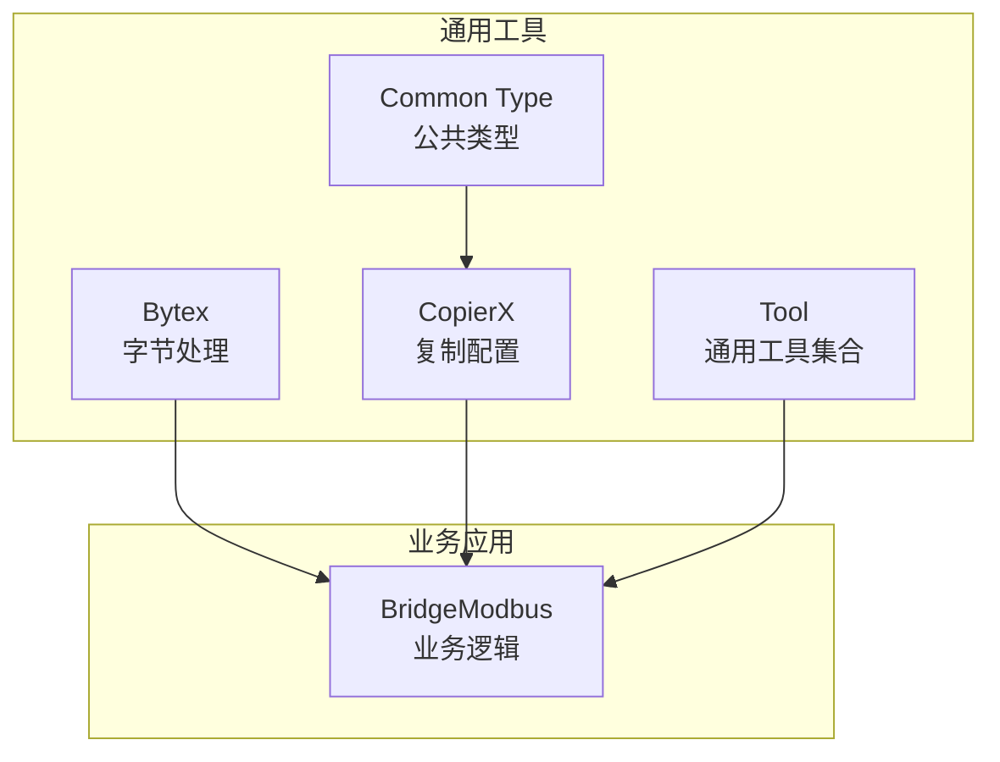
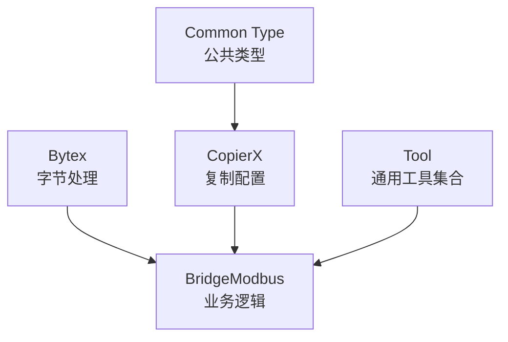
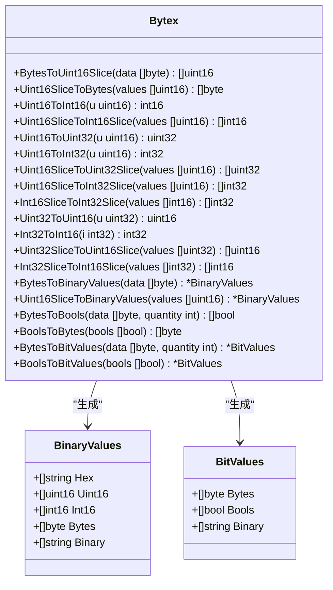
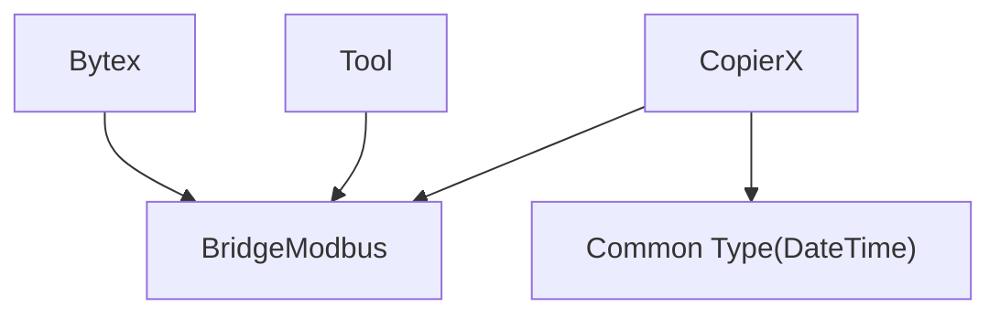

# 数据处理工具

<cite>
**本文引用的文件**
- [bytex.go](file://common/bytex/bytex.go)
- [type.go](file://common/copierx/type.go)
- [tool.go](file://common/tool/tool.go)
- [errorutil.go](file://common/tool/errorutil.go)
- [idutil.go](file://common/tool/idutil.go)
- [backoff.go](file://common/tool/backoff.go)
- [type.go](file://common/type.go)
- [batchconvertdecimaltoregisterlogic.go](file://app/bridgemodbus/internal/logic/batchconvertdecimaltoregisterlogic.go)
- [readholdingregisterslogic.go](file://app/bridgemodbus/internal/logic/readholdingregisterslogic.go)
- [readcoilslogic.go](file://app/bridgemodbus/internal/logic/readcoilslogic.go)
- [batchgetconfigbycodelogic.go](file://app/bridgemodbus/internal/logic/batchgetconfigbycodelogic.go)
- [getconfigbycodelogic.go](file://app/bridgemodbus/internal/logic/getconfigbycodelogic.go)
- [pagelistconfiglogic.go](file://app/bridgemodbus/internal/logic/pagelistconfiglogic.go)
</cite>

## 目录
1. [简介](#简介)
2. [项目结构](#项目结构)
3. [核心组件](#核心组件)
4. [架构总览](#架构总览)
5. [详细组件分析](#详细组件分析)
6. [依赖分析](#依赖分析)
7. [性能考虑](#性能考虑)
8. [故障排查指南](#故障排查指南)
9. [结论](#结论)
10. [附录](#附录)

## 简介
本技术文档聚焦 Zero-Service 的三类数据处理工具：
- Bytex 字节处理工具：提供字节与 16 位整数之间的互转、二进制/十六进制格式化、布尔位解析与打包等能力，覆盖 Modbus 等协议常见的字节处理需求。
- CopierX 结构体复制工具：基于 copier 库扩展类型转换器，支持时间到字符串、字符串到整数、以及 time.Time 到自定义 DateTime 的转换，提升结构体复制的灵活性与一致性。
- 通用工具集合：涵盖 JWT 解析与校验、金额分/元转换、字节大小格式化、短路径生成、时间戳生成、Base62 编码、Protobuf 序列化、用户上下文提取、偏移量计算、二进制值结构体构建、以及字节与 16 位整数互转等实用函数。

## 项目结构
围绕数据处理工具的核心文件分布如下：
- common/bytex：字节处理工具
- common/copierx：结构体复制配置
- common/tool：通用工具集合（含错误工具、ID 工具、退避策略等）
- common/type：公共类型定义（如 DateTime）
- app/bridgemodbus：实际业务场景中对 Bytex/CopierX 的集成使用示例



**图示来源**
- [bytex.go:1-239](file://common/bytex/bytex.go#L1-L239)
- [type.go:1-57](file://common/copierx/type.go#L1-L57)
- [tool.go:1-469](file://common/tool/tool.go#L1-L469)
- [type.go:1-45](file://common/type.go#L1-L45)
- [batchconvertdecimaltoregisterlogic.go:50-68](file://app/bridgemodbus/internal/logic/batchconvertdecimaltoregisterlogic.go#L50-L68)
- [readholdingregisterslogic.go:40-58](file://app/bridgemodbus/internal/logic/readholdingregisterslogic.go#L40-L58)
- [readcoilslogic.go:35-44](file://app/bridgemodbus/internal/logic/readcoilslogic.go#L35-L44)

**章节来源**
- [bytex.go:1-239](file://common/bytex/bytex.go#L1-L239)
- [type.go:1-57](file://common/copierx/type.go#L1-L57)
- [tool.go:1-469](file://common/tool/tool.go#L1-L469)
- [type.go:1-45](file://common/type.go#L1-L45)

## 核心组件
- Bytex：提供字节与 16 位整数互转、有符号/无符号转换、十六进制/二进制格式化、布尔位解析与打包等能力，便于协议解析与数据展示。
- CopierX：通过 TypeConverter 扩展常见类型转换，确保跨模块/跨协议的数据结构复制一致性。
- 通用工具集合：提供 JWT 解析、金额转换、字节格式化、短路径生成、时间戳生成、Base62 编码、Protobuf 序列化、用户上下文提取、偏移量计算、二进制值结构体构建等。

**章节来源**
- [bytex.go:1-239](file://common/bytex/bytex.go#L1-L239)
- [type.go:1-57](file://common/copierx/type.go#L1-L57)
- [tool.go:1-469](file://common/tool/tool.go#L1-L469)

## 架构总览
下图展示了数据处理工具在系统中的角色与交互关系：



**图示来源**
- [bytex.go:1-239](file://common/bytex/bytex.go#L1-L239)
- [type.go:1-57](file://common/copierx/type.go#L1-L57)
- [tool.go:1-469](file://common/tool/tool.go#L1-L469)
- [type.go:1-45](file://common/type.go#L1-L45)

## 详细组件分析

### Bytex 字节处理工具
Bytex 提供以下关键能力：
- 字节与 16 位整数互转：按字节对齐组合/拆分，支持奇数字节末尾补零。
- 有符号/无符号转换：提供 uint16/int16 互转，以及 uint16/uint32/int32 的扩展转换。
- 十六进制/二进制格式化：输出 16 位宽度的 0xXXXX 和 0bXXXXXXXXXXXXXXXX 字符串。
- 布尔位解析与打包：将字节流按位解析为布尔数组，或将布尔数组打包为字节流。
- 二进制值结构体：统一承载 Hex、Uint16、Int16、Bytes、Binary 等字段，便于调试与展示。



**图示来源**
- [bytex.go:1-239](file://common/bytex/bytex.go#L1-L239)

**章节来源**
- [bytex.go:1-239](file://common/bytex/bytex.go#L1-L239)

### CopierX 结构体复制工具
CopierX 在默认复制选项基础上，注册了三种类型转换器：
- time.Time → string：使用 Carbon 格式化为微秒级字符串。
- string → int：安全地将字符串解析为整数。
- time.Time → common.DateTime：桥接自定义 DateTime 类型。

```mermaid
classDiagram
class CopierX {
+Option copier.Option
}
class TypeConverter {
+SrcType interface{}
+DstType interface{}
+Fn(src interface{}) (interface{}, error)
}
CopierX --> TypeConverter : "注册转换器"
```

**图示来源**
- [type.go:1-57](file://common/copierx/type.go#L1-L57)

**章节来源**
- [type.go:1-57](file://common/copierx/type.go#L1-L57)
- [type.go:1-45](file://common/type.go#L1-L45)

### 通用工具集合
通用工具集合包含以下典型能力：
- JWT 解析与校验：支持多密钥尝试，自动剥离 Bearer 前缀。
- 金额转换：分/元互转，保留两位小数。
- 字节格式化：十进制与二进制字节单位格式化。
- 短路径生成：通过 Base62 编码生成短路径，支持唯一 ID 输出。
- 时间戳生成：秒/毫秒/微秒时间戳生成。
- Base62 编码：大整数处理避免溢出。
- Protobuf 序列化：反射与类型断言，兼容指针/结构体。
- 用户上下文提取：从上下文或当前用户对象中提取用户 ID/名称/部门编码。
- 偏移量计算：分页偏移量计算。
- 二进制值结构体与字节互转：复用 Bytex 的能力，统一二进制视图。

```mermaid
classDiagram
class Tool {
+ParseToken(tokenString string, secrets ...string) (MapClaims, error)
+Fen2Yuan(fen int64) float64
+Yuan2Fen(yuan float64) int64
+DecimalBytes(size int64, precision ...int) string
+BinaryBytes(size int64, precision ...int) string
+ShortPath(randomBytesLen int) (string, string, error)
+GenSecondTS() int64
+GenMilliTS() int64
+GenMicroTS() int64
+EncodeBase62(data []byte) string
+ToProtoBytes(v interface{}) ([]byte, error)
+GetCurrentUserId(ctx, currentUser) string
+GetCurrentUserName(ctx, currentUser) string
+GetCurrentDeptCode(ctx, currentUser) string
+CalculateOffset(page, pageSize int64) uint
}
class ErrorUtil {
+NewErrorByPbCode(code, args...) error
+IsErrorByPbCode(err, code) bool
}
class IdUtil {
+NextId(outDescType, category) string
+SimpleUUID() (string, error)
}
class Backoff {
+CalculateNextTriggerTime(failureCount, expiry) (time.Time, bool)
+CalculateNextTriggerTimeString(failureCount, defaultTimeout) (string, bool)
}
Tool --> ErrorUtil : "使用"
Tool --> IdUtil : "使用"
Tool --> Backoff : "使用"
```

**图示来源**
- [tool.go:1-469](file://common/tool/tool.go#L1-L469)
- [errorutil.go:1-91](file://common/tool/errorutil.go#L1-L91)
- [idutil.go:1-60](file://common/tool/idutil.go#L1-L60)
- [backoff.go:1-41](file://common/tool/backoff.go#L1-L41)

**章节来源**
- [tool.go:1-469](file://common/tool/tool.go#L1-L469)
- [errorutil.go:1-91](file://common/tool/errorutil.go#L1-L91)
- [idutil.go:1-60](file://common/tool/idutil.go#L1-L60)
- [backoff.go:1-41](file://common/tool/backoff.go#L1-L41)

## 依赖分析
- Bytex 与通用工具集合共享二进制值结构体与字节互转函数，形成统一的二进制视图。
- CopierX 依赖 common.DateTime 类型，确保时间字段在复制过程中的正确性。
- 业务层（BridgeModbus）广泛使用 Bytex 进行协议解析，使用 CopierX 进行结构体复制。



**图示来源**
- [bytex.go:1-239](file://common/bytex/bytex.go#L1-L239)
- [tool.go:1-469](file://common/tool/tool.go#L1-L469)
- [type.go:1-57](file://common/copierx/type.go#L1-L57)
- [type.go:1-45](file://common/type.go#L1-L45)

**章节来源**
- [bytex.go:1-239](file://common/bytex/bytex.go#L1-L239)
- [tool.go:1-469](file://common/tool/tool.go#L1-L469)
- [type.go:1-57](file://common/copierx/type.go#L1-L57)
- [type.go:1-45](file://common/type.go#L1-L45)

## 性能考虑
- Bytex 的字节与整数互转采用预分配切片与位运算，时间复杂度 O(n)，适合高频协议解析场景。
- 通用工具集合中的 Base62 编码使用大整数库，避免溢出但带来额外开销；建议在高频场景下缓存中间结果。
- Protobuf 序列化通过反射与类型断言实现，建议优先传入 proto.Message 实例以减少反射成本。
- CopierX 的类型转换器在复制过程中按需触发，建议在批量复制时复用 Option，避免重复初始化。

[本节为通用性能建议，无需特定文件引用]

## 故障排查指南
- Bytex：若出现长度不匹配或奇数字节处理异常，检查输入字节长度与 quantity 参数是否一致。
- CopierX：当转换失败时，确认源/目标类型与转换器注册一致，并检查 time.Time 与字符串/整数的格式。
- 通用工具集合：
  - JWT 解析失败：确认密钥列表与令牌格式，注意 Bearer 前缀处理。
  - 错误码映射：使用 NewErrorByPbCode 时，确保 extproto.Code 的枚举值与 HTTP 状态码映射正确。
  - 短路径冲突：缩短 randomBytesLen 或增加长度以降低冲突概率。
  - 金额转换：注意精度丢失，建议在 UI 层二次格式化。

**章节来源**
- [bytex.go:1-239](file://common/bytex/bytex.go#L1-L239)
- [type.go:1-57](file://common/copierx/type.go#L1-L57)
- [tool.go:1-469](file://common/tool/tool.go#L1-L469)
- [errorutil.go:1-91](file://common/tool/errorutil.go#L1-L91)

## 结论
Bytex、CopierX 与通用工具集合共同构成了 Zero-Service 的数据处理基石。Bytex 提供协议级的字节操作与二进制视图；CopierX 保障结构体复制的类型一致性；通用工具集合覆盖常见业务场景下的数据转换与格式化需求。结合业务逻辑中的实际使用案例，可实现高效、稳定的数据处理流程。

[本节为总结性内容，无需特定文件引用]

## 附录

### 使用示例与最佳实践

- Bytex 字节处理示例
  - 将字节流解析为 16 位寄存器值并格式化为十六进制与二进制字符串，便于日志与调试。
  - 将布尔位数组打包为字节流，用于写线圈/离散输入等场景。
  - 参考路径：
    - [readholdingregisterslogic.go:40-58](file://app/bridgemodbus/internal/logic/readholdingregisterslogic.go#L40-L58)
    - [readcoilslogic.go:35-44](file://app/bridgemodbus/internal/logic/readcoilslogic.go#L35-L44)
    - [batchconvertdecimaltoregisterlogic.go:50-68](file://app/bridgemodbus/internal/logic/batchconvertdecimaltoregisterlogic.go#L50-L68)

- CopierX 结构体复制示例
  - 在配置查询与分页列表场景中，使用 CopyWithOption 完成结构体复制与类型转换。
  - 参考路径：
    - [batchgetconfigbycodelogic.go:38-38](file://app/bridgemodbus/internal/logic/batchgetconfigbycodelogic.go#L38-L38)
    - [getconfigbycodelogic.go:34-34](file://app/bridgemodbus/internal/logic/getconfigbycodelogic.go#L34-L34)
    - [pagelistconfiglogic.go:46-46](file://app/bridgemodbus/internal/logic/pagelistconfiglogic.go#L46-L46)

- 通用工具函数示例
  - 金额转换：在支付/订单场景中进行分/元转换。
  - 短路径生成：在文件上传/分享场景中生成短路径。
  - 时间戳生成：记录事件发生时间，支持秒/毫秒/微秒级别。
  - JWT 解析：在鉴权中间件中解析并验证令牌。
  - 参考路径：
    - [tool.go:70-80](file://common/tool/tool.go#L70-L80)
    - [tool.go:126-131](file://common/tool/tool.go#L126-L131)
    - [tool.go:142-154](file://common/tool/tool.go#L142-L154)
    - [tool.go:35-65](file://common/tool/tool.go#L35-L65)

**章节来源**
- [readholdingregisterslogic.go:40-58](file://app/bridgemodbus/internal/logic/readholdingregisterslogic.go#L40-L58)
- [readcoilslogic.go:35-44](file://app/bridgemodbus/internal/logic/readcoilslogic.go#L35-L44)
- [batchconvertdecimaltoregisterlogic.go:50-68](file://app/bridgemodbus/internal/logic/batchconvertdecimaltoregisterlogic.go#L50-L68)
- [batchgetconfigbycodelogic.go:38-38](file://app/bridgemodbus/internal/logic/batchgetconfigbycodelogic.go#L38-L38)
- [getconfigbycodelogic.go:34-34](file://app/bridgemodbus/internal/logic/getconfigbycodelogic.go#L34-L34)
- [pagelistconfiglogic.go:46-46](file://app/bridgemodbus/internal/logic/pagelistconfiglogic.go#L46-L46)
- [tool.go:70-80](file://common/tool/tool.go#L70-L80)
- [tool.go:126-131](file://common/tool/tool.go#L126-L131)
- [tool.go:142-154](file://common/tool/tool.go#L142-L154)
- [tool.go:35-65](file://common/tool/tool.go#L35-L65)