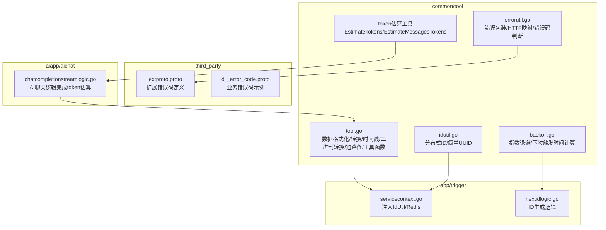
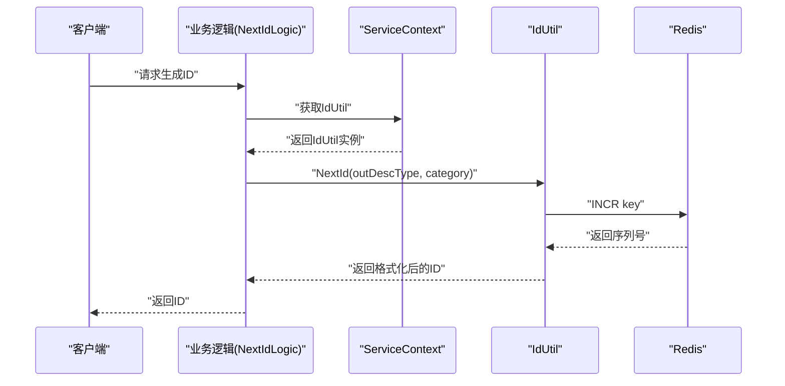
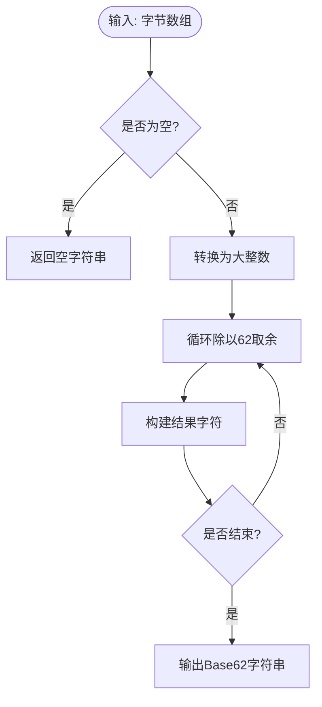
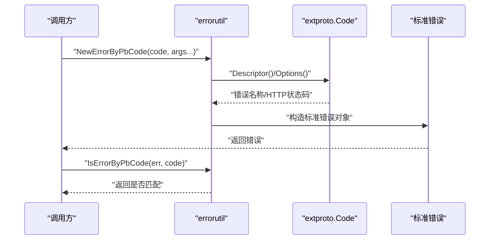
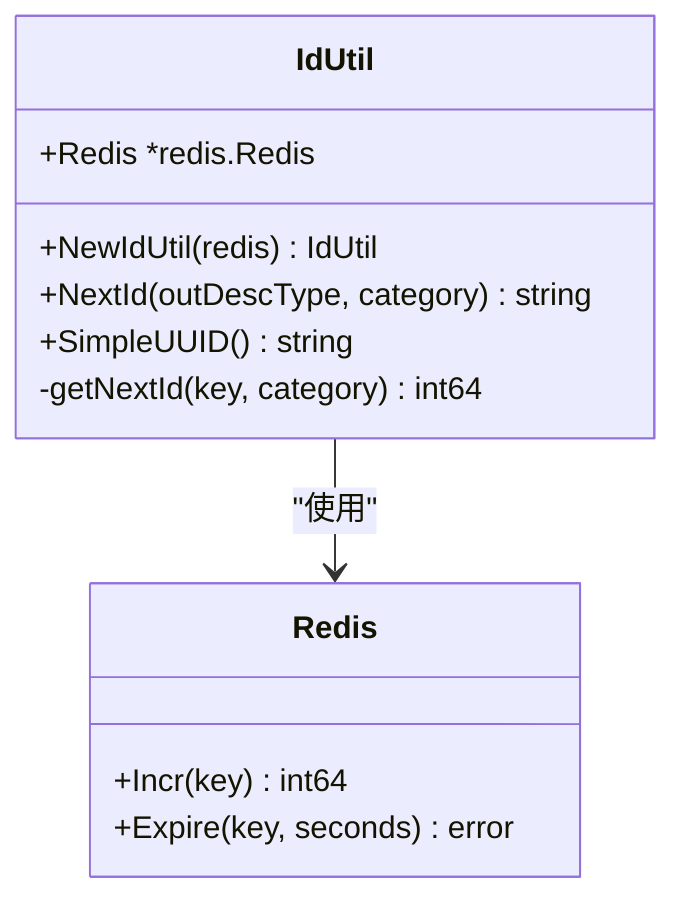
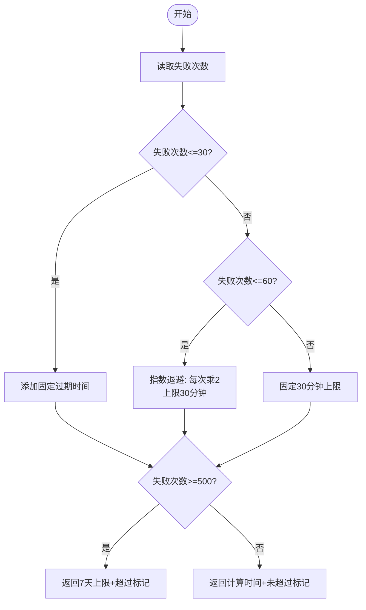
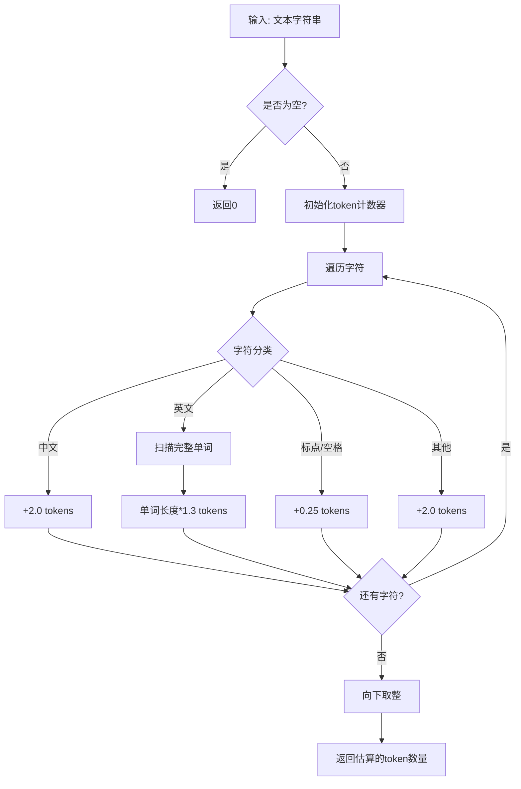
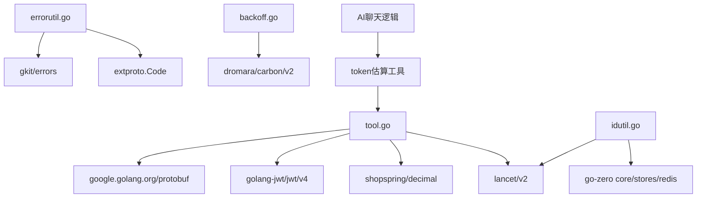

# 通用工具函数集合

<cite>
**本文引用的文件**
- [backoff.go](file://common/tool/backoff.go)
- [errorutil.go](file://common/tool/errorutil.go)
- [idutil.go](file://common/tool/idutil.go)
- [tool.go](file://common/tool/tool.go)
- [servicecontext.go](file://app/trigger/internal/svc/servicecontext.go)
- [nextidlogic.go](file://app/trigger/internal/logic/nextidlogic.go)
- [extproto.proto](file://third_party/extproto/extproto.proto)
- [dji_error_code.proto](file://third_party/dji_error_code.proto)
- [chatcompletionstreamlogic.go](file://aiapp/aichat/internal/logic/chatcompletionstreamlogic.go)
</cite>

## 目录
1. [简介](#简介)
2. [项目结构](#项目结构)
3. [核心组件](#核心组件)
4. [架构总览](#架构总览)
5. [详细组件分析](#详细组件分析)
6. [依赖分析](#依赖分析)
7. [性能考量](#性能考量)
8. [故障排查指南](#故障排查指南)
9. [结论](#结论)
10. [附录](#附录)

## 简介
本文件面向Zero-Service项目的通用工具函数集合，重点覆盖以下能力：
- 数据格式化与转换：金额换算、字节单位格式化、Base62编码、短路径生成、时间戳生成、二进制/十进制/十六进制互转、布尔位打包/解包等。
- 错误处理：基于统一错误码枚举的错误包装与HTTP语义映射，以及按错误码判断的链式错误追踪。
- ID生成：分布式唯一ID生成（含时间戳+序列号）与简单UUID生成。
- 退避重试：指数退避算法的实现与使用场景，包括最大重试次数、初始延迟时间与退避倍数配置。
- **新增**：Token估算：提供文本和消息列表的token数量估算功能，用于AI应用的资源规划和上下文大小控制。

文档同时提供使用示例的代码片段路径、性能与并发注意事项、最佳实践与常见问题排查建议，帮助开发者在服务调用、API响应处理与业务逻辑中高效、安全地使用这些工具。

## 项目结构
通用工具函数集中于common/tool目录，配套在应用层（如trigger）中通过ServiceContext注入使用，错误码定义位于third_party目录。AI应用中的聊天逻辑已集成token估算功能用于上下文大小检查。

**图表来源**
- [tool.go](file://common/tool/tool.go)
- [errorutil.go](file://common/tool/errorutil.go)
- [idutil.go](file://common/tool/idutil.go)
- [backoff.go](file://common/tool/backoff.go)
- [servicecontext.go](file://app/trigger/internal/svc/servicecontext.go)
- [nextidlogic.go](file://app/trigger/internal/logic/nextidlogic.go)
- [extproto.proto](file://third_party/extproto/extproto.proto)
- [dji_error_code.proto](file://third_party/dji_error_code.proto)
- [chatcompletionstreamlogic.go](file://aiapp/aichat/internal/logic/chatcompletionstreamlogic.go)

## 核心组件
- 数据格式化与转换工具集：提供金额分/元换算、字节单位格式化、Base62编码、短路径生成、多类时间戳生成、二进制/整型数组互转、布尔位打包/解包等。
- 错误处理工具集：基于统一错误码枚举，动态解析错误名称与HTTP状态码，构造标准错误对象，并支持按错误码进行判断。
- ID生成工具集：基于Redis原子递增生成序列号，结合时间戳与类别生成分布式唯一ID，同时提供简单UUID生成。
- 退避重试工具集：根据失败次数计算下一次触发时间，支持指数退避与上限保护，返回是否超过最大阈值。
- **新增**：Token估算工具集：提供文本和消息列表的token数量估算功能，采用字符分类规则进行近似计算，适用于AI应用的资源规划和上下文大小控制。

**章节来源**
- [tool.go](file://common/tool/tool.go)
- [errorutil.go](file://common/tool/errorutil.go)
- [idutil.go](file://common/tool/idutil.go)
- [backoff.go](file://common/tool/backoff.go)

## 架构总览
通用工具函数在应用层通过ServiceContext统一注入，典型流程如下：
- 应用层逻辑在ServiceContext中持有IdUtil实例，用于生成分布式ID。
- 错误处理通过errorutil统一包装，结合third_party中的错误码定义，实现跨服务的一致性错误语义。
- 数据格式化工具贯穿于请求/响应处理、日志记录与业务计算环节。
- **新增**：AI应用中的聊天逻辑通过token估算工具检查上下文大小，防止超出模型限制。

**图表来源**
- [servicecontext.go](file://app/trigger/internal/svc/servicecontext.go)
- [nextidlogic.go](file://app/trigger/internal/logic/nextidlogic.go)
- [idutil.go](file://common/tool/idutil.go)

## 详细组件分析

### 数据格式化与转换工具集（tool.go）
- 金额换算：提供分到元与元到分的双向转换，使用高精度十进制避免浮点误差。
- 字节单位格式化：提供十进制与二进制字节格式化输出。
- 短路径生成：通过Base62编码随机字节生成短路径，支持长度校验与唯一ID输出。
- 时间戳生成：提供秒、毫秒、微秒三种粒度的时间戳生成。
- Base62编码：对任意字节数组进行Base62编码，避免溢出与零值处理。
- 二进制/整型互转：提供字节数组与uint16/int16/uint32/int32数组之间的转换，支持完整二进制视图结构。
- 布尔位打包/解包：将字节流与布尔位数组互转，便于协议处理。
- JWT解析：支持多种密钥轮换的JWT解析与校验。
- 其他工具：生成OSS文件名、上下文用户信息提取、分页偏移计算等。

**图表来源**
- [tool.go](file://common/tool/tool.go)

**章节来源**
- [tool.go](file://common/tool/tool.go)

### 错误处理工具集（errorutil.go）
- 统一错误包装：根据错误码枚举动态解析错误名称与HTTP状态码，构造标准错误对象。
- 错误码判断：支持按错误码进行链式错误追踪，便于跨服务一致性处理。
- 与third_party扩展错误码集成：通过Protobuf扩展字段读取错误名称与HTTP状态码。

**图表来源**
- [errorutil.go](file://common/tool/errorutil.go)
- [extproto.proto](file://third_party/extproto/extproto.proto)

**章节来源**
- [errorutil.go](file://common/tool/errorutil.go)
- [extproto.proto](file://third_party/extproto/extproto.proto)

### ID生成工具集（idutil.go）
- 分布式唯一ID：基于Redis原子递增生成序列号，结合当前时间与类别生成全局唯一ID，具备时间序与序列号特征。
- 简单UUID：生成不含"-"的UUID v4，便于URL/文件名等场景使用。
- 并发安全：依赖Redis的原子操作保障并发安全；序列号在特定区间时会设置过期时间，避免长期占用。

**图表来源**
- [idutil.go](file://common/tool/idutil.go)

**章节来源**
- [idutil.go](file://common/tool/idutil.go)
- [servicecontext.go](file://app/trigger/internal/svc/servicecontext.go)
- [nextidlogic.go](file://app/trigger/internal/logic/nextidlogic.go)

### 退避重试工具集（backoff.go）
- 指数退避算法：根据失败次数计算下一次触发时间，支持阶梯式指数增长与上限保护。
- 最大重试次数与上限：当失败次数达到阈值时，返回固定上限时间并标记超过阈值。
- 时间格式化：提供带格式化的触发时间字符串输出。

**图表来源**
- [backoff.go](file://common/tool/backoff.go)

**章节来源**
- [backoff.go](file://common/tool/backoff.go)

### Token估算工具集（新增）
- **EstimateTokens**：估算单个文本的token数量（近似值），采用字符分类规则：
  - 中文字符：约2 tokens/字符
  - 英文单词：约1.3 tokens/单词
  - 标点/空格：约0.25 tokens/字符
  - 其他字符（emoji等）：约2 tokens/字符
- **EstimateMessagesTokens**：估算消息列表的总token数，包含消息格式开销（约4 tokens/条）
- **使用场景**：AI应用的上下文大小检查、资源规划、成本估算
- **注意**：这是粗略估算，实际token数因模型而异。如需精确值请使用tiktoken等专业库。

**图表来源**
- [tool.go](file://common/tool/tool.go)

**章节来源**
- [tool.go](file://common/tool/tool.go)
- [chatcompletionstreamlogic.go](file://aiapp/aichat/internal/logic/chatcompletionstreamlogic.go)

## 依赖分析
- 第三方库依赖：lancet（转换/格式化/随机）、shopspring/decimal（高精度十进制）、golang-jwt（JWT解析）、google/protobuf（错误码枚举反射）、carbon（时间格式化）。
- 内部依赖：third_party中的extproto与dji_error_code作为错误码定义来源；app/trigger通过ServiceContext注入IdUtil；AI应用通过token估算工具进行上下文大小检查。

**图表来源**
- [tool.go](file://common/tool/tool.go)
- [errorutil.go](file://common/tool/errorutil.go)
- [idutil.go](file://common/tool/idutil.go)
- [backoff.go](file://common/tool/backoff.go)
- [extproto.proto](file://third_party/extproto/extproto.proto)
- [chatcompletionstreamlogic.go](file://aiapp/aichat/internal/logic/chatcompletionstreamlogic.go)

**章节来源**
- [tool.go](file://common/tool/tool.go)
- [errorutil.go](file://common/tool/errorutil.go)
- [idutil.go](file://common/tool/idutil.go)
- [backoff.go](file://common/tool/backoff.go)
- [extproto.proto](file://third_party/extproto/extproto.proto)
- [chatcompletionstreamlogic.go](file://aiapp/aichat/internal/logic/chatcompletionstreamlogic.go)

## 性能考量
- Redis原子递增：ID生成依赖Redis的原子操作，具备高并发下的强一致性；建议合理设置过期时间与键命名策略，避免键空间膨胀。
- Base62编码：对大整数进行除法取余，时间复杂度与输入字节长度成正比；短路径生成建议随机字节数在3-10之间平衡冲突概率与可读性。
- 金额换算：使用高精度十进制避免浮点误差，适合金融场景；注意与数据库/前端交互时的精度控制。
- 二进制/整型转换：数组长度较大时注意内存分配与拷贝成本；批量转换时尽量复用切片。
- JWT解析：支持多密钥轮换，解析失败会尝试下一个密钥；建议在密钥轮换期间保留旧密钥一段时间。
- 退避算法：指数增长上限与固定上限保护，避免无限延长；建议结合业务超时与重试上限共同使用。
- **新增**：Token估算性能：字符遍历算法时间复杂度为O(n)，其中n为字符数；对于长文本建议缓存估算结果；单词扫描避免重复计算；中文字符分类使用Unicode范围判断，性能良好。

## 故障排查指南
- ID生成异常
  - 现象：NextId返回错误或序列号异常。
  - 排查：确认Redis连接正常、键过期设置成功；检查类别与描述类型参数是否符合预期。
  - 参考路径：[idutil.go](file://common/tool/idutil.go)
- 错误包装不生效
  - 现象：错误未按预期映射为HTTP状态码。
  - 排查：确认错误码枚举定义与扩展字段正确；检查错误名称与HTTP状态码扩展是否配置。
  - 参考路径：[errorutil.go](file://common/tool/errorutil.go)、[extproto.proto](file://third_party/extproto/extproto.proto)
- 金额换算异常
  - 现象：分/元换算结果与预期不符。
  - 排查：确认输入值范围与精度设置；检查十进制运算是否被截断。
  - 参考路径：[tool.go](file://common/tool/tool.go)
- 退避时间异常
  - 现象：触发时间过短或过长。
  - 排查：核对失败次数阈值与指数退避参数；确认是否超过最大阈值。
  - 参考路径：[backoff.go](file://common/tool/backoff.go)
- JWT解析失败
  - 现象：解析多个密钥均失败。
  - 排查：确认密钥列表是否正确；检查令牌格式与签名算法。
  - 参考路径：[tool.go](file://common/tool/tool.go)
- **新增**：Token估算不准确
  - 现象：估算结果与实际token数差异较大。
  - 排查：确认使用的模型类型；考虑字符编码差异；对于精确需求使用专业tokenization库。
  - 参考路径：[tool.go](file://common/tool/tool.go)
- **新增**：AI应用上下文超限
  - 现象：聊天请求因上下文过大被拒绝。
  - 排查：检查MaxContextTokens配置；优化消息历史管理；考虑截断策略。
  - 参考路径：[chatcompletionstreamlogic.go](file://aiapp/aichat/internal/logic/chatcompletionstreamlogic.go)

**章节来源**
- [idutil.go](file://common/tool/idutil.go)
- [errorutil.go](file://common/tool/errorutil.go)
- [extproto.proto](file://third_party/extproto/extproto.proto)
- [tool.go](file://common/tool/tool.go)
- [backoff.go](file://common/tool/backoff.go)
- [chatcompletionstreamlogic.go](file://aiapp/aichat/internal/logic/chatcompletionstreamlogic.go)

## 结论
通用工具函数集合为Zero-Service提供了统一、可复用的能力层，涵盖数据格式化、错误处理、ID生成、退避重试等关键领域。通过与third_party错误码定义的深度集成与Redis的原子递增机制，确保了ID生成的分布式唯一性与高并发安全性；通过高精度十进制与丰富的二进制转换工具，满足金融与协议处理场景的需求；通过指数退避算法与上限保护，提升系统的韧性与稳定性。

**新增的Token估算功能**为AI应用提供了重要的资源规划能力，通过字符分类规则实现快速估算，支持上下文大小检查和成本控制。虽然这是近似估算，但对于大多数应用场景已足够使用，且性能优异。

建议在业务开发中优先使用这些工具，遵循并发安全与性能优化的最佳实践，确保系统的一致性与可靠性。对于AI应用，建议结合具体的模型特性调整估算参数，并在生产环境中使用更精确的专业tokenization库进行验证。

## 附录
- 使用示例（代码片段路径）
  - ID生成：在业务逻辑中通过ServiceContext注入的IdUtil生成分布式ID。
    - [servicecontext.go](file://app/trigger/internal/svc/servicecontext.go)
    - [nextidlogic.go](file://app/trigger/internal/logic/nextidlogic.go)
    - [idutil.go](file://common/tool/idutil.go)
  - 错误处理：使用errorutil统一包装错误并按错误码判断。
    - [errorutil.go](file://common/tool/errorutil.go)
    - [extproto.proto](file://third_party/extproto/extproto.proto)
    - [dji_error_code.proto](file://third_party/dji_error_code.proto)
  - 数据格式化：金额换算、字节格式化、Base62编码、短路径生成、时间戳生成、二进制/整型互转、布尔位打包/解包。
    - [tool.go](file://common/tool/tool.go)
  - 退避重试：根据失败次数计算下一次触发时间。
    - [backoff.go](file://common/tool/backoff.go)
  - **新增**：Token估算：在AI应用中进行上下文大小检查和资源规划。
    - [tool.go](file://common/tool/tool.go)
    - [chatcompletionstreamlogic.go](file://aiapp/aichat/internal/logic/chatcompletionstreamlogic.go)