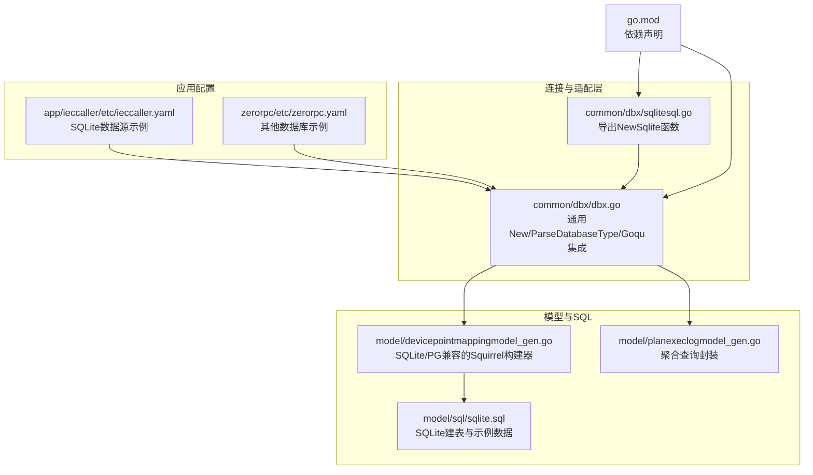
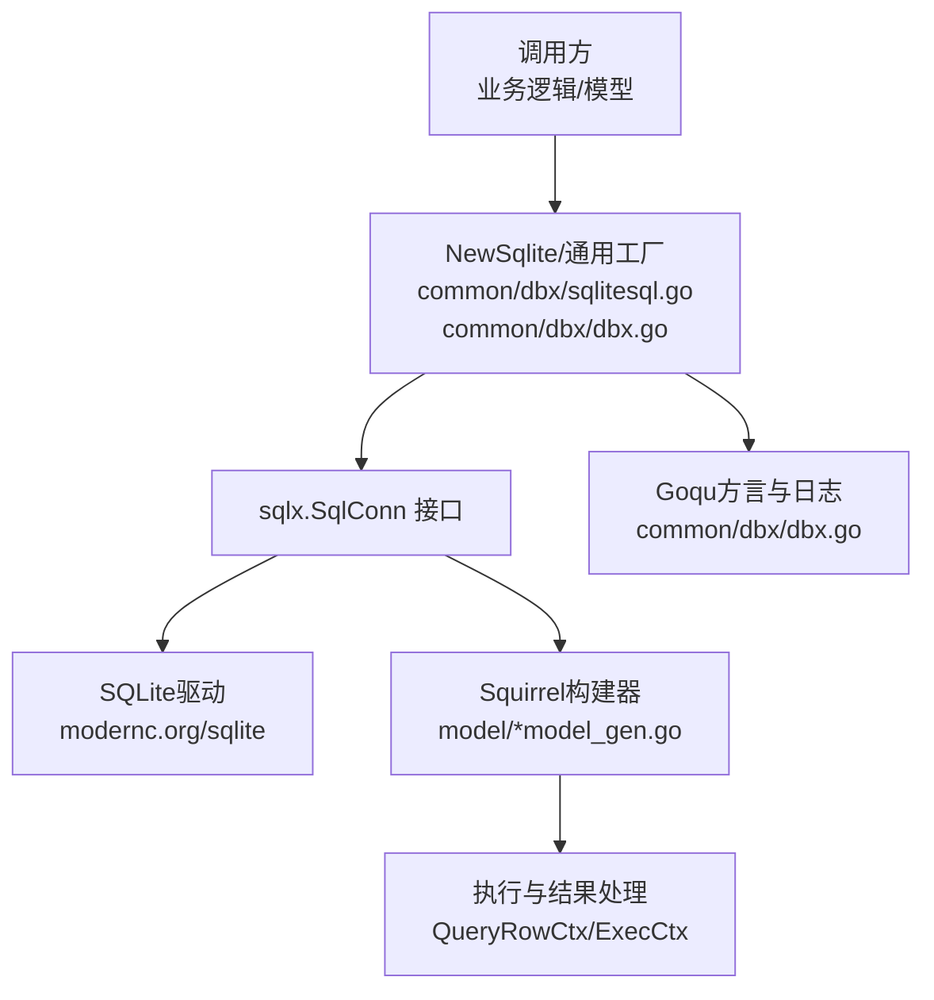
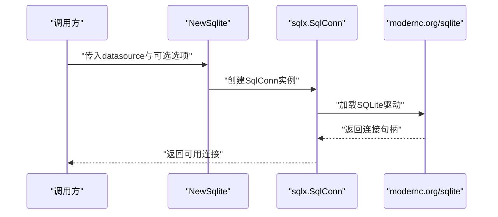
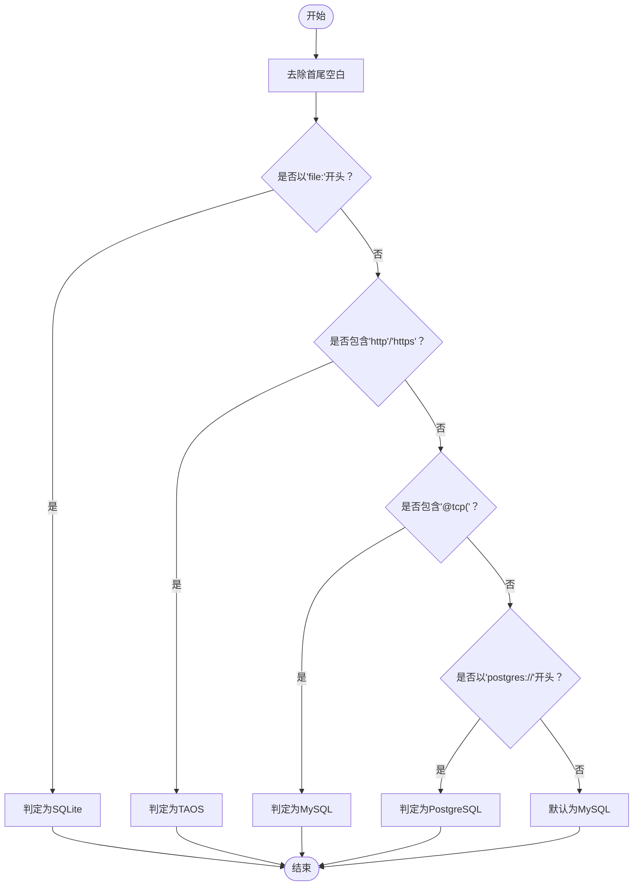
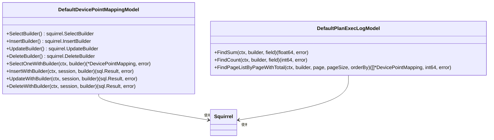
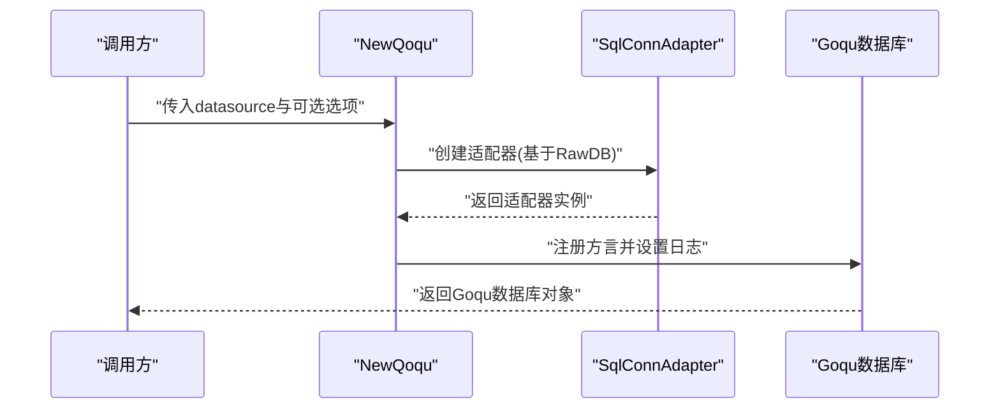
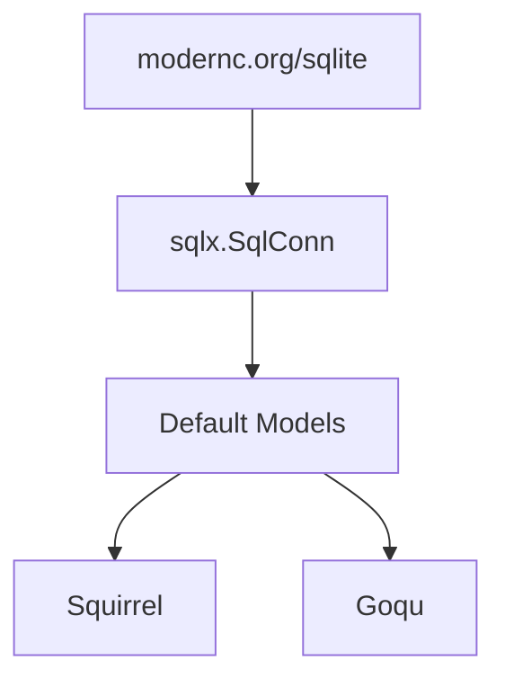

# SQLite SQL工具

<cite>
**本文引用的文件**
- [common/dbx/sqlitesql.go](file://common/dbx/sqlitesql.go)
- [common/dbx/dbx.go](file://common/dbx/dbx.go)
- [model/sql/sqlite.sql](file://model/sql/sqlite.sql)
- [model/devicepointmappingmodel_gen.go](file://model/devicepointmappingmodel_gen.go)
- [model/planexeclogmodel_gen.go](file://model/planexeclogmodel_gen.go)
- [app/ieccaller/etc/ieccaller.yaml](file://app/ieccaller/etc/ieccaller.yaml)
- [zerorpc/etc/zerorpc.yaml](file://zerorpc/etc/zerorpc.yaml)
- [go.mod](file://go.mod)
</cite>

## 目录
1. [简介](#简介)
2. [项目结构](#项目结构)
3. [核心组件](#核心组件)
4. [架构总览](#架构总览)
5. [详细组件分析](#详细组件分析)
6. [依赖分析](#依赖分析)
7. [性能考虑](#性能考虑)
8. [故障排查指南](#故障排查指南)
9. [结论](#结论)
10. [附录](#附录)

## 简介
本文件系统性阐述Zero-Service中的SQLite SQL工具能力与使用方法，覆盖以下要点：
- SQLite数据库连接创建与配置
- SQL语句执行与结果处理
- NewSqlite函数实现原理与SQLite数据源配置
- SQLite特有SQL构建、参数绑定与查询优化策略
- 在Zero-Service中的应用场景（本地缓存、配置存储、临时数据处理）
- 连接配置示例、SQL构建模板与性能优化建议
- 实际代码示例路径，展示如何在项目中使用SQLite工具进行数据操作与管理

## 项目结构
围绕SQLite工具的相关文件主要分布在如下位置：
- 连接与适配层：common/dbx
- 模型与SQL脚本：model/... 与 model/sql
- 应用配置示例：各应用etc目录下的yaml配置
- 依赖声明：go.mod

**图表来源**
- [common/dbx/sqlitesql.go:1-13](file://common/dbx/sqlitesql.go#L1-L13)
- [common/dbx/dbx.go:1-155](file://common/dbx/dbx.go#L1-L155)
- [model/devicepointmappingmodel_gen.go:1-200](file://model/devicepointmappingmodel_gen.go#L1-L200)
- [model/planexeclogmodel_gen.go:230-485](file://model/planexeclogmodel_gen.go#L230-L485)
- [model/sql/sqlite.sql:1-53](file://model/sql/sqlite.sql#L1-L53)
- [app/ieccaller/etc/ieccaller.yaml:65-70](file://app/ieccaller/etc/ieccaller.yaml#L65-L70)
- [zerorpc/etc/zerorpc.yaml:20-22](file://zerorpc/etc/zerorpc.yaml#L20-L22)
- [go.mod:61](file://go.mod#L61)

**章节来源**
- [common/dbx/sqlitesql.go:1-13](file://common/dbx/sqlitesql.go#L1-L13)
- [common/dbx/dbx.go:1-155](file://common/dbx/dbx.go#L1-L155)
- [model/sql/sqlite.sql:1-53](file://model/sql/sqlite.sql#L1-L53)
- [app/ieccaller/etc/ieccaller.yaml:65-70](file://app/ieccaller/etc/ieccaller.yaml#L65-L70)
- [zerorpc/etc/zerorpc.yaml:20-22](file://zerorpc/etc/zerorpc.yaml#L20-L22)
- [go.mod:61](file://go.mod#L61)

## 核心组件
- SQLite连接工厂：NewSqlite
  - 作用：基于给定数据源字符串创建SQLite连接
  - 关键点：内部通过统一的sqlx.SqlConn接口创建连接，驱动由modernc.org/sqlite提供
  - 参考路径：[common/dbx/sqlitesql.go:10-12](file://common/dbx/sqlitesql.go#L10-L12)

- 通用数据库工厂：New/ParseDatabaseType
  - 作用：根据数据源URL自动识别数据库类型并创建相应连接
  - SQLite识别规则：以“file:”开头或包含“.db”
  - 参考路径：[common/dbx/dbx.go:31-44](file://common/dbx/dbx.go#L31-L44)，[common/dbx/dbx.go:46-64](file://common/dbx/dbx.go#L46-L64)

- Goqu集成与日志
  - 作用：为不同数据库类型注册方言，统一通过Goqu构建SQL并记录日志
  - 参考路径：[common/dbx/dbx.go:112-138](file://common/dbx/dbx.go#L112-L138)，[common/dbx/dbx.go:140-145](file://common/dbx/dbx.go#L140-L145)

- Squirrel SQL构建器（跨数据库兼容）
  - 作用：为SQLite/PostgreSQL提供一致的Select/Insert/Update/Delete构建器，自动处理占位符差异
  - 参考路径：[model/devicepointmappingmodel_gen.go:481-511](file://model/devicepointmappingmodel_gen.go#L481-L511)，[model/planexeclogmodel_gen.go:459-485](file://model/planexeclogmodel_gen.go#L459-L485)

**章节来源**
- [common/dbx/sqlitesql.go:10-12](file://common/dbx/sqlitesql.go#L10-L12)
- [common/dbx/dbx.go:31-44](file://common/dbx/dbx.go#L31-L44)
- [common/dbx/dbx.go:46-64](file://common/dbx/dbx.go#L46-L64)
- [common/dbx/dbx.go:112-138](file://common/dbx/dbx.go#L112-L138)
- [common/dbx/dbx.go:140-145](file://common/dbx/dbx.go#L140-L145)
- [model/devicepointmappingmodel_gen.go:481-511](file://model/devicepointmappingmodel_gen.go#L481-L511)
- [model/planexeclogmodel_gen.go:459-485](file://model/planexeclogmodel_gen.go#L459-L485)

## 架构总览
下图展示了SQLite工具在系统中的角色与交互：

**图表来源**
- [common/dbx/sqlitesql.go:10-12](file://common/dbx/sqlitesql.go#L10-L12)
- [common/dbx/dbx.go:46-64](file://common/dbx/dbx.go#L46-L64)
- [model/devicepointmappingmodel_gen.go:113-153](file://model/devicepointmappingmodel_gen.go#L113-L153)
- [model/planexeclogmodel_gen.go:230-267](file://model/planexeclogmodel_gen.go#L230-L267)
- [common/dbx/dbx.go:112-138](file://common/dbx/dbx.go#L112-L138)

## 详细组件分析

### 组件A：SQLite连接工厂（NewSqlite）
- 设计要点
  - 通过统一的sqlx.SqlConn接口屏蔽底层差异
  - 使用modernc.org/sqlite作为SQLite驱动
  - 返回值可用于后续的Squirrel/Goqu构建与执行
- 调用流程

**图表来源**
- [common/dbx/sqlitesql.go:10-12](file://common/dbx/sqlitesql.go#L10-L12)

**章节来源**
- [common/dbx/sqlitesql.go:10-12](file://common/dbx/sqlitesql.go#L10-L12)

### 组件B：通用数据库工厂（New/ParseDatabaseType）
- 设计要点
  - 解析数据源字符串，自动识别SQLite/TAOS/MySQL/PostgreSQL
  - SQLite识别规则：以“file:”开头或包含“.db”
  - 为不同数据库类型分别创建连接
- 判定与分支

**图表来源**
- [common/dbx/dbx.go:31-44](file://common/dbx/dbx.go#L31-L44)

**章节来源**
- [common/dbx/dbx.go:31-44](file://common/dbx/dbx.go#L31-L44)
- [common/dbx/dbx.go:46-64](file://common/dbx/dbx.go#L46-L64)

### 组件C：Squirrel SQL构建器（跨数据库兼容）
- 设计要点
  - 为SQLite/PostgreSQL提供一致的Select/Insert/Update/Delete构建器
  - PostgreSQL使用占位符格式化（$1/$2），SQLite使用问号占位符
  - 提供聚合查询封装（求和、计数）与分页查询
- 关键方法路径
  - SelectBuilder/InsertBuilder/UpdateBuilder/DeleteBuilder
  - SelectOneWithBuilder/InsertWithBuilder/UpdateWithBuilder/DeleteWithBuilder
  - FindSum/FindCount/FindPageListByPageWithTotal

**图表来源**
- [model/devicepointmappingmodel_gen.go:481-511](file://model/devicepointmappingmodel_gen.go#L481-L511)
- [model/planexeclogmodel_gen.go:230-267](file://model/planexeclogmodel_gen.go#L230-L267)

**章节来源**
- [model/devicepointmappingmodel_gen.go:481-511](file://model/devicepointmappingmodel_gen.go#L481-L511)
- [model/planexeclogmodel_gen.go:230-267](file://model/planexeclogmodel_gen.go#L230-L267)

### 组件D：Goqu集成与日志
- 设计要点
  - 为不同数据库类型注册方言（含sqlite3）
  - 通过适配器将sqlx.SqlConn转换为Goqu可接受的接口
  - 日志统一输出到logx
- 关键路径
  - NewQoqu/MustNewQoqu
  - QoquLog实现

**图表来源**
- [common/dbx/dbx.go:112-138](file://common/dbx/dbx.go#L112-L138)
- [common/dbx/dbx.go:140-145](file://common/dbx/dbx.go#L140-L145)

**章节来源**
- [common/dbx/dbx.go:112-138](file://common/dbx/dbx.go#L112-L138)
- [common/dbx/dbx.go:140-145](file://common/dbx/dbx.go#L140-L145)

## 依赖分析
- 驱动与库依赖
  - SQLite驱动：modernc.org/sqlite
  - SQL构建：Masterminds/squirrel
  - SQL方言与查询构造：doug-martin/goqu/v9
  - Zero-Service数据库抽象：zeromicro/go-zero/core/stores/sqlx
- 关系图

**图表来源**
- [go.mod:61](file://go.mod#L61)
- [common/dbx/dbx.go:13](file://common/dbx/dbx.go#L13)
- [model/devicepointmappingmodel_gen.go:13](file://model/devicepointmappingmodel_gen.go#L13)

**章节来源**
- [go.mod:61](file://go.mod#L61)
- [common/dbx/dbx.go:13](file://common/dbx/dbx.go#L13)
- [model/devicepointmappingmodel_gen.go:13](file://model/devicepointmappingmodel_gen.go#L13)

## 性能考虑
- SQLite适用场景
  - 本地缓存与临时数据处理：零依赖、低延迟、易部署
  - 小规模配置存储与离线分析
- 参数绑定与SQL构建
  - 使用Squirrel构建器自动处理占位符差异，避免手写SQL带来的错误与不一致
  - 通过事务批量提交，减少磁盘写入次数
- 查询优化建议
  - 合理使用索引（如唯一索引、复合索引）
  - 控制查询范围与排序字段，避免全表扫描
  - 对频繁访问的数据建立内存级缓存（结合业务模型的缓存策略）

## 故障排查指南
- 常见问题定位
  - 数据源字符串不符合SQLite识别规则（需以“file:”开头或包含“.db”）
  - 驱动未正确引入导致无法加载SQLite驱动
  - 占位符不匹配（SQLite使用“?”，PostgreSQL使用“$n”）
- 定位路径
  - NewSqlite/ParseDatabaseType：确认数据源解析与连接创建
  - Squirrel构建器：检查占位符格式与列名映射
  - Goqu集成：确认方言注册与日志输出

**章节来源**
- [common/dbx/dbx.go:31-44](file://common/dbx/dbx.go#L31-L44)
- [common/dbx/sqlitesql.go:10-12](file://common/dbx/sqlitesql.go#L10-L12)
- [model/devicepointmappingmodel_gen.go:134-153](file://model/devicepointmappingmodel_gen.go#L134-L153)

## 结论
SQLite SQL工具在Zero-Service中提供了统一、简洁且高效的数据库接入方式。通过NewSqlite与通用工厂，开发者可以快速创建SQLite连接；借助Squirrel与Goqu，既能获得强类型的SQL构建体验，又能保持跨数据库的兼容性。配合合理的索引与事务策略，SQLite非常适合用于本地缓存、配置存储与临时数据处理等场景。

## 附录

### A. SQLite连接配置示例
- 应用配置示例（启用SQLite数据源）
  - 示例路径：[app/ieccaller/etc/ieccaller.yaml:65-70](file://app/ieccaller/etc/ieccaller.yaml#L65-L70)
  - 参考说明：将DataSource设置为以“file:”开头或包含“.db”的路径，即可被自动识别为SQLite

**章节来源**
- [app/ieccaller/etc/ieccaller.yaml:65-70](file://app/ieccaller/etc/ieccaller.yaml#L65-L70)

### B. SQL语句构建模板
- 选择单条记录
  - 模板路径：[model/devicepointmappingmodel_gen.go:113-132](file://model/devicepointmappingmodel_gen.go#L113-L132)
- 条件查询与分页
  - 模板路径：[model/planexeclogmodel_gen.go:250-267](file://model/planexeclogmodel_gen.go#L250-L267)
- 聚合查询（求和/计数）
  - 模板路径：[model/planexeclogmodel_gen.go:230-248](file://model/planexeclogmodel_gen.go#L230-L248)

**章节来源**
- [model/devicepointmappingmodel_gen.go:113-132](file://model/devicepointmappingmodel_gen.go#L113-L132)
- [model/planexeclogmodel_gen.go:230-267](file://model/planexeclogmodel_gen.go#L230-L267)

### C. 实际使用示例（路径指引）
- 创建SQLite连接
  - 函数路径：[common/dbx/sqlitesql.go:10-12](file://common/dbx/sqlitesql.go#L10-L12)
- 自动识别并创建连接
  - 函数路径：[common/dbx/dbx.go:46-64](file://common/dbx/dbx.go#L46-L64)
- 使用Squirrel构建并执行查询
  - 方法路径：[model/devicepointmappingmodel_gen.go:134-153](file://model/devicepointmappingmodel_gen.go#L134-L153)
- 使用聚合查询
  - 方法路径：[model/planexeclogmodel_gen.go:230-248](file://model/planexeclogmodel_gen.go#L230-L248)

**章节来源**
- [common/dbx/sqlitesql.go:10-12](file://common/dbx/sqlitesql.go#L10-L12)
- [common/dbx/dbx.go:46-64](file://common/dbx/dbx.go#L46-L64)
- [model/devicepointmappingmodel_gen.go:134-153](file://model/devicepointmappingmodel_gen.go#L134-L153)
- [model/planexeclogmodel_gen.go:230-248](file://model/planexeclogmodel_gen.go#L230-L248)

### D. SQLite建表与示例数据
- 建表与示例数据
  - 文件路径：[model/sql/sqlite.sql:1-53](file://model/sql/sqlite.sql#L1-L53)

**章节来源**
- [model/sql/sqlite.sql:1-53](file://model/sql/sqlite.sql#L1-L53)