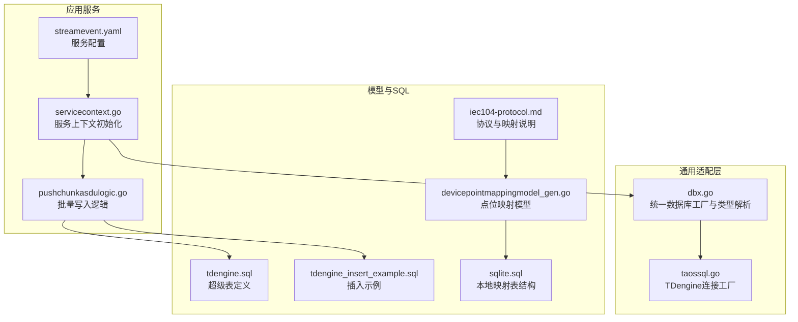
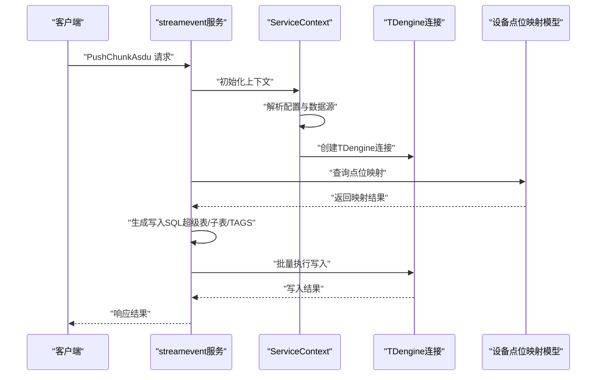
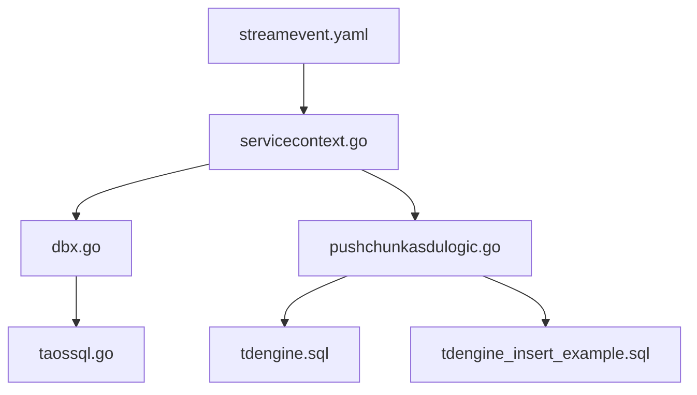

# TDengine SQL工具

<cite>
**本文引用的文件**
- [common/dbx/taossql.go](file://common/dbx/taossql.go)
- [common/dbx/dbx.go](file://common/dbx/dbx.go)
- [facade/streamevent/etc/streamevent.yaml](file://facade/streamevent/etc/streamevent.yaml)
- [facade/streamevent/internal/svc/servicecontext.go](file://facade/streamevent/internal/svc/servicecontext.go)
- [facade/streamevent/internal/logic/pushchunkasdulogic.go](file://facade/streamevent/internal/logic/pushchunkasdulogic.go)
- [model/sql/tdengine.sql](file://model/sql/tdengine.sql)
- [model/sql/tdengine_insert_example.sql](file://model/sql/tdengine_insert_example.sql)
- [model/devicepointmappingmodel_gen.go](file://model/devicepointmappingmodel_gen.go)
- [model/sql/sqlite.sql](file://model/sql/sqlite.sql)
- [docs/iec104-protocol.md](file://docs/iec104-protocol.md)
</cite>

## 目录
1. [简介](#简介)
2. [项目结构](#项目结构)
3. [核心组件](#核心组件)
4. [架构总览](#架构总览)
5. [组件详解](#组件详解)
6. [依赖关系分析](#依赖关系分析)
7. [性能考量](#性能考量)
8. [故障排查指南](#故障排查指南)
9. [结论](#结论)
10. [附录](#附录)

## 简介
本技术文档围绕Zero-Service项目中的TDengine SQL工具展开，系统性介绍如何在项目中通过统一的数据库适配层创建TDengine连接、构建时间序列SQL、管理标签与超级表，并结合工业物联网场景（如IEC 104设备数据采集、原始数据归档与多表分发）给出实践方案。文档重点覆盖：
- NewTaos函数的实现原理与TDengine数据源配置（HTTP/HTTPS）
- TDengine特有的SQL语法支持（超级表、子表、标签、时间戳）
- 时间序列数据写入与查询模板
- 在Zero-Service中使用TDengine进行时间序列数据操作的最佳实践
- 性能优化与常见问题排查

## 项目结构
与TDengine相关的代码与资源主要分布在以下模块：
- 通用数据库适配层：负责解析数据源、创建不同数据库连接（含TDengine）
- 应用服务：以streamevent为例，演示如何在服务启动时建立TDengine连接、基于设备点位映射生成写入SQL并批量入库
- 模型与SQL脚本：定义TDengine超级表结构、插入示例及本地SQLite映射表结构
- 文档与协议：说明设备点位映射与TDengine标签字段的对应关系

图表来源
- [common/dbx/dbx.go:46-64](file://common/dbx/dbx.go#L46-L64)
- [common/dbx/taossql.go:11-13](file://common/dbx/taossql.go#L11-L13)
- [facade/streamevent/etc/streamevent.yaml:22-25](file://facade/streamevent/etc/streamevent.yaml#L22-L25)
- [facade/streamevent/internal/svc/servicecontext.go:21-32](file://facade/streamevent/internal/svc/servicecontext.go#L21-L32)
- [facade/streamevent/internal/logic/pushchunkasdulogic.go:118-212](file://facade/streamevent/internal/logic/pushchunkasdulogic.go#L118-L212)
- [model/sql/tdengine.sql:1-34](file://model/sql/tdengine.sql#L1-L34)
- [model/sql/tdengine_insert_example.sql:1-77](file://model/sql/tdengine_insert_example.sql#L1-L77)
- [model/devicepointmappingmodel_gen.go:59-75](file://model/devicepointmappingmodel_gen.go#L59-L75)
- [model/sql/sqlite.sql:12-30](file://model/sql/sqlite.sql#L12-L30)
- [docs/iec104-protocol.md:108-145](file://docs/iec104-protocol.md#L108-L145)

章节来源
- [common/dbx/dbx.go:46-64](file://common/dbx/dbx.go#L46-L64)
- [common/dbx/taossql.go:11-13](file://common/dbx/taossql.go#L11-L13)
- [facade/streamevent/etc/streamevent.yaml:22-25](file://facade/streamevent/etc/streamevent.yaml#L22-L25)
- [facade/streamevent/internal/svc/servicecontext.go:21-32](file://facade/streamevent/internal/svc/servicecontext.go#L21-L32)
- [facade/streamevent/internal/logic/pushchunkasdulogic.go:118-212](file://facade/streamevent/internal/logic/pushchunkasdulogic.go#L118-L212)
- [model/sql/tdengine.sql:1-34](file://model/sql/tdengine.sql#L1-L34)
- [model/sql/tdengine_insert_example.sql:1-77](file://model/sql/tdengine_insert_example.sql#L1-L77)
- [model/devicepointmappingmodel_gen.go:59-75](file://model/devicepointmappingmodel_gen.go#L59-L75)
- [model/sql/sqlite.sql:12-30](file://model/sql/sqlite.sql#L12-L30)
- [docs/iec104-protocol.md:108-145](file://docs/iec104-protocol.md#L108-L145)

## 核心组件
- 统一数据库工厂与类型解析：根据数据源URL自动识别数据库类型（含TDengine），并创建相应连接
- TDengine连接工厂：封装TDengine驱动名，提供NewTaos便捷入口
- 服务上下文初始化：在服务启动时解析配置、创建TDengine连接与本地SQLite连接
- 写入逻辑：基于设备点位映射生成TDengine写入SQL，支持批量写入与错误统计
- TDengine超级表与插入示例：定义原始数据、遥信、遥测三类超级表，提供典型插入模板

章节来源
- [common/dbx/dbx.go:31-44](file://common/dbx/dbx.go#L31-L44)
- [common/dbx/dbx.go:46-64](file://common/dbx/dbx.go#L46-L64)
- [common/dbx/taossql.go:9-13](file://common/dbx/taossql.go#L9-L13)
- [facade/streamevent/etc/streamevent.yaml:22-25](file://facade/streamevent/etc/streamevent.yaml#L22-L25)
- [facade/streamevent/internal/svc/servicecontext.go:21-32](file://facade/streamevent/internal/svc/servicecontext.go#L21-L32)
- [facade/streamevent/internal/logic/pushchunkasdulogic.go:118-212](file://facade/streamevent/internal/logic/pushchunkasdulogic.go#L118-L212)
- [model/sql/tdengine.sql:1-34](file://model/sql/tdengine.sql#L1-L34)
- [model/sql/tdengine_insert_example.sql:1-77](file://model/sql/tdengine_insert_example.sql#L1-L77)

## 架构总览
下图展示了从配置到写入的关键流程：服务启动时解析配置，创建TDengine连接；收到数据后，按点位映射生成SQL并批量写入。

图表来源
- [facade/streamevent/etc/streamevent.yaml:22-25](file://facade/streamevent/etc/streamevent.yaml#L22-L25)
- [facade/streamevent/internal/svc/servicecontext.go:21-32](file://facade/streamevent/internal/svc/servicecontext.go#L21-L32)
- [facade/streamevent/internal/logic/pushchunkasdulogic.go:118-212](file://facade/streamevent/internal/logic/pushchunkasdulogic.go#L118-L212)

## 组件详解

### 统一数据库工厂与类型解析
- 功能要点
  - 依据数据源URL前缀或关键字识别数据库类型：SQLite、TDengine（HTTP/HTTPS）、MySQL、PostgreSQL
  - 提供New工厂函数，按类型创建对应连接
  - 提供Goqu方言注册，便于跨数据库的SQL构造与日志输出
- 关键实现
  - ParseDatabaseType：解析数据源类型
  - New：根据类型选择具体连接工厂
  - NewQoqu：基于适配器或原生DB创建Goqu实例

章节来源
- [common/dbx/dbx.go:31-44](file://common/dbx/dbx.go#L31-L44)
- [common/dbx/dbx.go:46-64](file://common/dbx/dbx.go#L46-L64)
- [common/dbx/dbx.go:106-138](file://common/dbx/dbx.go#L106-L138)

### TDengine连接工厂（NewTaos）
- 功能要点
  - 通过固定驱动名“taosRestful”创建TDengine连接
  - 与统一工厂配合，实现HTTP/HTTPS数据源的自动识别与连接
- 关键实现
  - NewTaos：封装sqlx.NewSqlConn调用
  - 导入taosRestful驱动，确保运行时可用

章节来源
- [common/dbx/taossql.go:9-13](file://common/dbx/taossql.go#L9-L13)

### 服务上下文初始化（TDengine连接）
- 功能要点
  - 从配置文件读取TDengine数据源与默认数据库名
  - 初始化TDengine连接与本地SQLite连接
  - 通过设备点位映射模型进行点位查询
- 关键实现
  - 读取配置项：TaosDB.DataSource、TaosDB.DBName
  - 调用dbx.New创建连接
  - 初始化DevicePointMappingModel

章节来源
- [facade/streamevent/etc/streamevent.yaml:22-25](file://facade/streamevent/etc/streamevent.yaml#L22-L25)
- [facade/streamevent/internal/svc/servicecontext.go:21-32](file://facade/streamevent/internal/svc/servicecontext.go#L21-L32)

### 写入逻辑（批量写入TDengine）
- 功能要点
  - 从请求中解析设备点位信息，生成子表名与SQL
  - 依据点位映射决定是否写入原始数据表
  - 使用MapReduce并行执行SQL写入，统计成功/失败数量
  - 错误日志记录请求ID，便于追踪
- 关键实现
  - 生成INSERT INTO ... USING ... TAGS ... VALUES 的SQL
  - 通过ExecCtx执行SQL
  - 记录错误并统计忽略/插入计数

章节来源
- [facade/streamevent/internal/logic/pushchunkasdulogic.go:118-212](file://facade/streamevent/internal/logic/pushchunkasdulogic.go#L118-L212)

### TDengine超级表与标签设计
- 功能要点
  - 定义三类超级表：原始数据、遥信、遥测
  - 超级表包含时间戳字段与标签字段，子表按业务维度自动创建
  - 插入示例展示不同表类型的写法与标签值
- 关键实现
  - tdengine.sql：定义超级表结构与标签
  - tdengine_insert_example.sql：提供典型插入模板

章节来源
- [model/sql/tdengine.sql:1-34](file://model/sql/tdengine.sql#L1-L34)
- [model/sql/tdengine_insert_example.sql:1-77](file://model/sql/tdengine_insert_example.sql#L1-L77)

### 设备点位映射与标签字段对应
- 功能要点
  - 本地SQLite表device_point_mapping存储设备点位映射
  - 字段与TDengine标签字段一一对应（如tag_station、coa、ioa）
  - 通过模型生成的结构体访问映射字段
- 关键实现
  - devicepointmappingmodel_gen.go：映射模型字段定义
  - sqlite.sql：本地映射表结构
  - iec104-protocol.md：协议文档说明

章节来源
- [model/devicepointmappingmodel_gen.go:59-75](file://model/devicepointmappingmodel_gen.go#L59-L75)
- [model/sql/sqlite.sql:12-30](file://model/sql/sqlite.sql#L12-L30)
- [docs/iec104-protocol.md:108-145](file://docs/iec104-protocol.md#L108-L145)

## 依赖关系分析
- 组件耦合
  - dbx作为统一适配层，被服务上下文与逻辑层依赖
  - streamevent服务依赖dbx创建TDengine连接，并依赖设备点位映射模型
  - TDengine写入逻辑依赖超级表定义与插入示例
- 外部依赖
  - TDengine驱动：taosRestful（HTTP/HTTPS）
  - Goqu：跨数据库SQL构造与日志
  - go-zero sqlx：统一连接与事务接口

图表来源
- [common/dbx/dbx.go:46-64](file://common/dbx/dbx.go#L46-L64)
- [common/dbx/taossql.go:9-13](file://common/dbx/taossql.go#L9-L13)
- [facade/streamevent/etc/streamevent.yaml:22-25](file://facade/streamevent/etc/streamevent.yaml#L22-L25)
- [facade/streamevent/internal/svc/servicecontext.go:21-32](file://facade/streamevent/internal/svc/servicecontext.go#L21-L32)
- [facade/streamevent/internal/logic/pushchunkasdulogic.go:118-212](file://facade/streamevent/internal/logic/pushchunkasdulogic.go#L118-L212)
- [model/sql/tdengine.sql:1-34](file://model/sql/tdengine.sql#L1-L34)
- [model/sql/tdengine_insert_example.sql:1-77](file://model/sql/tdengine_insert_example.sql#L1-L77)

## 性能考量
- 并行写入
  - 使用MapReduce将SQL生成、执行与统计解耦，提升吞吐
- 批量写入
  - 合理分批生成SQL，避免单次请求过大
- 日志与监控
  - 通过请求ID串联日志，便于定位慢查询与错误
- 超级表设计
  - 合理设置标签字段，减少子表数量与查询复杂度
- 连接与事务
  - 使用适配器封装底层DB，便于开启事务与预编译语句（如需）

## 故障排查指南
- 连接未初始化
  - 现象：写入逻辑提示TDengine连接未初始化
  - 排查：确认配置文件中TaosDB.DataSource与DBName正确
- 写入失败
  - 现象：批量写入统计显示部分失败
  - 排查：查看错误日志中的请求ID，检查SQL生成逻辑与标签值
- 点位映射缺失
  - 现象：原始数据未写入
  - 排查：确认设备点位映射表中存在对应tag_station/coa/ioa，且enable_raw_insert启用

章节来源
- [facade/streamevent/internal/logic/pushchunkasdulogic.go:118-212](file://facade/streamevent/internal/logic/pushchunkasdulogic.go#L118-L212)
- [facade/streamevent/etc/streamevent.yaml:22-25](file://facade/streamevent/etc/streamevent.yaml#L22-L25)

## 结论
本项目通过统一的数据库适配层与清晰的服务上下文，实现了对TDengine的无缝接入。结合设备点位映射与超级表设计，能够高效完成工业物联网场景下的时间序列数据写入与管理。建议在生产环境中进一步完善批处理策略、错误重试与监控告警，持续优化写入性能与稳定性。

## 附录

### TDengine连接配置示例
- 配置项
  - TaosDB.DataSource：TDengine数据源URL（HTTP/HTTPS）
  - TaosDB.DBName：默认数据库名
- 示例路径
  - [facade/streamevent/etc/streamevent.yaml:22-25](file://facade/streamevent/etc/streamevent.yaml#L22-L25)

章节来源
- [facade/streamevent/etc/streamevent.yaml:22-25](file://facade/streamevent/etc/streamevent.yaml#L22-L25)

### 时间序列SQL构建模板
- 原始数据总表插入
  - 语法要点：INSERT INTO 子表 USING 超级表 TAGS(...) VALUES(...)
  - 示例路径：[model/sql/tdengine_insert_example.sql:3-6](file://model/sql/tdengine_insert_example.sql#L3-L6)
- 遥信表插入（布尔值）
  - 语法要点：signal_value为布尔类型
  - 示例路径：[model/sql/tdengine_insert_example.sql:8-11](file://model/sql/tdengine_insert_example.sql#L8-L11)
- 遥测表插入（数值）
  - 语法要点：telemetry_value为数值类型
  - 示例路径：[model/sql/tdengine_insert_example.sql:13-16](file://model/sql/tdengine_insert_example.sql#L13-L16)
- 生成SQL的业务流程
  - 依据点位映射与请求参数生成SQL
  - 示例路径：[facade/streamevent/internal/logic/pushchunkasdulogic.go:167-188](file://facade/streamevent/internal/logic/pushchunkasdulogic.go#L167-L188)

章节来源
- [model/sql/tdengine_insert_example.sql:3-16](file://model/sql/tdengine_insert_example.sql#L3-L16)
- [facade/streamevent/internal/logic/pushchunkasdulogic.go:167-188](file://facade/streamevent/internal/logic/pushchunkasdulogic.go#L167-L188)

### TDengine超级表与标签说明
- 超级表定义
  - 原始数据：raw_point_data
  - 遥信：tele_signal_data
  - 遥测：telemetry_data
- 标签字段
  - tag_station、tag_coa、tag_ioa 或 tag_station、device_id、tag_coa、tag_ioa
- 示例路径
  - [model/sql/tdengine.sql:1-34](file://model/sql/tdengine.sql#L1-L34)

章节来源
- [model/sql/tdengine.sql:1-34](file://model/sql/tdengine.sql#L1-L34)

### 工业物联网应用场景
- 设备数据存储
  - 基于点位映射与超级表，将IEC 104报文转换为TDengine时间序列数据
- 历史数据查询
  - 使用标签过滤与时间范围查询，结合聚合函数进行统计分析
- 聚合分析
  - 建议使用TDengine内置聚合函数与时间窗口，降低查询复杂度
- 示例路径
  - [docs/iec104-protocol.md:108-145](file://docs/iec104-protocol.md#L108-L145)

章节来源
- [docs/iec104-protocol.md:108-145](file://docs/iec104-protocol.md#L108-L145)