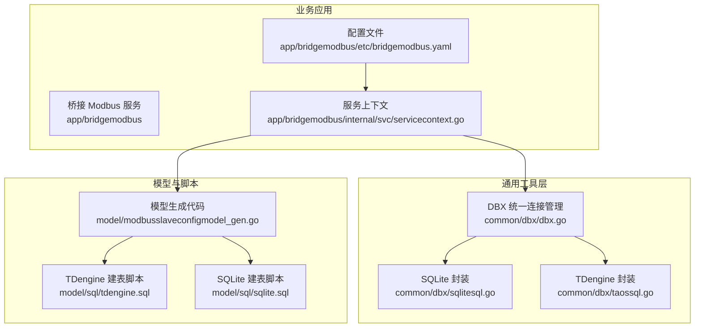
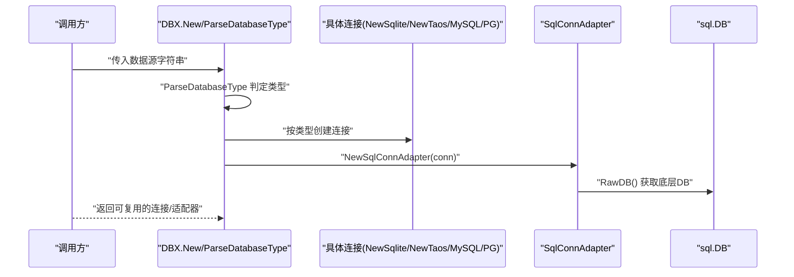
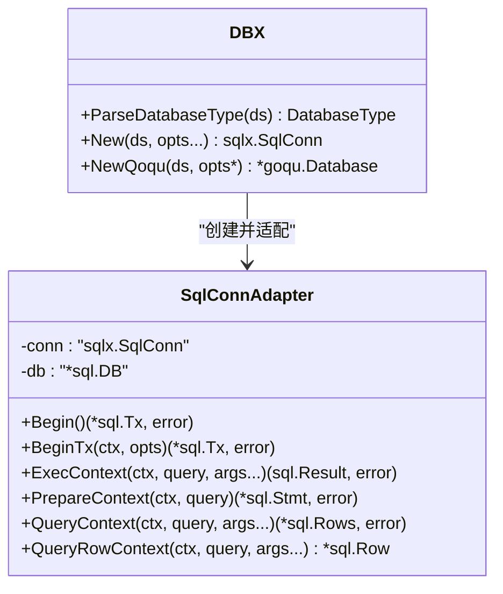
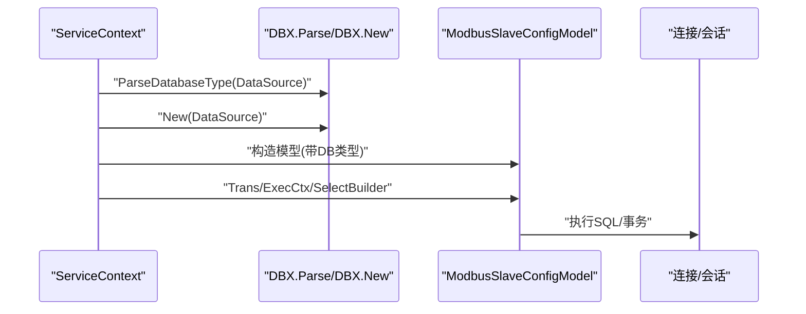
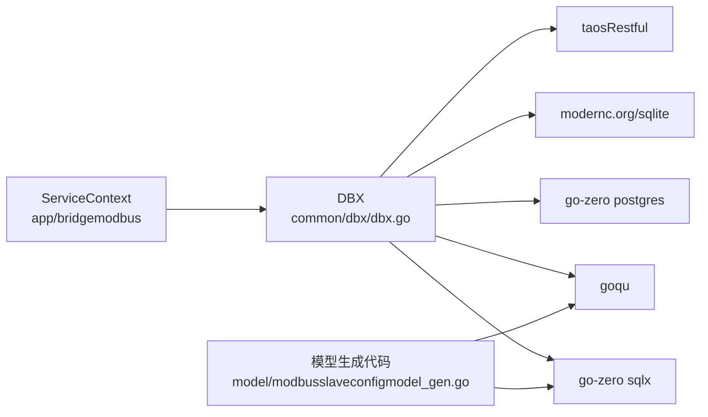

# 数据库工具

<cite>
**本文引用的文件**
- [common/dbx/dbx.go](file://common/dbx/dbx.go)
- [common/dbx/sqlitesql.go](file://common/dbx/sqlitesql.go)
- [common/dbx/taossql.go](file://common/dbx/taossql.go)
- [app/bridgemodbus/etc/bridgemodbus.yaml](file://app/bridgemodbus/etc/bridgemodbus.yaml)
- [app/bridgemodbus/internal/svc/servicecontext.go](file://app/bridgemodbus/internal/svc/servicecontext.go)
- [.trae/skills/zero-skills/references/database-patterns.md](file://.trae/skills/zero-skills/references/database-patterns.md)
- [model/modbusslaveconfigmodel_gen.go](file://model/modbusslaveconfigmodel_gen.go)
- [model/sql/tdengine.sql](file://model/sql/tdengine.sql)
- [model/sql/sqlite.sql](file://model/sql/sqlite.sql)
</cite>

## 目录
1. [简介](#简介)
2. [项目结构](#项目结构)
3. [核心组件](#核心组件)
4. [架构总览](#架构总览)
5. [详细组件分析](#详细组件分析)
6. [依赖分析](#依赖分析)
7. [性能考虑](#性能考虑)
8. [故障排查指南](#故障排查指南)
9. [结论](#结论)
10. [附录](#附录)

## 简介
本技术文档聚焦 Zero-Service 的数据库工具层，系统性介绍以下三类能力：
- DBX 数据库连接管理工具：统一解析数据源、按类型创建连接、适配 GoQu 库、提供事务与连接复用能力，并内置日志记录。
- SQLite SQL 工具：基于现代 SQLite 驱动封装，提供本地轻量数据库连接创建。
- TDengine SQL 工具：基于 TDengine Restful 驱动封装，面向时间序列数据的连接创建。

文档还涵盖：
- DBX 的连接池管理、事务处理、连接复用与错误处理机制；
- SQLite SQL 工具的 SQL 语句构建、参数绑定与查询优化思路；
- TDengine SQL 工具的时间序列建模、标签管理与聚合查询能力；
- 数据库连接配置、SQL 构建示例与性能优化建议；
- 实际代码示例路径，展示如何在项目中使用这些工具进行数据操作。

## 项目结构
与数据库工具直接相关的模块与文件如下：
- common/dbx：DBX 统一连接管理、SQLite 封装、TDengine 封装
- app/bridgemodbus：演示如何在业务服务中使用 DBX 创建连接与模型
- model/sql：TDengine 与 SQLite 的建表与示例数据脚本
- .trae/skills/zero-skills/references/database-patterns.md：Go-Zero 事务与连接池模式参考

图表来源
- [common/dbx/dbx.go:1-155](file://common/dbx/dbx.go#L1-L155)
- [common/dbx/sqlitesql.go:1-13](file://common/dbx/sqlitesql.go#L1-L13)
- [common/dbx/taossql.go:1-14](file://common/dbx/taossql.go#L1-L14)
- [app/bridgemodbus/etc/bridgemodbus.yaml:1-26](file://app/bridgemodbus/etc/bridgemodbus.yaml#L1-L26)
- [app/bridgemodbus/internal/svc/servicecontext.go:1-81](file://app/bridgemodbus/internal/svc/servicecontext.go#L1-L81)
- [model/modbusslaveconfigmodel_gen.go:1-200](file://model/modbusslaveconfigmodel_gen.go#L1-L200)
- [model/sql/tdengine.sql:1-34](file://model/sql/tdengine.sql#L1-L34)
- [model/sql/sqlite.sql:1-53](file://model/sql/sqlite.sql#L1-L53)

章节来源
- [common/dbx/dbx.go:1-155](file://common/dbx/dbx.go#L1-L155)
- [common/dbx/sqlitesql.go:1-13](file://common/dbx/sqlitesql.go#L1-L13)
- [common/dbx/taossql.go:1-14](file://common/dbx/taossql.go#L1-L14)
- [app/bridgemodbus/etc/bridgemodbus.yaml:1-26](file://app/bridgemodbus/etc/bridgemodbus.yaml#L1-L26)
- [app/bridgemodbus/internal/svc/servicecontext.go:1-81](file://app/bridgemodbus/internal/svc/servicecontext.go#L1-L81)
- [model/modbusslaveconfigmodel_gen.go:1-200](file://model/modbusslaveconfigmodel_gen.go#L1-L200)
- [model/sql/tdengine.sql:1-34](file://model/sql/tdengine.sql#L1-L34)
- [model/sql/sqlite.sql:1-53](file://model/sql/sqlite.sql#L1-L53)

## 核心组件
- DBX 统一连接管理
  - 自动识别数据源类型（SQLite、TDengine、MySQL、PostgreSQL）并创建相应连接
  - 提供适配器以兼容标准 sql.DB 接口，支持 Begin/BeginTx/ExecContext/PrepareContext/QueryContext/QueryRowContext
  - 基于 GoQu 的数据库实例创建，支持不同方言注册与日志输出
- SQLite SQL 工具
  - 使用 modernc.org/sqlite 驱动，提供 NewSqlite(datasource) 快速创建连接
- TDengine SQL 工具
  - 使用 taosRestful 驱动，提供 NewTaos(datasource) 快速创建连接

章节来源
- [common/dbx/dbx.go:31-64](file://common/dbx/dbx.go#L31-L64)
- [common/dbx/dbx.go:66-104](file://common/dbx/dbx.go#L66-L104)
- [common/dbx/dbx.go:106-138](file://common/dbx/dbx.go#L106-L138)
- [common/dbx/sqlitesql.go:10-12](file://common/dbx/sqlitesql.go#L10-L12)
- [common/dbx/taossql.go:11-13](file://common/dbx/taossql.go#L11-L13)

## 架构总览
DBX 在运行时根据数据源字符串自动判定数据库类型，并选择对应的连接创建函数；随后通过适配器将连接暴露为标准 sql.DB 能力，供上层模型与业务逻辑复用。

图表来源
- [common/dbx/dbx.go:31-64](file://common/dbx/dbx.go#L31-L64)
- [common/dbx/dbx.go:71-80](file://common/dbx/dbx.go#L71-L80)
- [common/dbx/dbx.go:82-104](file://common/dbx/dbx.go#L82-L104)
- [common/dbx/sqlitesql.go:10-12](file://common/dbx/sqlitesql.go#L10-L12)
- [common/dbx/taossql.go:11-13](file://common/dbx/taossql.go#L11-L13)

## 详细组件分析

### DBX 组件分析
- 数据源类型解析
  - 依据数据源前缀/关键字判断类型：SQLite、TDengine、MySQL、PostgreSQL
- 连接创建与适配
  - 按类型调用 NewSqlite/NewTaos 或使用 go-zero 内置连接工厂
  - 通过 NewSqlConnAdapter 将连接转为 sql.DB，便于执行事务与预编译语句
- 事务与连接复用
  - 适配器提供 Begin/BeginTx/ExecContext/PrepareContext/QueryContext/QueryRowContext
  - 上层模型与业务逻辑可直接使用适配器执行 SQL 并复用连接
- 错误处理与日志
  - GoQu 日志通过 QoquLog 输出到统一日志系统
  - 适配器在 RawDB 失败时回退至直接使用 sql.DB 初始化 GoQu

图表来源
- [common/dbx/dbx.go:66-104](file://common/dbx/dbx.go#L66-L104)
- [common/dbx/dbx.go:106-138](file://common/dbx/dbx.go#L106-L138)

章节来源
- [common/dbx/dbx.go:31-64](file://common/dbx/dbx.go#L31-L64)
- [common/dbx/dbx.go:66-104](file://common/dbx/dbx.go#L66-L104)
- [common/dbx/dbx.go:106-138](file://common/dbx/dbx.go#L106-L138)

### SQLite SQL 工具分析
- 驱动与连接
  - 使用 modernc.org/sqlite 驱动，通过 NewSqlite 快速创建连接
- 典型用途
  - 本地缓存、设备映射表、轻量级数据持久化
- 与 DBX 的关系
  - DBX 在解析到 SQLite 类型时，委托 NewSqlite 创建连接

章节来源
- [common/dbx/sqlitesql.go:10-12](file://common/dbx/sqlitesql.go#L10-L12)
- [common/dbx/dbx.go:52-56](file://common/dbx/dbx.go#L52-L56)

### TDengine SQL 工具分析
- 驱动与连接
  - 使用 taosRestful 驱动，通过 NewTaos 创建连接
- 时间序列建模
  - 提供稳定表（STABLE）定义，包含时间戳、消息标识、数值/布尔字段与标签（TAGS）
- 标签管理与聚合
  - 标签用于分组与过滤，适合按站点、设备、点号等维度进行聚合统计
- 与 DBX 的关系
  - DBX 在解析到 TDengine 类型时，委托 NewTaos 创建连接

章节来源
- [common/dbx/taossql.go:11-13](file://common/dbx/taossql.go#L11-L13)
- [common/dbx/dbx.go:57-58](file://common/dbx/dbx.go#L57-L58)
- [model/sql/tdengine.sql:1-34](file://model/sql/tdengine.sql#L1-L34)

### 业务集成示例（BridgeModbus）
- 配置与连接
  - 服务配置文件中包含 DB 数据源字段
  - 服务上下文解析数据源类型并创建模型
- 模型与事务
  - 模型生成代码提供 Trans/ExecCtx/SelectBuilder/InsertBuilder 等能力
  - 支持跨模型事务与分页查询

图表来源
- [app/bridgemodbus/etc/bridgemodbus.yaml:20-22](file://app/bridgemodbus/etc/bridgemodbus.yaml#L20-L22)
- [app/bridgemodbus/internal/svc/servicecontext.go:22-31](file://app/bridgemodbus/internal/svc/servicecontext.go#L22-L31)
- [model/modbusslaveconfigmodel_gen.go:24-50](file://model/modbusslaveconfigmodel_gen.go#L24-L50)

章节来源
- [app/bridgemodbus/etc/bridgemodbus.yaml:20-22](file://app/bridgemodbus/etc/bridgemodbus.yaml#L20-L22)
- [app/bridgemodbus/internal/svc/servicecontext.go:22-31](file://app/bridgemodbus/internal/svc/servicecontext.go#L22-L31)
- [model/modbusslaveconfigmodel_gen.go:24-50](file://model/modbusslaveconfigmodel_gen.go#L24-L50)

## 依赖分析
- DBX 依赖
  - go-zero 的 sqlx、postgres 包用于连接创建与适配
  - goqu 用于 SQL 构建与方言支持
  - SQLite 驱动 modernc.org/sqlite
  - TDengine 驱动 taosRestful
- 业务依赖
  - BridgeModbus 服务通过 DBX 创建连接并注入模型
  - 模型生成代码提供跨数据库占位符格式与事务接口

图表来源
- [common/dbx/dbx.go:3-20](file://common/dbx/dbx.go#L3-L20)
- [common/dbx/sqlitesql.go:3-6](file://common/dbx/sqlitesql.go#L3-L6)
- [common/dbx/taossql.go:3-7](file://common/dbx/taossql.go#L3-L7)
- [app/bridgemodbus/internal/svc/servicecontext.go:7](file://app/bridgemodbus/internal/svc/servicecontext.go#L7)
- [model/modbusslaveconfigmodel_gen.go:7-17](file://model/modbusslaveconfigmodel_gen.go#L7-L17)

章节来源
- [common/dbx/dbx.go:3-20](file://common/dbx/dbx.go#L3-L20)
- [common/dbx/sqlitesql.go:3-6](file://common/dbx/sqlitesql.go#L3-L6)
- [common/dbx/taossql.go:3-7](file://common/dbx/taossql.go#L3-L7)
- [app/bridgemodbus/internal/svc/servicecontext.go:7](file://app/bridgemodbus/internal/svc/servicecontext.go#L7)
- [model/modbusslaveconfigmodel_gen.go:7-17](file://model/modbusslaveconfigmodel_gen.go#L7-L17)

## 性能考虑
- 连接池管理
  - go-zero 默认连接池配置具备合理的空闲与最大连接数及生命周期设置
  - 如需定制，可通过 RawDB 获取底层 sql.DB 并调整 MaxIdleConns/MaxOpenConns/ConnMaxLifetime
- 事务与批量
  - 使用 TransactCtx 将相关写操作放入单事务，减少锁竞争与一致性问题
  - 批量插入/更新时优先使用模型提供的 Builder 与占位符格式，避免多次往返
- 查询优化
  - SQLite/TDengine 建表脚本中包含索引与触发器示例，结合实际查询条件设计索引
  - TDengine 使用标签进行分组与过滤，合理利用标签可降低扫描范围
- 日志与可观测性
  - GoQu 日志统一输出，便于定位慢查询与异常

章节来源
- [.trae/skills/zero-skills/references/database-patterns.md:448-480](file://.trae/skills/zero-skills/references/database-patterns.md#L448-L480)
- [.trae/skills/zero-skills/references/database-patterns.md:271-365](file://.trae/skills/zero-skills/references/database-patterns.md#L271-L365)
- [model/sql/sqlite.sql:29-30](file://model/sql/sqlite.sql#L29-L30)
- [model/sql/sqlite.sql:48-53](file://model/sql/sqlite.sql#L48-L53)
- [model/sql/tdengine.sql:15-34](file://model/sql/tdengine.sql#L15-L34)

## 故障排查指南
- 数据源类型识别错误
  - 确认数据源字符串是否符合预期前缀/关键字（file:/含.db/含http/含@tcp()/以postgres开头）
- 连接失败
  - 检查驱动是否正确引入（modernc.org/sqlite、taosRestful）
  - 确认数据库服务可达与凭据正确
- 事务异常
  - 使用 TransactCtx 包裹关键流程，确保回滚与重试策略
- 日志定位
  - 关注 GoQu 日志输出，定位 SQL 执行与参数绑定问题

章节来源
- [common/dbx/dbx.go:31-44](file://common/dbx/dbx.go#L31-L44)
- [common/dbx/sqlitesql.go:3-6](file://common/dbx/sqlitesql.go#L3-L6)
- [common/dbx/taossql.go:3-7](file://common/dbx/taossql.go#L3-L7)
- [common/dbx/dbx.go:140-145](file://common/dbx/dbx.go#L140-L145)

## 结论
DBX 为 Zero-Service 提供了统一、可扩展的数据库连接管理能力，覆盖 SQLite、TDengine、MySQL、PostgreSQL 等多种场景。通过适配器与 GoQu 的结合，既保证了连接复用与事务处理，又提供了良好的日志与可观测性。业务侧可直接在服务上下文中使用 DBX 创建连接并注入模型，配合模型生成代码与事务模式，快速实现高性能、可维护的数据访问层。

## 附录

### 数据库连接配置示例
- BridgeModbus 服务配置中的 DB 数据源字段，可用于演示 DBX 的数据源解析与连接创建
  - 示例路径：[app/bridgemodbus/etc/bridgemodbus.yaml:20-22](file://app/bridgemodbus/etc/bridgemodbus.yaml#L20-L22)

章节来源
- [app/bridgemodbus/etc/bridgemodbus.yaml:20-22](file://app/bridgemodbus/etc/bridgemodbus.yaml#L20-L22)

### SQL 构建与参数绑定示例
- 模型生成代码展示了如何使用 squirrel 构建 SELECT/INSERT/UPDATE/DELETE，并结合数据库类型选择占位符格式
  - 示例路径：
    - [model/modbusslaveconfigmodel_gen.go:131-150](file://model/modbusslaveconfigmodel_gen.go#L131-L150)
    - [model/modbusslaveconfigmodel_gen.go:152-192](file://model/modbusslaveconfigmodel_gen.go#L152-L192)

章节来源
- [model/modbusslaveconfigmodel_gen.go:131-150](file://model/modbusslaveconfigmodel_gen.go#L131-L150)
- [model/modbusslaveconfigmodel_gen.go:152-192](file://model/modbusslaveconfigmodel_gen.go#L152-L192)

### 事务处理示例
- 参考 Go-Zero 事务模式，使用 TransactCtx 将相关操作包裹在单事务中
  - 示例路径：[database-patterns.md:271-365](file://.trae/skills/zero-skills/references/database-patterns.md#L271-L365)

章节来源
- [.trae/skills/zero-skills/references/database-patterns.md:271-365](file://.trae/skills/zero-skills/references/database-patterns.md#L271-L365)

### SQLite 建模与优化
- 设备映射表建模与触发器示例，支持软删除与自动更新时间戳
  - 示例路径：[model/sql/sqlite.sql:1-53](file://model/sql/sqlite.sql#L1-L53)

章节来源
- [model/sql/sqlite.sql:1-53](file://model/sql/sqlite.sql#L1-L53)

### TDengine 时间序列建模
- 稳定表（STABLE）定义与标签（TAGS）示例，支持时间戳、消息标识与数值/布尔字段
  - 示例路径：[model/sql/tdengine.sql:1-34](file://model/sql/tdengine.sql#L1-L34)

章节来源
- [model/sql/tdengine.sql:1-34](file://model/sql/tdengine.sql#L1-L34)