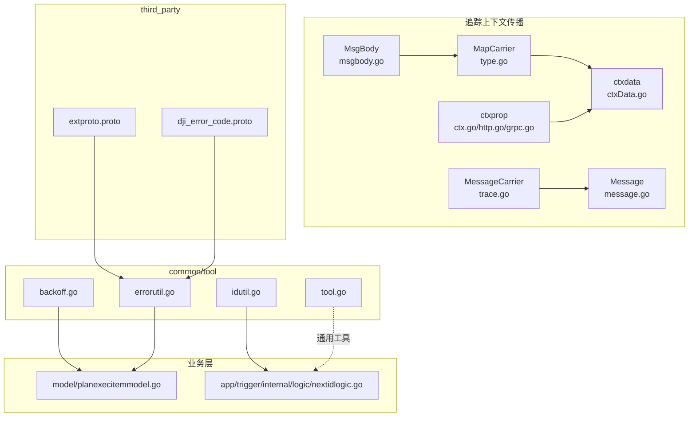
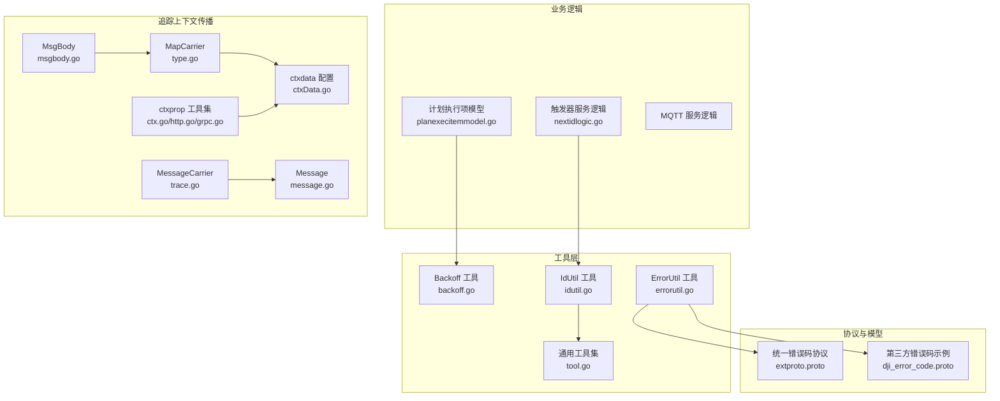
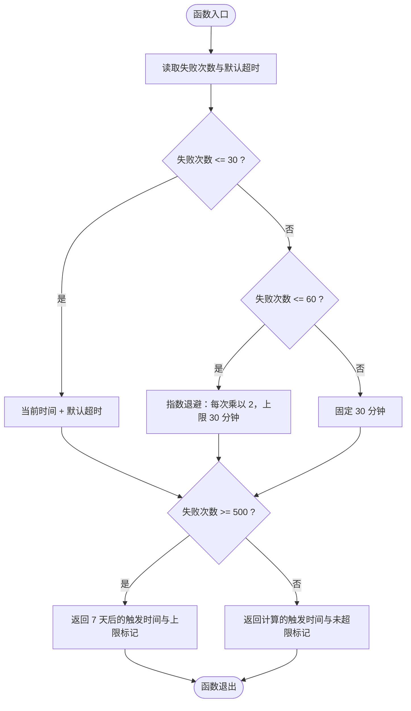
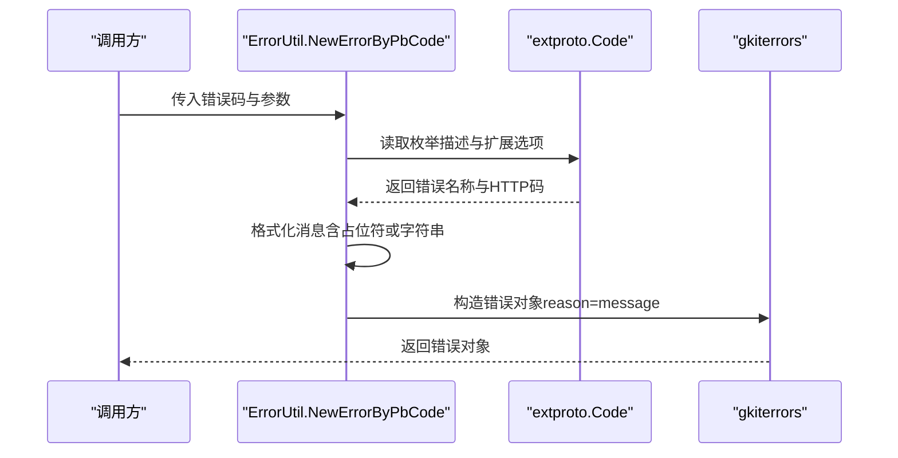
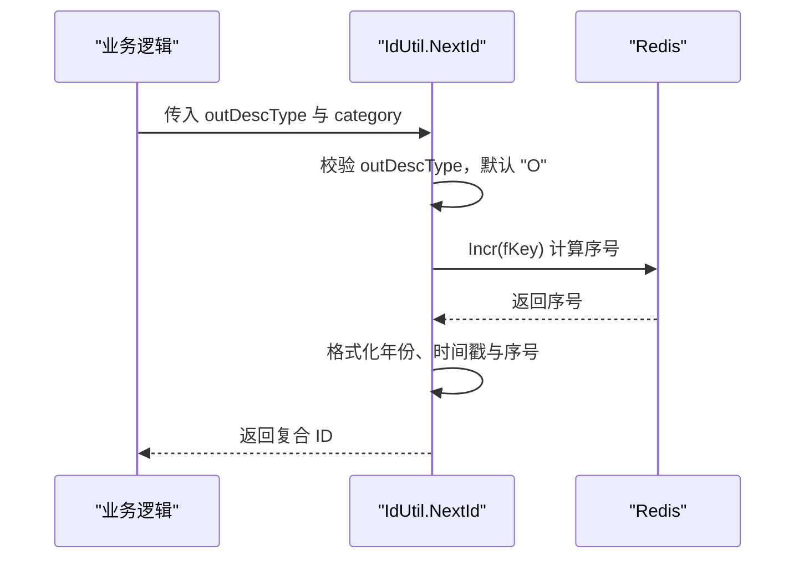
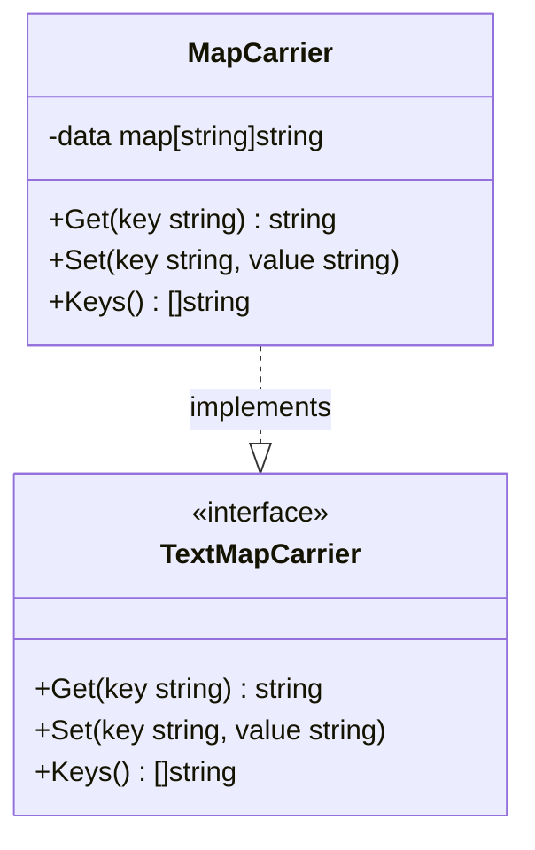
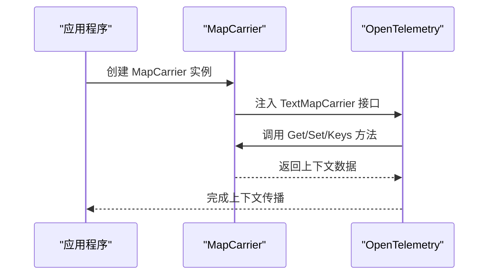
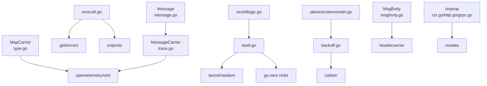

# 辅助工具

<cite>
**本文引用的文件**
- [backoff.go](file://common/tool/backoff.go)
- [errorutil.go](file://common/tool/errorutil.go)
- [idutil.go](file://common/tool/idutil.go)
- [tool.go](file://common/tool/tool.go)
- [type.go](file://common/type.go)
- [trace.go](file://common/mqttx/trace.go)
- [message.go](file://common/mqttx/message.go)
- [msgbody.go](file://common/msgbody/msgbody.go)
- [ctx.go](file://common/ctxprop/ctx.go)
- [http.go](file://common/ctxprop/http.go)
- [grpc.go](file://common/ctxprop/grpc.go)
- [ctxData.go](file://common/ctxdata/ctxData.go)
- [extproto.proto](file://third_party/extproto.proto)
- [dji_error_code.proto](file://third_party/dji_error_code.proto)
- [planexecitemmodel.go](file://model/planexecitemmodel.go)
- [nextidlogic.go](file://app/trigger/internal/logic/nextidlogic.go)
</cite>

## 更新摘要
**所做更改**
- 新增 OpenTelemetry 追踪上下文传播机制章节，详细介绍 MapCarrier 和 MessageCarrier 的实现
- 更新架构总览图，增加追踪上下文传播组件
- 新增追踪上下文传播最佳实践和使用示例
- 扩展依赖分析，包含 OpenTelemetry 相关依赖

## 目录
1. [简介](#简介)
2. [项目结构](#项目结构)
3. [核心组件](#核心组件)
4. [架构总览](#架构总览)
5. [详细组件分析](#详细组件分析)
6. [追踪上下文传播机制](#追踪上下文传播机制)
7. [依赖分析](#依赖分析)
8. [性能考量](#性能考量)
9. [故障排查指南](#故障排查指南)
10. [结论](#结论)
11. [附录](#附录)

## 简介
本文件面向 Zero-Service 的辅助工具，系统性梳理并解释以下四类工具的能力与用法：
- Backoff 退避算法工具：提供指数退避、线性退避与自适应退避的综合策略，用于任务重试与调度延时控制。
- ErrorUtil 错误处理工具：基于统一错误码枚举，实现错误包装、错误链追踪与错误分类处理，便于统一返回与可观测性。
- IdUtil ID 生成工具：提供分布式 ID 生成与简单 UUID 生成能力，结合 Redis 实现高并发下的单调递增序列与唯一性保障。
- **新增** 追踪上下文传播工具：基于 OpenTelemetry TextMapCarrier 接口，提供 MapCarrier 和 MessageCarrier 实现，支持跨传输层的统一追踪上下文传播。

同时，文档给出错误处理示例、重试机制场景、ID 生成的最佳实践以及追踪上下文传播的使用指南，并通过流程图与序列图帮助读者快速掌握其在项目中的落地方式。

## 项目结构
辅助工具集中于 common/tool 目录，配合第三方扩展协议、追踪上下文传播组件与业务模型/逻辑使用：
- common/tool/backoff.go：退避算法实现
- common/tool/errorutil.go：错误包装与分类
- common/tool/idutil.go：分布式 ID 与 UUID 生成
- common/tool/tool.go：通用工具集（包含 UUID、时间戳、Base62 编码等）
- **新增** common/type.go：MapCarrier 实现，支持 OpenTelemetry TextMapCarrier 接口
- **新增** common/mqttx/trace.go：MessageCarrier 实现，支持 MQTT 消息的追踪上下文传播
- **新增** common/mqttx/message.go：MQTT 消息结构体，包含头部容器
- **新增** common/msgbody/msgbody.go：消息载体结构体，包含 HeaderCarrier
- **新增** common/ctxprop/ctx.go：上下文字段收集与提取工具
- **新增** common/ctxprop/http.go：HTTP 头部上下文注入与提取
- **新增** common/ctxprop/grpc.go：gRPC 元数据上下文注入与提取
- **新增** common/ctxdata/ctxData.go：上下文字段定义与配置
- third_party/extproto.proto：统一错误码枚举及 HTTP 映射扩展
- model/planexecitemmodel.go：计划执行项模型中使用退避计算
- app/trigger/internal/logic/nextidlogic.go：业务逻辑中使用 ID 生成

**图表来源**
- [type.go:48-84](file://common/type.go#L48-L84)
- [trace.go:5-29](file://common/mqttx/trace.go#L5-L29)
- [message.go:3-30](file://common/mqttx/message.go#L3-L30)
- [msgbody.go:5-19](file://common/msgbody/msgbody.go#L5-L19)
- [ctx.go:12-38](file://common/ctxprop/ctx.go#L12-L38)
- [http.go:12-44](file://common/ctxprop/http.go#L12-L44)
- [grpc.go:13-34](file://common/ctxprop/grpc.go#L13-L34)
- [ctxData.go:32-38](file://common/ctxdata/ctxData.go#L32-L38)

**章节来源**
- [backoff.go:1-41](file://common/tool/backoff.go#L1-L41)
- [errorutil.go:1-91](file://common/tool/errorutil.go#L1-L91)
- [idutil.go:1-60](file://common/tool/idutil.go#L1-L60)
- [tool.go:1-469](file://common/tool/tool.go#L1-L469)
- [type.go:1-85](file://common/type.go#L1-L85)
- [trace.go:1-30](file://common/mqttx/trace.go#L1-L30)
- [message.go:1-30](file://common/mqttx/message.go#L1-L30)
- [msgbody.go:1-20](file://common/msgbody/msgbody.go#L1-L20)
- [ctx.go:1-39](file://common/ctxprop/ctx.go#L1-L39)
- [http.go:1-45](file://common/ctxprop/http.go#L1-L45)
- [grpc.go:1-35](file://common/ctxprop/grpc.go#L1-L35)
- [ctxData.go:1-67](file://common/ctxdata/ctxData.go#L1-L67)
- [extproto.proto:1-75](file://third_party/extproto.proto#L1-L75)
- [dji_error_code.proto:1-513](file://third_party/dji_error_code.proto#L1-L513)
- [planexecitemmodel.go:225-271](file://model/planexecitemmodel.go#L225-L271)
- [nextidlogic.go:1-49](file://app/trigger/internal/logic/nextidlogic.go#L1-L49)

## 核心组件
- Backoff 退避算法工具
  - 提供下一次触发时间计算，支持阈值分段的指数退避与上限保护，同时提供字符串化输出与"是否超过上限"的标记。
  - 适用于任务调度、重试延迟、熔断后的恢复节奏控制等场景。
- ErrorUtil 错误处理工具
  - 基于统一错误码枚举，动态解析错误名称与 HTTP 状态码，支持格式化消息与错误分类判断。
  - 便于统一对外返回、日志分级与监控告警。
- IdUtil ID 生成工具
  - 基于 Redis Incr 实现高并发下的单调递增序列，生成带前缀、年份、时间戳与序号的复合 ID。
  - 提供 SimpleUUID 生成不带"-"的 UUID，满足短路径与唯一性需求。
- **新增** MapCarrier 追踪上下文传播工具
  - 实现 OpenTelemetry TextMapCarrier 接口，提供基于 map[string]string 的追踪上下文存储与访问。
  - 支持 Get、Set、Keys 方法，便于跨传输层的统一上下文传播。
- **新增** MessageCarrier 追踪上下文传播工具
  - 实现 OpenTelemetry TextMapCarrier 接口，专门用于 MQTT 消息的追踪上下文传播。
  - 基于 Message 结构体的 Headers 字段，提供完整的上下文存储能力。

**章节来源**
- [backoff.go:9-35](file://common/tool/backoff.go#L9-L35)
- [errorutil.go:12-59](file://common/tool/errorutil.go#L12-L59)
- [idutil.go:22-35](file://common/tool/idutil.go#L22-L35)
- [type.go:48-84](file://common/type.go#L48-L84)
- [trace.go:5-29](file://common/mqttx/trace.go#L5-L29)

## 架构总览
下图展示了辅助工具在系统中的角色与交互关系，以及与业务层和追踪上下文传播组件的集成点。

**图表来源**
- [nextidlogic.go:27-48](file://app/trigger/internal/logic/nextidlogic.go#L27-L48)
- [planexecitemmodel.go:230-231](file://model/planexecitemmodel.go#L230-L231)
- [backoff.go:9-35](file://common/tool/backoff.go#L9-L35)
- [errorutil.go:12-59](file://common/tool/errorutil.go#L12-L59)
- [idutil.go:22-35](file://common/tool/idutil.go#L22-L35)
- [type.go:48-84](file://common/type.go#L48-L84)
- [trace.go:5-29](file://common/mqttx/trace.go#L5-L29)
- [message.go:3-30](file://common/mqttx/message.go#L3-L30)
- [msgbody.go:5-19](file://common/msgbody/msgbody.go#L5-L19)
- [ctx.go:12-38](file://common/ctxprop/ctx.go#L12-L38)
- [http.go:12-44](file://common/ctxprop/http.go#L12-L44)
- [grpc.go:13-34](file://common/ctxprop/grpc.go#L13-L34)
- [ctxData.go:32-38](file://common/ctxdata/ctxData.go#L32-L38)

## 详细组件分析

### Backoff 退避算法工具
- 功能概述
  - 根据失败次数与默认超时，计算下一次触发时间；超过一定阈值后进入上限保护。
  - 提供时间字符串化输出，便于日志与展示。
- 算法要点
  - 小于等于 30 次：固定超时后触发。
  - 31–60 次：按失败次数进行指数退避，最大不超过 30 分钟。
  - 超过 60 次：固定 30 分钟。
  - 失败次数达到 500 次及以上：返回一个"超过上限"的标记，通常用于终止重试。
- 使用场景
  - 计划任务调度、外部依赖重试、熔断恢复节奏控制等。

**图表来源**
- [backoff.go:9-35](file://common/tool/backoff.go#L9-L35)

**章节来源**
- [backoff.go:9-35](file://common/tool/backoff.go#L9-L35)
- [planexecitemmodel.go:230-231](file://model/planexecitemmodel.go#L230-L231)

### ErrorUtil 错误处理工具
- 功能概述
  - 通过统一错误码枚举，动态提取错误名称与 HTTP 状态码，支持格式化消息与错误分类判断。
  - 提供基于错误码的错误匹配，便于条件化处理。
- 关键流程
  - 从枚举值中读取扩展选项（错误名称、HTTP 码），构造 gRPC/HTTP 友好的错误对象。
  - 支持格式化字符串与 Stringer 接口，灵活适配不同参数类型。
  - 提供错误码匹配函数，用于识别具体错误类别。

**图表来源**
- [errorutil.go:12-59](file://common/tool/errorutil.go#L12-L59)
- [extproto.proto:25-28](file://third_party/extproto.proto#L25-L28)

**章节来源**
- [errorutil.go:12-59](file://common/tool/errorutil.go#L12-L59)
- [extproto.proto:25-28](file://third_party/extproto.proto#L25-L28)

### IdUtil ID 生成工具
- 功能概述
  - 基于 Redis Incr 实现高并发下的单调递增序列，生成复合 ID（前缀+年份+时间戳+序号）。
  - 提供 SimpleUUID 生成不带"-"的 UUID，满足短路径与唯一性需求。
- 关键流程
  - NextId：计算键名，调用 Redis Incr，到期自动过期并重置计数区间，最后拼接前缀、年份、时间戳与序号。
  - SimpleUUID：调用随机库生成 UUID 并去除"-"。

**图表来源**
- [idutil.go:22-35](file://common/tool/idutil.go#L22-L35)
- [nextidlogic.go:33-44](file://app/trigger/internal/logic/nextidlogic.go#L33-L44)

**章节来源**
- [idutil.go:22-35](file://common/tool/idutil.go#L22-L35)
- [nextidlogic.go:33-44](file://app/trigger/internal/logic/nextidlogic.go#L33-L44)

## 追踪上下文传播机制

### MapCarrier 实现
- 功能概述
  - 实现 OpenTelemetry TextMapCarrier 接口，提供基于 map[string]string 的追踪上下文存储与访问。
  - 支持标准的 Get、Set、Keys 方法，便于跨传输层的统一上下文传播。
- 核心特性
  - 类型安全：通过接口约束确保兼容性
  - 空值安全：Get/Set 方法对 nil 值进行安全处理
  - 性能优化：Keys 方法预分配切片容量，减少内存重新分配
- 使用场景
  - HTTP 请求头传播
  - gRPC 元数据传播
  - 自定义传输层上下文传递

**图表来源**
- [type.go:48-84](file://common/type.go#L48-L84)

### MessageCarrier 实现
- 功能概述
  - 实现 OpenTelemetry TextMapCarrier 接口，专门用于 MQTT 消息的追踪上下文传播。
  - 基于 Message 结构体的 Headers 字段，提供完整的上下文存储能力。
- 核心特性
  - 透明封装：对 Message 结构体进行透明封装，保持原有 API
  - 便捷使用：NewMessageCarrier 工厂函数简化实例创建
  - 完整实现：提供 Get、Set、Keys 的完整 TextMapCarrier 接口实现
- 使用场景
  - MQTT 消息发布/订阅过程中的上下文传播
  - 设备间通信的追踪信息传递
  - 流式数据处理的上下文保持

**图表来源**
- [type.go:54-84](file://common/type.go#L54-L84)
- [trace.go:11-29](file://common/mqttx/trace.go#L11-L29)

### 上下文字段管理
- 功能概述
  - 提供统一的上下文字段定义和管理机制，支持 HTTP、gRPC、Context 三种传输层。
  - 定义了用户身份、授权信息等关键字段的标准映射。
- 核心组件
  - PropFields：全局字段列表，定义所有需要传播的上下文字段
  - HTTP 头部映射：标准化的 HTTP 头部键名
  - gRPC 元数据映射：全小写的 gRPC 元数据键名
  - Context 键名：Go context.WithValue 使用的键名
- 使用场景
  - 用户身份在微服务间的传递
  - 授权信息的跨服务传播
  - 业务上下文的统一管理

**章节来源**
- [type.go:48-84](file://common/type.go#L48-L84)
- [trace.go:5-29](file://common/mqttx/trace.go#L5-L29)
- [message.go:3-30](file://common/mqttx/message.go#L3-L30)
- [msgbody.go:5-19](file://common/msgbody/msgbody.go#L5-L19)
- [ctx.go:12-38](file://common/ctxprop/ctx.go#L12-L38)
- [http.go:12-44](file://common/ctxprop/http.go#L12-L44)
- [grpc.go:13-34](file://common/ctxprop/grpc.go#L13-L34)
- [ctxData.go:32-38](file://common/ctxdata/ctxData.go#L32-L38)

## 依赖分析
- 第三方依赖
  - Carbon：时间字符串化（Backoff 输出字符串化）
  - gkit/errors：统一错误对象封装
  - Lancet Random：UUID 生成
  - Go-Zero Redis：分布式 ID 序列
  - **新增** OpenTelemetry Propagation：追踪上下文传播接口
- 内部依赖
  - extproto：统一错误码与 HTTP 映射扩展
  - dji_error_code：示例错误码枚举（可用于测试与演示）
  - **新增** ctxdata：上下文字段定义与配置
  - **新增** mqttx：MQTT 消息处理与追踪

**图表来源**
- [backoff.go:3-7](file://common/tool/backoff.go#L3-L7)
- [errorutil.go:3-10](file://common/tool/errorutil.go#L3-L10)
- [idutil.go:3-10](file://common/tool/idutil.go#L3-L10)
- [type.go:3-8](file://common/type.go#L3-L8)
- [trace.go:3](file://common/mqttx/trace.go#L3)
- [message.go:3](file://common/mqttx/message.go#L3)
- [msgbody.go:3](file://common/msgbody/msgbody.go#L3)
- [ctx.go:12-38](file://common/ctxprop/ctx.go#L12-L38)
- [http.go:12-44](file://common/ctxprop/http.go#L12-L44)
- [grpc.go:13-34](file://common/ctxprop/grpc.go#L13-L34)
- [ctxData.go:32-38](file://common/ctxdata/ctxData.go#L32-L38)

**章节来源**
- [backoff.go:3-7](file://common/tool/backoff.go#L3-L7)
- [errorutil.go:3-10](file://common/tool/errorutil.go#L3-L10)
- [idutil.go:3-10](file://common/tool/idutil.go#L3-L10)
- [type.go:3-8](file://common/type.go#L3-L8)

## 性能考量
- Backoff
  - 时间复杂度：O(1)，仅做常数次加法与乘法运算。
  - 注意：当失败次数超过阈值时，指数退避会收敛到上限，避免过长等待。
- ErrorUtil
  - 错误对象构造为 O(1)，主要开销在枚举反射与字符串格式化，通常可忽略。
- IdUtil
  - Redis Incr 为原子操作，具备高并发下的单调性与唯一性。
  - 序号每小时重置，避免长期增长导致的 ID 过长。
  - SimpleUUID 依赖随机库，生成成本低，适合短路径场景。
- **新增** MapCarrier
  - Get/Set 操作为 O(1)，基于 map 的直接访问。
  - Keys 操作为 O(n)，其中 n 为 map 大小，但通过预分配容量优化性能。
  - 内存占用与 map 大小线性相关，适合轻量级上下文传播。
- **新增** MessageCarrier
  - 基于 Message.Headers 的直接访问，性能与 mapCarrier 相当。
  - 对于 MQTT 消息，额外的结构体封装开销可忽略不计。

## 故障排查指南
- Backoff
  - 现象：重试间隔异常增大或恒定不变
  - 排查：确认失败次数是否超过阈值，检查默认超时与上限保护逻辑
  - 参考：[backoff.go:9-35](file://common/tool/backoff.go#L9-L35)
- ErrorUtil
  - 现象：错误名称与 HTTP 码不匹配
  - 排查：确认枚举扩展选项是否正确设置，检查格式化参数
  - 参考：[errorutil.go:61-81](file://common/tool/errorutil.go#L61-L81)
- IdUtil
  - 现象：ID 重复或过长
  - 排查：确认 Redis 键命名与过期策略，检查时钟同步与并发写入
  - 参考：[idutil.go:37-50](file://common/tool/idutil.go#L37-L50)
- **新增** MapCarrier
  - 现象：上下文传播失败或数据丢失
  - 排查：确认 TextMapCarrier 接口实现是否正确，检查 map 初始化状态
  - 参考：[type.go:61-84](file://common/type.go#L61-L84)
- **新增** MessageCarrier
  - 现象：MQTT 消息上下文无法正确传递
  - 排查：确认 Message.Headers 是否正确初始化，检查 Get/Set 方法调用
  - 参考：[trace.go:15-29](file://common/mqttx/trace.go#L15-L29)
- **新增** 上下文字段传播
  - 现象：业务上下文在服务间丢失
  - 排查：确认 PropFields 配置是否完整，检查各传输层的注入/提取逻辑
  - 参考：[ctx.go:12-38](file://common/ctxprop/ctx.go#L12-L38)

**章节来源**
- [backoff.go:9-35](file://common/tool/backoff.go#L9-L35)
- [errorutil.go:61-81](file://common/tool/errorutil.go#L61-L81)
- [idutil.go:37-50](file://common/tool/idutil.go#L37-L50)
- [type.go:61-84](file://common/type.go#L61-L84)
- [trace.go:15-29](file://common/mqttx/trace.go#L15-L29)
- [ctx.go:12-38](file://common/ctxprop/ctx.go#L12-L38)

## 结论
- Backoff 提供稳健的退避策略，适合在不稳定环境中平滑调节重试节奏。
- ErrorUtil 将错误码与 HTTP 状态映射统一化，提升可观测性与一致性。
- IdUtil 在高并发下提供可靠且易用的 ID 生成方案，SimpleUUID 适配短路径场景。
- **新增** MapCarrier 和 MessageCarrier 为 OpenTelemetry 追踪提供了统一的上下文传播机制，支持多种传输层的无缝集成。
- **新增** 上下文字段管理系统确保了用户身份、授权信息等关键业务数据在微服务间的可靠传递。
- 建议在业务层通过统一的工具调用封装，形成一致的错误处理、重试策略和追踪上下文传播方案。

## 附录

### 错误处理示例与最佳实践
- 使用统一错误码
  - 通过枚举值与扩展选项，自动映射错误名称与 HTTP 码，便于前端与网关统一处理。
  - 参考：[errorutil.go:12-59](file://common/tool/errorutil.go#L12-L59)、[extproto.proto:25-28](file://third_party/extproto.proto#L25-L28)
- 错误分类与条件处理
  - 使用错误码匹配函数区分可重试与不可重试错误，避免无限重试。
  - 参考：[errorutil.go:83-90](file://common/tool/errorutil.go#L83-L90)
- 业务侧错误包装
  - 在业务逻辑中对底层错误进行包装，保留上下文与错误链，便于定位问题。
  - 参考：[planexecitemmodel.go:226-227](file://model/planexecitemmodel.go#L226-L227)

**章节来源**
- [errorutil.go:12-59](file://common/tool/errorutil.go#L12-L59)
- [extproto.proto:25-28](file://third_party/extproto.proto#L25-L28)
- [planexecitemmodel.go:226-227](file://model/planexecitemmodel.go#L226-L227)

### 重试机制场景与最佳实践
- 场景一：指数退避
  - 适用于网络抖动、第三方服务瞬时异常等。
  - 参考：[backoff.go:9-35](file://common/tool/backoff.go#L9-L35)
- 场景二：熔断后恢复
  - 当失败次数达到上限时，停止重试并记录终止原因，等待人工干预或策略变更。
  - 参考：[backoff.go:29-32](file://common/tool/backoff.go#L29-L32)
- 场景三：业务侧自定义重试
  - 在业务逻辑中结合错误分类与退避策略，实现可控的重试窗口与上限。
  - 参考：[planexecitemmodel.go:230-231](file://model/planexecitemmodel.go#L230-L231)

**章节来源**
- [backoff.go:9-35](file://common/tool/backoff.go#L9-L35)
- [planexecitemmodel.go:230-231](file://model/planexecitemmodel.go#L230-L231)

### ID 生成最佳实践
- 复合 ID 规则
  - 前缀：业务类型或模块标识
  - 年份：两位年份，便于按年归档
  - 时间戳：MMddHHmmss，精确到秒
  - 序号：四位递增序号，每小时重置
  - 参考：[idutil.go:22-35](file://common/tool/idutil.go#L22-L35)
- SimpleUUID
  - 适用于短路径、临时标识或非关键业务场景，生成成本低、冲突概率极低。
  - 参考：[idutil.go:52-59](file://common/tool/idutil.go#L52-L59)、[tool.go:133-140](file://common/tool/tool.go#L133-L140)
- 业务集成
  - 在业务逻辑中统一调用 IdUtil.NextId，确保 ID 生成的一致性与可追溯性。
  - 参考：[nextidlogic.go:33-44](file://app/trigger/internal/logic/nextidlogic.go#L33-L44)

**章节来源**
- [idutil.go:22-35](file://common/tool/idutil.go#L22-L35)
- [tool.go:133-140](file://common/tool/tool.go#L133-L140)
- [nextidlogic.go:33-44](file://app/trigger/internal/logic/nextidlogic.go#L33-L44)

### **新增** 追踪上下文传播最佳实践
- MapCarrier 使用场景
  - HTTP 请求头传播：在 HTTP 客户端中使用 MapCarrier 注入追踪上下文
  - gRPC 元数据传播：在 gRPC 客户端中使用 MapCarrier 传递上下文信息
  - 自定义传输层：为新的传输协议提供统一的上下文传播接口
  - 参考：[type.go:54-84](file://common/type.go#L54-L84)
- MessageCarrier 使用场景
  - MQTT 消息发布：在发布 MQTT 消息时携带追踪上下文
  - 设备间通信：在设备协议中传递用户身份和授权信息
  - 流式数据处理：保持数据流中的上下文完整性
  - 参考：[trace.go:11-29](file://common/mqttx/trace.go#L11-L29)
- 上下文字段管理
  - 统一字段定义：通过 PropFields 管理所有需要传播的上下文字段
  - 传输层适配：确保 HTTP、gRPC、Context 三种传输层的字段映射一致
  - 安全考虑：敏感字段（如 authorization）应进行脱敏处理
  - 参考：[ctxData.go:32-38](file://common/ctxdata/ctxData.go#L32-L38)
- 业务集成建议
  - 在服务启动时初始化上下文传播组件
  - 在请求处理的开始和结束时进行上下文注入和提取
  - 使用统一的中间件处理上下文传播逻辑
  - 参考：[ctx.go:12-38](file://common/ctxprop/ctx.go#L12-L38)

**章节来源**
- [type.go:54-84](file://common/type.go#L54-L84)
- [trace.go:11-29](file://common/mqttx/trace.go#L11-L29)
- [ctxData.go:32-38](file://common/ctxdata/ctxData.go#L32-L38)
- [ctx.go:12-38](file://common/ctxprop/ctx.go#L12-L38)