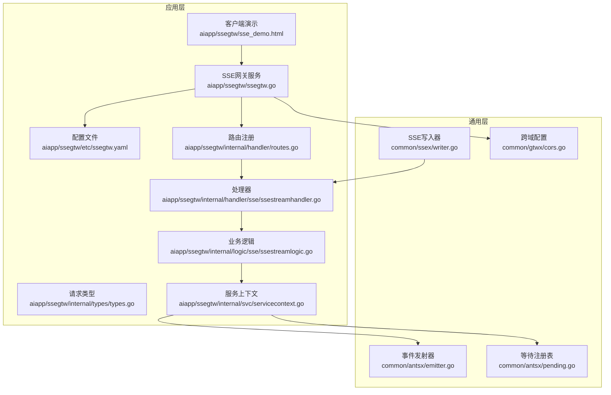
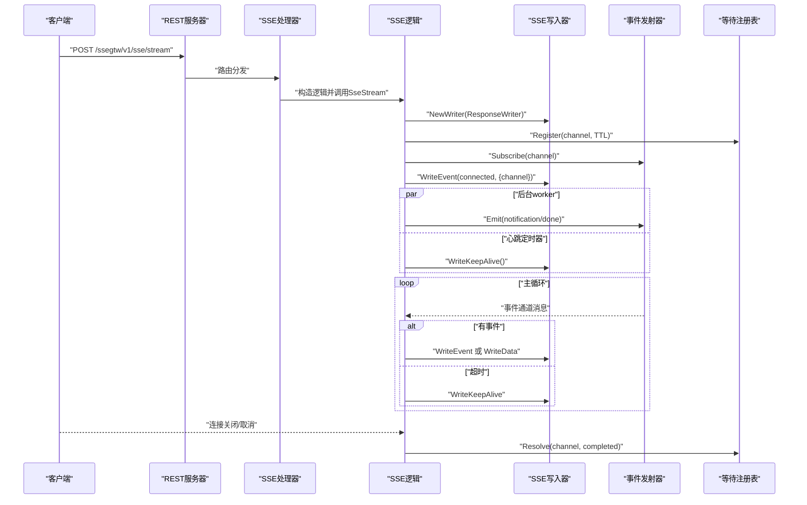
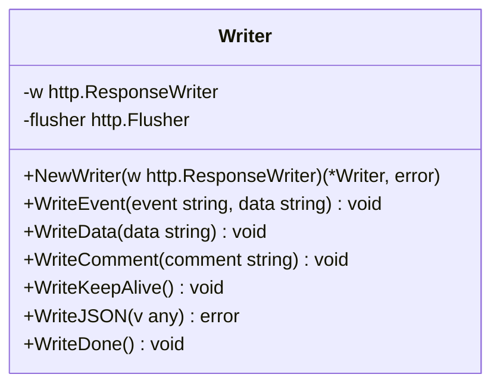
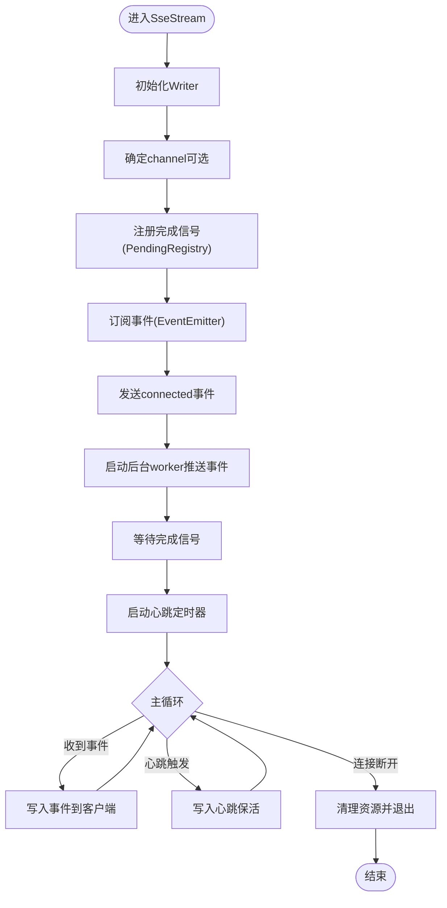
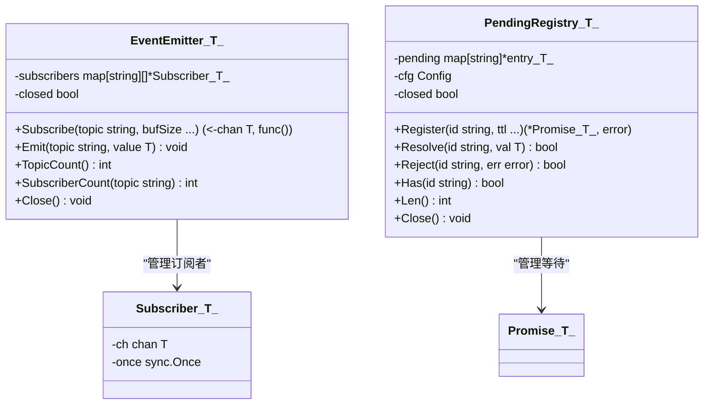
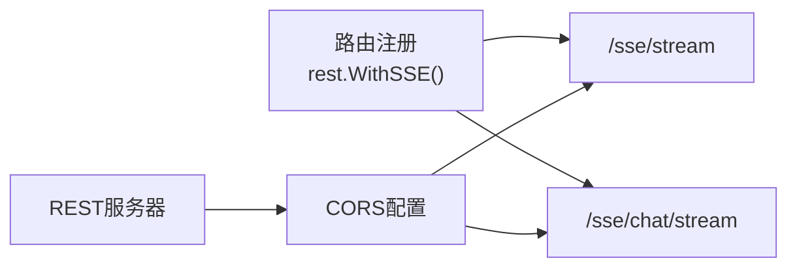
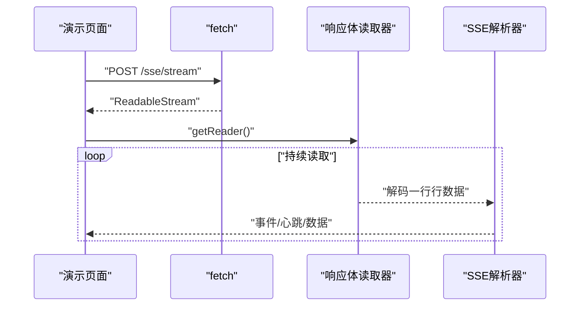
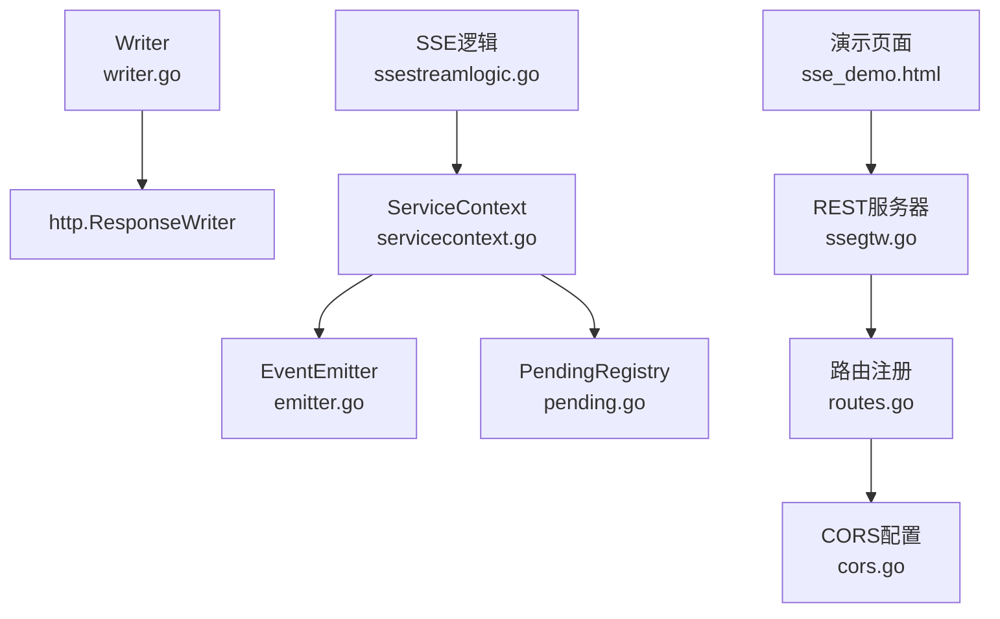

# SSE写入器

<cite>
**本文档引用的文件**
- [writer.go](file://common/ssex/writer.go)
- [ssestreamhandler.go](file://aiapp/ssegtw/internal/handler/sse/ssestreamhandler.go)
- [ssestreamlogic.go](file://aiapp/ssegtw/internal/logic/sse/ssestreamlogic.go)
- [routes.go](file://aiapp/ssegtw/internal/handler/routes.go)
- [types.go](file://aiapp/ssegtw/internal/types/types.go)
- [servicecontext.go](file://aiapp/ssegtw/internal/svc/servicecontext.go)
- [ssegtw.go](file://aiapp/ssegtw/ssegtw.go)
- [ssegtw.yaml](file://aiapp/ssegtw/etc/ssegtw.yaml)
- [sse_demo.html](file://aiapp/ssegtw/sse_demo.html)
- [cors.go](file://common/gtwx/cors.go)
- [emitter.go](file://common/antsx/emitter.go)
- [pending.go](file://common/antsx/pending.go)
- [ssegtw.api](file://aiapp/ssegtw/ssegtw.api)
</cite>

## 目录
1. [简介](#简介)
2. [项目结构](#项目结构)
3. [核心组件](#核心组件)
4. [架构总览](#架构总览)
5. [详细组件分析](#详细组件分析)
6. [依赖关系分析](#依赖关系分析)
7. [性能考虑](#性能考虑)
8. [故障排查指南](#故障排查指南)
9. [结论](#结论)
10. [附录](#附录)

## 简介
本文件面向Zero-Service中的SSE写入器与SSE网关服务，系统性阐述Server-Sent Events（SSE）的实现原理、流式数据推送机制与连接管理策略。重点覆盖Writer初始化流程、数据编码与消息序列化策略、连接池与心跳保活、断线重连处理、跨域配置以及SSE协议兼容性。同时提供服务端实现示例、客户端连接代码与实时数据推送的最佳实践，并给出性能优化建议与监控指标收集方法。

## 项目结构
SSE相关能力主要分布在以下模块：
- 通用SSE写入器：封装SSE协议写入与自动Flush
- SSE网关服务：基于go-zero REST框架提供SSE事件流接口
- 事件发射器与等待注册：实现Topic级发布/订阅与完成信号等待
- 跨域配置：统一CORS策略
- 客户端演示页面：提供SSE连接、事件解析与可视化

**图表来源**
- [writer.go:1-79](file://common/ssex/writer.go#L1-L79)
- [emitter.go:1-118](file://common/antsx/emitter.go#L1-L118)
- [pending.go:52-183](file://common/antsx/pending.go#L52-L183)
- [cors.go:1-25](file://common/gtwx/cors.go#L1-L25)
- [ssegtw.go:1-49](file://aiapp/ssegtw/ssegtw.go#L1-L49)
- [ssegtw.yaml:1-14](file://aiapp/ssegtw/etc/ssegtw.yaml#L1-L14)
- [types.go:1-18](file://aiapp/ssegtw/internal/types/types.go#L1-L18)
- [servicecontext.go:1-39](file://aiapp/ssegtw/internal/svc/servicecontext.go#L1-L39)
- [routes.go:1-51](file://aiapp/ssegtw/internal/handler/routes.go#L1-L51)
- [ssestreamhandler.go:1-33](file://aiapp/ssegtw/internal/handler/sse/ssestreamhandler.go#L1-L33)
- [ssestreamlogic.go:1-117](file://aiapp/ssegtw/internal/logic/sse/ssestreamlogic.go#L1-L117)
- [sse_demo.html:1-665](file://aiapp/ssegtw/sse_demo.html#L1-L665)

**章节来源**
- [ssegtw.go:24-49](file://aiapp/ssegtw/ssegtw.go#L24-L49)
- [routes.go:17-51](file://aiapp/ssegtw/internal/handler/routes.go#L17-L51)
- [ssegtw.api:18-40](file://aiapp/ssegtw/ssegtw.api#L18-L40)

## 核心组件
- SSE写入器（Writer）
  - 负责将SSE事件写入http.ResponseWriter并自动Flush，确保客户端及时收到数据
  - 提供WriteEvent、WriteData、WriteComment、WriteKeepAlive、WriteJSON、WriteDone等方法
  - 初始化时校验ResponseWriter是否支持Flusher，不支持则报错
- 事件发射器（EventEmitter）
  - 支持按Topic的发布/订阅，内部维护Topic到订阅者的映射
  - Emit采用非阻塞广播，慢消费者可能丢失消息
  - 提供Subscribe、Emit、TopicCount、SubscriberCount、Close等能力
- 等待注册表（PendingRegistry）
  - 为每个Channel注册等待完成信号的Promise
  - 支持TTL过期、并发Resolve、Has查询、Close等
- 服务上下文（ServiceContext）
  - 组合配置、RPC客户端、EventEmitter、PendingRegistry
  - 通过NewServiceContext统一初始化
- SSE处理器与逻辑
  - 处理器负责参数解析与错误处理
  - 逻辑层负责建立Writer、订阅事件、发送连接成功事件、启动心跳、主循环转发事件

**章节来源**
- [writer.go:9-79](file://common/ssex/writer.go#L9-L79)
- [emitter.go:13-118](file://common/antsx/emitter.go#L13-L118)
- [pending.go:52-183](file://common/antsx/pending.go#L52-L183)
- [servicecontext.go:17-39](file://aiapp/ssegtw/internal/svc/servicecontext.go#L17-L39)
- [ssestreamhandler.go:17-33](file://aiapp/ssegtw/internal/handler/sse/ssestreamhandler.go#L17-L33)
- [ssestreamlogic.go:20-117](file://aiapp/ssegtw/internal/logic/sse/ssestreamlogic.go#L20-L117)

## 架构总览
SSE网关服务采用“REST处理器 + 业务逻辑 + 通用写入器 + 事件发射器 + 等待注册”的分层设计。客户端通过POST请求建立SSE长连接，服务端返回事件流并在必要时发送心跳保活。

**图表来源**
- [ssestreamhandler.go:18-32](file://aiapp/ssegtw/internal/handler/sse/ssestreamhandler.go#L18-L32)
- [ssestreamlogic.go:39-117](file://aiapp/ssegtw/internal/logic/sse/ssestreamlogic.go#L39-L117)
- [writer.go:15-79](file://common/ssex/writer.go#L15-L79)
- [emitter.go:27-83](file://common/antsx/emitter.go#L27-L83)
- [pending.go:52-107](file://common/antsx/pending.go#L52-L107)

## 详细组件分析

### SSE写入器（Writer）类图

**图表来源**
- [writer.go:9-79](file://common/ssex/writer.go#L9-L79)

**章节来源**
- [writer.go:15-79](file://common/ssex/writer.go#L15-L79)

### SSE事件流处理器与逻辑
- 处理器职责
  - 解析请求参数（如channel、prompt）
  - 调用SSE逻辑层执行事件流处理
  - 错误日志记录
- 逻辑层职责
  - 初始化Writer
  - 生成或接收channel
  - 注册完成信号（PendingRegistry）
  - 订阅事件（EventEmitter）
  - 发送连接成功事件
  - 启动后台worker推送事件
  - 启动心跳定时器
  - 主循环：转发事件到客户端，处理断开与完成

**图表来源**
- [ssestreamlogic.go:39-117](file://aiapp/ssegtw/internal/logic/sse/ssestreamlogic.go#L39-L117)
- [ssestreamhandler.go:18-32](file://aiapp/ssegtw/internal/handler/sse/ssestreamhandler.go#L18-L32)

**章节来源**
- [ssestreamhandler.go:17-33](file://aiapp/ssegtw/internal/handler/sse/ssestreamhandler.go#L17-L33)
- [ssestreamlogic.go:28-117](file://aiapp/ssegtw/internal/logic/sse/ssestreamlogic.go#L28-L117)

### 事件发射器与等待注册表
- 事件发射器（EventEmitter）
  - Subscribe返回只读通道与取消函数，支持可选缓冲大小
  - Emit对所有订阅者进行非阻塞广播，慢消费者可能丢消息
  - Close关闭所有订阅者通道
- 等待注册表（PendingRegistry）
  - Register为指定ID注册Promise，支持TTL过期
  - Resolve/Reject用于完成或拒绝等待
  - Has/Len/Close提供查询与资源回收

**图表来源**
- [emitter.go:13-118](file://common/antsx/emitter.go#L13-L118)
- [pending.go:52-183](file://common/antsx/pending.go#L52-L183)

**章节来源**
- [emitter.go:13-118](file://common/antsx/emitter.go#L13-L118)
- [pending.go:52-183](file://common/antsx/pending.go#L52-L183)

### 路由与跨域配置
- 路由注册
  - 使用rest.WithSSE()启用SSE长连接模式
  - 定义SSE事件流与AI对话流两个POST端点
- 跨域配置
  - 动态设置Access-Control-Allow-Origin为请求Origin
  - 允许常用方法与头部，暴露Content-Length与Content-Type

**图表来源**
- [routes.go:17-36](file://aiapp/ssegtw/internal/handler/routes.go#L17-L36)
- [cors.go:9-24](file://common/gtwx/cors.go#L9-L24)

**章节来源**
- [routes.go:17-36](file://aiapp/ssegtw/internal/handler/routes.go#L17-L36)
- [cors.go:9-24](file://common/gtwx/cors.go#L9-L24)

### 客户端连接与演示
- 客户端演示页面
  - 支持选择SSE端点（事件流或AI对话流）
  - 自动解析服务端事件：event:、data:、注释行
  - 实时统计事件数、心跳数与耗时
- 客户端连接要点
  - 使用fetch配合AbortController控制连接生命周期
  - 通过reader读取响应体并按行解析SSE帧

**图表来源**
- [sse_demo.html:558-635](file://aiapp/ssegtw/sse_demo.html#L558-L635)

**章节来源**
- [sse_demo.html:482-665](file://aiapp/ssegtw/sse_demo.html#L482-L665)

## 依赖关系分析
- Writer依赖http.ResponseWriter与http.Flusher，确保每条SSE消息立即推送到客户端
- SSE逻辑依赖服务上下文，组合EventEmitter与PendingRegistry实现事件驱动与完成信号
- REST服务器依赖路由注册启用SSE模式，依赖CORS配置处理跨域
- 客户端演示页面依赖浏览器SSE能力与fetch API

**图表来源**
- [writer.go:9-22](file://common/ssex/writer.go#L9-L22)
- [ssestreamlogic.go:20-37](file://aiapp/ssegtw/internal/logic/sse/ssestreamlogic.go#L20-L37)
- [servicecontext.go:23-38](file://aiapp/ssegtw/internal/svc/servicecontext.go#L23-L38)
- [ssegtw.go:35-38](file://aiapp/ssegtw/ssegtw.go#L35-L38)
- [routes.go:17-36](file://aiapp/ssegtw/internal/handler/routes.go#L17-L36)
- [cors.go:9-24](file://common/gtwx/cors.go#L9-L24)
- [sse_demo.html:558-635](file://aiapp/ssegtw/sse_demo.html#L558-L635)

**章节来源**
- [writer.go:9-22](file://common/ssex/writer.go#L9-L22)
- [servicecontext.go:23-38](file://aiapp/ssegtw/internal/svc/servicecontext.go#L23-L38)
- [ssegtw.go:35-38](file://aiapp/ssegtw/ssegtw.go#L35-L38)

## 性能考虑
- 写入性能
  - Writer每次写入后自动Flush，保证低延迟；在高并发场景下建议评估Flush频率与缓冲策略
- 事件发射
  - EventEmitter的Emit为非阻塞广播，慢消费者可能丢消息；可通过增大订阅者通道缓冲或引入背压机制缓解
- 心跳保活
  - 默认30秒心跳，可根据网络环境调整；避免过于频繁导致不必要的流量
- 连接管理
  - 使用PendingRegistry为每个Channel设置合理TTL，防止僵尸连接占用资源
- 跨域与Nginx
  - 使用动态Origin允许提升灵活性；若部署在反向代理后，确保正确传递Origin与转发头部

[本节为通用指导，无需特定文件来源]

## 故障排查指南
- “不支持流式”错误
  - 现象：NewWriter返回错误
  - 原因：ResponseWriter不支持Flusher
  - 处理：确认使用支持流式的中间件或服务器配置
- 心跳无效
  - 现象：客户端未收到心跳
  - 原因：心跳定时器未触发或客户端未解析注释行
  - 处理：检查逻辑层心跳定时器与客户端解析逻辑
- 事件丢失
  - 现象：部分事件未到达客户端
  - 原因：EventEmitter非阻塞广播导致慢消费者丢消息
  - 处理：增大订阅者通道缓冲或引入重试/补偿机制
- 连接未断开
  - 现象：客户端断开后服务端仍在推送
  - 原因：未正确取消订阅或未Resolve完成信号
  - 处理：确保在连接断开时调用cancel并Resolve对应channel

**章节来源**
- [writer.go:15-22](file://common/ssex/writer.go#L15-L22)
- [emitter.go:69-83](file://common/antsx/emitter.go#L69-L83)
- [ssestreamlogic.go:96-117](file://aiapp/ssegtw/internal/logic/sse/ssestreamlogic.go#L96-L117)

## 结论
Zero-Service的SSE写入器与网关服务通过简洁的Writer抽象、事件驱动的EventEmitter与可靠的PendingRegistry，实现了低耦合、可扩展的实时事件推送能力。结合CORS配置与完善的客户端演示，能够满足大多数SSE应用场景。在生产环境中，建议根据流量特征优化心跳频率、订阅者缓冲与TTL策略，并完善监控与告警体系。

[本节为总结，无需特定文件来源]

## 附录

### SSE协议兼容性与浏览器支持
- 协议特性
  - 服务端以文本帧形式推送事件，客户端按行解析
  - 支持event、data、注释行与换行分隔符
  - 心跳通过注释行实现
- 浏览器支持
  - 现代浏览器均支持SSE；IE不支持
- 跨域配置
  - 使用动态Origin与标准CORS头，确保跨域请求可用

**章节来源**
- [writer.go:24-55](file://common/ssex/writer.go#L24-L55)
- [cors.go:9-24](file://common/gtwx/cors.go#L9-L24)

### 客户端连接代码与最佳实践
- 客户端连接
  - 使用fetch发起POST请求，获取ReadableStream
  - 通过getReader与TextDecoder逐行解析SSE帧
  - 使用AbortController控制连接生命周期
- 最佳实践
  - 明确事件命名规范（event字段）
  - 使用JSON序列化复杂数据（WriteJSON）
  - 在完成时发送[DONE]标记（WriteDone）
  - 合理设置心跳间隔，避免过度刷新
  - 对慢消费者增加缓冲或降频策略

**章节来源**
- [sse_demo.html:558-635](file://aiapp/ssegtw/sse_demo.html#L558-L635)
- [writer.go:57-79](file://common/ssex/writer.go#L57-L79)

### 服务端实现示例与配置
- 服务端入口
  - 加载配置、启用CORS、注册路由、启动服务
- 配置文件
  - 包含服务监听地址、端口、日志路径与RPC端点
- API定义
  - 定义SSE事件流与AI对话流端点，标注SSE模式

**章节来源**
- [ssegtw.go:24-49](file://aiapp/ssegtw/ssegtw.go#L24-L49)
- [ssegtw.yaml:1-14](file://aiapp/ssegtw/etc/ssegtw.yaml#L1-L14)
- [ssegtw.api:18-40](file://aiapp/ssegtw/ssegtw.api#L18-L40)