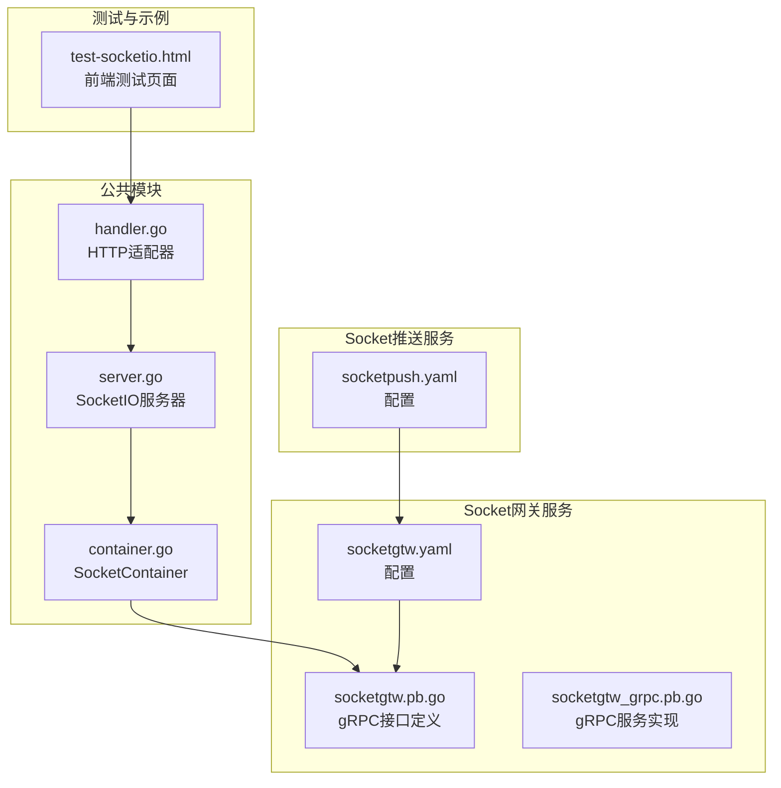
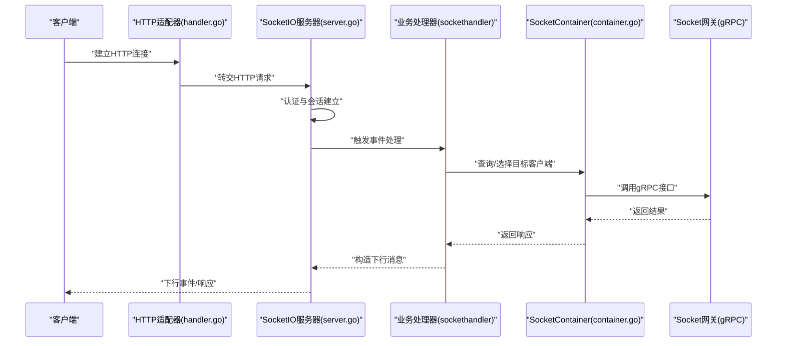
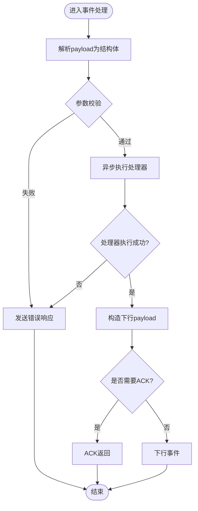
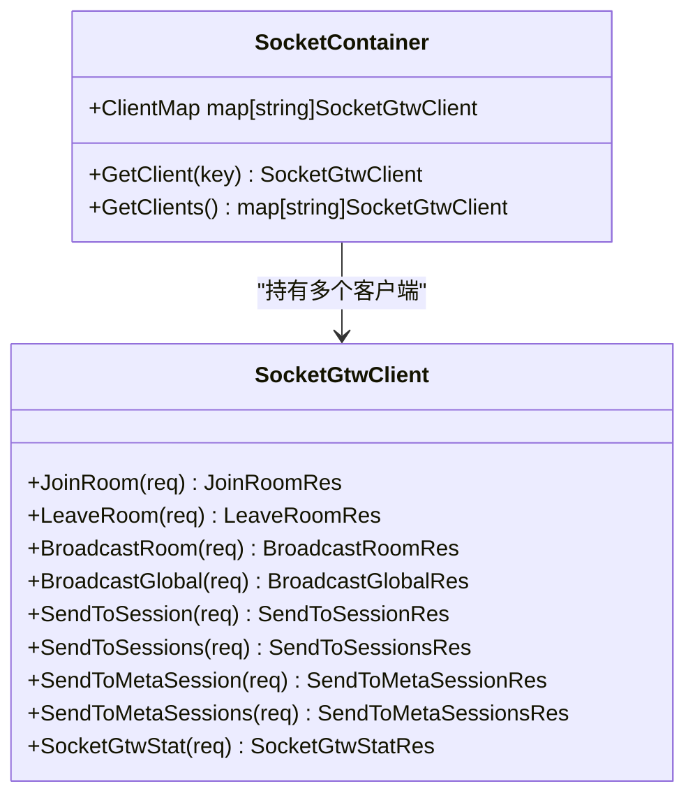
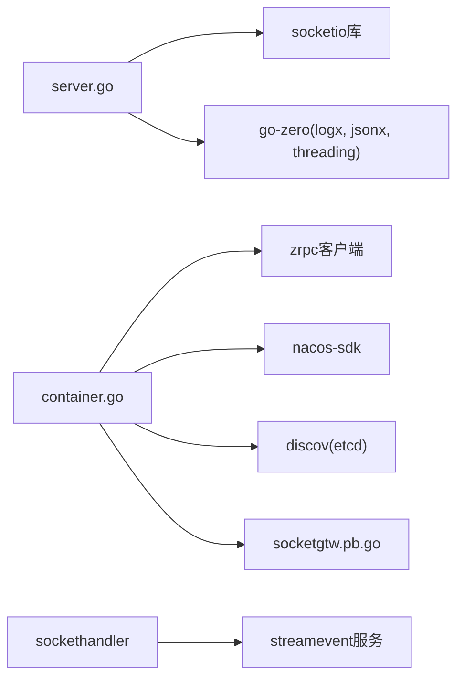

# SocketIO处理器

<cite>
**本文档引用的文件**
- [handler.go](file://common/socketiox/handler.go)
- [server.go](file://common/socketiox/server.go)
- [container.go](file://common/socketiox/container.go)
- [socketgtw.pb.go](file://socketapp/socketgtw/socketgtw/socketgtw.pb.go)
- [socketgtw_grpc.pb.go](file://socketapp/socketgtw/socketgtw/socketgtw_grpc.pb.go)
- [socketgtw.yaml](file://socketapp/socketgtw/etc/socketgtw.yaml)
- [socketpush.yaml](file://socketapp/socketpush/etc/socketpush.yaml)
- [test-socketio.html](file://common/socketiox/test-socketio.html)
- [sockertuphandler.go](file://socketapp/socketgtw/internal/sockethandler/sockertuphandler.go)
</cite>

## 目录
1. [简介](#简介)
2. [项目结构](#项目结构)
3. [核心组件](#核心组件)
4. [架构总览](#架构总览)
5. [详细组件分析](#详细组件分析)
6. [依赖关系分析](#依赖关系分析)
7. [性能考虑](#性能考虑)
8. [故障排查指南](#故障排查指南)
9. [结论](#结论)
10. [附录](#附录)

## 简介
本文件面向Zero-Service的SocketIO处理器，系统性阐述其消息处理机制（消息路由、事件分发、回调管理）、初始化流程、消息解析与错误处理策略、不同消息类型的处理逻辑、消息队列与异步处理机制、与SocketContainer的协作关系、负载均衡策略以及性能优化技巧。同时提供消息处理示例、自定义处理器开发指南与调试方法，帮助开发者快速上手并高效扩展。

## 项目结构
SocketIO相关代码主要位于common/socketiox目录，配套的Socket网关服务位于socketapp/socketgtw，Socket推送服务位于socketapp/socketpush。配置文件分别在etc目录下。

图表来源
- [handler.go:1-41](file://common/socketiox/handler.go#L1-L41)
- [server.go:1-814](file://common/socketiox/server.go#L1-L814)
- [container.go:1-426](file://common/socketiox/container.go#L1-L426)
- [socketgtw.pb.go:1-1418](file://socketapp/socketgtw/socketgtw/socketgtw.pb.go#L1-L1418)
- [socketgtw_grpc.pb.go:131-359](file://socketapp/socketgtw/socketgtw/socketgtw_grpc.pb.go#L131-L359)
- [socketgtw.yaml:1-37](file://socketapp/socketgtw/etc/socketgtw.yaml#L1-L37)
- [socketpush.yaml:1-28](file://socketapp/socketpush/etc/socketpush.yaml#L1-L28)
- [test-socketio.html:1-1430](file://common/socketiox/test-socketio.html#L1-L1430)

章节来源
- [handler.go:1-41](file://common/socketiox/handler.go#L1-L41)
- [server.go:1-814](file://common/socketiox/server.go#L1-L814)
- [container.go:1-426](file://common/socketiox/container.go#L1-L426)
- [socketgtw.pb.go:1-1418](file://socketapp/socketgtw/socketgtw/socketgtw.pb.go#L1-L1418)
- [socketgtw_grpc.pb.go:131-359](file://socketapp/socketgtw/socketgtw/socketgtw_grpc.pb.go#L131-L359)
- [socketgtw.yaml:1-37](file://socketapp/socketgtw/etc/socketgtw.yaml#L1-L37)
- [socketpush.yaml:1-28](file://socketapp/socketpush/etc/socketpush.yaml#L1-L28)
- [test-socketio.html:1-1430](file://common/socketiox/test-socketio.html#L1-L1430)

## 核心组件
- HTTP适配器：将HTTP请求转交给SocketIO服务器处理，确保与Web框架集成。
- SocketIO服务器：负责认证、会话管理、事件绑定、消息解析、异步处理、广播与统计。
- SocketContainer：基于zrpc客户端封装的Socket网关客户端容器，支持直连、Etcd订阅、Nacos订阅三种发现方式，提供动态增删客户端并维护健康实例集合。
- Socket网关gRPC接口：提供加入房间、离开房间、全局广播、房间广播、按会话/元信息发送等能力，供上游服务调用。

章节来源
- [handler.go:19-40](file://common/socketiox/handler.go#L19-L40)
- [server.go:299-312](file://common/socketiox/server.go#L299-L312)
- [container.go:30-33](file://common/socketiox/container.go#L30-L33)
- [socketgtw.pb.go:700-827](file://socketapp/socketgtw/socketgtw/socketgtw.pb.go#L700-L827)

## 架构总览
SocketIO处理器通过HTTP适配器接入，内部由SocketIO服务器统一管理连接、事件与消息；业务侧通过SocketContainer与Socket网关进行gRPC通信，实现跨进程/跨节点的消息转发与广播。

图表来源
- [handler.go:33-35](file://common/socketiox/handler.go#L33-L35)
- [server.go:337-676](file://common/socketiox/server.go#L337-L676)
- [sockertuphandler.go:23-44](file://socketapp/socketgtw/internal/sockethandler/sockertuphandler.go#L23-L44)
- [container.go:63-76](file://common/socketiox/container.go#L63-L76)
- [socketgtw.pb.go:1319-1336](file://socketapp/socketgtw/socketgtw/socketgtw.pb.go#L1319-L1336)

## 详细组件分析

### HTTP适配器（Handler）
- 职责：接收HTTP请求，委托给SocketIO服务器处理，确保配置中必须提供Server。
- 关键点：
  - 支持通过选项注入Server。
  - 若未提供Server则直接panic，避免运行时错误。
  - 将HTTP请求委派给Server.HttpHandler()。

章节来源
- [handler.go:19-40](file://common/socketiox/handler.go#L19-L40)

### SocketIO服务器（Server）
- 初始化与生命周期
  - NewServer/MustServer：创建并绑定事件，启动统计循环。
  - 绑定事件：认证、连接、断开、通用事件、房间加入/离开、全局广播、房间广播、业务事件。
- 认证与上下文
  - OnAuthentication：可选Token校验。
  - 连接时提取Token，支持带声明的Token校验并将指定声明写入Session元数据。
- 会话管理
  - Session：封装socket、元数据、房间、锁等。
  - 提供JoinRoom/LeaveRoom、EmitDown/ReplyEventDown等便捷方法。
- 事件处理与消息解析
  - 通用事件：EventUp（业务请求）、EventRoomBroadcast（房间广播）、EventGlobalBroadcast（全局广播）。
  - 解析流程：extractPayload -> 反序列化为结构体 -> 参数校验 -> 异步处理 -> 回复ACK或下行事件。
  - 错误处理：sendErrorResponse统一构造错误响应。
- 广播与统计
  - BroadcastRoom/BroadcastGlobal：向房间/全局广播事件。
  - statLoop：周期性向每个会话发送统计事件，包含房间列表、网络指标、元数据等。
- 会话查询
  - GetSession/GetSessionByDeviceId/GetSessionByUserId/GetSessionByKey：按会话ID或元数据键值查询。

图表来源
- [server.go:470-530](file://common/socketiox/server.go#L470-L530)

章节来源
- [server.go:314-335](file://common/socketiox/server.go#L314-L335)
- [server.go:337-676](file://common/socketiox/server.go#L337-L676)
- [server.go:678-700](file://common/socketiox/server.go#L678-L700)
- [server.go:702-740](file://common/socketiox/server.go#L702-L740)
- [server.go:742-782](file://common/socketiox/server.go#L742-L782)

### 会话（Session）
- 元数据管理：SetMetadata/GetMetadata/AllMetadata，仅接受非空字符串值。
- 房间管理：JoinRoom/LeaveRoom，防重复加入。
- 下行发送：EmitDown/EmitEventDown/ReplyEventDown，对EventDown有保护限制。

章节来源
- [server.go:119-232](file://common/socketiox/server.go#L119-L232)

### SocketContainer与Socket网关客户端
- 客户端容器
  - 支持三种发现方式：直连、Etcd订阅、Nacos订阅。
  - 动态维护ClientMap，按子集大小截取健康实例，避免一次性创建过多连接。
  - 提供GetClient/GetClients用于业务侧选择目标客户端。
- 健康实例筛选
  - 仅保留带有gRPC端口且健康启用的实例。
  - 支持随机打散，避免热点。
- Socket网关gRPC接口
  - JoinRoom/LeaveRoom：房间操作。
  - BroadcastRoom/BroadcastGlobal：广播。
  - SendToSession/SendToSessions/SendToMetaSession/SendToMetaSessions：定向发送。
  - SocketGtwStat：统计。

图表来源
- [container.go:30-33](file://common/socketiox/container.go#L30-L33)
- [container.go:63-76](file://common/socketiox/container.go#L63-L76)
- [socketgtw.pb.go:1319-1336](file://socketapp/socketgtw/socketgtw/socketgtw.pb.go#L1319-L1336)

章节来源
- [container.go:35-61](file://common/socketiox/container.go#L35-L61)
- [container.go:83-130](file://common/socketiox/container.go#L83-L130)
- [container.go:156-242](file://common/socketiox/container.go#L156-L242)
- [container.go:267-316](file://common/socketiox/container.go#L267-L316)
- [container.go:318-346](file://common/socketiox/container.go#L318-L346)
- [container.go:348-356](file://common/socketiox/container.go#L348-L356)
- [socketgtw.pb.go:700-827](file://socketapp/socketgtw/socketgtw/socketgtw.pb.go#L700-L827)

### 业务处理器（示例）
- SocketUpHandler：将Socket上行事件转发至StreamEvent服务，返回下游payload。
- 使用场景：将Socket消息桥接到后端业务流。

章节来源
- [sockertuphandler.go:13-44](file://socketapp/socketgtw/internal/sockethandler/sockertuphandler.go#L13-L44)

## 依赖关系分析
- 外部依赖
  - socketio库：事件驱动与连接管理。
  - go-zero：日志、并发、JSON编解码、RPC客户端封装。
  - nacos-sdk：服务发现与订阅。
  - discov：Etcd订阅。
- 内部依赖
  - SocketContainer依赖zrpc客户端与拦截器，封装gRPC客户端。
  - SocketIO服务器依赖SocketContainer进行跨节点消息转发。
  - 业务处理器依赖StreamEvent服务完成业务处理。

图表来源
- [server.go:1-18](file://common/socketiox/server.go#L1-L18)
- [container.go:3-28](file://common/socketiox/container.go#L3-L28)
- [socketgtw.pb.go:1-22](file://socketapp/socketgtw/socketgtw/socketgtw.pb.go#L1-L22)
- [sockertuphandler.go:3-11](file://socketapp/socketgtw/internal/sockethandler/sockertuphandler.go#L3-L11)

章节来源
- [server.go:1-18](file://common/socketiox/server.go#L1-L18)
- [container.go:3-28](file://common/socketiox/container.go#L3-L28)
- [socketgtw.pb.go:1-22](file://socketapp/socketgtw/socketgtw/socketgtw.pb.go#L1-L22)
- [sockertuphandler.go:3-11](file://socketapp/socketgtw/internal/sockethandler/sockertuphandler.go#L3-L11)

## 性能考虑
- 异步处理
  - 所有事件处理均通过GoSafe异步执行，避免阻塞主事件循环。
- 广播与统计
  - 广播前进行事件名合法性检查，防止滥用。
  - 统计循环按固定间隔触发，避免高频统计影响性能。
- 客户端连接管理
  - Nacos/Etcd订阅采用子集截取，减少瞬时连接压力。
  - 健康实例过滤，仅保留可用实例。
- gRPC配置
  - 设置最大消息大小，避免超大消息导致内存压力。
- 并发安全
  - 会话与客户端容器均使用读写锁，保证高并发下的数据一致性。

章节来源
- [server.go:494-530](file://common/socketiox/server.go#L494-L530)
- [server.go:702-740](file://common/socketiox/server.go#L702-L740)
- [container.go:113-118](file://common/socketiox/container.go#L113-L118)
- [container.go:302-308](file://common/socketiox/container.go#L302-L308)

## 故障排查指南
- 常见问题
  - 未提供Server：HTTP适配器会在初始化时panic，需确保传入Server。
  - 认证失败：OnAuthentication返回false会导致拒绝连接。
  - 参数缺失：EventUp/房间广播/全局广播缺少必要字段时会返回参数错误。
  - 未配置处理器：EventUp未注册处理器时返回“未配置处理器”。
  - 事件名非法：下行事件禁止使用EventDown，房间/全局广播禁止使用EventDown。
- 调试建议
  - 使用test-socketio.html进行端到端测试，观察日志与事件交互。
  - 查看stat事件，确认会话数量、房间列表、网络指标与元数据。
  - 检查Nacos/Etcd订阅日志，确认实例发现与更新是否正常。
  - 在业务处理器中增加日志，定位上游/下游调用链问题。

章节来源
- [handler.go:28-31](file://common/socketiox/handler.go#L28-L31)
- [server.go:337-349](file://common/socketiox/server.go#L337-L349)
- [server.go:488-491](file://common/socketiox/server.go#L488-L491)
- [server.go:522-529](file://common/socketiox/server.go#L522-L529)
- [server.go:680-685](file://common/socketiox/server.go#L680-L685)
- [server.go:722-734](file://common/socketiox/server.go#L722-L734)
- [test-socketio.html:1-1430](file://common/socketiox/test-socketio.html#L1-L1430)

## 结论
Zero-Service的SocketIO处理器以清晰的职责划分与完善的异步处理机制为基础，结合SocketContainer的多发现模式与Socket网关的gRPC能力，实现了高可用、可扩展的消息处理体系。通过本文档的架构图、流程图与实践指南，开发者可以快速理解并扩展SocketIO处理器，满足复杂业务场景下的实时通信需求。

## 附录

### 消息处理示例
- 业务请求（EventUp）
  - 客户端发送EventUp，服务器解析payload，异步调用业务处理器，返回ACK或下行事件。
- 房间广播（EventRoomBroadcast）
  - 客户端发送EventRoomBroadcast，服务器校验参数后调用BroadcastRoom。
- 全局广播（EventGlobalBroadcast）
  - 客户端发送EventGlobalBroadcast，服务器校验参数后调用BroadcastGlobal。
- 房间加入/离开
  - 客户端发送__join_room_up__/__leave_room_up__，服务器校验参数后执行房间操作并返回ACK或下行事件。

章节来源
- [server.go:469-618](file://common/socketiox/server.go#L469-L618)

### 自定义处理器开发指南
- 实现EventHandler接口或使用EventHandlerFunc包装函数。
- 在NewServer时通过WithEventHandlers/WithHandler注册事件处理器。
- 在处理函数中解析payload，执行业务逻辑，返回字符串形式的下行payload。
- 注意参数校验与错误处理，必要时通过session.ReplyEventDown返回错误。

章节来源
- [server.go:234-242](file://common/socketiox/server.go#L234-L242)
- [server.go:258-277](file://common/socketiox/server.go#L258-L277)
- [server.go:494-530](file://common/socketiox/server.go#L494-L530)

### 调试方法
- 使用test-socketio.html模拟客户端，观察事件收发与日志输出。
- 关注stat事件，核对会话数量与房间状态。
- 检查Nacos/Etcd订阅日志，确认实例发现与更新。
- 在业务处理器中增加关键路径日志，定位异常。

章节来源
- [test-socketio.html:1-1430](file://common/socketiox/test-socketio.html#L1-L1430)
- [server.go:722-734](file://common/socketiox/server.go#L722-L734)
- [container.go:206-241](file://common/socketiox/container.go#L206-L241)