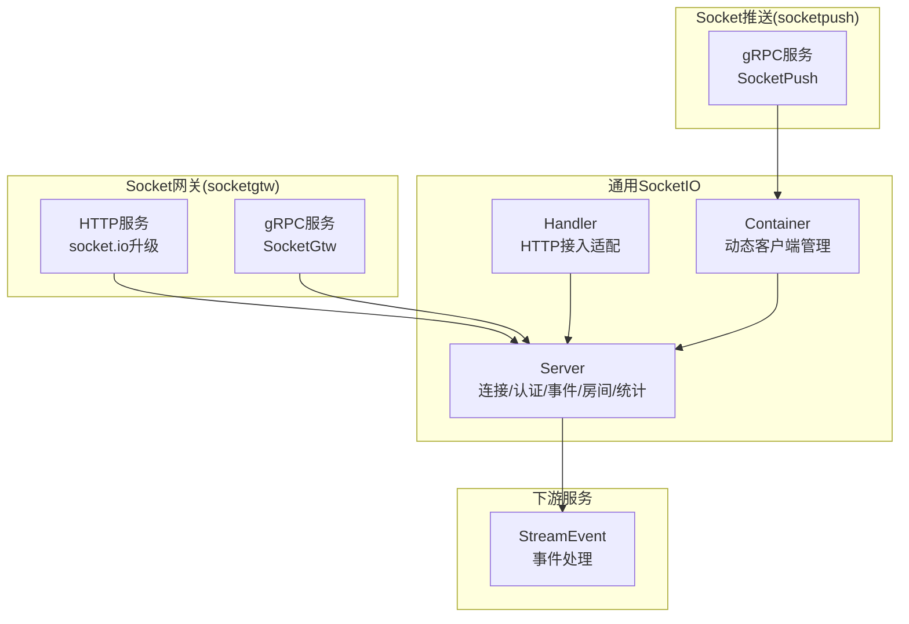
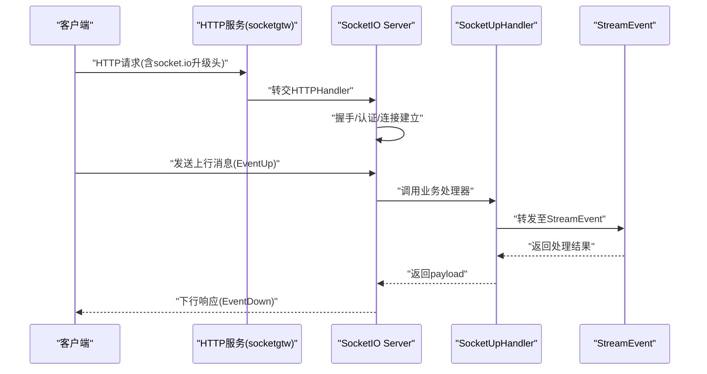
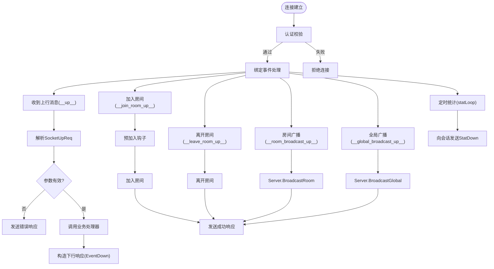
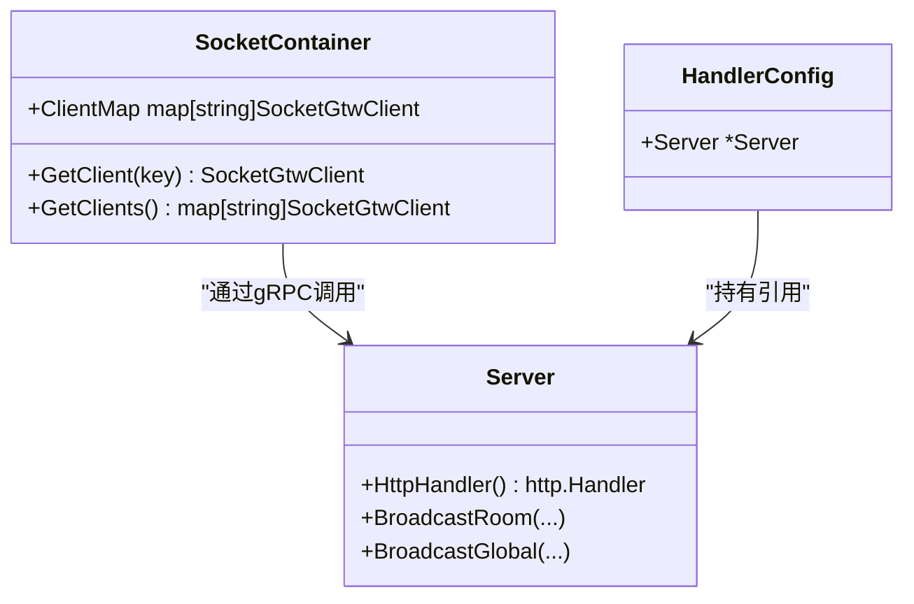
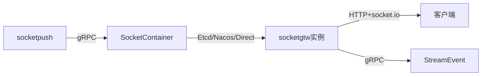

# SocketIO服务器

<cite>
**本文引用的文件**
- [common/socketiox/server.go](file://common/socketiox/server.go)
- [common/socketiox/handler.go](file://common/socketiox/handler.go)
- [common/socketiox/container.go](file://common/socketiox/container.go)
- [socketapp/socketgtw/socketgtw.go](file://socketapp/socketgtw/socketgtw.go)
- [socketapp/socketgtw/etc/socketgtw.yaml](file://socketapp/socketgtw/etc/socketgtw.yaml)
- [socketapp/socketpush/socketpush.go](file://socketapp/socketpush/socketpush.go)
- [socketapp/socketpush/etc/socketpush.yaml](file://socketapp/socketpush/etc/socketpush.yaml)
- [socketapp/socketgtw/internal/config/config.go](file://socketapp/socketgtw/internal/config/config.go)
- [socketapp/socketpush/internal/config/config.go](file://socketapp/socketpush/internal/config/config.go)
- [socketapp/socketgtw/internal/sockethandler/sockertuphandler.go](file://socketapp/socketgtw/internal/sockethandler/sockertuphandler.go)
- [common/socketiox/test-socketio.html](file://common/socketiox/test-socketio.html)
</cite>

## 目录
1. [简介](#简介)
2. [项目结构](#项目结构)
3. [核心组件](#核心组件)
4. [架构总览](#架构总览)
5. [详细组件分析](#详细组件分析)
6. [依赖分析](#依赖分析)
7. [性能考虑](#性能考虑)
8. [故障排除指南](#故障排除指南)
9. [结论](#结论)
10. [附录](#附录)

## 简介
本文件面向Zero-Service中的SocketIO服务器实现，系统性阐述其启动流程、连接监听机制、消息路由与广播能力、配置与网络监听设置、房间管理与会话维护、生命周期与优雅关闭、部署示例、性能监控与故障排除，以及与StreamEvent等服务的集成与扩展开发方法。目标是帮助开发者快速理解并高效运维该SocketIO基础设施。

## 项目结构
SocketIO服务器位于通用模块common/socketiox中，并通过socketapp下的socketgtw与socketpush两个应用对外提供HTTP接入与RPC推送能力：
- 通用SocketIO服务：负责连接、认证、事件分发、房间管理、统计上报与生命周期管理
- Socket网关（socketgtw）：提供HTTP服务，承载socket.io握手与升级，同时注册gRPC服务用于房间/广播操作
- Socket推送（socketpush）：提供RPC服务，供上游服务向指定房间或全局广播消息

图表来源
- [common/socketiox/server.go:314-335](file://common/socketiox/server.go#L314-L335)
- [common/socketiox/handler.go:19-40](file://common/socketiox/handler.go#L19-L40)
- [common/socketiox/container.go:30-61](file://common/socketiox/container.go#L30-L61)
- [socketapp/socketgtw/socketgtw.go:30-90](file://socketapp/socketgtw/socketgtw.go#L30-L90)
- [socketapp/socketpush/socketpush.go:27-70](file://socketapp/socketpush/socketpush.go#L27-L70)

章节来源
- [socketapp/socketgtw/socketgtw.go:30-90](file://socketapp/socketgtw/socketgtw.go#L30-L90)
- [socketapp/socketpush/socketpush.go:27-70](file://socketapp/socketpush/socketpush.go#L27-L70)
- [common/socketiox/server.go:314-335](file://common/socketiox/server.go#L314-L335)
- [common/socketiox/handler.go:19-40](file://common/socketiox/handler.go#L19-L40)
- [common/socketiox/container.go:30-61](file://common/socketiox/container.go#L30-L61)

## 核心组件
- Server：SocketIO核心服务，封装连接建立、鉴权、事件绑定、房间管理、广播、统计上报与生命周期管理
- Session：单个连接的会话抽象，提供元数据存储、房间加入/离开、下行消息发送
- Handler：HTTP层适配器，将HTTP请求转交给SocketIO内部处理
- Container：动态gRPC客户端容器，支持直连、Etcd订阅、Nacos订阅三种发现模式
- SocketUpHandler：将上行Socket消息转发至StreamEvent服务进行业务处理

章节来源
- [common/socketiox/server.go:119-232](file://common/socketiox/server.go#L119-L232)
- [common/socketiox/server.go:299-312](file://common/socketiox/server.go#L299-L312)
- [common/socketiox/handler.go:19-40](file://common/socketiox/handler.go#L19-L40)
- [common/socketiox/container.go:30-61](file://common/socketiox/container.go#L30-L61)
- [socketapp/socketgtw/internal/sockethandler/sockertuphandler.go:13-44](file://socketapp/socketgtw/internal/sockethandler/sockertuphandler.go#L13-L44)

## 架构总览
SocketIO服务器采用“HTTP接入 + 内部SocketIO引擎 + 多种发现与广播”的架构：
- HTTP接入：socketgtw通过REST服务暴露socket.io路径，完成WebSocket升级
- SocketIO引擎：Server在连接建立后绑定认证、连接、断开、房间、广播等事件
- 广播与推送：socketpush通过gRPC接收上层请求，借助Container选择目标Socket网关，执行房间/全局广播或会话踢出
- 事件处理：上行消息可由SocketUpHandler转发至StreamEvent服务，实现业务逻辑解耦

图表来源
- [socketapp/socketgtw/socketgtw.go:48-61](file://socketapp/socketgtw/socketgtw.go#L48-L61)
- [common/socketiox/server.go:469-531](file://common/socketiox/server.go#L469-L531)
- [socketapp/socketgtw/internal/sockethandler/sockertuphandler.go:23-44](file://socketapp/socketgtw/internal/sockethandler/sockertuphandler.go#L23-L44)

## 详细组件分析

### Server：连接监听与消息路由
- 连接建立与认证
  - OnAuthentication：基于token验证，支持简单校验器与带声明的校验器
  - OnConnection：建立Session，注入上下文元数据（如用户ID、设备ID等），触发连接钩子加载初始房间
- 事件绑定
  - __connection__/__disconnect__：内部保留事件，用于连接生命周期管理
  - __up__：上行消息入口，解析SocketUpReq并调用业务处理器
  - __join_room_up__/__leave_room_up__：房间加入/离开，支持预加入钩子
  - __room_broadcast_up__/__global_broadcast_up__：房间/全局广播入口，调用Server广播方法
  - 自定义事件：遍历注册的EventHandlers，对非保留事件进行异步安全处理
- 下行消息与错误响应
  - ReplyEventDown：构造标准响应结构，支持Ack或回发
  - sendErrorResponse：参数错误/解析失败时统一返回
- 广播与统计
  - BroadcastRoom/BroadcastGlobal：基于房间/全局广播，禁止使用保留事件名
  - statLoop：周期性向每个会话发送StatDown，包含会话ID、房间列表、网络参数与元数据
- 会话管理
  - GetSession/GetSessionByKey：按元数据键值检索会话
  - JoinRoom/LeaveRoom：直接对指定会话执行房间操作
  - Stop：优雅关闭，清理会话并停止引擎

图表来源
- [common/socketiox/server.go:337-676](file://common/socketiox/server.go#L337-L676)
- [common/socketiox/server.go:678-700](file://common/socketiox/server.go#L678-L700)
- [common/socketiox/server.go:702-740](file://common/socketiox/server.go#L702-L740)

章节来源
- [common/socketiox/server.go:337-676](file://common/socketiox/server.go#L337-L676)
- [common/socketiox/server.go:678-700](file://common/socketiox/server.go#L678-L700)
- [common/socketiox/server.go:702-740](file://common/socketiox/server.go#L702-L740)

### Session：会话与房间管理
- 元数据管理：SetMetadata仅接受字符串值，避免污染会话状态
- 房间操作：JoinRoom/LeaveRoom，内部去重与并发保护
- 下行发送：EmitDown/EmitEventDown/EmitString，统一构造下行包结构
- 关闭与校验：Close与checkSocketNil确保安全释放

章节来源
- [common/socketiox/server.go:119-232](file://common/socketiox/server.go#L119-L232)

### Handler：HTTP接入适配
- NewSocketioHandler：将Server.HttpHandler()包装为HTTP处理器
- SocketioHandler：便捷函数，直接传入Server

章节来源
- [common/socketiox/handler.go:19-40](file://common/socketiox/handler.go#L19-L40)

### Container：动态客户端容器与服务发现
- 支持三种发现模式
  - 直连：Endpoints直接配置
  - Etcd：订阅Etcd键值，增量更新客户端集合
  - Nacos：订阅服务实例，健康检查与权重过滤，周期拉取全量实例
- 最大消息大小：gRPC调用默认限制为50MB，避免超大消息导致内存压力
- 容器更新：add/remove实例时记录日志，便于运维观察

图表来源
- [common/socketiox/container.go:30-77](file://common/socketiox/container.go#L30-L77)
- [common/socketiox/handler.go:9-17](file://common/socketiox/handler.go#L9-L17)
- [common/socketiox/server.go:299-312](file://common/socketiox/server.go#L299-L312)

章节来源
- [common/socketiox/container.go:30-61](file://common/socketiox/container.go#L30-L61)
- [common/socketiox/container.go:83-154](file://common/socketiox/container.go#L83-L154)
- [common/socketiox/container.go:156-316](file://common/socketiox/container.go#L156-L316)
- [common/socketiox/handler.go:19-40](file://common/socketiox/handler.go#L19-L40)

### SocketUpHandler：上行消息处理
- 将Socket上行消息转换为StreamEvent的UpSocketMessage请求
- 返回StreamEvent处理后的payload，作为下行响应

章节来源
- [socketapp/socketgtw/internal/sockethandler/sockertuphandler.go:23-44](file://socketapp/socketgtw/internal/sockethandler/sockertuphandler.go#L23-L44)

## 依赖分析
- 服务发现与注册
  - socketgtw：可选注册到Nacos，标注gRPC端口与元数据
  - socketpush：通过zrpc配置Target或Endpoints，支持Etcd/Nacos/Direct三种模式
- gRPC拦截与日志
  - socketgtw：注册反射（开发/测试模式），添加日志拦截器
  - socketpush：添加日志拦截器
- 中间件
  - socketgtw：对socket.io路径在Upgrade阶段修正Connection头，保证升级成功

图表来源
- [socketapp/socketpush/socketpush.go:27-70](file://socketapp/socketpush/socketpush.go#L27-L70)
- [common/socketiox/container.go:35-61](file://common/socketiox/container.go#L35-L61)
- [socketapp/socketgtw/socketgtw.go:63-80](file://socketapp/socketgtw/socketgtw.go#L63-L80)

章节来源
- [socketapp/socketpush/socketpush.go:27-70](file://socketapp/socketpush/socketpush.go#L27-L70)
- [socketapp/socketgtw/socketgtw.go:48-80](file://socketapp/socketgtw/socketgtw.go#L48-L80)
- [common/socketiox/container.go:35-61](file://common/socketiox/container.go#L35-L61)

## 性能考虑
- 异步处理：所有事件处理均通过安全协程执行，避免阻塞主循环
- 统计上报：默认每分钟向会话发送一次StatDown，便于观测在线会话、房间分布与元数据
- gRPC消息限制：默认最大发送50MB，建议上层业务控制消息体积，避免内存峰值
- 房间与会话数量：通过SessionCount与GetSessionByKey进行监控与定位
- 连接升级：HTTP中间件确保socket.io升级头正确传递，减少握手失败

章节来源
- [common/socketiox/server.go:702-740](file://common/socketiox/server.go#L702-L740)
- [common/socketiox/container.go:113-118](file://common/socketiox/container.go#L113-L118)
- [common/socketiox/container.go:302-307](file://common/socketiox/container.go#L302-L307)

## 故障排除指南
- 连接失败
  - 检查token校验器是否返回true；确认握手参数中携带token
  - 查看连接钩子是否抛错导致房间加载失败
- 上行消息异常
  - 参数缺失或格式错误：查看错误响应中的Code与Msg
  - 业务处理器未注册：确认EventUp处理器是否已注册
- 房间操作失败
  - 房间名为空或非法事件名：检查EventJoinRoom/EventLeaveRoom请求
  - 预加入钩子返回错误：检查PreJoinRoomHook实现
- 广播失败
  - 房间广播/全局广播时事件名为保留名：确认EventRoomBroadcast/EventGlobalBroadcast
  - 目标Socket网关不可达：检查socketpush的发现配置与socketgtw注册状态
- 统计不一致
  - statLoop检测到会话数与Socket数不一致：关注日志提示并排查会话清理逻辑
- HTTP升级问题
  - socket.io无法升级：确认中间件已修正Connection头

章节来源
- [common/socketiox/server.go:337-676](file://common/socketiox/server.go#L337-L676)
- [common/socketiox/server.go:702-740](file://common/socketiox/server.go#L702-L740)
- [socketapp/socketgtw/socketgtw.go:48-61](file://socketapp/socketgtw/socketgtw.go#L48-L61)

## 结论
该SocketIO服务器以清晰的职责划分与完善的生命周期管理，提供了稳定可靠的连接、房间与广播能力。结合HTTP接入、gRPC广播与动态服务发现，能够满足多场景的实时通信需求。通过合理的配置与监控，可在生产环境中获得良好的稳定性与可观测性。

## 附录

### 服务器启动流程
- 加载配置：socketgtw与socketpush分别加载各自配置文件
- 初始化服务：socketgtw启动HTTP与gRPC服务，注册socket.io处理链；socketpush启动gRPC服务
- 服务注册：可选注册到Nacos，标注gRPC端口与元数据
- 启动Server：socketgtw将HTTP请求转交给Server.HttpHandler()

章节来源
- [socketapp/socketgtw/socketgtw.go:30-90](file://socketapp/socketgtw/socketgtw.go#L30-L90)
- [socketapp/socketpush/socketpush.go:27-70](file://socketapp/socketpush/socketpush.go#L27-L70)

### 配置与网络监听设置
- socketgtw.yaml
  - RpcServerConf：gRPC监听地址与超时
  - Http：HTTP监听主机、端口与超时
  - NacosConfig：可选注册配置
  - SocketMetaData：会话元数据键列表
  - StreamEventConf：StreamEvent服务发现配置
- socketpush.yaml
  - RpcServerConf：gRPC监听地址与超时
  - JwtAuth：令牌相关配置
  - NacosConfig：可选注册配置
  - SocketGtwConf：Socket网关服务发现配置

章节来源
- [socketapp/socketgtw/etc/socketgtw.yaml:1-37](file://socketapp/socketgtw/etc/socketgtw.yaml#L1-L37)
- [socketapp/socketpush/etc/socketpush.yaml:1-28](file://socketapp/socketpush/etc/socketpush.yaml#L1-L28)
- [socketapp/socketgtw/internal/config/config.go:8-27](file://socketapp/socketgtw/internal/config/config.go#L8-L27)
- [socketapp/socketpush/internal/config/config.go:5-22](file://socketapp/socketpush/internal/config/config.go#L5-L22)

### 服务器配置选项与调优要点
- 认证与上下文
  - WithTokenValidator/WithTokenValidatorWithClaims：自定义token校验与声明提取
  - WithContextKeys：从token声明中抽取元数据键
- 事件与钩子
  - WithHandler/WithEventHandlers：注册自定义事件处理器
  - WithConnectHook/WithPreJoinRoomHook/WithDisconnectHook：连接/房间/断开钩子
- 统计与性能
  - WithStatInterval：调整StatDown上报间隔
  - gRPC消息限制：MaxCallSendMsgSize默认50MB，可根据业务调整

章节来源
- [common/socketiox/server.go:258-297](file://common/socketiox/server.go#L258-L297)
- [common/socketiox/container.go:113-118](file://common/socketiox/container.go#L113-L118)
- [common/socketiox/container.go:302-307](file://common/socketiox/container.go#L302-L307)

### 生命周期管理、优雅关闭与重启策略
- Stop：关闭stopChan、清空会话并调用Close，停止统计循环
- 优雅关闭：socketpush在defer中Stop，socketgtw使用serviceGroup统一管理
- 重启策略：建议通过编排系统（如Kubernetes）进行滚动重启，确保连接迁移与会话恢复

章节来源
- [common/socketiox/server.go:802-809](file://common/socketiox/server.go#L802-L809)
- [socketapp/socketpush/socketpush.go:65-68](file://socketapp/socketpush/socketpush.go#L65-L68)
- [socketapp/socketgtw/socketgtw.go:83-89](file://socketapp/socketgtw/socketgtw.go#L83-L89)

### 部署示例
- socketgtw
  - 启动命令：指定配置文件，启动HTTP与gRPC服务，可选注册Nacos
  - 监听：HTTP端口用于socket.io升级；gRPC端口用于房间/广播
- socketpush
  - 启动命令：指定配置文件，启动gRPC服务，配置Socket网关发现
  - 广播：通过BroadcastRoom/BroadcastGlobal/KickSession等接口进行推送

章节来源
- [socketapp/socketgtw/socketgtw.go:28-90](file://socketapp/socketgtw/socketgtw.go#L28-L90)
- [socketapp/socketpush/socketpush.go:25-70](file://socketapp/socketpush/socketpush.go#L25-L70)

### 性能监控指标
- 会话总数：SessionCount
- 会话详情：StatDown（SId、Rooms、Nps、MetaData、RoomLoadError）
- 日志级别：info及以上，关键事件记录Statf/WithFields

章节来源
- [common/socketiox/server.go:749-753](file://common/socketiox/server.go#L749-L753)
- [common/socketiox/server.go:722-734](file://common/socketiox/server.go#L722-L734)

### 故障排除清单
- 连接：确认token校验、握手头修正、连接钩子
- 事件：确认事件名合法、处理器注册、Ack回调
- 房间：确认房间名、预加入钩子、会话存在
- 广播：确认事件名非保留、目标可用、消息大小限制
- 统计：核对会话数与Socket数一致性

章节来源
- [common/socketiox/server.go:337-676](file://common/socketiox/server.go#L337-L676)
- [common/socketiox/server.go:702-740](file://common/socketiox/server.go#L702-L740)

### 与其他服务的集成方式
- StreamEvent：通过SocketUpHandler将上行消息转发至StreamEvent，实现业务解耦
- Socket网关：socketpush通过Container选择目标socketgtw实例，执行房间/全局广播或会话踢出

章节来源
- [socketapp/socketgtw/internal/sockethandler/sockertuphandler.go:13-44](file://socketapp/socketgtw/internal/sockethandler/sockertuphandler.go#L13-L44)
- [common/socketiox/container.go:30-61](file://common/socketiox/container.go#L30-L61)

### 扩展开发指南
- 新增自定义事件
  - 使用WithHandler注册事件处理器，注意不要覆盖保留事件名
- 会话元数据
  - 在连接钩子中设置元数据键值，便于按用户/设备检索会话
- 房间策略
  - 通过PreJoinRoomHook实现权限校验或业务前置逻辑
- 广播策略
  - 使用BroadcastRoom/BroadcastGlobal或socketpush的RPC接口，结合服务发现选择目标实例

章节来源
- [common/socketiox/server.go:258-297](file://common/socketiox/server.go#L258-L297)
- [common/socketiox/server.go:380-390](file://common/socketiox/server.go#L380-L390)
- [common/socketiox/server.go:418-427](file://common/socketiox/server.go#L418-L427)

### 测试与验证
- 提供前端测试页面，支持连接、加入/离开房间、上行消息、房间/全局广播等交互
- 可通过页面日志观察事件流转与响应

章节来源
- [common/socketiox/test-socketio.html:1-800](file://common/socketiox/test-socketio.html#L1-L800)