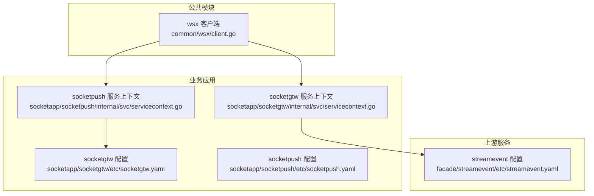
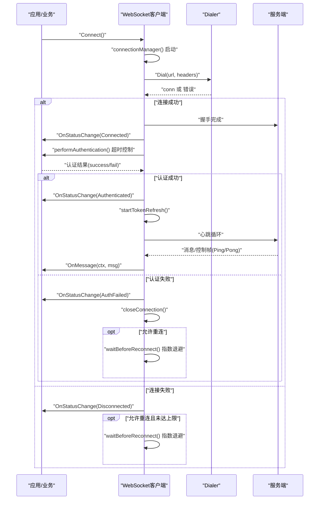
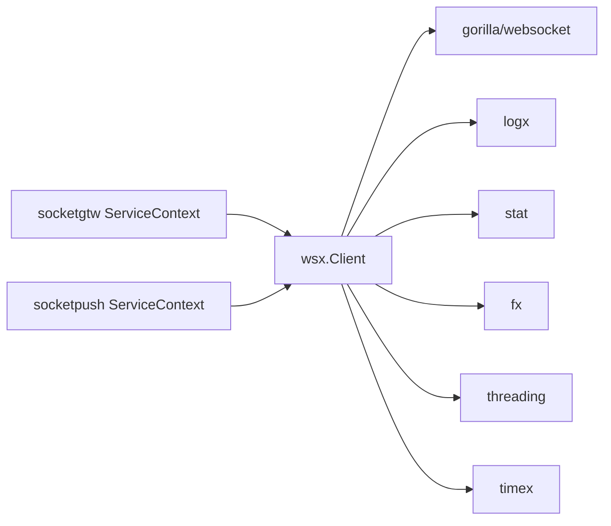

# WebSocket客户端

<cite>
**本文引用的文件**
- [common/wsx/client.go](file://common/wsx/client.go)
- [socketapp/socketgtw/etc/socketgtw.yaml](file://socketapp/socketgtw/etc/socketgtw.yaml)
- [socketapp/socketpush/etc/socketpush.yaml](file://socketapp/socketpush/etc/socketpush.yaml)
- [socketapp/socketgtw/internal/svc/servicecontext.go](file://socketapp/socketgtw/internal/svc/servicecontext.go)
- [socketapp/socketpush/internal/svc/servicecontext.go](file://socketapp/socketpush/internal/svc/servicecontext.go)
- [facade/streamevent/etc/streamevent.yaml](file://facade/streamevent/etc/streamevent.yaml)
</cite>

## 目录
1. [简介](#简介)
2. [项目结构](#项目结构)
3. [核心组件](#核心组件)
4. [架构总览](#架构总览)
5. [详细组件分析](#详细组件分析)
6. [依赖分析](#依赖分析)
7. [性能考虑](#性能考虑)
8. [故障排查指南](#故障排查指南)
9. [结论](#结论)
10. [附录](#附录)

## 简介
本技术文档面向Zero-Service中的WebSocket客户端实现，系统性阐述其连接建立、消息收发、认证与心跳、重连策略、生命周期管理、异常处理与资源清理机制。同时提供配置项说明、使用示例路径、服务端对接要点以及性能优化建议，并给出常见问题排查与调试方法。

## 项目结构
WebSocket客户端位于公共模块common/wsx，配套有socketapp侧的服务上下文与配置文件，用于演示如何在真实业务中集成该客户端。



图表来源
- [common/wsx/client.go:1-895](file://common/wsx/client.go#L1-L895)
- [socketapp/socketgtw/etc/socketgtw.yaml:1-37](file://socketapp/socketgtw/etc/socketgtw.yaml#L1-L37)
- [socketapp/socketpush/etc/socketpush.yaml:1-28](file://socketapp/socketpush/etc/socketpush.yaml#L1-L28)
- [socketapp/socketgtw/internal/svc/servicecontext.go:1-134](file://socketapp/socketgtw/internal/svc/servicecontext.go#L1-L134)
- [socketapp/socketpush/internal/svc/servicecontext.go:1-19](file://socketapp/socketpush/internal/svc/servicecontext.go#L1-L19)
- [facade/streamevent/etc/streamevent.yaml:1-28](file://facade/streamevent/etc/streamevent.yaml#L1-L28)

章节来源
- [common/wsx/client.go:1-895](file://common/wsx/client.go#L1-L895)
- [socketapp/socketgtw/etc/socketgtw.yaml:1-37](file://socketapp/socketgtw/etc/socketgtw.yaml#L1-L37)
- [socketapp/socketpush/etc/socketpush.yaml:1-28](file://socketapp/socketpush/etc/socketpush.yaml#L1-L28)
- [socketapp/socketgtw/internal/svc/servicecontext.go:1-134](file://socketapp/socketgtw/internal/svc/servicecontext.go#L1-L134)
- [socketapp/socketpush/internal/svc/servicecontext.go:1-19](file://socketapp/socketpush/internal/svc/servicecontext.go#L1-L19)
- [facade/streamevent/etc/streamevent.yaml:1-28](file://facade/streamevent/etc/streamevent.yaml#L1-L28)

## 核心组件
- 客户端接口与实现
  - 接口定义：提供Connect、Send、SendJSON、Close、IsConnected、IsAuthenticated、RefreshToken等能力。
  - 实现类：封装连接管理、认证、心跳、重连、Token刷新、消息接收与处理、上下文与并发控制。
- 配置与选项
  - Config：URL、心跳间隔、重连间隔、最大重连次数、拨号超时、Token刷新间隔、认证超时、指数退避开关、最大重连间隔。
  - ClientOptions：Headers、Dialer、OnMessage、OnStatusChange、OnRefreshToken、OnHeartbeat、ReconnectOnAuthFailed、ReconnectOnTokenExpire。
- 状态模型
  - 连接状态枚举：Disconnected、Connecting、Connected、Authenticated、AuthFailed、Reconnecting。
- 并发与生命周期
  - 使用原子变量与互斥锁保证运行状态与连接状态一致性；使用WaitGroup与context协调goroutine退出。
- 错误处理与日志
  - 细粒度错误分类与记录；对握手响应体进行安全读取；区分正常关闭与异常错误。

章节来源
- [common/wsx/client.go:65-142](file://common/wsx/client.go#L65-L142)
- [common/wsx/client.go:83-94](file://common/wsx/client.go#L83-L94)
- [common/wsx/client.go:96-107](file://common/wsx/client.go#L96-L107)
- [common/wsx/client.go:33-63](file://common/wsx/client.go#L33-L63)

## 架构总览
WebSocket客户端以“连接管理器”为核心，贯穿拨号、认证、心跳、消息接收、Token刷新与重连等全流程。客户端通过回调注入业务行为（消息处理、状态变更、认证、心跳内容、Token刷新），并通过上下文与超时控制保障可取消与可观测性。



图表来源
- [common/wsx/client.go:386-445](file://common/wsx/client.go#L386-L445)
- [common/wsx/client.go:538-571](file://common/wsx/client.go#L538-L571)
- [common/wsx/client.go:640-668](file://common/wsx/client.go#L640-L668)
- [common/wsx/client.go:776-823](file://common/wsx/client.go#L776-L823)

## 详细组件分析

### 客户端类图
```mermaid
classDiagram
class Client {
+Connect() error
+Send(message []byte) error
+SendJSON(data interface{}) error
+Close() error
+IsConnected() bool
+IsAuthenticated() bool
+RefreshToken() error
}
class Config {
+string URL
+time.Duration HeartbeatInterval
+time.Duration ReconnectInterval
+int ReconnectMaxRetries
+time.Duration DialTimeout
+time.Duration TokenRefreshInterval
+time.Duration AuthTimeout
+bool ReconnectBackoff
+time.Duration MaxReconnectInterval
}
class ClientOptions {
+http.Header Headers
+Dialer *websocket.Dialer
+OnMessage(ctx, msg) error
+OnStatusChange(ctx, status, err) void
+OnRefreshToken(ctx) (bool, error)
+OnHeartbeat(ctx) ([]byte, error)
+bool ReconnectOnAuthFailed
+bool ReconnectOnTokenExpire
}
class ConnStatus {
<<enum>>
Disconnected
Connecting
Connected
Authenticated
AuthFailed
Reconnecting
}
class client {
-*websocket.Conn conn
-string url
-*websocket.Dialer dialer
-http.Header headers
-func onMessage
-func onStatusChange
-func onRefreshToken
-func onHeartbeat
-context ctx
-context.CancelFunc cancel
-sync.WaitGroup wg
-sync.Mutex mu
-atomic running
-atomic authenticated
-time.Ticker tokenRefreshTicker
-chan struct connClosed
}
Client <|.. client
client --> Config : "组合"
client --> ClientOptions : "组合"
client --> ConnStatus : "使用"
```

图表来源
- [common/wsx/client.go:65-142](file://common/wsx/client.go#L65-L142)
- [common/wsx/client.go:83-107](file://common/wsx/client.go#L83-L107)
- [common/wsx/client.go:33-63](file://common/wsx/client.go#L33-L63)

章节来源
- [common/wsx/client.go:65-142](file://common/wsx/client.go#L65-L142)
- [common/wsx/client.go:83-107](file://common/wsx/client.go#L83-L107)
- [common/wsx/client.go:33-63](file://common/wsx/client.go#L33-L63)

### 连接建立与握手
- 拨号与握手
  - 支持自定义Dialer，默认设置HandshakeTimeout；连接成功后设置PongHandler刷新读超时。
  - 连接建立后启动receiveLoop与heartbeatLoop两个子协程。
- 握手错误处理
  - 对响应体进行安全读取并记录，避免nil响应导致panic。
- 状态流转
  - 成功连接后进入Connected状态；随后执行认证流程。

章节来源
- [common/wsx/client.go:448-487](file://common/wsx/client.go#L448-L487)
- [common/wsx/client.go:489-508](file://common/wsx/client.go#L489-L508)
- [common/wsx/client.go:386-445](file://common/wsx/client.go#L386-L445)

### 认证与超时控制
- 认证流程
  - 在固定超时时间内调用OnRefreshToken(ctx)完成认证；支持外部取消。
  - 认证成功后进入Authenticated状态，启动Token刷新循环；失败则进入AuthFailed状态并按策略决定是否重连。
- 超时与取消
  - 使用fx.DoWithTimeout与ctx组合，确保超时与取消一致。

章节来源
- [common/wsx/client.go:538-571](file://common/wsx/client.go#L538-L571)
- [common/wsx/client.go:573-577](file://common/wsx/client.go#L573-L577)

### 心跳与保活
- 心跳策略
  - 默认使用PingMessage；可通过OnHeartbeat(ctx)自定义心跳内容。
  - PongHandler刷新读超时，读超时为2倍心跳间隔，用于检测静默断开。
- 心跳循环
  - 周期性触发，支持ctx与连接关闭信号退出。

章节来源
- [common/wsx/client.go:640-668](file://common/wsx/client.go#L640-L668)
- [common/wsx/client.go:670-697](file://common/wsx/client.go#L670-L697)
- [common/wsx/client.go:498-502](file://common/wsx/client.go#L498-L502)
- [common/wsx/client.go:776-823](file://common/wsx/client.go#L776-L823)

### 消息收发与编解码
- 发送
  - Send：发送文本帧，设置写超时为心跳间隔。
  - SendJSON：序列化为JSON后发送，区分序列化错误与传输错误。
- 接收
  - receiveLoop循环读取消息，Ping/Pong交由底层处理；业务消息通过OnMessage(ctx, msg)异步处理，使用GoSafe包装，避免阻塞。
  - 读超时设置为2倍心跳间隔；对正常关闭与异常错误分别处理。
- 编解码
  - 文本帧与JSON序列化由gorilla/websocket提供；上层通过OnMessage处理业务数据。

章节来源
- [common/wsx/client.go:327-384](file://common/wsx/client.go#L327-L384)
- [common/wsx/client.go:776-823](file://common/wsx/client.go#L776-L823)

### 重连策略与指数退避
- 重连条件
  - 未达到最大重连次数或不限制（max=0）时允许重连；支持指数退避与最大间隔限制。
- 等待策略
  - waitBeforeReconnect根据当前重连次数计算等待时间，支持ctx取消与timer排空。
- 状态通知
  - 重连开始时触发OnStatusChange(StatusReconnecting)。

章节来源
- [common/wsx/client.go:579-633](file://common/wsx/client.go#L579-L633)
- [common/wsx/client.go:581-596](file://common/wsx/client.go#L581-L596)
- [common/wsx/client.go:598-633](file://common/wsx/client.go#L598-L633)

### Token刷新与过期处理
- 刷新循环
  - startTokenRefresh按TokenRefreshInterval周期调用OnRefreshToken(ctx)，成功则继续，失败则记录错误。
- 过期策略
  - 若刷新失败且ReconnectOnTokenExpire为true，则主动关闭连接触发重连。

章节来源
- [common/wsx/client.go:699-763](file://common/wsx/client.go#L699-L763)
- [common/wsx/client.go:765-774](file://common/wsx/client.go#L765-L774)

### 生命周期管理与资源清理
- 关闭流程
  - 标记停止状态、取消ctx、发送CloseMessage、关闭连接、停止Token刷新、通知连接关闭、等待所有goroutine退出、最终状态通知。
- 并发安全
  - 使用原子变量与互斥锁保护运行状态与连接状态；safeClose避免重复关闭通道。

章节来源
- [common/wsx/client.go:825-866](file://common/wsx/client.go#L825-L866)
- [common/wsx/client.go:887-894](file://common/wsx/client.go#L887-L894)

### 状态查询与健康检查
- IsConnected：判断物理连接存在且运行中。
- IsAuthenticated：判断已认证且连接存在。
- 状态枚举与字符串化：便于日志与监控展示。

章节来源
- [common/wsx/client.go:868-884](file://common/wsx/client.go#L868-L884)
- [common/wsx/client.go:45-63](file://common/wsx/client.go#L45-L63)

## 依赖分析
- 外部依赖
  - gorilla/websocket：WebSocket协议栈（握手、帧处理、Ping/Pong、Close）。
  - go-zero生态：logx、stat、fx、timex、threading、core/cryptor。
- 内部依赖
  - 业务侧通过servicecontext注入客户端所需回调（如OnRefreshToken、OnMessage等），并在配置中指定目标服务地址与超时。



图表来源
- [common/wsx/client.go:3-21](file://common/wsx/client.go#L3-L21)
- [socketapp/socketgtw/internal/svc/servicecontext.go:1-134](file://socketapp/socketgtw/internal/svc/servicecontext.go#L1-L134)
- [socketapp/socketpush/internal/svc/servicecontext.go:1-19](file://socketapp/socketpush/internal/svc/servicecontext.go#L1-L19)

章节来源
- [common/wsx/client.go:3-21](file://common/wsx/client.go#L3-L21)
- [socketapp/socketgtw/internal/svc/servicecontext.go:1-134](file://socketapp/socketgtw/internal/svc/servicecontext.go#L1-L134)
- [socketapp/socketpush/internal/svc/servicecontext.go:1-19](file://socketapp/socketpush/internal/svc/servicecontext.go#L1-L19)

## 性能考虑
- 心跳与读超时
  - 读超时设为2倍心跳间隔，有助于快速发现静默断开；心跳间隔应结合网络RTT与业务负载权衡。
- 指数退避
  - 合理设置基础重连间隔与最大间隔，避免雪崩式重连；当ReconnectBackoff为true时，等待时间为base*2^attempt，不超过MaxReconnectInterval。
- 并发与背压
  - OnMessage使用GoSafe异步处理，避免阻塞接收循环；若业务处理耗时较长，建议在回调内做限流或队列化。
- 序列化与写超时
  - SendJSON先序列化再发送，序列化错误与发送错误分开处理，减少不必要的重连。
- 上下文与取消
  - 所有长时间等待（重连、心跳、Token刷新、接收）均支持ctx取消，避免资源泄露。

[本节为通用指导，不直接分析具体文件]

## 故障排查指南
- 常见症状与定位
  - 连接失败：查看握手错误与响应体内容；确认URL、Headers、DialTimeout配置。
  - 认证失败：检查OnRefreshToken实现与AuthTimeout；关注AuthFailed状态与重连策略。
  - 心跳失败：检查OnHeartbeat实现与网络质量；确认PongHandler是否生效。
  - 消息堆积：检查OnMessage处理耗时与并发度；必要时引入队列或限速。
  - 重连风暴：调整指数退避参数与最大重连间隔；限制最大重连次数。
- 日志与指标
  - 使用logx输出关键事件；利用stat.Metrics记录丢弃与处理耗时。
- 资源清理
  - 确保Close被调用；检查wg.Wait是否阻塞；验证safeClose避免重复关闭。

章节来源
- [common/wsx/client.go:448-487](file://common/wsx/client.go#L448-L487)
- [common/wsx/client.go:538-571](file://common/wsx/client.go#L538-L571)
- [common/wsx/client.go:640-668](file://common/wsx/client.go#L640-L668)
- [common/wsx/client.go:776-823](file://common/wsx/client.go#L776-L823)
- [common/wsx/client.go:825-866](file://common/wsx/client.go#L825-L866)

## 结论
该WebSocket客户端在零拷贝、低侵入的前提下，提供了完善的连接管理、认证、心跳、重连、Token刷新与生命周期控制能力。通过回调注入与配置化，可在不同业务场景灵活适配。建议在生产环境中合理设置心跳与重连参数，完善日志与指标埋点，并在业务回调中做好限流与异常隔离。

[本节为总结，不直接分析具体文件]

## 附录

### 配置项与参数说明
- Config
  - URL：服务端WebSocket地址
  - HeartbeatInterval：心跳间隔
  - ReconnectInterval：重连基础间隔
  - ReconnectMaxRetries：最大重连次数（0表示无限）
  - DialTimeout：拨号超时
  - TokenRefreshInterval：Token刷新周期
  - AuthTimeout：认证超时
  - ReconnectBackoff：是否启用指数退避
  - MaxReconnectInterval：最大重连间隔
- ClientOptions
  - Headers：HTTP头（用于握手）
  - Dialer：自定义拨号器
  - OnMessage：消息回调（带ctx）
  - OnStatusChange：状态变更回调（带ctx）
  - OnRefreshToken：认证/刷新回调（带ctx）
  - OnHeartbeat：自定义心跳内容回调（带ctx）
  - ReconnectOnAuthFailed：认证失败是否重连
  - ReconnectOnTokenExpire：Token过期是否重连

章节来源
- [common/wsx/client.go:83-94](file://common/wsx/client.go#L83-L94)
- [common/wsx/client.go:96-107](file://common/wsx/client.go#L96-L107)

### 使用示例与对接指引
- 示例路径（不展示代码内容，仅提供定位）
  - 客户端构造与回调注入：[common/wsx/client.go:215-275](file://common/wsx/client.go#L215-L275)
  - 发送消息：[common/wsx/client.go:327-384](file://common/wsx/client.go#L327-L384)
  - 关闭客户端：[common/wsx/client.go:825-866](file://common/wsx/client.go#L825-L866)
- 业务侧集成（socketgtw）
  - 服务上下文构建与回调注入：[socketapp/socketgtw/internal/svc/servicecontext.go:24-133](file://socketapp/socketgtw/internal/svc/servicecontext.go#L24-L133)
  - 配置文件（包含上游streamevent地址等）：[socketapp/socketgtw/etc/socketgtw.yaml:1-37](file://socketapp/socketgtw/etc/socketgtw.yaml#L1-L37)
- 业务侧集成（socketpush）
  - 服务上下文构建与回调注入：[socketapp/socketpush/internal/svc/servicecontext.go:13-18](file://socketapp/socketpush/internal/svc/servicecontext.go#L13-L18)
  - 配置文件（包含上游socketgtw地址等）：[socketapp/socketpush/etc/socketpush.yaml:1-28](file://socketapp/socketpush/etc/socketpush.yaml#L1-L28)
- 上游服务配置（streamevent）
  - 配置文件：[facade/streamevent/etc/streamevent.yaml:1-28](file://facade/streamevent/etc/streamevent.yaml#L1-L28)

### 服务端对接要点
- 握手阶段
  - 确认Headers中包含必要的鉴权字段（如Authorization）。
- 认证阶段
  - OnRefreshToken需在AuthTimeout内返回认证结果；失败时客户端会按策略重连。
- 心跳与保活
  - 服务端需正确处理Ping/Pong；客户端会刷新读超时，避免因静默断开导致的假死。
- 消息处理
  - 服务端应保证消息可被客户端OnMessage正确解析；避免发送过大消息导致写超时。

章节来源
- [common/wsx/client.go:448-487](file://common/wsx/client.go#L448-L487)
- [common/wsx/client.go:538-571](file://common/wsx/client.go#L538-L571)
- [common/wsx/client.go:640-668](file://common/wsx/client.go#L640-L668)
- [socketapp/socketgtw/internal/svc/servicecontext.go:24-133](file://socketapp/socketgtw/internal/svc/servicecontext.go#L24-L133)
- [socketapp/socketpush/internal/svc/servicecontext.go:13-18](file://socketapp/socketpush/internal/svc/servicecontext.go#L13-L18)