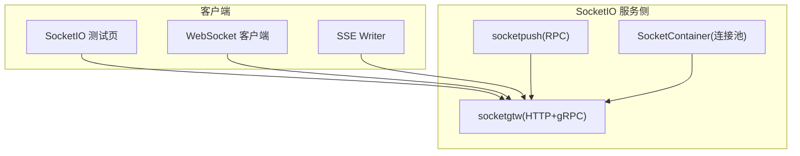
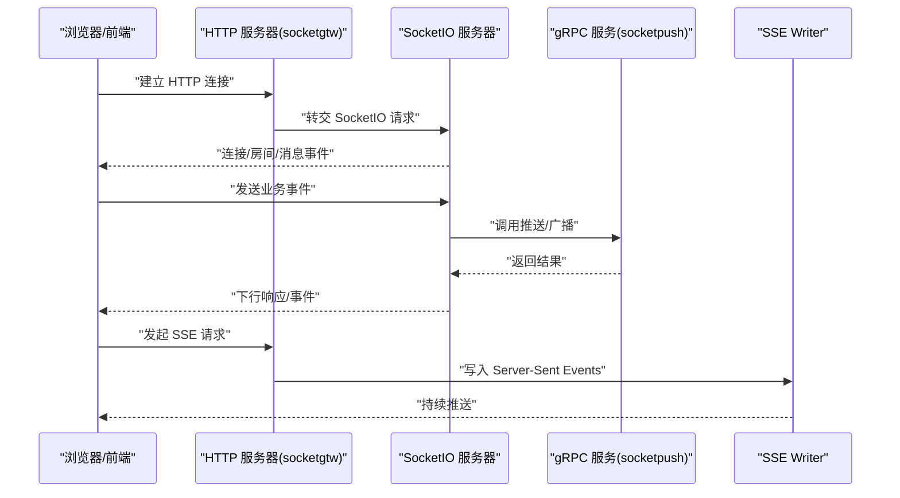
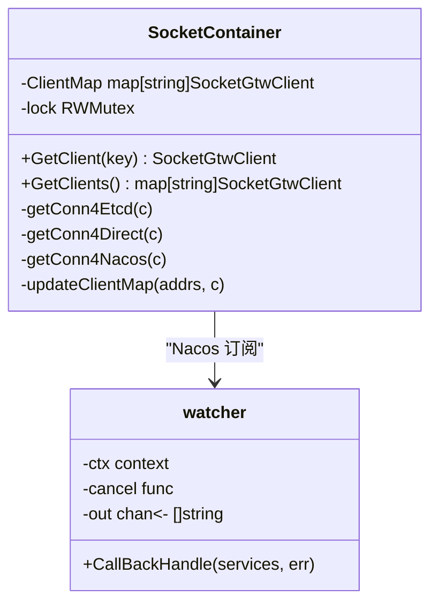
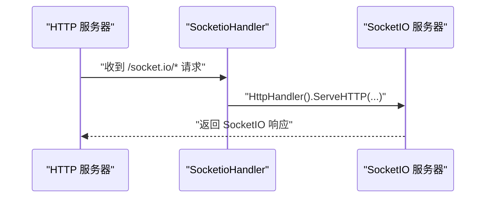
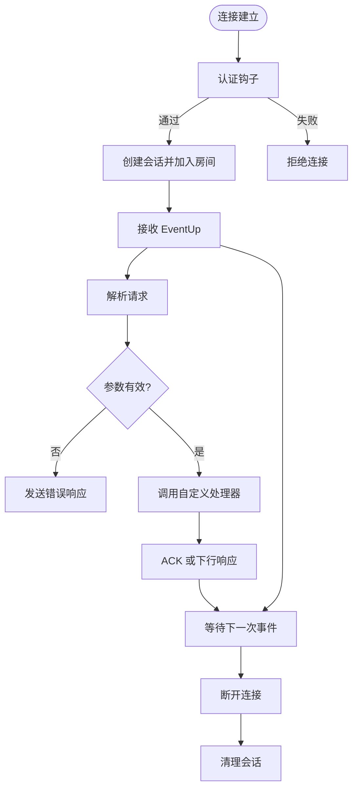
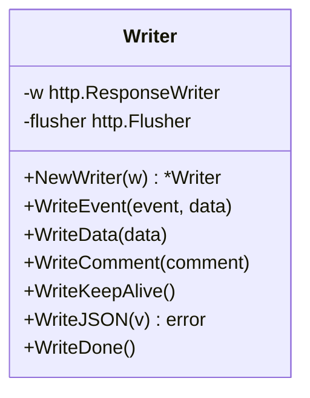
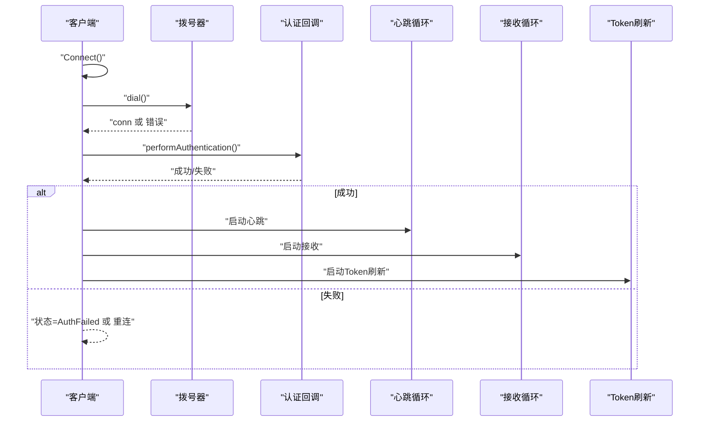
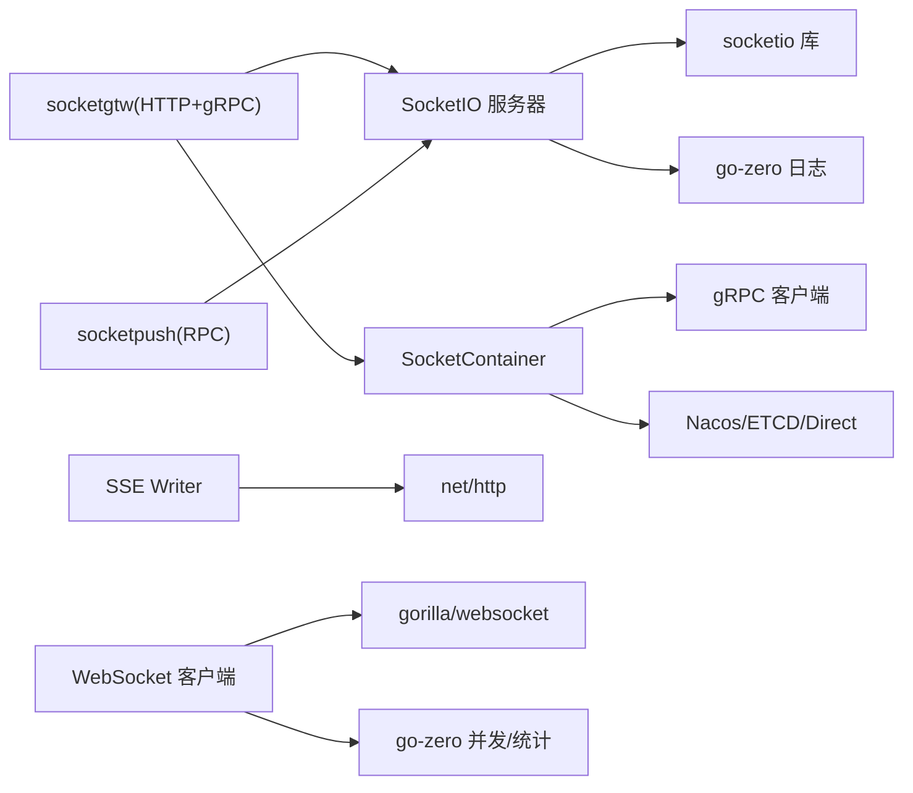

# 通信工具

<cite>
**本文引用的文件**
- [common/socketiox/container.go](file://common/socketiox/container.go)
- [common/socketiox/handler.go](file://common/socketiox/handler.go)
- [common/socketiox/server.go](file://common/socketiox/server.go)
- [common/ssex/writer.go](file://common/ssex/writer.go)
- [common/wsx/client.go](file://common/wsx/client.go)
- [common/socketiox/test-socketio.html](file://common/socketiox/test-socketio.html)
- [aiapp/ssegtw/ssegtw.go](file://aiapp/ssegtw/ssegtw.go)
- [aiapp/ssegtw/etc/ssegtw.yaml](file://aiapp/ssegtw/etc/ssegtw.yaml)
- [socketapp/socketgtw/socketgtw.go](file://socketapp/socketgtw/socketgtw.go)
- [socketapp/socketgtw/etc/socketgtw.yaml](file://socketapp/socketgtw/etc/socketgtw.yaml)
- [socketapp/socketpush/socketpush.go](file://socketapp/socketpush/socketpush.go)
- [socketapp/socketpush/etc/socketpush.yaml](file://socketapp/socketpush/etc/socketpush.yaml)
</cite>

## 目录
1. [简介](#简介)
2. [项目结构](#项目结构)
3. [核心组件](#核心组件)
4. [架构总览](#架构总览)
5. [详细组件分析](#详细组件分析)
6. [依赖分析](#依赖分析)
7. [性能考虑](#性能考虑)
8. [故障排查指南](#故障排查指南)
9. [结论](#结论)
10. [附录](#附录)

## 简介
本文件面向 Zero-Service 的通信工具模块，系统性梳理并解释以下关键能力与组件：
- SocketIO 容器管理工具：动态发现、连接池管理、Nacos/ETCD/Direct 多种接入方式
- SocketIO 处理器：HTTP 层适配与请求转发
- SocketIO 服务器：连接生命周期、房间管理、事件分发、统计上报
- SSE Writer：Server-Sent Events 写入器，支持事件、数据、心跳与流式输出
- WebSocket 客户端：连接管理、认证、心跳、重连、Token 刷新、消息收发与状态监控

同时给出典型使用场景、最佳实践与排障建议，帮助开发者快速集成与稳定运行。

## 项目结构
围绕通信工具的相关目录与文件如下：
- common/socketiox：SocketIO 容器、处理器、服务器实现
- common/ssex：SSE Writer
- common/wsx：WebSocket 客户端
- socketapp/socketgtw：SocketIO 网关服务（HTTP + gRPC）
- socketapp/socketpush：Socket 推送 RPC 服务
- aiapp/ssegtw：SSE 网关服务
- 示例页面：common/socketiox/test-socketio.html

**图表来源**
- [socketapp/socketgtw/socketgtw.go:30-90](file://socketapp/socketgtw/socketgtw.go#L30-L90)
- [socketapp/socketpush/socketpush.go:27-68](file://socketapp/socketpush/socketpush.go#L27-L68)
- [common/socketiox/container.go:35-61](file://common/socketiox/container.go#L35-L61)
- [common/ssex/writer.go:15-79](file://common/ssex/writer.go#L15-L79)
- [common/wsx/client.go:208-275](file://common/wsx/client.go#L208-L275)
- [common/socketiox/test-socketio.html:1-800](file://common/socketiox/test-socketio.html#L1-L800)

**章节来源**
- [socketapp/socketgtw/socketgtw.go:30-90](file://socketapp/socketgtw/socketgtw.go#L30-L90)
- [socketapp/socketpush/socketpush.go:27-68](file://socketapp/socketpush/socketpush.go#L27-L68)
- [aiapp/ssegtw/ssegtw.go:26-59](file://aiapp/ssegtw/ssegtw.go#L26-L59)

## 核心组件
- SocketIO 容器管理工具：支持直连、ETCD 订阅、Nacos 订阅三种模式，动态维护 gRPC 客户端集合，按地址切片限制规模，保障高可用与弹性扩缩容
- SocketIO 处理器：将 HTTP 请求转交 SocketIO 服务器处理，校验必要依赖
- SocketIO 服务器：内置认证、连接钩子、房间管理、全局/房间广播、统计上报、会话元数据管理
- SSE Writer：封装 SSE 写入流程，支持事件名、纯数据、注释、心跳、JSON 与流结束标记
- WebSocket 客户端：连接生命周期管理、认证、心跳、指数退避重连、Token 刷新、消息收发与状态回调

**章节来源**
- [common/socketiox/container.go:35-61](file://common/socketiox/container.go#L35-L61)
- [common/socketiox/handler.go:19-41](file://common/socketiox/handler.go#L19-L41)
- [common/socketiox/server.go:314-335](file://common/socketiox/server.go#L314-L335)
- [common/ssex/writer.go:15-79](file://common/ssex/writer.go#L15-L79)
- [common/wsx/client.go:208-275](file://common/wsx/client.go#L208-L275)

## 架构总览
SocketIO 与 SSE/WebSocket 在 Zero-Service 中的典型交互路径如下：

**图表来源**
- [socketapp/socketgtw/socketgtw.go:48-61](file://socketapp/socketgtw/socketgtw.go#L48-L61)
- [common/socketiox/server.go:337-676](file://common/socketiox/server.go#L337-L676)
- [common/ssex/writer.go:24-79](file://common/ssex/writer.go#L24-L79)
- [socketapp/socketpush/socketpush.go:37-43](file://socketapp/socketpush/socketpush.go#L37-L43)

## 详细组件分析

### SocketIO 容器管理工具
- 功能要点
  - 支持直连、ETCD 订阅、Nacos 订阅三种接入方式，自动维护客户端集合
  - 按地址切片限制客户端数量，避免过度膨胀
  - Nacos 订阅回调与周期拉取，保证实例变更及时生效
  - 健康实例过滤与 gRPC 端口校验，确保可用性
- 关键行为
  - MustNewPubContainer：根据配置选择接入方式并初始化
  - getConn4Etcd/getConn4Direct/getConn4Nacos：分别处理不同注册中心/直连
  - updateClientMap：增删客户端并记录日志
  - extractHealthyGRPCInstances：筛选健康实例
  - subset：随机采样，降低抖动影响
- 使用建议
  - 生产环境推荐 Nacos/ETCD，结合健康检查与限流
  - 控制订阅粒度与采样大小，平衡实时性与资源占用

**图表来源**
- [common/socketiox/container.go:30-61](file://common/socketiox/container.go#L30-L61)
- [common/socketiox/container.go:244-266](file://common/socketiox/container.go#L244-L266)
- [common/socketiox/container.go:267-316](file://common/socketiox/container.go#L267-L316)

**章节来源**
- [common/socketiox/container.go:35-61](file://common/socketiox/container.go#L35-L61)
- [common/socketiox/container.go:83-130](file://common/socketiox/container.go#L83-L130)
- [common/socketiox/container.go:132-154](file://common/socketiox/container.go#L132-L154)
- [common/socketiox/container.go:156-242](file://common/socketiox/container.go#L156-L242)
- [common/socketiox/container.go:267-316](file://common/socketiox/container.go#L267-L316)
- [common/socketiox/container.go:318-356](file://common/socketiox/container.go#L318-L356)

### SocketIO 处理器
- 功能要点
  - NewSocketioHandler/SocketioHandler：构建 HTTP 处理函数，将请求委派给 SocketIO 服务器
  - WithServer：注入服务器实例
- 使用方式
  - 在 HTTP 服务中注册该处理器，即可启用 SocketIO 协议

**图表来源**
- [common/socketiox/handler.go:19-41](file://common/socketiox/handler.go#L19-L41)

**章节来源**
- [common/socketiox/handler.go:19-41](file://common/socketiox/handler.go#L19-L41)

### SocketIO 服务器
- 功能要点
  - 事件常量：连接、断开、上行、房间广播、全局广播、统计下行
  - 数据模型：SocketUpReq、SocketResp、SocketDown、StatDown
  - 会话管理：Session 封装 socket、元数据、房间加入/离开、回复消息
  - 事件绑定：OnConnection、OnAuthentication、自定义事件处理器
  - 广播：房间广播、全局广播
  - 统计：定时向每个会话推送统计信息
  - 会话检索：按元数据键值查找会话
- 关键流程
  - 连接建立：认证钩子、会话创建、可选加载房间
  - 房间管理：加入/离开房间，防重复
  - 事件处理：EventUp 上行事件，委托自定义处理器，ACK 或下行响应
  - 广播：禁止使用保留事件名，避免冲突
  - 断开清理：钩子回调 + 会话移除

**图表来源**
- [common/socketiox/server.go:337-676](file://common/socketiox/server.go#L337-L676)

**章节来源**
- [common/socketiox/server.go:20-83](file://common/socketiox/server.go#L20-L83)
- [common/socketiox/server.go:119-232](file://common/socketiox/server.go#L119-L232)
- [common/socketiox/server.go:337-676](file://common/socketiox/server.go#L337-L676)
- [common/socketiox/server.go:678-740](file://common/socketiox/server.go#L678-L740)
- [common/socketiox/server.go:742-800](file://common/socketiox/server.go#L742-L800)

### SSE Writer
- 功能要点
  - NewWriter：校验 http.Flusher 支持
  - WriteEvent：写入带事件名的数据
  - WriteData：写入纯数据
  - WriteComment：写入注释（心跳保活）
  - WriteJSON：序列化并写出 JSON
  - WriteDone：写出流结束标记
- 使用建议
  - 保持长连接，合理设置 Flush 策略
  - 使用事件名区分消息类型，便于前端解析

**图表来源**
- [common/ssex/writer.go:9-79](file://common/ssex/writer.go#L9-L79)

**章节来源**
- [common/ssex/writer.go:15-79](file://common/ssex/writer.go#L15-L79)

### WebSocket 客户端
- 功能要点
  - 连接状态：Disconnected/Connecting/Connected/Authenticated/AuthFailed/Reconnecting
  - 生命周期：连接管理器、拨号、认证、消息接收、心跳、Token 刷新、重连
  - 配置：心跳间隔、重连间隔、最大重连次数、拨号超时、Token 刷新间隔、认证超时、指数退避上限
  - 回调：消息回调、状态变化回调、Token 刷新回调、自定义心跳回调
- 关键流程
  - 连接管理器：循环尝试拨号 -> 认证 -> 启动心跳/接收 -> 异常关闭 -> 清理 -> 可选重连
  - 认证：带超时的 onRefreshToken，支持认证失败策略
  - 心跳：自定义心跳或标准 Ping，Pong 自动刷新读超时
  - Token 刷新：周期性触发 onRefreshToken，失败可选择关闭连接
  - 消息接收：控制消息透传，业务消息异步处理并统计指标

**图表来源**
- [common/wsx/client.go:386-445](file://common/wsx/client.go#L386-L445)
- [common/wsx/client.go:538-571](file://common/wsx/client.go#L538-L571)
- [common/wsx/client.go:640-697](file://common/wsx/client.go#L640-L697)
- [common/wsx/client.go:699-774](file://common/wsx/client.go#L699-L774)
- [common/wsx/client.go:776-823](file://common/wsx/client.go#L776-L823)

**章节来源**
- [common/wsx/client.go:208-275](file://common/wsx/client.go#L208-L275)
- [common/wsx/client.go:386-445](file://common/wsx/client.go#L386-L445)
- [common/wsx/client.go:538-571](file://common/wsx/client.go#L538-L571)
- [common/wsx/client.go:640-697](file://common/wsx/client.go#L640-L697)
- [common/wsx/client.go:699-774](file://common/wsx/client.go#L699-L774)
- [common/wsx/client.go:776-823](file://common/wsx/client.go#L776-L823)
- [common/wsx/client.go:825-895](file://common/wsx/client.go#L825-L895)

## 依赖分析
- SocketIO 容器依赖注册中心与 gRPC 客户端，负责服务端点发现与连接池维护
- SocketIO 服务器依赖 SocketIO 库与 go-zero 日志/并发工具
- SSE Writer 依赖标准库 http.Flusher
- WebSocket 客户端依赖 gorilla/websocket 与 go-zero 并发/统计工具
- 应用层 socketgtw 与 socketpush 提供 HTTP + gRPC 入口，配合 Nacos 注册与中间件

**图表来源**
- [common/socketiox/container.go:17-28](file://common/socketiox/container.go#L17-L28)
- [common/socketiox/server.go:12-18](file://common/socketiox/server.go#L12-L18)
- [common/ssex/writer.go:3-7](file://common/ssex/writer.go#L3-L7)
- [common/wsx/client.go:3-21](file://common/wsx/client.go#L3-L21)
- [socketapp/socketgtw/socketgtw.go:40-61](file://socketapp/socketgtw/socketgtw.go#L40-L61)
- [socketapp/socketpush/socketpush.go:37-43](file://socketapp/socketpush/socketpush.go#L37-L43)

**章节来源**
- [socketapp/socketgtw/socketgtw.go:40-61](file://socketapp/socketgtw/socketgtw.go#L40-L61)
- [socketapp/socketpush/socketpush.go:37-43](file://socketapp/socketpush/socketpush.go#L37-L43)

## 性能考虑
- 连接池与实例发现
  - Nacos/ETCD 订阅需设置合理超时与缓存策略，避免频繁拉取
  - 采用地址切片与健康检查，减少无效连接
- SocketIO 服务器
  - 使用异步处理与 ACK 机制，避免阻塞事件循环
  - 统计上报周期可配置，避免高频推送造成压力
- SSE
  - 合理 Flush 策略，批量写出提升吞吐
- WebSocket 客户端
  - 指数退避重连上限与最大重连次数，防止雪崩
  - 心跳间隔与读写超时匹配，避免静默断开
  - Token 刷新周期与认证超时协调，减少认证抖动

[本节为通用指导，无需特定文件引用]

## 故障排查指南
- SocketIO 容器
  - Nacos/ETCD 地址或参数不正确会导致连接失败；检查 URL 参数与命名空间
  - 健康实例过滤严格，确认 gRPC 端口元数据存在且实例健康
- SocketIO 服务器
  - 认证失败：检查 OnAuthentication 与 Token 验证器
  - 房间加入失败：确认房间名非空，避免重复加入
  - 事件名冲突：不要使用保留事件名进行广播
- SSE Writer
  - 非 Flusher 不支持：确认 ResponseWriter 支持 Flush
  - JSON 写出失败：检查序列化错误
- WebSocket 客户端
  - 连接失败：检查拨号器与握手超时
  - 认证超时：调整 AuthTimeout，检查 onRefreshToken 实现
  - 心跳失败：确认自定义心跳或 Ping/Pong 正常
  - Token 过期：启用 reconnectOnTokenExpire 并实现刷新逻辑

**章节来源**
- [common/socketiox/container.go:156-242](file://common/socketiox/container.go#L156-L242)
- [common/socketiox/server.go:337-676](file://common/socketiox/server.go#L337-L676)
- [common/ssex/writer.go:15-79](file://common/ssex/writer.go#L15-L79)
- [common/wsx/client.go:538-571](file://common/wsx/client.go#L538-L571)

## 结论
Zero-Service 的通信工具以模块化方式提供了从服务端到客户端的完整链路：SocketIO 容器与服务器负责高可用的连接与事件分发，SSE Writer 提供高效的单向流推送，WebSocket 客户端则覆盖连接、认证、心跳与重连等关键能力。结合 Nacos/ETCD 的服务发现与配置，可在生产环境中实现稳定的实时通信。

[本节为总结，无需特定文件引用]

## 附录

### 实时通信示例与最佳实践
- SocketIO 测试页面
  - 提供浏览器端 SocketIO 连接与事件演示，便于本地联调
  - 参考路径：[common/socketiox/test-socketio.html:1-800](file://common/socketiox/test-socketio.html#L1-L800)
- SocketIO 服务器启动
  - 在 socketgtw 中注册 SocketIO 处理器与 HTTP 服务，开启 Nacos 注册与反射（开发/测试）
  - 参考路径：[socketapp/socketgtw/socketgtw.go:30-90](file://socketapp/socketgtw/socketgtw.go#L30-L90)
- SSE 网关启动
  - 在 ssegtw 中加载配置、注册 CORS、注册处理器并启动服务
  - 参考路径：[aiapp/ssegtw/ssegtw.go:26-59](file://aiapp/ssegtw/ssegtw.go#L26-L59)
- WebSocket 客户端使用
  - 配置心跳、重连、认证与回调，按需启用 Token 刷新与指数退避
  - 参考路径：[common/wsx/client.go:208-275](file://common/wsx/client.go#L208-L275)

**章节来源**
- [common/socketiox/test-socketio.html:1-800](file://common/socketiox/test-socketio.html#L1-L800)
- [socketapp/socketgtw/socketgtw.go:30-90](file://socketapp/socketgtw/socketgtw.go#L30-L90)
- [aiapp/ssegtw/ssegtw.go:26-59](file://aiapp/ssegtw/ssegtw.go#L26-L59)
- [common/wsx/client.go:208-275](file://common/wsx/client.go#L208-L275)