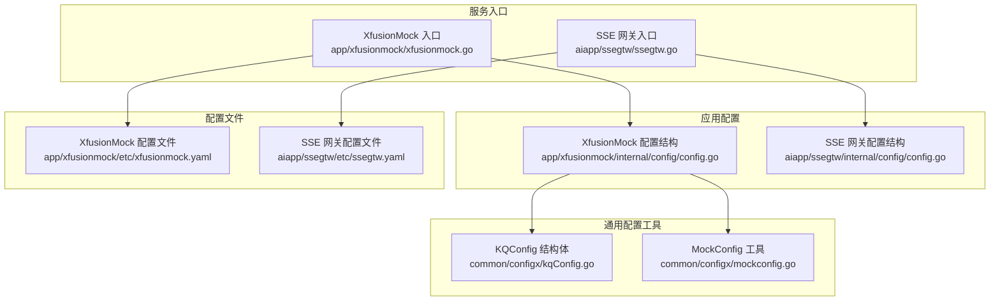
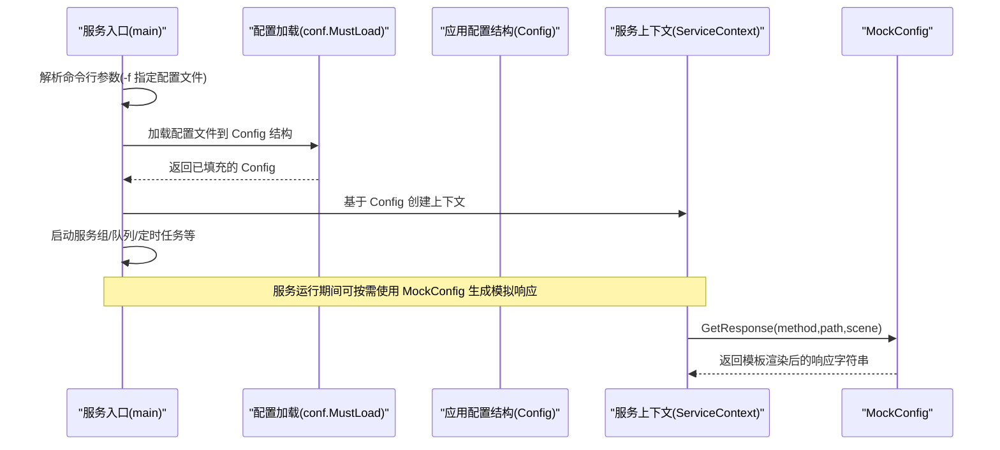
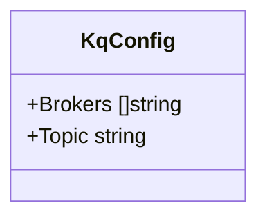
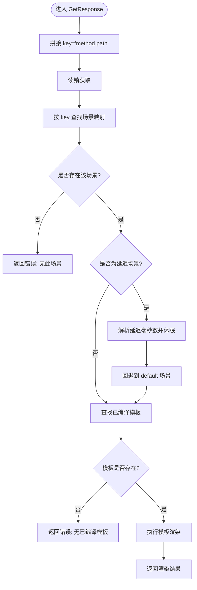
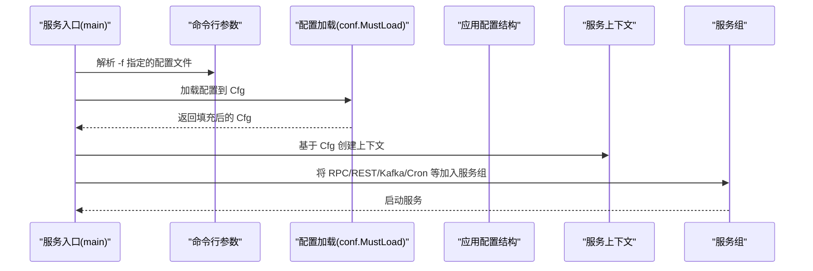
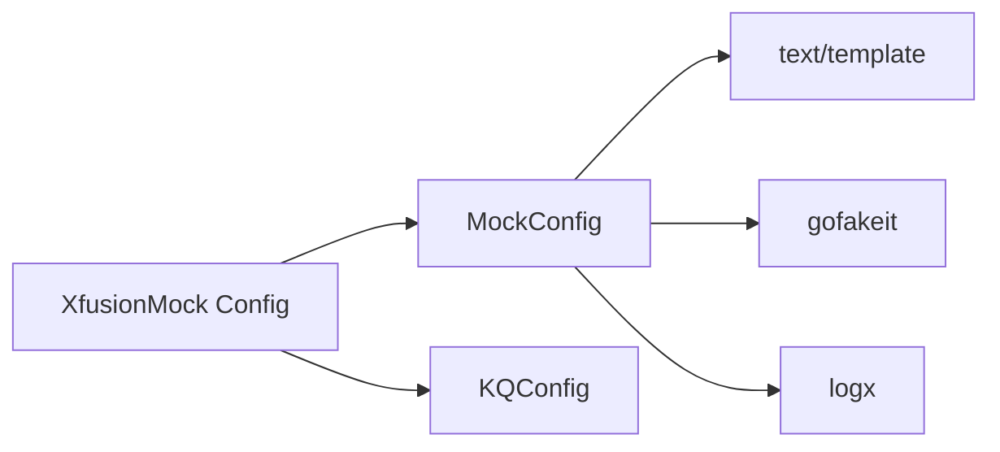

# 配置管理工具

<cite>
**本文引用的文件**
- [common/configx/kqConfig.go](file://common/configx/kqConfig.go)
- [common/configx/mockconfig.go](file://common/configx/mockconfig.go)
- [app/xfusionmock/internal/config/config.go](file://app/xfusionmock/internal/config/config.go)
- [app/xfusionmock/etc/xfusionmock.yaml](file://app/xfusionmock/etc/xfusionmock.yaml)
- [aiapp/ssegtw/internal/config/config.go](file://aiapp/ssegtw/internal/config/config.go)
- [aiapp/ssegtw/etc/ssegtw.yaml](file://aiapp/ssegtw/etc/ssegtw.yaml)
- [app/xfusionmock/xfusionmock.go](file://app/xfusionmock/xfusionmock.go)
- [aiapp/ssegtw/ssegtw.go](file://aiapp/ssegtw/ssegtw.go)
- [.trae/skills/zero-skills/best-practices/overview.md](file://.trae/skills/zero-skills/best-practices/overview.md)
- [.trae/skills/zero-skills/references/rest-api-patterns.md](file://.trae/skills/zero-skills/references/rest-api-patterns.md)
- [.trae/skills/zero-skills/troubleshooting/common-issues.md](file://.trae/skills/zero-skills/troubleshooting/common-issues.md)
</cite>

## 目录
1. [简介](#简介)
2. [项目结构](#项目结构)
3. [核心组件](#核心组件)
4. [架构总览](#架构总览)
5. [详细组件分析](#详细组件分析)
6. [依赖分析](#依赖分析)
7. [性能考虑](#性能考虑)
8. [故障排查指南](#故障排查指南)
9. [结论](#结论)
10. [附录](#附录)

## 简介
本文件面向 Zero-Service 的配置管理工具，系统性介绍两类配置能力：
- KQConfig：用于 Kafka 队列配置的轻量结构体，便于在服务配置中嵌入与复用。
- MockConfig：用于接口模拟响应的配置驱动工具，支持基于场景的模板化响应生成、延迟模拟与并发安全。

同时，本文给出配置文件格式、配置项定义规范、配置优先级规则，并结合仓库中的真实服务示例，说明如何在服务中集成与使用这些配置工具；最后提供配置热更新与动态配置的最佳实践建议。

## 项目结构
围绕配置管理的关键位置如下：
- 配置工具定义：common/configx
- 服务配置结构：各应用内部 config 包
- 配置文件：各应用 etc 目录下的 YAML 文件
- 服务入口：各应用主程序通过 conf.MustLoad 加载配置

图表来源
- [common/configx/kqConfig.go:1-7](file://common/configx/kqConfig.go#L1-L7)
- [common/configx/mockconfig.go:1-147](file://common/configx/mockconfig.go#L1-L147)
- [app/xfusionmock/internal/config/config.go:1-22](file://app/xfusionmock/internal/config/config.go#L1-L22)
- [aiapp/ssegtw/internal/config/config.go:1-15](file://aiapp/ssegtw/internal/config/config.go#L1-L15)
- [app/xfusionmock/etc/xfusionmock.yaml:1-39](file://app/xfusionmock/etc/xfusionmock.yaml#L1-L39)
- [aiapp/ssegtw/etc/ssegtw.yaml:1-14](file://aiapp/ssegtw/etc/ssegtw.yaml#L1-L14)
- [app/xfusionmock/xfusionmock.go:26-32](file://app/xfusionmock/xfusionmock.go#L26-L32)
- [aiapp/ssegtw/ssegtw.go:24-30](file://aiapp/ssegtw/ssegtw.go#L24-L30)

章节来源
- [common/configx/kqConfig.go:1-7](file://common/configx/kqConfig.go#L1-L7)
- [common/configx/mockconfig.go:1-147](file://common/configx/mockconfig.go#L1-L147)
- [app/xfusionmock/internal/config/config.go:1-22](file://app/xfusionmock/internal/config/config.go#L1-L22)
- [aiapp/ssegtw/internal/config/config.go:1-15](file://aiapp/ssegtw/internal/config/config.go#L1-L15)
- [app/xfusionmock/etc/xfusionmock.yaml:1-39](file://app/xfusionmock/etc/xfusionmock.yaml#L1-L39)
- [aiapp/ssegtw/etc/ssegtw.yaml:1-14](file://aiapp/ssegtw/etc/ssegtw.yaml#L1-L14)
- [app/xfusionmock/xfusionmock.go:26-32](file://app/xfusionmock/xfusionmock.go#L26-L32)
- [aiapp/ssegtw/ssegtw.go:24-30](file://aiapp/ssegtw/ssegtw.go#L24-L30)

## 核心组件
- KQConfig：定义 Kafka 队列所需的 Broker 列表与 Topic 名称，作为配置结构体被服务配置嵌入使用。
- MockConfig：读取 JSON/YAML 模板配置，编译为模板并按请求的 method/path/scene 返回响应，支持延迟场景与并发安全。

章节来源
- [common/configx/kqConfig.go:3-6](file://common/configx/kqConfig.go#L3-L6)
- [common/configx/mockconfig.go:18-22](file://common/configx/mockconfig.go#L18-L22)

## 架构总览
下图展示了服务启动时的配置加载与使用流程，以及 MockConfig 在请求处理中的调用路径。

图表来源
- [app/xfusionmock/xfusionmock.go:26-32](file://app/xfusionmock/xfusionmock.go#L26-L32)
- [aiapp/ssegtw/ssegtw.go:24-30](file://aiapp/ssegtw/ssegtw.go#L24-L30)
- [common/configx/mockconfig.go:104-146](file://common/configx/mockconfig.go#L104-L146)

## 详细组件分析

### KQConfig 组件分析
- 角色定位：作为 Kafka 配置的承载结构体，被服务配置结构嵌入，统一管理 Broker 与 Topic。
- 字段说明：
  - Brokers：Kafka 集群地址列表
  - Topic：主题名称
- 使用方式：在应用配置结构中以字段形式出现，供服务初始化队列或客户端时使用。

图表来源
- [common/configx/kqConfig.go:3-6](file://common/configx/kqConfig.go#L3-L6)

章节来源
- [common/configx/kqConfig.go:1-7](file://common/configx/kqConfig.go#L1-L7)
- [app/xfusionmock/internal/config/config.go:10-21](file://app/xfusionmock/internal/config/config.go#L10-L21)

### MockConfig 组件分析
- 功能概述：
  - 初始化：读取配置文件，解析为原始 JSON 字节，避免二次转义问题；编译模板，建立 key->scene->template 的映射。
  - 查询：根据 method+path 定位场景，若场景为“延迟”类型则先休眠再回退到 default 场景；执行模板渲染后返回字符串。
  - 并发安全：读写分离锁保护模板与原始数据。
  - 模拟函数：内置 fake 函数族，支持 name、city、phone、email、date、word、appName 等。
- 关键流程（获取响应）：

图表来源
- [common/configx/mockconfig.go:104-146](file://common/configx/mockconfig.go#L104-L146)

章节来源
- [common/configx/mockconfig.go:1-147](file://common/configx/mockconfig.go#L1-L147)

### 配置加载机制与服务集成
- 标准加载：服务入口通过命令行参数指定配置文件路径，随后调用配置加载函数将 YAML 内容填充到应用配置结构体。
- 示例一（RPC 服务）：XfusionMock 入口加载配置后，创建服务上下文，并将配置中的 RPC 服务器配置、Kafka 测试配置、定时任务等加入服务组启动。
- 示例二（REST 服务）：SSE 网关入口加载配置后，创建 REST 服务器并注册处理器，同样将配置中的日志、端口、超时等参数生效。

图表来源
- [app/xfusionmock/xfusionmock.go:26-32](file://app/xfusionmock/xfusionmock.go#L26-L32)
- [aiapp/ssegtw/ssegtw.go:24-30](file://aiapp/ssegtw/ssegtw.go#L24-L30)

章节来源
- [app/xfusionmock/xfusionmock.go:26-32](file://app/xfusionmock/xfusionmock.go#L26-L32)
- [aiapp/ssegtw/ssegtw.go:24-30](file://aiapp/ssegtw/ssegtw.go#L24-L30)

## 依赖分析
- MockConfig 依赖：
  - 模板引擎：text/template
  - 随机数据：github.com/brianvoe/gofakeit/v7
  - 日志：github.com/zeromicro/go-zero/core/logx
  - 并发控制：sync.RWMutex
- 应用配置对工具的依赖：
  - XfusionMock：嵌入 KQConfig 与 MockConfig（通过应用配置结构体）
  - SSE 网关：嵌入 REST 与 RPC 配置结构体

图表来源
- [common/configx/mockconfig.go:3-16](file://common/configx/mockconfig.go#L3-L16)
- [app/xfusionmock/internal/config/config.go:10-21](file://app/xfusionmock/internal/config/config.go#L10-L21)

章节来源
- [common/configx/mockconfig.go:1-147](file://common/configx/mockconfig.go#L1-L147)
- [app/xfusionmock/internal/config/config.go:1-22](file://app/xfusionmock/internal/config/config.go#L1-L22)

## 性能考虑
- MockConfig 渲染路径：
  - 模板编译仅在初始化阶段进行一次，后续按需执行模板渲染，避免重复解析开销。
  - 读多写少场景采用读锁，提升并发查询性能。
- 延迟场景：
  - 延迟场景会触发睡眠，应谨慎使用，避免阻塞关键路径。
- 建议：
  - 对高频场景尽量减少模板复杂度与随机数据生成频率。
  - 在生产环境谨慎启用延迟场景，优先使用 default 场景进行快速验证。

[本节为通用性能建议，不涉及具体文件分析]

## 故障排查指南
- 配置文件路径问题：
  - 使用绝对路径或确保相对路径正确，避免因工作目录导致找不到配置文件。
- 配置校验失败：
  - 必填字段缺失会导致校验失败，检查配置结构体中的必填项与 YAML 中的对应字段。
- MockConfig 场景缺失：
  - 若 method+path 或 scene 不存在，将返回相应错误；请核对配置文件中的键名与场景名。
- 模板解析错误：
  - 模板语法错误会在初始化阶段记录日志；请检查模板字符串与函数使用。

章节来源
- [.trae/skills/zero-skills/troubleshooting/common-issues.md:623-713](file://.trae/skills/zero-skills/troubleshooting/common-issues.md#L623-L713)

## 结论
- KQConfig 提供了简洁一致的 Kafka 配置承载结构，便于在服务配置中复用。
- MockConfig 提供了灵活的场景化响应生成能力，支持延迟与并发安全，适合测试与联调阶段使用。
- 通过标准的配置加载流程与清晰的配置结构，Zero-Service 的服务能够在不同环境中稳定运行。

[本节为总结性内容，不涉及具体文件分析]

## 附录

### 配置文件格式与优先级
- 配置文件格式：YAML
- 加载方式：服务入口通过命令行参数 -f 指定配置文件路径，随后调用配置加载函数完成结构体填充。
- 优先级规则（基于仓库实践）：
  - 命令行参数 -f 指定的配置文件为首要来源。
  - 应用配置结构体中嵌入的标准配置（如 REST/RPC/Kafka 等）字段，遵循结构体字段定义与标签约束。
  - 环境变量覆盖：可通过环境变量对配置进行覆盖（参考最佳实践文档），但仓库中未见显式实现，建议在自定义场景中按需引入。

章节来源
- [app/xfusionmock/xfusionmock.go:26-32](file://app/xfusionmock/xfusionmock.go#L26-L32)
- [aiapp/ssegtw/ssegtw.go:24-30](file://aiapp/ssegtw/ssegtw.go#L24-L30)
- [.trae/skills/zero-skills/best-practices/overview.md:121-138](file://.trae/skills/zero-skills/best-practices/overview.md#L121-L138)

### 配置项定义规范
- 嵌入标准配置：服务配置结构通常嵌入框架提供的标准配置结构（如 REST/RPC/Kafka 等），以获得一致的行为与默认值。
- 自定义字段：新增字段时建议使用标签声明默认值、可选性与选项范围，便于配置校验与文档化。
- 示例参考：
  - 标准配置嵌入与自定义字段组合
  - YAML 中字段与结构体字段一一对应

章节来源
- [.trae/skills/zero-skills/best-practices/overview.md:60-119](file://.trae/skills/zero-skills/best-practices/overview.md#L60-L119)
- [.trae/skills/zero-skills/references/rest-api-patterns.md:146-195](file://.trae/skills/zero-skills/references/rest-api-patterns.md#L146-L195)

### 实际代码示例（路径指引）
- 加载配置并启动服务（RPC）：
  - 入口文件：[app/xfusionmock/xfusionmock.go:26-32](file://app/xfusionmock/xfusionmock.go#L26-L32)
  - 配置结构：[app/xfusionmock/internal/config/config.go:10-21](file://app/xfusionmock/internal/config/config.go#L10-L21)
  - 配置文件：[app/xfusionmock/etc/xfusionmock.yaml:1-39](file://app/xfusionmock/etc/xfusionmock.yaml#L1-L39)
- 加载配置并启动服务（REST）：
  - 入口文件：[aiapp/ssegtw/ssegtw.go:24-30](file://aiapp/ssegtw/ssegtw.go#L24-L30)
  - 配置结构：[aiapp/ssegtw/internal/config/config.go:11-14](file://aiapp/ssegtw/internal/config/config.go#L11-L14)
  - 配置文件：[aiapp/ssegtw/etc/ssegtw.yaml:1-14](file://aiapp/ssegtw/etc/ssegtw.yaml#L1-L14)

### MockConfig 使用示例（路径指引）
- 初始化与使用：
  - 构造函数与模板初始化：[common/configx/mockconfig.go:30-51](file://common/configx/mockconfig.go#L30-L51)
  - 获取响应（含延迟与回退）：[common/configx/mockconfig.go:104-146](file://common/configx/mockconfig.go#L104-L146)

### 配置热更新与动态配置最佳实践
- 建议：
  - 对于需要热更新的配置，采用独立的配置中心（如 Nacos）并监听变更事件，按需重建相关组件。
  - 对于 MockConfig 的场景配置，建议在开发/测试环境单独维护，避免与生产配置混淆。
  - 对于 Kafka 等外部依赖配置，建议在服务启动时一次性加载并在运行期只读访问，避免运行时频繁修改带来的不一致风险。

[本节为通用最佳实践建议，不涉及具体文件分析]