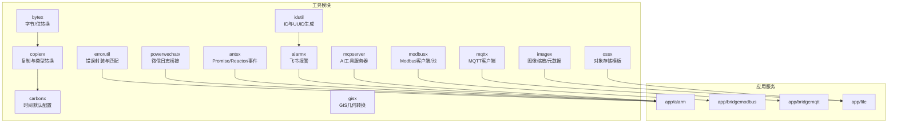
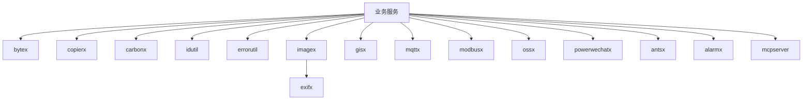
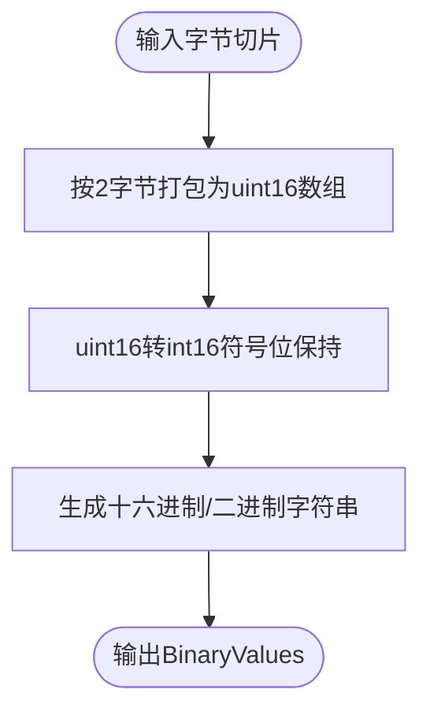
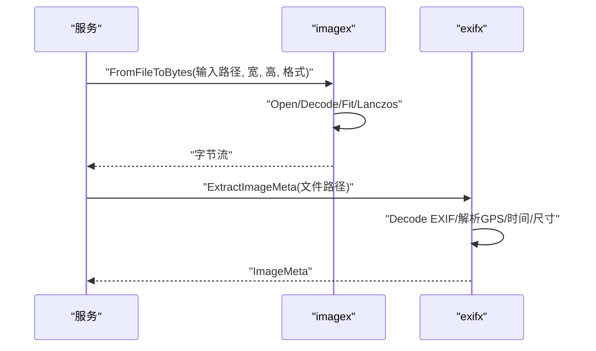
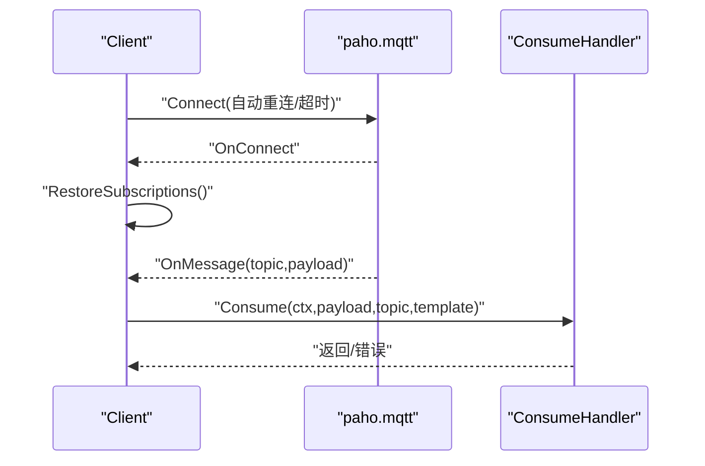
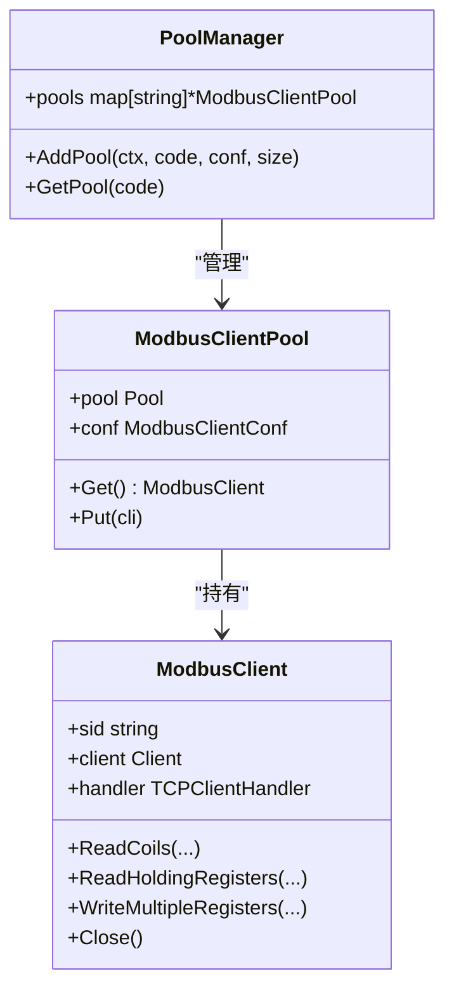
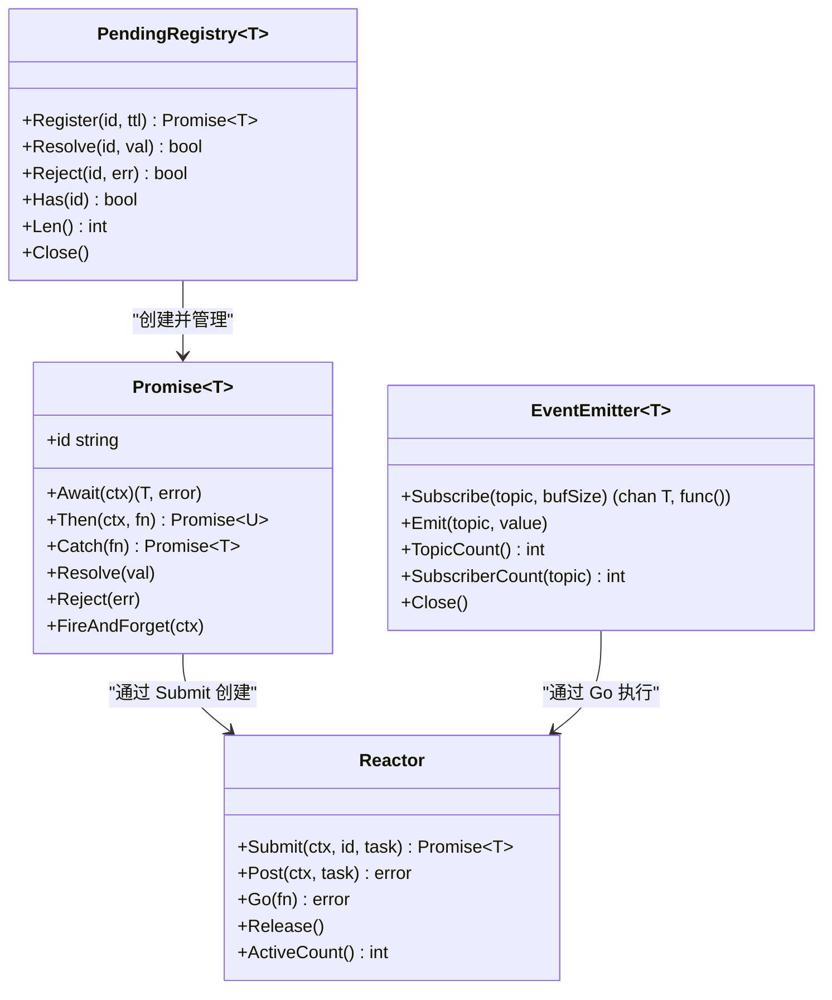
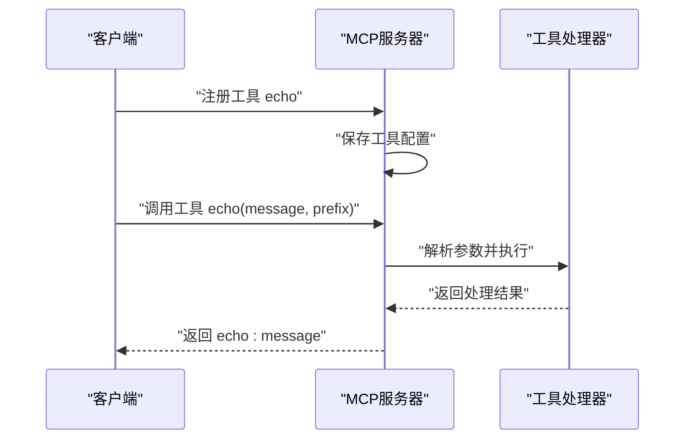
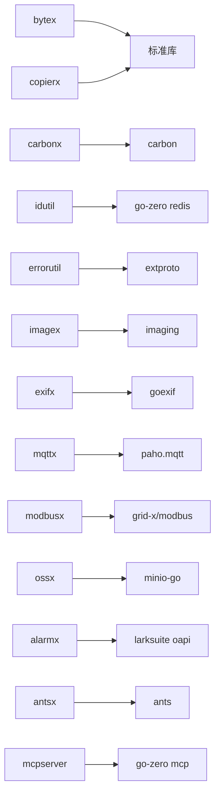

# 工具组件集合

<cite>
**本文引用的文件**
- [bytex.go](file://common/bytex/bytex.go)
- [type.go](file://common/copierx/type.go)
- [carbonx.go](file://common/carbonx/carbonx.go)
- [idutil.go](file://common/tool/idutil.go)
- [errorutil.go](file://common/tool/errorutil.go)
- [imaging.go](file://common/imagex/imaging.go)
- [exifx.go](file://common/imagex/exifx.go)
- [gisx.go](file://common/gisx/gisx.go)
- [mqttx.go](file://common/mqttx/mqttx.go)
- [client.go](file://common/modbusx/client.go)
- [config.go](file://common/modbusx/config.go)
- [ossx.go](file://common/ossx/ossx.go)
- [types.go](file://common/powerwechatx/types.go)
- [promise.go](file://common/antsx/promise.go)
- [promise_ext.go](file://common/antsx/promise_ext.go)
- [reactor.go](file://common/antsx/reactor.go)
- [invoke.go](file://common/antsx/invoke.go)
- [emitter.go](file://common/antsx/emitter.go)
- [pending.go](file://common/antsx/pending.go)
- [errors.go](file://common/antsx/errors.go)
- [alarmx.go](file://common/alarmx/alarmx.go)
- [tool.go](file://common/tool/tool.go)
- [mcpserver.go](file://aiapp/mcpserver/mcpserver.go)
- [mcpserver.yaml](file://aiapp/mcpserver/etc/mcpserver.yaml)
</cite>

## 目录
1. [简介](#简介)
2. [项目结构](#项目结构)
3. [核心组件](#核心组件)
4. [架构总览](#架构总览)
5. [详细组件分析](#详细组件分析)
6. [依赖分析](#依赖分析)
7. [性能考虑](#性能考虑)
8. [故障排查指南](#故障排查指南)
9. [结论](#结论)
10. [附录](#附录)

## 简介
本文件系统性梳理仓库中的工具组件集合，覆盖数据处理（bytex、copierx）、时间处理（carbonx）、ID 生成（idutil）、错误处理（errorutil）、图像处理（imagex）、地理信息（gisx）、MQTT 客户端（mqttx）、Modbus 客户端（modbusx）、对象存储（ossx）、微信支付（powerwechatx）、蚂蚁金服工具（antsx）、报警处理（alarmx）、AI 应用工具（MCP 服务器）。文档从设计目的、核心能力、使用场景、配置要点、性能与最佳实践出发，辅以流程图与类图，帮助在微服务开发中高效集成与扩展。

## 项目结构
工具组件主要位于 common 目录下，按功能域划分模块，便于独立引入与维护；部分组件同时在应用层（app/*）中被具体服务使用，体现"工具—服务"解耦。AI 应用工具位于 aiapp 目录，提供 MCP 服务器等 AI 相关功能。

图表来源
- [mqttx.go:1-389](file://common/mqttx/mqttx.go#L1-L389)
- [client.go:1-218](file://common/modbusx/client.go#L1-L218)
- [ossx.go:1-152](file://common/ossx/ossx.go#L1-L152)
- [alarmx.go:1-223](file://common/alarmx/alarmx.go#L1-L223)
- [mcpserver.go:1-75](file://aiapp/mcpserver/mcpserver.go#L1-L75)

章节来源
- [mqttx.go:1-389](file://common/mqttx/mqttx.go#L1-L389)
- [client.go:1-218](file://common/modbusx/client.go#L1-L218)
- [ossx.go:1-152](file://common/ossx/ossx.go#L1-L152)
- [alarmx.go:1-223](file://common/alarmx/alarmx.go#L1-L223)
- [mcpserver.go:1-75](file://aiapp/mcpserver/mcpserver.go#L1-L75)

## 核心组件
- 数据处理
  - bytex：提供字节与 16 位整数/位布尔之间的互转，支持二进制/十六进制/字节串的统一视图，便于协议解析与 Modbus/IEC104 等场景。
  - copierx：基于 copier 的增强复制，内置时间与字符串到整数、时间到自定义日期时间类型的转换器，统一跨层数据传输格式。
- 时间处理
  - carbonx：初始化全局时间默认配置（布局、时区、语言、周起始与周末），确保服务间时间语义一致。
- ID 生成
  - idutil：基于 Redis 的分布式单调递增 ID 生成器，支持分类与年月日时分秒编码，以及简单 UUID 生成。
- 错误处理
  - errorutil：根据枚举扩展信息动态映射 HTTP/GRPC 错误码与消息，支持错误匹配与原因码比对。
- 图像处理
  - imagex：提供文件/字节/Reader 输入的统一缩放与编码接口，支持多种输出格式；exifx 提供 EXIF 元数据提取（经纬度、时间、尺寸、海拔、相机型号等）。
- 地理信息
  - gisx：将 orb.Polygon 转换为 H3 GeoPolygon，处理外环与洞（holes），并校验闭合性与最小点数。
- MQTT 客户端
  - mqttx：封装 paho.mqtt 客户端，支持自动重连、订阅恢复、处理器注册、OpenTelemetry 跟踪、指标统计与默认事件映射。
- Modbus 客户端
  - modbusx：封装 grid-x/modbus，提供完整功能码操作、TLS 支持、连接池与会话日志、按 modbusCode 的池管理器。
- 对象存储
  - ossx：抽象 OSS 模板接口，支持 MinIO/Tencent COS 等接入，提供桶/文件 CRUD、签名 URL、批量删除与租户模式。
- 微信支付
  - powerwechatx：将微信 SDK 日志桥接到 go-zero 日志系统，统一上下文与级别。
- 蚂蚁金服工具
  - antsx：基于 ants goroutine 池的响应式编程工具包，参考 Java Project Reactor 理念，提供 Promise 异步容器、Reactor 池调度器、事件发射器、请求-响应匹配注册表等功能。
- 报警处理
  - alarmx：基于飞书 IM 接口的报警群管理与卡片消息发送，支持聊天室创建/更新、成员拉取、消息卡片构建与转义。
- AI 应用工具
  - mcpserver：基于 go-zero MCP 框架的 AI 工具服务器，支持工具注册、参数验证、CORS 配置和消息超时控制。

章节来源
- [bytex.go:1-239](file://common/bytex/bytex.go#L1-L239)
- [type.go:1-57](file://common/copierx/type.go#L1-L57)
- [carbonx.go:1-17](file://common/carbonx/carbonx.go#L1-L17)
- [idutil.go:1-60](file://common/tool/idutil.go#L1-L60)
- [errorutil.go:1-91](file://common/tool/errorutil.go#L1-L91)
- [imaging.go:1-69](file://common/imagex/imaging.go#L1-L69)
- [exifx.go:1-294](file://common/imagex/exifx.go#L1-L294)
- [gisx.go:1-60](file://common/gisx/gisx.go#L1-L60)
- [mqttx.go:1-389](file://common/mqttx/mqttx.go#L1-L389)
- [client.go:1-218](file://common/modbusx/client.go#L1-L218)
- [config.go:1-125](file://common/modbusx/config.go#L1-L125)
- [ossx.go:1-152](file://common/ossx/ossx.go#L1-L152)
- [types.go:1-66](file://common/powerwechatx/types.go#L1-L66)
- [promise.go:1-147](file://common/antsx/promise.go#L1-L147)
- [reactor.go:1-93](file://common/antsx/reactor.go#L1-L93)
- [invoke.go:1-150](file://common/antsx/invoke.go#L1-L150)
- [emitter.go:1-118](file://common/antsx/emitter.go#L1-L118)
- [pending.go:1-184](file://common/antsx/pending.go#L1-L184)
- [alarmx.go:1-223](file://common/alarmx/alarmx.go#L1-L223)
- [mcpserver.go:1-75](file://aiapp/mcpserver/mcpserver.go#L1-L75)
- [mcpserver.yaml:1-9](file://aiapp/mcpserver/etc/mcpserver.yaml#L1-L9)

## 架构总览
以下图展示工具组件在微服务中的典型交互：服务通过工具模块完成数据转换、时间标准化、ID 生成、错误封装、图像处理、MQTT/Modbus 通信、对象存储访问、报警通知、AI 工具调用等。

图表来源
- [bytex.go:1-239](file://common/bytex/bytex.go#L1-L239)
- [type.go:1-57](file://common/copierx/type.go#L1-L57)
- [carbonx.go:1-17](file://common/carbonx/carbonx.go#L1-L17)
- [idutil.go:1-60](file://common/tool/idutil.go#L1-L60)
- [errorutil.go:1-91](file://common/tool/errorutil.go#L1-L91)
- [imaging.go:1-69](file://common/imagex/imaging.go#L1-L69)
- [exifx.go:1-294](file://common/imagex/exifx.go#L1-L294)
- [gisx.go:1-60](file://common/gisx/gisx.go#L1-L60)
- [mqttx.go:1-389](file://common/mqttx/mqttx.go#L1-L389)
- [client.go:1-218](file://common/modbusx/client.go#L1-L218)
- [ossx.go:1-152](file://common/ossx/ossx.go#L1-L152)
- [types.go:1-66](file://common/powerwechatx/types.go#L1-L66)
- [promise.go:1-147](file://common/antsx/promise.go#L1-L147)
- [reactor.go:1-93](file://common/antsx/reactor.go#L1-L93)
- [alarmx.go:1-223](file://common/alarmx/alarmx.go#L1-L223)
- [mcpserver.go:1-75](file://aiapp/mcpserver/mcpserver.go#L1-L75)

## 详细组件分析

### bytex：字节/位与数值互转
- 设计目的：为协议解析与设备通信提供统一的字节/位/数值视图，避免重复实现。
- 核心能力：
  - 字节切片与 16 位无符号整数数组互转（含奇数字节补零策略）
  - 16 位与 32 位整数互转（兼容 gRPC 类型）
  - 位布尔数组与字节互转（按位存储）
  - 生成统一的二进制/十六进制/字节视图结构体
- 使用场景：Modbus 寄存器读写、IEC104 规约解析、协议报文组装/拆解。
- 性能与最佳实践：
  - 预估容量减少扩容次数
  - 合理使用切片复用，避免频繁分配
  - 注意奇数字节补齐规则，确保与设备一致

图表来源
- [bytex.go:25-161](file://common/bytex/bytex.go#L25-L161)

章节来源
- [bytex.go:1-239](file://common/bytex/bytex.go#L1-L239)

### copierx：复制与类型转换
- 设计目的：统一跨层数据传输的类型转换，减少样板代码。
- 核心能力：
  - 忽略空字段、深度复制
  - 内置时间到字符串（带微秒）、字符串到整数、时间到自定义日期时间类型转换器
- 使用场景：DTO/Model 转换、RPC 请求/响应映射、日志字段格式化。
- 最佳实践：
  - 明确转换器优先级与类型匹配
  - 对于复杂类型，确保目标字段可接受转换结果

章节来源
- [type.go:1-57](file://common/copierx/type.go#L1-L57)

### carbonx：时间默认配置
- 设计目的：全局设置时间布局、时区、语言、周起始与周末，保证跨模块时间一致性。
- 使用场景：日志、定时任务、报表时间戳。
- 最佳实践：
  - 在应用启动时尽早初始化
  - 与数据库/缓存时间格式保持一致

章节来源
- [carbonx.go:1-17](file://common/carbonx/carbonx.go#L1-L17)

### idutil：分布式 ID 与 UUID
- 设计目的：提供全局唯一且有序的业务 ID 与通用 UUID。
- 核心能力：
  - 基于 Redis 的单调递增 ID（带分类与时间戳前缀）
  - 简单 UUID（移除横线）
- 使用场景：订单号、流水号、分布式主键。
- 最佳实践：
  - ID 前缀与业务域约定一致
  - Redis Key 过期策略与业务峰值吞吐匹配

章节来源
- [idutil.go:1-60](file://common/tool/idutil.go#L1-L60)

### errorutil：错误封装与匹配
- 设计目的：将枚举扩展映射为 HTTP/GRPC 错误码与消息，支持错误原因码匹配。
- 核心能力：
  - 从枚举扩展读取错误名与 HTTP 码
  - 动态构造 gkit 错误对象
  - 原因码匹配工具
- 使用场景：统一错误输出、前端友好提示、可观测性追踪。
- 最佳实践：
  - 枚举扩展规范定义错误名与 HTTP 码
  - 与网关/中间件错误拦截配合

章节来源
- [errorutil.go:1-91](file://common/tool/errorutil.go#L1-L91)

### imagex：图像处理与 EXIF 元数据
- 设计目的：提供统一的图像缩放与编码接口，支持 EXIF 元数据提取。
- 核心能力：
  - 文件/字节/Reader 输入，统一输出格式
  - EXIF 解析：经纬度、拍摄时间、尺寸、海拔、相机型号
- 使用场景：文件服务、媒体处理、地理标注。
- 最佳实践：
  - 控制缩放尺寸，平衡质量与体积
  - EXIF 解析失败时降级为空值

图表来源
- [imaging.go:1-69](file://common/imagex/imaging.go#L1-L69)
- [exifx.go:1-294](file://common/imagex/exifx.go#L1-L294)

章节来源
- [imaging.go:1-69](file://common/imagex/imaging.go#L1-L69)
- [exifx.go:1-294](file://common/imagex/exifx.go#L1-L294)

### gisx：地理信息转换
- 设计目的：将 orb.Polygon 转换为 H3 GeoPolygon，支持外环与洞（holes）。
- 核心能力：
  - 外环闭合性校验与首尾连接
  - 洞（hole）过滤与合法性校验
- 使用场景：电子围栏、区域检索、空间索引。
- 最佳实践：
  - 多边形点集顺序与坐标系一致
  - 洞数量与拓扑正确性验证

章节来源
- [gisx.go:1-60](file://common/gisx/gisx.go#L1-L60)

### mqttx：MQTT 客户端
- 设计目的：简化 MQTT 使用，提供自动重连、订阅恢复、处理器注册、跟踪与指标。
- 核心能力：
  - 配置项：Broker、ClientID、用户名/密码、QoS、超时、心跳、自动订阅、初始主题、事件映射
  - 运行时：连接、订阅、发布、处理器注册、默认事件、跟踪与指标
  - 生命周期：连接丢失重连、优雅关闭
- 使用场景：设备消息订阅、遥测上报、事件驱动。
- 最佳实践：
  - 合理设置 QoS 与超时
  - 使用事件映射与默认事件统一处理
  - 订阅恢复与处理器幂等

图表来源
- [mqttx.go:98-333](file://common/mqttx/mqttx.go#L98-L333)

章节来源
- [mqttx.go:1-389](file://common/mqttx/mqttx.go#L1-L389)

### modbusx：Modbus 客户端与连接池
- 设计目的：封装 grid-x/modbus，提供完整功能码、TLS、连接池与日志。
- 核心能力：
  - 客户端：读写线圈/寄存器、读写多寄存器、掩码写、FIFO、设备识别
  - 连接池：按 modbusCode 管理池，支持最大存活时间
  - 配置：地址、从站、超时、空闲、重连、协议恢复、TLS
- 使用场景：工业设备采集、远程控制。
- 最佳实践：
  - 池大小与并发请求匹配
  - TLS 证书与 CA 配置正确
  - 日志中包含会话标识，便于定位

图表来源
- [client.go:20-218](file://common/modbusx/client.go#L20-L218)
- [config.go:32-125](file://common/modbusx/config.go#L32-L125)

章节来源
- [client.go:1-218](file://common/modbusx/client.go#L1-L218)
- [config.go:1-125](file://common/modbusx/config.go#L1-L125)

### ossx：对象存储模板
- 设计目的：抽象 OSS 操作接口，屏蔽厂商差异，支持租户模式与缓存模板。
- 核心能力：
  - 模板接口：桶/文件 CRUD、签名 URL、批量删除
  - 租户模式：按租户前缀拼接桶名
  - 缓存：按租户缓存模板与配置，避免重复初始化
- 使用场景：文件上传、下载、分享链接。
- 最佳实践：
  - 桶命名与租户策略一致
  - 模板缓存命中率与失效策略权衡

章节来源
- [ossx.go:1-152](file://common/ossx/ossx.go#L1-L152)

### powerwechatx：微信日志桥接
- 设计目的：将微信 SDK 日志桥接到 go-zero 日志系统，统一上下文与级别。
- 使用场景：微信支付/开放平台日志统一。
- 最佳实践：
  - 保持与业务上下文一致的日志驱动

章节来源
- [types.go:1-66](file://common/powerwechatx/types.go#L1-L66)

### antsx：响应式编程工具包
- 设计目的：基于 ants goroutine 池的响应式编程工具包，参考 Java Project Reactor 理念，提供 Go 惯用风格的异步编程能力。
- 核心能力：
  - Promise[T]：泛型异步结果容器，支持链式调用、错误捕获、超时控制
  - Reactor：ants 池调度器，带 ID 去重的任务提交与执行
  - EventEmitter[T]：Topic 级别发布/订阅，支持非阻塞广播
  - PendingRegistry[T]：关联 ID 请求-响应匹配，自动过期管理
  - Invoke：并行流程编排，支持超时控制与快速失败
- 使用场景：异步批处理、链式任务编排、事件驱动架构、请求-响应匹配。
- 最佳实践：
  - 任务 ID 唯一性约束，避免重复提交
  - 合理设置池大小与超时时间
  - 使用错误捕获机制处理 panic 情况
  - 利用超时控制防止资源泄漏

图表来源
- [promise.go:16-147](file://common/antsx/promise.go#L16-L147)
- [reactor.go:14-93](file://common/antsx/reactor.go#L14-L93)
- [emitter.go:13-118](file://common/antsx/emitter.go#L13-L118)
- [pending.go:29-184](file://common/antsx/pending.go#L29-L184)

章节来源
- [promise.go:1-147](file://common/antsx/promise.go#L1-L147)
- [promise_ext.go:1-132](file://common/antsx/promise_ext.go#L1-L132)
- [reactor.go:1-93](file://common/antsx/reactor.go#L1-L93)
- [invoke.go:1-150](file://common/antsx/invoke.go#L1-L150)
- [emitter.go:1-118](file://common/antsx/emitter.go#L1-L118)
- [pending.go:1-184](file://common/antsx/pending.go#L1-L184)
- [errors.go:1-10](file://common/antsx/errors.go#L1-L10)

### alarmx：飞书报警
- 设计目的：自动化创建/更新报警群，向群内发送交互卡片消息，支持用户拉取。
- 核心能力：
  - 群创建/成员管理/群信息更新/查询
  - 消息发送（交互卡片）
  - 卡片模板渲染与字符串转义
- 使用场景：告警通知、运维协作。
- 最佳实践：
  - ChatId 缓存与有效期策略
  - 模板路径与变量替换规范化

章节来源
- [alarmx.go:1-223](file://common/alarmx/alarmx.go#L1-L223)

### mcpserver：AI 工具服务器
- 设计目的：基于 go-zero MCP 框架的 AI 工具服务器，提供标准化的工具调用接口。
- 核心能力：
  - 工具注册：支持 JSON Schema 参数验证
  - 服务器配置：主机、端口、消息超时、CORS 支持
  - 回显工具示例：演示工具开发流程
  - 日志管理：禁用统计日志，统一错误处理
- 使用场景：AI 工具集成、智能助手、自动化工作流。
- 最佳实践：
  - 工具参数严格验证，确保安全性
  - 合理设置消息超时时间
  - 使用配置文件管理服务器参数
  - 实现健壮的错误处理机制

图表来源
- [mcpserver.go:35-75](file://aiapp/mcpserver/mcpserver.go#L35-L75)

章节来源
- [mcpserver.go:1-75](file://aiapp/mcpserver/mcpserver.go#L1-L75)
- [mcpserver.yaml:1-9](file://aiapp/mcpserver/etc/mcpserver.yaml#L1-L9)

## 依赖分析
- 模块内聚与耦合
  - bytex 与 tool 中的二进制转换逻辑存在重复实现，建议统一至 bytex 或 tool，避免重复维护
  - mqttx 与 alarmx 依赖外部 SDK（paho.mqtt、飞书 SDK），注意版本升级与兼容性
  - modbusx 依赖第三方 modbus 客户端库，TLS 与日志需与业务日志体系对齐
  - antsx 依赖 ants goroutine 池，需要合理配置池大小与超时
- 外部依赖
  - 时间：github.com/dromara/carbon
  - 图像：github.com/disintegration/imaging
  - EXIF：github.com/rwcarlsen/goexif
  - MQTT：github.com/eclipse/paho.mqtt.golang
  - Modbus：github.com/grid-x/modbus
  - 对象存储：MinIO 客户端（在 ossx 中使用）
  - Promise/协程池：github.com/panjf2000/ants
  - AI MCP：github.com/zeromicro/go-zero/mcp

图表来源
- [bytex.go:1-239](file://common/bytex/bytex.go#L1-L239)
- [type.go:1-57](file://common/copierx/type.go#L1-L57)
- [carbonx.go:1-17](file://common/carbonx/carbonx.go#L1-L17)
- [idutil.go:1-60](file://common/tool/idutil.go#L1-L60)
- [errorutil.go:1-91](file://common/tool/errorutil.go#L1-L91)
- [imaging.go:1-69](file://common/imagex/imaging.go#L1-L69)
- [exifx.go:1-294](file://common/imagex/exifx.go#L1-L294)
- [mqttx.go:1-389](file://common/mqttx/mqttx.go#L1-L389)
- [client.go:1-218](file://common/modbusx/client.go#L1-L218)
- [ossx.go:1-152](file://common/ossx/ossx.go#L1-L152)
- [alarmx.go:1-223](file://common/alarmx/alarmx.go#L1-L223)
- [promise.go:1-147](file://common/antsx/promise.go#L1-L147)
- [mcpserver.go:1-75](file://aiapp/mcpserver/mcpserver.go#L1-L75)

## 性能考虑
- bytex
  - 预估切片容量，减少扩容
  - 使用位运算替代循环位提取
- copierx
  - 合理使用忽略空字段与深度复制，避免不必要的拷贝
- imagex
  - 控制缩放尺寸，优先 Lanczos 保真但 CPU 较高
  - 复用缓冲区，避免重复分配
- mqttx
  - 合理设置 QoS 与超时，避免阻塞
  - 订阅恢复与处理器幂等，降低重复处理
- modbusx
  - 连接池大小与并发请求匹配，避免频繁创建/销毁
  - TLS 握手成本较高，尽量复用连接
- ossx
  - 模板缓存命中率与失效策略，避免重复初始化
- alarmx
  - ChatId 缓存 TTL 与业务周期匹配，避免过期重建
- antsx
  - Reactor 池大小与并发任务匹配，避免过度竞争
  - Promise 链长度控制，防止内存泄漏
  - EventEmitter 缓冲区大小与订阅者数量平衡
  - PendingRegistry TTL 设置与业务超时一致
- mcpserver
  - 工具注册数量与内存占用平衡
  - CORS 配置与安全策略一致

## 故障排查指南
- MQTT 连接失败
  - 检查 Broker 地址、认证信息、超时与 KeepAlive
  - 查看自动重连与订阅恢复日志
- Modbus 读写异常
  - 校验从站地址、功能码、寄存器地址与数量
  - 检查 TLS 证书与 CA 配置
- 图像处理失败
  - 确认输入格式与尺寸
  - EXIF 解析失败时降级为空值
- 对象存储签名失败
  - 校验 Endpoint、AccessKey、SecretKey、BucketName
- 报警消息未送达
  - 检查 ChatId 缓存与有效期
  - 确认交互卡片模板变量替换
- antsx Promise 超时
  - 检查任务执行时间与超时设置
  - 确认 Reactor 池大小与任务复杂度匹配
  - 查看错误捕获日志
- antsx Reactor 任务重复
  - 检查任务 ID 唯一性
  - 确认 ID 去重机制正常工作
- mcpserver 工具调用失败
  - 检查工具参数 JSON Schema 验证
  - 确认工具处理器实现正确
  - 查看服务器配置与日志

章节来源
- [mqttx.go:148-177](file://common/mqttx/mqttx.go#L148-L177)
- [client.go:107-143](file://common/modbusx/client.go#L107-L143)
- [ossx.go:109-151](file://common/ossx/ossx.go#L109-L151)
- [alarmx.go:53-76](file://common/alarmx/alarmx.go#L53-L76)
- [reactor.go:32-61](file://common/antsx/reactor.go#L32-L61)
- [mcpserver.go:35-75](file://aiapp/mcpserver/mcpserver.go#L35-L75)

## 结论
该工具组件集合围绕数据处理、时间标准化、ID 生成、错误封装、图像/地理/通信/存储/报警、AI 工具等关键领域提供了高内聚、低耦合的通用能力。新增的 antsX 反应式编程工具包进一步增强了异步编程能力，而 MCP 服务器为 AI 工具集成提供了标准化框架。通过统一的接口与最佳实践，可在微服务中快速集成与扩展，提升开发效率与系统稳定性。建议在团队内制定统一的配置规范与升级策略，持续优化性能与可观测性。

## 附录
- 实际使用示例（路径指引）
  - MQTT 订阅与发布：[mqttx.go:180-333](file://common/mqttx/mqttx.go#L180-L333)
  - Modbus 读写与池管理：[client.go:29-97](file://common/modbusx/client.go#L29-L97)，[config.go:78-125](file://common/modbusx/config.go#L78-L125)
  - 对象存储上传/签名：[ossx.go:109-151](file://common/ossx/ossx.go#L109-L151)
  - 报警群创建与消息发送：[alarmx.go:53-140](file://common/alarmx/alarmx.go#L53-L140)
  - 图像缩放与 EXIF 提取：[imaging.go:18-68](file://common/imagex/imaging.go#L18-L68)，[exifx.go:89-170](file://common/imagex/exifx.go#L89-L170)
  - 分布式 ID 生成：[idutil.go:22-35](file://common/tool/idutil.go#L22-L35)
  - 错误封装与匹配：[errorutil.go:12-59](file://common/tool/errorutil.go#L12-L59)
  - antsx Promise 链式调用：[promise.go:65-92](file://common/antsx/promise.go#L65-L92)
  - antsx Reactor 任务提交：[reactor.go:32-61](file://common/antsx/reactor.go#L32-L61)
  - antsx EventEmitter 发布订阅：[emitter.go:27-83](file://common/antsx/emitter.go#L27-L83)
  - antsx PendingRegistry 请求匹配：[pending.go:52-90](file://common/antsx/pending.go#L52-L90)
  - MCP 服务器工具注册：[mcpserver.go:35-75](file://aiapp/mcpserver/mcpserver.go#L35-L75)