# 异步任务组件

<cite>
**本文引用的文件**
- [common/asynqx/asynqClient.go](file://common/asynqx/asynqClient.go)
- [common/asynqx/asynqTaskServer.go](file://common/asynqx/asynqTaskServer.go)
- [common/asynqx/asynqSchedulerServer.go](file://common/asynqx/asynqSchedulerServer.go)
- [common/asynqx/tasktype.go](file://common/asynqx/tasktype.go)
- [common/asynqx/log.go](file://common/asynqx/log.go)
- [common/mcpx/async_result.go](file://common/mcpx/async_result.go)
- [common/mcpx/memory_handler.go](file://common/mcpx/memory_handler.go)
- [common/mcpx/client.go](file://common/mcpx/client.go)
- [common/antsx/promise.go](file://common/antsx/promise.go)
- [common/antsx/promise_ext.go](file://common/antsx/promise_ext.go)
- [common/antsx/emitter.go](file://common/antsx/emitter.go)
- [common/antsx/pending.go](file://common/antsx/pending.go)
- [common/antsx/errors.go](file://common/antsx/errors.go)
- [aiapp/aichat/internal/logic/asynctoolcalllogic.go](file://aiapp/aichat/internal/logic/asynctoolcalllogic.go)
- [aiapp/aichat/internal/logic/asynctoolresultlogic.go](file://aiapp/aichat/internal/logic/asynctoolresultlogic.go)
- [aiapp/aichat/internal/svc/servicecontext.go](file://aiapp/aichat/internal/svc/servicecontext.go)
- [aiapp/aichat/etc/aichat.yaml](file://aiapp/aichat/etc/aichat.yaml)
- [aiapp/aichat/aichat/aichat.pb.go](file://aiapp/aichat/aichat/aichat.pb.go)
- [aiapp/aichat/tool.html](file://aiapp/aichat/tool.html)
- [zerorpc/internal/svc/asynqClient.go](file://zerorpc/internal/svc/asynqClient.go)
- [zerorpc/internal/svc/asynqTaskServer.go](file://zerorpc/internal/svc/asynqTaskServer.go)
- [zerorpc/internal/svc/asynqSchedulerServer.go](file://zerorpc/internal/svc/asynqSchedulerServer.go)
- [zerorpc/internal/svc/servicecontext.go](file://zerorpc/internal/svc/servicecontext.go)
- [zerorpc/internal/task/routes.go](file://zerorpc/internal/task/routes.go)
- [zerorpc/internal/task/deferdelaytask.go](file://zerorpc/internal/task/deferdelaytask.go)
- [zerorpc/internal/task/deferforwardtask.go](file://zerorpc/internal/task/deferforwardtask.go)
- [zerorpc/internal/logic/senddelaytasklogic.go](file://zerorpc/internal/logic/senddelaytasklogic.go)
- [zerorpc/etc/zerorpc.yaml](file://zerorpc/etc/zerorpc.yaml)
- [zerorpc/zerorpc.go](file://zerorpc/zerorpc.go)
- [app/trigger/internal/logic/listretrytaskslogic.go](file://app/trigger/internal/logic/listretrytaskslogic.go)
</cite>

## 更新摘要
**所做更改**
- 新增完整的异步任务执行系统章节，涵盖ProgressMessage结构、AsyncToolResult增强
- 添加MemoryAsyncResultHandler改进和EventEmitter并发优化章节
- 新增TimingWheel架构重构和Promise增强功能章节
- 更新异步工具调用流程图和消息历史管理机制
- 增强异步任务状态管理和进度跟踪功能

## 目录
1. [简介](#简介)
2. [项目结构](#项目结构)
3. [核心组件](#核心组件)
4. [架构总览](#架构总览)
5. [详细组件分析](#详细组件分析)
6. [异步任务执行系统](#异步任务执行系统)
7. [依赖分析](#依赖分析)
8. [性能考虑](#性能考虑)
9. [故障排查指南](#故障排查指南)
10. [结论](#结论)
11. [附录](#附录)

## 简介
本技术文档面向Zero-Service的异步任务组件，系统性阐述基于Asynq的任务队列集成与使用，覆盖任务客户端配置、任务服务器设置、调度器服务器实现、任务类型定义、序列化与反序列化、执行策略与重试机制、配置项（Redis连接、任务优先级、超时控制）、完整任务定义示例、执行流程图、错误处理策略、性能监控方法、生命周期管理、故障恢复机制与最佳实践。

**更新** 本次更新重点增强了异步任务执行系统的完整性和功能性，新增了ProgressMessage结构、AsyncToolResult增强、MemoryAsyncResultHandler改进、EventEmitter并发优化、TimingWheel架构重构、Promise增强功能等重大功能增强。

## 项目结构
异步任务能力在项目中主要由以下模块构成：
- 通用适配层（common/asynqx）：封装Asynq客户端、任务服务器、调度器服务器、任务类型常量、日志桥接。
- 异步任务执行系统（common/mcpx）：提供完整的异步工具调用、结果管理、进度跟踪功能。
- 并发工具集（common/antsx）：包含Promise、EventEmitter、TimingWheel等并发控制组件。
- AI应用层（aiapp/aichat）：集成异步任务执行系统，提供MCP工具调用和结果查询。
- 应用服务层（zerorpc）：在具体服务中复用通用适配层，构建ServiceContext并启动任务与调度器。
- 任务处理器（zerorpc/internal/task）：定义具体任务处理器，注册到ServeMux。
- 配置（zerorpc/etc/zerorpc.yaml）：定义Redis连接、缓存、数据库等运行参数。
- 典型任务逻辑（zerorpc/internal/logic/senddelaytasklogic.go）：演示如何从RPC入口发送延迟任务。
- 触发器应用（app/trigger）：提供任务查询与重试列表等运维能力。

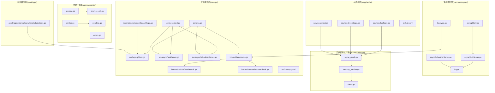

**图表来源**
- [common/asynqx/asynqClient.go:1-31](file://common/asynqx/asynqClient.go#L1-L31)
- [common/asynqx/asynqTaskServer.go:1-87](file://common/asynqx/asynqTaskServer.go#L1-L87)
- [common/asynqx/asynqSchedulerServer.go:1-62](file://common/asynqx/asynqSchedulerServer.go#L1-L62)
- [common/asynqx/tasktype.go:1-10](file://common/asynqx/tasktype.go#L1-L10)
- [common/asynqx/log.go:1-37](file://common/asynqx/log.go#L1-L37)
- [common/mcpx/async_result.go:1-63](file://common/mcpx/async_result.go#L1-L63)
- [common/mcpx/memory_handler.go:1-273](file://common/mcpx/memory_handler.go#L1-L273)
- [common/mcpx/client.go:907-967](file://common/mcpx/client.go#L907-L967)
- [common/antsx/promise.go:1-150](file://common/antsx/promise.go#L1-L150)
- [common/antsx/promise_ext.go:1-134](file://common/antsx/promise_ext.go#L1-L134)
- [common/antsx/emitter.go:1-130](file://common/antsx/emitter.go#L1-L130)
- [common/antsx/pending.go:1-224](file://common/antsx/pending.go#L1-L224)
- [aiapp/aichat/internal/logic/asynctoolcalllogic.go:1-70](file://aiapp/aichat/internal/logic/asynctoolcalllogic.go#L1-L70)
- [aiapp/aichat/internal/logic/asynctoolresultlogic.go:1-58](file://aiapp/aichat/internal/logic/asynctoolresultlogic.go#L1-L58)
- [aiapp/aichat/internal/svc/servicecontext.go:1-38](file://aiapp/aichat/internal/svc/servicecontext.go#L1-L38)

## 核心组件
- 任务客户端（生产者）
  - 通用适配层提供工厂方法创建Asynq客户端，并封装OpenTelemetry链路注入。
  - 应用服务层通过配置对象构造客户端实例，供RPC逻辑发送任务。
- 任务服务器（消费者）
  - 通用适配层封装Asynq.Server创建、并发度、队列优先级、日志桥接与中间件。
  - 应用服务层在ServiceContext中注入AsynqServer，并在主程序中启动。
- 调度器服务器（定时任务）
  - 通用适配层封装Asynq.Scheduler创建、时区、入队后回调与日志桥接。
  - 应用服务层在ServiceContext中注入Scheduler，并在主程序中启动与注册周期任务。
- 任务类型与序列化
  - 通用适配层定义任务类型常量；任务处理器负责payload的序列化与反序列化。
- 执行策略与重试
  - 服务器配置支持失败判定与并发度；调度器支持周期性入队；Inspector用于查询重试任务。
- 配置项
  - Redis连接（Host、Pass）、DB索引（通用适配层可选）、超时与连接池大小（通用适配层可选）；队列优先级在服务器配置中定义。

**更新** 新增异步任务执行系统的核心组件，包括ProgressMessage结构、AsyncToolResult增强、MemoryAsyncResultHandler改进、EventEmitter并发优化、TimingWheel架构重构、Promise增强功能等。

**章节来源**
- [common/asynqx/asynqClient.go:17-30](file://common/asynqx/asynqClient.go#L17-L30)
- [common/asynqx/asynqTaskServer.go:39-64](file://common/asynqx/asynqTaskServer.go#L39-L64)
- [common/asynqx/asynqSchedulerServer.go:32-52](file://common/asynqx/asynqSchedulerServer.go#L32-L52)
- [common/asynqx/tasktype.go:3-9](file://common/asynqx/tasktype.go#L3-L9)
- [zerorpc/internal/svc/asynqClient.go:18-27](file://zerorpc/internal/svc/asynqClient.go#L18-L27)
- [zerorpc/internal/svc/asynqTaskServer.go:35-51](file://zerorpc/internal/svc/asynqTaskServer.go#L35-L51)
- [zerorpc/internal/svc/asynqSchedulerServer.go:34-53](file://zerorpc/internal/svc/asynqSchedulerServer.go#L34-L53)
- [zerorpc/internal/svc/servicecontext.go:87-100](file://zerorpc/internal/svc/servicecontext.go#L87-L100)
- [app/trigger/internal/logic/listretrytaskslogic.go:35-47](file://app/trigger/internal/logic/listretrytaskslogic.go#L35-L47)

## 架构总览
下图展示从RPC入口到任务执行的整体流程，包括链路追踪、任务入队、任务消费与结果写回。

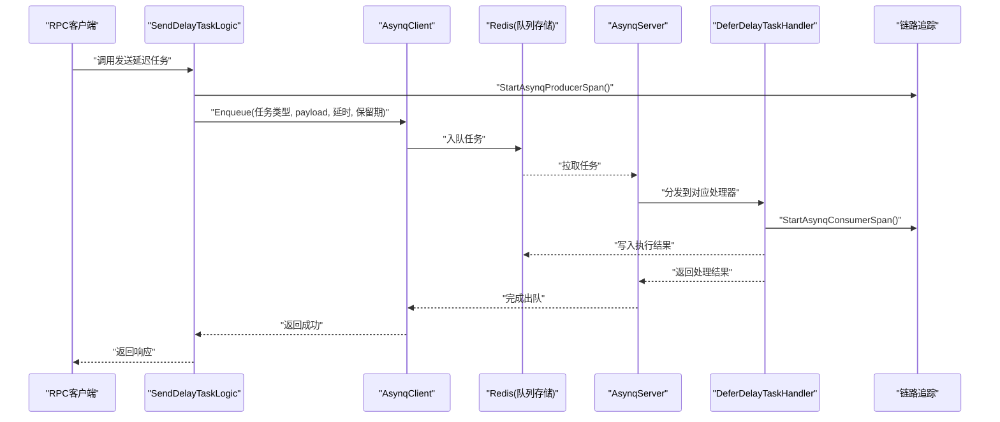

**图表来源**
- [zerorpc/internal/logic/senddelaytasklogic.go:33-51](file://zerorpc/internal/logic/senddelaytasklogic.go#L33-L51)
- [common/asynqx/asynqClient.go:17-19](file://common/asynqx/asynqClient.go#L17-L19)
- [common/asynqx/asynqTaskServer.go:28-37](file://common/asynqx/asynqTaskServer.go#L28-L37)
- [zerorpc/internal/task/deferdelaytask.go:23-36](file://zerorpc/internal/task/deferdelaytask.go#L23-L36)
- [zerorpc/internal/svc/asynqClient.go:22-27](file://zerorpc/internal/svc/asynqClient.go#L22-L27)

## 详细组件分析

### 组件A：任务客户端与链路追踪
- 功能要点
  - 工厂方法创建Asynq客户端与Inspector。
  - 生产端Span注入，携带任务类型属性，便于链路追踪关联。
- 关键点
  - 通用适配层与应用服务层均提供客户端创建与Span工具，确保一致性。
  - Inspector用于运维查询重试任务列表。

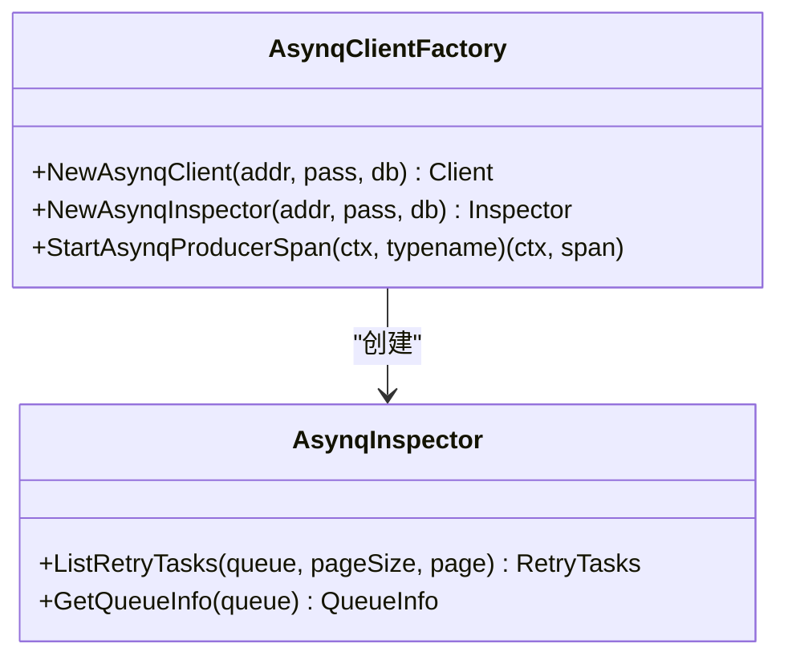

**图表来源**
- [common/asynqx/asynqClient.go:17-30](file://common/asynqx/asynqClient.go#L17-L30)
- [app/trigger/internal/logic/listretrytaskslogic.go:35-47](file://app/trigger/internal/logic/listretrytaskslogic.go#L35-L47)

**章节来源**
- [common/asynqx/asynqClient.go:17-30](file://common/asynqx/asynqClient.go#L17-L30)
- [zerorpc/internal/svc/asynqClient.go:18-27](file://zerorpc/internal/svc/asynqClient.go#L18-L27)
- [app/trigger/internal/logic/listretrytaskslogic.go:35-47](file://app/trigger/internal/logic/listretrytaskslogic.go#L35-L47)

### 组件B：任务服务器与执行策略
- 功能要点
  - 创建Asynq.Server，配置并发度、队列优先级、失败判定、日志桥接。
  - 提供中间件统一记录任务类型、任务ID、耗时与错误。
  - 启停控制。
- 关键点
  - 队列优先级：critical/default/low，权重分别为6/3/1。
  - 并发度：最大同时处理任务数为20。
  - 日志桥接：统一使用go-zero日志库输出。

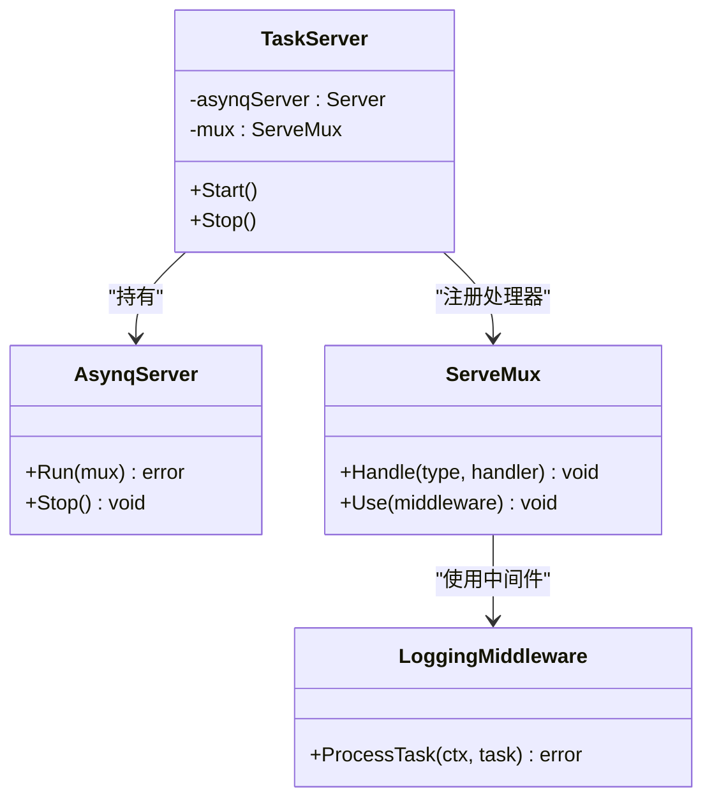

**图表来源**
- [common/asynqx/asynqTaskServer.go:16-37](file://common/asynqx/asynqTaskServer.go#L16-L37)
- [common/asynqx/asynqTaskServer.go:50-64](file://common/asynqx/asynqTaskServer.go#L50-L64)
- [common/asynqx/asynqTaskServer.go:73-86](file://common/asynqx/asynqTaskServer.go#L73-L86)
- [zerorpc/internal/svc/asynqTaskServer.go:15-33](file://zerorpc/internal/svc/asynqTaskServer.go#L15-L33)
- [zerorpc/internal/svc/asynqTaskServer.go:35-51](file://zerorpc/internal/svc/asynqTaskServer.go#L35-L51)
- [zerorpc/internal/svc/asynqTaskServer.go:60-74](file://zerorpc/internal/svc/asynqTaskServer.go#L60-L74)

**章节来源**
- [common/asynqx/asynqTaskServer.go:39-64](file://common/asynqx/asynqTaskServer.go#L39-L64)
- [zerorpc/internal/svc/asynqTaskServer.go:35-51](file://zerorpc/internal/svc/asynqTaskServer.go#L35-L51)

### 组件C：调度器服务器与周期任务
- 功能要点
  - 创建Asynq.Scheduler，指定时区与入队后回调。
  - 注册周期任务表达式，按分钟粒度触发。
  - 启停控制。
- 关键点
  - 时区固定为"Asia/Shanghai"。
  - 入队后回调记录任务ID与类型，便于观测。

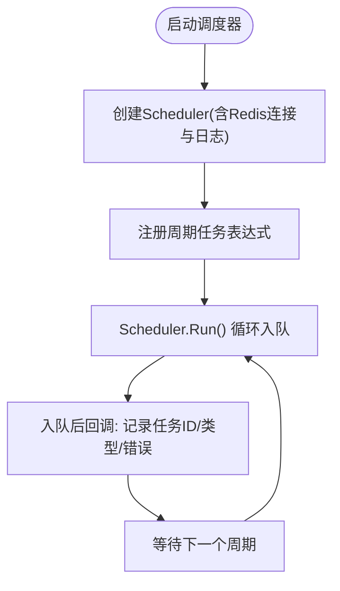

**图表来源**
- [common/asynqx/asynqSchedulerServer.go:32-52](file://common/asynqx/asynqSchedulerServer.go#L32-L52)
- [zerorpc/internal/svc/asynqSchedulerServer.go:34-53](file://zerorpc/internal/svc/asynqSchedulerServer.go#L34-L53)
- [zerorpc/internal/svc/asynqSchedulerServer.go:55-62](file://zerorpc/internal/svc/asynqSchedulerServer.go#L55-L62)

**章节来源**
- [common/asynqx/asynqSchedulerServer.go:32-52](file://common/asynqx/asynqSchedulerServer.go#L32-L52)
- [zerorpc/internal/svc/asynqSchedulerServer.go:34-53](file://zerorpc/internal/svc/asynqSchedulerServer.go#L34-L53)

### 组件D：任务处理器与序列化
- 延迟任务处理器
  - 从payload解析消息体，提取链路上下文，开启消费端Span，执行业务逻辑。
- 转发任务处理器
  - 解析消息体后，向目标URL发起HTTP请求，根据状态码写入执行结果，并在异常时触发告警。
- 关键点
  - payload采用JSON序列化；处理器内部进行反序列化。
  - 使用ResultWriter写回"success/fail"，便于后续统计与重试。

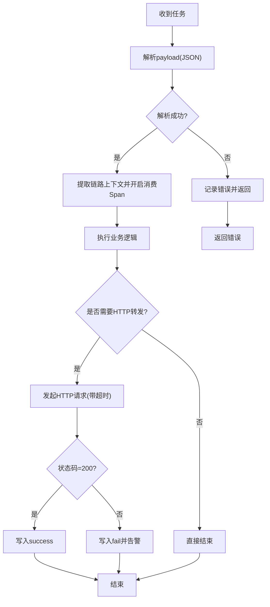

**图表来源**
- [zerorpc/internal/task/deferdelaytask.go:23-36](file://zerorpc/internal/task/deferdelaytask.go#L23-L36)
- [zerorpc/internal/task/deferforwardtask.go:31-96](file://zerorpc/internal/task/deferforwardtask.go#L31-L96)

**章节来源**
- [zerorpc/internal/task/deferdelaytask.go:23-36](file://zerorpc/internal/task/deferdelaytask.go#L23-L36)
- [zerorpc/internal/task/deferforwardtask.go:31-96](file://zerorpc/internal/task/deferforwardtask.go#L31-L96)

### 组件E：任务类型定义与路由注册
- 任务类型
  - 延迟任务、触发任务、协议触发任务、调度器延迟任务。
- 路由注册
  - 在ServeMux中注册处理器，并启用日志中间件。
  - 调度器任务同样注册到ServeMux，随服务器一起运行。

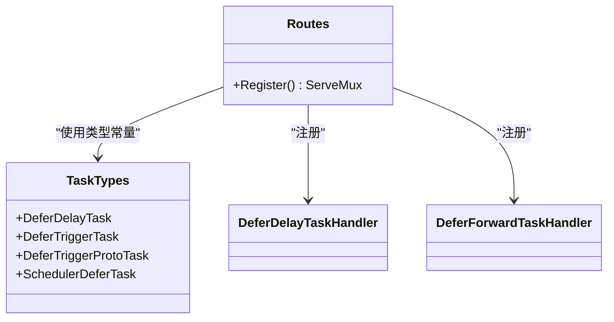

**图表来源**
- [common/asynqx/tasktype.go:3-9](file://common/asynqx/tasktype.go#L3-L9)
- [zerorpc/internal/task/routes.go:22-36](file://zerorpc/internal/task/routes.go#L22-L36)

**章节来源**
- [common/asynqx/tasktype.go:3-9](file://common/asynqx/tasktype.go#L3-L9)
- [zerorpc/internal/task/routes.go:22-36](file://zerorpc/internal/task/routes.go#L22-L36)

### 组件F：RPC入口发送延迟任务
- 流程
  - 从RPC入口接收请求，注入生产端Span，构造消息体并序列化为payload。
  - 指定任务ID、延时时间与保留期，入队到Asynq客户端。
- 关键点
  - 任务ID可复用消息ID，便于幂等与追踪。
  - 保留期用于清理过期任务数据。

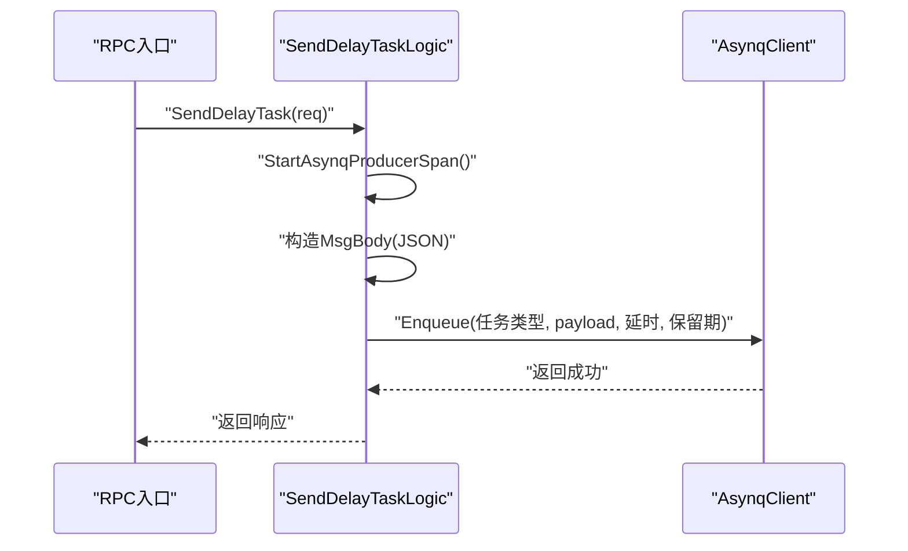

**图表来源**
- [zerorpc/internal/logic/senddelaytasklogic.go:33-51](file://zerorpc/internal/logic/senddelaytasklogic.go#L33-L51)
- [zerorpc/internal/svc/asynqClient.go:18-20](file://zerorpc/internal/svc/asynqClient.go#L18-L20)

**章节来源**
- [zerorpc/internal/logic/senddelaytasklogic.go:33-51](file://zerorpc/internal/logic/senddelaytasklogic.go#L33-L51)

## 异步任务执行系统

### ProgressMessage结构与消息历史管理
异步任务执行系统引入了完整的消息历史管理机制，通过ProgressMessage结构记录任务执行过程中的各种状态变化。

- **消息类型定义**
  - MessageTypeProgress：进度消息，记录任务执行进度
  - MessageTypeComplete：完成消息，记录任务最终状态
  - MessageTypeError：错误消息，记录任务执行错误

- **消息历史管理**
  - MemoryAsyncResultHandler在UpdateProgress和OnComplete时自动追加消息到历史
  - 支持消息合并：当任务完成后，会保留之前的进度消息历史
  - 消息包含时间戳、进度百分比、总进度值和详细描述

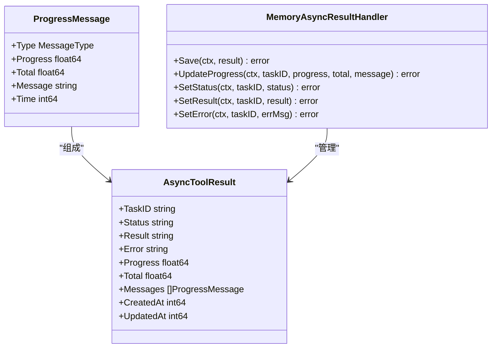

**图表来源**
- [common/mcpx/async_result.go:14-34](file://common/mcpx/async_result.go#L14-L34)
- [common/mcpx/memory_handler.go:77-109](file://common/mcpx/memory_handler.go#L77-L109)
- [common/mcpx/memory_handler.go:226-272](file://common/mcpx/memory_handler.go#L226-L272)

**章节来源**
- [common/mcpx/async_result.go:5-34](file://common/mcpx/async_result.go#L5-L34)
- [common/mcpx/memory_handler.go:77-109](file://common/mcpx/memory_handler.go#L77-L109)
- [common/mcpx/memory_handler.go:226-272](file://common/mcpx/memory_handler.go#L226-L272)

### AsyncToolResult增强与状态管理
AsyncToolResult结构得到了显著增强，提供了更完整的异步任务状态管理能力。

- **状态管理**
  - Status字段支持pending、running、completed、failed四种状态
  - Progress和Total字段提供进度跟踪
  - Messages数组保存完整的消息历史

- **时间戳管理**
  - CreatedAt记录任务创建时间
  - UpdatedAt记录任务最后更新时间
  - 自动更新机制确保时间戳准确性

- **结果存储**
  - Result字段存储成功结果（JSON格式字符串）
  - Error字段存储错误信息
  - 支持复杂结果结构的序列化

**章节来源**
- [common/mcpx/async_result.go:23-34](file://common/mcpx/async_result.go#L23-L34)
- [common/mcpx/memory_handler.go:32-59](file://common/mcpx/memory_handler.go#L32-L59)

### MemoryAsyncResultHandler改进
MemoryAsyncResultHandler实现了完整的异步结果持久化和进度跟踪功能。

- **并发安全**
  - 使用sync.RWMutex确保多协程访问的安全性
  - 支持高并发场景下的读写操作

- **智能合并机制**
  - Save方法支持现有记录的智能合并
  - 保留进度消息的历史记录，避免数据丢失

- **进度更新优化**
  - UpdateProgress方法自动追加进度消息到历史
  - 支持外部回调通知机制
  - 实时更新任务状态和时间戳

**章节来源**
- [common/mcpx/memory_handler.go:17-30](file://common/mcpx/memory_handler.go#L17-L30)
- [common/mcpx/memory_handler.go:32-59](file://common/mcpx/memory_handler.go#L32-L59)
- [common/mcpx/memory_handler.go:77-109](file://common/mcpx/memory_handler.go#L77-L109)

### EventEmitter并发优化
EventEmitter提供了高性能的事件发布订阅机制，支持多主题和多订阅者。

- **并发优化设计**
  - 使用sync.RWMutex实现读写分离
  - 支持动态订阅和取消订阅
  - 非阻塞消息传递机制

- **内存管理**
  - 自动清理空闲的订阅者
  - 支持批量订阅者管理
  - 防止内存泄漏的订阅者清理机制

- **性能特性**
  - 支持可配置的缓冲区大小
  - 非阻塞的事件广播
  - 低延迟的消息传递

**章节来源**
- [common/antsx/emitter.go:13-25](file://common/antsx/emitter.go#L13-L25)
- [common/antsx/emitter.go:27-77](file://common/antsx/emitter.go#L27-L77)
- [common/antsx/emitter.go:79-93](file://common/antsx/emitter.go#L79-L93)

### TimingWheel架构重构
PendingRegistry使用重构后的TimingWheel实现高效的时间轮调度。

- **时间轮优化**
  - 共享ticker机制，避免内存泄漏
  - 可配置的时间轮参数（interval、numSlots）
  - 高效的定时器管理

- **超时处理**
  - 自动超时检测和处理
  - 支持自定义TTL（默认30秒）
  - 超时回调机制

- **资源管理**
  - 自动停止和清理
  - 支持优雅关闭
  - 资源泄漏防护

**章节来源**
- [common/antsx/pending.go:43-86](file://common/antsx/pending.go#L43-L86)
- [common/antsx/pending.go:105-140](file://common/antsx/pending.go#L105-L140)
- [common/antsx/pending.go:142-182](file://common/antsx/pending.go#L142-L182)

### Promise增强功能
Promise系统提供了完整的异步编程能力，支持多种并发模式。

- **基础Promise功能**
  - Await方法支持多次调用
  - Resolve和Reject保证只触发一次
  - 支持错误回调注册

- **高级并发功能**
  - PromiseAll：并发等待所有Promise完成
  - PromiseRace：竞争模式，返回第一个完成的Promise
  - Map和FlatMap：函数式编程支持
  - AwaitWithTimeout：带超时的等待

- **错误处理**
  - 标准化的错误类型定义
  - 支持Promise链式调用
  - 自动错误传播

**章节来源**
- [common/antsx/promise.go:31-63](file://common/antsx/promise.go#L31-L63)
- [common/antsx/promise.go:94-107](file://common/antsx/promise.go#L94-L107)
- [common/antsx/promise.go:141-150](file://common/antsx/promise.go#L141-L150)
- [common/antsx/promise_ext.go:10-43](file://common/antsx/promise_ext.go#L10-L43)
- [common/antsx/promise_ext.go:45-75](file://common/antsx/promise_ext.go#L45-L75)
- [common/antsx/promise_ext.go:77-126](file://common/antsx/promise_ext.go#L77-L126)
- [common/antsx/promise_ext.go:128-134](file://common/antsx/promise_ext.go#L128-L134)

### 异步工具调用流程
AI应用层通过完整的异步工具调用流程，实现了MCP工具的异步执行和结果查询。

- **调用流程**
  - AsyncToolCallLogic接收异步调用请求
  - 创建MemoryProgressHandler处理进度和结果
  - 调用MCP客户端的CallToolAsync方法
  - 立即返回task_id给客户端
  - 后台协程执行工具调用并更新进度

- **结果查询**
  - AsyncToolResultLogic提供结果查询接口
  - 支持轮询查询任务状态
  - 返回完整的消息历史和进度信息

- **前端集成**
  - HTML页面提供实时进度显示
  - WebSocket连接实现实时更新
  - 自动轮询机制确保结果及时获取

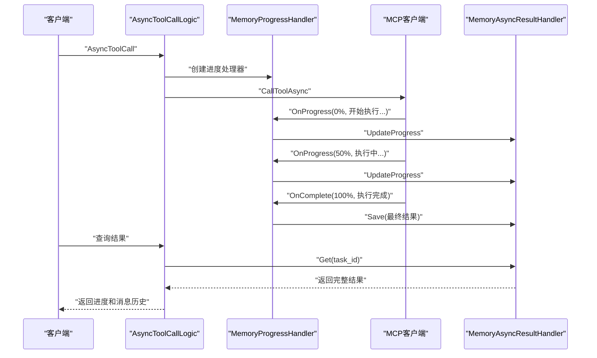

**图表来源**
- [aiapp/aichat/internal/logic/asynctoolcalllogic.go:26-69](file://aiapp/aichat/internal/logic/asynctoolcalllogic.go#L26-L69)
- [common/mcpx/client.go:907-967](file://common/mcpx/client.go#L907-L967)
- [common/mcpx/memory_handler.go:204-224](file://common/mcpx/memory_handler.go#L204-L224)
- [common/mcpx/memory_handler.go:226-272](file://common/mcpx/memory_handler.go#L226-L272)
- [aiapp/aichat/internal/logic/asynctoolresultlogic.go:24-57](file://aiapp/aichat/internal/logic/asynctoolresultlogic.go#L24-L57)

**章节来源**
- [aiapp/aichat/internal/logic/asynctoolcalllogic.go:26-69](file://aiapp/aichat/internal/logic/asynctoolcalllogic.go#L26-L69)
- [aiapp/aichat/internal/logic/asynctoolresultlogic.go:24-57](file://aiapp/aichat/internal/logic/asynctoolresultlogic.go#L24-L57)
- [common/mcpx/client.go:907-967](file://common/mcpx/client.go#L907-L967)
- [common/mcpx/memory_handler.go:204-272](file://common/mcpx/memory_handler.go#L204-L272)

## 依赖分析
- 组件耦合
  - 通用适配层与应用服务层解耦：应用服务层通过配置对象创建客户端、服务器与调度器，避免直接依赖具体实现。
  - 任务处理器仅依赖ServeMux与ServiceContext提供的依赖（如HTTP客户端、告警客户端），保持职责单一。
  - 异步任务执行系统通过接口抽象，支持多种存储后端（内存、Redis等）。
- 外部依赖
  - Redis：作为队列存储与调度器元数据存储。
  - OpenTelemetry：贯穿生产端与消费端，实现跨进程链路追踪。
  - go-zero日志与时间工具：统一日志格式与耗时统计。
  - go-zero TimingWheel：高效的定时器管理。
- 潜在循环依赖
  - 未发现直接循环依赖；通用适配层被应用服务层依赖，任务处理器依赖通用类型常量，整体呈单向依赖。

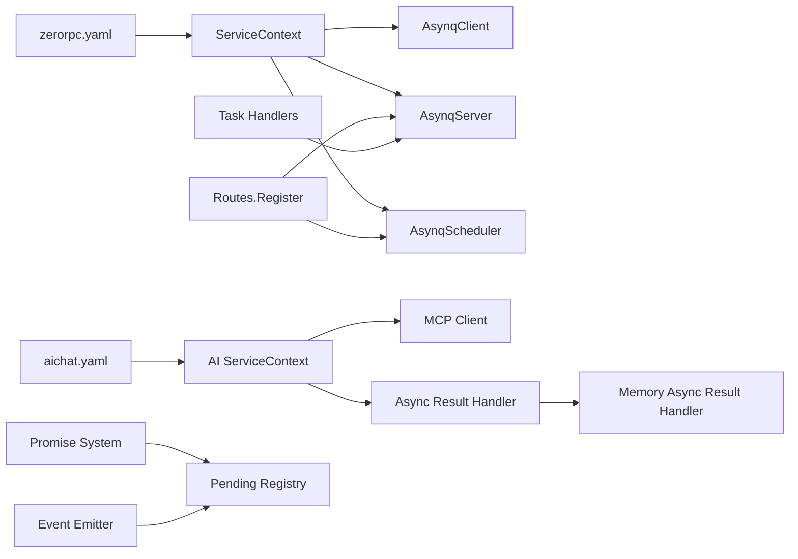

**图表来源**
- [zerorpc/etc/zerorpc.yaml:13-21](file://zerorpc/etc/zerorpc.yaml#L13-L21)
- [zerorpc/internal/svc/servicecontext.go:87-100](file://zerorpc/internal/svc/servicecontext.go#L87-L100)
- [zerorpc/internal/task/routes.go:22-36](file://zerorpc/internal/task/routes.go#L22-L36)
- [aiapp/aichat/etc/aichat.yaml:8-18](file://aiapp/aichat/etc/aichat.yaml#L8-L18)
- [aiapp/aichat/internal/svc/servicecontext.go:18-37](file://aiapp/aichat/internal/svc/servicecontext.go#L18-L37)

**章节来源**
- [zerorpc/etc/zerorpc.yaml:13-21](file://zerorpc/etc/zerorpc.yaml#L13-L21)
- [zerorpc/internal/svc/servicecontext.go:87-100](file://zerorpc/internal/svc/servicecontext.go#L87-L100)

## 性能考虑
- 连接与超时
  - 通用适配层提供可配置的连接超时与连接池大小，建议结合实际QPS调整PoolSize与超时参数。
- 并发与队列
  - 服务器并发度为20，队列优先级为critical/default/low=6/3/1；建议根据业务紧急程度合理分配任务类型与权重。
- 中间件开销
  - LoggingMiddleware会记录每次任务的开始、耗时与结果，建议在高吞吐场景下评估日志级别与字段数量。
- 调度器频率
  - 调度器以分钟级表达式触发，建议避免过于频繁的高频任务，防止Redis压力过大。
- 异步任务性能
  - MemoryAsyncResultHandler使用go-zero Cache，支持高并发访问
  - EventEmitter采用读写分离锁，优化并发性能
  - TimingWheel共享ticker，避免内存泄漏
  - Promise系统支持并发等待和快速失败

**更新** 新增异步任务执行系统的性能优化考虑，包括内存缓存、并发锁优化、定时器共享等。

## 故障排查指南
- 常见问题
  - 无法连接Redis：检查Host与Password配置，确认网络连通。
  - 任务堆积：检查服务器并发度与队列权重，观察日志中间件输出的耗时与错误。
  - 调度器未入队：确认时区设置与表达式正确，关注入队后回调日志。
  - 任务重试过多：使用Inspector列出重试任务，定位失败原因并修复。
  - 异步任务结果丢失：检查MemoryAsyncResultHandler的缓存配置和过期时间。
  - 进度消息不完整：验证MemoryProgressHandler的OnProgress和OnComplete调用。
- 排查步骤
  - 查看任务服务器日志，定位错误类型与任务ID。
  - 使用Inspector查询重试队列，核对队列信息与任务详情。
  - 结合链路追踪，回溯生产端与消费端的Span，定位异常环节。
  - 检查异步任务执行日志，验证消息历史的完整性。

**更新** 新增异步任务执行系统的故障排查指南，包括结果存储、进度跟踪、消息历史等方面的排查方法。

**章节来源**
- [app/trigger/internal/logic/listretrytaskslogic.go:35-47](file://app/trigger/internal/logic/listretrytaskslogic.go#L35-L47)
- [common/asynqx/asynqTaskServer.go:73-86](file://common/asynqx/asynqTaskServer.go#L73-L86)
- [common/asynqx/asynqSchedulerServer.go:45-49](file://common/asynqx/asynqSchedulerServer.go#L45-L49)

## 结论
Zero-Service的异步任务组件以Asynq为核心，通过通用适配层与应用服务层的清晰分工，实现了任务客户端、任务服务器、调度器服务器的一体化集成。配合链路追踪、统一日志与Inspector运维能力，满足了延迟任务、周期任务与转发任务等多种场景的需求。

**更新** 本次更新显著增强了异步任务执行系统的完整性和功能性，新增的ProgressMessage结构、AsyncToolResult增强、MemoryAsyncResultHandler改进、EventEmitter并发优化、TimingWheel架构重构、Promise增强功能等重大功能，使得系统具备了完整的异步任务生命周期管理能力，支持复杂的进度跟踪、消息历史管理和并发控制需求。建议在生产环境中结合业务负载调整并发与队列权重，并完善监控与告警体系。

## 附录

### 配置项说明（来自配置文件）
- Redis
  - Host：Redis地址
  - Type：节点模式
  - Key：缓存键前缀
- 缓存
  - Host：Redis地址
  - Pass：密码
- 数据库
  - DataSource：MySQL连接串
- 链路追踪（注释）
  - Telemetry：遥测名称、采样率、批量器等（当前未启用）
- MCP配置（AI应用）
  - Servers：MCP服务器列表
  - RefreshInterval：配置刷新间隔
  - ConnectTimeout：连接超时时间
  - ServiceToken：服务认证令牌

**更新** 新增MCP配置项说明，支持异步工具调用的配置管理。

**章节来源**
- [zerorpc/etc/zerorpc.yaml:13-21](file://zerorpc/etc/zerorpc.yaml#L13-L21)
- [zerorpc/etc/zerorpc.yaml:22-28](file://zerorpc/etc/zerorpc.yaml#L22-L28)
- [aiapp/aichat/etc/aichat.yaml:8-18](file://aiapp/aichat/etc/aichat.yaml#L8-L18)

### 任务生命周期与故障恢复
- 生命周期
  - 入队：RPC逻辑或调度器将任务写入Redis。
  - 拉取：任务服务器从Redis拉取任务并分发给处理器。
  - 执行：处理器执行业务逻辑，必要时写入结果。
  - 清理：超过保留期的任务数据被清理。
- 故障恢复
  - 失败判定：服务器配置IsFailure，默认所有错误视为失败。
  - 重试：Inspector可用于列出重试任务，结合日志与告警定位问题。
  - 告警：转发任务失败时触发告警，记录TraceID与错误详情。
- 异步任务生命周期
  - 创建：AsyncToolCallLogic接收请求并创建MemoryProgressHandler
  - 执行：MCP客户端后台执行工具调用，实时更新进度
  - 完成：OnComplete保存最终结果和消息历史
  - 查询：AsyncToolResultLogic提供结果查询接口

**更新** 新增异步任务执行系统的完整生命周期管理，包括创建、执行、完成、查询等阶段的状态管理。

**章节来源**
- [common/asynqx/asynqTaskServer.go:50-54](file://common/asynqx/asynqTaskServer.go#L50-L54)
- [zerorpc/internal/task/deferforwardtask.go:53-66](file://zerorpc/internal/task/deferforwardtask.go#L53-L66)
- [app/trigger/internal/logic/listretrytaskslogic.go:35-47](file://app/trigger/internal/logic/listretrytaskslogic.go#L35-L47)
- [aiapp/aichat/internal/logic/asynctoolcalllogic.go:26-69](file://aiapp/aichat/internal/logic/asynctoolcalllogic.go#L26-L69)
- [common/mcpx/client.go:907-967](file://common/mcpx/client.go#L907-L967)

### 异步任务状态管理
- 状态定义
  - pending：任务等待执行
  - running：任务执行中
  - completed：任务已完成
  - failed：任务执行失败
- 进度跟踪
  - Progress字段：当前进度百分比（0.0-100.0）
  - Total字段：进度总值（通常为100.0）
  - Messages数组：完整的消息历史记录
- 结果存储
  - Result字段：成功时的JSON格式结果
  - Error字段：失败时的错误信息
  - 时间戳：CreatedAT和UpdatedAt自动管理

**更新** 新增异步任务状态管理的详细说明，包括状态定义、进度跟踪、结果存储等核心功能。

**章节来源**
- [common/mcpx/async_result.go:23-34](file://common/mcpx/async_result.go#L23-L34)
- [common/mcpx/memory_handler.go:111-153](file://common/mcpx/memory_handler.go#L111-L153)
- [aiapp/aichat/aichat/aichat.pb.go:1022-1046](file://aiapp/aichat/aichat/aichat.pb.go#L1022-L1046)