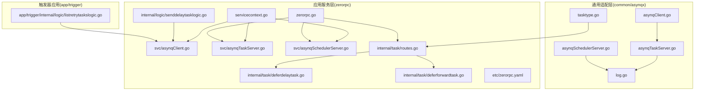
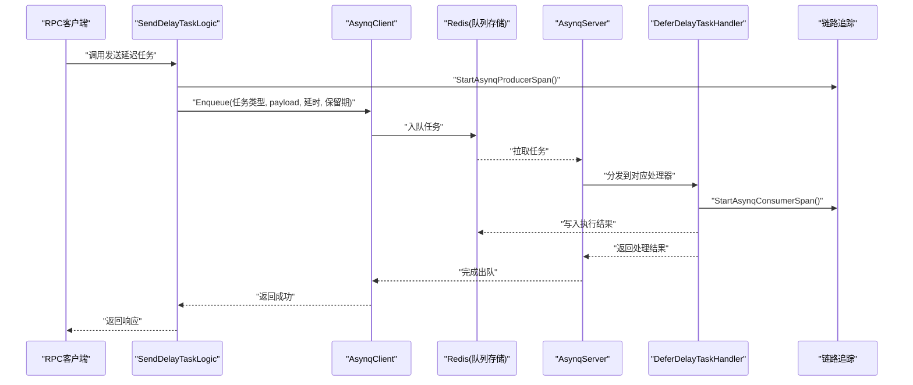
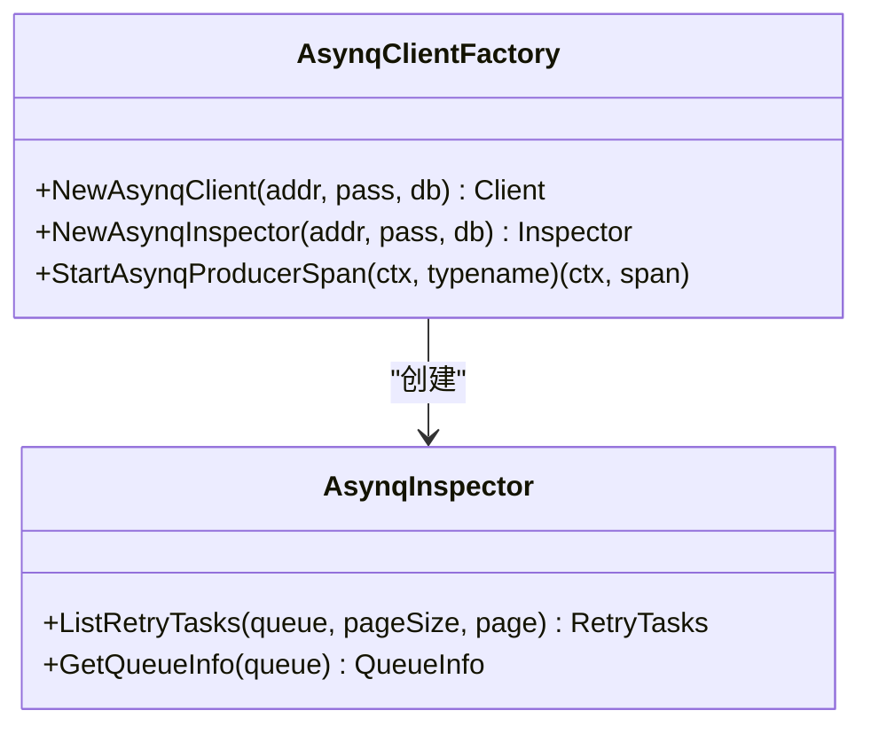
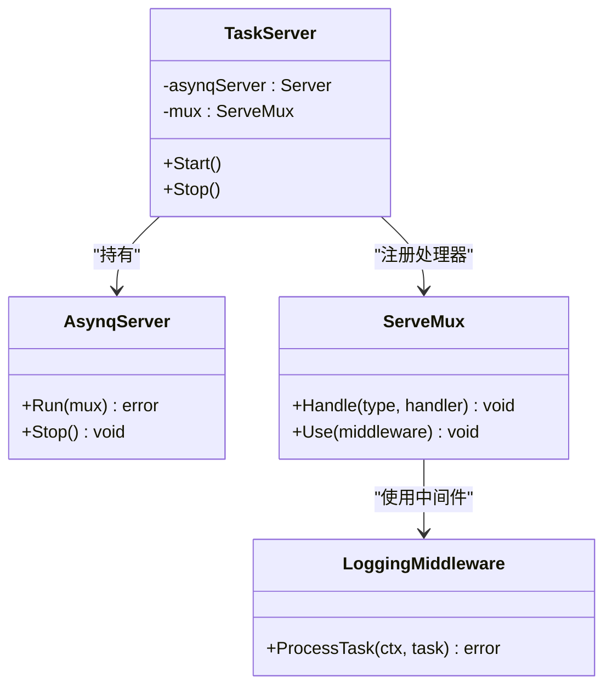
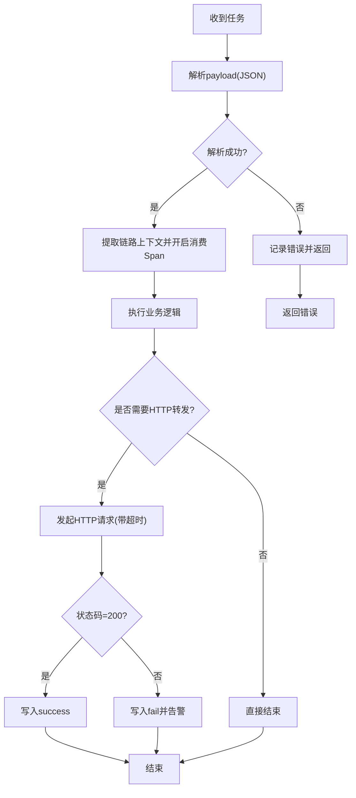
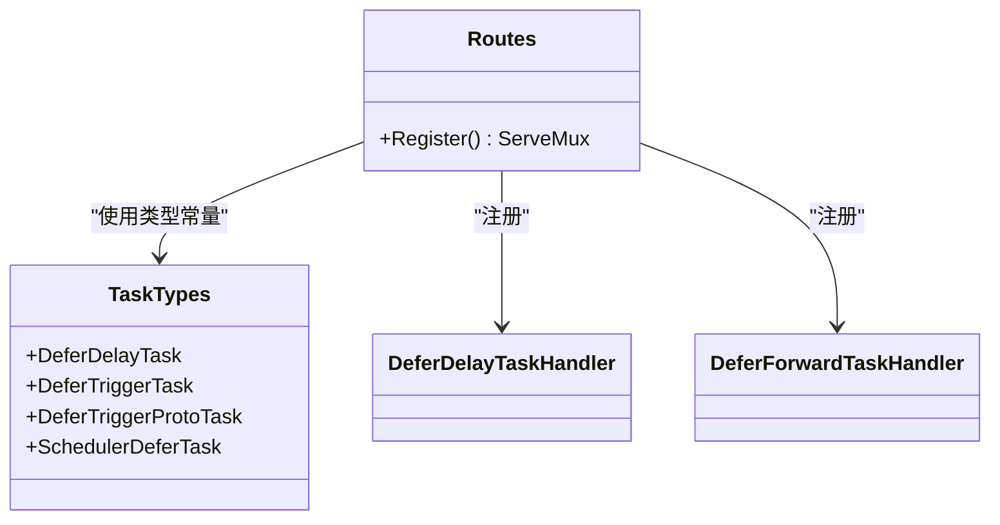
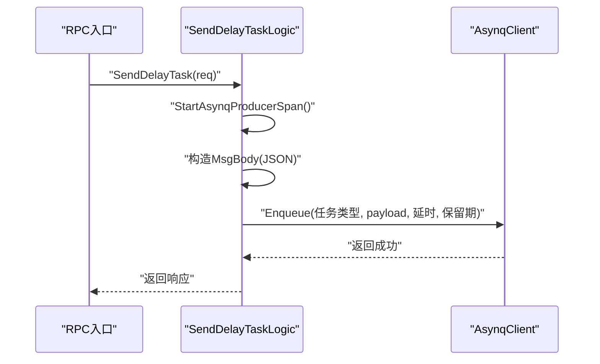
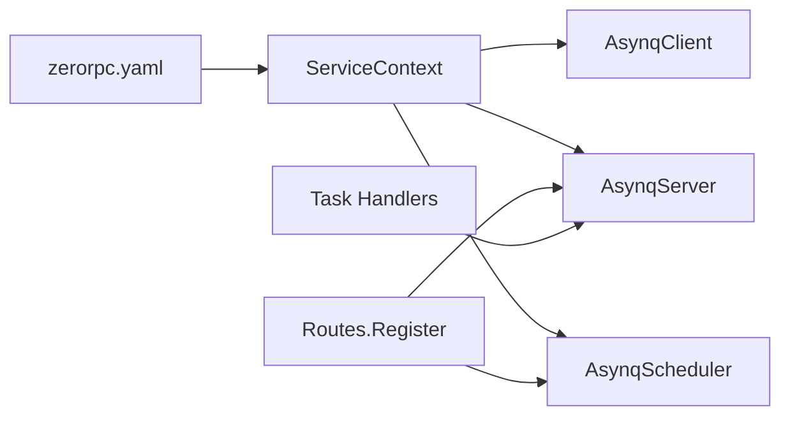

# 异步任务组件

<cite>
**本文引用的文件**
- [common/asynqx/asynqClient.go](file://common/asynqx/asynqClient.go)
- [common/asynqx/asynqTaskServer.go](file://common/asynqx/asynqTaskServer.go)
- [common/asynqx/asynqSchedulerServer.go](file://common/asynqx/asynqSchedulerServer.go)
- [common/asynqx/tasktype.go](file://common/asynqx/tasktype.go)
- [common/asynqx/log.go](file://common/asynqx/log.go)
- [zerorpc/internal/svc/asynqClient.go](file://zerorpc/internal/svc/asynqClient.go)
- [zerorpc/internal/svc/asynqTaskServer.go](file://zerorpc/internal/svc/asynqTaskServer.go)
- [zerorpc/internal/svc/asynqSchedulerServer.go](file://zerorpc/internal/svc/asynqSchedulerServer.go)
- [zerorpc/internal/svc/servicecontext.go](file://zerorpc/internal/svc/servicecontext.go)
- [zerorpc/internal/task/routes.go](file://zerorpc/internal/task/routes.go)
- [zerorpc/internal/task/deferdelaytask.go](file://zerorpc/internal/task/deferdelaytask.go)
- [zerorpc/internal/task/deferforwardtask.go](file://zerorpc/internal/task/deferforwardtask.go)
- [zerorpc/internal/logic/senddelaytasklogic.go](file://zerorpc/internal/logic/senddelaytasklogic.go)
- [zerorpc/etc/zerorpc.yaml](file://zerorpc/etc/zerorpc.yaml)
- [zerorpc/zerorpc.go](file://zerorpc/zerorpc.go)
- [app/trigger/internal/logic/listretrytaskslogic.go](file://app/trigger/internal/logic/listretrytaskslogic.go)
</cite>

## 目录
1. [简介](#简介)
2. [项目结构](#项目结构)
3. [核心组件](#核心组件)
4. [架构总览](#架构总览)
5. [详细组件分析](#详细组件分析)
6. [依赖分析](#依赖分析)
7. [性能考虑](#性能考虑)
8. [故障排查指南](#故障排查指南)
9. [结论](#结论)
10. [附录](#附录)

## 简介
本技术文档面向Zero-Service的异步任务组件，系统性阐述基于Asynq的任务队列集成与使用，覆盖任务客户端配置、任务服务器设置、调度器服务器实现、任务类型定义、序列化与反序列化、执行策略与重试机制、配置项（Redis连接、任务优先级、超时控制）、完整任务定义示例、执行流程图、错误处理策略、性能监控方法、生命周期管理、故障恢复机制与最佳实践。

## 项目结构
异步任务能力在项目中主要由以下模块构成：
- 通用适配层（common/asynqx）：封装Asynq客户端、任务服务器、调度器服务器、任务类型常量、日志桥接。
- 应用服务层（zerorpc）：在具体服务中复用通用适配层，构建ServiceContext并启动任务与调度器。
- 任务处理器（zerorpc/internal/task）：定义具体任务处理器，注册到ServeMux。
- 配置（zerorpc/etc/zerorpc.yaml）：定义Redis连接、缓存、数据库等运行参数。
- 典型任务逻辑（zerorpc/internal/logic/senddelaytasklogic.go）：演示如何从RPC入口发送延迟任务。
- 触发器应用（app/trigger）：提供任务查询与重试列表等运维能力。

图表来源
- [common/asynqx/asynqClient.go:1-31](file://common/asynqx/asynqClient.go#L1-L31)
- [common/asynqx/asynqTaskServer.go:1-87](file://common/asynqx/asynqTaskServer.go#L1-L87)
- [common/asynqx/asynqSchedulerServer.go:1-62](file://common/asynqx/asynqSchedulerServer.go#L1-L62)
- [common/asynqx/tasktype.go:1-10](file://common/asynqx/tasktype.go#L1-L10)
- [common/asynqx/log.go:1-37](file://common/asynqx/log.go#L1-L37)
- [zerorpc/internal/svc/servicecontext.go:1-102](file://zerorpc/internal/svc/servicecontext.go#L1-L102)
- [zerorpc/internal/svc/asynqClient.go:1-28](file://zerorpc/internal/svc/asynqClient.go#L1-L28)
- [zerorpc/internal/svc/asynqTaskServer.go:1-75](file://zerorpc/internal/svc/asynqTaskServer.go#L1-L75)
- [zerorpc/internal/svc/asynqSchedulerServer.go:1-63](file://zerorpc/internal/svc/asynqSchedulerServer.go#L1-L63)
- [zerorpc/internal/task/routes.go:1-37](file://zerorpc/internal/task/routes.go#L1-L37)
- [zerorpc/internal/task/deferdelaytask.go:1-37](file://zerorpc/internal/task/deferdelaytask.go#L1-L37)
- [zerorpc/internal/task/deferforwardtask.go:1-97](file://zerorpc/internal/task/deferforwardtask.go#L1-L97)
- [zerorpc/internal/logic/senddelaytasklogic.go:1-52](file://zerorpc/internal/logic/senddelaytasklogic.go#L1-L52)
- [zerorpc/etc/zerorpc.yaml:1-39](file://zerorpc/etc/zerorpc.yaml#L1-L39)
- [zerorpc/zerorpc.go:1-59](file://zerorpc/zerorpc.go#L1-L59)
- [app/trigger/internal/logic/listretrytaskslogic.go:1-52](file://app/trigger/internal/logic/listretrytaskslogic.go#L1-L52)

章节来源
- [zerorpc/zerorpc.go:26-58](file://zerorpc/zerorpc.go#L26-L58)
- [zerorpc/etc/zerorpc.yaml:13-21](file://zerorpc/etc/zerorpc.yaml#L13-L21)

## 核心组件
- 任务客户端（生产者）
  - 通用适配层提供工厂方法创建Asynq客户端，并封装OpenTelemetry链路注入。
  - 应用服务层通过配置对象构造客户端实例，供RPC逻辑发送任务。
- 任务服务器（消费者）
  - 通用适配层封装Asynq.Server创建、并发度、队列优先级、日志桥接与中间件。
  - 应用服务层在ServiceContext中注入AsynqServer，并在主程序中启动。
- 调度器服务器（定时任务）
  - 通用适配层封装Asynq.Scheduler创建、时区、入队后回调与日志桥接。
  - 应用服务层在ServiceContext中注入Scheduler，并在主程序中启动与注册周期任务。
- 任务类型与序列化
  - 通用适配层定义任务类型常量；任务处理器负责payload的序列化与反序列化。
- 执行策略与重试
  - 服务器配置支持失败判定与并发度；调度器支持周期性入队；Inspector用于查询重试任务。
- 配置项
  - Redis连接（Host、Pass）、DB索引（通用适配层可选）、超时与连接池大小（通用适配层可选）；队列优先级在服务器配置中定义。

章节来源
- [common/asynqx/asynqClient.go:17-30](file://common/asynqx/asynqClient.go#L17-L30)
- [common/asynqx/asynqTaskServer.go:39-64](file://common/asynqx/asynqTaskServer.go#L39-L64)
- [common/asynqx/asynqSchedulerServer.go:32-52](file://common/asynqx/asynqSchedulerServer.go#L32-L52)
- [common/asynqx/tasktype.go:3-9](file://common/asynqx/tasktype.go#L3-L9)
- [zerorpc/internal/svc/asynqClient.go:18-27](file://zerorpc/internal/svc/asynqClient.go#L18-L27)
- [zerorpc/internal/svc/asynqTaskServer.go:35-51](file://zerorpc/internal/svc/asynqTaskServer.go#L35-L51)
- [zerorpc/internal/svc/asynqSchedulerServer.go:34-53](file://zerorpc/internal/svc/asynqSchedulerServer.go#L34-L53)
- [zerorpc/internal/svc/servicecontext.go:87-100](file://zerorpc/internal/svc/servicecontext.go#L87-L100)
- [app/trigger/internal/logic/listretrytaskslogic.go:35-47](file://app/trigger/internal/logic/listretrytaskslogic.go#L35-L47)

## 架构总览
下图展示从RPC入口到任务执行的整体流程，包括链路追踪、任务入队、任务消费与结果写回。

图表来源
- [zerorpc/internal/logic/senddelaytasklogic.go:33-51](file://zerorpc/internal/logic/senddelaytasklogic.go#L33-L51)
- [common/asynqx/asynqClient.go:17-19](file://common/asynqx/asynqClient.go#L17-L19)
- [common/asynqx/asynqTaskServer.go:28-37](file://common/asynqx/asynqTaskServer.go#L28-L37)
- [zerorpc/internal/task/deferdelaytask.go:23-36](file://zerorpc/internal/task/deferdelaytask.go#L23-L36)
- [zerorpc/internal/svc/asynqClient.go:22-27](file://zerorpc/internal/svc/asynqClient.go#L22-L27)

## 详细组件分析

### 组件A：任务客户端与链路追踪
- 功能要点
  - 工厂方法创建Asynq客户端与Inspector。
  - 生产端Span注入，携带任务类型属性，便于链路追踪关联。
- 关键点
  - 通用适配层与应用服务层均提供客户端创建与Span工具，确保一致性。
  - Inspector用于运维查询重试任务列表。

图表来源
- [common/asynqx/asynqClient.go:17-30](file://common/asynqx/asynqClient.go#L17-L30)
- [app/trigger/internal/logic/listretrytaskslogic.go:35-47](file://app/trigger/internal/logic/listretrytaskslogic.go#L35-L47)

章节来源
- [common/asynqx/asynqClient.go:17-30](file://common/asynqx/asynqClient.go#L17-L30)
- [zerorpc/internal/svc/asynqClient.go:18-27](file://zerorpc/internal/svc/asynqClient.go#L18-L27)
- [app/trigger/internal/logic/listretrytaskslogic.go:35-47](file://app/trigger/internal/logic/listretrytaskslogic.go#L35-L47)

### 组件B：任务服务器与执行策略
- 功能要点
  - 创建Asynq.Server，配置并发度、队列优先级、失败判定、日志桥接。
  - 提供中间件统一记录任务类型、任务ID、耗时与错误。
  - 启停控制。
- 关键点
  - 队列优先级：critical/default/low，权重分别为6/3/1。
  - 并发度：最大同时处理任务数为20。
  - 日志桥接：统一使用go-zero日志库输出。

图表来源
- [common/asynqx/asynqTaskServer.go:16-37](file://common/asynqx/asynqTaskServer.go#L16-L37)
- [common/asynqx/asynqTaskServer.go:50-64](file://common/asynqx/asynqTaskServer.go#L50-L64)
- [common/asynqx/asynqTaskServer.go:73-86](file://common/asynqx/asynqTaskServer.go#L73-L86)
- [zerorpc/internal/svc/asynqTaskServer.go:15-33](file://zerorpc/internal/svc/asynqTaskServer.go#L15-L33)
- [zerorpc/internal/svc/asynqTaskServer.go:35-51](file://zerorpc/internal/svc/asynqTaskServer.go#L35-L51)
- [zerorpc/internal/svc/asynqTaskServer.go:60-74](file://zerorpc/internal/svc/asynqTaskServer.go#L60-L74)

章节来源
- [common/asynqx/asynqTaskServer.go:39-64](file://common/asynqx/asynqTaskServer.go#L39-L64)
- [zerorpc/internal/svc/asynqTaskServer.go:35-51](file://zerorpc/internal/svc/asynqTaskServer.go#L35-L51)

### 组件C：调度器服务器与周期任务
- 功能要点
  - 创建Asynq.Scheduler，指定时区与入队后回调。
  - 注册周期任务表达式，按分钟粒度触发。
  - 启停控制。
- 关键点
  - 时区固定为“Asia/Shanghai”。
  - 入队后回调记录任务ID与类型，便于观测。

图表来源
- [common/asynqx/asynqSchedulerServer.go:32-52](file://common/asynqx/asynqSchedulerServer.go#L32-L52)
- [zerorpc/internal/svc/asynqSchedulerServer.go:34-53](file://zerorpc/internal/svc/asynqSchedulerServer.go#L34-L53)
- [zerorpc/internal/svc/asynqSchedulerServer.go:55-62](file://zerorpc/internal/svc/asynqSchedulerServer.go#L55-L62)

章节来源
- [common/asynqx/asynqSchedulerServer.go:32-52](file://common/asynqx/asynqSchedulerServer.go#L32-L52)
- [zerorpc/internal/svc/asynqSchedulerServer.go:34-53](file://zerorpc/internal/svc/asynqSchedulerServer.go#L34-L53)

### 组件D：任务处理器与序列化
- 延迟任务处理器
  - 从payload解析消息体，提取链路上下文，开启消费端Span，执行业务逻辑。
- 转发任务处理器
  - 解析消息体后，向目标URL发起HTTP请求，根据状态码写入执行结果，并在异常时触发告警。
- 关键点
  - payload采用JSON序列化；处理器内部进行反序列化。
  - 使用ResultWriter写回“success/fail”，便于后续统计与重试。

图表来源
- [zerorpc/internal/task/deferdelaytask.go:23-36](file://zerorpc/internal/task/deferdelaytask.go#L23-L36)
- [zerorpc/internal/task/deferforwardtask.go:31-96](file://zerorpc/internal/task/deferforwardtask.go#L31-L96)

章节来源
- [zerorpc/internal/task/deferdelaytask.go:23-36](file://zerorpc/internal/task/deferdelaytask.go#L23-L36)
- [zerorpc/internal/task/deferforwardtask.go:31-96](file://zerorpc/internal/task/deferforwardtask.go#L31-L96)

### 组件E：任务类型定义与路由注册
- 任务类型
  - 延迟任务、触发任务、协议触发任务、调度器延迟任务。
- 路由注册
  - 在ServeMux中注册处理器，并启用日志中间件。
  - 调度器任务同样注册到ServeMux，随服务器一起运行。

图表来源
- [common/asynqx/tasktype.go:3-9](file://common/asynqx/tasktype.go#L3-L9)
- [zerorpc/internal/task/routes.go:22-36](file://zerorpc/internal/task/routes.go#L22-L36)

章节来源
- [common/asynqx/tasktype.go:3-9](file://common/asynqx/tasktype.go#L3-L9)
- [zerorpc/internal/task/routes.go:22-36](file://zerorpc/internal/task/routes.go#L22-L36)

### 组件F：RPC入口发送延迟任务
- 流程
  - 从RPC入口接收请求，注入生产端Span，构造消息体并序列化为payload。
  - 指定任务ID、延时时间与保留期，入队到Asynq客户端。
- 关键点
  - 任务ID可复用消息ID，便于幂等与追踪。
  - 保留期用于清理过期任务数据。

图表来源
- [zerorpc/internal/logic/senddelaytasklogic.go:33-51](file://zerorpc/internal/logic/senddelaytasklogic.go#L33-L51)
- [zerorpc/internal/svc/asynqClient.go:18-20](file://zerorpc/internal/svc/asynqClient.go#L18-L20)

章节来源
- [zerorpc/internal/logic/senddelaytasklogic.go:33-51](file://zerorpc/internal/logic/senddelaytasklogic.go#L33-L51)

## 依赖分析
- 组件耦合
  - 通用适配层与应用服务层解耦：应用服务层通过配置对象创建客户端、服务器与调度器，避免直接依赖具体实现。
  - 任务处理器仅依赖ServeMux与ServiceContext提供的依赖（如HTTP客户端、告警客户端），保持职责单一。
- 外部依赖
  - Redis：作为队列存储与调度器元数据存储。
  - OpenTelemetry：贯穿生产端与消费端，实现跨进程链路追踪。
  - go-zero日志与时间工具：统一日志格式与耗时统计。
- 潜在循环依赖
  - 未发现直接循环依赖；通用适配层被应用服务层依赖，任务处理器依赖通用类型常量，整体呈单向依赖。

图表来源
- [zerorpc/etc/zerorpc.yaml:13-21](file://zerorpc/etc/zerorpc.yaml#L13-L21)
- [zerorpc/internal/svc/servicecontext.go:87-100](file://zerorpc/internal/svc/servicecontext.go#L87-L100)
- [zerorpc/internal/task/routes.go:22-36](file://zerorpc/internal/task/routes.go#L22-L36)

章节来源
- [zerorpc/etc/zerorpc.yaml:13-21](file://zerorpc/etc/zerorpc.yaml#L13-L21)
- [zerorpc/internal/svc/servicecontext.go:87-100](file://zerorpc/internal/svc/servicecontext.go#L87-L100)

## 性能考虑
- 连接与超时
  - 通用适配层提供可配置的连接超时与连接池大小，建议结合实际QPS调整PoolSize与超时参数。
- 并发与队列
  - 服务器并发度为20，队列优先级为critical/default/low=6/3/1；建议根据业务紧急程度合理分配任务类型与权重。
- 中间件开销
  - LoggingMiddleware会记录每次任务的开始、耗时与结果，建议在高吞吐场景下评估日志级别与字段数量。
- 调度器频率
  - 调度器以分钟级表达式触发，建议避免过于频繁的高频任务，防止Redis压力过大。

## 故障排查指南
- 常见问题
  - 无法连接Redis：检查Host与Password配置，确认网络连通。
  - 任务堆积：检查服务器并发度与队列权重，观察日志中间件输出的耗时与错误。
  - 调度器未入队：确认时区设置与表达式正确，关注入队后回调日志。
  - 任务重试过多：使用Inspector列出重试任务，定位失败原因并修复。
- 排查步骤
  - 查看任务服务器日志，定位错误类型与任务ID。
  - 使用Inspector查询重试队列，核对队列信息与任务详情。
  - 结合链路追踪，回溯生产端与消费端的Span，定位异常环节。

章节来源
- [app/trigger/internal/logic/listretrytaskslogic.go:35-47](file://app/trigger/internal/logic/listretrytaskslogic.go#L35-L47)
- [common/asynqx/asynqTaskServer.go:73-86](file://common/asynqx/asynqTaskServer.go#L73-L86)
- [common/asynqx/asynqSchedulerServer.go:45-49](file://common/asynqx/asynqSchedulerServer.go#L45-L49)

## 结论
Zero-Service的异步任务组件以Asynq为核心，通过通用适配层与应用服务层的清晰分工，实现了任务客户端、任务服务器、调度器服务器的一体化集成。配合链路追踪、统一日志与Inspector运维能力，满足了延迟任务、周期任务与转发任务等多种场景的需求。建议在生产环境中结合业务负载调整并发与队列权重，并完善监控与告警体系。

## 附录

### 配置项说明（来自配置文件）
- Redis
  - Host：Redis地址
  - Type：节点模式
  - Key：缓存键前缀
- 缓存
  - Host：Redis地址
  - Pass：密码
- 数据库
  - DataSource：MySQL连接串
- 链路追踪（注释）
  - Telemetry：遥测名称、采样率、批量器等（当前未启用）

章节来源
- [zerorpc/etc/zerorpc.yaml:13-21](file://zerorpc/etc/zerorpc.yaml#L13-L21)
- [zerorpc/etc/zerorpc.yaml:22-28](file://zerorpc/etc/zerorpc.yaml#L22-L28)

### 任务生命周期与故障恢复
- 生命周期
  - 入队：RPC逻辑或调度器将任务写入Redis。
  - 拉取：任务服务器从Redis拉取任务并分发给处理器。
  - 执行：处理器执行业务逻辑，必要时写入结果。
  - 清理：超过保留期的任务数据被清理。
- 故障恢复
  - 失败判定：服务器配置IsFailure，默认所有错误视为失败。
  - 重试：Inspector可用于列出重试任务，结合日志与告警定位问题。
  - 告警：转发任务失败时触发告警，记录TraceID与错误详情。

章节来源
- [common/asynqx/asynqTaskServer.go:50-54](file://common/asynqx/asynqTaskServer.go#L50-L54)
- [zerorpc/internal/task/deferforwardtask.go:53-66](file://zerorpc/internal/task/deferforwardtask.go#L53-L66)
- [app/trigger/internal/logic/listretrytaskslogic.go:35-47](file://app/trigger/internal/logic/listretrytaskslogic.go#L35-L47)