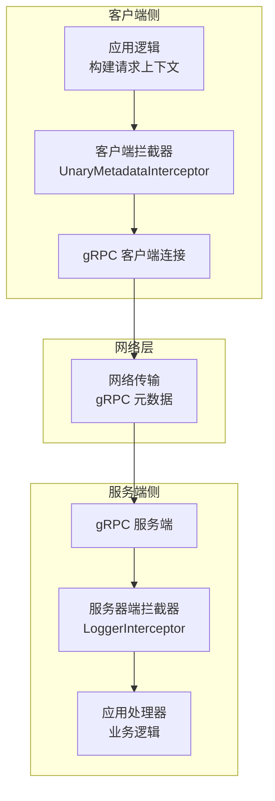
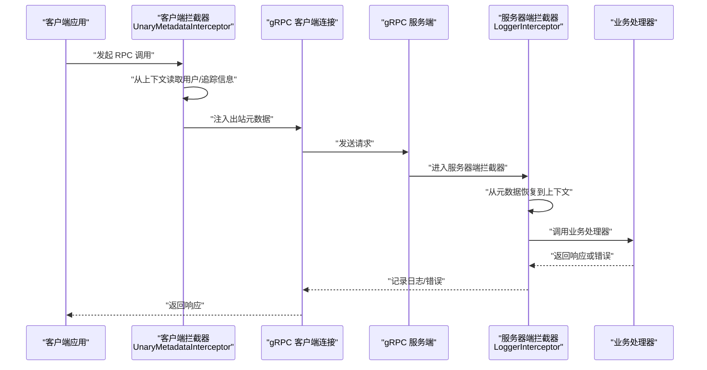
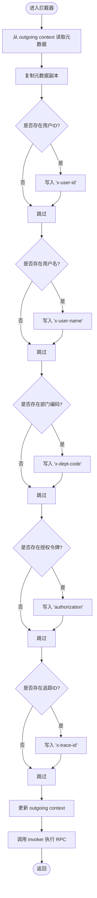
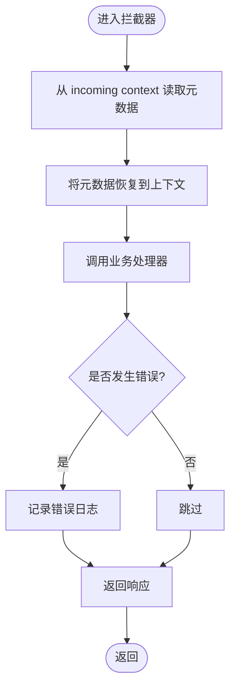
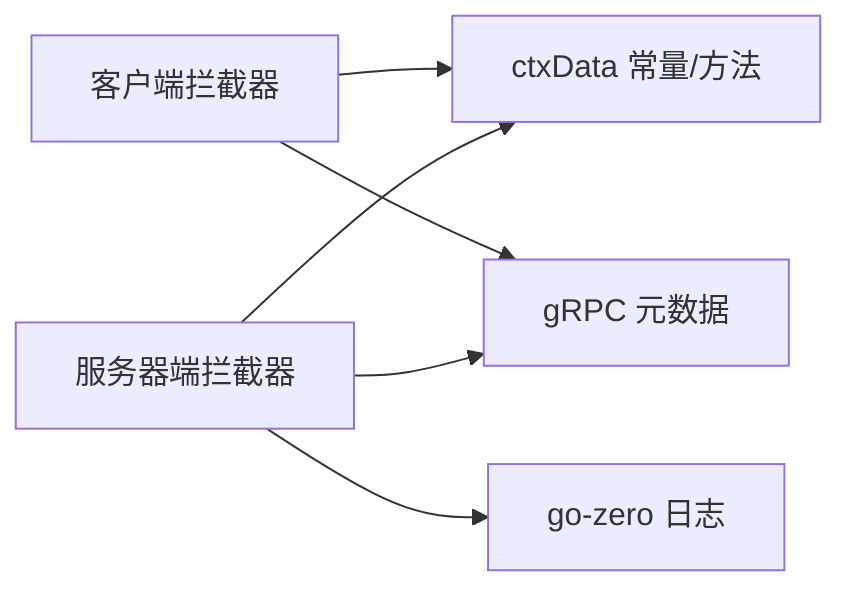

# 拦截器系统 (Interceptor)

<cite>
**本文引用的文件**
- [metadataInterceptor.go](file://common/Interceptor/rpcclient/metadataInterceptor.go)
- [loggerInterceptor.go](file://common/Interceptor/rpcserver/loggerInterceptor.go)
- [ctxData.go](file://common/ctxdata/ctxData.go)
- [bridgemqtt.go](file://app/bridgemqtt/bridgemqtt.go)
- [servicecontext.go](file://app/bridgemqtt/internal/svc/servicecontext.go)
- [rpc-patterns.md](file://.trae/skills/zero-skills/references/rpc-patterns.md)
- [rest-api-patterns.md](file://.trae/skills/zero-skills/references/rest-api-patterns.md)
- [resilience-patterns.md](file://.trae/skills/zero-skills/references/resilience-patterns.md)
- [zerorpc.yaml](file://zerorpc/etc/zerorpc.yaml)
- [zerorpcserver.go](file://zerorpc/internal/server/zerorpcserver.go)
</cite>

## 目录
1. [简介](#简介)
2. [项目结构](#项目结构)
3. [核心组件](#核心组件)
4. [架构总览](#架构总览)
5. [详细组件分析](#详细组件分析)
6. [依赖关系分析](#依赖关系分析)
7. [性能考量](#性能考量)
8. [故障排查指南](#故障排查指南)
9. [结论](#结论)
10. [附录](#附录)

## 简介
本技术文档围绕拦截器系统（Interceptor）展开，重点覆盖 gRPC 客户端与服务端拦截器在 RPC 与 HTTP 中的应用设计与实现要点。内容涵盖：
- 请求拦截与响应处理流程
- 元数据传递机制（用户标识、鉴权令牌、链路追踪 ID 等）
- 客户端拦截器的元数据注入、认证信息传递与请求头管理
- 服务器端拦截器的日志记录、请求跟踪与错误处理
- 配置选项、拦截器优先级与链式调用机制
- 自定义拦截器与在微服务中的集成实践
- 性能优化与调试技巧

## 项目结构
拦截器系统主要由以下模块构成：
- 客户端拦截器：统一从上下文提取用户与追踪信息并注入到 gRPC 元数据中
- 服务器端拦截器：从 gRPC 元数据恢复到上下文，并进行日志与错误处理
- 上下文与元数据键常量：统一管理 Header 名称与 Context 键名
- 使用示例：在多个业务服务中注册拦截器，形成链式调用

图表来源
- [metadataInterceptor.go:11-32](file://common/Interceptor/rpcclient/metadataInterceptor.go#L11-L32)
- [loggerInterceptor.go:12-44](file://common/Interceptor/rpcserver/loggerInterceptor.go#L12-L44)

章节来源
- [metadataInterceptor.go:1-56](file://common/Interceptor/rpcclient/metadataInterceptor.go#L1-L56)
- [loggerInterceptor.go:1-45](file://common/Interceptor/rpcserver/loggerInterceptor.go#L1-L45)
- [ctxData.go:9-24](file://common/ctxdata/ctxData.go#L9-L24)

## 核心组件
- 客户端拦截器（UnaryMetadataInterceptor）
  - 功能：从上下文读取用户 ID、用户名、部门编码、授权令牌、追踪 ID，并将其注入到出站 gRPC 元数据中
  - 关键点：仅在存在值时写入；使用元数据复制避免并发问题；通过 outgoing context 传递
- 服务器端拦截器（LoggerInterceptor）
  - 功能：从入站 gRPC 元数据恢复到上下文，便于后续业务逻辑使用；统一错误日志输出
  - 关键点：将元数据映射到 Context 的键值；异常时记录错误日志
- 上下文与元数据键常量（ctxData）
  - 功能：集中定义 Context 键与 gRPC Header 键，确保客户端与服务端一致
  - 关键点：Header 名称需小写；提供便捷的 Get 方法从 Context 取值

章节来源
- [metadataInterceptor.go:11-32](file://common/Interceptor/rpcclient/metadataInterceptor.go#L11-L32)
- [metadataInterceptor.go:34-55](file://common/Interceptor/rpcclient/metadataInterceptor.go#L34-L55)
- [loggerInterceptor.go:12-44](file://common/Interceptor/rpcserver/loggerInterceptor.go#L12-L44)
- [ctxData.go:9-76](file://common/ctxdata/ctxData.go#L9-L76)

## 架构总览
拦截器在微服务中的典型调用链如下：

图表来源
- [metadataInterceptor.go:11-32](file://common/Interceptor/rpcclient/metadataInterceptor.go#L11-L32)
- [loggerInterceptor.go:12-44](file://common/Interceptor/rpcserver/loggerInterceptor.go#L12-L44)

## 详细组件分析

### 客户端拦截器：元数据注入与请求头管理
- 实现原理
  - 从 outgoing context 提取现有元数据并复制，避免共享状态引发竞态
  - 逐项检查上下文中的用户与追踪信息，若非空则写入对应 Header
  - 重新封装为 outgoing context 并继续调用 invoker
- 元数据键与上下文键映射
  - 用户 ID：x-user-id -> user-id
  - 用户名：x-user-name -> user-name
  - 部门编码：x-dept-code -> dept-code
  - 授权令牌：authorization -> authorization
  - 追踪 ID：x-trace-id -> trace-id
- 适用场景
  - 跨服务调用时携带用户身份与链路追踪
  - 与服务发现、熔断、超时等配置协同工作

图表来源
- [metadataInterceptor.go:11-32](file://common/Interceptor/rpcclient/metadataInterceptor.go#L11-L32)

章节来源
- [metadataInterceptor.go:11-32](file://common/Interceptor/rpcclient/metadataInterceptor.go#L11-L32)
- [ctxData.go:9-24](file://common/ctxdata/ctxData.go#L9-L24)

### 服务器端拦截器：日志记录、请求跟踪与错误处理
- 实现原理
  - 从 incoming context 读取元数据，将关键字段恢复到上下文中
  - 调用业务处理器，捕获错误并统一记录错误日志
- 日志与追踪
  - 通过 Context 注入用户与追踪信息，便于日志聚合与定位
  - 错误路径统一输出，便于监控与告警
- 与业务处理器的关系
  - 拦截器不改变业务逻辑，仅负责横切关注点

图表来源
- [loggerInterceptor.go:12-44](file://common/Interceptor/rpcserver/loggerInterceptor.go#L12-L44)

章节来源
- [loggerInterceptor.go:12-44](file://common/Interceptor/rpcserver/loggerInterceptor.go#L12-L44)
- [ctxData.go:9-24](file://common/ctxdata/ctxData.go#L9-L24)

### HTTP 中间件（概念性说明）
- 设计模式
  - 中间件以函数包装处理器，支持链式组合
  - 常见职责：鉴权、限流、CORS、日志、指标采集
- 与 gRPC 拦截器的对比
  - HTTP 中间件作用于 HTTP 层；gRPC 拦截器作用于 RPC 层
  - 两者均遵循“前置处理 -> 调用下游 -> 后置处理”的模式

章节来源
- [rest-api-patterns.md:197-262](file://.trae/skills/zero-skills/references/rest-api-patterns.md#L197-L262)
- [resilience-patterns.md:257-294](file://.trae/skills/zero-skills/references/resilience-patterns.md#L257-L294)

### 配置选项、优先级与链式调用
- 配置入口
  - 服务端：通过 AddUnaryInterceptors 注册拦截器
  - 客户端：通过 WithUnaryClientInterceptor 注册拦截器
- 优先级与顺序
  - 多个拦截器按注册顺序依次执行
  - 建议将通用的鉴权/日志类拦截器置于链前端，便于尽早失败与记录
- 示例参考
  - 服务端注册服务器端拦截器
  - 客户端注册客户端拦截器并结合最大消息大小等拨号选项

章节来源
- [bridgemqtt.go:65](file://app/bridgemqtt/bridgemqtt.go#L65)
- [servicecontext.go:26-45](file://app/bridgemqtt/internal/svc/servicecontext.go#L26-L45)
- [rpc-patterns.md:370-445](file://.trae/skills/zero-skills/references/rpc-patterns.md#L370-L445)

### 在微服务中的集成实践
- 服务端集成
  - 在服务启动时注册服务器端拦截器，确保所有方法均受拦截
  - 结合日志配置，统一输出格式与级别
- 客户端集成
  - 在创建 gRPC 客户端时注册客户端拦截器
  - 可结合拨号选项调整最大消息大小、超时等参数
- 配置文件示例
  - 服务端配置可参考示例 YAML 文件，包含监听地址、日志、缓存、数据库等

章节来源
- [bridgemqtt.go:65](file://app/bridgemqtt/bridgemqtt.go#L65)
- [servicecontext.go:26-45](file://app/bridgemqtt/internal/svc/servicecontext.go#L26-L45)
- [zerorpc.yaml:1-39](file://zerorpc/etc/zerorpc.yaml#L1-L39)

## 依赖关系分析
- 组件耦合
  - 客户端拦截器依赖 ctxData 提供的键常量与上下文读取方法
  - 服务器端拦截器同样依赖 ctxData，保证两端键名一致
- 外部依赖
  - gRPC 元数据与拦截器接口
  - go-zero 日志库用于统一日志输出
- 潜在循环依赖
  - 当前结构清晰，拦截器仅作为横切层，不直接依赖业务逻辑

图表来源
- [metadataInterceptor.go:11-32](file://common/Interceptor/rpcclient/metadataInterceptor.go#L11-L32)
- [loggerInterceptor.go:12-44](file://common/Interceptor/rpcserver/loggerInterceptor.go#L12-L44)
- [ctxData.go:9-24](file://common/ctxdata/ctxData.go#L9-L24)

章节来源
- [metadataInterceptor.go:11-32](file://common/Interceptor/rpcclient/metadataInterceptor.go#L11-L32)
- [loggerInterceptor.go:12-44](file://common/Interceptor/rpcserver/loggerInterceptor.go#L12-L44)
- [ctxData.go:9-24](file://common/ctxdata/ctxData.go#L9-L24)

## 性能考量
- 元数据写入开销
  - 仅在上下文存在值时写入，避免冗余键
  - 复制元数据一次，减少锁竞争
- 日志与错误处理
  - 服务器端拦截器仅在错误时记录日志，降低正常路径开销
- 客户端拨号选项
  - 合理设置最大消息大小与超时，避免不必要的资源占用
- 链长度控制
  - 控制拦截器数量与顺序，避免链过长导致延迟累积

## 故障排查指南
- 常见问题
  - Header 名称大小写不一致：gRPC 要求小写，需与 ctxData 常量保持一致
  - 上下文未正确注入：确认拦截器已注册且顺序正确
  - 日志缺失：检查服务器端拦截器是否生效，以及日志配置级别
- 调试建议
  - 在客户端拦截器中打印元数据键值，验证注入是否成功
  - 在服务器端拦截器中打印恢复后的上下文键值，验证透传是否正确
  - 使用最小化配置快速复现问题，逐步增加复杂度

章节来源
- [loggerInterceptor.go:12-44](file://common/Interceptor/rpcserver/loggerInterceptor.go#L12-L44)
- [ctxData.go:9-24](file://common/ctxdata/ctxData.go#L9-L24)

## 结论
拦截器系统通过客户端与服务器端的协同，实现了跨服务调用中的元数据传递、日志记录与错误处理。其设计遵循“最小侵入、可组合、可扩展”的原则，既满足通用横切需求，又便于在微服务环境中灵活集成与演进。

## 附录
- 自定义拦截器开发步骤
  - 明确职责边界：鉴权、限流、日志、追踪等
  - 选择合适的拦截器类型：Unary 或 Stream
  - 严格遵守注册顺序与链式调用规则
  - 与配置体系解耦，通过构造函数或工厂函数注入依赖
- 参考实现与示例
  - 客户端拦截器与服务器端拦截器的实现路径
  - 在具体业务服务中的注册方式与拨号选项

章节来源
- [rpc-patterns.md:370-445](file://.trae/skills/zero-skills/references/rpc-patterns.md#L370-L445)
- [zerorpcserver.go:26-90](file://zerorpc/internal/server/zerorpcserver.go#L26-L90)