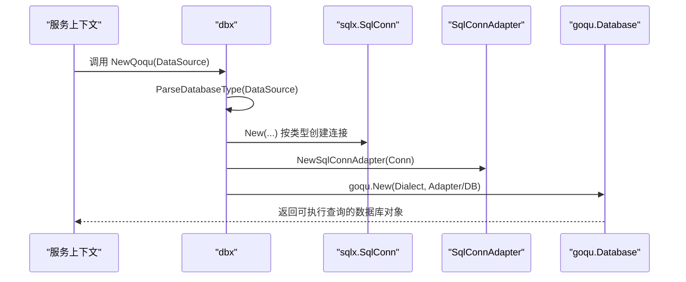
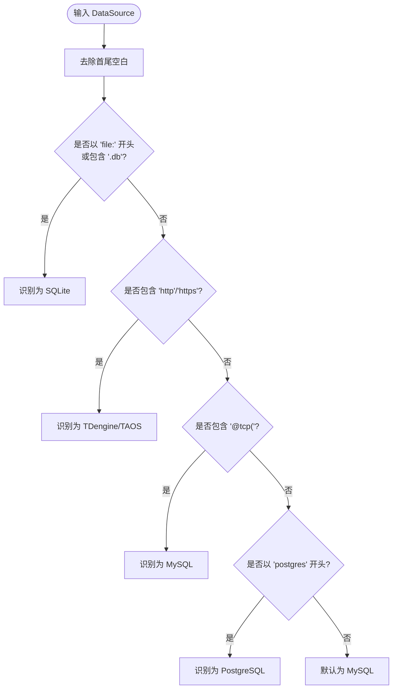
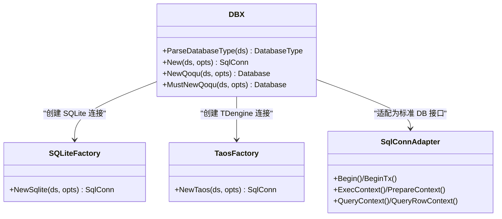
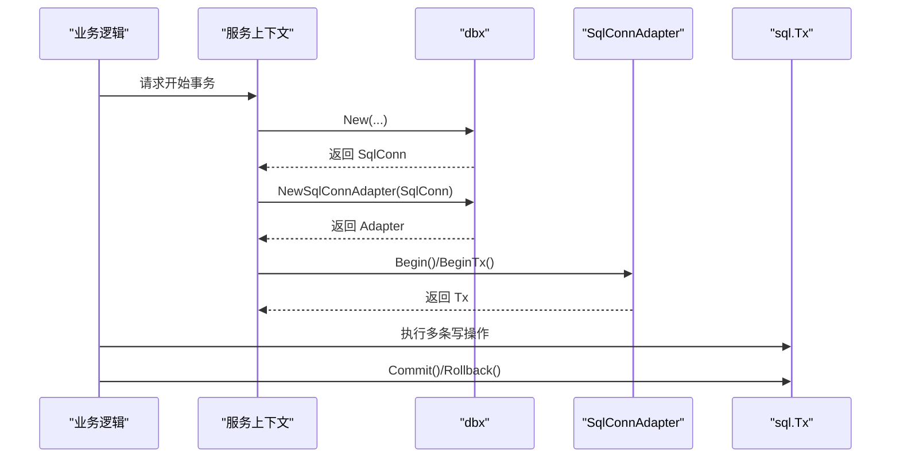
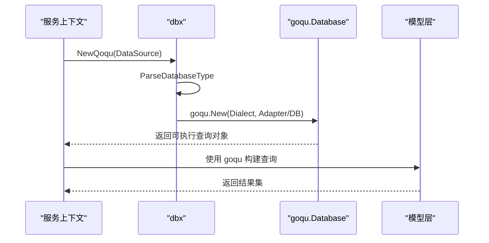
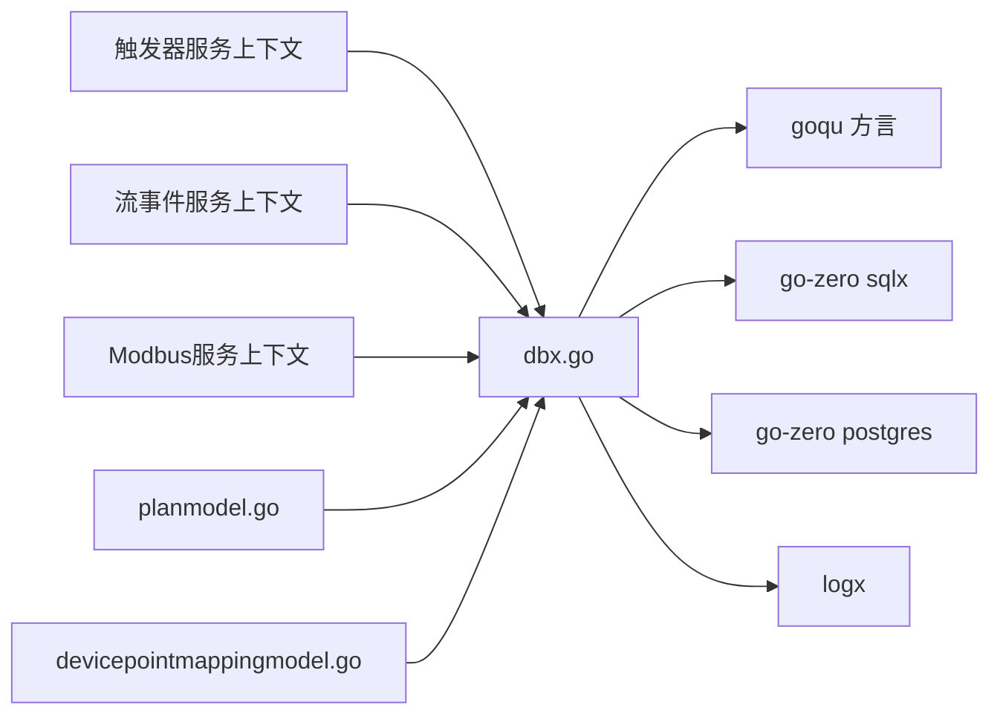

# 数据库抽象层 (dbx)

<cite>
**本文引用的文件**
- [dbx.go](file://common/dbx/dbx.go)
- [sqlitesql.go](file://common/dbx/sqlitesql.go)
- [taossql.go](file://common/dbx/taossql.go)
- [trigger.yaml](file://app/trigger/etc/trigger.yaml)
- [streamevent.yaml](file://facade/streamevent/etc/streamevent.yaml)
- [servicecontext.go（触发器）](file://app/trigger/internal/svc/servicecontext.go)
- [servicecontext.go（流事件）](file://facade/streamevent/internal/svc/servicecontext.go)
- [servicecontext.go（Modbus）](file://app/bridgemodbus/internal/svc/servicecontext.go)
- [planmodel.go](file://model/planmodel.go)
- [devicepointmappingmodel.go](file://model/devicepointmappingmodel.go)
- [cronservice.go](file://app/trigger/cron/cronservice.go)
</cite>

## 目录
1. [简介](#简介)
2. [项目结构](#项目结构)
3. [核心组件](#核心组件)
4. [架构总览](#架构总览)
5. [组件详解](#组件详解)
6. [依赖关系分析](#依赖关系分析)
7. [性能与监控](#性能与监控)
8. [故障排查指南](#故障排查指南)
9. [结论](#结论)
10. [附录：配置与示例](#附录配置与示例)

## 简介
本文件系统性阐述数据库抽象层（dbx）的设计与实现，重点覆盖以下方面：
- 统一数据库访问接口的设计理念与实现路径
- 数据库类型自动识别机制
- 连接池与事务处理能力
- 支持的数据库类型（MySQL、PostgreSQL、SQLite、TDengine/TAOS）
- goqu ORM 集成、SQL 构建器使用与查询优化策略
- 数据库连接适配器实现细节、错误处理与性能监控
- 在微服务中使用 dbx 的实践范式与最佳实践

## 项目结构
dbx 组件位于 common/dbx 目录，提供统一的数据库连接创建、类型识别、goqu 集成与适配器封装；多个业务模块通过服务上下文注入 dbx 创建的连接与 goqu 实例。

```mermaid
graph TB
subgraph "公共层"
DBX["dbx.go<br/>类型识别/工厂/适配器/goqu集成"]
SQLITE["sqlitesql.go<br/>SQLite工厂"]
TAOS["taossql.go<br/>TDengine/TAOS工厂"]
end
subgraph "业务服务"
TRIGGER_SC["servicecontext.go触发器"]
STREAM_SC["servicecontext.go流事件"]
MODBUS_SC["servicecontext.goModbus"]
end
DBX --> SQLITE
DBX --> TAOS
TRIGGER_SC --> DBX
STREAM_SC --> DBX
MODBUS_SC --> DBX
```

**图表来源**
- [dbx.go:1-155](file://common/dbx/dbx.go#L1-L155)
- [sqlitesql.go:1-13](file://common/dbx/sqlitesql.go#L1-L13)
- [taossql.go:1-14](file://common/dbx/taossql.go#L1-L14)
- [servicecontext.go（触发器）:50-90](file://app/trigger/internal/svc/servicecontext.go#L50-L90)
- [servicecontext.go（流事件）:21-32](file://facade/streamevent/internal/svc/servicecontext.go#L21-L32)
- [servicecontext.go（Modbus）:22-32](file://app/bridgemodbus/internal/svc/servicecontext.go#L22-L32)

**章节来源**
- [dbx.go:1-155](file://common/dbx/dbx.go#L1-L155)
- [sqlitesql.go:1-13](file://common/dbx/sqlitesql.go#L1-L13)
- [taossql.go:1-14](file://common/dbx/taossql.go#L1-L14)
- [servicecontext.go（触发器）:50-90](file://app/trigger/internal/svc/servicecontext.go#L50-L90)
- [servicecontext.go（流事件）:21-32](file://facade/streamevent/internal/svc/servicecontext.go#L21-L32)
- [servicecontext.go（Modbus）:22-32](file://app/bridgemodbus/internal/svc/servicecontext.go#L22-L32)

## 核心组件
- 数据库类型枚举与自动识别：通过解析数据源字符串，自动判定数据库类型，确保后续工厂创建与方言选择正确。
- 工厂函数 New：根据类型创建对应连接（MySQL、PostgreSQL、SQLite、TDengine/TAOS）。
- 连接适配器 SqlConnAdapter：将 sqlx.SqlConn 适配为标准 sql.DB 接口，用于 goqu 的方言初始化与事务控制。
- goqu 集成：NewQoqu/MustNewQoqu 基于数据源类型创建 goqu.Database，并注册方言与日志。
- SQLite/TAOS 专用工厂：分别封装驱动名与连接创建逻辑，保证驱动可用与连接稳定。

**章节来源**
- [dbx.go:22-64](file://common/dbx/dbx.go#L22-L64)
- [dbx.go:66-104](file://common/dbx/dbx.go#L66-L104)
- [dbx.go:106-138](file://common/dbx/dbx.go#L106-L138)
- [sqlitesql.go:8-12](file://common/dbx/sqlitesql.go#L8-L12)
- [taossql.go:9-13](file://common/dbx/taossql.go#L9-L13)

## 架构总览
dbx 将“类型识别—工厂—适配—ORM”串联起来，形成可扩展、可维护的统一数据库访问层。

**图表来源**
- [dbx.go:31-44](file://common/dbx/dbx.go#L31-L44)
- [dbx.go:52-64](file://common/dbx/dbx.go#L52-L64)
- [dbx.go:112-138](file://common/dbx/dbx.go#L112-L138)
- [dbx.go:71-80](file://common/dbx/dbx.go#L71-L80)

## 组件详解

### 数据库类型自动识别
- 识别规则基于数据源字符串前缀与关键字：
  - SQLite：以 file: 开头或包含 .db 后缀
  - TDengine/TAOS：包含 http 或 https
  - MySQL：包含 @tcp(
  - PostgreSQL：以 postgres 开头
  - 其他默认为 MySQL
- 该规则贯穿 New、NewQoqu 与模型层的 dbType 传递，确保 SQL 方言与占位符一致。

**图表来源**
- [dbx.go:31-44](file://common/dbx/dbx.go#L31-L44)

**章节来源**
- [dbx.go:31-44](file://common/dbx/dbx.go#L31-L44)

### 工厂与连接创建
- New：依据类型调用对应工厂（MySQL、PostgreSQL、SQLite、TDengine/TAOS），返回 sqlx.SqlConn。
- NewSqlite/NewTaos：封装驱动名与连接创建，确保驱动导入与连接可用。
- 业务侧通过服务上下文统一创建连接，并传入模型层以决定方言与占位符格式。

**图表来源**
- [dbx.go:46-64](file://common/dbx/dbx.go#L46-L64)
- [dbx.go:112-138](file://common/dbx/dbx.go#L112-L138)
- [sqlitesql.go:10-12](file://common/dbx/sqlitesql.go#L10-L12)
- [taossql.go:11-13](file://common/dbx/taossql.go#L11-L13)

**章节来源**
- [dbx.go:46-64](file://common/dbx/dbx.go#L46-L64)
- [sqlitesql.go:10-12](file://common/dbx/sqlitesql.go#L10-L12)
- [taossql.go:11-13](file://common/dbx/taossql.go#L11-L13)

### 连接适配器与事务处理
- SqlConnAdapter：从 sqlx.SqlConn 提取底层 *sql.DB，暴露 Begin/BeginTx 与标准查询接口，供 goqu 使用。
- 事务：通过 adapter.Begin/BeginTx 控制事务生命周期，结合业务逻辑进行提交/回滚。
- 适用场景：跨数据库类型的统一事务入口，避免直接依赖具体驱动。

**图表来源**
- [dbx.go:71-88](file://common/dbx/dbx.go#L71-L88)
- [dbx.go:82-88](file://common/dbx/dbx.go#L82-L88)

**章节来源**
- [dbx.go:66-104](file://common/dbx/dbx.go#L66-L104)

### goqu 集成与 SQL 构建器
- NewQoqu/MustNewQoqu：按数据源类型创建 goqu.Database，注册方言（MySQL、PostgreSQL），并设置日志输出。
- 日志：通过自定义 QoquLog 将 SQL 与参数输出到统一日志系统。
- 使用建议：
  - 优先使用 goqu 构建器生成 SQL，减少手写 SQL 的风险。
  - 对 PostgreSQL 显式设置占位符格式（$1/$2…），避免默认 ? 占位导致语法错误。
  - 结合模型层的 dbType 判断，动态调整占位符与方言。

**图表来源**
- [dbx.go:106-138](file://common/dbx/dbx.go#L106-L138)
- [planmodel.go:48-50](file://model/planmodel.go#L48-L50)

**章节来源**
- [dbx.go:106-138](file://common/dbx/dbx.go#L106-L138)
- [planmodel.go:48-50](file://model/planmodel.go#L48-L50)

### 支持的数据库类型与连接配置
- MySQL
  - 特征：包含 @tcp(；驱动：github.com/go-sql-driver/mysql
  - 示例配置：见触发器服务配置文件中的 DB.DataSource 注释行
- PostgreSQL
  - 特征：以 postgres 开头；驱动：github.com/lib/pq
  - 示例配置：见触发器服务配置文件中的 DB.DataSource
- SQLite
  - 特征：以 file: 开头或包含 .db；驱动：modernc.org/sqlite
  - 示例配置：见流事件服务配置文件中的 DB.DataSource
- TDengine/TAOS
  - 特征：包含 http/https；驱动：github.com/taosdata/driver-go/v3/taosRestful
  - 示例配置：见流事件服务配置文件中的 TaosDB.DataSource

**章节来源**
- [dbx.go:31-44](file://common/dbx/dbx.go#L31-L44)
- [trigger.yaml:25-29](file://app/trigger/etc/trigger.yaml#L25-L29)
- [streamevent.yaml:22-27](file://facade/streamevent/etc/streamevent.yaml#L22-L27)

### 微服务使用范式与最佳实践
- 服务上下文统一创建连接与 goqu 实例，避免分散配置与方言不一致。
- 模型层通过 WithDBType 传递 dbType，确保 SQL 方言与占位符一致。
- 事务与批量操作建议使用 Begin/BeginTx 包裹，失败时及时回滚。
- 使用 goqu 构建器替代手写 SQL，提升可读性与可维护性。
- 对 PostgreSQL 显式设置占位符格式，避免默认 ? 导致语法错误。

**章节来源**
- [servicecontext.go（触发器）:50-90](file://app/trigger/internal/svc/servicecontext.go#L50-L90)
- [servicecontext.go（流事件）:21-32](file://facade/streamevent/internal/svc/servicecontext.go#L21-L32)
- [servicecontext.go（Modbus）:22-32](file://app/bridgemodbus/internal/svc/servicecontext.go#L22-L32)
- [planmodel.go:48-50](file://model/planmodel.go#L48-L50)

## 依赖关系分析
- dbx 依赖：
  - goqu 方言：mysql、postgres、sqlite3、sqlserver
  - go-zero sqlx：统一连接与会话
  - go-zero postgres：PostgreSQL 连接
  - 日志：logx
- 业务模块依赖：
  - 服务上下文注入 dbx 创建的连接与 goqu 实例
  - 模型层通过 WithDBType 传递 dbType，确保方言一致性

**图表来源**
- [dbx.go:3-20](file://common/dbx/dbx.go#L3-L20)
- [servicecontext.go（触发器）:50-90](file://app/trigger/internal/svc/servicecontext.go#L50-L90)
- [servicecontext.go（流事件）:21-32](file://facade/streamevent/internal/svc/servicecontext.go#L21-L32)
- [servicecontext.go（Modbus）:22-32](file://app/bridgemodbus/internal/svc/servicecontext.go#L22-L32)
- [planmodel.go:48-50](file://model/planmodel.go#L48-L50)
- [devicepointmappingmodel.go](file://model/devicepointmappingmodel.go#L49)

**章节来源**
- [dbx.go:3-20](file://common/dbx/dbx.go#L3-L20)
- [planmodel.go:48-50](file://model/planmodel.go#L48-L50)
- [devicepointmappingmodel.go](file://model/devicepointmappingmodel.go#L49)

## 性能与监控
- 连接池与超时：通过 sqlx 的选项与驱动参数控制连接池大小、空闲连接数与超时时间（例如 SQLite 的 _busy_timeout、_journal_mode）。
- SQL 日志：goqu 的 QoquLog 输出到 logx，便于审计与性能分析。
- 缓存：模型层对热点数据使用缓存（如设备点映射），降低数据库压力。
- 事务批处理：对批量写入使用 Begin/BeginTx，减少往返与锁竞争。
- PostgreSQL 占位符：显式设置 Dollar 占位符，避免方言差异导致的重试与编译开销。

**章节来源**
- [streamevent.yaml](file://facade/streamevent/etc/streamevent.yaml#L27)
- [dbx.go:140-145](file://common/dbx/dbx.go#L140-L145)
- [devicepointmappingmodel.go:40-44](file://model/devicepointmappingmodel.go#L40-L44)

## 故障排查指南
- 类型识别错误
  - 症状：SQL 方言或占位符不匹配，导致语法错误
  - 处理：检查 DataSource 字符串是否符合识别规则，必要时显式指定 dbType
- PostgreSQL 语法错误
  - 症状：使用 ? 占位符导致语法错误
  - 处理：在模型层设置 PlaceholderFormat 为 Dollar
- SQLite 文件路径或权限问题
  - 症状：无法打开数据库文件
  - 处理：确认 file: 路径存在且具备读写权限，必要时调整 _journal_mode
- TDengine/TAOS 连接失败
  - 症状：http/https 地址不可达或认证失败
  - 处理：核对地址、端口与认证信息，确保网络连通

**章节来源**
- [dbx.go:31-44](file://common/dbx/dbx.go#L31-L44)
- [planmodel.go:48-50](file://model/planmodel.go#L48-L50)
- [streamevent.yaml:22-27](file://facade/streamevent/etc/streamevent.yaml#L22-L27)

## 结论
dbx 通过“类型自动识别 + 工厂 + 适配器 + goqu 集成”的设计，实现了对 MySQL、PostgreSQL、SQLite、TDengine/TAOS 的统一访问。配合服务上下文与模型层的 dbType 传递，确保了 SQL 方言与占位符的一致性；结合事务、缓存与日志体系，满足了微服务对性能与可观测性的要求。建议在新业务中统一使用 dbx 创建连接与 goqu 实例，并遵循 PostgreSQL 占位符设置与 SQLite 参数优化的最佳实践。

## 附录：配置与示例

### 配置示例
- 触发器服务（PostgreSQL）
  - 参考路径：[trigger.yaml:25-29](file://app/trigger/etc/trigger.yaml#L25-L29)
- 流事件服务（SQLite + TDengine/TAOS）
  - 参考路径：[streamevent.yaml:22-27](file://facade/streamevent/etc/streamevent.yaml#L22-L27)

### 在服务上下文中使用 dbx
- 创建连接与 goqu 实例
  - 参考路径：[servicecontext.go（触发器）:55-60](file://app/trigger/internal/svc/servicecontext.go#L55-L60)
- 解析数据库类型并创建模型
  - 参考路径：[servicecontext.go（Modbus）:23-27](file://app/bridgemodbus/internal/svc/servicecontext.go#L23-L27)
  - 参考路径：[servicecontext.go（流事件）:25-30](file://facade/streamevent/internal/svc/servicecontext.go#L25-L30)

### 使用 goqu 构建查询（示例路径）
- 参考路径：[cronservice.go:87-127](file://app/trigger/cron/cronservice.go#L87-L127)

### PostgreSQL 占位符设置（示例路径）
- 参考路径：[planmodel.go:48-50](file://model/planmodel.go#L48-L50)