# 前端工具事件处理

<cite>
**本文档引用的文件**
- [README.md](file://README.md)
- [test-socketio.html](file://common/socketiox/test-socketio.html)
- [server.go](file://common/socketiox/server.go)
- [handler.go](file://common/socketiox/handler.go)
- [container.go](file://common/socketiox/container.go)
- [routes.go](file://socketapp/socketgtw/internal/handler/routes.go)
- [socketgtw.go](file://socketapp/socketgtw/socketgtw.go)
- [socketpush.go](file://socketapp/socketpush/socketpush.go)
- [socketgtw.proto](file://socketapp/socketgtw/socketgtw.proto)
</cite>

## 目录
1. [简介](#简介)
2. [项目结构](#项目结构)
3. [核心组件](#核心组件)
4. [架构概览](#架构概览)
5. [详细组件分析](#详细组件分析)
6. [依赖关系分析](#依赖关系分析)
7. [性能考虑](#性能考虑)
8. [故障排除指南](#故障排除指南)
9. [结论](#结论)

## 简介

Zero-Service 是一个基于 go-zero 的工业级微服务脚手架，专门针对物联网数据采集、异步任务调度和实时通信等场景。该项目提供了开箱即用的多协议接入和高性能数据处理能力。

前端工具事件处理是该系统的重要组成部分，主要通过 SocketIO 实现实时通信功能。系统包含两个核心服务：socketgtw（SocketIO 网关）和 socketpush（SocketIO 推送），以及一个专门的前端测试工具。

## 项目结构

项目采用模块化的微服务架构，前端工具事件处理相关的结构如下：

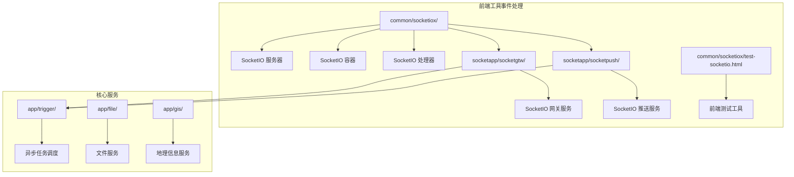

**图表来源**
- [README.md:15-108](file://README.md#L15-L108)
- [socketgtw.go:1-103](file://socketapp/socketgtw/socketgtw.go#L1-L103)
- [socketpush.go:1-70](file://socketapp/socketpush/socketpush.go#L1-L70)

**章节来源**
- [README.md:59-108](file://README.md#L59-L108)

## 核心组件

### SocketIO 服务器 (Server)

SocketIO 服务器是整个事件处理系统的核心，负责管理客户端连接、房间管理和消息路由。主要特性包括：

- **事件驱动架构**：支持多种内置事件和自定义事件
- **房间管理**：支持动态加入和离开房间
- **消息广播**：支持房间级和全局广播
- **会话管理**：维护客户端会话状态和元数据
- **钩子机制**：支持连接、断开、房间操作等钩子

### SocketIO 容器 (SocketContainer)

SocketContainer 负责管理 SocketGtwClient 的连接池，支持多种服务发现机制：

- **直接连接**：支持静态 IP 列表
- **ETCD 集成**：通过 etcd 进行服务发现
- **Nacos 集成**：支持 Nacos 服务注册与发现
- **动态更新**：自动处理服务实例变化

### SocketIO 处理器 (SocketioHandler)

处理器将 SocketIO 服务器集成到 HTTP 服务器中，提供标准的 HTTP 接口：

- **HTTP 集成**：通过标准 HTTP 接口提供 SocketIO 功能
- **配置管理**：支持灵活的处理器配置
- **错误处理**：完善的错误处理和恢复机制

### 前端测试工具 (test-socketio.html)

提供了一个功能完整的前端 SocketIO 测试工具，包含：

- **实时连接监控**：显示连接状态和统计数据
- **消息发送界面**：支持多种消息类型的发送
- **房间管理功能**：动态加入和离开房间
- **日志记录系统**：详细的事件日志和调试信息
- **响应式设计**：适配不同屏幕尺寸的设备

**章节来源**
- [server.go:299-312](file://common/socketiox/server.go#L299-L312)
- [container.go:30-33](file://common/socketiox/container.go#L30-L33)
- [handler.go:19-40](file://common/socketiox/handler.go#L19-L40)
- [test-socketio.html:1-800](file://common/socketiox/test-socketio.html#L1-L800)

## 架构概览

系统采用分层架构设计，前端工具事件处理在整体架构中的位置如下：

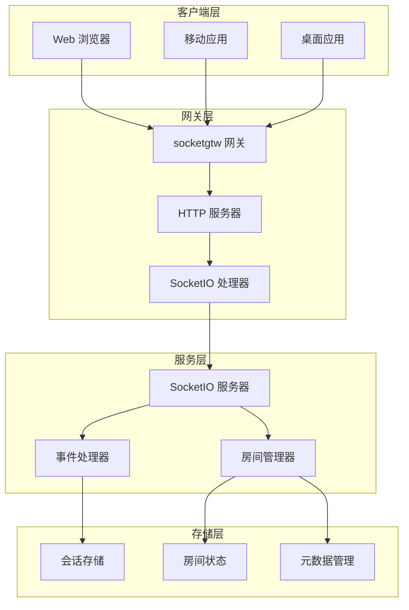

**图表来源**
- [socketgtw.go:33-102](file://socketapp/socketgtw/socketgtw.go#L33-L102)
- [server.go:337-676](file://common/socketiox/server.go#L337-L676)

## 详细组件分析

### SocketIO 服务器架构

SocketIO 服务器实现了完整的事件驱动架构，支持以下核心功能：

#### 事件处理机制

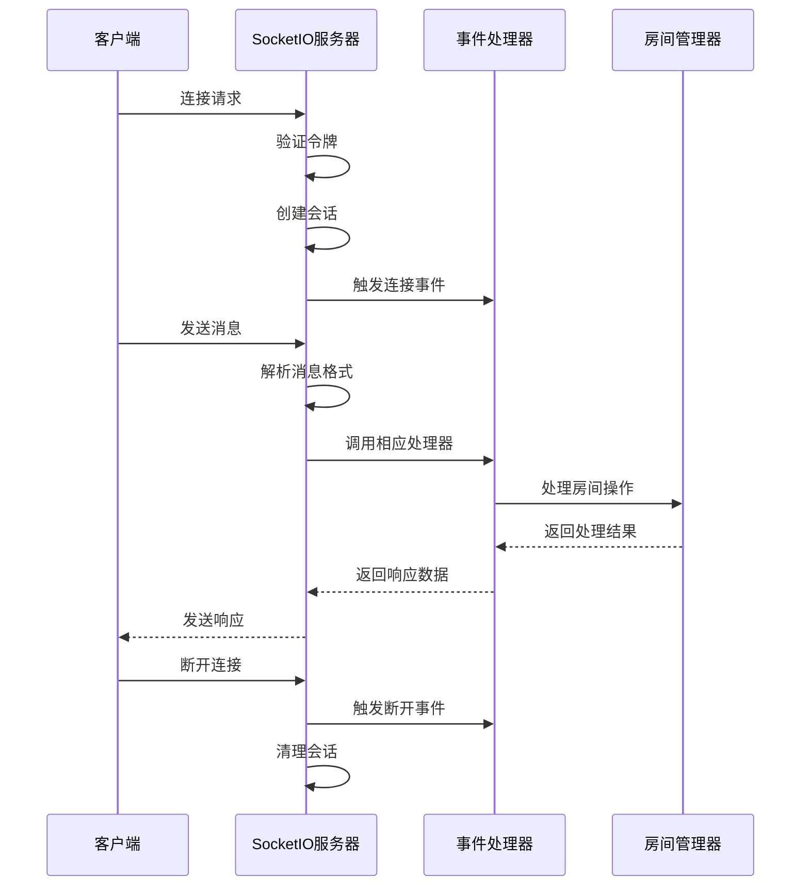

**图表来源**
- [server.go:392-641](file://common/socketiox/server.go#L392-L641)

#### 会话管理

服务器维护每个客户端的会话状态，包括：

- **会话标识符**：唯一标识每个客户端连接
- **元数据存储**：存储客户端相关信息（用户ID、设备ID等）
- **房间关联**：跟踪客户端所属的房间
- **统计信息**：连接质量、消息传输等指标

#### 房间管理系统

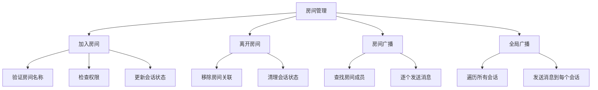

**图表来源**
- [server.go:404-467](file://common/socketiox/server.go#L404-L467)
- [server.go:678-700](file://common/socketiox/server.go#L678-L700)

**章节来源**
- [server.go:119-232](file://common/socketiox/server.go#L119-L232)
- [server.go:742-782](file://common/socketiox/server.go#L742-L782)

### SocketContainer 服务发现

SocketContainer 实现了多种服务发现机制，确保系统的高可用性和可扩展性：

#### 多种连接模式

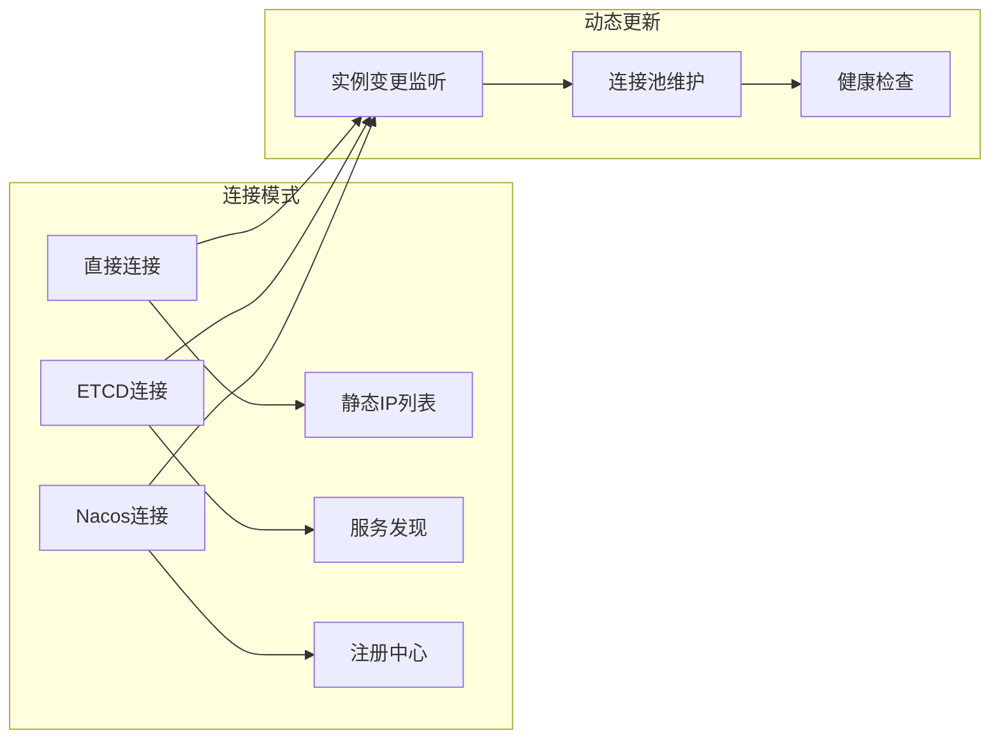

**图表来源**
- [container.go:83-154](file://common/socketiox/container.go#L83-L154)
- [container.go:156-242](file://common/socketiox/container.go#L156-L242)

#### 服务发现流程

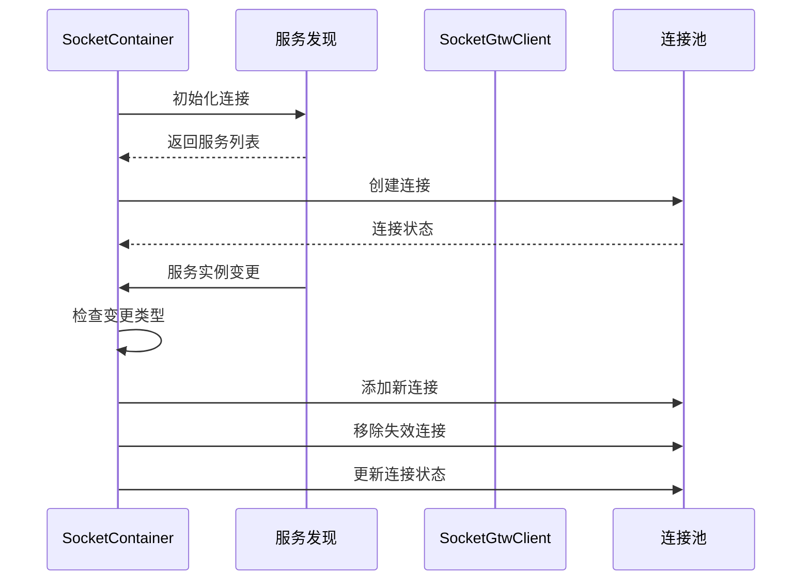

**图表来源**
- [container.go:267-316](file://common/socketiox/container.go#L267-L316)

**章节来源**
- [container.go:35-61](file://common/socketiox/container.go#L35-L61)
- [container.go:318-356](file://common/socketiox/container.go#L318-L356)

### 前端测试工具功能

前端测试工具提供了完整的 SocketIO 功能测试环境：

#### 用户界面设计

工具采用现代化的响应式设计，包含以下主要功能模块：

- **连接控制面板**：显示连接状态、统计信息和控制按钮
- **消息发送区域**：支持多种消息格式和事件类型
- **房间管理界面**：动态房间操作和成员管理
- **日志记录系统**：详细的事件日志和调试信息
- **配置管理**：灵活的连接参数和消息模板

#### 实时监控功能

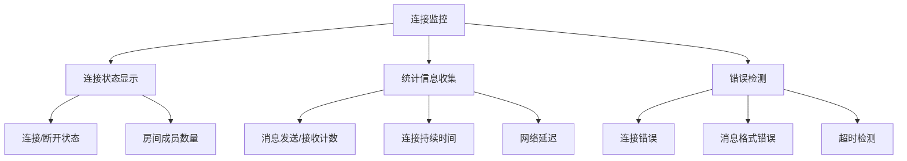

**图表来源**
- [test-socketio.html:504-590](file://common/socketiox/test-socketio.html#L504-L590)

**章节来源**
- [test-socketio.html:1-800](file://common/socketiox/test-socketio.html#L1-L800)

## 依赖关系分析

系统各组件之间的依赖关系如下：

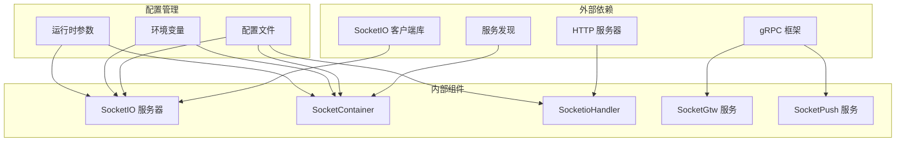

**图表来源**
- [socketgtw.go:3-29](file://socketapp/socketgtw/socketgtw.go#L3-L29)
- [socketpush.go:3-23](file://socketapp/socketpush/socketpush.go#L3-L23)

**章节来源**
- [socketgtw.go:31-102](file://socketapp/socketgtw/socketgtw.go#L31-L102)
- [socketpush.go:25-69](file://socketapp/socketpush/socketpush.go#L25-L69)

## 性能考虑

### 连接池管理

系统通过 SocketContainer 实现高效的连接池管理：

- **连接复用**：避免频繁建立和销毁连接
- **负载均衡**：在多个服务实例间分配请求
- **健康检查**：自动检测和移除失效连接
- **动态调整**：根据负载情况动态调整连接数量

### 内存管理

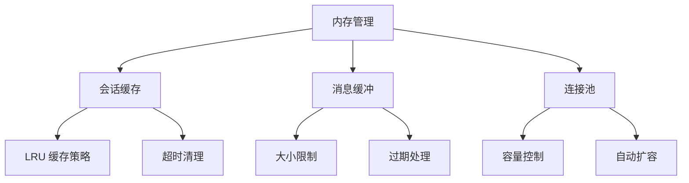

**图表来源**
- [container.go:278-316](file://common/socketiox/container.go#L278-L316)

### 并发处理

系统采用 goroutine 和 channel 实现高效的并发处理：

- **事件处理并发化**：每个事件在独立 goroutine 中处理
- **消息队列**：使用 channel 实现消息的异步传递
- **资源池**：通过 sync.Pool 复用临时对象
- **超时控制**：防止长时间阻塞影响系统性能

## 故障排除指南

### 常见问题诊断

#### 连接问题

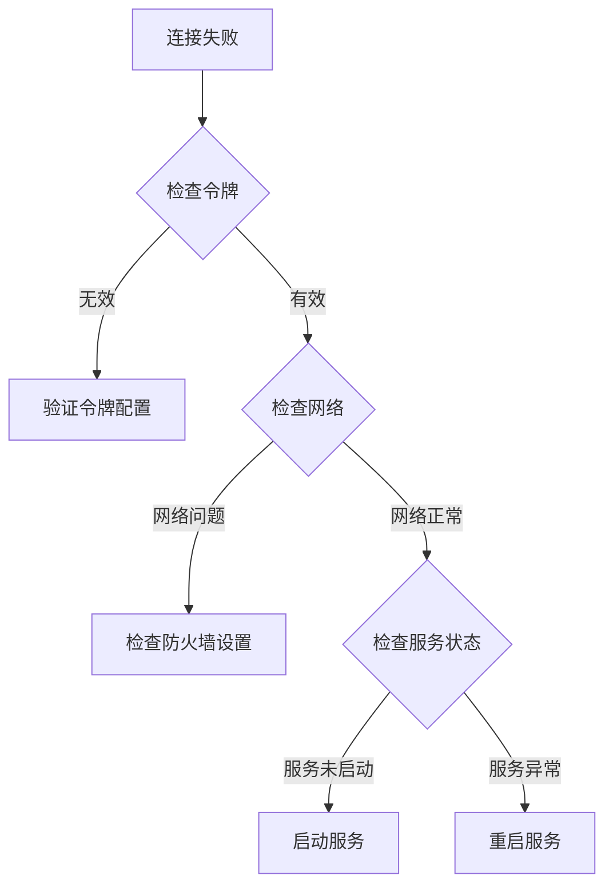

#### 性能问题

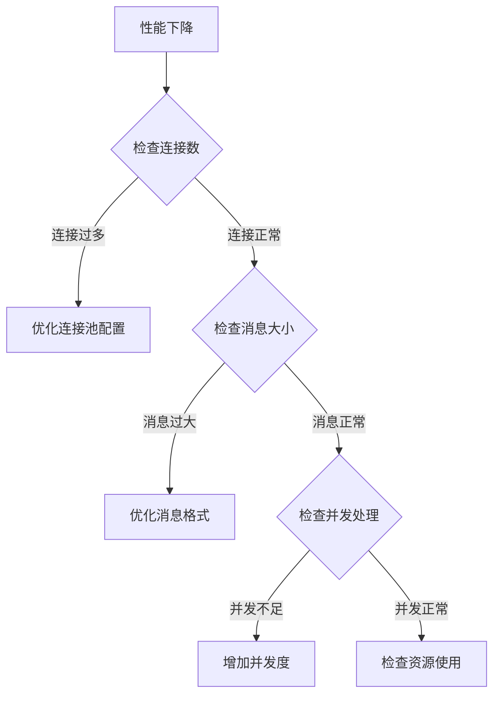

### 调试工具

系统提供了丰富的调试工具和日志信息：

- **详细日志**：每个事件都有对应的日志记录
- **统计信息**：实时显示系统运行状态
- **错误报告**：详细的错误信息和堆栈跟踪
- **性能监控**：连接数、消息处理速度等指标

**章节来源**
- [server.go:702-740](file://common/socketiox/server.go#L702-L740)
- [container.go:318-356](file://common/socketiox/container.go#L318-L356)

## 结论

前端工具事件处理系统通过 SocketIO 技术实现了高效、可靠的实时通信功能。系统采用模块化设计，具有良好的可扩展性和可维护性。

### 主要优势

1. **技术先进**：基于成熟的 SocketIO 技术，支持多种传输协议
2. **架构清晰**：分层设计，职责明确，易于理解和维护
3. **功能完整**：涵盖从连接管理到消息处理的完整功能链
4. **性能优异**：通过连接池和并发处理实现高吞吐量
5. **易于使用**：提供完整的前端测试工具和文档

### 应用场景

该系统适用于以下应用场景：

- **实时数据展示**：如监控面板、仪表板等
- **协作工具**：如在线编辑、实时聊天等
- **游戏应用**：需要实时交互的游戏场景
- **IoT 设备控制**：远程设备控制和状态监控
- **直播互动**：弹幕、礼物等实时互动功能

通过合理配置和使用，该系统能够满足各种实时通信需求，并为后续的功能扩展提供良好的基础。