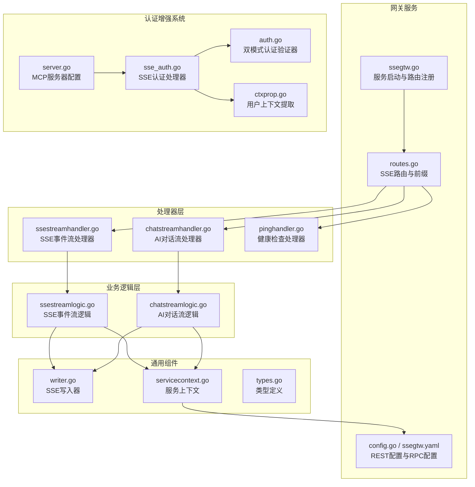
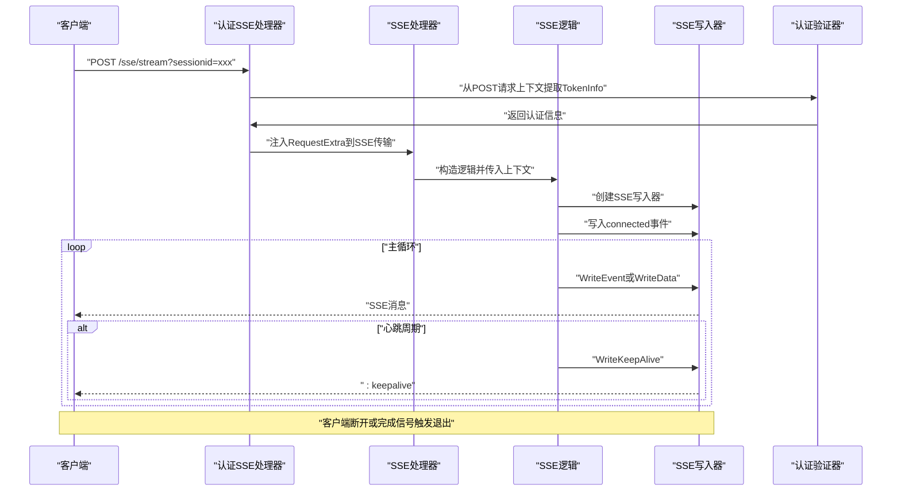
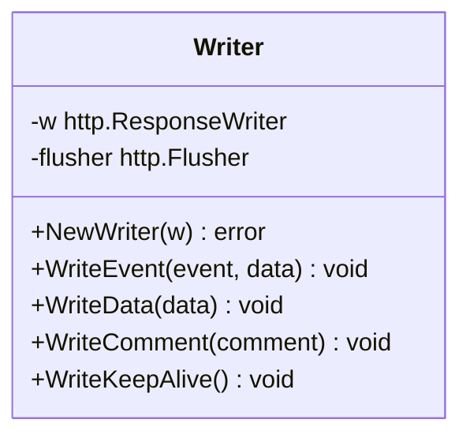
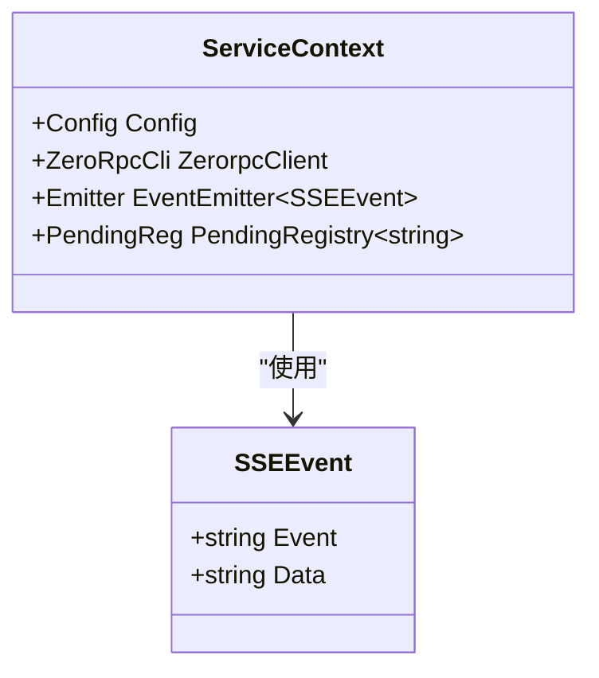
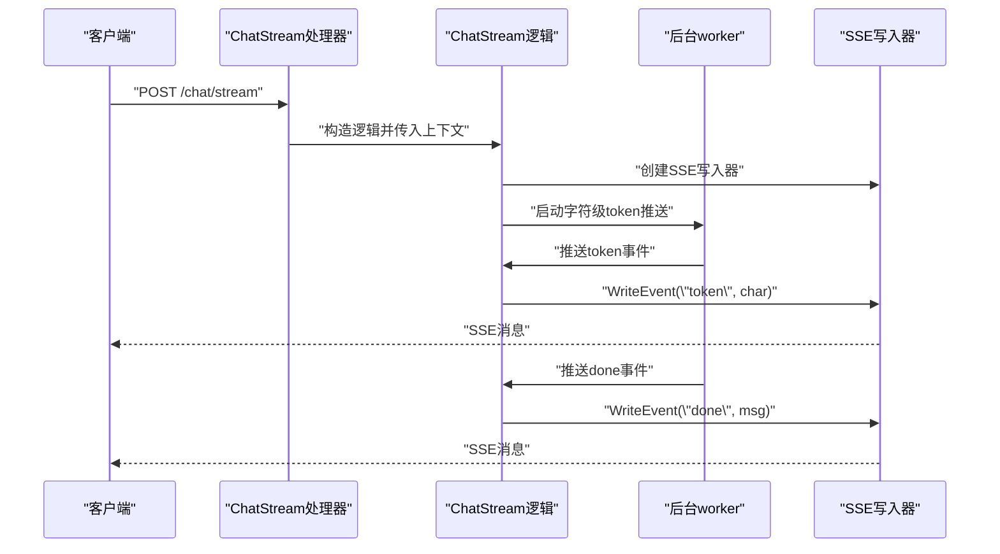
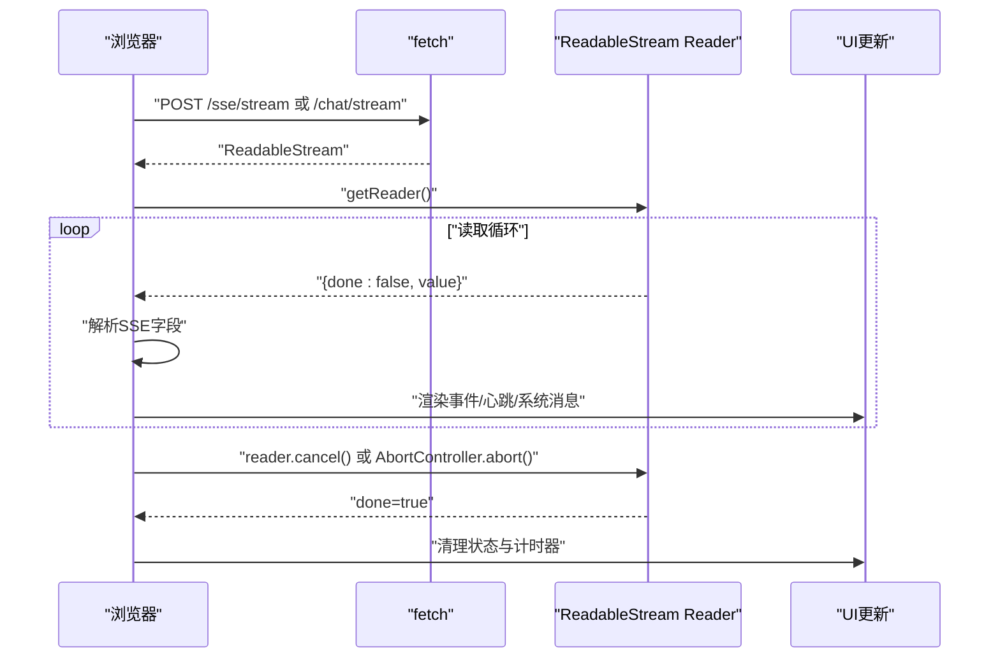
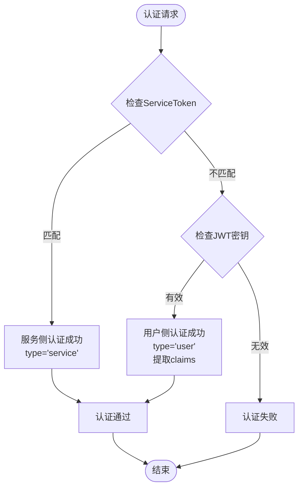
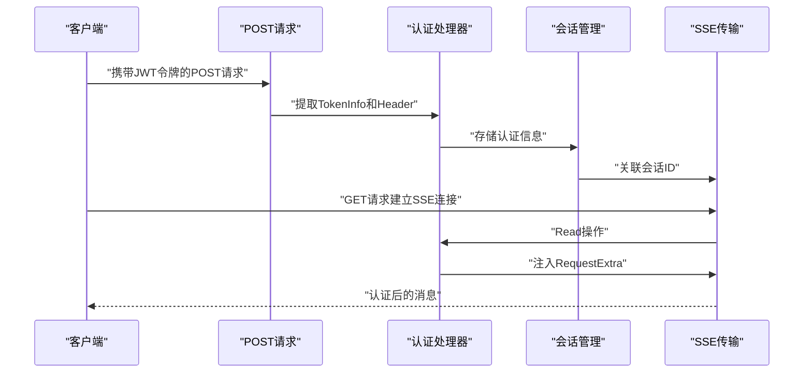
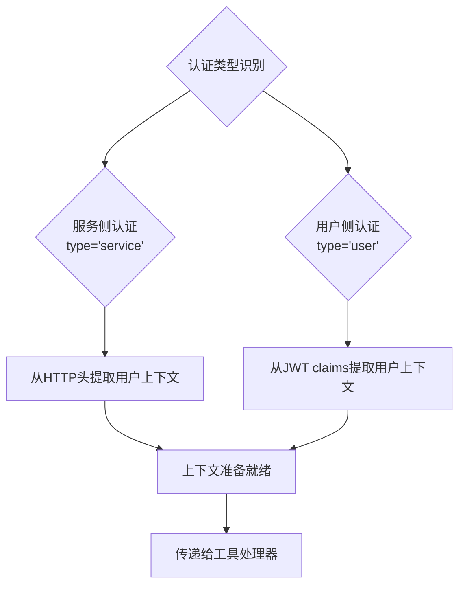
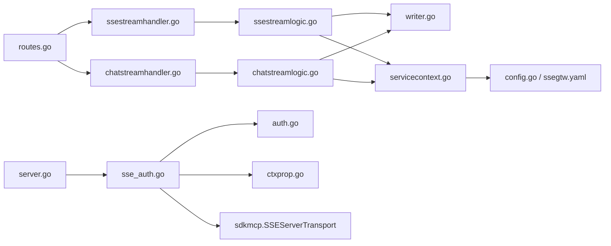

# Server-Sent Events流式传输

<cite>
**本文引用的文件**
- [writer.go](file://common/ssex/writer.go)
- [servicecontext.go](file://aiapp/ssegtw/internal/svc/servicecontext.go)
- [routes.go](file://aiapp/ssegtw/internal/handler/routes.go)
- [ssestreamhandler.go](file://aiapp/ssegtw/internal/handler/sse/ssestreamhandler.go)
- [chatstreamhandler.go](file://aiapp/ssegtw/internal/handler/sse/chatstreamhandler.go)
- [ssestreamlogic.go](file://aiapp/ssegtw/internal/logic/sse/ssestreamlogic.go)
- [chatstreamlogic.go](file://aiapp/ssegtw/internal/logic/sse/chatstreamlogic.go)
- [types.go](file://aiapp/ssegtw/internal/types/types.go)
- [config.go](file://aiapp/ssegtw/internal/config/config.go)
- [ssegtw.go](file://aiapp/ssegtw/ssegtw.go)
- [ssegtw.yaml](file://aiapp/ssegtw/etc/ssegtw.yaml)
- [ssegtw.api](file://aiapp/ssegtw/ssegtw.api)
- [pinghandler.go](file://aiapp/ssegtw/internal/handler/ssegtw/pinghandler.go)
- [sse_demo.html](file://aiapp/ssegtw/sse_demo.html)
- [sse_auth.go](file://common/mcpx/sse_auth.go)
- [auth.go](file://common/mcpx/auth.go)
- [ctxprop.go](file://common/mcpx/ctxprop.go)
- [server.go](file://common/mcpx/server.go)
- [config.go](file://common/mcpx/config.go)
- [config.go](file://aiapp/mcpserver/internal/config/config.go)
- [registry.go](file://aiapp/mcpserver/internal/tools/registry.go)
</cite>

## 更新摘要
**所做更改**
- 新增SSE认证增强系统章节，详细介绍双模式认证机制
- 更新MCP服务器配置与认证中间件集成
- 新增SSE传输层认证信息捕获与注入机制
- 补充用户上下文提取与认证类型识别功能
- 更新架构图以反映认证增强系统的集成

## 目录
1. [引言](#引言)
2. [项目结构](#项目结构)
3. [核心组件](#核心组件)
4. [架构总览](#架构总览)
5. [详细组件分析](#详细组件分析)
6. [SSE认证增强系统](#sse认证增强系统)
7. [依赖分析](#依赖分析)
8. [性能考虑](#性能考虑)
9. [故障排查指南](#故障排查指南)
10. [结论](#结论)
11. [附录](#附录)

## 引言
本技术文档围绕 Server-Sent Events（SSE）流式传输能力进行系统化梳理，覆盖协议实现原理、SSE写入器设计、网关服务架构、事件流管理与客户端连接处理、最佳实践、与AI应用的集成方式、客户端集成示例、性能优化建议以及与WebSocket的差异与适用场景。特别新增了完整的SSE认证增强系统，提供双模式认证机制，支持服务侧连接级认证和用户侧JWT认证，确保在SSE传输层也能正确传递和使用认证信息。

## 项目结构
SSE能力主要分布在以下模块：
- 网关入口与配置：服务启动、路由注册、跨域配置
- 处理器层：SSE事件流与AI对话流的HTTP处理器
- 业务逻辑层：SSE事件流与AI对话流的具体实现
- 通用SSE写入器：封装SSE协议写入与自动刷新
- 服务上下文：RPC客户端、事件发射器、待完成注册表
- 类型定义：请求与响应模型
- 客户端演示页面：用于本地联调与验证
- **新增**：SSE认证增强系统：提供完整的认证解决方案



**图表来源**
- [ssegtw.go:26-59](file://aiapp/ssegtw/ssegtw.go#L26-L59)
- [routes.go:17-50](file://aiapp/ssegtw/internal/handler/routes.go#L17-L50)
- [config.go:11-14](file://aiapp/ssegtw/internal/config/config.go#L11-L14)
- [sse_auth.go:28-48](file://common/mcpx/sse_auth.go#L28-L48)
- [auth.go:21-60](file://common/mcpx/auth.go#L21-L60)
- [ctxprop.go:34-64](file://common/mcpx/ctxprop.go#L34-L64)
- [server.go:92-124](file://common/mcpx/server.go#L92-L124)

**章节来源**
- [ssegtw.go:26-59](file://aiapp/ssegtw/ssegtw.go#L26-L59)
- [routes.go:17-50](file://aiapp/ssegtw/internal/handler/routes.go#L17-L50)
- [config.go:11-14](file://aiapp/ssegtw/internal/config/config.go#L11-L14)

## 核心组件
- SSE写入器（Writer）：封装SSE协议写入，确保每条消息后自动Flush，支持事件名、纯数据与注释行写入，并内置心跳保活。
- 服务上下文（ServiceContext）：聚合REST配置、zrpc客户端、事件发射器与待完成注册表，支撑事件订阅与完成信号等待。
- SSE事件流处理器与逻辑：负责解析请求、建立通道、订阅事件、转发消息、心跳保活与完成信号处理。
- AI对话流处理器与逻辑：在事件流基础上，注入"token"事件流，模拟实时对话令牌输出，最终发出"done"完成事件。
- **新增**：SSE认证增强系统：提供双模式认证机制，支持服务侧连接级认证和用户侧JWT认证，确保SSE传输层的完整认证支持。
- 路由与API定义：声明SSE端点与普通端点，配合REST框架启用SSE模式。
- 客户端演示页面：提供浏览器端SSE连接、事件解析、统计与断开控制。

**章节来源**
- [writer.go:8-55](file://common/ssex/writer.go#L8-L55)
- [servicecontext.go:17-38](file://aiapp/ssegtw/internal/svc/servicecontext.go#L17-L38)
- [ssestreamlogic.go:39-117](file://aiapp/ssegtw/internal/logic/sse/ssestreamlogic.go#L39-L117)
- [chatstreamlogic.go:39-120](file://aiapp/ssegtw/internal/logic/sse/chatstreamlogic.go#L39-L120)
- [routes.go:17-50](file://aiapp/ssegtw/internal/handler/routes.go#L17-L50)
- [ssegtw.api:24-38](file://aiapp/ssegtw/ssegtw.api#L24-L38)
- [sse_demo.html:558-635](file://aiapp/ssegtw/sse_demo.html#L558-L635)

## 架构总览
SSE网关采用"HTTP处理器 -> 业务逻辑 -> 通用写入器"的分层设计。处理器负责参数解析与上下文传递；逻辑层负责事件订阅、通道管理、心跳与完成信号；写入器负责SSE协议格式化与刷新。服务上下文统一管理RPC与事件系统，保证多路并发连接的稳定性。**新增的认证增强系统**通过自定义SSE处理器桥接标准SDK的认证信息传递缺陷，确保POST请求中的JWT认证信息能够正确注入到SSE传输层。



**图表来源**
- [sse_auth.go:50-129](file://common/mcpx/sse_auth.go#L50-L129)
- [auth.go:21-60](file://common/mcpx/auth.go#L21-L60)
- [ssestreamhandler.go:18-32](file://aiapp/ssegtw/internal/handler/sse/ssestreamhandler.go#L18-L32)
- [chatstreamhandler.go:18-32](file://aiapp/ssegtw/internal/handler/sse/chatstreamhandler.go#L18-L32)
- [ssestreamlogic.go:39-117](file://aiapp/ssegtw/internal/logic/sse/ssestreamlogic.go#L39-L117)
- [chatstreamlogic.go:39-120](file://aiapp/ssegtw/internal/logic/sse/chatstreamlogic.go#L39-L120)
- [writer.go:23-54](file://common/ssex/writer.go#L23-L54)

## 详细组件分析

### SSE写入器（Writer）
- 设计要点
  - 通过接口断言确认底层ResponseWriter支持Flush，否则拒绝流式写入。
  - 提供三种写入方法：带事件名的事件消息、纯数据消息、注释行（客户端忽略）。
  - 内置心跳保活：通过注释行实现keepalive，维持连接活跃。
- 数据编码与刷新
  - 使用格式化输出写入SSE字段，随后立即Flush以确保客户端即时收到。
- 缓冲与连接状态
  - 写入器不自行缓存数据，依赖HTTP栈的Flush行为；连接状态由上层逻辑与客户端生命周期决定。



**图表来源**
- [writer.go:8-55](file://common/ssex/writer.go#L8-L55)

**章节来源**
- [writer.go:14-21](file://common/ssex/writer.go#L14-L21)
- [writer.go:23-54](file://common/ssex/writer.go#L23-L54)

### 服务上下文（ServiceContext）
- 组成
  - 配置：REST与RPC配置。
  - RPC客户端：基于zrpc，带元数据拦截器。
  - 事件发射器：用于按通道分发事件。
  - 待完成注册表：用于等待"完成"信号，触发连接收尾。
- 生命周期
  - 在服务启动时初始化，贯穿所有SSE连接的生命周期。



**图表来源**
- [servicecontext.go:23-38](file://aiapp/ssegtw/internal/svc/servicecontext.go#L23-L38)
- [types.go:17-21](file://aiapp/ssegtw/internal/types/types.go#L17-L21)

**章节来源**
- [servicecontext.go:30-38](file://aiapp/ssegtw/internal/svc/servicecontext.go#L30-L38)

### SSE事件流处理器与逻辑
- 处理器职责
  - 解析请求参数（Channel），构造逻辑对象，调用SSE流逻辑。
- 逻辑流程
  - 生成或复用Channel，注册完成信号，订阅事件通道，发送connected事件。
  - 启动后台任务推送预设事件序列，结束后发出done事件并Resolve完成信号。
  - 主循环监听事件通道与客户端取消信号，周期性发送心跳保活。
- 错误处理
  - 写入器创建失败直接返回；其他错误记录日志但不中断客户端连接。


**图表来源**
- [ssestreamhandler.go:18-32](file://aiapp/ssegtw/internal/handler/sse/ssestreamhandler.go#L18-L32)
- [ssestreamlogic.go:39-117](file://aiapp/ssegtw/internal/logic/sse/ssestreamlogic.go#L39-L117)

**章节来源**
- [ssestreamhandler.go:18-32](file://aiapp/ssegtw/internal/handler/sse/ssestreamhandler.go#L18-L32)
- [ssestreamlogic.go:39-117](file://aiapp/ssegtw/internal/logic/sse/ssestreamlogic.go#L39-L117)

### AI对话流处理器与逻辑
- 处理器职责
  - 解析请求参数（Channel、Prompt），构造逻辑对象，调用AI对话流逻辑。
- 逻辑流程
  - 生成或复用Channel，注册完成信号，订阅事件通道，发送connected事件。
  - 后台任务按字符速率推送"token"事件，最后推送"done"事件并Resolve完成信号。
  - 主循环转发事件、心跳保活，客户端断开或完成信号触发退出。
- 实时性
  - 通过逐字符延迟与事件分发，模拟真实对话流体验。



**图表来源**
- [chatstreamhandler.go:18-32](file://aiapp/ssegtw/internal/handler/sse/chatstreamhandler.go#L18-L32)
- [chatstreamlogic.go:39-120](file://aiapp/ssegtw/internal/logic/sse/chatstreamlogic.go#L39-L120)

**章节来源**
- [chatstreamhandler.go:18-32](file://aiapp/ssegtw/internal/handler/sse/chatstreamhandler.go#L18-L32)
- [chatstreamlogic.go:39-120](file://aiapp/ssegtw/internal/logic/sse/chatstreamlogic.go#L39-L120)

### 路由与API定义
- 路由
  - SSE事件流：POST /ssegtw/v1/sse/stream
  - AI对话流：POST /ssegtw/v1/sse/chat/stream
  - 健康检查：GET /ssegtw/v1/ping
- API定义
  - SSEStreamRequest：可选Channel
  - ChatStreamRequest：可选Channel与Prompt
  - 返回PingReply作为健康检查结果

**章节来源**
- [routes.go:17-50](file://aiapp/ssegtw/internal/handler/routes.go#L17-L50)
- [ssegtw.api:24-38](file://aiapp/ssegtw/ssegtw.api#L24-L38)
- [types.go:6-17](file://aiapp/ssegtw/internal/types/types.go#L6-L17)

### 客户端集成示例（浏览器）
- 连接步骤
  - 构造请求体（可包含Channel与Prompt），发起POST请求。
  - 获取ReadableStream，逐段解码，按SSE字段解析事件名与数据。
  - 统计事件数量、心跳次数与耗时，支持清空与断开。
- 断开与清理
  - 使用AbortController中断读取，清理状态与计时器。



**图表来源**
- [sse_demo.html:558-635](file://aiapp/ssegtw/sse_demo.html#L558-L635)

**章节来源**
- [sse_demo.html:558-635](file://aiapp/ssegtw/sse_demo.html#L558-L635)

## SSE认证增强系统

### 双模式认证机制
SSE认证增强系统提供完整的双模式认证解决方案：

#### 服务侧连接级认证（ServiceToken）
- 优先级最高的认证方式
- 使用常量时间比较算法确保安全性
- 适用于服务间的连接级鉴权
- TokenInfo.Extra["type"] 标识为"service"

#### 用户侧JWT认证
- 作为服务侧认证的备选方案
- 解析JWT令牌并提取用户信息
- 从claims中提取用户ID和其他属性
- TokenInfo.Extra["type"] 标识为"user"



**图表来源**
- [auth.go:21-60](file://common/mcpx/auth.go#L21-L60)

**章节来源**
- [auth.go:21-60](file://common/mcpx/auth.go#L21-L60)

### SSE传输层认证信息捕获
标准的MCP SDK SSEHandler存在认证信息丢失的问题，因为只传递JSON-RPC消息体而丢弃HTTP请求上下文。认证增强系统通过自定义authSSEHandler解决此问题：

#### 认证信息捕获流程
1. **POST请求处理**：从请求上下文中提取TokenInfo和HTTP头信息
2. **会话管理**：为每个SSE连接创建独立的会话，使用sessionid关联
3. **认证信息存储**：使用原子指针存储捕获的认证信息
4. **传输层注入**：在Read操作时将认证信息注入到RequestExtra



**图表来源**
- [sse_auth.go:50-129](file://common/mcpx/sse_auth.go#L50-L129)
- [sse_auth.go:151-165](file://common/mcpx/sse_auth.go#L151-L165)

**章节来源**
- [sse_auth.go:28-48](file://common/mcpx/sse_auth.go#L28-L48)
- [sse_auth.go:50-129](file://common/mcpx/sse_auth.go#L50-L129)
- [sse_auth.go:151-165](file://common/mcpx/sse_auth.go#L151-L165)

### 用户上下文提取与认证类型识别
认证增强系统提供完整的用户上下文提取功能，支持两种认证模式：

#### HTTP Header提取（服务侧）
- 从服务侧透传的HTTP头中提取用户信息
- 适用于服务级认证场景
- 字段包括：X-User-Id、X-User-Name等

#### JWT Claims提取（用户侧）
- 从TokenInfo.Extra中提取JWT claims
- 覆盖HTTP头中的同名字段
- 提供更丰富的用户属性信息



**图表来源**
- [ctxprop.go:34-64](file://common/mcpx/ctxprop.go#L34-L64)
- [ctxprop.go:66-83](file://common/mcpx/ctxprop.go#L66-L83)

**章节来源**
- [ctxprop.go:21-64](file://common/mcpx/ctxprop.go#L21-L64)
- [ctxprop.go:66-83](file://common/mcpx/ctxprop.go#L66-L83)

### MCP服务器配置与集成
认证增强系统与MCP服务器无缝集成：

#### 服务器配置
- 支持JWT密钥配置和ServiceToken配置
- 自动检测认证配置并启用相应的中间件
- 提供SSE和Streamable两种传输模式

#### 传输层配置
- SSE传输：使用自定义authSSEHandler
- Streamable传输：使用标准SDK处理器
- 统一的路由注册和超时配置

**章节来源**
- [server.go:13-30](file://common/mcpx/server.go#L13-L30)
- [server.go:92-124](file://common/mcpx/server.go#L92-L124)
- [server.go:126-145](file://common/mcpx/server.go#L126-L145)

## 依赖分析
- 组件耦合
  - 处理器依赖逻辑层；逻辑层依赖写入器与服务上下文；服务上下文依赖RPC与事件系统。
  - **新增**：认证增强系统依赖MCP SDK和Go-Zero认证组件。
- 外部依赖
  - REST框架启用SSE模式；zrpc客户端用于RPC调用；事件发射器与待完成注册表提供异步事件与完成信号。
  - **新增**：MCP SDK提供SSE传输层支持；JWT库用于令牌解析。
- 潜在风险
  - 写入器必须支持Flush，否则无法启用SSE；心跳周期与事件频率需平衡实时性与资源消耗。
  - **新增**：认证信息捕获时机必须在消息传递之前，确保传输层能够正确获取认证信息。



**图表来源**
- [routes.go:17-50](file://aiapp/ssegtw/internal/handler/routes.go#L17-L50)
- [ssestreamhandler.go:18-32](file://aiapp/ssegtw/internal/handler/sse/ssestreamhandler.go#L18-L32)
- [chatstreamhandler.go:18-32](file://aiapp/ssegtw/internal/handler/sse/chatstreamhandler.go#L18-L32)
- [ssestreamlogic.go:39-117](file://aiapp/ssegtw/internal/logic/sse/ssestreamlogic.go#L39-L117)
- [chatstreamlogic.go:39-120](file://aiapp/ssegtw/internal/logic/sse/chatstreamlogic.go#L39-L120)
- [writer.go:8-55](file://common/ssex/writer.go#L8-L55)
- [servicecontext.go:23-38](file://aiapp/ssegtw/internal/svc/servicecontext.go#L23-L38)
- [config.go:11-14](file://aiapp/ssegtw/internal/config/config.go#L11-L14)
- [sse_auth.go:28-48](file://common/mcpx/sse_auth.go#L28-L48)
- [auth.go:21-60](file://common/mcpx/auth.go#L21-L60)
- [ctxprop.go:34-64](file://common/mcpx/ctxprop.go#L34-L64)
- [server.go:92-124](file://common/mcpx/server.go#L92-L124)

**章节来源**
- [routes.go:17-50](file://aiapp/ssegtw/internal/handler/routes.go#L17-L50)
- [servicecontext.go:23-38](file://aiapp/ssegtw/internal/svc/servicecontext.go#L23-L38)

## 性能考虑
- 缓冲与刷新
  - 写入器不缓存数据，依赖Flush保证低延迟；避免在上层重复缓冲。
- 心跳策略
  - 默认30秒心跳，可根据网络环境调整；过短会增加CPU与带宽压力。
- 并发与资源
  - 每个SSE连接占用一个goroutine与IO资源；建议限制最大并发连接数并设置超时。
- RPC与事件发射
  - RPC调用应异步化，避免阻塞事件通道；事件发射器应具备背压保护。
- 连接池与资源清理
  - zrpc客户端复用连接；服务停止时确保关闭所有活动连接与事件订阅。
- 客户端侧
  - 浏览器端使用AbortController及时释放资源；UI渲染批量更新减少重绘。
- **新增**：认证性能优化
  - ServiceToken使用常量时间比较，避免时序攻击
  - JWT解析结果可缓存，减少重复计算
  - 认证信息捕获采用原子操作，确保线程安全

## 故障排查指南
- 写入器创建失败
  - 现象：直接返回错误，无法建立SSE连接。
  - 排查：确认底层ResponseWriter支持Flush；检查中间层是否拦截了Flush。
- 连接无事件
  - 现象：客户端收到connected但无后续事件。
  - 排查：确认后台任务是否正常推送事件；检查事件通道订阅是否正确；核对Channel一致性。
- 心跳缺失
  - 现象：长时间无心跳保活。
  - 排查：检查心跳定时器是否运行；确认主循环未被阻塞。
- 客户端断开未清理
  - 现象：连接泄漏或内存增长。
  - 排查：确认主循环监听取消信号并及时cancel事件通道；清理计时器与状态。
- 健康检查失败
  - 现象：/ping返回异常。
  - 排查：查看日志与配置；确认服务上下文初始化成功。
- **新增**：认证相关问题
  - 认证失败：检查JWT密钥配置和ServiceToken设置
  - 认证信息丢失：确认POST请求中的JWT令牌正确传递
  - 用户上下文提取失败：验证HTTP头字段和服务侧透传配置

**章节来源**
- [writer.go:14-21](file://common/ssex/writer.go#L14-L21)
- [ssestreamlogic.go:96-118](file://aiapp/ssegtw/internal/logic/sse/ssestreamlogic.go#L96-L118)
- [chatstreamlogic.go:95-118](file://aiapp/ssegtw/internal/logic/sse/chatstreamlogic.go#L95-L118)
- [pinghandler.go:14-25](file://aiapp/ssegtw/internal/handler/ssegtw/pinghandler.go#L14-L25)

## 结论
本SSE实现以简洁的写入器为核心，结合事件发射器与待完成注册表，提供了可靠的单向数据流能力。**新增的SSE认证增强系统**通过双模式认证机制，支持服务侧连接级认证和用户侧JWT认证，确保在SSE传输层也能正确传递和使用认证信息。通过明确的路由与API定义、完善的处理器与逻辑层、详尽的客户端演示，以及完整的认证解决方案，能够满足实时对话流、事件推送与状态同步等典型场景的安全需求。建议在生产环境中关注心跳策略、并发控制、资源清理以及认证性能优化，并根据业务需求选择合适的协议（SSE vs WebSocket）。

## 附录

### 与WebSocket的差异与适用场景
- 单向性
  - SSE为服务器到客户端单向推送，简化了状态管理；WebSocket双向通信，适合交互频繁的场景。
- 协议特性
  - SSE自动重连、事件ID与last-event-id支持断点续推；WebSocket需要自定义重连与消息序号。
- 适用场景
  - SSE：实时通知、日志流、对话流、状态同步。
  - WebSocket：实时游戏、协作编辑、低延迟交互。
- **新增**：认证支持
  - SSE：通过认证增强系统支持完整的认证链路
  - WebSocket：通常需要额外的认证中间件支持

### 认证配置示例
```yaml
# MCP服务器认证配置
mcp:
  auth:
    jwtSecrets:
      - "your-jwt-secret-key"
    serviceToken: "your-service-token"
  useStreamable: false  # 使用SSE传输
  sseEndpoint: "/mcp"   # SSE端点
```