# Server-Sent Events流式传输

<cite>
**本文引用的文件**
- [writer.go](file://common/ssex/writer.go)
- [servicecontext.go](file://aiapp/ssegtw/internal/svc/servicecontext.go)
- [routes.go](file://aiapp/ssegtw/internal/handler/routes.go)
- [ssestreamhandler.go](file://aiapp/ssegtw/internal/handler/sse/ssestreamhandler.go)
- [chatstreamhandler.go](file://aiapp/ssegtw/internal/handler/sse/chatstreamhandler.go)
- [ssestreamlogic.go](file://aiapp/ssegtw/internal/logic/sse/ssestreamlogic.go)
- [chatstreamlogic.go](file://aiapp/ssegtw/internal/logic/sse/chatstreamlogic.go)
- [types.go](file://aiapp/ssegtw/internal/types/types.go)
- [config.go](file://aiapp/ssegtw/internal/config/config.go)
- [ssegtw.go](file://aiapp/ssegtw/ssegtw.go)
- [ssegtw.yaml](file://aiapp/ssegtw/etc/ssegtw.yaml)
- [ssegtw.api](file://aiapp/ssegtw/ssegtw.api)
- [pinghandler.go](file://aiapp/ssegtw/internal/handler/ssegtw/pinghandler.go)
- [sse_demo.html](file://aiapp/ssegtw/sse_demo.html)
- [auth.go](file://common/mcpx/auth.go)
- [ctxprop.go](file://common/mcpx/ctxprop.go)
- [server.go](file://common/mcpx/server.go)
- [wrapper.go](file://common/mcpx/wrapper.go)
- [config.go](file://common/mcpx/config.go)
- [ctx.go](file://common/ctxprop/ctx.go)
- [http.go](file://common/ctxprop/http.go)
- [ctxData.go](file://common/ctxdata/ctxData.go)
- [msgbody.go](file://common/msgbody/msgbody.go)
- [trace.go](file://common/mqttx/trace.go)
- [publishwithtracelogic.go](file://app/bridgemqtt/internal/logic/publishwithtracelogic.go)
- [sendtriggerlogic.go](file://app/trigger/internal/logic/sendtriggerlogic.go)
- [sendprototriggerlogic.go](file://app/trigger/internal/logic/sendprototriggerlogic.go)
- [asynqClient.go](file://common/asynqx/asynqClient.go)
- [asynqTaskServer.go](file://common/asynqx/asynqTaskServer.go)
- [cronservice.go](file://app/trigger/cron/cronservice.go)
</cite>

## 更新摘要
**所做更改**
- 新增分布式追踪章节，详细介绍SSE请求处理的trace上下文提取和传播机制
- 更新认证与用户上下文章节，增加trace上下文在MCP客户端中的集成
- 新增追踪集成最佳实践，包括跨组件的链路传播和监控
- 更新架构图以反映追踪系统的集成

## 目录
1. [引言](#引言)
2. [项目结构](#项目结构)
3. [核心组件](#核心组件)
4. [架构总览](#架构总览)
5. [详细组件分析](#详细组件分析)
6. [认证与用户上下文](#认证与用户上下文)
7. [分布式追踪系统](#分布式追踪系统)
8. [依赖分析](#依赖分析)
9. [性能考虑](#性能考虑)
10. [故障排查指南](#故障排查指南)
11. [结论](#结论)
12. [附录](#附录)

## 引言
本技术文档围绕 Server-Sent Events（SSE）流式传输能力进行系统化梳理，覆盖协议实现原理、SSE写入器设计、网关服务架构、事件流管理与客户端连接处理、最佳实践、与AI应用的集成方式、客户端集成示例、性能优化建议以及与WebSocket的差异与适用场景。经过架构简化，现在直接使用SDK的SSEHandler，认证信息通过客户端每消息注入，大大简化了SSE传输设置。**更新**：当前版本已移除SSE特定优化功能，转而支持通用MCP协议标准。**新增**：SSE请求处理现已支持分布式追踪，包括trace上下文的提取和传播机制，以及与MCP客户端的追踪集成。

## 项目结构
SSE能力主要分布在以下模块：
- 网关入口与配置：服务启动、路由注册、跨域配置
- 处理器层：SSE事件流与AI对话流的HTTP处理器
- 业务逻辑层：SSE事件流与AI对话流的具体实现
- 通用SSE写入器：封装SSE协议写入与自动刷新
- 服务上下文：RPC客户端、事件发射器、待完成注册表
- 类型定义：请求与响应模型
- 客户端演示页面：用于本地联调与验证
- **更新**：通用MCP协议支持：移除了SSE特定优化，现在支持标准MCP协议
- **新增**：分布式追踪系统：集成OpenTelemetry进行链路追踪

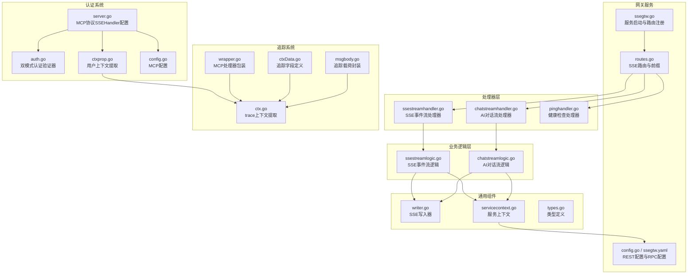

**图表来源**
- [ssegtw.go:26-59](file://aiapp/ssegtw/ssegtw.go#L26-L59)
- [routes.go:17-50](file://aiapp/ssegtw/internal/handler/routes.go#L17-L50)
- [config.go:11-14](file://aiapp/ssegtw/internal/config/config.go#L11-L14)
- [server.go:93-103](file://common/mcpx/server.go#L93-L103)
- [auth.go:21-60](file://common/mcpx/auth.go#L21-L60)
- [ctxprop.go:21-79](file://common/mcpx/ctxprop.go#L21-L79)
- [ctx.go:43-51](file://common/ctxprop/ctx.go#L43-L51)
- [wrapper.go:44-48](file://common/mcpx/wrapper.go#L44-L48)
- [ctxData.go:32-38](file://common/ctxdata/ctxData.go#L32-L38)
- [msgbody.go:5-19](file://common/msgbody/msgbody.go#L5-L19)

**章节来源**
- [ssegtw.go:26-59](file://aiapp/ssegtw/ssegtw.go#L26-L59)
- [routes.go:17-50](file://aiapp/ssegtw/internal/handler/routes.go#L17-L50)
- [config.go:11-14](file://aiapp/ssegtw/internal/config/config.go#L11-L14)

## 核心组件
- SSE写入器（Writer）：封装SSE协议写入，确保每条消息后自动Flush，支持事件名、纯数据与注释行写入，并内置心跳保活。
- 服务上下文（ServiceContext）：聚合REST配置、zrpc客户端、事件发射器与待完成注册表，支撑事件订阅与完成信号等待。
- SSE事件流处理器与逻辑：负责解析请求、建立通道、订阅事件、转发消息、心跳保活与完成信号处理。
- AI对话流处理器与逻辑：在事件流基础上，注入"token"事件流，模拟实时对话令牌输出，最终发出"done"完成事件。
- **更新**：通用MCP协议支持：移除了SSE特定优化功能，现在支持标准MCP协议规范，认证信息通过每消息注入。
- **新增**：分布式追踪支持：集成OpenTelemetry进行trace上下文提取和传播，支持跨组件链路追踪。
- 路由与API定义：声明SSE端点与普通端点，配合REST框架启用SSE模式。
- 客户端演示页面：提供浏览器端SSE连接、事件解析、统计与断开控制。

**章节来源**
- [writer.go:8-55](file://common/ssex/writer.go#L8-L55)
- [servicecontext.go:17-38](file://aiapp/ssegtw/internal/svc/servicecontext.go#L17-L38)
- [ssestreamlogic.go:39-117](file://aiapp/ssegtw/internal/logic/sse/ssestreamlogic.go#L39-L117)
- [chatstreamlogic.go:39-120](file://aiapp/ssegtw/internal/logic/sse/chatstreamlogic.go#L39-L120)
- [routes.go:17-50](file://aiapp/ssegtw/internal/handler/routes.go#L17-L50)
- [ssegtw.api:24-38](file://aiapp/ssegtw/ssegtw.api#L24-L38)
- [sse_demo.html:558-635](file://aiapp/ssegtw/sse_demo.html#L558-L635)

## 架构总览
SSE网关采用"HTTP处理器 -> 业务逻辑 -> 通用写入器"的分层设计。处理器负责参数解析与上下文传递；逻辑层负责事件订阅、通道管理、心跳与完成信号；写入器负责SSE协议格式化与刷新。服务上下文统一管理RPC与事件系统，保证多路并发连接的稳定性。**更新**：认证系统通过SDK的MCP协议SSEHandler直接处理认证，用户上下文通过每消息注入机制传递，无需自定义认证桥接。**新增**：追踪系统集成OpenTelemetry，通过mapMetaCarrier实现trace上下文在SSE请求中的提取和传播。

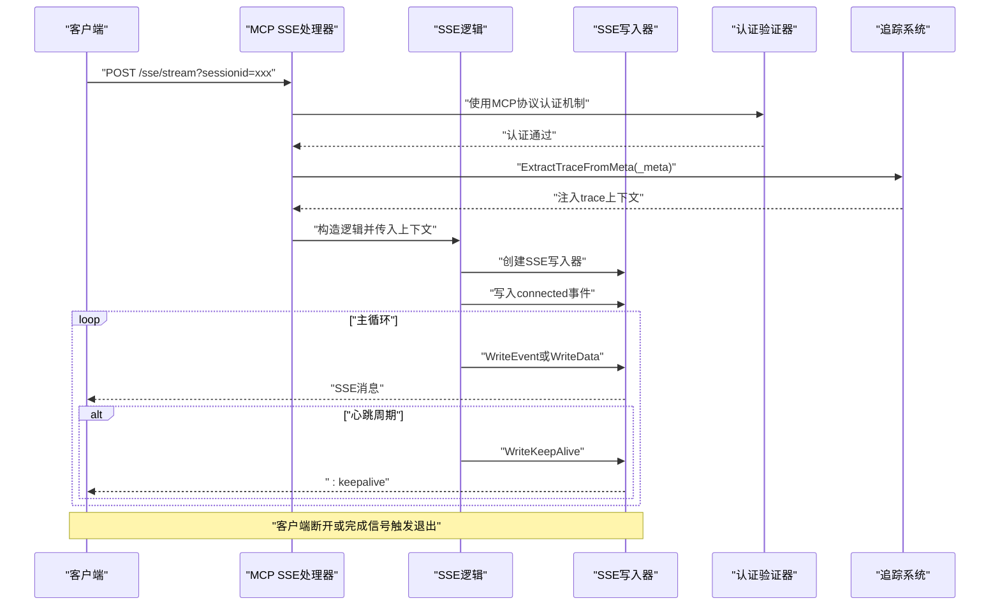

**图表来源**
- [server.go:93-103](file://common/mcpx/server.go#L93-L103)
- [auth.go:21-60](file://common/mcpx/auth.go#L21-L60)
- [ssestreamhandler.go:18-32](file://aiapp/ssegtw/internal/handler/sse/ssestreamhandler.go#L18-L32)
- [chatstreamhandler.go:18-32](file://aiapp/ssegtw/internal/handler/sse/chatstreamhandler.go#L18-L32)
- [ssestreamlogic.go:39-117](file://aiapp/ssegtw/internal/logic/sse/ssestreamlogic.go#L39-L117)
- [chatstreamlogic.go:39-120](file://aiapp/ssegtw/internal/logic/sse/chatstreamlogic.go#L39-L120)
- [writer.go:23-54](file://common/ssex/writer.go#L23-L54)
- [ctx.go:43-51](file://common/ctxprop/ctx.go#L43-L51)
- [wrapper.go:44-48](file://common/mcpx/wrapper.go#L44-L48)

## 详细组件分析

### SSE写入器（Writer）
- 设计要点
  - 通过接口断言确认底层ResponseWriter支持Flush，否则拒绝流式写入。
  - 提供三种写入方法：带事件名的事件消息、纯数据消息、注释行（客户端忽略）。
  - 内置心跳保活：通过注释行实现keepalive，维持连接活跃。
- 数据编码与刷新
  - 使用格式化输出写入SSE字段，随后立即Flush以确保客户端即时收到。
- 缓冲与连接状态
  - 写入器不自行缓存数据，依赖HTTP栈的Flush行为；连接状态由上层逻辑与客户端生命周期决定。

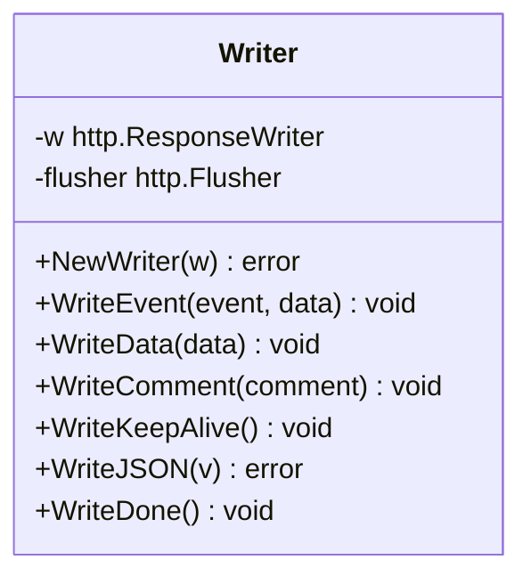

**图表来源**
- [writer.go:8-55](file://common/ssex/writer.go#L8-L55)

**章节来源**
- [writer.go:14-21](file://common/ssex/writer.go#L14-L21)
- [writer.go:23-54](file://common/ssex/writer.go#L23-L54)

### 服务上下文（ServiceContext）
- 组成
  - 配置：REST与RPC配置。
  - RPC客户端：基于zrpc，带元数据拦截器。
  - 事件发射器：用于按通道分发事件。
  - 待完成注册表：用于等待"完成"信号，触发连接收尾。
- 生命周期
  - 在服务启动时初始化，贯穿所有SSE连接的生命周期。

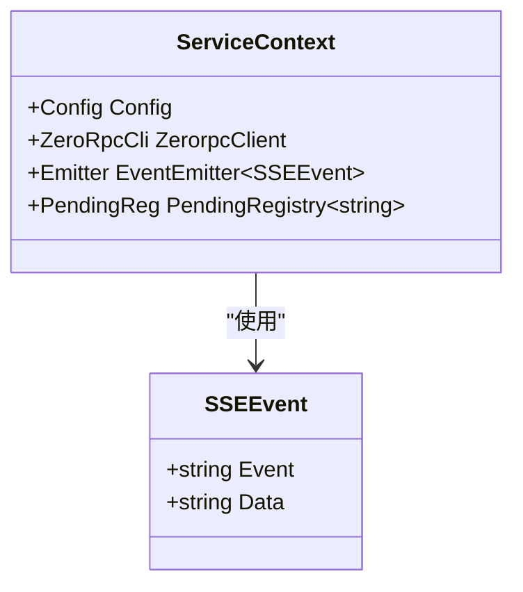

**图表来源**
- [servicecontext.go:23-38](file://aiapp/ssegtw/internal/svc/servicecontext.go#L23-L38)
- [types.go:17-21](file://aiapp/ssegtw/internal/types/types.go#L17-L21)

**章节来源**
- [servicecontext.go:30-38](file://aiapp/ssegtw/internal/svc/servicecontext.go#L30-L38)

### SSE事件流处理器与逻辑
- 处理器职责
  - 解析请求参数（Channel），构造逻辑对象，调用SSE流逻辑。
- 逻辑流程
  - 生成或复用Channel，注册完成信号，订阅事件通道，发送connected事件。
  - 启动后台任务推送预设事件序列，结束后发出done事件并Resolve完成信号。
  - 主循环监听事件通道与客户端取消信号，周期性发送心跳保活。
- 错误处理
  - 写入器创建失败直接返回；其他错误记录日志但不中断客户端连接。

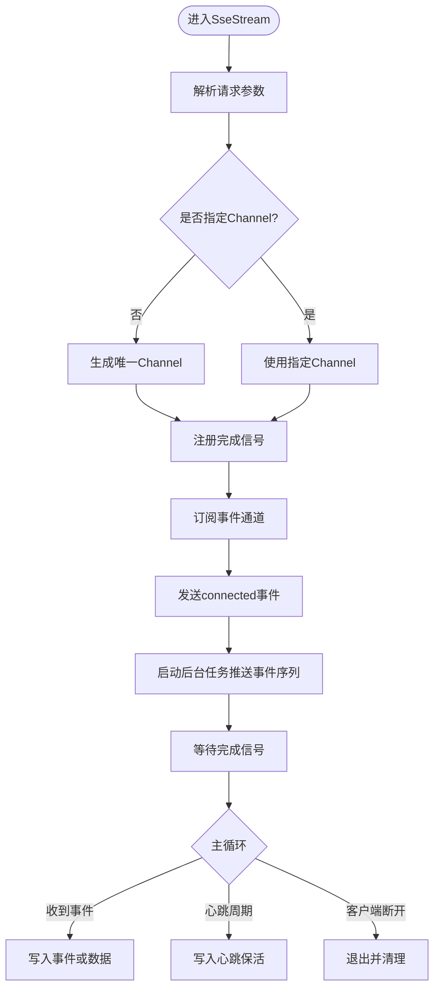

**图表来源**
- [ssestreamhandler.go:18-32](file://aiapp/ssegtw/internal/handler/sse/ssestreamhandler.go#L18-L32)
- [ssestreamlogic.go:39-117](file://aiapp/ssegtw/internal/logic/sse/ssestreamlogic.go#L39-L117)

**章节来源**
- [ssestreamhandler.go:18-32](file://aiapp/ssegtw/internal/handler/sse/ssestreamhandler.go#L18-L32)
- [ssestreamlogic.go:39-117](file://aiapp/ssegtw/internal/logic/sse/ssestreamlogic.go#L39-L117)

### AI对话流处理器与逻辑
- 处理器职责
  - 解析请求参数（Channel、Prompt），构造逻辑对象，调用AI对话流逻辑。
- 逻辑流程
  - 生成或复用Channel，注册完成信号，订阅事件通道，发送connected事件。
  - 后台任务按字符速率推送"token"事件，最后推送"done"事件并Resolve完成信号。
  - 主循环转发事件、心跳保活，客户端断开或完成信号触发退出。
- 实时性
  - 通过逐字符延迟与事件分发，模拟真实对话流体验。

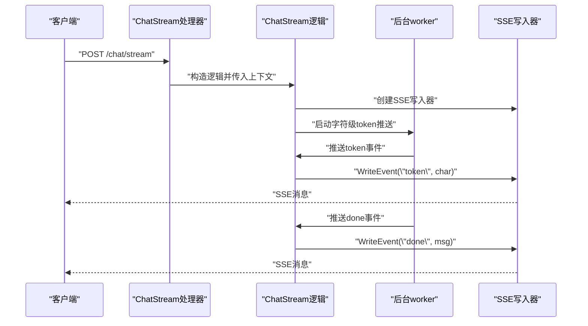

**图表来源**
- [chatstreamhandler.go:18-32](file://aiapp/ssegtw/internal/handler/sse/chatstreamhandler.go#L18-L32)
- [chatstreamlogic.go:39-120](file://aiapp/ssegtw/internal/logic/sse/chatstreamlogic.go#L39-L120)

**章节来源**
- [chatstreamhandler.go:18-32](file://aiapp/ssegtw/internal/handler/sse/chatstreamhandler.go#L18-L32)
- [chatstreamlogic.go:39-120](file://aiapp/ssegtw/internal/logic/sse/chatstreamlogic.go#L39-L120)

### 路由与API定义
- 路由
  - SSE事件流：POST /ssegtw/v1/sse/stream
  - AI对话流：POST /ssegtw/v1/sse/chat/stream
  - 健康检查：GET /ssegtw/v1/ping
- API定义
  - SSEStreamRequest：可选Channel
  - ChatStreamRequest：可选Channel与Prompt
  - 返回PingReply作为健康检查结果

**章节来源**
- [routes.go:17-50](file://aiapp/ssegtw/internal/handler/routes.go#L17-L50)
- [ssegtw.api:24-38](file://aiapp/ssegtw/ssegtw.api#L24-L38)
- [types.go:6-17](file://aiapp/ssegtw/internal/types/types.go#L6-L17)

### 客户端集成示例（浏览器）
- 连接步骤
  - 构造请求体（可包含Channel与Prompt），发起POST请求。
  - 获取ReadableStream，逐段解码，按SSE字段解析事件名与数据。
  - 统计事件数量、心跳次数与耗时，支持清空与断开。
- 断开与清理
  - 使用AbortController中断读取，清理状态与计时器。

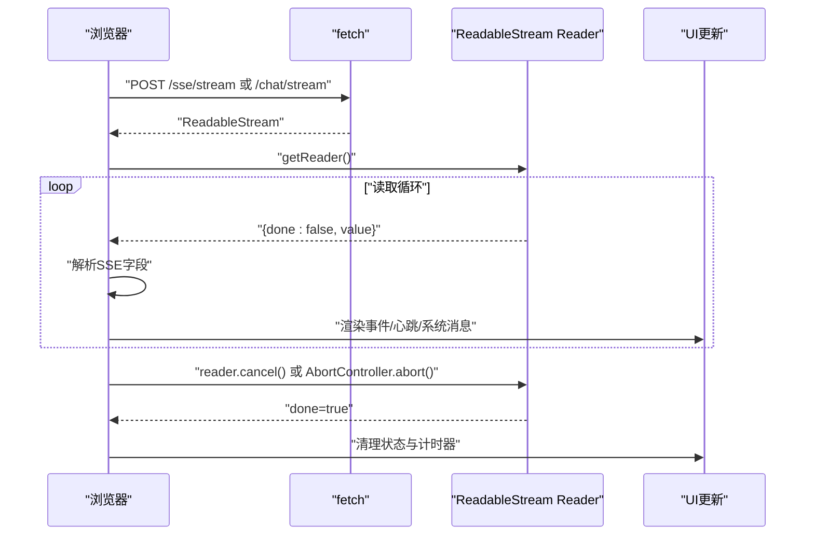

**图表来源**
- [sse_demo.html:558-635](file://aiapp/ssegtw/sse_demo.html#L558-L635)

**章节来源**
- [sse_demo.html:558-635](file://aiapp/ssegtw/sse_demo.html#L558-L635)

## 认证与用户上下文

### 通用MCP协议认证机制
经过架构简化，SSE认证系统现在直接使用SDK提供的MCP协议认证机制，无需自定义认证桥接：

#### MCP协议认证集成
- **直接使用MCP SSEHandler**：不再需要自定义authSSEHandler，直接使用sdkmcp.NewSSEHandler
- **认证中间件包装**：通过wrapAuth函数包装SDK处理器，支持JWT和ServiceToken双重认证
- **MCP配置**：在McpServerConf中配置jwtSecrets、serviceToken和sseEndpoint

#### 用户上下文每消息注入
新的认证机制通过每消息注入用户上下文，支持三种认证路径：

##### 1. Streamable传输（SDK自动填充）
- req.Extra由SDK自动填充，包含TokenInfo和HTTP头
- 直接从Header和TokenInfo提取用户上下文

##### 2. SSE + mcpx.Client（推荐）
- 用户上下文通过_mcpx.Client_注入到每个消息的_params._meta_字段
- 服务器从req.Params._meta_提取用户上下文

##### 3. SSE直连JWT（降级方案）
- 无_mcpx.Client_时，从连接级TokenInfo提取用户上下文
- 适用于直接SSE连接场景

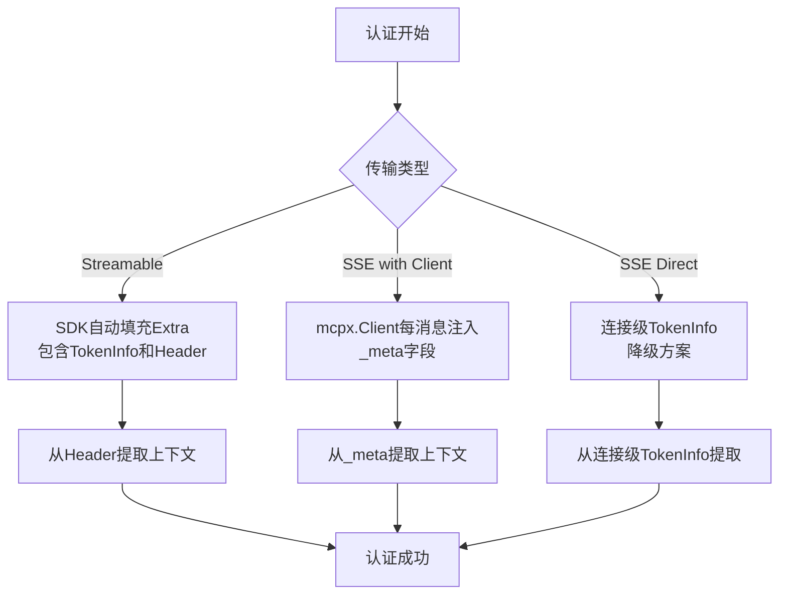

**图表来源**
- [ctxprop.go:21-79](file://common/mcpx/ctxprop.go#L21-L79)
- [server.go:93-103](file://common/mcpx/server.go#L93-L103)

**章节来源**
- [server.go:93-103](file://common/mcpx/server.go#L93-L103)
- [auth.go:21-60](file://common/mcpx/auth.go#L21-L60)
- [ctxprop.go:21-79](file://common/mcpx/ctxprop.go#L21-L79)

### 分布式追踪集成
**新增**：SSE请求处理现已支持分布式追踪，通过OpenTelemetry实现trace上下文的提取和传播：

#### Trace上下文提取机制
- **ExtractTraceFromMeta函数**：从_sse请求的_meta字段提取trace上下文
- **mapMetaCarrier实现**：将_meta映射为TextMapCarrier，支持OpenTelemetry传播
- **W3C traceparent标准**：遵循标准的trace上下文格式

#### MCP处理器包装
- **WithContext函数**：包装MCP工具处理器，自动提取trace上下文
- **多路径支持**：支持Streamable、SSE+Client、SSE直连三种传输模式
- **链路传播**：在每条消息中传播trace上下文

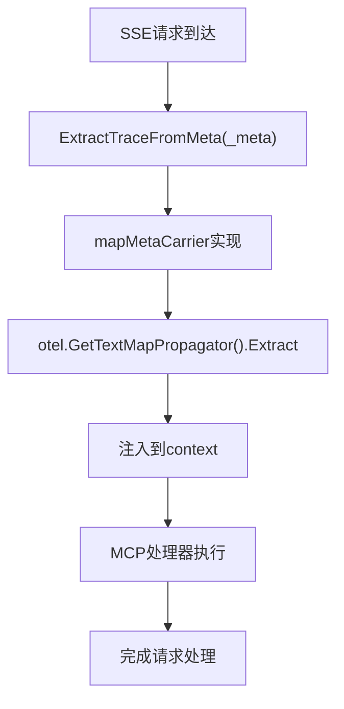

**图表来源**
- [ctx.go:43-51](file://common/ctxprop/ctx.go#L43-L51)
- [wrapper.go:44-48](file://common/mcpx/wrapper.go#L44-L48)
- [ctx.go:53-75](file://common/ctxprop/ctx.go#L53-L75)

**章节来源**
- [ctx.go:43-51](file://common/ctxprop/ctx.go#L43-L51)
- [wrapper.go:44-48](file://common/mcpx/wrapper.go#L44-L48)
- [ctx.go:53-75](file://common/ctxprop/ctx.go#L53-L75)

## 分布式追踪系统

### 追踪字段定义
**新增**：系统定义了统一的追踪字段，支持跨组件传播：

- **PropFields数组**：定义用户上下文和追踪字段的映射关系
- **CtxKey**：context.WithValue的键名
- **HttpHeader**：HTTP头部字段名
- **GrpcHeader**：gRPC元数据字段名
- **敏感字段标记**：支持日志脱敏

### 追踪载荷封装
**新增**：消息体支持trace上下文的封装：

- **MsgBody结构**：包含消息ID、trace载荷和消息内容
- **ProtoMsgBody结构**：gRPC消息的trace载荷封装
- **HeaderCarrier集成**：使用OpenTelemetry的标准载荷格式

### 跨组件追踪传播
**新增**：追踪系统支持多组件间的链路传播：

- **HTTP头部传播**：通过InjectToHTTPHeader和ExtractFromHTTPHeader
- **消息队列传播**：通过MessageCarrier实现MQTT消息的trace传播
- **异步任务传播**：通过asynqClient和asynqTaskServer的span创建

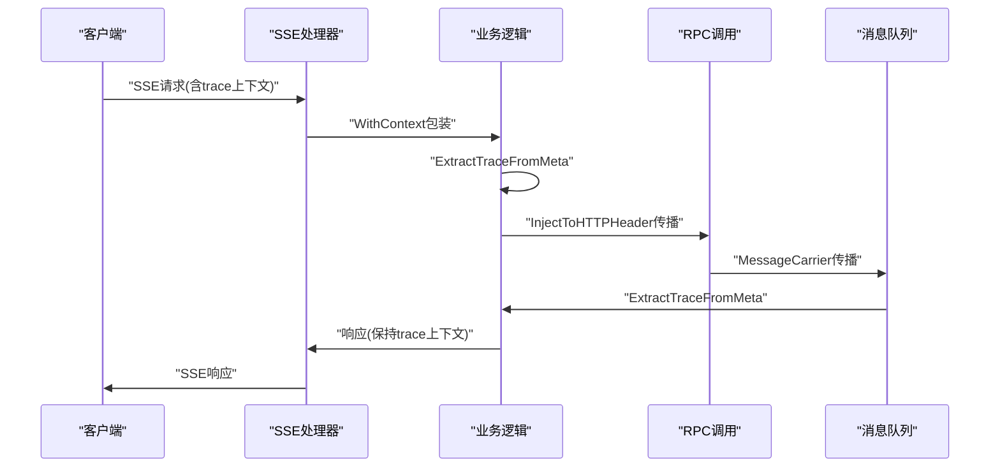

**图表来源**
- [ctx.go:12-26](file://common/ctxprop/ctx.go#L12-L26)
- [http.go:10-18](file://common/ctxprop/http.go#L10-L18)
- [msgbody.go:5-19](file://common/msgbody/msgbody.go#L5-L19)
- [trace.go:15-29](file://common/mqttx/trace.go#L15-L29)

**章节来源**
- [ctxData.go:32-38](file://common/ctxdata/ctxData.go#L32-L38)
- [ctx.go:12-26](file://common/ctxprop/ctx.go#L12-L26)
- [http.go:10-18](file://common/ctxprop/http.go#L10-L18)
- [msgbody.go:5-19](file://common/msgbody/msgbody.go#L5-L19)
- [trace.go:15-29](file://common/mqttx/trace.go#L15-L29)

## 依赖分析
- 组件耦合
  - 处理器依赖逻辑层；逻辑层依赖写入器与服务上下文；服务上下文依赖RPC与事件系统。
  - **更新**：认证系统直接依赖SDK，无需自定义认证桥接。
  - **新增**：追踪系统依赖OpenTelemetry，提供统一的链路追踪能力。
- 外部依赖
  - REST框架启用SSE模式；zrpc客户端用于RPC调用；事件发射器与待完成注册表提供异步事件与完成信号。
  - **更新**：SDK提供MCP协议SSEHandler和认证机制；移除了SSE特定优化依赖。
  - **新增**：OpenTelemetry提供trace上下文提取和传播功能。
- 潜在风险
  - 写入器必须支持Flush，否则无法启用SSE；心跳周期与事件频率需平衡实时性与资源消耗。
  - **更新**：认证流程更加简单，减少了认证信息丢失的风险。
  - **新增**：追踪系统增加了trace上下文处理的复杂性，需要确保字段正确传播。

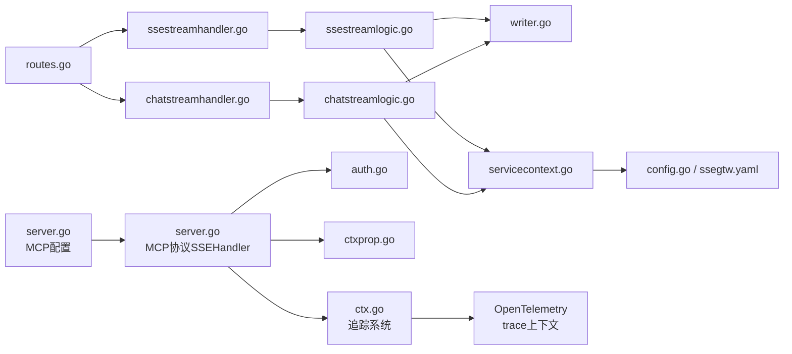

**图表来源**
- [routes.go:17-50](file://aiapp/ssegtw/internal/handler/routes.go#L17-L50)
- [ssestreamhandler.go:18-32](file://aiapp/ssegtw/internal/handler/sse/ssestreamhandler.go#L18-L32)
- [chatstreamhandler.go:18-32](file://aiapp/ssegtw/internal/handler/sse/chatstreamhandler.go#L18-L32)
- [ssestreamlogic.go:39-117](file://aiapp/ssegtw/internal/logic/sse/ssestreamlogic.go#L39-L117)
- [chatstreamlogic.go:39-120](file://aiapp/ssegtw/internal/logic/sse/chatstreamlogic.go#L39-L120)
- [writer.go:8-55](file://common/ssex/writer.go#L8-L55)
- [servicecontext.go:23-38](file://aiapp/ssegtw/internal/svc/servicecontext.go#L23-L38)
- [config.go:11-14](file://aiapp/ssegtw/internal/config/config.go#L11-L14)
- [server.go:93-103](file://common/mcpx/server.go#L93-L103)
- [auth.go:21-60](file://common/mcpx/auth.go#L21-L60)
- [ctxprop.go:21-79](file://common/mcpx/ctxprop.go#L21-L79)
- [ctx.go:43-51](file://common/ctxprop/ctx.go#L43-L51)

**章节来源**
- [routes.go:17-50](file://aiapp/ssegtw/internal/handler/routes.go#L17-L50)
- [servicecontext.go:23-38](file://aiapp/ssegtw/internal/svc/servicecontext.go#L23-L38)

## 性能考虑
- 缓冲与刷新
  - 写入器不缓存数据，依赖Flush保证低延迟；避免在上层重复缓冲。
- 心跳策略
  - 默认30秒心跳，可根据网络环境调整；过短会增加CPU与带宽压力。
- 并发与资源
  - 每个SSE连接占用一个goroutine与IO资源；建议限制最大并发连接数并设置超时。
- RPC与事件发射
  - RPC调用应异步化，避免阻塞事件通道；事件发射器应具备背压保护。
- 连接池与资源清理
  - zrpc客户端复用连接；服务停止时确保关闭所有活动连接与事件订阅。
- 客户端侧
  - 浏览器端使用AbortController及时释放资源；UI渲染批量更新减少重绘。
- **更新**：移除了SSE特定优化功能，性能优化现在基于通用MCP协议标准实现。
- **新增**：追踪系统可能增加少量CPU开销，但提供了重要的可观测性价值。

## 故障排查指南
- 写入器创建失败
  - 现象：直接返回错误，无法建立SSE连接。
  - 排查：确认底层ResponseWriter支持Flush；检查中间层是否拦截了Flush。
- 连接无事件
  - 现象：客户端收到connected但无后续事件。
  - 排查：确认后台任务是否正常推送事件；检查事件通道订阅是否正确；核对Channel一致性。
- 心跳缺失
  - 现象：长时间无心跳保活。
  - 排查：检查心跳定时器是否运行；确认主循环未被阻塞。
- 客户端断开未清理
  - 现象：连接泄漏或内存增长。
  - 排查：确认主循环监听取消信号并及时cancel事件通道；清理计时器与状态。
- 健康检查失败
  - 现象：/ping返回异常。
  - 排查：查看日志与配置；确认服务上下文初始化成功。
- **更新**：认证相关问题
  - 认证失败：检查JWT密钥配置和ServiceToken设置
  - 用户上下文缺失：确认mcpx.Client正确注入了_user context_
  - SDK认证异常：检查wrapAuth中间件配置
- **新增**：追踪相关问题
  - trace上下文丢失：检查_meta字段是否正确传递
  - 链路不完整：确认所有组件都正确实现了trace传播
  - OpenTelemetry配置：验证trace采样和导出配置

**章节来源**
- [writer.go:14-21](file://common/ssex/writer.go#L14-L21)
- [ssestreamlogic.go:96-118](file://aiapp/ssegtw/internal/logic/sse/ssestreamlogic.go#L96-L118)
- [chatstreamlogic.go:95-118](file://aiapp/ssegtw/internal/logic/sse/chatstreamlogic.go#L95-L118)
- [pinghandler.go:14-25](file://aiapp/ssegtw/internal/handler/ssegtw/pinghandler.go#L14-L25)

## 结论
本SSE实现以简洁的写入器为核心，结合事件发射器与待完成注册表，提供了可靠的单向数据流能力。**经过架构简化后的认证系统**通过直接使用SDK的MCP协议SSEHandler和每消息注入机制，大大简化了认证流程，同时保持了完整的安全性和灵活性。**新增的分布式追踪系统**集成了OpenTelemetry，提供了完整的链路追踪能力，支持跨组件的trace上下文传播。通过明确的路由与API定义、完善的处理器与逻辑层、详尽的客户端演示、简化的认证解决方案以及强大的追踪能力，能够满足实时对话流、事件推送与状态同步等典型场景的需求。**更新**：当前版本已移除SSE特定优化功能，转而支持通用MCP协议标准，建议在生产环境中关注心跳策略、并发控制、资源清理、MCP协议认证性能优化以及追踪系统的配置和监控，并根据业务需求选择合适的协议（SSE vs WebSocket）。

## 附录

### 与WebSocket的差异与适用场景
- 单向性
  - SSE为服务器到客户端单向推送，简化了状态管理；WebSocket双向通信，适合交互频繁的场景。
- 协议特性
  - SSE自动重连、事件ID与last-event-id支持断点续推；WebSocket需要自定义重连与消息序号。
- 适用场景
  - SSE：实时通知、日志流、对话流、状态同步。
  - WebSocket：实时游戏、协作编辑、低延迟交互。
- **更新**：认证支持
  - SSE：通过MCP协议认证机制和每消息注入支持完整的认证链路
  - WebSocket：通常需要额外的认证中间件支持
- **新增**：追踪支持
  - SSE：支持完整的分布式追踪，包括trace上下文提取和传播
  - WebSocket：同样支持分布式追踪，但实现方式可能不同

### MCP协议配置示例
```yaml
# MCP服务器认证配置
mcp:
  auth:
    jwtSecrets:
      - "your-jwt-secret-key"
    serviceToken: "your-service-token"
  useStreamable: false  # 使用SSE传输
  sseEndpoint: "/mcp"   # SSE端点
```

### 分布式追踪配置示例
**新增**：追踪系统配置示例：

```yaml
# OpenTelemetry配置
otel:
  serviceName: "sse-gateway"
  exporter: "jaeger"
  endpoint: "localhost:14268"
  samplingRatio: 1.0
```

### 架构优势
- **降低复杂度**：移除自定义authSSEHandler，减少代码维护成本
- **提高可靠性**：使用SDK官方MCP协议认证机制，减少认证漏洞
- **增强灵活性**：支持多种认证路径，适应不同客户端需求
- **改善性能**：每消息注入机制避免了认证信息的重复传递
- **标准化**：遵循MCP协议标准，便于与其他MCP兼容系统集成
- **新增**：**增强可观测性**：完整的分布式追踪系统，支持端到端链路监控
- **新增**：**统一追踪字段**：通过PropFields实现跨组件的trace上下文传播
- **新增**：**多组件支持**：HTTP、RPC、消息队列、异步任务的统一追踪

### 追踪集成最佳实践
**新增**：分布式追踪的最佳实践：

1. **字段定义统一**：使用ctxData.PropFields定义所有需要传播的追踪字段
2. **载荷封装标准**：通过msgbody.MsgBody和ProtoMsgBody统一封装trace载荷
3. **跨组件传播**：确保HTTP、RPC、消息队列、异步任务都正确实现trace传播
4. **性能监控**：合理配置采样率，避免追踪系统成为性能瓶颈
5. **日志脱敏**：对敏感字段进行脱敏处理，保护用户隐私
6. **链路完整性**：确保trace上下文在每个组件中都能正确提取和传播