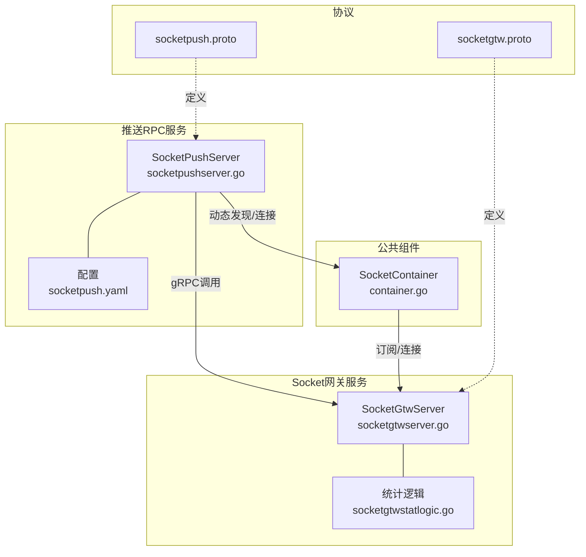
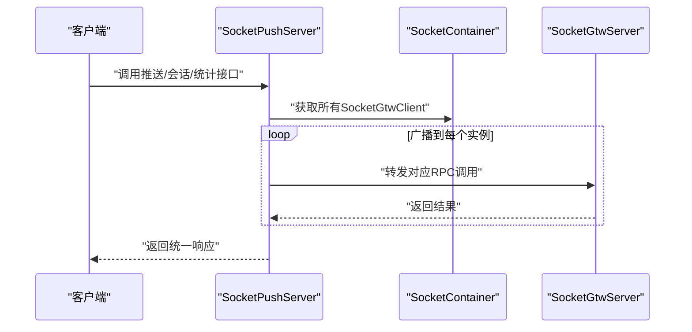
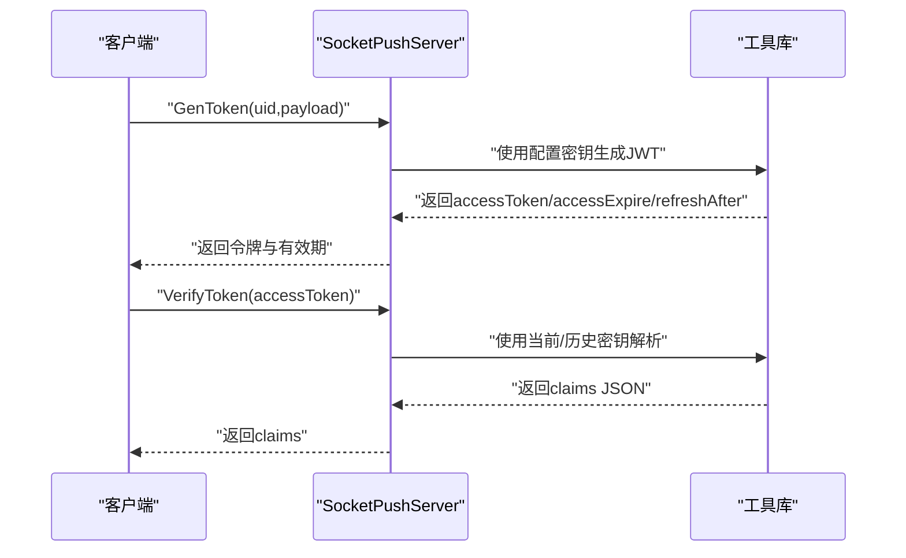
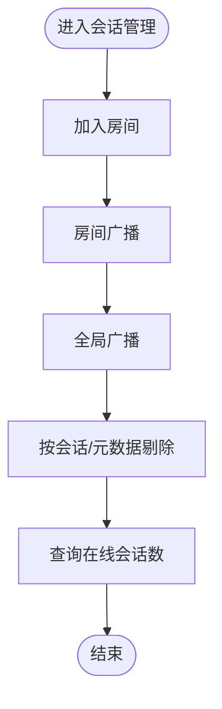
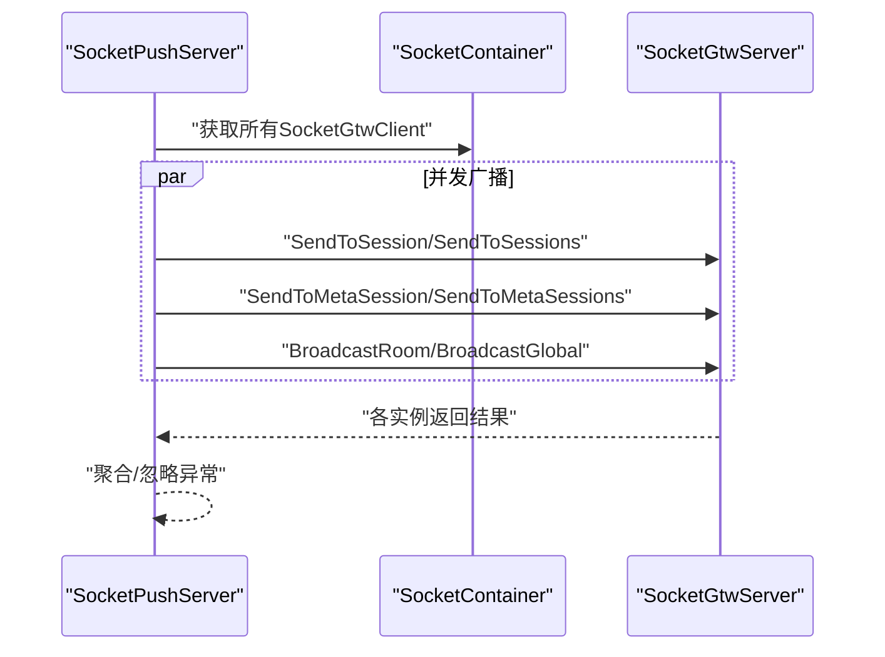
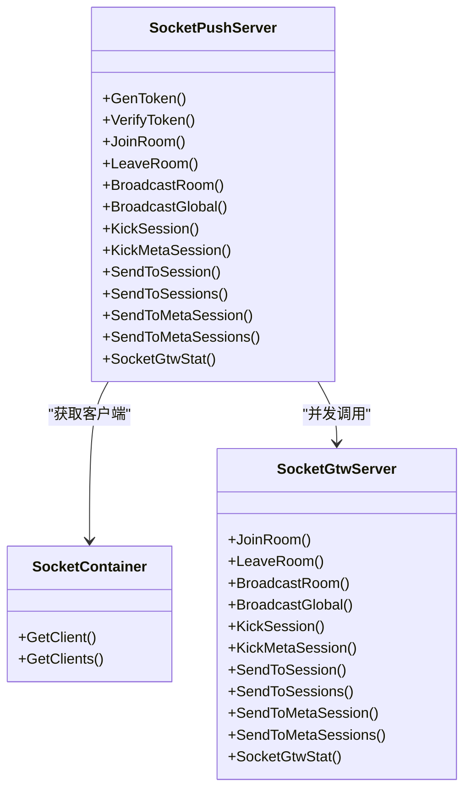
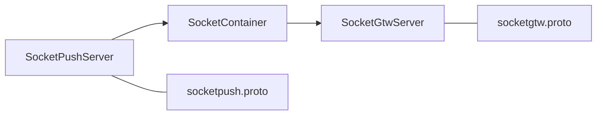

# SocketIO推送服务

<cite>
**本文档引用的文件**
- [socketpush.proto](file://socketapp/socketpush/socketpush.proto)
- [socketpush.yaml](file://socketapp/socketpush/etc/socketpush.yaml)
- [socketpushserver.go](file://socketapp/socketpush/internal/server/socketpushserver.go)
- [container.go](file://common/socketiox/container.go)
- [socketgtw.proto](file://socketapp/socketgtw/socketgtw.proto)
- [socketgtwserver.go](file://socketapp/socketgtw/internal/server/socketgtwserver.go)
- [socketgtwstatlogic.go](file://socketapp/socketgtw/internal/logic/socketgtwstatlogic.go)
- [joinroomlogic.go](file://socketapp/socketpush/internal/logic/joinroomlogic.go)
- [broadcastroomlogic.go](file://socketapp/socketpush/internal/logic/broadcastroomlogic.go)
- [sendtosessionlogic.go](file://socketapp/socketpush/internal/logic/sendtosessionlogic.go)
- [sendtosessionslogic.go](file://socketapp/socketpush/internal/logic/sendtosessionslogic.go)
- [sendtometasessionlogic.go](file://socketapp/socketpush/internal/logic/sendtometasessionlogic.go)
- [sendtometasessionslogic.go](file://socketapp/socketpush/internal/logic/sendtometasessionslogic.go)
- [kicksessionlogic.go](file://socketapp/socketpush/internal/logic/kicksessionlogic.go)
- [kickmetasessionlogic.go](file://socketapp/socketpush/internal/logic/kickmetasessionlogic.go)
- [verifytokenlogic.go](file://socketapp/socketpush/internal/logic/verifytokenlogic.go)
</cite>

## 更新摘要
**所做更改**
- 更新了批量会话操作API的字段命名规范，将'SIds'统一重命名为'SocketIds'
- 完善了批量单播接口的API文档说明
- 更新了会话管理相关的协议定义和实现细节
- 标准化了会话标识符字段命名，从`sId`改为`socketId`

## 目录
1. [引言](#引言)
2. [项目结构](#项目结构)
3. [核心组件](#核心组件)
4. [架构总览](#架构总览)
5. [详细组件分析](#详细组件分析)
6. [依赖分析](#依赖分析)
7. [性能考虑](#性能考虑)
8. [故障排查指南](#故障排查指南)
9. [结论](#结论)
10. [附录](#附录)

## 引言
本技术文档围绕基于 gRPC 的 SocketIO 推送服务展开，系统由"推送 RPC 服务"和"Socket 网关服务"两部分组成：前者负责 Token 生成与校验、会话与房间管理、消息分发（单播、广播、按元数据筛选）以及网关统计；后者负责实际的 Socket 会话生命周期与消息转发。文档将从架构设计、实现原理、安全机制、会话管理、消息推送流程、与后端服务的集成、API 接口、客户端集成示例、最佳实践与性能优化等方面进行系统化说明。

## 项目结构
- 服务划分
  - 推送 RPC 服务：提供统一的推送控制面接口，内部通过 SocketContainer 动态发现并调用 Socket 网关服务。
  - Socket 网关服务：承载真实的 Socket 会话与房间管理，执行具体的消息广播与会话操作。
- 关键目录
  - socketapp/socketpush：推送 RPC 服务定义与实现
  - socketapp/socketgtw：Socket 网关服务定义与实现
  - common/socketiox：Socket 客户端容器与服务发现能力
  - socketapp/socketpush/etc：推送服务配置（日志、JWT 密钥、Nacos 注册与目标地址等）

**图表来源**
- [socketpushserver.go:15-103](file://socketapp/socketpush/internal/server/socketpushserver.go#L15-L103)
- [socketgtwserver.go:15-91](file://socketapp/socketgtw/internal/server/socketgtwserver.go#L15-L91)
- [container.go:30-61](file://common/socketiox/container.go#L30-L61)
- [socketpush.proto:9-36](file://socketapp/socketpush/socketpush.proto#L9-L36)
- [socketgtw.proto:9-32](file://socketapp/socketgtw/socketgtw.proto#L9-L32)

**章节来源**
- [socketpushserver.go:15-103](file://socketapp/socketpush/internal/server/socketpushserver.go#L15-L103)
- [socketgtwserver.go:15-91](file://socketapp/socketgtw/internal/server/socketgtwserver.go#L15-L91)
- [container.go:30-61](file://common/socketiox/container.go#L30-L61)
- [socketpush.proto:9-36](file://socketapp/socketpush/socketpush.proto#L9-L36)
- [socketgtw.proto:9-32](file://socketapp/socketgtw/socketgtw.proto#L9-L32)

## 核心组件
- 推送 RPC 服务
  - 提供 Token 生成与校验、加入/离开房间、房间广播、全局广播、按会话/元数据发送消息、剔除会话、获取网关统计等接口。
  - 通过 gRPC 将请求转发至 Socket 网关服务，实现控制面与数据面解耦。
- Socket 网关服务
  - 负责真实会话生命周期管理（加入/离开房间、广播、剔除）、统计在线会话数。
  - 对外暴露与推送 RPC 服务一致的接口集，便于统一编排。
- SocketContainer
  - 提供基于 Etcd/Nacos/Direct 的服务发现与连接池管理，支持动态增删 Socket 网关实例，保障高可用与弹性伸缩。
- 配置
  - 日志、JWT 密钥、过期时间、Nacos 注册开关、Socket 网关目标地址等。

**章节来源**
- [socketpushserver.go:26-102](file://socketapp/socketpush/internal/server/socketpushserver.go#L26-L102)
- [socketgtwserver.go:26-90](file://socketapp/socketgtw/internal/server/socketgtwserver.go#L26-L90)
- [container.go:30-61](file://common/socketiox/container.go#L30-L61)
- [socketpush.yaml:10-27](file://socketapp/socketpush/etc/socketpush.yaml#L10-L27)

## 架构总览
推送 RPC 服务作为控制面，集中处理业务侧请求；SocketContainer 负责发现可用的 Socket 网关实例，并以并发方式向所有实例广播或定向投递，确保消息可达性与一致性。整体采用"控制面编排 + 数据面执行"的分层设计。

**图表来源**
- [socketpushserver.go:26-102](file://socketapp/socketpush/internal/server/socketpushserver.go#L26-L102)
- [container.go:63-77](file://common/socketiox/container.go#L63-L77)
- [socketgtwserver.go:26-90](file://socketapp/socketgtw/internal/server/socketgtwserver.go#L26-L90)

## 详细组件分析

### Token 生成与验证机制
- 生成 Token
  - 输入包含用户标识与可选负载；输出包含访问令牌、过期时间、刷新时机等。
  - 该接口在推送 RPC 服务中定义，用于为客户端颁发具备时效性的访问令牌。
- 验证 Token
  - 支持当前密钥与历史密钥（轮换）两种模式，解析成功后返回声明内容。
  - 用于后端服务对客户端身份进行校验，确保推送接口的安全性。

**图表来源**
- [socketpush.proto:48-65](file://socketapp/socketpush/socketpush.proto#L48-L65)
- [verifytokenlogic.go:28-49](file://socketapp/socketpush/internal/logic/verifytokenlogic.go#L28-L49)
- [socketpush.yaml:10-13](file://socketapp/socketpush/etc/socketpush.yaml#L10-L13)

**章节来源**
- [socketpush.proto:48-65](file://socketapp/socketpush/socketpush.proto#L48-L65)
- [verifytokenlogic.go:28-49](file://socketapp/socketpush/internal/logic/verifytokenlogic.go#L28-L49)
- [socketpush.yaml:10-13](file://socketapp/socketpush/etc/socketpush.yaml#L10-L13)

### 会话管理与房间推送
- 会话与房间
  - 支持加入/离开房间，房间名与会话 ID 作为关键维度组织消息分发。
- 房间广播
  - 将事件与载荷广播至指定房间内的所有会话。
- 全局广播
  - 向所有在线会话广播消息（由 Socket 网关侧实现）。
- 剔除会话
  - 支持按会话 ID 或按元数据键值剔除会话，用于强制下线或权限变更场景。
- 统计
  - 返回当前节点在线会话总数，便于运维监控与扩缩容决策。

**图表来源**
- [socketpush.proto:67-106](file://socketapp/socketpush/socketpush.proto#L67-L106)
- [socketgtw.proto:39-78](file://socketapp/socketgtw/socketgtw.proto#L39-L78)
- [joinroomlogic.go:28-43](file://socketapp/socketpush/internal/logic/joinroomlogic.go#L28-L43)
- [broadcastroomlogic.go:28-44](file://socketapp/socketpush/internal/logic/broadcastroomlogic.go#L28-L44)
- [socketgtwstatlogic.go:26-32](file://socketapp/socketgtw/internal/logic/socketgtwstatlogic.go#L26-L32)

**章节来源**
- [socketpush.proto:67-106](file://socketapp/socketpush/socketpush.proto#L67-L106)
- [socketgtw.proto:39-78](file://socketapp/socketgtw/socketgtw.proto#L39-L78)
- [joinroomlogic.go:28-43](file://socketapp/socketpush/internal/logic/joinroomlogic.go#L28-L43)
- [broadcastroomlogic.go:28-44](file://socketapp/socketpush/internal/logic/broadcastroomlogic.go#L28-L44)
- [socketgtwstatlogic.go:26-32](file://socketapp/socketgtw/internal/logic/socketgtwstatlogic.go#L26-L32)

### 消息推送实现方式
- 单播
  - 指定会话 ID 推送事件与载荷。
- 批量单播
  - 指定多个会话 ID 批量推送，字段名称已标准化为 `socketIds`。
- 元数据单播
  - 指定元数据键值对，匹配相应会话并推送。
- 元数据批量单播
  - 指定多组元数据键值对，批量匹配并推送。
- 房间广播
  - 指定房间名广播。
- 全局广播
  - 面向所有在线会话广播。

**更新** 批量单播接口的字段命名已标准化，从 `sIds` 统一改为 `socketIds`，提升API一致性。

**图表来源**
- [socketpushserver.go:74-102](file://socketapp/socketpush/internal/server/socketpushserver.go#L74-L102)
- [container.go:63-77](file://common/socketiox/container.go#L63-L77)
- [socketgtwserver.go:26-90](file://socketapp/socketgtw/internal/server/socketgtwserver.go#L26-L90)

**章节来源**
- [socketpushserver.go:74-102](file://socketapp/socketpush/internal/server/socketpushserver.go#L74-L102)
- [container.go:63-77](file://common/socketiox/container.go#L63-L77)
- [socketgtwserver.go:26-90](file://socketapp/socketgtw/internal/server/socketgtwserver.go#L26-L90)

### 与后端服务的集成
- gRPC 调用
  - 推送 RPC 服务通过 gRPC 调用 Socket 网关服务，请求体与响应体与 socketgtw.proto 定义保持一致。
- 异步处理
  - 使用并发 goroutine 向所有 Socket 网关实例广播，提升吞吐与可用性。
- 错误处理
  - 当前实现采用"尽力而为"策略（并发调用、忽略个别失败），如需强一致，可在上层引入幂等与重试机制。

**图表来源**
- [socketpushserver.go:15-103](file://socketapp/socketpush/internal/server/socketpushserver.go#L15-L103)
- [container.go:30-77](file://common/socketiox/container.go#L30-L77)
- [socketgtwserver.go:15-91](file://socketapp/socketgtw/internal/server/socketgtwserver.go#L15-L91)

**章节来源**
- [socketpushserver.go:15-103](file://socketapp/socketpush/internal/server/socketpushserver.go#L15-L103)
- [container.go:30-77](file://common/socketiox/container.go#L30-L77)
- [socketgtwserver.go:15-91](file://socketapp/socketgtw/internal/server/socketgtwserver.go#L15-L91)

### API 接口文档
- 通用约定
  - 请求/响应均包含 reqId 字段，便于链路追踪与去重。
  - 会话 ID 与房间名作为关键路由参数。
- 推送接口
  - 生成 Token：输入 uid 与 payload；输出 accessToken、accessExpire、refreshAfter。
  - 验证 Token：输入 accessToken；输出 claim_json。
  - 加入房间：输入 reqId、socketId、room。
  - 离开房间：输入 reqId、socketId、room。
  - 房间广播：输入 reqId、room、event、payload。
  - 全局广播：输入 reqId、event、payload。
  - 剔除会话：输入 reqId、socketId。
  - 按元数据剔除：输入 reqId、key、value。
  - 单播：输入 reqId、socketId、event、payload。
  - 批量单播：输入 reqId、socketIds[]、event、payload（字段已标准化）。
  - 元数据单播：输入 reqId、key、value、event、payload。
  - 元数据批量单播：输入 reqId、metaSessions[]、event、payload。
  - 网关统计：输入为空；输出 stats[]（节点、在线会话数）。
- Socket 网关接口
  - 与推送 RPC 服务一致，用于直接对接 Socket 网关。

**更新** 批量单播接口的字段命名已标准化，从 `sIds` 统一改为 `socketIds`，提升API一致性。

**章节来源**
- [socketpush.proto:9-36](file://socketapp/socketpush/socketpush.proto#L9-L36)
- [socketgtw.proto:9-32](file://socketapp/socketgtw/socketgtw.proto#L9-L32)

### 客户端集成示例与最佳实践
- 客户端集成步骤
  - 通过推送 RPC 服务的 GenToken 接口获取 accessToken。
  - 在 Socket 连接建立后，携带 accessToken 进行鉴权。
  - 使用 JoinRoom/LeaveRoom 管理房间；使用 SendToSession/BroadcastRoom 等接口进行消息交互。
- 最佳实践
  - 使用 VerifyToken 对客户端传入的 accessToken 进行服务端校验。
  - 对高频广播操作采用批量接口（SendToSessions/SendToMetaSessions）降低调用次数。
  - 利用 SocketGtwStat 监控在线会话数，结合扩缩容策略动态调整网关实例数量。
  - 对关键路径增加超时与重试，避免单点故障影响整体可用性。

**章节来源**
- [socketpush.proto:48-65](file://socketapp/socketpush/socketpush.proto#L48-L65)
- [socketgtwstatlogic.go:26-32](file://socketapp/socketgtw/internal/logic/socketgtwstatlogic.go#L26-L32)

## 依赖分析
- 控制面与数据面
  - 推送 RPC 服务仅负责编排，不直接持有会话状态，依赖 Socket 网关服务完成实际会话管理。
- 服务发现与连接
  - SocketContainer 支持 Etcd、Nacos、Direct 三种接入方式，自动维护客户端集合，保证高可用。
- 协议一致性
  - 推送 RPC 服务与 Socket 网关服务共享同一套消息模型，减少耦合与理解成本。

**图表来源**
- [socketpushserver.go:15-103](file://socketapp/socketpush/internal/server/socketpushserver.go#L15-L103)
- [container.go:30-61](file://common/socketiox/container.go#L30-L61)
- [socketgtwserver.go:15-91](file://socketapp/socketgtw/internal/server/socketgtwserver.go#L15-L91)
- [socketpush.proto:9-36](file://socketapp/socketpush/socketpush.proto#L9-L36)
- [socketgtw.proto:9-32](file://socketapp/socketgtw/socketgtw.proto#L9-L32)

**章节来源**
- [socketpushserver.go:15-103](file://socketapp/socketpush/internal/server/socketpushserver.go#L15-L103)
- [container.go:30-61](file://common/socketiox/container.go#L30-L61)
- [socketgtwserver.go:15-91](file://socketapp/socketgtw/internal/server/socketgtwserver.go#L15-L91)
- [socketpush.proto:9-36](file://socketapp/socketpush/socketpush.proto#L9-L36)
- [socketgtw.proto:9-32](file://socketapp/socketgtw/socketgtw.proto#L9-L32)

## 性能考虑
- 并发广播
  - 对所有 Socket 网关实例并发调用，显著提升广播吞吐；建议根据实例规模与网络状况调整并发策略。
- gRPC 消息大小
  - 已设置最大发送消息大小限制，避免大包导致内存压力；建议控制单次 payload 规模。
- 服务发现与连接复用
  - SocketContainer 复用已建立的连接，减少握手开销；Nacos/ETCD 订阅确保实例变更时快速生效。
- 统计与可观测性
  - 通过 SocketGtwStat 获取在线会话数，结合日志与指标进行容量规划。

**章节来源**
- [container.go:112-118](file://common/socketiox/container.go#L112-L118)
- [socketgtwstatlogic.go:26-32](file://socketapp/socketgtw/internal/logic/socketgtwstatlogic.go#L26-L32)
- [socketpush.yaml:7-8](file://socketapp/socketpush/etc/socketpush.yaml#L7-L8)

## 故障排查指南
- Token 相关
  - 若 VerifyToken 报错，检查 accessToken 是否为空、是否使用了正确的密钥或历史密钥。
- 会话与房间
  - 若 JoinRoom/BroadcastRoom 无效，确认 socketId 与 room 参数正确，且 Socket 网关实例正常运行。
- 广播未达
  - 检查 SocketContainer 是否正确发现并连接到所有 Socket 网关实例；关注并发调用中的异常被忽略的情况。
- 统计异常
  - SocketGtwStat 返回 0 或异常，检查 Socket 网关服务是否启动、会话是否建立成功。
- 批量单播问题
  - 确认批量单播接口使用 `socketIds` 字段而非旧的 `sIds` 字段。

**更新** 新增批量单播接口字段命名问题的排查指导。

**章节来源**
- [verifytokenlogic.go:28-49](file://socketapp/socketpush/internal/logic/verifytokenlogic.go#L28-L49)
- [joinroomlogic.go:28-43](file://socketapp/socketpush/internal/logic/joinroomlogic.go#L28-L43)
- [broadcastroomlogic.go:28-44](file://socketapp/socketpush/internal/logic/broadcastroomlogic.go#L28-L44)
- [socketgtwstatlogic.go:26-32](file://socketapp/socketgtw/internal/logic/socketgtwstatlogic.go#L26-L32)

## 结论
本 SocketIO 推送服务通过清晰的控制面与数据面分离、完善的 Token 安全机制、灵活的服务发现与并发广播策略，实现了高可用、易扩展的消息推送能力。配合统一的 API 与丰富的会话管理能力，能够满足多场景下的实时通信需求。最新的字段命名标准化进一步提升了API的一致性和易用性。

## 附录
- 配置要点
  - JWT 密钥与过期时间：用于 Token 生成与校验。
  - Nacos/Etcd/Direct 服务发现：用于定位 Socket 网关实例。
  - 日志级别与路径：便于问题定位与审计。
- 字段命名规范
  - 批量单播接口：使用 `socketIds` 字段表示会话ID列表
  - 单播接口：使用 `socketId` 字段表示单个会话ID
  - 元数据接口：使用 `metaSessions` 字段表示元数据会话列表

**更新** 新增字段命名规范说明，强调批量单播接口的标准化字段名称。

**章节来源**
- [socketpush.yaml:10-27](file://socketapp/socketpush/etc/socketpush.yaml#L10-L27)
- [socketpush.proto:138-147](file://socketapp/socketpush/socketpush.proto#L138-L147)
- [socketgtw.proto:110-115](file://socketapp/socketgtw/socketgtw.proto#L110-L115)