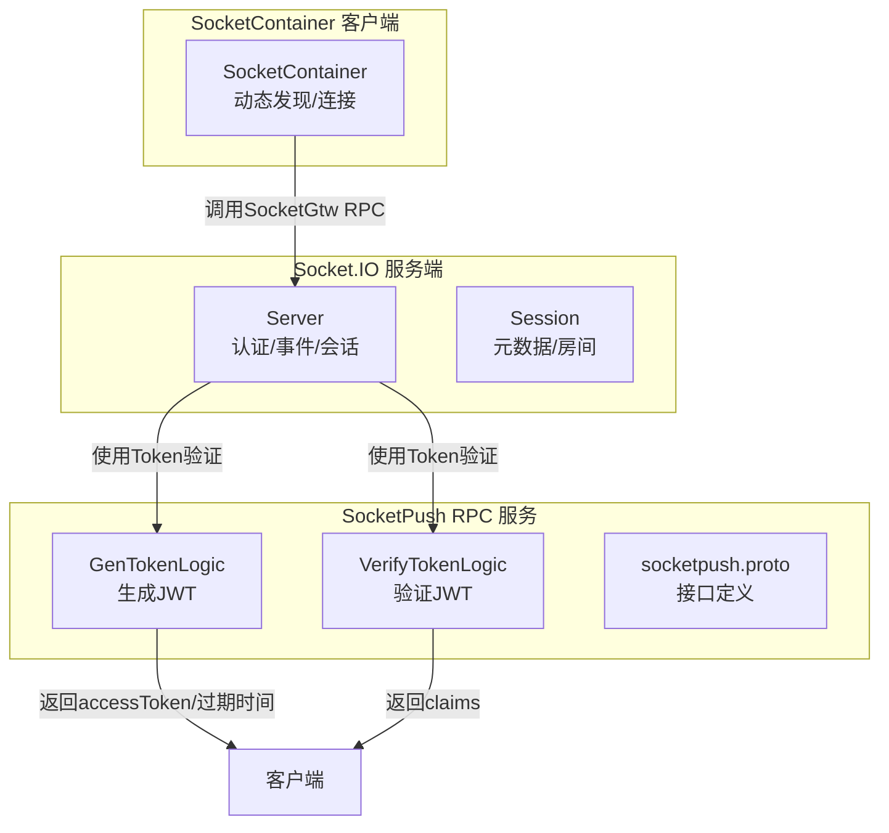
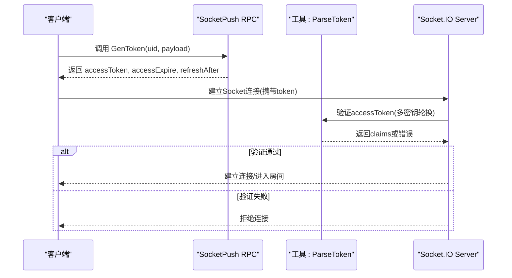
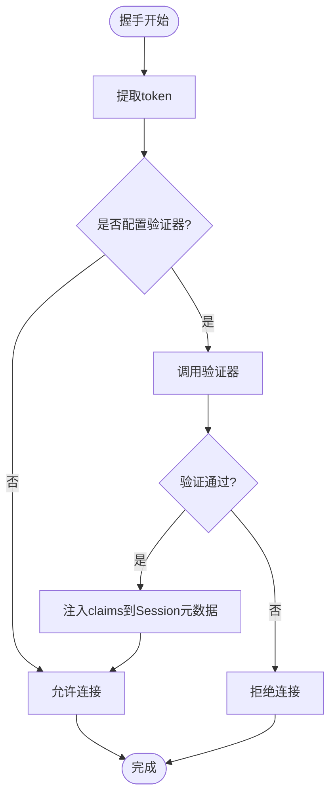
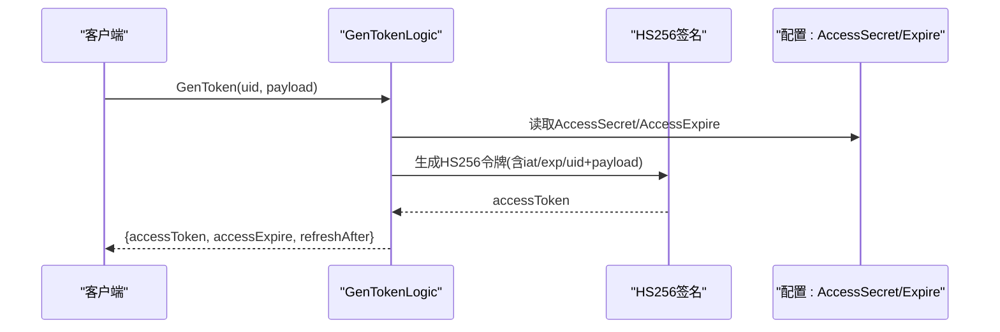
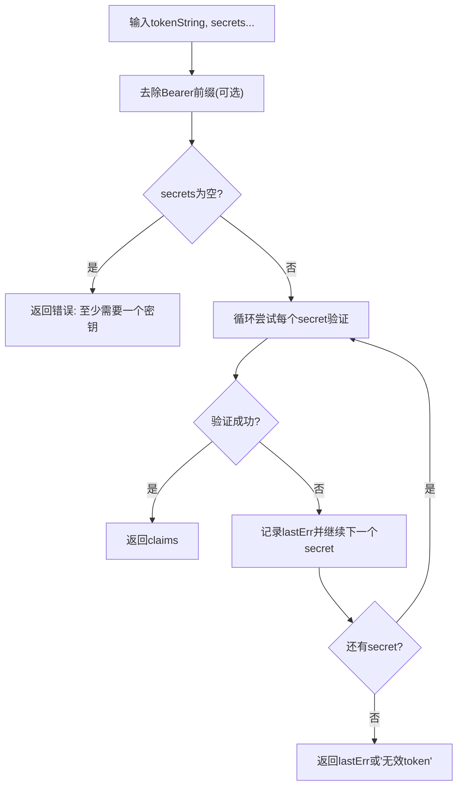
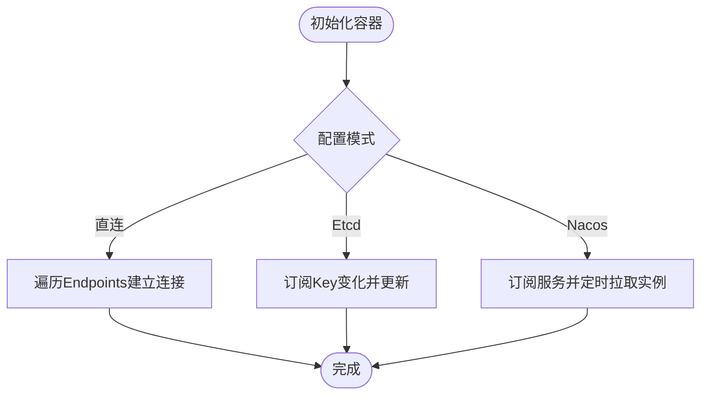
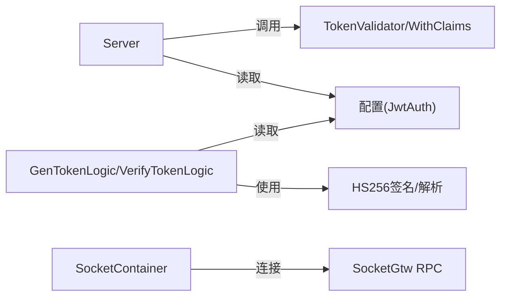

# Token生成与验证

<cite>
**本文引用的文件**
- [common/socketiox/server.go](file://common/socketiox/server.go)
- [common/socketiox/handler.go](file://common/socketiox/handler.go)
- [common/socketiox/container.go](file://common/socketiox/container.go)
- [socketapp/socketpush/socketpush.proto](file://socketapp/socketpush/socketpush.proto)
- [socketapp/socketpush/internal/logic/gentokenlogic.go](file://socketapp/socketpush/internal/logic/gentokenlogic.go)
- [socketapp/socketpush/internal/logic/verifytokenlogic.go](file://socketapp/socketpush/internal/logic/verifytokenlogic.go)
- [socketapp/socketpush/internal/config/config.go](file://socketapp/socketpush/internal/config/config.go)
- [socketapp/socketpush/internal/svc/servicecontext.go](file://socketapp/socketpush/internal/svc/servicecontext.go)
- [socketapp/socketgtw/internal/svc/servicecontext.go](file://socketapp/socketgtw/internal/svc/servicecontext.go)
- [common/tool/tool.go](file://common/tool/tool.go)
</cite>

## 目录
1. [引言](#引言)
2. [项目结构](#项目结构)
3. [核心组件](#核心组件)
4. [架构总览](#架构总览)
5. [详细组件分析](#详细组件分析)
6. [依赖分析](#依赖分析)
7. [性能考虑](#性能考虑)
8. [故障排查指南](#故障排查指南)
9. [结论](#结论)
10. [附录](#附录)

## 引言
本技术文档围绕基于 Socket.IO 的 Token 生成与验证系统展开，目标是帮助开发者正确实现 Token 生命周期管理（生成、验证、刷新、撤销、过期处理），并理解其在服务端的集成方式与安全设计要点。文档覆盖以下方面：
- Token 生成算法与格式规范（基于 JWT HS256）
- Token 验证机制（签名验证、有效期检查、多密钥轮换）
- 安全性设计（防重放、防篡改、安全存储）
- 完整 API 接口定义（参数、返回值、错误处理）
- 生命周期管理与客户端集成最佳实践

## 项目结构
该系统由三部分组成：
- Socket.IO 服务端：负责握手认证、事件处理、会话管理与广播
- SocketPush RPC 服务：提供 Token 生成与验证等能力
- SocketContainer 客户端：动态发现与连接 Socket 网关服务

**图表来源**
- [common/socketiox/server.go:337-380](file://common/socketiox/server.go#L337-L380)
- [socketapp/socketpush/socketpush.proto:9-36](file://socketapp/socketpush/socketpush.proto#L9-L36)
- [socketapp/socketpush/internal/logic/gentokenlogic.go:30-45](file://socketapp/socketpush/internal/logic/gentokenlogic.go#L30-L45)
- [socketapp/socketpush/internal/logic/verifytokenlogic.go:29-49](file://socketapp/socketpush/internal/logic/verifytokenlogic.go#L29-L49)
- [common/socketiox/container.go:35-61](file://common/socketiox/container.go#L35-L61)

**章节来源**
- [common/socketiox/server.go:337-380](file://common/socketiox/server.go#L337-L380)
- [socketapp/socketpush/socketpush.proto:9-36](file://socketapp/socketpush/socketpush.proto#L9-L36)
- [common/socketiox/container.go:35-61](file://common/socketiox/container.go#L35-L61)

## 核心组件
- Socket.IO Server
  - 负责 OnAuthentication、OnConnection、事件监听与处理
  - 支持 TokenValidator 与 TokenValidatorWithClaims 两种验证器
  - 将 Token 中的声明注入 Session 元数据，供后续业务使用
- SocketPush RPC
  - 提供 GenToken、VerifyToken 等 RPC 接口
  - 使用 HS256 生成 JWT，支持多密钥轮换
- SocketContainer
  - 动态发现 Socket 网关服务实例，建立 gRPC 连接
  - 支持直连、Etcd、Nacos 三种注册中心模式

**章节来源**
- [common/socketiox/server.go:246-312](file://common/socketiox/server.go#L246-L312)
- [socketapp/socketpush/socketpush.proto:9-36](file://socketapp/socketpush/socketpush.proto#L9-L36)
- [common/socketiox/container.go:35-61](file://common/socketiox/container.go#L35-L61)

## 架构总览
Socket.IO 服务端在握手阶段通过 OnAuthentication 调用自定义 TokenValidator 或 TokenValidatorWithClaims 进行验证；SocketPush RPC 服务提供 Token 生成与验证能力；SocketContainer 负责与 Socket 网关服务的动态连接。

**图表来源**
- [socketapp/socketpush/internal/logic/gentokenlogic.go:30-45](file://socketapp/socketpush/internal/logic/gentokenlogic.go#L30-L45)
- [socketapp/socketpush/internal/logic/verifytokenlogic.go:29-49](file://socketapp/socketpush/internal/logic/verifytokenlogic.go#L29-L49)
- [common/tool/tool.go:35-65](file://common/tool/tool.go#L35-L65)
- [common/socketiox/server.go:337-380](file://common/socketiox/server.go#L337-L380)

## 详细组件分析

### Socket.IO 认证与会话管理
- 认证流程
  - OnAuthentication 从握手参数中取出 token 并调用 TokenValidator
  - 若提供 TokenValidatorWithClaims，则将 claims 注入 Session 元数据
- 事件处理
  - 统一解析上行事件，调用已注册的 EventHandlers
  - 对房间加入/离开、全局/房间广播等内置事件进行处理
- 会话管理
  - 维护 sessions 映射，支持按 sId、元数据键值查询
  - 定时统计并下发会话状态

**图表来源**
- [common/socketiox/server.go:337-380](file://common/socketiox/server.go#L337-L380)
- [common/socketiox/server.go:119-203](file://common/socketiox/server.go#L119-L203)

**章节来源**
- [common/socketiox/server.go:337-380](file://common/socketiox/server.go#L337-L380)
- [common/socketiox/server.go:469-675](file://common/socketiox/server.go#L469-L675)

### SocketPush RPC：Token 生成与验证
- GenToken
  - 输入：uid、payload（扩展字段）
  - 输出：accessToken、accessExpire、refreshAfter
  - 算法：HS256，iat/exp/uid 等标准字段，其余 payload 字段作为自定义声明
- VerifyToken
  - 输入：accessToken
  - 输出：claim_json（验证通过后的声明对象）
  - 支持多密钥轮换（AccessSecret 与 PrevAccessSecret）

**图表来源**
- [socketapp/socketpush/internal/logic/gentokenlogic.go:30-45](file://socketapp/socketpush/internal/logic/gentokenlogic.go#L30-L45)
- [socketapp/socketpush/internal/logic/gentokenlogic.go:57-78](file://socketapp/socketpush/internal/logic/gentokenlogic.go#L57-L78)

**章节来源**
- [socketapp/socketpush/socketpush.proto:48-65](file://socketapp/socketpush/socketpush.proto#L48-L65)
- [socketapp/socketpush/internal/logic/gentokenlogic.go:30-45](file://socketapp/socketpush/internal/logic/gentokenlogic.go#L30-L45)
- [socketapp/socketpush/internal/logic/gentokenlogic.go:57-78](file://socketapp/socketpush/internal/logic/gentokenlogic.go#L57-L78)

### 工具函数：Token 解析与多密钥轮换
- ParseToken
  - 支持去除 Bearer 前缀
  - 依次尝试多个密钥进行验证，任一通过即视为有效
  - 返回 jwt.MapClaims 或错误

**图表来源**
- [common/tool/tool.go:35-65](file://common/tool/tool.go#L35-L65)

**章节来源**
- [common/tool/tool.go:35-65](file://common/tool/tool.go#L35-L65)
- [socketapp/socketpush/internal/logic/verifytokenlogic.go:29-49](file://socketapp/socketpush/internal/logic/verifytokenlogic.go#L29-L49)

### SocketContainer：动态服务发现与连接
- 支持直连、Etcd、Nacos 三种模式
- 健康实例过滤与 gRPC 端口提取
- 定时拉取实例列表并更新连接池

**图表来源**
- [common/socketiox/container.go:35-61](file://common/socketiox/container.go#L35-L61)
- [common/socketiox/container.go:83-130](file://common/socketiox/container.go#L83-L130)
- [common/socketiox/container.go:156-242](file://common/socketiox/container.go#L156-L242)

**章节来源**
- [common/socketiox/container.go:35-61](file://common/socketiox/container.go#L35-L61)
- [common/socketiox/container.go:83-130](file://common/socketiox/container.go#L83-L130)
- [common/socketiox/container.go:156-242](file://common/socketiox/container.go#L156-L242)

## 依赖分析
- Socket.IO Server 依赖
  - TokenValidator/TokenValidatorWithClaims：外部提供的验证器
  - Session：持有连接元数据，支持房间加入/离开
- SocketPush RPC 依赖
  - HS256 签名与 ParseToken 工具
  - 配置中的 AccessSecret、PrevAccessSecret、AccessExpire
- SocketContainer 依赖
  - zrpc 客户端、Nacos SDK、Etcd 客户端
  - 健康实例筛选与 gRPC 端口解析

**图表来源**
- [common/socketiox/server.go:246-312](file://common/socketiox/server.go#L246-L312)
- [socketapp/socketpush/internal/logic/gentokenlogic.go:30-45](file://socketapp/socketpush/internal/logic/gentokenlogic.go#L30-L45)
- [socketapp/socketpush/internal/logic/verifytokenlogic.go:29-49](file://socketapp/socketpush/internal/logic/verifytokenlogic.go#L29-L49)
- [common/socketiox/container.go:35-61](file://common/socketiox/container.go#L35-L61)

**章节来源**
- [common/socketiox/server.go:246-312](file://common/socketiox/server.go#L246-L312)
- [socketapp/socketpush/internal/logic/gentokenlogic.go:30-45](file://socketapp/socketpush/internal/logic/gentokenlogic.go#L30-L45)
- [socketapp/socketpush/internal/logic/verifytokenlogic.go:29-49](file://socketapp/socketpush/internal/logic/verifytokenlogic.go#L29-L49)
- [common/socketiox/container.go:35-61](file://common/socketiox/container.go#L35-L61)

## 性能考虑
- SocketContainer
  - gRPC 最大消息大小限制（发送最大 50MB）以避免超大消息导致内存压力
  - 健康实例扫描与日志级别可控，减少不必要的日志开销
- Socket.IO Server
  - 事件处理采用异步协程，避免阻塞主循环
  - 统计周期默认 1 分钟，可根据负载调整
- Token 生成/验证
  - HS256 为对称加密，计算开销低，适合高并发场景
  - 多密钥轮换仅在验证阶段生效，不影响生成性能

**章节来源**
- [common/socketiox/container.go:113-118](file://common/socketiox/container.go#L113-L118)
- [common/socketiox/server.go:702-740](file://common/socketiox/server.go#L702-L740)
- [socketapp/socketpush/internal/logic/gentokenlogic.go:75-78](file://socketapp/socketpush/internal/logic/gentokenlogic.go#L75-L78)

## 故障排查指南
- Token 无法验证
  - 检查 AccessToken 是否携带 Bearer 前缀（ParseToken 支持自动剥离）
  - 确认 AccessSecret 与 PrevAccessSecret 配置正确且未过期
  - 观察日志中“token validation failed”提示
- 连接被拒绝
  - 确认 OnAuthentication 中的 TokenValidator 返回 true
  - 检查握手参数中 token 是否传递正确
- 会话统计异常
  - 关注“session count mismatch”日志，确认 sessions 与 sockets 数量一致
- 服务发现问题
  - 直连模式：确认 Endpoints 正确
  - Etcd/Nacos：确认订阅 Key/服务名与命名空间配置正确

**章节来源**
- [common/tool/tool.go:35-65](file://common/tool/tool.go#L35-L65)
- [common/socketiox/server.go:337-380](file://common/socketiox/server.go#L337-L380)
- [common/socketiox/server.go:718-722](file://common/socketiox/server.go#L718-L722)
- [common/socketiox/container.go:156-242](file://common/socketiox/container.go#L156-L242)

## 结论
本系统通过 Socket.IO 与 SocketPush RPC 的协作，提供了完整的 Token 生成与验证能力。Socket.IO 侧负责连接层的认证与事件处理，SocketPush 侧负责 Token 的生成与验证，配合 SocketContainer 的服务发现，形成高可用、可扩展的实时通信基础设施。建议在生产环境中启用多密钥轮换、严格配置日志级别与资源限制，并结合业务需求完善权限校验与审计日志。

## 附录

### API 接口文档

- 生成 Token
  - 方法：GenToken
  - 请求体：uid（用户标识）、payload（扩展字段映射）
  - 返回：accessToken（JWT）、accessExpire（过期时间戳）、refreshAfter（建议刷新时间戳）
  - 错误：参数错误、签名失败
  - 参考：[socketpush.proto:48-57](file://socketapp/socketpush/socketpush.proto#L48-L57)

- 验证 Token
  - 方法：VerifyToken
  - 请求体：accessToken
  - 返回：claim_json（验证通过后的声明对象 JSON）
  - 错误：访问令牌为空、无效令牌
  - 参考：[socketpush.proto:59-65](file://socketapp/socketpush/socketpush.proto#L59-L65)

- 通用响应结构
  - 通用响应体包含 code、msg、payload、reqId
  - 参考：[server.go:53-64](file://common/socketiox/server.go#L53-L64)

**章节来源**
- [socketapp/socketpush/socketpush.proto:9-36](file://socketapp/socketpush/socketpush.proto#L9-L36)
- [socketapp/socketpush/socketpush.proto:48-65](file://socketapp/socketpush/socketpush.proto#L48-L65)
- [common/socketiox/server.go:53-64](file://common/socketiox/server.go#L53-L64)

### Token 安全性设计
- 防篡改
  - HS256 对称签名，任何修改都会导致验证失败
- 防重放
  - exp/iat 标准声明控制有效期，建议在业务侧结合业务票据做二次校验
- 多密钥轮换
  - 支持 PrevAccessSecret 与 AccessSecret 并行验证，便于平滑切换
- 安全存储
  - AccessSecret 存储于配置中心，避免硬编码
  - 建议使用只读权限与最小暴露面

**章节来源**
- [socketapp/socketpush/internal/logic/gentokenlogic.go:57-78](file://socketapp/socketpush/internal/logic/gentokenlogic.go#L57-L78)
- [socketapp/socketpush/internal/logic/verifytokenlogic.go:29-49](file://socketapp/socketpush/internal/logic/verifytokenlogic.go#L29-L49)
- [socketapp/socketpush/internal/config/config.go:7-11](file://socketapp/socketpush/internal/config/config.go#L7-L11)

### 客户端集成示例与最佳实践
- 生成 Token
  - 调用 GenToken 获取 accessToken、accessExpire、refreshAfter
  - 将 accessToken 保存在安全位置（如 HttpOnly Cookie 或本地安全存储）
- 建立 Socket 连接
  - 在握手参数中携带 token
  - OnAuthentication 将自动触发验证
- 刷新 Token
  - 当接近 refreshAfter 时重新调用 GenToken
  - 替换本地存储的 accessToken
- 撤销与过期
  - 服务端不提供主动撤销接口，可通过缩短 accessExpire 或服务端策略实现
  - 客户端在过期后应停止发送请求并重新登录

**章节来源**
- [socketapp/socketpush/internal/logic/gentokenlogic.go:30-45](file://socketapp/socketpush/internal/logic/gentokenlogic.go#L30-L45)
- [common/socketiox/server.go:337-380](file://common/socketiox/server.go#L337-L380)