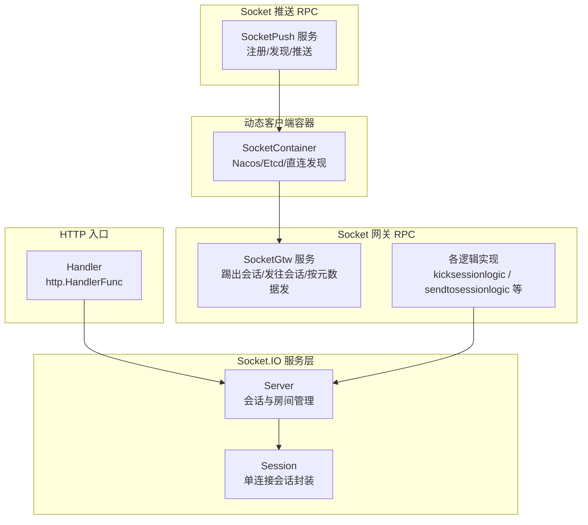
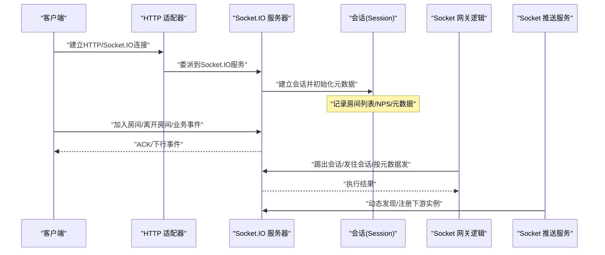
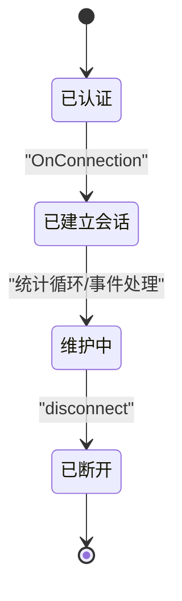
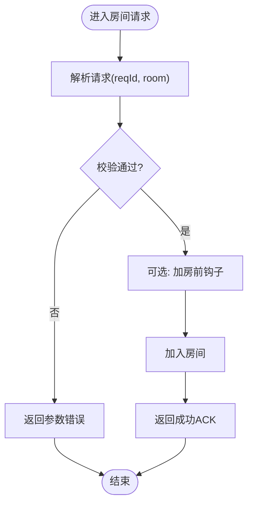
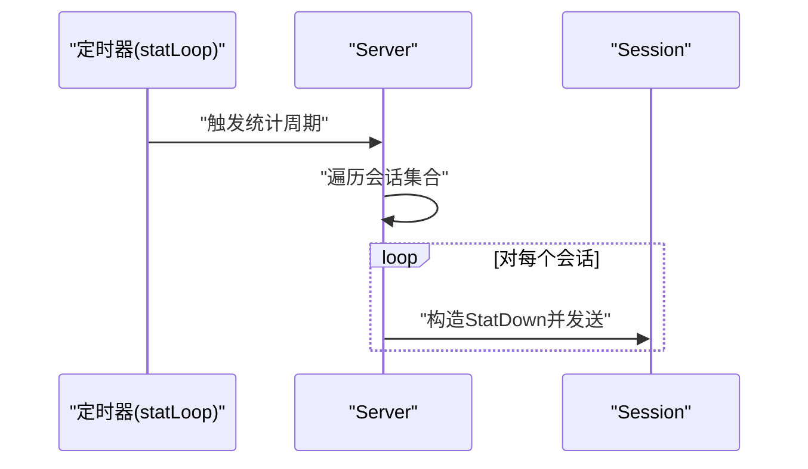
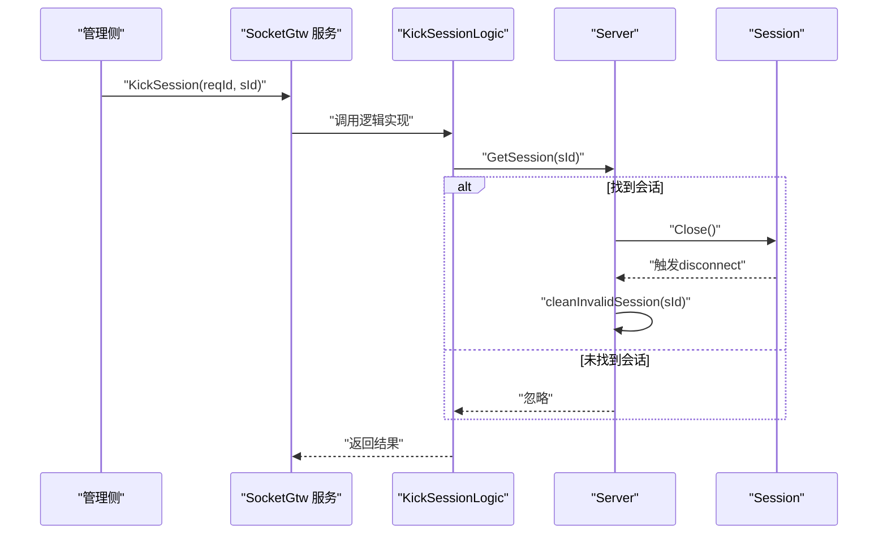
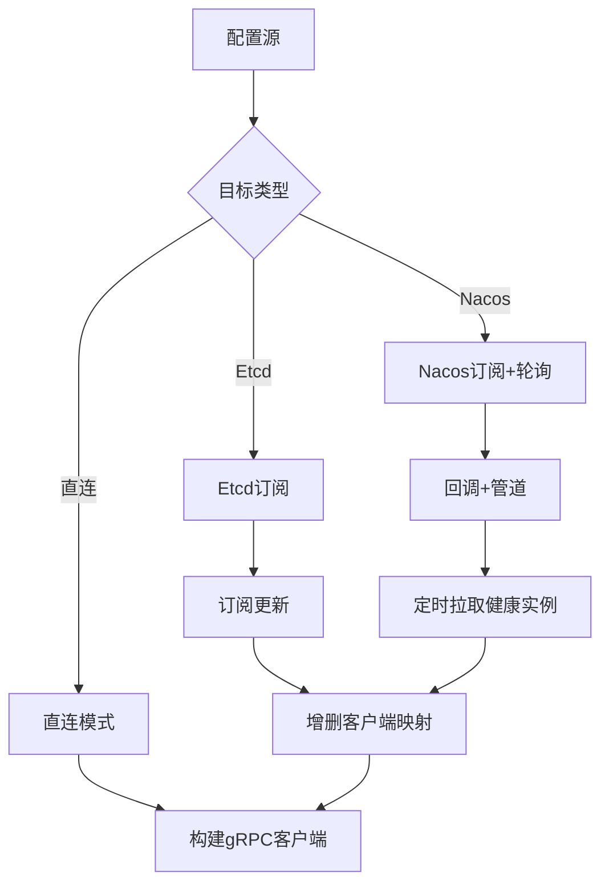

# 会话状态管理

<cite>
**本文引用的文件**
- [common/socketiox/server.go](file://common/socketiox/server.go)
- [common/socketiox/handler.go](file://common/socketiox/handler.go)
- [common/socketiox/container.go](file://common/socketiox/container.go)
- [socketapp/socketgtw/etc/socketgtw.yaml](file://socketapp/socketgtw/etc/socketgtw.yaml)
- [socketapp/socketgtw/internal/logic/kicksessionlogic.go](file://socketapp/socketgtw/internal/logic/kicksessionlogic.go)
- [socketapp/socketgtw/internal/logic/sendtosessionlogic.go](file://socketapp/socketgtw/internal/logic/sendtosessionlogic.go)
- [socketapp/socketgtw/internal/logic/sendtometasessionlogic.go](file://socketapp/socketgtw/internal/logic/sendtometasessionlogic.go)
- [socketapp/socketgtw/internal/logic/sendtosessionslogic.go](file://socketapp/socketgtw/internal/logic/sendtosessionslogic.go)
- [socketapp/socketgtw/internal/logic/sendtometasessionslogic.go](file://socketapp/socketgtw/internal/logic/sendtometasessionslogic.go)
- [socketapp/socketpush/socketpush.go](file://socketapp/socketpush/socketpush.go)
</cite>

## 目录
1. [简介](#简介)
2. [项目结构](#项目结构)
3. [核心组件](#核心组件)
4. [架构总览](#架构总览)
5. [详细组件分析](#详细组件分析)
6. [依赖分析](#依赖分析)
7. [性能考虑](#性能考虑)
8. [故障排查指南](#故障排查指南)
9. [结论](#结论)
10. [附录：API接口文档](#附录api接口文档)

## 简介
本技术文档围绕基于 Socket.IO 的会话状态管理系统进行系统化梳理，覆盖会话生命周期（建立、维护、销毁）、房间管理（创建、加入、离开、广播）、会话状态跟踪与统计、会话踢出机制、以及面向服务端的推送与网关能力。文档同时提供架构图、流程图、类图与API参考，帮助开发者快速理解与扩展该系统。

## 项目结构
本系统由“Socket.IO 服务端”、“HTTP 入口适配器”、“Socket 网关 RPC 服务”、“Socket 推送 RPC 服务”及“动态客户端容器”组成，形成“事件驱动 + gRPC 调用”的混合架构。

图表来源
- [common/socketiox/server.go:314-335](file://common/socketiox/server.go#L314-L335)
- [common/socketiox/handler.go:19-40](file://common/socketiox/handler.go#L19-L40)
- [socketapp/socketgtw/internal/logic/kicksessionlogic.go:27-36](file://socketapp/socketgtw/internal/logic/kicksessionlogic.go#L27-L36)
- [socketapp/socketpush/socketpush.go:37-43](file://socketapp/socketpush/socketpush.go#L37-L43)
- [common/socketiox/container.go:35-61](file://common/socketiox/container.go#L35-L61)

章节来源
- [common/socketiox/server.go:314-335](file://common/socketiox/server.go#L314-L335)
- [common/socketiox/handler.go:19-40](file://common/socketiox/handler.go#L19-L40)
- [socketapp/socketgtw/etc/socketgtw.yaml:1-37](file://socketapp/socketgtw/etc/socketgtw.yaml#L1-L37)
- [socketapp/socketpush/socketpush.go:37-43](file://socketapp/socketpush/socketpush.go#L37-L43)
- [common/socketiox/container.go:35-61](file://common/socketiox/container.go#L35-L61)

## 核心组件
- 会话服务器 Server：负责认证、连接建立、事件绑定、房间管理、全局/房间广播、统计上报、会话清理。
- 会话封装 Session：对单个 socket 连接进行封装，提供元数据存储、房间加入/离开、下行事件发送等。
- HTTP 适配器 Handler：将 Socket.IO 服务暴露为 HTTP 处理函数，便于嵌入现有 Web 框架。
- Socket 网关逻辑：提供踢出会话、向单会话/多会话、按元数据发消息等 RPC 能力。
- Socket 推送服务：提供 gRPC 注册与发现，配合容器动态管理下游 Socket 网关实例。
- 动态客户端容器 SocketContainer：支持直连、Etcd、Nacos 三种方式的服务发现与连接池维护。

章节来源
- [common/socketiox/server.go:119-203](file://common/socketiox/server.go#L119-L203)
- [common/socketiox/server.go:299-312](file://common/socketiox/server.go#L299-L312)
- [common/socketiox/handler.go:19-40](file://common/socketiox/handler.go#L19-L40)
- [socketapp/socketgtw/internal/logic/kicksessionlogic.go:27-36](file://socketapp/socketgtw/internal/logic/kicksessionlogic.go#L27-L36)
- [socketapp/socketpush/socketpush.go:37-43](file://socketapp/socketpush/socketpush.go#L37-L43)
- [common/socketiox/container.go:35-61](file://common/socketiox/container.go#L35-L61)

## 架构总览
系统采用“事件驱动 + RPC 调用”的双通道模式：
- 客户端侧通过 HTTP/Socket.IO 连接至 Server，Server 维护会话与房间。
- 管理侧通过 gRPC 调用 Socket 网关或推送服务，实现踢人、定向消息下发、按元数据批量下发等。

图表来源
- [common/socketiox/handler.go:33-35](file://common/socketiox/handler.go#L33-L35)
- [common/socketiox/server.go:350-391](file://common/socketiox/server.go#L350-L391)
- [socketapp/socketgtw/internal/logic/kicksessionlogic.go:27-36](file://socketapp/socketgtw/internal/logic/kicksessionlogic.go#L27-L36)
- [socketapp/socketpush/socketpush.go:37-43](file://socketapp/socketpush/socketpush.go#L37-L43)

## 详细组件分析

### 会话生命周期管理
- 建立：Server 在 OnConnection 中创建 Session，写入会话表；可选地根据令牌提取元数据键值并注入 Session 元数据。
- 维护：周期性统计循环向每个会话发送统计事件，包含房间列表、网络每秒(NPS)、元数据与房间加载错误信息。
- 销毁：disconnect 事件触发清理流程，移除会话表中的记录；支持连接钩子与断开钩子扩展。

图表来源
- [common/socketiox/server.go:337-349](file://common/socketiox/server.go#L337-L349)
- [common/socketiox/server.go:350-391](file://common/socketiox/server.go#L350-L391)
- [common/socketiox/server.go:620-641](file://common/socketiox/server.go#L620-L641)
- [common/socketiox/server.go:702-740](file://common/socketiox/server.go#L702-L740)

章节来源
- [common/socketiox/server.go:337-349](file://common/socketiox/server.go#L337-L349)
- [common/socketiox/server.go:350-391](file://common/socketiox/server.go#L350-L391)
- [common/socketiox/server.go:620-641](file://common/socketiox/server.go#L620-L641)
- [common/socketiox/server.go:702-740](file://common/socketiox/server.go#L702-L740)

### 房间管理机制
- 房间创建：通过加入房间实现；若已加入则幂等。
- 成员加入/离开：提供 JoinRoom/LeaveRoom 方法；内部对重复加入做去重。
- 广播：支持房间级广播与全局广播；禁止使用保留事件名。

图表来源
- [common/socketiox/server.go:392-435](file://common/socketiox/server.go#L392-L435)
- [common/socketiox/server.go:436-468](file://common/socketiox/server.go#L436-L468)
- [common/socketiox/server.go:678-700](file://common/socketiox/server.go#L678-L700)

章节来源
- [common/socketiox/server.go:392-435](file://common/socketiox/server.go#L392-L435)
- [common/socketiox/server.go:436-468](file://common/socketiox/server.go#L436-L468)
- [common/socketiox/server.go:678-700](file://common/socketiox/server.go#L678-L700)

### 会话状态跟踪与统计
- 统计间隔：默认每分钟一次。
- 统计内容：会话ID、房间列表、NPS、元数据、房间加载错误。
- 上报方式：向每个会话发送统计下行事件，便于客户端侧聚合展示。

图表来源
- [common/socketiox/server.go:702-740](file://common/socketiox/server.go#L702-L740)
- [common/socketiox/server.go:724-734](file://common/socketiox/server.go#L724-L734)

章节来源
- [common/socketiox/server.go:702-740](file://common/socketiox/server.go#L702-L740)

### 会话踢出机制
- 触发入口：Socket 网关逻辑调用 KickSession。
- 执行流程：根据会话ID获取 Session，直接关闭底层 socket，触发断开事件并清理会话表。
- 权限与安全：建议在网关层增加鉴权与审计日志，避免越权操作。

图表来源
- [socketapp/socketgtw/internal/logic/kicksessionlogic.go:27-36](file://socketapp/socketgtw/internal/logic/kicksessionlogic.go#L27-L36)
- [common/socketiox/server.go:742-747](file://common/socketiox/server.go#L742-L747)
- [common/socketiox/server.go:620-641](file://common/socketiox/server.go#L620-L641)

章节来源
- [socketapp/socketgtw/internal/logic/kicksessionlogic.go:27-36](file://socketapp/socketgtw/internal/logic/kicksessionlogic.go#L27-L36)
- [common/socketiox/server.go:742-747](file://common/socketiox/server.go#L742-L747)
- [common/socketiox/server.go:620-641](file://common/socketiox/server.go#L620-L641)

### 统计功能与系统负载监控
- 在线用户统计：通过统计循环输出当前会话总数与各会话元数据。
- 房间人数统计：通过房间广播与会话元数据聚合实现。
- 系统负载监控：NPS 字段可用于评估单连接负载；结合会话数量与房间数进行容量规划。

章节来源
- [common/socketiox/server.go:724-734](file://common/socketiox/server.go#L724-L734)
- [common/socketiox/server.go:718-722](file://common/socketiox/server.go#L718-L722)

### 服务发现与动态客户端容器
- 支持直连、Etcd、Nacos 三种方式。
- Nacos：订阅服务变更，定期拉取健康实例列表，按子集随机选择以降低抖动。
- Etcd：监听订阅者变化，动态增删 gRPC 客户端。
- 直连：固定地址列表，逐个建立连接。

图表来源
- [common/socketiox/container.go:83-130](file://common/socketiox/container.go#L83-L130)
- [common/socketiox/container.go:156-242](file://common/socketiox/container.go#L156-L242)
- [common/socketiox/container.go:267-316](file://common/socketiox/container.go#L267-L316)
- [common/socketiox/container.go:318-356](file://common/socketiox/container.go#L318-L356)

章节来源
- [common/socketiox/container.go:83-130](file://common/socketiox/container.go#L83-L130)
- [common/socketiox/container.go:156-242](file://common/socketiox/container.go#L156-L242)
- [common/socketiox/container.go:267-316](file://common/socketiox/container.go#L267-L316)
- [common/socketiox/container.go:318-356](file://common/socketiox/container.go#L318-L356)

## 依赖分析
- Server 依赖 socket.io 库与 go-zero 日志/并发工具。
- Handler 将 Server 包装为 http.HandlerFunc，便于接入现有 HTTP 框架。
- 网关逻辑依赖 ServiceContext 中的 SocketServer，实现踢人与消息下发。
- SocketPush 服务负责注册与反射，便于开发调试与服务发现。

```mermaid
graph LR
Server["Server"] --> Sockio["socket.io 库"]
Server --> GZ["go-zero 日志/并发"]
Handler["Handler"] --> Server
GtwLogic["网关逻辑"] --> Server
PushSvc["SocketPush 服务"] --> Container["SocketContainer"]
Container --> Nacos["Nacos/Etcd/直连"]
```

图表来源
- [common/socketiox/server.go:314-335](file://common/socketiox/server.go#L314-L335)
- [common/socketiox/handler.go:19-40](file://common/socketiox/handler.go#L19-L40)
- [socketapp/socketpush/socketpush.go:37-43](file://socketapp/socketpush/socketpush.go#L37-L43)
- [common/socketiox/container.go:35-61](file://common/socketiox/container.go#L35-L61)

章节来源
- [common/socketiox/server.go:314-335](file://common/socketiox/server.go#L314-L335)
- [common/socketiox/handler.go:19-40](file://common/socketiox/handler.go#L19-L40)
- [socketapp/socketpush/socketpush.go:37-43](file://socketapp/socketpush/socketpush.go#L37-L43)
- [common/socketiox/container.go:35-61](file://common/socketiox/container.go#L35-L61)

## 性能考虑
- 事件处理异步化：所有业务事件均在安全协程中处理，避免阻塞主事件循环。
- 广播路径优化：房间广播与全局广播分别走不同路径，减少不必要的遍历。
- 统计频率可控：通过 statInterval 控制统计上报频率，默认1分钟，可根据场景调整。
- 客户端连接池：Nacos/Etcd/直连三种发现策略，结合子集随机选择降低抖动与热点。
- gRPC 消息大小：设置最大发送/接收消息大小，避免大包导致内存压力。

章节来源
- [common/socketiox/server.go:494-531](file://common/socketiox/server.go#L494-L531)
- [common/socketiox/server.go:678-700](file://common/socketiox/server.go#L678-L700)
- [common/socketiox/server.go:702-740](file://common/socketiox/server.go#L702-L740)
- [common/socketiox/container.go:106-124](file://common/socketiox/container.go#L106-L124)
- [common/socketiox/container.go:296-315](file://common/socketiox/container.go#L296-L315)

## 故障排查指南
- 认证失败：检查 OnAuthentication 回调与 TokenValidator 配置，确认令牌有效性。
- 房间加入失败：确认房间名非空，检查 preJoinRoomHook 返回值；查看会话元数据是否正确注入。
- 广播失败：确认事件名非保留名，检查房间是否存在或会话是否仍在。
- 断开未清理：检查 disconnectHook 是否被调用，确认会话表与 socket 数量一致。
- 统计缺失：确认 statLoop 未被禁用，检查会话数量与 socket 数量一致性日志。
- 踢人无效：确认会话ID有效，检查 Session.Close() 是否触发断开事件。

章节来源
- [common/socketiox/server.go:337-349](file://common/socketiox/server.go#L337-L349)
- [common/socketiox/server.go:392-435](file://common/socketiox/server.go#L392-L435)
- [common/socketiox/server.go:532-619](file://common/socketiox/server.go#L532-L619)
- [common/socketiox/server.go:620-641](file://common/socketiox/server.go#L620-L641)
- [common/socketiox/server.go:702-740](file://common/socketiox/server.go#L702-L740)
- [socketapp/socketgtw/internal/logic/kicksessionlogic.go:27-36](file://socketapp/socketgtw/internal/logic/kicksessionlogic.go#L27-L36)

## 结论
该系统以 Socket.IO 为核心，结合 gRPC 网关与推送服务，实现了完整的会话生命周期管理、房间管理、状态统计与踢出能力。通过灵活的服务发现与异步事件处理，满足高并发与可扩展需求。建议在生产环境中完善鉴权、审计与限流策略，并根据业务场景调整统计频率与消息大小限制。

## 附录：API接口文档

### 通用数据模型
- 请求/响应基元
  - SocketUpReq：上行请求，包含 reqId、event、room、payload。
  - SocketUpRoomReq：房间相关请求，包含 reqId、room。
  - SocketResp：下行响应，包含 code、msg、payload、reqId。
  - SocketDown：下行事件，包含 event、payload、reqId。
  - StatDown：统计下行，包含 sId、rooms、nps、metadata、roomLoadError。

章节来源
- [common/socketiox/server.go:41-93](file://common/socketiox/server.go#L41-L93)
- [common/socketiox/server.go:66-72](file://common/socketiox/server.go#L66-L72)

### 会话与房间事件
- 连接与断开
  - 事件名：__connection__、__disconnect__
  - 行为：建立会话、注入元数据、触发断开钩子、清理会话
- 房间事件
  - __join_room_up__：加入房间
  - __leave_room_up__：离开房间
- 广播事件
  - __room_broadcast_up__：房间广播
  - __global_broadcast_up__：全局广播

章节来源
- [common/socketiox/server.go:20-35](file://common/socketiox/server.go#L20-L35)
- [common/socketiox/server.go:392-468](file://common/socketiox/server.go#L392-L468)
- [common/socketiox/server.go:532-619](file://common/socketiox/server.go#L532-L619)

### 网关RPC接口（SocketGtw）
- KickSession
  - 输入：reqId、sId
  - 输出：kickSessionRes
  - 行为：关闭指定会话，触发断开事件并清理
- SendToSession
  - 输入：reqId、sId、event、payload
  - 输出：sendToSessionRes
  - 行为：向单个会话发送事件
- SendToSessions
  - 输入：reqId、sIds[]、event、payload
  - 输出：sendToSessionsRes
  - 行为：向多个会话发送事件
- SendToMetaSession
  - 输入：reqId、key、value、event、payload
  - 输出：sendToMetaSessionRes
  - 行为：按元数据键值匹配会话并发送事件
- SendToMetaSessions
  - 输入：reqId、metaSessions[]（含key/value）、event、payload
  - 输出：sendToMetaSessionsRes
  - 行为：按多组元数据键值匹配会话并发送事件

章节来源
- [socketapp/socketgtw/internal/logic/kicksessionlogic.go:27-36](file://socketapp/socketgtw/internal/logic/kicksessionlogic.go#L27-L36)
- [socketapp/socketgtw/internal/logic/sendtosessionlogic.go:29-48](file://socketapp/socketgtw/internal/logic/sendtosessionlogic.go#L29-L48)
- [socketapp/socketgtw/internal/logic/sendtosessionslogic.go:29-53](file://socketapp/socketgtw/internal/logic/sendtosessionslogic.go#L29-L53)
- [socketapp/socketgtw/internal/logic/sendtometasessionlogic.go:29-51](file://socketapp/socketgtw/internal/logic/sendtometasessionlogic.go#L29-L51)
- [socketapp/socketgtw/internal/logic/sendtometasessionslogic.go:29-55](file://socketapp/socketgtw/internal/logic/sendtometasessionslogic.go#L29-L55)

### 推送RPC服务（SocketPush）
- 注册与反射：在开发/测试模式下启用反射，便于调试。
- 服务注册：将 gRPC 端口写入元数据，供服务发现使用。

章节来源
- [socketapp/socketpush/socketpush.go:37-43](file://socketapp/socketpush/socketpush.go#L37-L43)
- [socketapp/socketpush/socketpush.go:56-61](file://socketapp/socketpush/socketpush.go#L56-L61)

### HTTP入口适配器
- 将 Socket.IO 服务包装为 http.HandlerFunc，便于集成到现有 Web 框架。
- 配置示例：socketgtw.yaml 中定义 HTTP 端口与日志级别。

章节来源
- [common/socketiox/handler.go:19-40](file://common/socketiox/handler.go#L19-L40)
- [socketapp/socketgtw/etc/socketgtw.yaml:13-17](file://socketapp/socketgtw/etc/socketgtw.yaml#L13-L17)