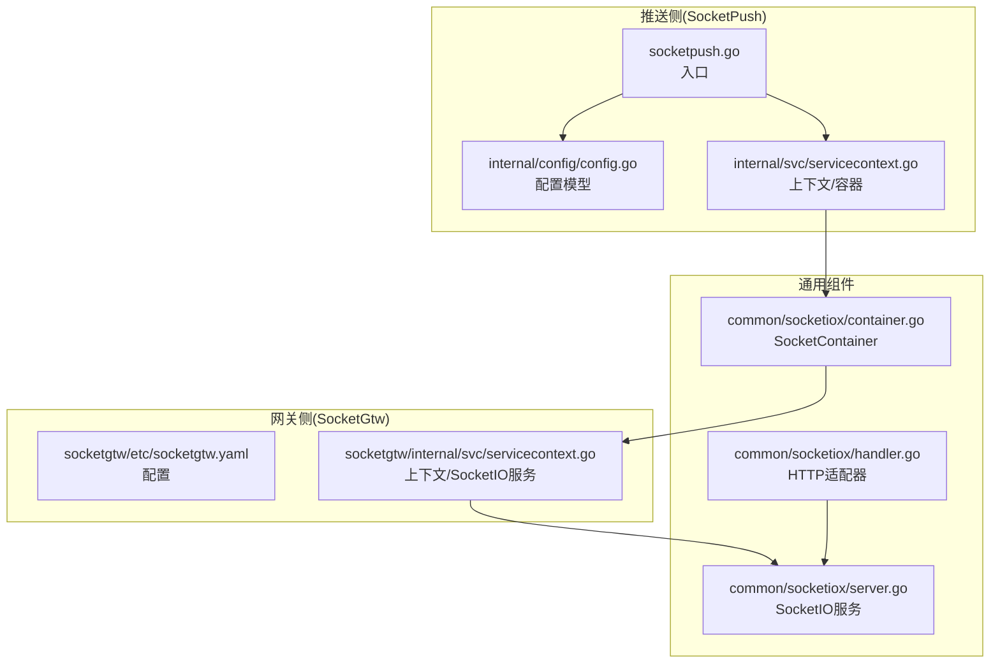
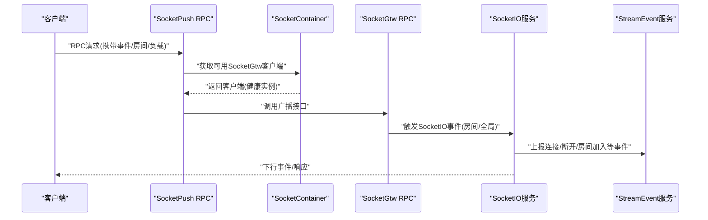
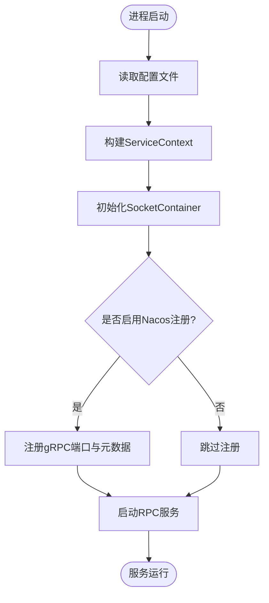
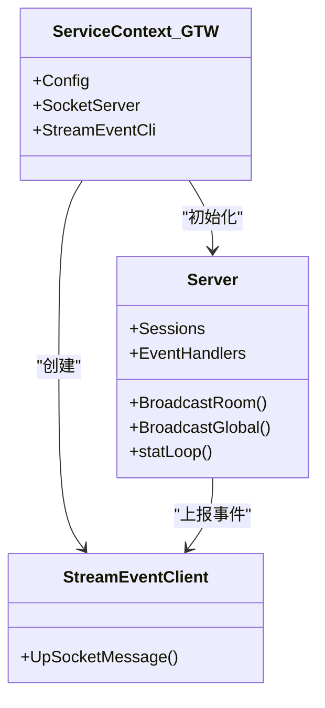
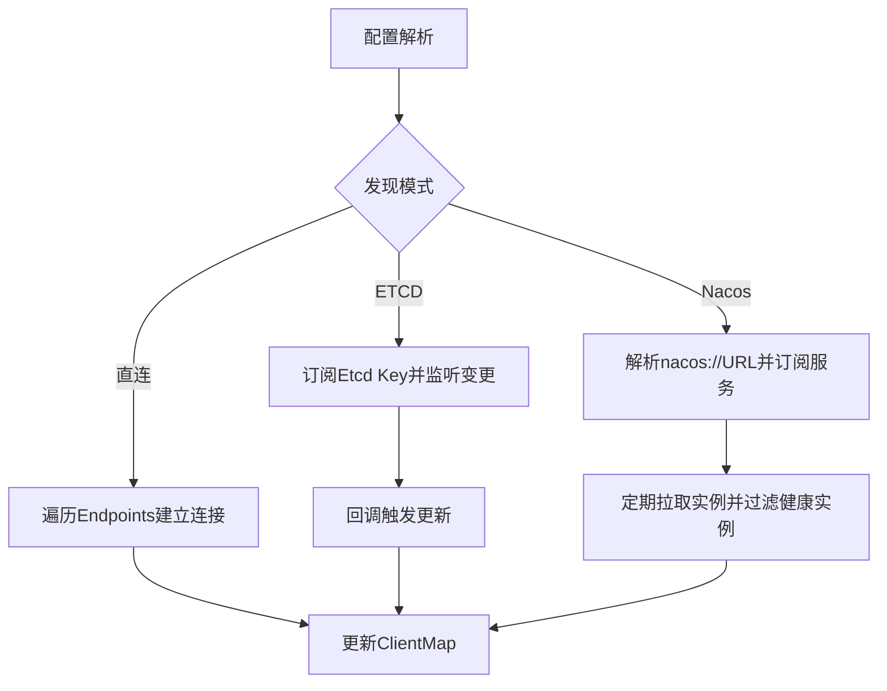
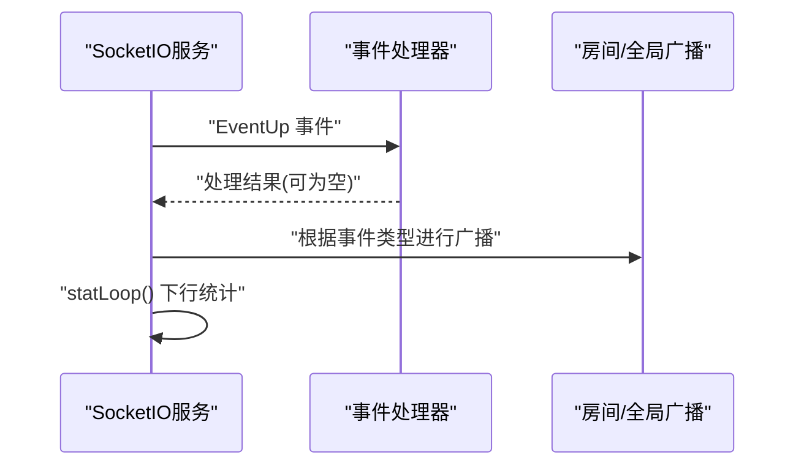
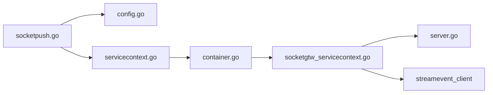

# 服务集成与部署

<cite>
**本文引用的文件**
- [socketpush.yaml](file://socketapp/socketpush/etc/socketpush.yaml)
- [config.go](file://socketapp/socketpush/internal/config/config.go)
- [servicecontext.go](file://socketapp/socketpush/internal/svc/servicecontext.go)
- [socketpush.go](file://socketapp/socketpush/socketpush.go)
- [container.go](file://common/socketiox/container.go)
- [server.go](file://common/socketiox/server.go)
- [handler.go](file://common/socketiox/handler.go)
- [socketgtw.yaml](file://socketapp/socketgtw/etc/socketgtw.yaml)
- [socketgtw_config.go](file://socketapp/socketgtw/internal/config/config.go)
- [socketgtw_servicecontext.go](file://socketapp/socketgtw/internal/svc/servicecontext.go)
- [Dockerfile](file://socketapp/socketpush/Dockerfile)
- [deploy.sh](file://socketapp/socketpush/deploy.sh)
- [test.env](file://socketapp/socketpush/env/test.env)
- [docker-compose.yml](file://deploy/docker-compose.yml)
</cite>

## 目录
1. [简介](#简介)
2. [项目结构](#项目结构)
3. [核心组件](#核心组件)
4. [架构总览](#架构总览)
5. [详细组件分析](#详细组件分析)
6. [依赖关系分析](#依赖关系分析)
7. [性能考量](#性能考量)
8. [故障排查指南](#故障排查指南)
9. [结论](#结论)
10. [附录](#附录)

## 简介
本技术文档面向“SocketIO推送服务”的集成与部署，围绕以下目标展开：系统化解读配置文件结构与参数含义；阐明服务上下文设计与依赖注入、资源管理及生命周期控制；详解服务注册与发现（Nacos）、健康检查与负载均衡策略；给出容器化与编排部署方案；梳理监控与日志管理要点；提供本地与生产环境的部署脚本与配置示例；总结最佳实践与常见问题解决方案。

## 项目结构
SocketIO推送服务由两部分组成：
- SocketPush 推送服务：基于 go-zero 的 RPC 服务，负责接收上游请求并通过 SocketGtw 广播到客户端。
- SocketGtw 网关服务：基于 SocketIO 的实时网关，负责认证、房间管理、事件分发与统计上报。

二者通过 go-zero 的 zrpc 通信，SocketPush 作为客户端消费 SocketGtw 提供的 SocketGtwClient，实现跨服务的广播能力。

**图表来源**
- [socketpush.go:27-69](file://socketapp/socketpush/socketpush.go#L27-L69)
- [config.go:5-22](file://socketapp/socketpush/internal/config/config.go#L5-L22)
- [servicecontext.go:13-18](file://socketapp/socketpush/internal/svc/servicecontext.go#L13-L18)
- [container.go:35-61](file://common/socketiox/container.go#L35-L61)
- [server.go:314-335](file://common/socketiox/server.go#L314-L335)
- [handler.go:19-40](file://common/socketiox/handler.go#L19-L40)
- [socketgtw.yaml:1-37](file://socketapp/socketgtw/etc/socketgtw.yaml#L1-L37)
- [socketgtw_servicecontext.go:24-133](file://socketapp/socketgtw/internal/svc/servicecontext.go#L24-L133)

**章节来源**
- [socketpush.go:27-69](file://socketapp/socketpush/socketpush.go#L27-L69)
- [socketgtw.yaml:1-37](file://socketapp/socketgtw/etc/socketgtw.yaml#L1-L37)

## 核心组件
- 配置模型与参数
  - SocketPush 配置：包含 RPC 监听地址、超时、日志、JWT 密钥与过期时间、Nacos 注册开关与凭据、SocketGtw 地址端点与超时等。
  - SocketGtw 配置：包含 RPC 监听、HTTP 端口、日志、JWT 认证、Nacos 注册、Socket 元数据键集合、StreamEvent 客户端配置等。
- 服务上下文
  - SocketPush：在上下文中创建 SocketContainer，按直连/ETCD/Nacos 三种方式建立与 SocketGtw 的连接池。
  - SocketGtw：在上下文中初始化 SocketIO 服务，注册认证、连接/断开钩子、房间加入/离开钩子，并将 SocketIO 事件转发给 StreamEvent 服务。
- SocketIO 服务
  - 支持认证、房间管理、全局/房间广播、心跳统计、会话元数据透传与查询。
- 容器与注册
  - SocketContainer 支持直连、ETCD 与 Nacos 三种发现模式，自动维护客户端连接池并做健康实例筛选。
  - SocketPush 在启动时可选择向 Nacos 注册自身 gRPC 端口与元数据。

**章节来源**
- [config.go:5-22](file://socketapp/socketpush/internal/config/config.go#L5-L22)
- [socketgtw_config.go:8-27](file://socketapp/socketgtw/internal/config/config.go#L8-L27)
- [servicecontext.go:13-18](file://socketapp/socketpush/internal/svc/servicecontext.go#L13-L18)
- [socketgtw_servicecontext.go:24-133](file://socketapp/socketgtw/internal/svc/servicecontext.go#L24-L133)
- [container.go:35-61](file://common/socketiox/container.go#L35-L61)
- [server.go:299-312](file://common/socketiox/server.go#L299-L312)

## 架构总览
SocketPush 作为 RPC 服务，负责接收业务请求并调用 SocketGtw 的 SocketGtwClient 进行广播；SocketGtw 作为 SocketIO 网关，负责客户端连接、认证、房间管理与事件分发，并将 SocketIO 事件回推到 StreamEvent 服务以实现统一事件流。

**图表来源**
- [socketpush.go:37-43](file://socketapp/socketpush/socketpush.go#L37-L43)
- [container.go:267-316](file://common/socketiox/container.go#L267-L316)
- [socketgtw_servicecontext.go:75-131](file://socketapp/socketgtw/internal/svc/servicecontext.go#L75-L131)
- [server.go:469-619](file://common/socketiox/server.go#L469-L619)

## 详细组件分析

### SocketPush 配置与启动流程
- 配置文件字段说明
  - Name/ListenOn/Timeout：服务名称、监听地址、超时。
  - Log：编码、日志路径、级别、保留天数。
  - JwtAuth：AccessSecret/PrevAccessSecret/AccessExpire。
  - NacosConfig：IsRegister/Host/Port/Username/PassWord/NamespaceId/ServiceName。
  - SocketGtwConf：Endpoints/Target/Timeout 等。
- 启动流程
  - 解析配置 → 构建 ServiceContext → 初始化 SocketContainer → 注册 gRPC 服务 → 可选 Nacos 注册 → 启动服务。

**图表来源**
- [socketpush.go:30-68](file://socketapp/socketpush/socketpush.go#L30-L68)
- [socketpush.yaml:1-28](file://socketapp/socketpush/etc/socketpush.yaml#L1-L28)
- [servicecontext.go:13-18](file://socketapp/socketpush/internal/svc/servicecontext.go#L13-L18)

**章节来源**
- [socketpush.yaml:1-28](file://socketapp/socketpush/etc/socketpush.yaml#L1-L28)
- [socketpush.go:30-68](file://socketapp/socketpush/socketpush.go#L30-L68)
- [servicecontext.go:13-18](file://socketapp/socketpush/internal/svc/servicecontext.go#L13-L18)

### SocketGtw 配置与 SocketIO 服务
- 配置文件字段说明
  - Http：HTTP 名称、主机、端口、超时。
  - NacosConfig：注册相关。
  - SocketMetaData：会话元数据键集合，用于透传到 SocketIO 会话。
  - StreamEventConf：StreamEvent 客户端配置（直连/ETCD/Nacos）。
- 上下文初始化
  - 创建 StreamEvent 客户端。
  - 初始化 SocketIO 服务，注册认证、连接/断开/预加入房间钩子，将 EventUp 事件交由 sockethandler 处理。
- SocketIO 服务特性
  - 认证支持 JWT 与多密钥切换。
  - 房间管理：加入/离开/广播。
  - 全局广播。
  - 统计周期性下行会话状态。

**图表来源**
- [socketgtw_servicecontext.go:18-133](file://socketapp/socketgtw/internal/svc/servicecontext.go#L18-L133)
- [server.go:299-312](file://common/socketiox/server.go#L299-L312)
- [socketgtw.yaml:21-37](file://socketapp/socketgtw/etc/socketgtw.yaml#L21-L37)

**章节来源**
- [socketgtw.yaml:1-37](file://socketapp/socketgtw/etc/socketgtw.yaml#L1-L37)
- [socketgtw_config.go:8-27](file://socketapp/socketgtw/internal/config/config.go#L8-L27)
- [socketgtw_servicecontext.go:24-133](file://socketapp/socketgtw/internal/svc/servicecontext.go#L24-L133)
- [server.go:314-335](file://common/socketiox/server.go#L314-L335)

### SocketContainer 与服务发现
- 支持三种发现模式
  - 直连：直接使用 Endpoints 列表。
  - ETCD：订阅 Etcd Key，动态增删客户端。
  - Nacos：解析 nacos://URL，订阅服务实例，过滤健康且带 gRPC_port 的实例。
- 健康检查与负载均衡
  - 仅纳入健康且启用的实例。
  - 从全量实例中随机抽样（上限 32），降低抖动影响。
- 客户端连接
  - 为每个实例创建独立的 zrpc 客户端，设置最大消息大小等 gRPC 选项。

**图表来源**
- [container.go:35-61](file://common/socketiox/container.go#L35-L61)
- [container.go:83-130](file://common/socketiox/container.go#L83-L130)
- [container.go:156-242](file://common/socketiox/container.go#L156-L242)
- [container.go:267-316](file://common/socketiox/container.go#L267-L316)
- [container.go:318-346](file://common/socketiox/container.go#L318-L346)

**章节来源**
- [container.go:35-61](file://common/socketiox/container.go#L35-L61)
- [container.go:156-242](file://common/socketiox/container.go#L156-L242)
- [container.go:267-316](file://common/socketiox/container.go#L267-L316)

### SocketIO 事件处理与广播
- 事件绑定
  - 认证：支持 Token 校验与 Claims 提取。
  - 连接/断开：钩子中可上报到 StreamEvent。
  - 房间：加入/离开/广播。
  - 全局：广播。
- 广播实现
  - 房间广播：To(room).Emit(event, data)。
  - 全局广播：Io.Emit(event, data)。
- 统计循环
  - 每分钟统计会话数、房间列表、每秒消息数(NPS)、元数据与房间加载错误信息，并下行至客户端。

**图表来源**
- [server.go:469-619](file://common/socketiox/server.go#L469-L619)
- [server.go:678-700](file://common/socketiox/server.go#L678-L700)
- [server.go:702-740](file://common/socketiox/server.go#L702-L740)

**章节来源**
- [server.go:337-676](file://common/socketiox/server.go#L337-L676)
- [server.go:678-740](file://common/socketiox/server.go#L678-L740)

### HTTP 适配与 SocketIO 处理器
- HandlerConfig 与 NewSocketioHandler 将 SocketIO 的 HTTP 处理器暴露为标准 http.HandlerFunc，便于嵌入到 Web 服务或反向代理链路。
- 适用于需要通过 HTTP 访问 SocketIO 的场景（如 WebSocket 握手）。

**章节来源**
- [handler.go:19-40](file://common/socketiox/handler.go#L19-L40)

## 依赖关系分析
- SocketPush 依赖
  - 配置模型：internal/config/config.go
  - 上下文：internal/svc/servicecontext.go
  - SocketContainer：common/socketiox/container.go
  - Nacos 注册：common/nacosx（在 socketpush.go 中使用）
- SocketGtw 依赖
  - 配置模型：socketgtw/internal/config/config.go
  - 上下文：socketgtw/internal/svc/servicecontext.go
  - SocketIO 服务：common/socketiox/server.go
  - StreamEvent 客户端：facade/streamevent/streamevent

**图表来源**
- [socketpush.go:10-23](file://socketapp/socketpush/socketpush.go#L10-L23)
- [config.go:1-22](file://socketapp/socketpush/internal/config/config.go#L1-L22)
- [servicecontext.go:1-18](file://socketapp/socketpush/internal/svc/servicecontext.go#L1-L18)
- [container.go:1-426](file://common/socketiox/container.go#L1-L426)
- [socketgtw_servicecontext.go:1-134](file://socketapp/socketgtw/internal/svc/servicecontext.go#L1-L134)
- [server.go:1-814](file://common/socketiox/server.go#L1-L814)

**章节来源**
- [socketpush.go:10-23](file://socketapp/socketpush/socketpush.go#L10-L23)
- [socketgtw_servicecontext.go:1-134](file://socketapp/socketgtw/internal/svc/servicecontext.go#L1-L134)

## 性能考量
- gRPC 最大消息大小
  - SocketContainer 与 SocketGtw 在客户端侧设置了较大的 MaxCallSendMsgSize，以支持大包传输。
- 实例抽样与稳定性
  - Nacos 发现时对实例进行随机抽样（上限 32），减少大规模实例变更带来的抖动。
- 广播与并发
  - 事件处理采用异步协程安全封装，避免阻塞主事件循环。
- 日志与统计
  - 统一的日志级别与路径配置，统计周期性下行有助于观测实时负载。

**章节来源**
- [container.go:106-118](file://common/socketiox/container.go#L106-L118)
- [container.go:300-308](file://common/socketiox/container.go#L300-L308)
- [server.go:702-740](file://common/socketiox/server.go#L702-L740)

## 故障排查指南
- Nacos 注册失败
  - 检查 NacosConfig 的 Host/Port/Username/PassWord/NamespaceId/ServiceName 是否正确。
  - 确认 SocketPush 启用了 IsRegister，并确保网络可达。
- 实例不可用或连接异常
  - 查看 SocketContainer 的健康实例筛选逻辑，确认实例健康且带有 gRPC_port 元数据。
  - 关注 ETCD/Nacos 订阅回调与定时刷新日志。
- 广播失败
  - 检查事件名是否被禁止（EventDown 为下行保留事件名）。
  - 确认房间名非空，全局广播事件名非空。
- 认证失败
  - 确认 JWT 密钥配置与 PrevAccessSecret 是否正确，Token 是否过期。
- 日志定位
  - 查看 Log.Path 与 Log.Level，结合会话 ID(SID) 与 EVENT 字段进行关联排查。

**章节来源**
- [socketpush.go:44-62](file://socketapp/socketpush/socketpush.go#L44-L62)
- [container.go:318-346](file://common/socketiox/container.go#L318-L346)
- [server.go:337-349](file://common/socketiox/server.go#L337-L349)
- [server.go:678-699](file://common/socketiox/server.go#L678-L699)

## 结论
该 SocketIO 推送服务通过清晰的配置模型、可插拔的服务上下文与强大的 SocketContainer 发现机制，实现了高可用、可扩展的实时推送能力。结合 Nacos 注册与健康检查、ETCD/Nacos 实例订阅、以及 SocketIO 的房间与广播能力，能够满足复杂业务场景下的实时通信需求。配合容器化与编排部署，可在本地与生产环境中快速落地。

## 附录

### 配置文件参数说明（SocketPush）
- Name：服务名称
- ListenOn：RPC 监听地址
- Timeout：超时毫秒
- Log.Encoding/Path/Level/KeepDays：日志编码、输出路径、级别、保留天数
- JwtAuth.AccessSecret/PrevAccessSecret/AccessExpire：JWT 密钥与过期时间
- NacosConfig.IsRegister/Host/Port/Username/PassWord/NamespaceId/ServiceName：Nacos 注册配置
- SocketGtwConf.Endpoints/Target/Timeout：SocketGtw 客户端发现与超时

**章节来源**
- [socketpush.yaml:1-28](file://socketapp/socketpush/etc/socketpush.yaml#L1-L28)

### 配置文件参数说明（SocketGtw）
- Name/ListenOn/Timeout：服务名称、监听地址、超时
- Log.*：日志配置
- http.Name/Host/Port/Timeout：HTTP 网关配置
- NacosConfig.*：注册配置
- SocketMetaData：会话元数据键集合
- StreamEventConf.*：StreamEvent 客户端配置

**章节来源**
- [socketgtw.yaml:1-37](file://socketapp/socketgtw/etc/socketgtw.yaml#L1-L37)

### 容器化与部署
- Dockerfile
  - 多阶段构建，最终镜像基于 scratch，包含时区与证书。
  - 工作目录与命令行参数指向 etc/socketpush.yaml。
- 部署脚本 deploy.sh
  - 支持本地编译、镜像构建、tar 保存、远程上传、远程加载镜像、标签管理、清理与 docker-compose 启动。
  - 通过 .env 文件注入环境变量，支持备份保留数量与远程镜像标签。
- docker-compose.yml
  - 提供 Kafka/Filebeat 等周边组件示例，便于日志采集与消息队列集成。

**章节来源**
- [Dockerfile:1-42](file://socketapp/socketpush/Dockerfile#L1-L42)
- [deploy.sh:1-175](file://socketapp/socketpush/deploy.sh#L1-L175)
- [test.env:1-15](file://socketapp/socketpush/env/test.env#L1-L15)
- [docker-compose.yml:1-110](file://deploy/docker-compose.yml#L1-L110)