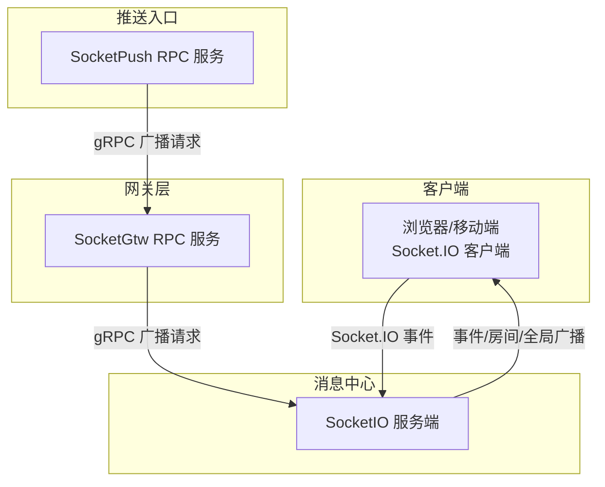
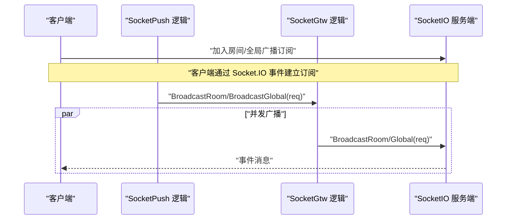
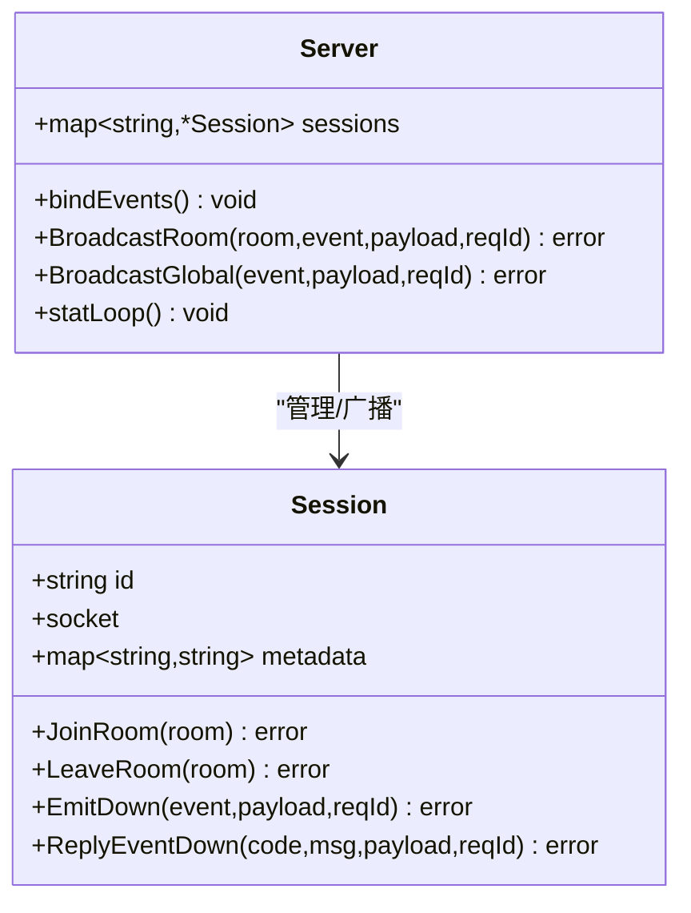
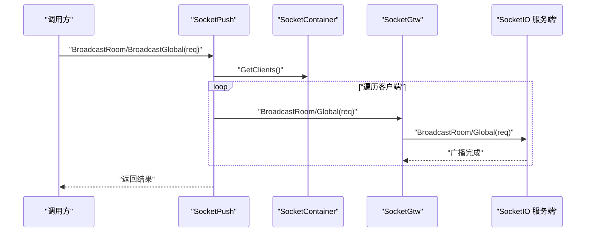
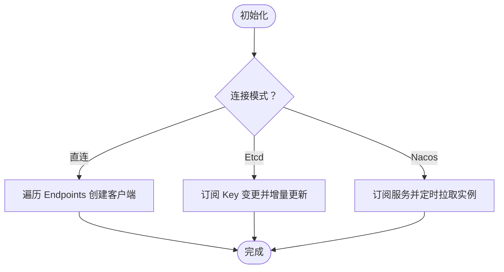
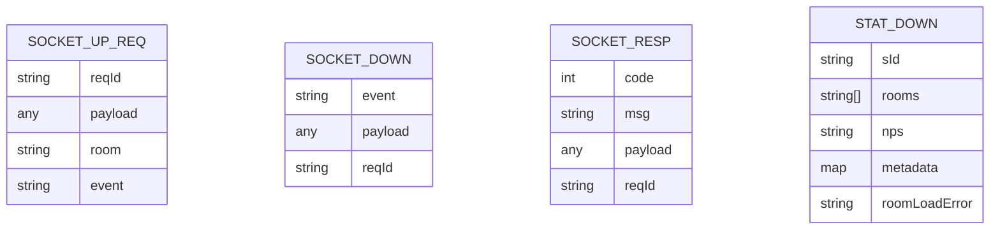

# 消息推送机制

<cite>
**本文引用的文件**
- [common/socketiox/server.go](file://common/socketiox/server.go)
- [common/socketiox/handler.go](file://common/socketiox/handler.go)
- [common/socketiox/container.go](file://common/socketiox/container.go)
- [socketapp/socketpush/internal/logic/broadcastroomlogic.go](file://socketapp/socketpush/internal/logic/broadcastroomlogic.go)
- [socketapp/socketpush/internal/logic/broadcastgloballogic.go](file://socketapp/socketpush/internal/logic/broadcastgloballogic.go)
- [socketapp/socketgtw/internal/logic/broadcastroomlogic.go](file://socketapp/socketgtw/internal/logic/broadcastroomlogic.go)
- [socketapp/socketgtw/internal/logic/broadcastgloballogic.go](file://socketapp/socketgtw/internal/logic/broadcastgloballogic.go)
- [socketapp/socketpush/etc/socketpush.yaml](file://socketapp/socketpush/etc/socketpush.yaml)
- [socketapp/socketgtw/etc/socketgtw.yaml](file://socketapp/socketgtw/etc/socketgtw.yaml)
- [socketapp/socketpush/socketpush/socketpush.pb.go](file://socketapp/socketpush/socketpush/socketpush.pb.go)
- [socketapp/socketgtw/socketgtw/socketgtw.pb.go](file://socketapp/socketgtw/socketgtw/socketgtw.pb.go)
- [common/socketiox/test-socketio.html](file://common/socketiox/test-socketio.html)
</cite>

## 目录
1. [简介](#简介)
2. [项目结构](#项目结构)
3. [核心组件](#核心组件)
4. [架构总览](#架构总览)
5. [详细组件分析](#详细组件分析)
6. [依赖关系分析](#依赖关系分析)
7. [性能考虑](#性能考虑)
8. [故障排查指南](#故障排查指南)
9. [结论](#结论)
10. [附录：推送API与最佳实践](#附录推送api与最佳实践)

## 简介
本文件系统性梳理基于 GoZero 与 Socket.IO 的消息推送机制，覆盖以下主题：
- 多种推送模式：单播推送、组播（房间）推送、全局广播、条件推送（按元数据筛选）
- 消息路由算法：会话管理、房间管理、目标查找、负载均衡
- 可靠性保障：请求 ID、响应 ACK、错误码与错误上报
- 消息格式规范：上行/下行消息结构、字段定义与序列化
- 性能优化：并发控制、批量分发、gRPC 调用限制
- 完整 API 文档：各推送模式的参数说明、调用流程与示例
- 最佳实践、错误处理与调试技巧

## 项目结构
该推送链路由三层组成：
- SocketIO 服务端（接收客户端消息、维护会话与房间、触发广播）
- SocketPush RPC 服务（接收上游推送请求，向 SocketGtw 广播）
- SocketGtw RPC 服务（接收 SocketPush 请求，转发给 SocketIO 服务）

图表来源
- [common/socketiox/server.go:337-676](file://common/socketiox/server.go#L337-L676)
- [socketapp/socketpush/internal/logic/broadcastroomlogic.go:29-44](file://socketapp/socketpush/internal/logic/broadcastroomlogic.go#L29-L44)
- [socketapp/socketgtw/internal/logic/broadcastroomlogic.go:29-46](file://socketapp/socketgtw/internal/logic/broadcastroomlogic.go#L29-L46)

章节来源
- [socketapp/socketpush/etc/socketpush.yaml:1-28](file://socketapp/socketpush/etc/socketpush.yaml#L1-L28)
- [socketapp/socketgtw/etc/socketgtw.yaml:1-37](file://socketapp/socketgtw/etc/socketgtw.yaml#L1-L37)

## 核心组件
- SocketIO 服务端：负责会话生命周期、房间管理、事件绑定、统计下发与广播执行
- SocketPush 逻辑：接收外部推送请求，遍历 SocketGtw 客户端并发起广播
- SocketGtw 逻辑：接收 SocketPush 请求，调用 SocketServer 执行广播
- SocketContainer：动态发现与管理 SocketGtw 客户端，支持 Etcd/Nacos/直连三种注册方式
- 协议模型：SocketPush 与 SocketGtw 使用 Protobuf 定义请求/响应结构

章节来源
- [common/socketiox/server.go:119-232](file://common/socketiox/server.go#L119-L232)
- [common/socketiox/container.go:30-77](file://common/socketiox/container.go#L30-L77)
- [socketapp/socketpush/socketpush/socketpush.pb.go:553-724](file://socketapp/socketpush/socketpush/socketpush.pb.go#L553-L724)
- [socketapp/socketgtw/socketgtw/socketgtw.pb.go:301-364](file://socketapp/socketgtw/socketgtw/socketgtw.pb.go#L301-L364)

## 架构总览
整体推送流程如下：

图表来源
- [socketapp/socketpush/internal/logic/broadcastroomlogic.go:29-44](file://socketapp/socketpush/internal/logic/broadcastroomlogic.go#L29-L44)
- [socketapp/socketgtw/internal/logic/broadcastroomlogic.go:29-46](file://socketapp/socketgtw/internal/logic/broadcastroomlogic.go#L29-L46)
- [common/socketiox/server.go:678-700](file://common/socketiox/server.go#L678-L700)

## 详细组件分析

### SocketIO 服务端（会话与房间管理）
- 会话管理：记录每个连接的 Session，支持设置/读取元数据、加入/离开房间、主动发送事件
- 事件绑定：内置连接、断开、加入房间、离开房间、上行事件、房间广播、全局广播等事件
- 统计下发：周期性向每个会话下发统计信息（会话ID、房间列表、网络指标、元数据）
- 广播能力：支持房间广播与全局广播，禁止使用保留事件名

图表来源
- [common/socketiox/server.go:119-232](file://common/socketiox/server.go#L119-L232)
- [common/socketiox/server.go:337-676](file://common/socketiox/server.go#L337-L676)
- [common/socketiox/server.go:678-740](file://common/socketiox/server.go#L678-L740)

章节来源
- [common/socketiox/server.go:119-232](file://common/socketiox/server.go#L119-L232)
- [common/socketiox/server.go:337-676](file://common/socketiox/server.go#L337-L676)
- [common/socketiox/server.go:678-740](file://common/socketiox/server.go#L678-L740)

### SocketPush 与 SocketGtw（推送入口与网关）
- SocketPush：接收外部推送请求，遍历 SocketContainer 中的 SocketGtw 客户端并并发广播
- SocketGtw：接收 SocketPush 请求，解析 payload（尝试识别 JSON），调用 SocketServer 执行广播

图表来源
- [socketapp/socketpush/internal/logic/broadcastroomlogic.go:29-44](file://socketapp/socketpush/internal/logic/broadcastroomlogic.go#L29-L44)
- [socketapp/socketpush/internal/logic/broadcastgloballogic.go:29-64](file://socketapp/socketpush/internal/logic/broadcastgloballogic.go#L29-L64)
- [socketapp/socketgtw/internal/logic/broadcastroomlogic.go:29-46](file://socketapp/socketgtw/internal/logic/broadcastroomlogic.go#L29-L46)
- [socketapp/socketgtw/internal/logic/broadcastgloballogic.go:29-47](file://socketapp/socketgtw/internal/logic/broadcastgloballogic.go#L29-L47)

章节来源
- [socketapp/socketpush/internal/logic/broadcastroomlogic.go:29-44](file://socketapp/socketpush/internal/logic/broadcastroomlogic.go#L29-L44)
- [socketapp/socketpush/internal/logic/broadcastgloballogic.go:29-64](file://socketapp/socketpush/internal/logic/broadcastgloballogic.go#L29-L64)
- [socketapp/socketgtw/internal/logic/broadcastroomlogic.go:29-46](file://socketapp/socketgtw/internal/logic/broadcastroomlogic.go#L29-L46)
- [socketapp/socketgtw/internal/logic/broadcastgloballogic.go:29-47](file://socketapp/socketgtw/internal/logic/broadcastgloballogic.go#L29-L47)

### SocketContainer（客户端容器与服务发现）
- 支持三种连接模式：直连、Etcd 订阅、Nacos 订阅
- 动态维护 SocketGtw 客户端集合，按子集大小进行缩放，避免一次性全量更新
- 提供客户端获取与快照，用于并发广播

图表来源
- [common/socketiox/container.go:35-61](file://common/socketiox/container.go#L35-L61)
- [common/socketiox/container.go:83-130](file://common/socketiox/container.go#L83-L130)
- [common/socketiox/container.go:156-242](file://common/socketiox/container.go#L156-L242)
- [common/socketiox/container.go:267-316](file://common/socketiox/container.go#L267-L316)

章节来源
- [common/socketiox/container.go:35-61](file://common/socketiox/container.go#L35-L61)
- [common/socketiox/container.go:83-130](file://common/socketiox/container.go#L83-L130)
- [common/socketiox/container.go:156-242](file://common/socketiox/container.go#L156-L242)
- [common/socketiox/container.go:267-316](file://common/socketiox/container.go#L267-L316)

### 消息格式规范
- 上行消息（客户端 -> 服务端）：包含 reqId、可选 room、可选 event、payload
- 下行消息（服务端 -> 客户端）：包含 event、payload、reqId；以及统计消息
- 错误响应：统一返回 code/msg/payload/reqId 结构

图表来源
- [common/socketiox/server.go:41-72](file://common/socketiox/server.go#L41-L72)
- [common/socketiox/server.go:74-93](file://common/socketiox/server.go#L74-L93)

章节来源
- [common/socketiox/server.go:41-72](file://common/socketiox/server.go#L41-L72)
- [common/socketiox/server.go:74-93](file://common/socketiox/server.go#L74-L93)

## 依赖关系分析
- SocketPush 依赖 SocketContainer 获取 SocketGtw 客户端集合
- SocketGtw 依赖 SocketServer 执行广播
- SocketIO 服务端内部维护会话与房间，对外暴露广播方法
- 配置层面，SocketPush 与 SocketGtw 分别通过 YAML 配置监听地址、超时、鉴权与服务发现参数

图表来源
- [socketapp/socketpush/internal/logic/broadcastroomlogic.go:31-39](file://socketapp/socketpush/internal/logic/broadcastroomlogic.go#L31-L39)
- [socketapp/socketgtw/internal/logic/broadcastroomlogic.go](file://socketapp/socketgtw/internal/logic/broadcastroomlogic.go#L39)
- [common/socketiox/server.go:678-700](file://common/socketiox/server.go#L678-L700)

章节来源
- [socketapp/socketpush/etc/socketpush.yaml:1-28](file://socketapp/socketpush/etc/socketpush.yaml#L1-L28)
- [socketapp/socketgtw/etc/socketgtw.yaml:1-37](file://socketapp/socketgtw/etc/socketgtw.yaml#L1-L37)

## 性能考虑
- 并发控制：SocketPush 在遍历客户端时采用安全并发 goroutine，避免阻塞主流程
- 批量分发：SocketPush 对每个客户端独立发起广播，天然具备横向扩展能力
- gRPC 限制：SocketContainer 在创建客户端时设置了最大消息大小，防止大包导致内存压力
- 服务发现缩放：SocketContainer 对实例列表进行随机打散与子集采样，降低大规模变更带来的抖动

章节来源
- [socketapp/socketpush/internal/logic/broadcastroomlogic.go:31-40](file://socketapp/socketpush/internal/logic/broadcastroomlogic.go#L31-L40)
- [socketapp/socketpush/internal/logic/broadcastgloballogic.go:31-60](file://socketapp/socketpush/internal/logic/broadcastgloballogic.go#L31-L60)
- [common/socketiox/container.go:113-118](file://common/socketiox/container.go#L113-L118)
- [common/socketiox/container.go:303-307](file://common/socketiox/container.go#L303-L307)
- [common/socketiox/container.go:348-356](file://common/socketiox/container.go#L348-L356)

## 故障排查指南
- 连接鉴权失败：检查 OnAuthentication 回调与 Token 校验逻辑
- 参数校验失败：关注缺失 reqId/payload/room/event 等字段的错误响应
- 房间加入失败：确认房间名非空且未被保留事件名占用
- 广播失败：检查 SocketGtw 是否正确接入 SocketServer，以及 SocketIO 服务端是否在运行
- 服务发现异常：核对 Etcd/Nacos 地址、命名空间、服务名与实例健康状态
- 日志定位：利用统计消息中的元数据与房间列表辅助定位问题

章节来源
- [common/socketiox/server.go:337-349](file://common/socketiox/server.go#L337-L349)
- [common/socketiox/server.go:392-435](file://common/socketiox/server.go#L392-L435)
- [common/socketiox/server.go:469-531](file://common/socketiox/server.go#L469-L531)
- [common/socketiox/server.go:532-575](file://common/socketiox/server.go#L532-L575)
- [common/socketiox/server.go:576-619](file://common/socketiox/server.go#L576-L619)
- [common/socketiox/server.go:702-740](file://common/socketiox/server.go#L702-L740)
- [common/socketiox/container.go:318-346](file://common/socketiox/container.go#L318-L346)

## 结论
该推送机制以 Socket.IO 为核心，结合 SocketPush 与 SocketGtw 的分层设计，实现了高可用、可扩展的消息推送体系。通过会话与房间管理、事件驱动与统计反馈、服务发现与并发广播，满足了多场景下的推送需求。建议在生产中配合完善的监控与日志策略，持续优化服务发现与广播路径。

## 附录：推送API与最佳实践

### 推送模式与API
- 单播推送（按会话ID）
  - 说明：通过 SocketGtw 的 JoinRoom/LeaveRoom 与房间广播组合实现定向推送
  - 关键点：需要先将目标会话加入特定房间，再对该房间广播
  - 示例参考
    - [common/socketiox/test-socketio.html:1354-1393](file://common/socketiox/test-socketio.html#L1354-L1393)

- 组播推送（房间广播）
  - 接口：BroadcastRoom
  - 参数：
    - reqId：请求标识
    - room：房间名
    - event：事件名
    - payload：消息体（字符串或 JSON）
  - 实现参考：
    - [socketapp/socketpush/socketpush/socketpush.pb.go:553-602](file://socketapp/socketpush/socketpush/socketpush.pb.go#L553-L602)
    - [socketapp/socketgtw/socketgtw/socketgtw.pb.go:301-350](file://socketapp/socketgtw/socketgtw/socketgtw.pb.go#L301-L350)
    - [socketapp/socketpush/internal/logic/broadcastroomlogic.go:29-44](file://socketapp/socketpush/internal/logic/broadcastroomlogic.go#L29-L44)
    - [socketapp/socketgtw/internal/logic/broadcastroomlogic.go:29-46](file://socketapp/socketgtw/internal/logic/broadcastroomlogic.go#L29-L46)

- 全局广播
  - 接口：BroadcastGlobal
  - 参数：
    - reqId：请求标识
    - event：事件名
    - payload：消息体（字符串或 JSON）
  - 实现参考：
    - [socketapp/socketpush/socketpush/socketpush.pb.go:664-706](file://socketapp/socketpush/socketpush/socketpush.pb.go#L664-L706)
    - [socketapp/socketgtw/socketgtw/socketgtw.pb.go:352-364](file://socketapp/socketgtw/socketgtw/socketgtw.pb.go#L352-L364)
    - [socketapp/socketpush/internal/logic/broadcastgloballogic.go:29-64](file://socketapp/socketpush/internal/logic/broadcastgloballogic.go#L29-L64)
    - [socketapp/socketgtw/internal/logic/broadcastgloballogic.go:29-47](file://socketapp/socketgtw/internal/logic/broadcastgloballogic.go#L29-L47)

- 条件推送（按元数据筛选）
  - 说明：通过 SocketIO 服务端的元数据存储与查询接口，按用户ID/设备ID等维度筛选会话后进行房间广播
  - 方法：
    - GetSessionByUserId(userId)
    - GetSessionByDeviceId(deviceId)
    - GetSessionByKey(key, value)
  - 实现参考：
    - [common/socketiox/server.go:761-782](file://common/socketiox/server.go#L761-L782)

### 消息可靠性与错误处理
- 请求ID（reqId）：贯穿上行/下行与 ACK，便于端到端追踪
- 错误码：
  - 成功：200
  - 参数错误：400
  - 业务错误：500
- 错误响应：统一返回 code/msg/payload/reqId 结构
- 断线与清理：断开连接时清理会话，避免悬挂引用

章节来源
- [common/socketiox/server.go:32-35](file://common/socketiox/server.go#L32-L35)
- [common/socketiox/server.go:74-93](file://common/socketiox/server.go#L74-L93)
- [common/socketiox/server.go:111-117](file://common/socketiox/server.go#L111-L117)
- [common/socketiox/server.go:620-641](file://common/socketiox/server.go#L620-L641)

### 最佳实践
- 使用 reqId 做幂等与追踪
- 将 payload 设计为 JSON 字符串或原始 JSON，便于 SocketGtw 正确识别
- 房间命名规范：避免使用保留事件名，确保语义清晰
- 广播前先验证参数完整性，减少无效调用
- 生产环境开启日志与统计，定期核对会话数量与房间分布

### 调试技巧
- 使用测试页面快速验证连接、加入房间与广播
  - 参考：[common/socketiox/test-socketio.html:1-44](file://common/socketiox/test-socketio.html#L1-L44)
- 观察统计消息，核对房间列表与元数据
- 核对服务发现配置，确保 SocketGtw 实例健康可见
- 关注 gRPC 最大消息限制，避免超大 payload 导致失败