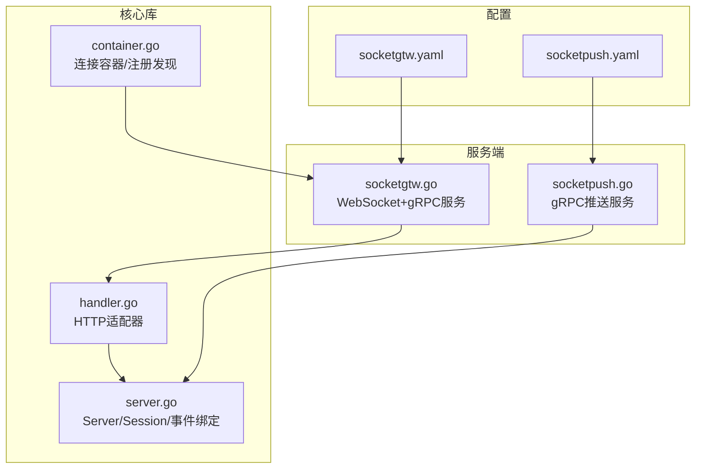
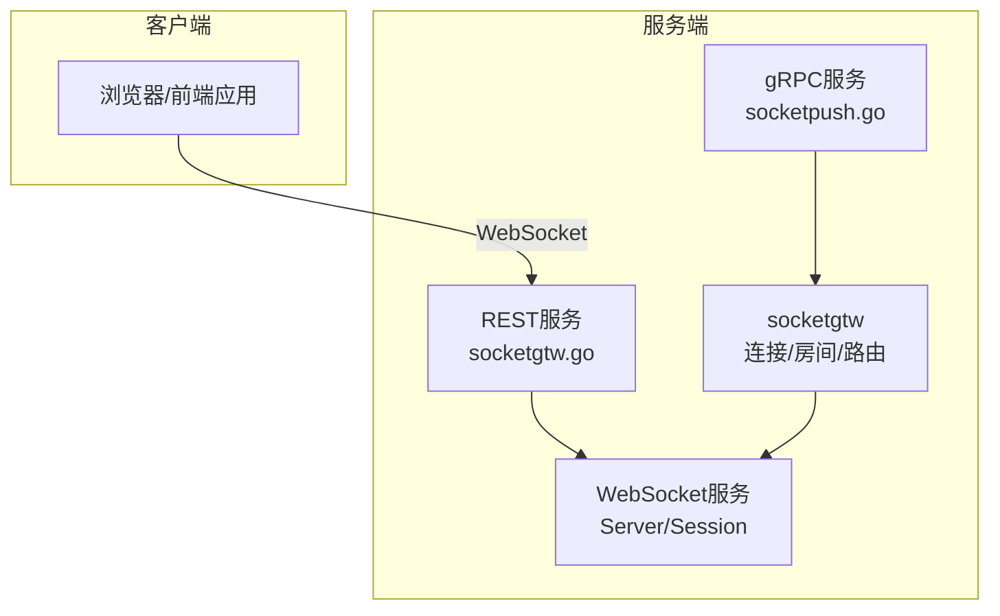
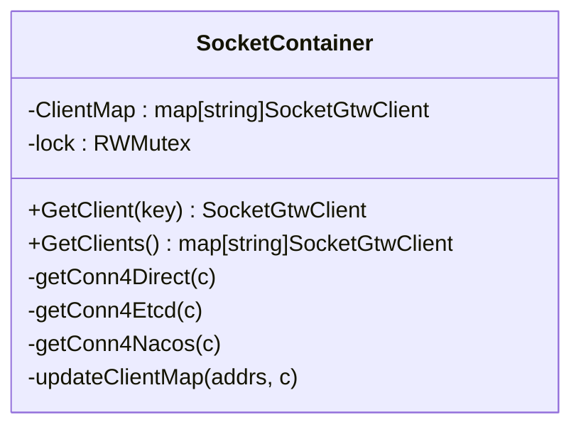
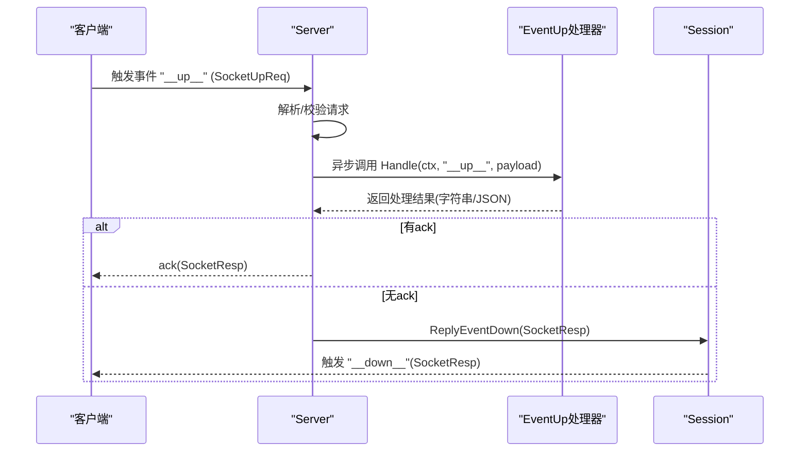
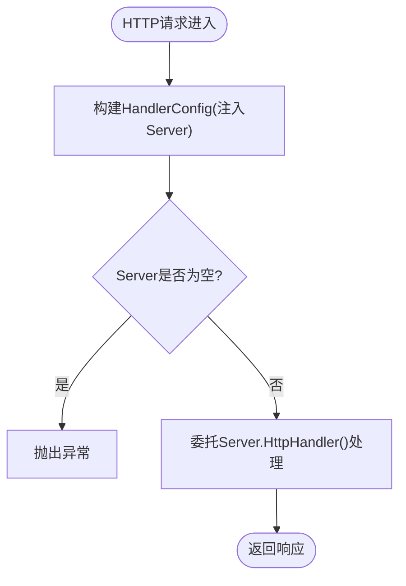
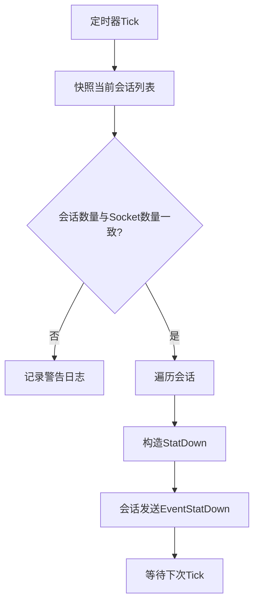
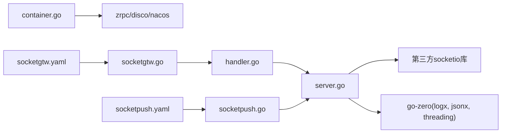

# SocketIO核心组件

<cite>
**本文引用的文件**
- [common/socketiox/container.go](file://common/socketiox/container.go)
- [common/socketiox/handler.go](file://common/socketiox/handler.go)
- [common/socketiox/server.go](file://common/socketiox/server.go)
- [common/socketiox/test-socketio.html](file://common/socketiox/test-socketio.html)
- [docs/socketiox-documentation.md](file://docs/socketiox-documentation.md)
- [socketapp/socketgtw/socketgtw.go](file://socketapp/socketgtw/socketgtw.go)
- [socketapp/socketpush/socketpush.go](file://socketapp/socketpush/socketpush.go)
- [socketapp/socketgtw/etc/socketgtw.yaml](file://socketapp/socketgtw/etc/socketgtw.yaml)
- [socketapp/socketpush/etc/socketpush.yaml](file://socketapp/socketpush/etc/socketpush.yaml)
</cite>

## 目录
1. [简介](#简介)
2. [项目结构](#项目结构)
3. [核心组件](#核心组件)
4. [架构总览](#架构总览)
5. [详细组件分析](#详细组件分析)
6. [依赖关系分析](#依赖关系分析)
7. [性能考量](#性能考量)
8. [故障排查指南](#故障排查指南)
9. [结论](#结论)
10. [附录](#附录)

## 简介
本技术文档聚焦于SocketIO核心组件，系统性阐述其在本仓库中的实现与使用方式，涵盖连接容器管理、消息处理器与事件循环机制；深入解析连接容器的设计原理（连接存储、状态跟踪、清理策略）、消息处理器的工作机制（解析、路由分发、回调处理）、事件循环的实现（监听、触发、异步处理）以及SocketIO协议的关键细节（握手、帧格式、传输机制）。同时提供完整的API使用指南、实际集成场景与最佳实践，帮助开发者快速理解并高效使用该核心组件。

## 项目结构
SocketIO相关能力主要分布在以下位置：
- 核心实现：common/socketiox 下的 server.go、handler.go、container.go
- 文档与示例：docs/socketiox-documentation.md、common/socketiox/test-socketio.html
- 服务端集成：socketapp/socketgtw 与 socketapp/socketpush 的服务入口与配置

图表来源
- [common/socketiox/server.go:1-814](file://common/socketiox/server.go#L1-L814)
- [common/socketiox/handler.go:1-41](file://common/socketiox/handler.go#L1-L41)
- [common/socketiox/container.go:1-426](file://common/socketiox/container.go#L1-L426)
- [socketapp/socketgtw/socketgtw.go:1-91](file://socketapp/socketgtw/socketgtw.go#L1-L91)
- [socketapp/socketpush/socketpush.go:1-70](file://socketapp/socketpush/socketpush.go#L1-L70)
- [socketapp/socketgtw/etc/socketgtw.yaml:1-37](file://socketapp/socketgtw/etc/socketgtw.yaml#L1-L37)
- [socketapp/socketpush/etc/socketpush.yaml:1-28](file://socketapp/socketpush/etc/socketpush.yaml#L1-L28)

章节来源
- [common/socketiox/server.go:1-814](file://common/socketiox/server.go#L1-L814)
- [common/socketiox/handler.go:1-41](file://common/socketiox/handler.go#L1-L41)
- [common/socketiox/container.go:1-426](file://common/socketiox/container.go#L1-L426)
- [socketapp/socketgtw/socketgtw.go:1-91](file://socketapp/socketgtw/socketgtw.go#L1-L91)
- [socketapp/socketpush/socketpush.go:1-70](file://socketapp/socketpush/socketpush.go#L1-L70)
- [socketapp/socketgtw/etc/socketgtw.yaml:1-37](file://socketapp/socketgtw/etc/socketgtw.yaml#L1-L37)
- [socketapp/socketpush/etc/socketpush.yaml:1-28](file://socketapp/socketpush/etc/socketpush.yaml#L1-L28)

## 核心组件
- Server：SocketIO服务器核心，负责连接生命周期、事件绑定、消息处理、广播、统计推送与会话管理。
- Session：单个连接的会话抽象，封装Socket句柄、元数据、房间集合与发送方法。
- EventHandler/EventHandlers：事件处理器接口与注册表，支持自定义事件的异步处理。
- Handler：HTTP适配器，将Server暴露为HTTP处理器，供REST服务承载。
- SocketContainer：连接容器，负责与下游服务（socketgtw）建立gRPC连接，支持直连、Etcd订阅与Nacos订阅三种模式，并维护连接映射与动态更新。

章节来源
- [common/socketiox/server.go:119-312](file://common/socketiox/server.go#L119-L312)
- [common/socketiox/handler.go:1-41](file://common/socketiox/handler.go#L1-L41)
- [common/socketiox/container.go:30-61](file://common/socketiox/container.go#L30-L61)

## 架构总览
SocketIO核心组件与服务端协作的总体架构如下：

图表来源
- [socketapp/socketgtw/socketgtw.go:30-91](file://socketapp/socketgtw/socketgtw.go#L30-L91)
- [socketapp/socketpush/socketpush.go:27-70](file://socketapp/socketpush/socketpush.go#L27-L70)
- [common/socketiox/server.go:314-335](file://common/socketiox/server.go#L314-L335)

## 详细组件分析

### 连接容器（SocketContainer）
- 设计目标
  - 统一管理与下游socketgtw的gRPC连接，支持多种服务发现与直连模式。
  - 提供并发安全的客户端映射，保障读写一致性。
- 关键能力
  - 直连模式：直接使用配置中的Endpoints建立连接。
  - Etcd订阅：监听Etcd键值变化，动态增删连接。
  - Nacos订阅：通过Nacos订阅服务实例，定期拉取健康实例并更新连接池。
  - 连接选择：对实例列表做随机打散与子集截断，避免过度膨胀。
- 并发与清理
  - 使用互斥锁保护ClientMap，读多写少场景下提供RLock优化。
  - 在更新时计算新增/移除集合，仅对差异部分执行连接创建/删除。
  - 健康检查：仅接受启用且健康的实例，并要求存在gRPC端口元数据。
- 集成点
  - 与Interceptor链路结合，设置最大消息尺寸等gRPC选项。
  - 与Nacos SDK集成，支持命名空间、超时、日志目录等环境变量覆盖。

图表来源
- [common/socketiox/container.go:30-61](file://common/socketiox/container.go#L30-L61)
- [common/socketiox/container.go:132-154](file://common/socketiox/container.go#L132-L154)
- [common/socketiox/container.go:83-130](file://common/socketiox/container.go#L83-L130)
- [common/socketiox/container.go:156-242](file://common/socketiox/container.go#L156-L242)
- [common/socketiox/container.go:267-316](file://common/socketiox/container.go#L267-L316)

章节来源
- [common/socketiox/container.go:30-61](file://common/socketiox/container.go#L30-L61)
- [common/socketiox/container.go:83-130](file://common/socketiox/container.go#L83-L130)
- [common/socketiox/container.go:132-154](file://common/socketiox/container.go#L132-L154)
- [common/socketiox/container.go:156-242](file://common/socketiox/container.go#L156-L242)
- [common/socketiox/container.go:267-316](file://common/socketiox/container.go#L267-L316)
- [common/socketiox/container.go:318-346](file://common/socketiox/container.go#L318-L346)
- [common/socketiox/container.go:348-356](file://common/socketiox/container.go#L348-L356)
- [common/socketiox/container.go:358-425](file://common/socketiox/container.go#L358-L425)

### 消息处理器与事件循环
- 事件绑定与生命周期
  - OnConnection：建立会话、注入元数据、执行连接钩子（可加载初始房间）。
  - OnAuthentication：可选令牌校验，支持基础校验与带声明的校验。
  - disconnect：断开连接时执行断开钩子并清理无效会话。
- 核心事件处理
  - __up__：客户端上行请求，解析SocketUpReq，异步调用注册的EventUp处理器，支持ack或__down__响应。
  - __join_room_up__/__leave_room_up__：房间加入/离开，支持预加入钩子与响应。
  - __room_broadcast_up__/__global_broadcast_up__：房间/全局广播，异步处理并回包。
  - 自定义事件：除__up__与__down__外的其他事件，统一走异步处理。
- 异步处理与错误处理
  - 所有业务处理均在独立goroutine中执行，避免阻塞事件循环。
  - 错误通过ack或__down__事件返回，统一使用SocketResp格式。
- 会话与房间管理
  - Session封装Socket句柄、元数据、房间集合与发送方法。
  - 支持按元数据查询会话（如userId/deviceId），便于精准推送与剔除。

图表来源
- [common/socketiox/server.go:469-531](file://common/socketiox/server.go#L469-L531)
- [common/socketiox/server.go:494-530](file://common/socketiox/server.go#L494-L530)

章节来源
- [common/socketiox/server.go:337-676](file://common/socketiox/server.go#L337-L676)
- [common/socketiox/server.go:119-232](file://common/socketiox/server.go#L119-L232)
- [common/socketiox/server.go:469-531](file://common/socketiox/server.go#L469-L531)
- [common/socketiox/server.go:532-619](file://common/socketiox/server.go#L532-L619)
- [common/socketiox/server.go:643-674](file://common/socketiox/server.go#L643-L674)

### HTTP适配器（Handler）
- 将Server包装为HTTP处理器，供REST服务承载WebSocket。
- 提供WithServer/NewSocketioHandler/SocketioHandler等便捷函数。

图表来源
- [common/socketiox/handler.go:19-40](file://common/socketiox/handler.go#L19-L40)

章节来源
- [common/socketiox/handler.go:1-41](file://common/socketiox/handler.go#L1-L41)

### 事件循环与统计推送
- 统计循环：周期性向每个会话推送StatDown，包含会话ID、房间列表、命名空间、元数据与房间加载错误信息。
- 会话清理：断开连接时删除无效会话，保证内存与统计一致性。
- 并发安全：统计循环与会话访问均使用读锁，避免竞争。

图表来源
- [common/socketiox/server.go:702-740](file://common/socketiox/server.go#L702-L740)

章节来源
- [common/socketiox/server.go:702-740](file://common/socketiox/server.go#L702-L740)
- [common/socketiox/server.go:742-747](file://common/socketiox/server.go#L742-L747)

### SocketIO协议与传输机制
- 握手与认证
  - 通过SocketIO原生auth传递令牌，支持基础校验与带声明的校验。
  - 连接建立后注入会话元数据（如userId/deviceId），用于后续寻址与控制。
- 帧格式与事件约定
  - 上行事件：__up__、__join_room_up__、__leave_room_up__、__room_broadcast_up__、__global_broadcast_up__
  - 下行事件：__down__（响应式返回）、__stat_down__（统计推送）、自定义事件（SocketDown）
  - 响应格式：SocketResp（code/msg/payload/reqId）
- 传输与路由
  - 前端通过WebSocket连接socketgtw；后端通过gRPC调用socketpush向前端推送消息。
  - socketgtw内部可连接StreamEvent服务加载用户初始房间列表，实现按元数据自动入房。

章节来源
- [docs/socketiox-documentation.md:1-656](file://docs/socketiox-documentation.md#L1-L656)
- [common/socketiox/server.go:20-35](file://common/socketiox/server.go#L20-L35)
- [common/socketiox/server.go:337-349](file://common/socketiox/server.go#L337-L349)

## 依赖关系分析
- 内部依赖
  - server.go依赖go-zero的日志、并发与JSON工具；依赖第三方socketio库。
  - handler.go依赖net/http与server.go提供的HttpHandler。
  - container.go依赖zrpc、discov、nacos-sdk-go、Interceptor链路。
- 外部集成
  - socketgtw.go：REST服务承载HTTP适配器，gRPC服务注册socketgtw。
  - socketpush.go：gRPC服务注册socketpush，供后端推送消息。
  - 配置文件：socketgtw.yaml与socketpush.yaml分别定义监听端口、JWT、Nacos、SocketMetaData、StreamEventConf等。

图表来源
- [common/socketiox/server.go:1-18](file://common/socketiox/server.go#L1-L18)
- [common/socketiox/handler.go:1-6](file://common/socketiox/handler.go#L1-L6)
- [common/socketiox/container.go:3-28](file://common/socketiox/container.go#L3-L28)
- [socketapp/socketgtw/socketgtw.go:1-26](file://socketapp/socketgtw/socketgtw.go#L1-L26)
- [socketapp/socketpush/socketpush.go:1-23](file://socketapp/socketpush/socketpush.go#L1-L23)
- [socketapp/socketgtw/etc/socketgtw.yaml:1-37](file://socketapp/socketgtw/etc/socketgtw.yaml#L1-L37)
- [socketapp/socketpush/etc/socketpush.yaml:1-28](file://socketapp/socketpush/etc/socketpush.yaml#L1-L28)

章节来源
- [common/socketiox/server.go:1-18](file://common/socketiox/server.go#L1-L18)
- [common/socketiox/handler.go:1-6](file://common/socketiox/handler.go#L1-L6)
- [common/socketiox/container.go:3-28](file://common/socketiox/container.go#L3-L28)
- [socketapp/socketgtw/socketgtw.go:1-26](file://socketapp/socketgtw/socketgtw.go#L1-L26)
- [socketapp/socketpush/socketpush.go:1-23](file://socketapp/socketpush/socketpush.go#L1-L23)
- [socketapp/socketgtw/etc/socketgtw.yaml:1-37](file://socketapp/socketgtw/etc/socketgtw.yaml#L1-L37)
- [socketapp/socketpush/etc/socketpush.yaml:1-28](file://socketapp/socketpush/etc/socketpush.yaml#L1-L28)

## 性能考量
- 异步处理：所有业务处理均在独立goroutine中执行，避免阻塞事件循环，提升吞吐。
- 连接池管理：Nacos/Etcd订阅模式下，对实例列表做随机打散与子集截断，降低连接规模与抖动风险。
- 并发安全：读多写少场景使用RLock，减少锁竞争；写路径使用互斥锁保护。
- 统计推送：按配置间隔推送，避免频繁I/O；仅在会话存在时发送统计信息。
- gRPC限制：在连接容器中设置最大消息尺寸，防止大包导致内存压力。

## 故障排查指南
- 连接鉴权失败
  - 检查OnAuthentication与令牌校验逻辑，确认token是否正确传递与校验通过。
- 房间加载错误
  - 监听__stat_down__事件，若roomLoadError非空，需根据错误提示进行重连或提示用户。
- 广播/单播失败
  - 确认事件名不为保留事件（如__down__），并检查房间是否存在或会话是否有效。
- 会话统计不一致
  - 若统计循环发现sessions与sockets数量不一致，需检查会话清理逻辑与断开钩子执行情况。
- 连接容器异常
  - Nacos/Etcd订阅失败时，检查Target/Endpoints配置、网络连通性与命名空间参数；关注日志中的“忽略实例”与“健康实例数”。

章节来源
- [common/socketiox/server.go:337-349](file://common/socketiox/server.go#L337-L349)
- [docs/socketiox-documentation.md:411-441](file://docs/socketiox-documentation.md#L411-L441)
- [common/socketiox/server.go:702-740](file://common/socketiox/server.go#L702-L740)
- [common/socketiox/container.go:156-242](file://common/socketiox/container.go#L156-L242)
- [common/socketiox/container.go:318-346](file://common/socketiox/container.go#L318-L346)

## 结论
SocketIO核心组件通过清晰的Server/Session模型、灵活的事件处理机制与健壮的连接容器管理，实现了高可用、可扩展的实时通信能力。配合HTTP适配器与服务端集成，既满足前端WebSocket直连，也支持后端通过gRPC进行推送与控制。建议在生产环境中结合Nacos/Etcd订阅模式、合理的统计间隔与错误监控，确保系统稳定与可观测性。

## 附录

### API使用指南（核心接口）
- 服务器创建与配置
  - NewServer/MustServer：创建服务器，支持注入事件处理器、上下文键、统计间隔、鉴权与钩子。
  - WithEventHandlers/WithHandler：注册事件处理器。
  - WithTokenValidator/WithTokenValidatorWithClaims：配置令牌校验。
  - WithConnectHook/WithPreJoinRoomHook/WithDisconnectHook：配置连接/房间/断开钩子。
- 会话管理
  - GetSession/GetSessionByDeviceId/GetSessionByUserId：按会话ID或元数据查询会话。
  - JoinRoom/LeaveRoom：房间加入/离开。
  - Session.EmitDown/ReplyEventDown：下行消息发送与响应。
- 广播与统计
  - BroadcastRoom/BroadcastGlobal：房间/全局广播。
  - statLoop：周期性推送统计信息。
- HTTP适配器
  - NewSocketioHandler/SocketioHandler：将Server包装为HTTP处理器。

章节来源
- [common/socketiox/server.go:256-335](file://common/socketiox/server.go#L256-L335)
- [common/socketiox/server.go:314-335](file://common/socketiox/server.go#L314-L335)
- [common/socketiox/server.go:392-435](file://common/socketiox/server.go#L392-L435)
- [common/socketiox/server.go:436-468](file://common/socketiox/server.go#L436-L468)
- [common/socketiox/server.go:469-531](file://common/socketiox/server.go#L469-L531)
- [common/socketiox/server.go:532-619](file://common/socketiox/server.go#L532-L619)
- [common/socketiox/server.go:643-674](file://common/socketiox/server.go#L643-L674)
- [common/socketiox/server.go:749-782](file://common/socketiox/server.go#L749-L782)
- [common/socketiox/server.go:784-800](file://common/socketiox/server.go#L784-L800)
- [common/socketiox/handler.go:19-40](file://common/socketiox/handler.go#L19-L40)

### 集成场景与示例
- 前端测试与演示
  - 提供HTML测试页，展示连接、事件监听、日志输出等，便于快速验证。
- 服务端集成
  - socketgtw：REST服务承载HTTP适配器，gRPC服务承载socketgtw协议。
  - socketpush：gRPC服务承载推送协议，供后端调用。
- 配置要点
  - socketgtw.yaml：监听端口、JWT、Nacos、SocketMetaData、StreamEventConf。
  - socketpush.yaml：监听端口、JWT、Nacos、SocketGtwConf。

章节来源
- [common/socketiox/test-socketio.html:1-800](file://common/socketiox/test-socketio.html#L1-L800)
- [socketapp/socketgtw/socketgtw.go:30-91](file://socketapp/socketgtw/socketgtw.go#L30-L91)
- [socketapp/socketpush/socketpush.go:27-70](file://socketapp/socketpush/socketpush.go#L27-L70)
- [socketapp/socketgtw/etc/socketgtw.yaml:1-37](file://socketapp/socketgtw/etc/socketgtw.yaml#L1-L37)
- [socketapp/socketpush/etc/socketpush.yaml:1-28](file://socketapp/socketpush/etc/socketpush.yaml#L1-L28)