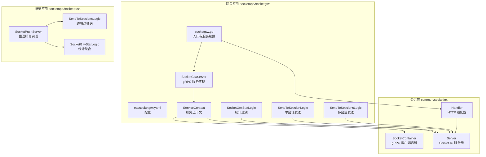
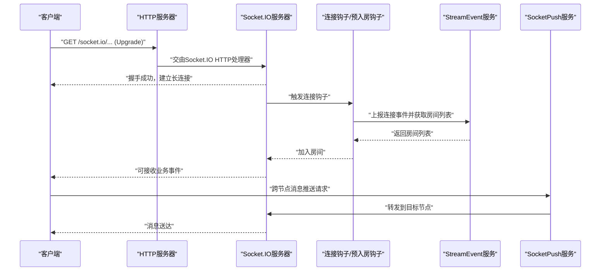
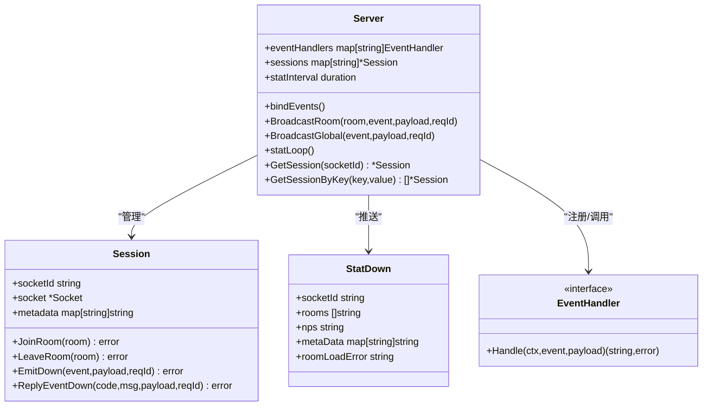
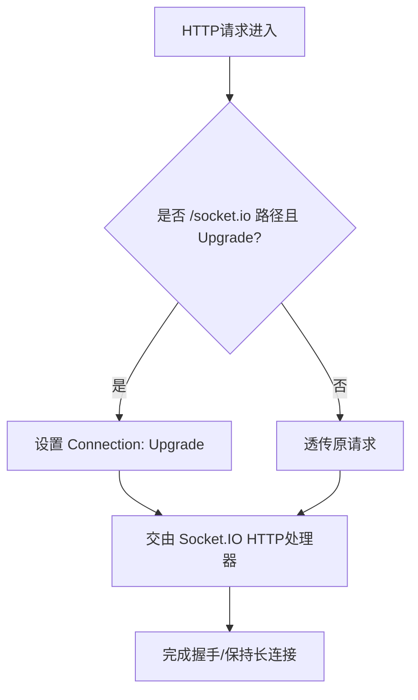
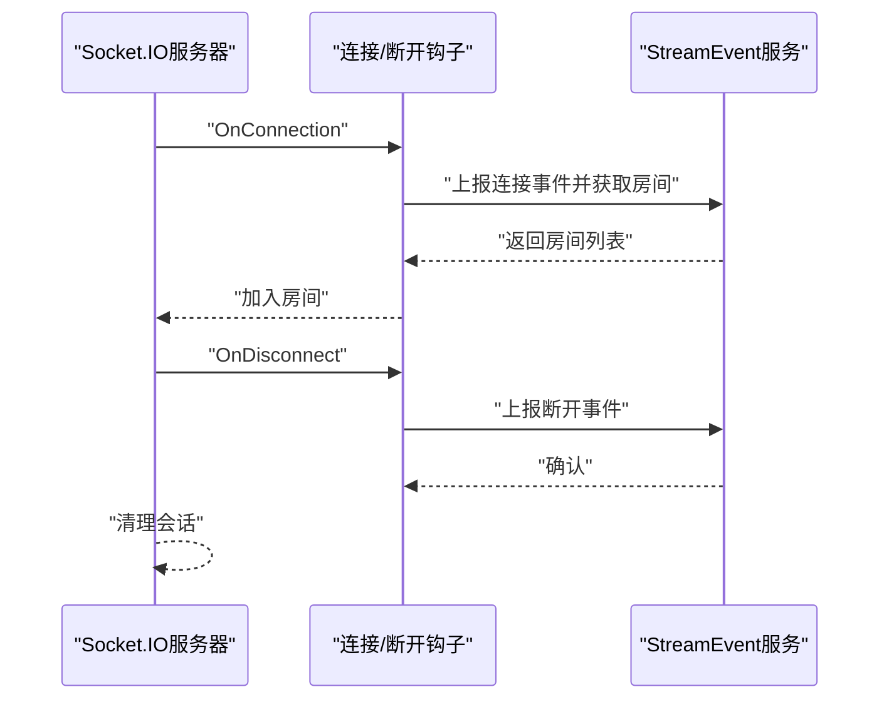
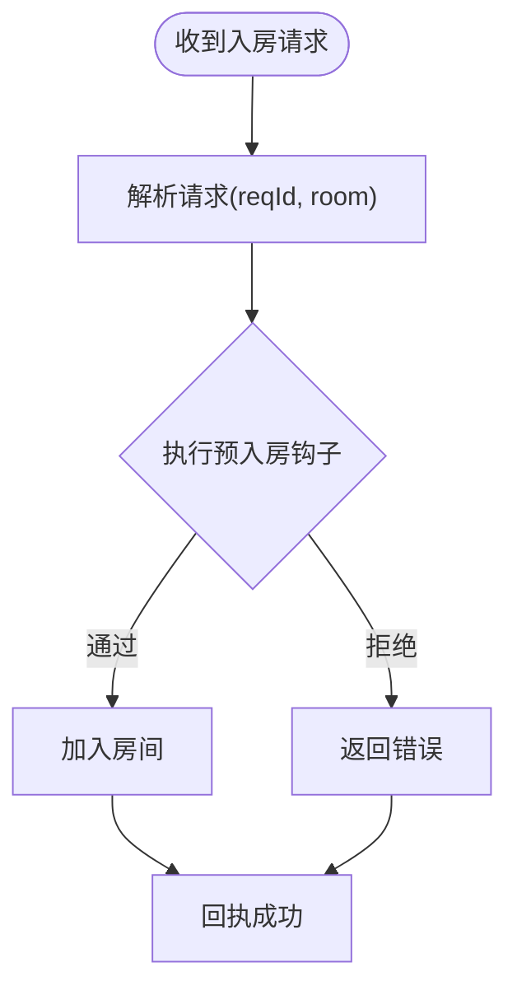
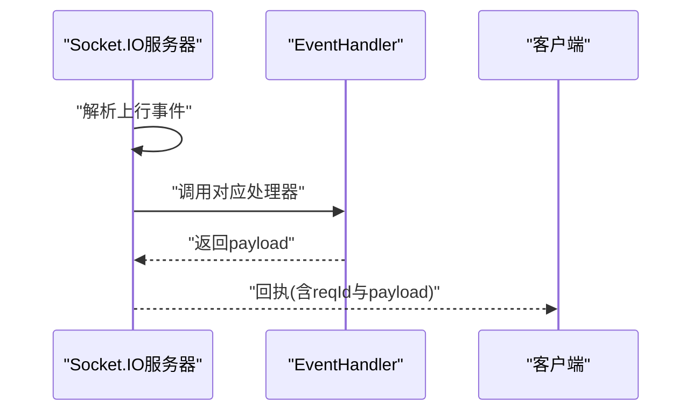
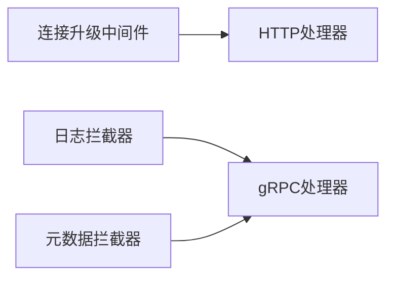
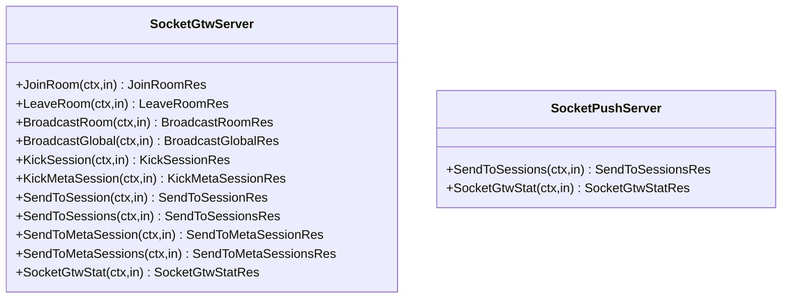
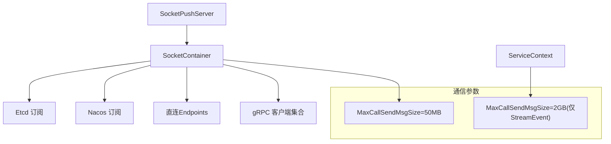

# SocketIO网关服务

<cite>
**本文引用的文件**
- [common/socketiox/server.go](file://common/socketiox/server.go)
- [common/socketiox/handler.go](file://common/socketiox/handler.go)
- [common/socketiox/container.go](file://common/socketiox/container.go)
- [socketapp/socketgtw/socketgtw.go](file://socketapp/socketgtw/socketgtw.go)
- [socketapp/socketgtw/etc/socketgtw.yaml](file://socketapp/socketgtw/etc/socketgtw.yaml)
- [socketapp/socketgtw/internal/server/socketgtwserver.go](file://socketapp/socketgtw/internal/server/socketgtwserver.go)
- [socketapp/socketgtw/socketgtw.proto](file://socketapp/socketgtw/socketgtw.proto)
- [socketapp/socketgtw/internal/logic/socketgtwstatlogic.go](file://socketapp/socketgtw/internal/logic/socketgtwstatlogic.go)
- [socketapp/socketgtw/internal/logic/sendtosessionlogic.go](file://socketapp/socketgtw/internal/logic/sendtosessionlogic.go)
- [socketapp/socketgtw/internal/logic/sendtosessionslogic.go](file://socketapp/socketgtw/internal/logic/sendtosessionslogic.go)
- [socketapp/socketgtw/internal/config/config.go](file://socketapp/socketgtw/internal/config/config.go)
- [socketapp/socketgtw/internal/svc/servicecontext.go](file://socketapp/socketgtw/internal/svc/servicecontext.go)
- [socketapp/socketpush/socketpush.proto](file://socketapp/socketpush/socketpush.proto)
- [socketapp/socketpush/internal/logic/sendtosessionslogic.go](file://socketapp/socketpush/internal/logic/sendtosessionslogic.go)
- [socketapp/socketpush/internal/logic/socketgtwstatlogic.go](file://socketapp/socketpush/internal/logic/socketgtwstatlogic.go)
</cite>

## 目录
1. [简介](#简介)
2. [项目结构](#项目结构)
3. [核心组件](#核心组件)
4. [架构总览](#架构总览)
5. [详细组件分析](#详细组件分析)
6. [依赖分析](#依赖分析)
7. [性能考虑](#性能考虑)
8. [故障排查指南](#故障排查指南)
9. [结论](#结论)
10. [附录：配置与集成指南](#附录配置与集成指南)

## 简介
本技术文档面向SocketIO网关服务，系统性阐述其核心架构与实现细节，包括：
- gRPC服务器配置与服务注册
- HTTP服务器集成与Socket.IO握手接入
- 连接管理策略（建立、心跳、断线重连、会话与房间）
- 房间管理机制（创建、成员、广播、权限）
- 消息路由算法（事件到处理器映射、广播分发）
- 中间件处理机制（请求拦截、链式调用、日志与元数据透传）
- 完整配置项说明与最佳实践
- 实际代码示例路径与集成步骤

## 项目结构
SocketIO网关由"SocketIO核心库 + Socket网关应用 + Socket推送应用"三部分组成：
- 公共库：common/socketiox 提供Socket.IO服务器、HTTP适配器、客户端容器等
- 网关应用：socketapp/socketgtw 提供gRPC服务端、HTTP REST服务、业务逻辑与配置
- 推送应用：socketapp/socketpush 提供跨节点消息推送能力

**更新** 新增了socketpush组件的跨节点消息推送能力

**章节来源**
- [socketapp/socketgtw/socketgtw.go:30-91](file://socketapp/socketgtw/socketgtw.go#L30-L91)
- [socketapp/socketgtw/etc/socketgtw.yaml:1-37](file://socketapp/socketgtw/etc/socketgtw.yaml#L1-L37)

## 核心组件
- Socket.IO服务器（Server）：负责连接生命周期、事件绑定、房间管理、广播、统计上报、会话查询
- HTTP适配器（Handler）：将HTTP请求转交给Socket.IO内部HTTP处理器，实现握手与长连接
- gRPC客户端容器（SocketContainer）：基于Etcd/Nacos/直连自动发现并维护gRPC客户端集合
- 网关应用（socketgtw）：组合gRPC与HTTP服务，注入Socket.IO服务与中间件，注册服务到Nacos
- 推送应用（socketpush）：提供跨节点消息推送、统计聚合、令牌生成等能力
- 服务上下文（ServiceContext）：装配Socket.IO服务器、鉴权钩子、连接/断开/入房钩子、与StreamEvent服务交互
- gRPC服务实现（SocketGtwServer）：提供JoinRoom/LeaveRoom/BroadcastRoom/BroadcastGlobal/KickSession等RPC接口
- gRPC服务实现（SocketPushServer）：提供跨节点消息推送、统计聚合等RPC接口

**更新** 新增了socketpush组件及其服务实现

**章节来源**
- [common/socketiox/server.go:299-335](file://common/socketiox/server.go#L299-L335)
- [common/socketiox/handler.go:19-41](file://common/socketiox/handler.go#L19-L41)
- [common/socketiox/container.go:30-61](file://common/socketiox/container.go#L30-L61)
- [socketapp/socketgtw/internal/server/socketgtwserver.go:15-91](file://socketapp/socketgtw/internal/server/socketgtwserver.go#L15-L91)
- [socketapp/socketgtw/internal/svc/servicecontext.go:24-134](file://socketapp/socketgtw/internal/svc/servicecontext.go#L24-L134)

## 架构总览
SocketIO网关采用"HTTP + gRPC"的双栈架构：
- HTTP层：通过Socket.IO HTTP适配器完成握手与长连接维持
- gRPC层：提供房间管理、全局广播、会话踢出、按元数据广播等能力
- 中间件：统一日志拦截器、连接升级中间件、元数据透传
- 服务发现：支持Etcd/Nacos/直连三种模式，动态维护gRPC客户端集合
- 跨节点推送：socketpush组件提供跨节点消息推送能力

**更新** 新增了跨节点推送的交互流程

**图表来源**
- [socketapp/socketgtw/socketgtw.go:48-61](file://socketapp/socketgtw/socketgtw.go#L48-L61)
- [common/socketiox/handler.go:33-35](file://common/socketiox/handler.go#L33-L35)
- [common/socketiox/server.go:350-391](file://common/socketiox/server.go#L350-L391)
- [socketapp/socketgtw/internal/svc/servicecontext.go:75-96](file://socketapp/socketgtw/internal/svc/servicecontext.go#L75-L96)

## 详细组件分析

### Socket.IO服务器（Server）
- 连接建立：认证钩子校验token；可选带声明的验证器将claims写入会话元数据；记录会话并触发连接钩子加载房间
- 事件处理：内置事件包括连接、断开、上行事件、房间广播、全局广播；支持自定义事件处理器
- 房间管理：会话级Join/Leave；服务级BroadcastRoom/BroadcastGlobal
- 统计上报：周期性向每个会话推送StatDown，包含会话ID、房间列表、网络指标、元数据与房间加载错误
- 会话查询：按设备ID/用户ID/任意元数据键值查询会话集合

**更新** Session结构中的字段从'id'重命名为'socketId'，StatDown结构中的'SId'重命名为'SocketId'

**图表来源**
- [common/socketiox/server.go:299-335](file://common/socketiox/server.go#L299-L335)
- [common/socketiox/server.go:119-232](file://common/socketiox/server.go#L119-L232)
- [common/socketiox/server.go:66-72](file://common/socketiox/server.go#L66-L72)
- [common/socketiox/server.go:702-782](file://common/socketiox/server.go#L702-L782)

**章节来源**
- [common/socketiox/server.go:337-676](file://common/socketiox/server.go#L337-L676)
- [common/socketiox/server.go:702-782](file://common/socketiox/server.go#L702-L782)

### HTTP适配器与Socket.IO集成
- Handler将HTTP请求委托给Socket.IO内部HTTP处理器，实现标准的Socket.IO握手流程
- 网关在HTTP层增加中间件，确保对socket.io路径的Upgrade头正确传递，避免代理/反向代理导致的协议降级

**图表来源**
- [socketapp/socketgtw/socketgtw.go:48-61](file://socketapp/socketgtw/socketgtw.go#L48-L61)
- [common/socketiox/handler.go:33-35](file://common/socketiox/handler.go#L33-L35)

**章节来源**
- [common/socketiox/handler.go:19-41](file://common/socketiox/handler.go#L19-L41)
- [socketapp/socketgtw/socketgtw.go:48-61](file://socketapp/socketgtw/socketgtw.go#L48-L61)

### 连接管理策略
- 连接建立：认证钩子与带声明的验证器；连接钩子可拉取房间列表并自动加入
- 心跳检测：由Socket.IO底层协议与服务端统计循环共同保障
- 断线重连：客户端断开后清理无效会话，触发断开钩子上报状态
- 连接池管理：通过SocketContainer基于Etcd/Nacos/直连自动发现gRPC服务实例，维护客户端集合

**图表来源**
- [common/socketiox/server.go:350-391](file://common/socketiox/server.go#L350-L391)
- [common/socketiox/server.go:620-641](file://common/socketiox/server.go#L620-L641)
- [socketapp/socketgtw/internal/svc/servicecontext.go:75-113](file://socketapp/socketgtw/internal/svc/servicecontext.go#L75-L113)

**章节来源**
- [common/socketiox/server.go:350-391](file://common/socketiox/server.go#L350-L391)
- [common/socketiox/server.go:620-641](file://common/socketiox/server.go#L620-L641)
- [socketapp/socketgtw/internal/svc/servicecontext.go:75-113](file://socketapp/socketgtw/internal/svc/servicecontext.go#L75-L113)

### 房间管理机制
- 房间创建：由业务侧在连接钩子中返回房间列表或客户端主动发起加入
- 成员管理：Session.JoinRoom/LeaveRoom；服务端统计时包含房间列表
- 消息广播：BroadcastRoom按房间广播；BroadcastGlobal全量广播
- 权限控制：可在预入房钩子中对接业务鉴权，拒绝非法入房请求

**图表来源**
- [common/socketiox/server.go:392-435](file://common/socketiox/server.go#L392-L435)
- [common/socketiox/server.go:418-427](file://common/socketiox/server.go#L418-L427)

**章节来源**
- [common/socketiox/server.go:418-435](file://common/socketiox/server.go#L418-L435)
- [common/socketiox/server.go:678-688](file://common/socketiox/server.go#L678-L688)

### 消息路由算法
- 上行事件（EventUp）：统一由注册的EventHandler处理，返回的字符串payload会被尝试作为JSON解析后再回传
- 自定义事件：除内置事件外，其他事件名称直接交由对应EventHandler处理
- 广播事件：房间广播与全局广播分别调用服务端广播方法，禁止使用保留事件名

**图表来源**
- [common/socketiox/server.go:496-530](file://common/socketiox/server.go#L496-L530)
- [common/socketiox/server.go:649-673](file://common/socketiox/server.go#L649-L673)

**章节来源**
- [common/socketiox/server.go:469-531](file://common/socketiox/server.go#L469-L531)
- [common/socketiox/server.go:643-674](file://common/socketiox/server.go#L643-L674)

### 中间件处理机制
- 日志拦截器：为gRPC请求添加统一日志
- 连接升级中间件：确保对socket.io路径的Upgrade头正确传递
- 元数据透传：通过UnaryMetadataInterceptor在gRPC调用链中携带认证信息

**图表来源**
- [socketapp/socketgtw/socketgtw.go:81-82](file://socketapp/socketgtw/socketgtw.go#L81-L82)
- [socketapp/socketgtw/socketgtw.go:48-61](file://socketapp/socketgtw/socketgtw.go#L48-L61)
- [common/socketiox/container.go:111-118](file://common/socketiox/container.go#L111-L118)

**章节来源**
- [socketapp/socketgtw/socketgtw.go:81-82](file://socketapp/socketgtw/socketgtw.go#L81-L82)
- [socketapp/socketgtw/socketgtw.go:48-61](file://socketapp/socketgtw/socketgtw.go#L48-L61)
- [common/socketiox/container.go:111-118](file://common/socketiox/container.go#L111-L118)

### gRPC服务与业务逻辑
- 服务实现：SocketGtwServer提供JoinRoom/LeaveRoom/BroadcastRoom/BroadcastGlobal/KickSession/KickMetaSession/SendToSession/SendToSessions/SendToMetaSession/SendToMetaSessions/SocketGtwStat等RPC
- 推送服务：SocketPushServer提供跨节点消息推送、统计聚合等RPC
- 业务逻辑：以SocketGtwStat为例，直接读取Socket.IO服务器会话数量

**更新** 新增了SocketPushServer及其方法定义

**图表来源**
- [socketapp/socketgtw/internal/server/socketgtwserver.go:15-91](file://socketapp/socketgtw/internal/server/socketgtwserver.go#L15-L91)
- [socketapp/socketgtw/internal/logic/socketgtwstatlogic.go:26-32](file://socketapp/socketgtw/internal/logic/socketgtwstatlogic.go#L26-L32)
- [socketapp/socketpush/socketpush.proto](file://socketapp/socketpush/socketpush.proto)

**章节来源**
- [socketapp/socketgtw/internal/server/socketgtwserver.go:26-90](file://socketapp/socketgtw/internal/server/socketgtwserver.go#L26-L90)
- [socketapp/socketgtw/internal/logic/socketgtwstatlogic.go:26-32](file://socketapp/socketgtw/internal/logic/socketgtwstatlogic.go#L26-L32)

### 字段命名规范化
- 会话标识符：Session结构中的'id'字段已重命名为'socketId'
- 统计结构：StatDown结构中的'SId'字段已重命名为'SocketId'
- 请求结构：socketgtw和socketpush组件中相关请求结构的'SIds'字段已重命名为'SocketIds'
- 命名约定：从snake_case标准化为camelCase，提升代码一致性

**新增章节** 专门说明字段命名规范化的变更

**章节来源**
- [common/socketiox/server.go:119-125](file://common/socketiox/server.go#L119-L125)
- [common/socketiox/server.go:66-72](file://common/socketiox/server.go#L66-L72)
- [socketapp/socketgtw/socketgtw.proto:79](file://socketapp/socketgtw/socketgtw.proto#L79)
- [socketapp/socketgtw/socketgtw.proto:815](file://socketapp/socketgtw/socketgtw.proto#L815)
- [socketapp/socketpush/socketpush.proto](file://socketapp/socketpush/socketpush.proto)

## 依赖分析
- 服务发现：SocketContainer支持Etcd/Nacos/直连三种模式，自动维护gRPC客户端集合，并限制订阅实例规模
- 通信参数：gRPC调用默认最大发送消息大小为50MB，StreamEvent客户端允许最大2GB
- 认证：支持JWT校验与声明解析，可同时启用当前与历史密钥
- 跨节点通信：socketpush组件通过SocketContainer向所有节点广播消息

**更新** 新增了socketpush组件的跨节点通信依赖

**图表来源**
- [common/socketiox/container.go:83-154](file://common/socketiox/container.go#L83-L154)
- [common/socketiox/container.go:156-346](file://common/socketiox/container.go#L156-L346)
- [socketapp/socketgtw/internal/svc/servicecontext.go:25-33](file://socketapp/socketgtw/internal/svc/servicecontext.go#L25-L33)

**章节来源**
- [common/socketiox/container.go:83-154](file://common/socketiox/container.go#L83-L154)
- [common/socketiox/container.go:156-346](file://common/socketiox/container.go#L156-L346)
- [socketapp/socketgtw/internal/svc/servicecontext.go:25-33](file://socketapp/socketgtw/internal/svc/servicecontext.go#L25-L33)

## 性能考虑
- 会话统计：每分钟一次统计循环，异步向各会话推送StatDown，避免阻塞主事件循环
- 广播优化：BroadcastRoom/BroadcastGlobal使用底层广播接口，减少重复序列化
- 实例订阅：Nacos/Etcd订阅时对实例集做随机采样，限制订阅规模，降低内存与CPU压力
- gRPC消息大小：根据业务场景选择合适的最大消息大小，避免过大导致内存占用过高
- 跨节点推送：socketpush组件使用并发goroutine向所有节点推送消息，提升推送效率

**更新** 新增了跨节点推送的性能考虑

**章节来源**
- [common/socketiox/server.go:702-740](file://common/socketiox/server.go#L702-L740)
- [common/socketiox/container.go:348-356](file://common/socketiox/container.go#L348-L356)
- [socketapp/socketgtw/internal/svc/servicecontext.go:28-32](file://socketapp/socketgtw/internal/svc/servicecontext.go#L28-L32)

## 故障排查指南
- 握手失败：检查HTTP中间件是否正确传递Upgrade头；确认Socket.IO服务器认证钩子返回true
- 无法加入房间：检查预入房钩子是否返回错误；确认房间名非空
- 广播失败：检查事件名是否为保留事件；确认payload可被正确序列化
- 会话统计不一致：关注统计循环中的会话计数校验日志
- 服务发现异常：查看Nacos/Etcd订阅日志，确认健康实例与gRPC端口配置
- 跨节点推送失败：检查SocketContainer客户端集合是否完整，确认目标节点可达

**更新** 新增了跨节点推送相关的故障排查

**章节来源**
- [socketapp/socketgtw/socketgtw.go:48-61](file://socketapp/socketgtw/socketgtw.go#L48-L61)
- [common/socketiox/server.go:337-349](file://common/socketiox/server.go#L337-L349)
- [common/socketiox/server.go:418-427](file://common/socketiox/server.go#L418-L427)
- [common/socketiox/server.go:680-687](file://common/socketiox/server.go#L680-L687)
- [common/socketiox/server.go:718-722](file://common/socketiox/server.go#L718-L722)

## 结论
SocketIO网关通过清晰的模块划分与完善的中间件体系，实现了高性能、可观测、可扩展的实时通信网关。其核心优势在于：
- 双栈融合：HTTP+gRPC满足不同场景需求
- 强大的连接与房间管理：内置事件驱动与钩子机制
- 可靠的服务发现与通信参数调优
- 易于扩展的消息路由与统计上报
- 跨节点推送能力：socketpush组件提供分布式消息推送解决方案

**更新** 新增了跨节点推送能力的优势描述

## 附录：配置与集成指南

### 配置项说明
- 通用配置
  - Name/ListenOn/Timeout/Log：服务名称、监听地址、超时、日志
  - Http：HTTP服务配置（Host/Port/Timeout）
- 认证配置
  - JwtAuth.AccessSecret/PrevAccessSecret：JWT密钥（可配置历史密钥）
- 注册中心
  - NacosConfig：是否注册、主机、端口、命名空间、用户名、密码、服务名
- SocketIO元数据
  - SocketMetaData：从JWT声明中抽取并写入会话元数据的键列表
- StreamEvent客户端
  - StreamEventConf.Endpoints/NonBlock/Timeout：StreamEvent服务地址、非阻塞与超时
- SocketPush配置
  - SocketPushConf：socketpush组件的配置参数

**更新** 新增了SocketPush配置项说明

**章节来源**
- [socketapp/socketgtw/etc/socketgtw.yaml:1-37](file://socketapp/socketgtw/etc/socketgtw.yaml#L1-L37)
- [socketapp/socketgtw/internal/config/config.go:8-27](file://socketapp/socketgtw/internal/config/config.go#L8-L27)

### 代码示例与集成步骤
- 启动顺序
  - 解析配置 → 初始化ServiceContext（装配Socket.IO服务器与钩子）→ 启动gRPC服务器 → 启动HTTP服务器 → 注册到Nacos
- 关键实现路径
  - 入口与服务编排：[socketapp/socketgtw/socketgtw.go:30-91](file://socketapp/socketgtw/socketgtw.go#L30-L91)
  - 服务上下文装配（含鉴权与钩子）：[socketapp/socketgtw/internal/svc/servicecontext.go:24-134](file://socketapp/socketgtw/internal/svc/servicecontext.go#L24-L134)
  - gRPC服务实现：[socketapp/socketgtw/internal/server/socketgtwserver.go:15-91](file://socketapp/socketgtw/internal/server/socketgtwserver.go#L15-L91)
  - Socket.IO服务器与HTTP适配器：[common/socketiox/server.go:314-335](file://common/socketiox/server.go#L314-L335)、[common/socketiox/handler.go:19-41](file://common/socketiox/handler.go#L19-L41)
  - 服务发现与客户端容器：[common/socketiox/container.go:35-61](file://common/socketiox/container.go#L35-L61)
  - 跨节点推送实现：[socketapp/socketpush/internal/logic/sendtosessionslogic.go:29-44](file://socketapp/socketpush/internal/logic/sendtosessionslogic.go#L29-L44)

**更新** 新增了跨节点推送的实现路径

**章节来源**
- [socketapp/socketgtw/socketgtw.go:30-91](file://socketapp/socketgtw/socketgtw.go#L30-L91)
- [socketapp/socketgtw/internal/svc/servicecontext.go:24-134](file://socketapp/socketgtw/internal/svc/servicecontext.go#L24-L134)
- [socketapp/socketgtw/internal/server/socketgtwserver.go:15-91](file://socketapp/socketgtw/internal/server/socketgtwserver.go#L15-L91)
- [common/socketiox/server.go:314-335](file://common/socketiox/server.go#L314-L335)
- [common/socketiox/handler.go:19-41](file://common/socketiox/handler.go#L19-L41)
- [common/socketiox/container.go:35-61](file://common/socketiox/container.go#L35-L61)