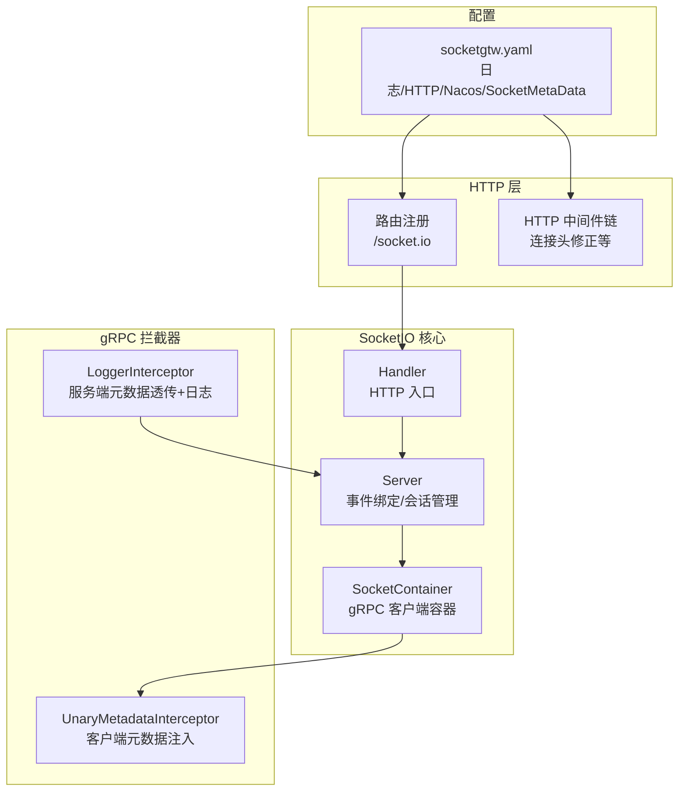
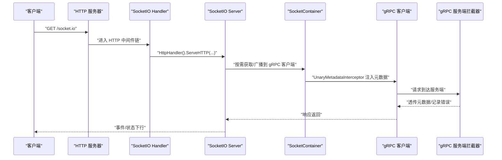
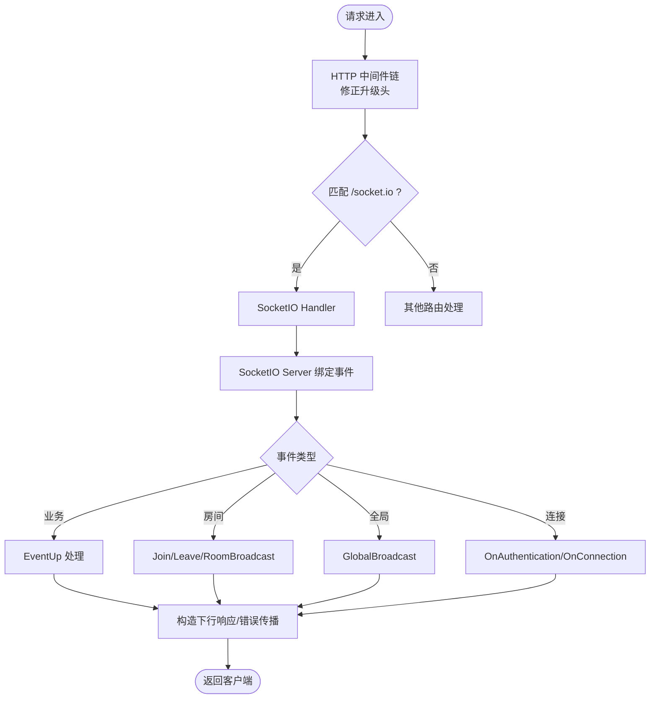
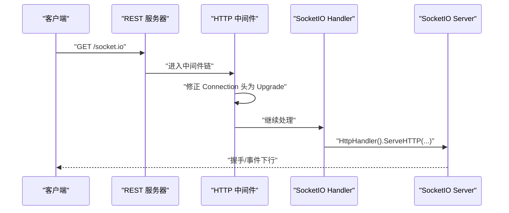
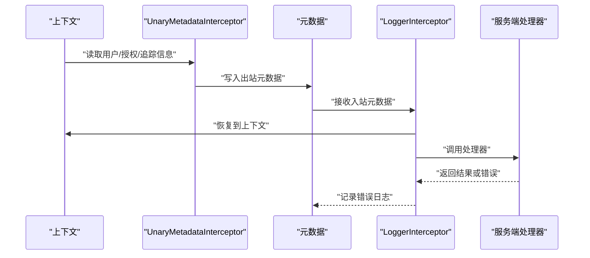
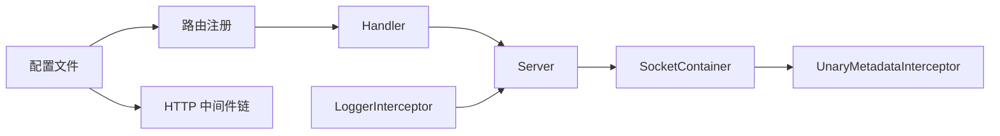

# 中间件处理机制

<cite>
**本文引用的文件**
- [common/socketiox/container.go](file://common/socketiox/container.go)
- [common/socketiox/handler.go](file://common/socketiox/handler.go)
- [common/socketiox/server.go](file://common/socketiox/server.go)
- [common/Interceptor/rpcclient/metadataInterceptor.go](file://common/Interceptor/rpcclient/metadataInterceptor.go)
- [common/Interceptor/rpcserver/loggerInterceptor.go](file://common/Interceptor/rpcserver/loggerInterceptor.go)
- [socketapp/socketgtw/socketgtw.go](file://socketapp/socketgtw/socketgtw.go)
- [socketapp/socketgtw/etc/socketgtw.yaml](file://socketapp/socketgtw/etc/socketgtw.yaml)
- [socketapp/socketgtw/internal/handler/routes.go](file://socketapp/socketgtw/internal/handler/routes.go)
- [.trae/skills/zero-skills/references/rest-api-patterns.md](file://.trae/skills/zero-skills/references/rest-api-patterns.md)
- [.trae/skills/zero-skills/references/resilience-patterns.md](file://.trae/skills/zero-skills/references/resilience-patterns.md)
- [.trae/skills/zero-skills/best-practices/overview.md](file://.trae/skills/zero-skills/best-practices/overview.md)
- [.trae/skills/zero-skills/troubleshooting/common-issues.md](file://.trae/skills/zero-skills/troubleshooting/common-issues.md)
</cite>

## 目录
1. [引言](#引言)
2. [项目结构](#项目结构)
3. [核心组件](#核心组件)
4. [架构总览](#架构总览)
5. [详细组件分析](#详细组件分析)
6. [依赖分析](#依赖分析)
7. [性能考虑](#性能考虑)
8. [故障排查指南](#故障排查指南)
9. [结论](#结论)
10. [附录](#附录)

## 引言
本技术文档围绕 SocketIO 中间件处理机制展开，系统性阐述中间件链设计原理（执行顺序、链式调用与异常传播）、HTTP 中间件实现（请求预处理、响应后处理、跨域策略）、gRPC 拦截器机制（请求拦截、响应处理、元数据传递）、日志记录与性能指标采集、安全中间件（认证、鉴权、限流）以及扩展指南（自定义中间件开发、配置管理、性能优化）。文档同时提供最佳实践与常见问题解决方案，帮助读者在不直接阅读源码的情况下快速掌握中间件体系。

## 项目结构
本项目采用多模块组织方式，SocketIO 中间件位于 common/socketiox，gRPC 客户端与服务端拦截器位于 common/Interceptor，Socket 网关服务位于 socketapp/socketgtw。HTTP 路由注册与中间件链配置位于 socketgtw 内部，配置文件位于 etc 目录。

图表来源
- [common/socketiox/server.go:314-335](file://common/socketiox/server.go#L314-L335)
- [common/socketiox/handler.go:19-40](file://common/socketiox/handler.go#L19-L40)
- [common/socketiox/container.go:35-61](file://common/socketiox/container.go#L35-L61)
- [common/Interceptor/rpcclient/metadataInterceptor.go:11-32](file://common/Interceptor/rpcclient/metadataInterceptor.go#L11-L32)
- [common/Interceptor/rpcserver/loggerInterceptor.go:12-44](file://common/Interceptor/rpcserver/loggerInterceptor.go#L12-L44)
- [socketapp/socketgtw/socketgtw.go:40-61](file://socketapp/socketgtw/socketgtw.go#L40-L61)
- [socketapp/socketgtw/etc/socketgtw.yaml:1-37](file://socketapp/socketgtw/etc/socketgtw.yaml#L1-L37)

章节来源
- [common/socketiox/server.go:314-335](file://common/socketiox/server.go#L314-L335)
- [common/socketiox/handler.go:19-40](file://common/socketiox/handler.go#L19-L40)
- [common/socketiox/container.go:35-61](file://common/socketiox/container.go#L35-L61)
- [common/Interceptor/rpcclient/metadataInterceptor.go:11-32](file://common/Interceptor/rpcclient/metadataInterceptor.go#L11-L32)
- [common/Interceptor/rpcserver/loggerInterceptor.go:12-44](file://common/Interceptor/rpcserver/loggerInterceptor.go#L12-L44)
- [socketapp/socketgtw/socketgtw.go:40-61](file://socketapp/socketgtw/socketgtw.go#L40-L61)
- [socketapp/socketgtw/etc/socketgtw.yaml:1-37](file://socketapp/socketgtw/etc/socketgtw.yaml#L1-L37)

## 核心组件
- SocketIO Server：负责连接建立、事件绑定、会话管理、广播、统计上报与钩子扩展。
- SocketIO Handler：将 HTTP 请求转发至 SocketIO Server 的 HttpHandler。
- SocketContainer：动态维护 gRPC 客户端集合，支持直连、Etcd、Nacos 三种发现模式，自动增删客户端并注入元数据拦截器。
- gRPC 客户端拦截器：将上下文中的用户信息、授权令牌、追踪 ID 等写入出站元数据。
- gRPC 服务端拦截器：从入站元数据恢复到上下文，统一记录错误。
- HTTP 中间件链：在特定路径下修正升级头，配合 REST 服务链路使用。
- 配置中心：通过 YAML 配置日志、HTTP、Nacos 注册、SocketMetaData 字段映射。

章节来源
- [common/socketiox/server.go:299-312](file://common/socketiox/server.go#L299-L312)
- [common/socketiox/handler.go:9-17](file://common/socketiox/handler.go#L9-L17)
- [common/socketiox/container.go:30-33](file://common/socketiox/container.go#L30-L33)
- [common/Interceptor/rpcclient/metadataInterceptor.go:11-32](file://common/Interceptor/rpcclient/metadataInterceptor.go#L11-L32)
- [common/Interceptor/rpcserver/loggerInterceptor.go:12-44](file://common/Interceptor/rpcserver/loggerInterceptor.go#L12-L44)
- [socketapp/socketgtw/socketgtw.go:48-61](file://socketapp/socketgtw/socketgtw.go#L48-L61)
- [socketapp/socketgtw/etc/socketgtw.yaml:13-37](file://socketapp/socketgtw/etc/socketgtw.yaml#L13-L37)

## 架构总览
SocketIO 中间件处理机制以“HTTP 入口 -> SocketIO Server -> gRPC 客户端容器 -> gRPC 服务端拦截器”的链路为核心，结合 HTTP 中间件链完成请求预处理与跨域策略，形成完整的中间件体系。

图表来源
- [socketapp/socketgtw/internal/handler/routes.go:11-24](file://socketapp/socketgtw/internal/handler/routes.go#L11-L24)
- [common/socketiox/handler.go:19-40](file://common/socketiox/handler.go#L19-L40)
- [common/socketiox/server.go:337-349](file://common/socketiox/server.go#L337-L349)
- [common/socketiox/container.go:110-118](file://common/socketiox/container.go#L110-L118)
- [common/Interceptor/rpcclient/metadataInterceptor.go:11-32](file://common/Interceptor/rpcclient/metadataInterceptor.go#L11-L32)
- [common/Interceptor/rpcserver/loggerInterceptor.go:12-44](file://common/Interceptor/rpcserver/loggerInterceptor.go#L12-L44)

## 详细组件分析

### 中间件链设计原理
- 执行顺序
  - HTTP 层：在 /socket.io 路径上，先执行自定义中间件修正升级头，再进入 SocketIO Handler。
  - SocketIO 层：连接建立时触发 OnAuthentication 与 OnConnection；随后根据事件类型绑定相应处理逻辑。
  - gRPC 层：客户端侧通过 UnaryMetadataInterceptor 注入元数据；服务端通过 LoggerInterceptor 从元数据恢复上下文并记录错误。
- 链式调用机制
  - HTTP 中间件链通过 chain.New 组合，确保顺序可控。
  - SocketIO 事件处理采用事件驱动模型，每个事件绑定独立处理器，内部通过并发安全封装避免阻塞。
- 异常传播处理
  - SocketIO 事件处理中，若处理器返回错误，统一构造下行响应并记录错误日志。
  - gRPC 服务端拦截器捕获错误并输出统一格式的日志。

图表来源
- [socketapp/socketgtw/socketgtw.go:48-61](file://socketapp/socketgtw/socketgtw.go#L48-L61)
- [socketapp/socketgtw/internal/handler/routes.go:11-24](file://socketapp/socketgtw/internal/handler/routes.go#L11-L24)
- [common/socketiox/server.go:337-676](file://common/socketiox/server.go#L337-L676)

章节来源
- [socketapp/socketgtw/socketgtw.go:48-61](file://socketapp/socketgtw/socketgtw.go#L48-L61)
- [socketapp/socketgtw/internal/handler/routes.go:11-24](file://socketapp/socketgtw/internal/handler/routes.go#L11-L24)
- [common/socketiox/server.go:337-676](file://common/socketiox/server.go#L337-L676)

### HTTP 中间件实现
- 请求预处理
  - 在 /socket.io 路径且请求头包含 Connection: upgrade 时，将其修正为 Upgrade，保证 WebSocket 协议升级成功。
- 响应后处理
  - SocketIO Server 内部通过事件回调与并发安全封装进行响应下发，避免阻塞主循环。
- 跨域处理策略
  - 可通过 REST 自定义 CORS 回调设置 Access-Control-Allow-* 头，动态适配 Origin，避免缓存污染。

图表来源
- [socketapp/socketgtw/socketgtw.go:48-61](file://socketapp/socketgtw/socketgtw.go#L48-L61)
- [common/socketiox/handler.go:19-40](file://common/socketiox/handler.go#L19-L40)
- [common/socketiox/server.go:337-349](file://common/socketiox/server.go#L337-L349)

章节来源
- [socketapp/socketgtw/socketgtw.go:48-61](file://socketapp/socketgtw/socketgtw.go#L48-L61)
- [common/socketiox/handler.go:19-40](file://common/socketiox/handler.go#L19-L40)

### gRPC 拦截器机制
- 请求拦截
  - 客户端拦截器从上下文读取用户标识、用户名、部门编码、授权令牌、追踪 ID 等，写入出站元数据。
- 响应处理
  - 服务端拦截器从入站元数据恢复到上下文，便于后续逻辑使用；发生错误时统一记录错误日志。
- 元数据传递
  - 通过 ctxdata 包统一键名，确保客户端与服务端约定一致。

图表来源
- [common/Interceptor/rpcclient/metadataInterceptor.go:11-32](file://common/Interceptor/rpcclient/metadataInterceptor.go#L11-L32)
- [common/Interceptor/rpcserver/loggerInterceptor.go:12-44](file://common/Interceptor/rpcserver/loggerInterceptor.go#L12-L44)

章节来源
- [common/Interceptor/rpcclient/metadataInterceptor.go:11-32](file://common/Interceptor/rpcclient/metadataInterceptor.go#L11-L32)
- [common/Interceptor/rpcserver/loggerInterceptor.go:12-44](file://common/Interceptor/rpcserver/loggerInterceptor.go#L12-L44)

### 日志记录中间件
- 请求日志
  - gRPC 服务端拦截器在处理前后记录上下文字段，便于定位问题。
- 响应日志
  - SocketIO Server 在连接、事件处理、广播等关键节点输出调试/统计日志。
- 性能指标收集
  - 通过日志中的统计字段（如平均响应时间、丢弃数等）进行分析，结合部署脚本中的统计工具进行可视化。

章节来源
- [common/Interceptor/rpcserver/loggerInterceptor.go:12-44](file://common/Interceptor/rpcserver/loggerInterceptor.go#L12-L44)
- [common/socketiox/server.go:702-740](file://common/socketiox/server.go#L702-L740)
- [.trae/skills/zero-skills/references/resilience-patterns.md:565-590](file://.trae/skills/zero-skills/references/resilience-patterns.md#L565-L590)

### 安全中间件
- 身份认证
  - SocketIO Server 支持 OnAuthentication 钩子与可选的 TokenValidator/TokenValidatorWithClaims，用于校验令牌与提取声明。
- 权限验证
  - 通过 ConnectHook/PreJoinRoomHook 等钩子在连接建立与加入房间前执行权限校验。
- 请求限制
  - 可参考通用限流模式，在 HTTP 层或业务层引入限流中间件，控制请求频率与并发。

章节来源
- [common/socketiox/server.go:337-349](file://common/socketiox/server.go#L337-L349)
- [common/socketiox/server.go:379-389](file://common/socketiox/server.go#L379-L389)
- [common/socketiox/server.go:418-427](file://common/socketiox/server.go#L418-L427)
- [.trae/skills/zero-skills/references/resilience-patterns.md:257-294](file://.trae/skills/zero-skills/references/resilience-patterns.md#L257-L294)

### 中间件扩展指南
- 自定义中间件开发
  - 参考 REST 中间件模式，实现 Handle(next http.HandlerFunc) 函数，按需在预处理阶段注入上下文、在后处理阶段记录指标。
- 配置管理
  - 使用 YAML 配置日志级别、HTTP 参数、Nacos 注册与 SocketMetaData 映射，确保不同环境一致性。
- 性能优化
  - 合理设置 gRPC 最大消息大小、启用并发安全封装、避免阻塞主循环、使用统计定时器上报状态。

章节来源
- [.trae/skills/zero-skills/references/rest-api-patterns.md:197-262](file://.trae/skills/zero-skills/references/rest-api-patterns.md#L197-L262)
- [socketapp/socketgtw/etc/socketgtw.yaml:1-37](file://socketapp/socketgtw/etc/socketgtw.yaml#L1-L37)
- [common/socketiox/container.go:110-118](file://common/socketiox/container.go#L110-L118)

## 依赖分析
- 组件耦合
  - SocketIO Server 与 Handler 强耦合于事件绑定与会话管理；与 SocketContainer 解耦，通过 gRPC 客户端接口交互。
  - gRPC 客户端拦截器与服务端拦截器通过元数据契约解耦，仅依赖 ctxdata 键名约定。
- 外部依赖
  - Nacos/Etcd/直连三种服务发现模式，自动维护客户端集合，支持健康实例过滤与订阅更新。
- 潜在风险
  - 事件处理中的错误未被上抛至上游，需确保下游逻辑正确处理并记录日志。

图表来源
- [common/socketiox/handler.go:19-40](file://common/socketiox/handler.go#L19-L40)
- [common/socketiox/server.go:314-335](file://common/socketiox/server.go#L314-L335)
- [common/socketiox/container.go:35-61](file://common/socketiox/container.go#L35-L61)
- [socketapp/socketgtw/internal/handler/routes.go:11-24](file://socketapp/socketgtw/internal/handler/routes.go#L11-L24)
- [socketapp/socketgtw/socketgtw.go:48-61](file://socketapp/socketgtw/socketgtw.go#L48-L61)

章节来源
- [common/socketiox/handler.go:19-40](file://common/socketiox/handler.go#L19-L40)
- [common/socketiox/server.go:314-335](file://common/socketiox/server.go#L314-L335)
- [common/socketiox/container.go:35-61](file://common/socketiox/container.go#L35-L61)
- [socketapp/socketgtw/internal/handler/routes.go:11-24](file://socketapp/socketgtw/internal/handler/routes.go#L11-L24)
- [socketapp/socketgtw/socketgtw.go:48-61](file://socketapp/socketgtw/socketgtw.go#L48-L61)

## 性能考虑
- 连接与事件处理
  - 使用并发安全封装避免阻塞，降低事件处理延迟。
- gRPC 传输
  - 设置合理的最大消息大小，避免超大消息导致内存压力。
- 统计与监控
  - 定时统计会话数量、房间分布、网络性能指标，结合日志分析工具进行可视化。

章节来源
- [common/socketiox/server.go:702-740](file://common/socketiox/server.go#L702-L740)
- [common/socketiox/container.go:110-118](file://common/socketiox/container.go#L110-L118)
- [.trae/skills/zero-skills/references/resilience-patterns.md:565-590](file://.trae/skills/zero-skills/references/resilience-patterns.md#L565-L590)

## 故障排查指南
- 中间件顺序错误
  - 确保认证中间件在其他中间件之前执行，可通过显式链路控制顺序。
- 配置未加载
  - 检查配置文件路径与键名，确认日志、HTTP、Nacos、SocketMetaData 等配置项正确。
- 认证失败
  - 检查 OnAuthentication 与 TokenValidator 配置，确保令牌格式与有效期正确。
- 广播失败
  - 检查事件名是否合法、房间是否存在、会话是否有效。

章节来源
- [.trae/skills/zero-skills/troubleshooting/common-issues.md:577-621](file://.trae/skills/zero-skills/troubleshooting/common-issues.md#L577-L621)
- [common/socketiox/server.go:337-349](file://common/socketiox/server.go#L337-L349)
- [common/socketiox/server.go:678-700](file://common/socketiox/server.go#L678-L700)

## 结论
本中间件体系以 SocketIO 为核心，结合 HTTP 中间件链与 gRPC 拦截器，实现了从请求接入、事件处理、元数据传递到日志与性能监控的完整闭环。通过钩子扩展与配置化管理，既满足了高可用需求，也为二次开发提供了清晰的扩展点。

## 附录
- 最佳实践
  - 严格区分预处理与后处理阶段，避免在中间件中做重 IO 操作。
  - 使用统一的上下文键名与日志格式，提升可观测性。
- 安全建议
  - 令牌校验与权限控制前置，避免敏感操作暴露。
  - 限制事件名与负载大小，防止滥用。

章节来源
- [.trae/skills/zero-skills/best-practices/overview.md:610-669](file://.trae/skills/zero-skills/best-practices/overview.md#L610-L669)
- [.trae/skills/zero-skills/references/rest-api-patterns.md:197-262](file://.trae/skills/zero-skills/references/rest-api-patterns.md#L197-L262)