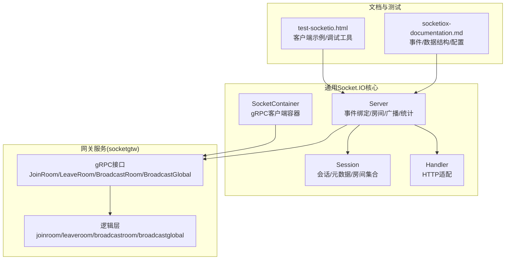
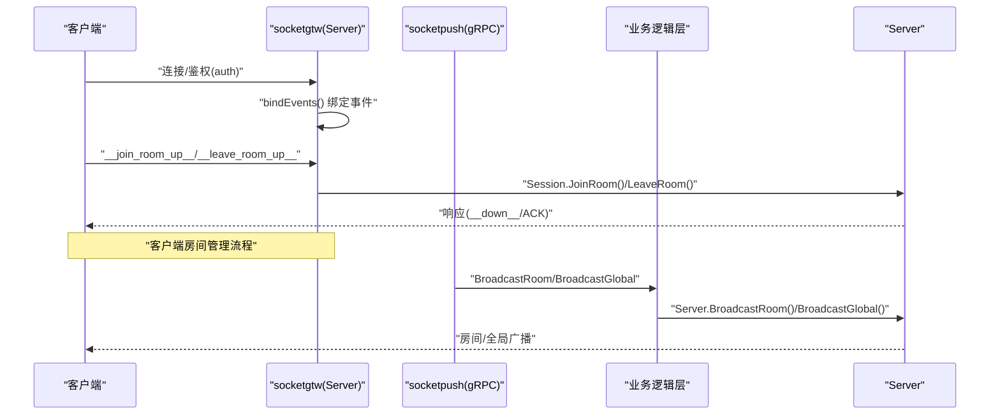
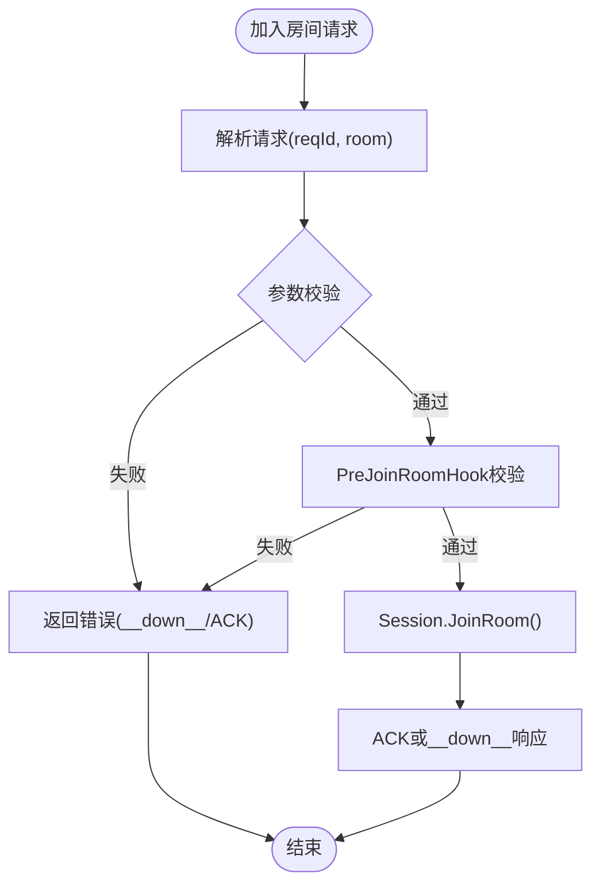
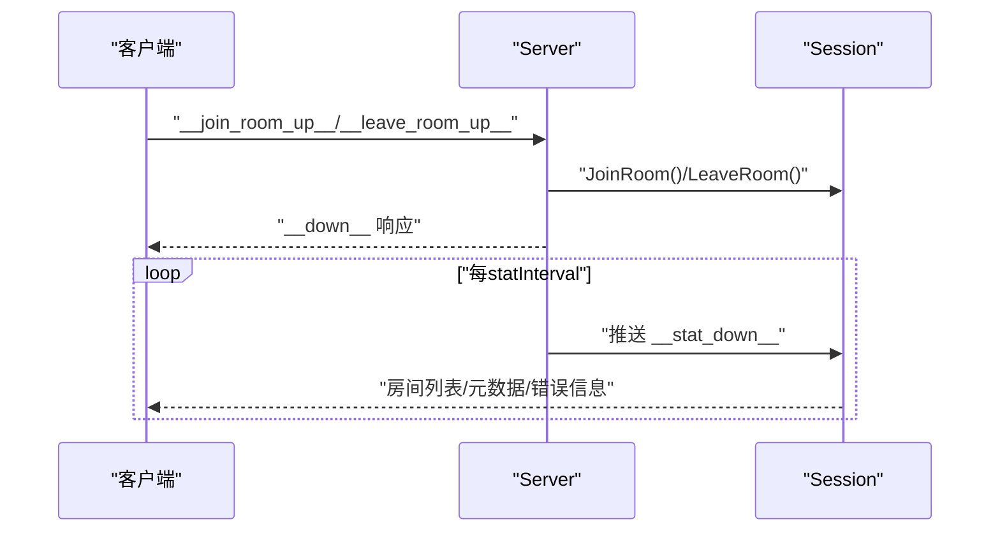
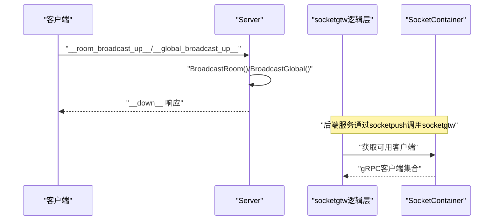
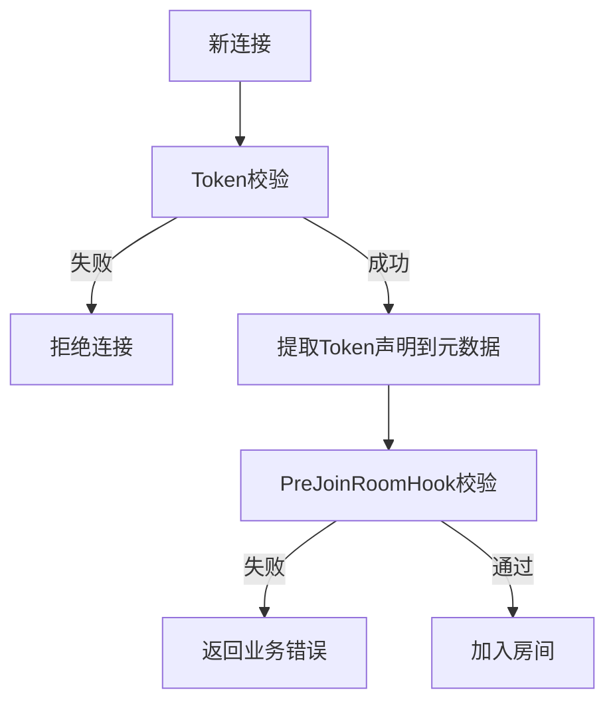
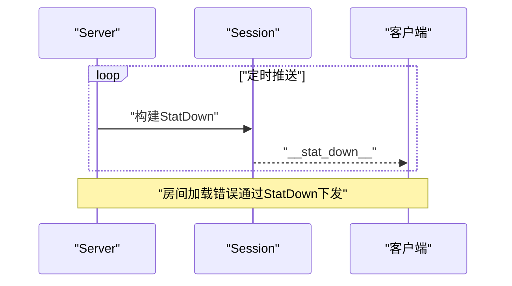
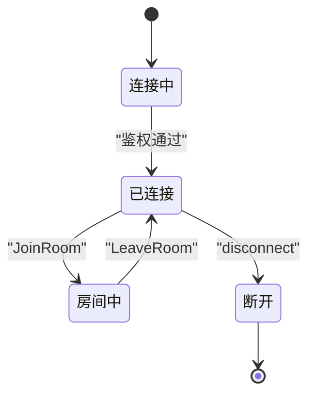
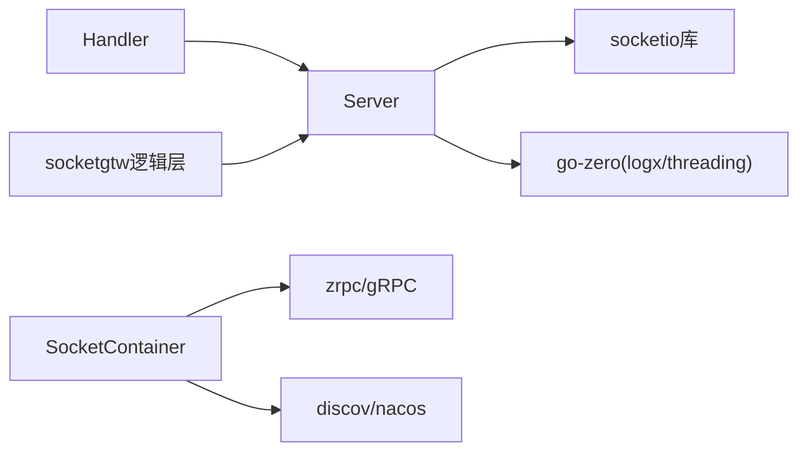

# 房间管理功能

<cite>
**本文档引用的文件**
- [server.go](file://common/socketiox/server.go)
- [container.go](file://common/socketiox/container.go)
- [handler.go](file://common/socketiox/handler.go)
- [socketiox-documentation.md](file://docs/socketiox-documentation.md)
- [broadcastroomlogic.go](file://socketapp/socketgtw/internal/logic/broadcastroomlogic.go)
- [broadcastgloballogic.go](file://socketapp/socketgtw/internal/logic/broadcastgloballogic.go)
- [joinroomlogic.go](file://socketapp/socketgtw/internal/logic/joinroomlogic.go)
- [leaveroomlogic.go](file://socketapp/socketgtw/internal/logic/leaveroomlogic.go)
- [socketgtw.pb.go](file://socketapp/socketgtw/socketgtw/socketgtw.pb.go)
- [test-socketio.html](file://common/socketiox/test-socketio.html)
</cite>

## 目录
1. [简介](#简介)
2. [项目结构](#项目结构)
3. [核心组件](#核心组件)
4. [架构总览](#架构总览)
5. [详细组件分析](#详细组件分析)
6. [依赖关系分析](#依赖关系分析)
7. [性能考虑](#性能考虑)
8. [故障排查指南](#故障排查指南)
9. [结论](#结论)
10. [附录](#附录)

## 简介
本文件系统性梳理了基于 Socket.IO 的房间管理功能，覆盖房间创建机制、成员管理、消息广播、权限控制、状态同步、生命周期管理以及实际应用场景与最佳实践。目标是帮助开发者快速理解并正确使用房间管理能力，构建稳定高效的实时通信应用。

## 项目结构
Socket.IO 房间管理功能主要分布在以下模块：
- 通用 Socket.IO 核心：负责连接、鉴权、事件绑定、房间加入/离开、广播、统计上报等
- 网关服务（socketgtw）：提供 gRPC 接口，供后端服务调用进行房间控制与消息广播
- 文档与测试：提供事件定义、数据结构、客户端示例与测试工具

图表来源
- [server.go:299-335](file://common/socketiox/server.go#L299-L335)
- [handler.go:19-41](file://common/socketiox/handler.go#L19-L41)
- [container.go:30-61](file://common/socketiox/container.go#L30-L61)
- [socketiox-documentation.md:1-656](file://docs/socketiox-documentation.md#L1-L656)
- [socketgtw.pb.go:76-200](file://socketapp/socketgtw/socketgtw/socketgtw.pb.go#L76-L200)

章节来源
- [server.go:1-814](file://common/socketiox/server.go#L1-L814)
- [handler.go:1-41](file://common/socketiox/handler.go#L1-L41)
- [container.go:1-426](file://common/socketiox/container.go#L1-L426)
- [socketiox-documentation.md:1-656](file://docs/socketiox-documentation.md#L1-L656)
- [socketgtw.pb.go:76-200](file://socketapp/socketgtw/socketgtw/socketgtw.pb.go#L76-L200)

## 核心组件
- Server：Socket.IO 服务端核心，负责连接鉴权、事件绑定、房间管理、广播、统计上报、会话清理
- Session：单个连接的会话抽象，维护房间集合、元数据、发送能力
- Handler：将 Socket.IO 适配为 HTTP 接口，便于嵌入现有 Web 服务
- SocketContainer：动态管理 gRPC 客户端，支持直连、Etcd、Nacos 等发现方式
- 网关逻辑层：提供 JoinRoom/LeaveRoom/BroadcastRoom/BroadcastGlobal 等 gRPC 接口的业务逻辑

章节来源
- [server.go:119-335](file://common/socketiox/server.go#L119-L335)
- [handler.go:19-41](file://common/socketiox/handler.go#L19-L41)
- [container.go:30-61](file://common/socketiox/container.go#L30-L61)
- [broadcastroomlogic.go:28-46](file://socketapp/socketgtw/internal/logic/broadcastroomlogic.go#L28-L46)
- [broadcastgloballogic.go:28-46](file://socketapp/socketgtw/internal/logic/broadcastgloballogic.go#L28-L46)
- [joinroomlogic.go:25-37](file://socketapp/socketgtw/internal/logic/joinroomlogic.go#L25-L37)
- [leaveroomlogic.go:25-37](file://socketapp/socketgtw/internal/logic/leaveroomlogic.go#L25-L37)

## 架构总览
Socket.IO 房间管理的整体架构分为三层：
- 客户端层：浏览器/移动端通过 WebSocket 连接 socketgtw，发送/接收消息
- 网关层：socketgtw 提供 gRPC 接口，后端服务通过 socketpush 调用
- 广播层：Server 负责房间内组播与全局广播，结合 SocketContainer 动态路由

图表来源
- [server.go:337-676](file://common/socketiox/server.go#L337-L676)
- [broadcastroomlogic.go:28-46](file://socketapp/socketgtw/internal/logic/broadcastroomlogic.go#L28-L46)
- [broadcastgloballogic.go:28-46](file://socketapp/socketgtw/internal/logic/broadcastgloballogic.go#L28-L46)

## 详细组件分析

### 房间创建与加入机制
- 房间创建：Socket.IO 本身按需创建房间；服务端通过 Session.JoinRoom() 将连接加入指定房间
- 房间ID生成：房间名由客户端/服务端约定，服务端不做强制生成；建议使用业务域+标识的命名规范
- 房间属性：通过会话元数据（Session.SetMetadata）存储与房间相关的上下文信息
- 权限控制：可通过 PreJoinRoomHook 在加入前执行业务校验，失败则返回业务错误码

图表来源
- [server.go:392-435](file://common/socketiox/server.go#L392-L435)
- [server.go:203-221](file://common/socketiox/server.go#L203-L221)

章节来源
- [server.go:203-221](file://common/socketiox/server.go#L203-L221)
- [server.go:392-435](file://common/socketiox/server.go#L392-L435)
- [server.go:254-293](file://common/socketiox/server.go#L254-L293)

### 成员管理与状态同步
- 成员加入/离开：通过 __join_room_up__/__leave_room_up__ 事件完成；服务端异步处理并返回响应
- 成员列表维护：Server 内部维护 sessions 映射；Session 维护房间集合；可通过统计事件 __stat_down__ 推送当前房间列表
- 状态同步：定时任务向每个会话推送 StatDown，包含 sId、rooms、nps、metadata、roomLoadError

图表来源
- [server.go:436-468](file://common/socketiox/server.go#L436-L468)
- [server.go:702-740](file://common/socketiox/server.go#L702-L740)

章节来源
- [server.go:436-468](file://common/socketiox/server.go#L436-L468)
- [server.go:702-740](file://common/socketiox/server.go#L702-L740)
- [server.go:119-197](file://common/socketiox/server.go#L119-L197)

### 消息广播机制
- 房间广播：客户端发送 __room_broadcast_up__，服务端调用 Server.BroadcastRoom()，内部使用 socketio.To(room).Emit(event, data)
- 全局广播：客户端发送 __global_broadcast_up__，服务端调用 Server.BroadcastGlobal()，内部使用 socketio.Emit(event, data)
- 负载均衡：SocketContainer 支持 Etcd/Nacos/直连三种发现方式，自动维护 gRPC 客户端集合，按需裁剪与更新

图表来源
- [server.go:532-619](file://common/socketiox/server.go#L532-L619)
- [server.go:678-700](file://common/socketiox/server.go#L678-L700)
- [container.go:83-130](file://common/socketiox/container.go#L83-L130)
- [container.go:156-242](file://common/socketiox/container.go#L156-L242)

章节来源
- [server.go:532-619](file://common/socketiox/server.go#L532-L619)
- [server.go:678-700](file://common/socketiox/server.go#L678-L700)
- [container.go:83-130](file://common/socketiox/container.go#L83-L130)
- [container.go:156-242](file://common/socketiox/container.go#L156-L242)

### 权限控制策略
- 访问权限验证：OnAuthentication 中可配置 TokenValidator/TokenValidatorWithClaims，支持基础校验与从 Token 提取元数据
- 加入前校验：PreJoinRoomHook 可对房间加入进行细粒度控制，如业务授权、黑名单检查等
- 会话元数据：通过 Token 声明注入 Session 元数据，支持按元数据寻址的推送与管理

图表来源
- [server.go:337-349](file://common/socketiox/server.go#L337-L349)
- [server.go:358-372](file://common/socketiox/server.go#L358-L372)
- [server.go:418-427](file://common/socketiox/server.go#L418-L427)

章节来源
- [server.go:246-293](file://common/socketiox/server.go#L246-L293)
- [server.go:337-372](file://common/socketiox/server.go#L337-L372)
- [server.go:418-427](file://common/socketiox/server.go#L418-L427)

### 房间状态同步与事件通知
- 统计事件：每 statInterval 推送一次 __stat_down__，包含房间列表、命名空间、元数据、房间加载错误
- 房间加载错误：ConnectHook 返回房间列表失败时，记录 roomLoadError 并通过 __stat_down__ 下发
- 事件通知：业务事件通过自定义事件名推送，客户端监听对应事件

图表来源
- [server.go:702-740](file://common/socketiox/server.go#L702-L740)
- [server.go:380-389](file://common/socketiox/server.go#L380-L389)

章节来源
- [server.go:702-740](file://common/socketiox/server.go#L702-L740)
- [socketiox-documentation.md:411-446](file://docs/socketiox-documentation.md#L411-L446)

### 房间生命周期管理
- 连接建立：OnConnection 创建 Session，可选 ConnectHook 初始化房间
- 异常断开：disconnect 事件触发清理，删除无效会话
- 会话查询：按元数据（如 userId/deviceId）查找会话，支持批量操作
- 服务端控制：gRPC 接口 JoinRoom/LeaveRoom 由后端服务调用，实现精确的房间控制

图表来源
- [server.go:350-391](file://common/socketiox/server.go#L350-L391)
- [server.go:620-641](file://common/socketiox/server.go#L620-L641)
- [joinroomlogic.go:25-37](file://socketapp/socketgtw/internal/logic/joinroomlogic.go#L25-L37)
- [leaveroomlogic.go:25-37](file://socketapp/socketgtw/internal/logic/leaveroomlogic.go#L25-L37)

章节来源
- [server.go:350-391](file://common/socketiox/server.go#L350-L391)
- [server.go:620-641](file://common/socketiox/server.go#L620-L641)
- [joinroomlogic.go:25-37](file://socketapp/socketgtw/internal/logic/joinroomlogic.go#L25-L37)
- [leaveroomlogic.go:25-37](file://socketapp/socketgtw/internal/logic/leaveroomlogic.go#L25-L37)

### 实际应用场景与最佳实践
- MQTT 桥接：不同 topic 映射到不同房间，实现设备/主题级别的精准推送
- 分组通知：按用户/设备/区域等维度划分房间，实现分组广播
- 事件映射：通过配置将特定主题映射到自定义事件名，简化前端处理
- 客户端示例：提供测试页面，演示房间加入/离开、广播、统计事件等

章节来源
- [socketiox-documentation.md:468-617](file://docs/socketiox-documentation.md#L468-L617)
- [test-socketio.html:866-890](file://common/socketiox/test-socketio.html#L866-L890)
- [test-socketio.html:1354-1393](file://common/socketiox/test-socketio.html#L1354-L1393)

## 依赖关系分析
- Server 依赖 socketio 库进行底层通信，依赖 go-zero 的日志与并发工具
- Handler 将 Server 适配为 HTTP 接口
- SocketContainer 依赖 go-zero 的服务发现与 gRPC 客户端封装
- 网关逻辑层依赖 Server 的广播与房间控制方法

图表来源
- [server.go:3-18](file://common/socketiox/server.go#L3-L18)
- [handler.go:3-6](file://common/socketiox/handler.go#L3-L6)
- [container.go:3-28](file://common/socketiox/container.go#L3-L28)

章节来源
- [server.go:3-18](file://common/socketiox/server.go#L3-L18)
- [handler.go:3-6](file://common/socketiox/handler.go#L3-L6)
- [container.go:3-28](file://common/socketiox/container.go#L3-L28)

## 性能考虑
- 异步处理：所有业务处理均在 goroutine 中异步执行，避免阻塞事件循环
- 广播路径：房间广播使用 socketio.To(room)，全局广播使用 socketio.Emit，减少不必要的遍历
- 统计频率：statInterval 控制统计事件推送频率，默认 1 分钟，可根据场景调整
- 客户端连接：SocketContainer 支持订阅服务实例变化，按子集大小裁剪连接池，降低抖动

章节来源
- [server.go:494-531](file://common/socketiox/server.go#L494-L531)
- [server.go:702-740](file://common/socketiox/server.go#L702-L740)
- [container.go:79-81](file://common/socketiox/container.go#L79-L81)
- [container.go:278-316](file://common/socketiox/container.go#L278-L316)

## 故障排查指南
- 房间加载错误：关注 __stat_down__ 中的 roomLoadError 字段，若存在错误可选择断连重连或提示用户
- 参数错误：客户端请求缺少 reqId/room/event/payload 等字段时，服务端返回 400 错误
- 业务错误：PreJoinRoomHook 或业务处理器返回错误时，服务端返回 500 错误
- 连接断开：disconnect 事件会触发清理流程，确认断开原因并检查网络与鉴权配置

章节来源
- [socketiox-documentation.md:411-446](file://docs/socketiox-documentation.md#L411-L446)
- [server.go:404-414](file://common/socketiox/server.go#L404-L414)
- [server.go:448-458](file://common/socketiox/server.go#L448-L458)
- [server.go:620-641](file://common/socketiox/server.go#L620-L641)

## 结论
该 Socket.IO 房间管理方案以 Server 为核心，结合 Session、Handler、SocketContainer 与 socketgtw 的 gRPC 接口，实现了从连接鉴权、房间控制、消息广播到状态同步与生命周期管理的完整闭环。通过事件与数据结构的标准化定义，既满足前端实时交互需求，也便于后端服务进行统一接入与扩展。

## 附录
- 事件与数据结构参考：见文档中的“核心事件体系”、“数据结构定义”
- 客户端示例：test-socketio.html 提供房间管理与广播的交互示例
- gRPC 接口：JoinRoom/LeaveRoom/BroadcastRoom/BroadcastGlobal 的请求/响应结构定义

章节来源
- [socketiox-documentation.md:144-330](file://docs/socketiox-documentation.md#L144-L330)
- [test-socketio.html:866-890](file://common/socketiox/test-socketio.html#L866-L890)
- [socketgtw.pb.go:76-200](file://socketapp/socketgtw/socketgtw/socketgtw.pb.go#L76-L200)