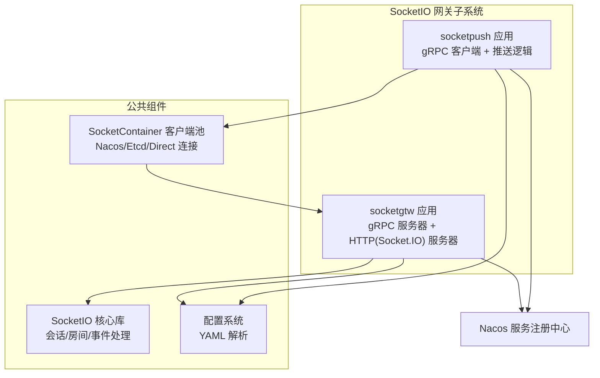
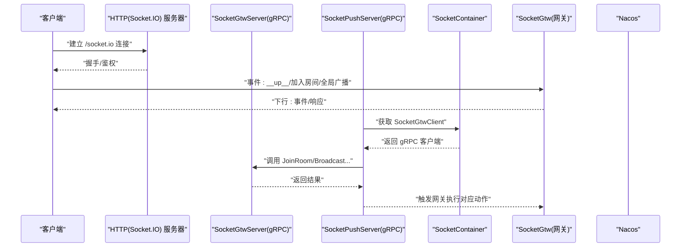
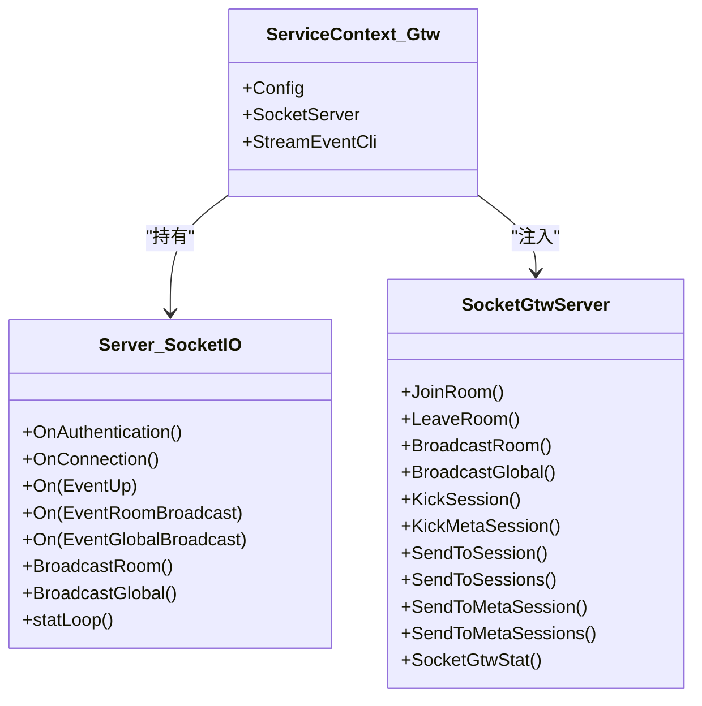
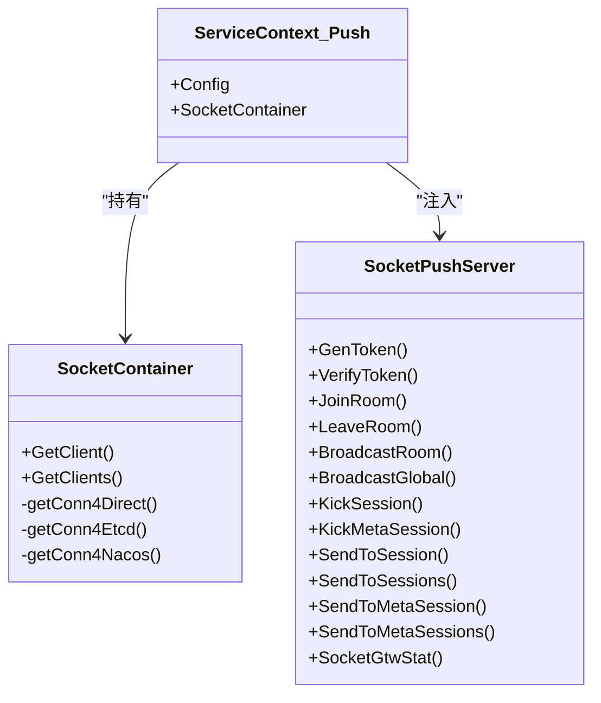
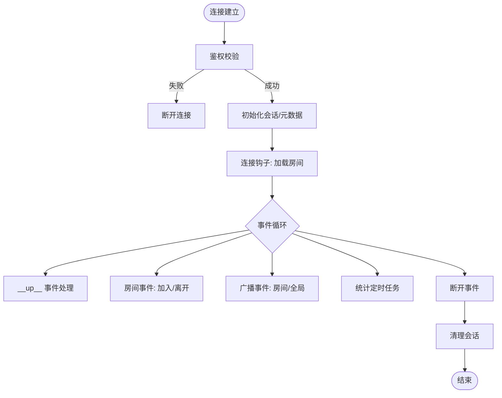
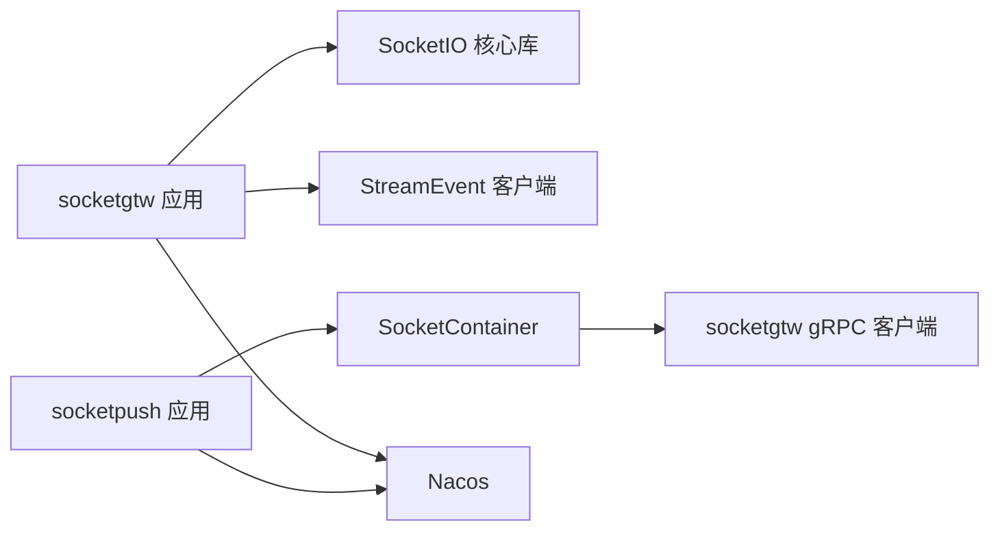

# 架构设计与核心组件

<cite>
**本文引用的文件**   
- [socketgtw.go](file://socketapp/socketgtw/socketgtw.go)
- [socketpush.go](file://socketapp/socketpush/socketpush.go)
- [config.go](file://socketapp/socketgtw/internal/config/config.go)
- [config.go](file://socketapp/socketpush/internal/config/config.go)
- [servicecontext.go](file://socketapp/socketgtw/internal/svc/servicecontext.go)
- [servicecontext.go](file://socketapp/socketpush/internal/svc/servicecontext.go)
- [socketgtwserver.go](file://socketapp/socketgtw/internal/server/socketgtwserver.go)
- [socketpushserver.go](file://socketapp/socketpush/internal/server/socketpushserver.go)
- [routes.go](file://socketapp/socketgtw/internal/handler/routes.go)
- [server.go](file://common/socketiox/server.go)
- [container.go](file://common/socketiox/container.go)
- [socketgtw.yaml](file://socketapp/socketgtw/etc/socketgtw.yaml)
- [socketpush.yaml](file://socketapp/socketpush/etc/socketpush.yaml)
</cite>

## 目录
1. [引言](#引言)
2. [项目结构](#项目结构)
3. [核心组件](#核心组件)
4. [架构总览](#架构总览)
5. [详细组件分析](#详细组件分析)
6. [依赖分析](#依赖分析)
7. [性能考虑](#性能考虑)
8. [故障排查指南](#故障排查指南)
9. [结论](#结论)
10. [附录](#附录)

## 引言
本技术文档聚焦于 SocketIO 网关服务的整体架构设计，系统采用“gRPC 服务器 + HTTP 服务器（Socket.IO）”双栈架构，结合服务上下文管理与依赖注入模式，实现高可用、可扩展的实时通信网关。文档将深入解析以下主题：
- 双栈架构：gRPC 提供跨服务控制面能力，HTTP+Socket.IO 提供实时数据面接入。
- 服务上下文管理：通过 ServiceContext 统一注入 SocketIO 服务、外部 RPC 客户端等资源。
- 配置管理系统：配置文件结构、参数解析与运行时可选的服务注册。
- 中间件链设计：HTTP 层的请求拦截器、Socket.IO 事件处理链与错误处理机制。
- 服务启动流程：初始化顺序、服务注册与健康检查联动。

## 项目结构
SocketIO 网关由两个子应用组成：
- socketgtw：SocketIO 网关服务，负责会话管理、房间管理、事件分发与状态统计，并通过 gRPC 对外暴露管理接口。
- socketpush：推送服务，负责生成/验证令牌、向 SocketIO 网关下发指令（如加入房间、广播、踢人等），并维护到 socketgtw 的客户端连接池。

图示来源
- [socketgtw.go:30-90](file://socketapp/socketgtw/socketgtw.go#L30-L90)
- [socketpush.go:27-69](file://socketapp/socketpush/socketpush.go#L27-L69)
- [server.go:314-335](file://common/socketiox/server.go#L314-L335)
- [container.go:35-61](file://common/socketiox/container.go#L35-L61)

章节来源
- [socketgtw.go:30-90](file://socketapp/socketgtw/socketgtw.go#L30-L90)
- [socketpush.go:27-69](file://socketapp/socketpush/socketpush.go#L27-L69)
- [socketgtw.yaml:1-37](file://socketapp/socketgtw/etc/socketgtw.yaml#L1-L37)
- [socketpush.yaml:1-28](file://socketapp/socketpush/etc/socketpush.yaml#L1-L28)

## 核心组件
- 双栈服务器
  - gRPC 服务器：提供管理接口（加入房间、离开房间、广播、踢人、统计等），用于被 socketpush 或其他内部服务调用。
  - HTTP + Socket.IO 服务器：对外提供 WebSocket 入口，承载实时事件与会话生命周期管理。
- 服务上下文 ServiceContext
  - socketgtw：持有 SocketIO 服务器、StreamEvent 客户端，负责鉴权、会话元数据注入、连接/断开钩子与房间预加入钩子。
  - socketpush：持有 SocketContainer，按需动态发现并维护到 socketgtw 的 gRPC 客户端连接。
- 配置系统
  - 支持 YAML 配置文件加载，包含日志、HTTP/gRPC 端口、JWT 密钥、Nacos 注册开关、SocketIO 元数据键集合、上游 StreamEvent 与 socketgtw 地址等。
- 中间件链
  - HTTP 层：在入口处对特定路径进行协议头修正，确保与 Socket.IO 协议兼容。
  - Socket.IO 层：事件处理链包含鉴权、参数校验、业务处理器、响应封装与错误回传。

章节来源
- [socketgtwserver.go:15-91](file://socketapp/socketgtw/internal/server/socketgtwserver.go#L15-L91)
- [socketpushserver.go:15-103](file://socketapp/socketpush/internal/server/socketpushserver.go#L15-L103)
- [servicecontext.go:18-134](file://socketapp/socketgtw/internal/svc/servicecontext.go#L18-L134)
- [servicecontext.go:8-19](file://socketapp/socketpush/internal/svc/servicecontext.go#L8-L19)
- [routes.go:11-24](file://socketapp/socketgtw/internal/handler/routes.go#L11-L24)
- [server.go:337-676](file://common/socketiox/server.go#L337-L676)

## 架构总览
下图展示 socketgtw 与 socketpush 的交互关系、Socket.IO 事件流以及与 Nacos 的集成。

图示来源
- [socketgtw.go:40-61](file://socketapp/socketgtw/socketgtw.go#L40-L61)
- [socketpush.go:37-43](file://socketapp/socketpush/socketpush.go#L37-L43)
- [container.go:35-61](file://common/socketiox/container.go#L35-L61)
- [server.go:337-676](file://common/socketiox/server.go#L337-L676)

## 详细组件分析

### 组件一：SocketIO 网关（socketgtw）
- 启动流程
  - 解析配置 → 构建 ServiceContext → 初始化 gRPC 服务器并注册 SocketGtwServer → 初始化 HTTP 服务器并挂载 Socket.IO 路由 → 可选注册到 Nacos → 启动服务组。
- 服务上下文
  - 创建 SocketIO 服务器，注入事件处理器、鉴权器、连接/断开钩子、房间预加入钩子；同时构建 StreamEvent 客户端以上报会话事件。
- 关键职责
  - 会话生命周期管理（连接/断开）、房间管理（加入/离开）、事件分发（房间/全局）、统计上报（每分钟）。
- 错误处理
  - 参数解析失败、处理器缺失、业务异常均通过统一响应结构返回，并在断开连接时清理无效会话。

图示来源
- [servicecontext.go:18-134](file://socketapp/socketgtw/internal/svc/servicecontext.go#L18-L134)
- [socketgtwserver.go:15-91](file://socketapp/socketgtw/internal/server/socketgtwserver.go#L15-L91)
- [server.go:299-335](file://common/socketiox/server.go#L299-L335)

章节来源
- [socketgtw.go:30-90](file://socketapp/socketgtw/socketgtw.go#L30-L90)
- [servicecontext.go:18-134](file://socketapp/socketgtw/internal/svc/servicecontext.go#L18-L134)
- [socketgtwserver.go:15-91](file://socketapp/socketgtw/internal/server/socketgtwserver.go#L15-L91)
- [server.go:337-676](file://common/socketiox/server.go#L337-L676)

### 组件二：推送服务（socketpush）
- 启动流程
  - 解析配置 → 构建 ServiceContext → 初始化 gRPC 服务器并注册 SocketPushServer → 可选注册到 Nacos → 启动服务。
- 服务上下文
  - 构建 SocketContainer，支持直连、Etcd 订阅、Nacos 订阅三种方式自动发现 socketgtw 实例并维护客户端连接池。
- 关键职责
  - 生成/验证 JWT 令牌；向 socketgtw 下发加入房间、离开房间、广播、踢人、查询统计等指令。

图示来源
- [servicecontext.go:8-19](file://socketapp/socketpush/internal/svc/servicecontext.go#L8-L19)
- [socketpushserver.go:15-103](file://socketapp/socketpush/internal/server/socketpushserver.go#L15-L103)
- [container.go:30-61](file://common/socketiox/container.go#L30-L61)

章节来源
- [socketpush.go:27-69](file://socketapp/socketpush/socketpush.go#L27-L69)
- [servicecontext.go:8-19](file://socketapp/socketpush/internal/svc/servicecontext.go#L8-L19)
- [socketpushserver.go:15-103](file://socketapp/socketpush/internal/server/socketpushserver.go#L15-L103)
- [container.go:35-61](file://common/socketiox/container.go#L35-L61)

### 组件三：SocketIO 核心库
- 事件模型
  - 上行事件：__up__、__room_broadcast_up__、__global_broadcast_up__、__join_room_up__、__leave_room_up__。
  - 下行事件：__down__、__stat_down__。
- 会话与房间
  - Session 封装 socket 连接、元数据、房间集合；提供 JoinRoom/LeaveRoom、EmitDown 等方法。
- 生命周期钩子
  - OnAuthentication、OnConnection、断开钩子、房间预加入钩子，便于对接外部服务（如 StreamEvent）。
- 广播与统计
  - 支持房间广播与全局广播；定时统计并下行会话状态。

图示来源
- [server.go:337-676](file://common/socketiox/server.go#L337-L676)
- [server.go:702-740](file://common/socketiox/server.go#L702-L740)

章节来源
- [server.go:20-83](file://common/socketiox/server.go#L20-L83)
- [server.go:337-676](file://common/socketiox/server.go#L337-L676)
- [server.go:702-740](file://common/socketiox/server.go#L702-L740)

### 组件四：配置管理系统
- 配置文件结构
  - socketgtw.yaml：名称、监听地址、HTTP 配置、日志、JWT（可选）、Nacos 注册、SocketIO 元数据键集合、StreamEvent gRPC 客户端配置。
  - socketpush.yaml：名称、监听地址、日志、JWT（含过期时间）、Nacos 注册、socketgtw gRPC 客户端配置。
- 参数解析
  - 使用 go-zero 配置加载器解析 YAML，映射到 Config 结构体字段。
- 运行时配置更新
  - 当前代码未显式实现热重载；可通过外部配置中心或重启容器实现变更生效。

章节来源
- [socketgtw.yaml:1-37](file://socketapp/socketgtw/etc/socketgtw.yaml#L1-L37)
- [socketpush.yaml:1-28](file://socketapp/socketpush/etc/socketpush.yaml#L1-L28)
- [config.go:8-27](file://socketapp/socketgtw/internal/config/config.go#L8-L27)
- [config.go:5-22](file://socketapp/socketpush/internal/config/config.go#L5-L22)

### 组件五：中间件链设计
- HTTP 层中间件
  - 在进入 Socket.IO 路由前，对特定路径修正 Connection 头，保证升级握手符合 Socket.IO 协议。
- gRPC 层中间件
  - 为服务端添加统一日志拦截器，增强可观测性。
- Socket.IO 事件链
  - 鉴权 → 参数校验 → 业务处理 → 成功/失败响应 → 断开清理。

章节来源
- [socketgtw.go:48-61](file://socketapp/socketgtw/socketgtw.go#L48-L61)
- [socketgtw.go:81-82](file://socketapp/socketgtw/socketgtw.go#L81-L82)
- [server.go:337-676](file://common/socketiox/server.go#L337-L676)

### 组件六：服务启动流程与健康检查
- 启动顺序
  - 解析配置 → 构建 ServiceContext → 初始化 gRPC 服务器 → 初始化 HTTP 服务器 → 注册到 Nacos（可选）→ 启动服务组。
- 健康检查机制
  - 开发/测试模式下启用 gRPC 反射，便于本地调试与健康探测；生产环境建议通过外部探针与 Nacos 健康检查配合。

章节来源
- [socketgtw.go:30-90](file://socketapp/socketgtw/socketgtw.go#L30-L90)
- [socketpush.go:27-69](file://socketapp/socketpush/socketpush.go#L27-L69)

## 依赖分析
- 组件耦合
  - socketgtw 依赖 SocketIO 核心库与 StreamEvent 客户端；socketpush 依赖 SocketContainer 与 socketgtw 客户端。
- 依赖注入
  - 通过 ServiceContext 将配置、SocketIO 服务器、RPC 客户端注入到各层（Server/Handler/Logic）。
- 外部依赖
  - Nacos 用于服务发现与注册；gRPC 用于跨服务通信；Socket.IO 用于实时事件传输。

图示来源
- [servicecontext.go:24-37](file://socketapp/socketgtw/internal/svc/servicecontext.go#L24-L37)
- [container.go:35-61](file://common/socketiox/container.go#L35-L61)
- [socketgtw.go:62-80](file://socketapp/socketgtw/socketgtw.go#L62-L80)
- [socketpush.go:44-62](file://socketapp/socketpush/socketpush.go#L44-L62)

章节来源
- [servicecontext.go:24-37](file://socketapp/socketgtw/internal/svc/servicecontext.go#L24-L37)
- [container.go:35-61](file://common/socketiox/container.go#L35-L61)
- [socketgtw.go:62-80](file://socketapp/socketgtw/socketgtw.go#L62-L80)
- [socketpush.go:44-62](file://socketapp/socketpush/socketpush.go#L44-L62)

## 性能考虑
- 事件处理并发
  - 事件回调使用安全协程处理，避免阻塞主循环。
- 广播与统计
  - 房间/全局广播基于底层库实现；统计任务按固定周期触发，注意会话数量增长带来的下行压力。
- gRPC 负载
  - SocketContainer 支持 Nacos/Etcd/Direct 三种发现方式，建议在大规模部署中优先使用 Nacos/Etcd 以获得更优的负载均衡与弹性伸缩。
- 日志与可观测性
  - 全局日志字段包含应用名与会话 ID，便于问题定位与性能分析。

## 故障排查指南
- 连接失败
  - 检查 Socket.IO 握手路径与头部修正是否正确；确认鉴权密钥配置与客户端一致。
- 事件处理异常
  - 查看事件处理链中的参数校验与业务处理器日志；关注统一响应码与消息。
- 服务发现异常
  - 若使用 Nacos/Etcd，检查目标地址、命名空间、服务名与集群参数；确认实例健康状态与 gRPC 端口元数据。
- gRPC 调用失败
  - 检查 socketpush 到 socketgtw 的客户端连接池是否正常；查看 Nacos 订阅回调与实例拉取日志。

章节来源
- [server.go:337-676](file://common/socketiox/server.go#L337-L676)
- [container.go:206-242](file://common/socketiox/container.go#L206-L242)
- [socketpushserver.go:15-103](file://socketapp/socketpush/internal/server/socketpushserver.go#L15-L103)

## 结论
该 SocketIO 网关服务通过“gRPC 控制面 + HTTP+Socket.IO 数据面”的双栈架构，实现了高内聚、低耦合的实时通信网关。借助 ServiceContext 的依赖注入模式与 SocketIO 核心库的事件链设计，系统具备良好的扩展性与可维护性。结合 Nacos 的服务发现与注册，能够满足生产环境下的弹性与可观测性需求。后续可在配置热重载、限流与熔断等方面进一步完善。

## 附录
- 配置文件示例路径
  - [socketgtw.yaml:1-37](file://socketapp/socketgtw/etc/socketgtw.yaml#L1-L37)
  - [socketpush.yaml:1-28](file://socketapp/socketpush/etc/socketpush.yaml#L1-L28)
- 关键实现参考
  - [socketgtw.go:30-90](file://socketapp/socketgtw/socketgtw.go#L30-L90)
  - [socketpush.go:27-69](file://socketapp/socketpush/socketpush.go#L27-L69)
  - [server.go:314-335](file://common/socketiox/server.go#L314-L335)
  - [container.go:35-61](file://common/socketiox/container.go#L35-L61)