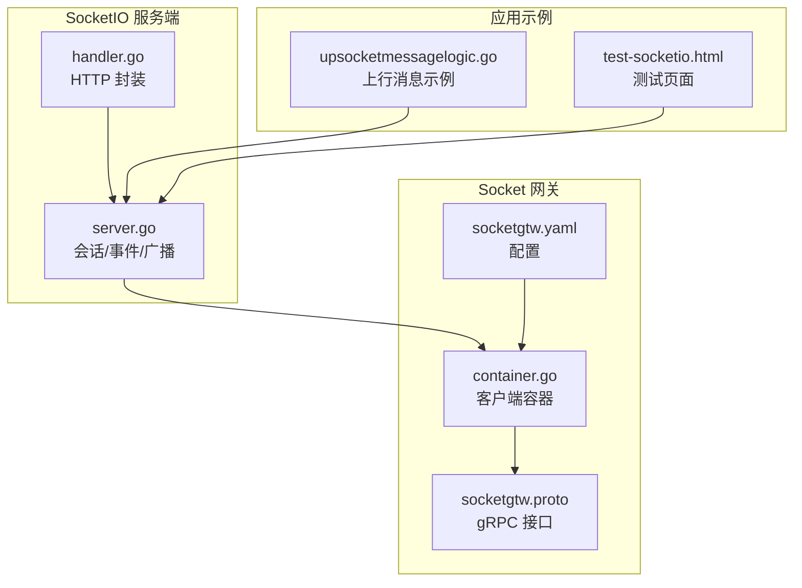
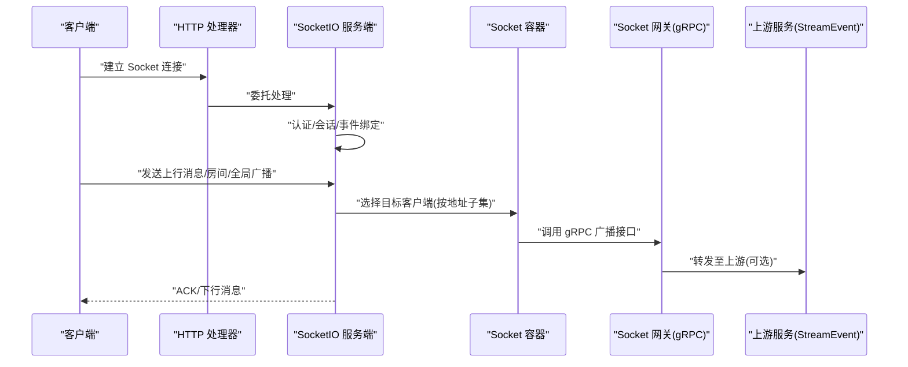
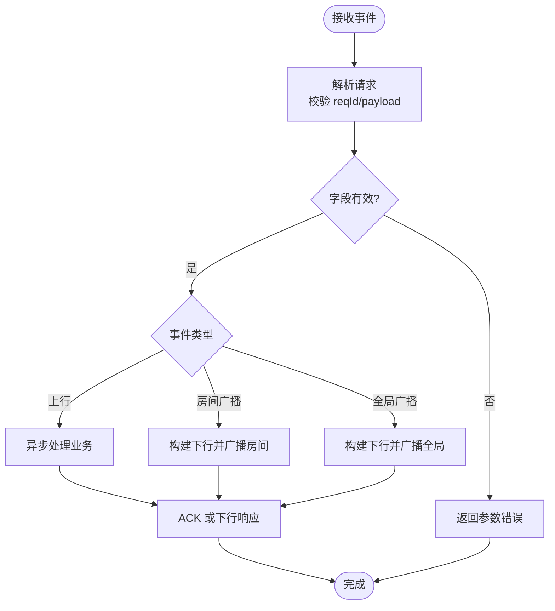
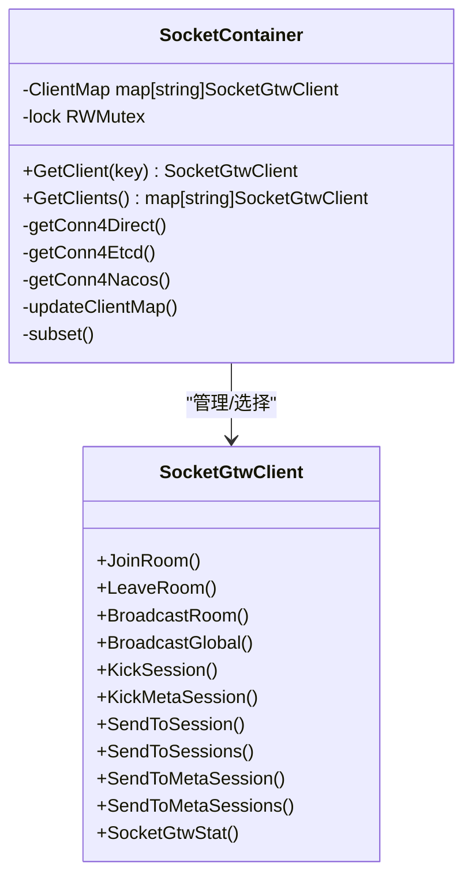
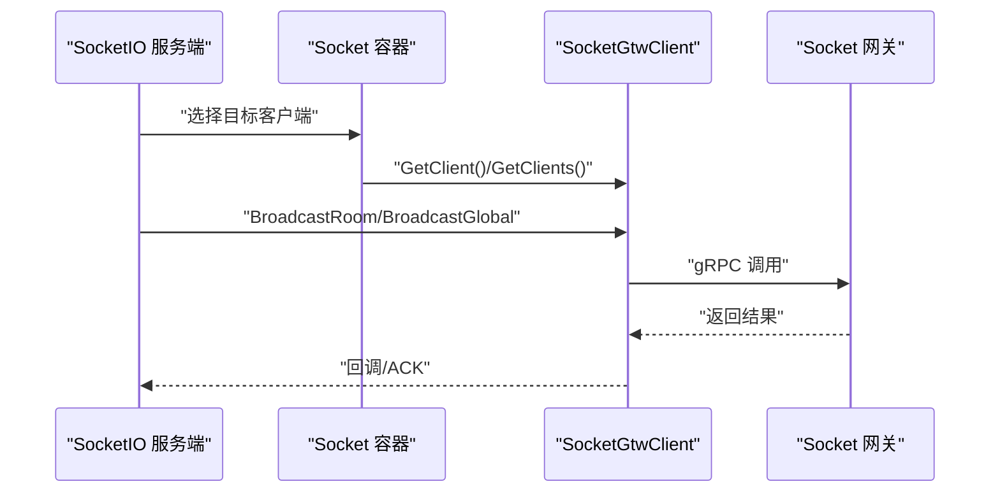
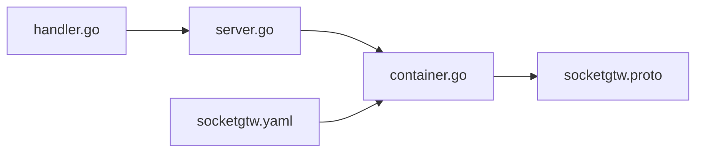

# 消息路由与处理

<cite>
**本文引用的文件**
- [common/socketiox/server.go](file://common/socketiox/server.go)
- [common/socketiox/handler.go](file://common/socketiox/handler.go)
- [common/socketiox/container.go](file://common/socketiox/container.go)
- [socketapp/socketgtw/socketgtw.proto](file://socketapp/socketgtw/socketgtw.proto)
- [socketapp/socketgtw/etc/socketgtw.yaml](file://socketapp/socketgtw/etc/socketgtw.yaml)
- [facade/streamevent/internal/logic/upsocketmessagelogic.go](file://facade/streamevent/internal/logic/upsocketmessagelogic.go)
- [common/socketiox/test-socketio.html](file://common/socketiox/test-socketio.html)
</cite>

## 目录
1. [简介](#简介)
2. [项目结构](#项目结构)
3. [核心组件](#核心组件)
4. [架构总览](#架构总览)
5. [详细组件分析](#详细组件分析)
6. [依赖分析](#依赖分析)
7. [性能考虑](#性能考虑)
8. [故障排查指南](#故障排查指南)
9. [结论](#结论)
10. [附录](#附录)

## 简介
本文件围绕 SocketIO 消息路由与处理机制，系统性梳理消息类型识别、目标地址解析、路由决策、分发策略（单播、组播、广播）、消息队列与异步处理、消息过滤与转换、可靠性保障（确认、重传、错误处理）、性能优化（批量、压缩、并发控制），并结合实际应用场景与调试技巧，帮助读者快速理解并高效使用该能力。

## 项目结构
本项目中与 SocketIO 路由与处理相关的核心模块分布如下：
- 通用 SocketIO 服务端与会话管理：common/socketiox/server.go
- SocketIO HTTP 处理器封装：common/socketiox/handler.go
- SocketIO 服务端容器与客户端连接管理：common/socketiox/container.go
- Socket 网关 gRPC 接口定义：socketapp/socketgtw/socketgtw.proto
- Socket 网关服务配置：socketapp/socketgtw/etc/socketgtw.yaml
- 上行 Socket 消息示例逻辑：facade/streamevent/internal/logic/upsocketmessagelogic.go
- SocketIO 测试页面：common/socketiox/test-socketio.html

图表来源
- [common/socketiox/server.go:1-814](file://common/socketiox/server.go#L1-L814)
- [common/socketiox/handler.go:1-41](file://common/socketiox/handler.go#L1-L41)
- [common/socketiox/container.go:1-426](file://common/socketiox/container.go#L1-L426)
- [socketapp/socketgtw/socketgtw.proto:1-149](file://socketapp/socketgtw/socketgtw.proto#L1-L149)
- [socketapp/socketgtw/etc/socketgtw.yaml:1-37](file://socketapp/socketgtw/etc/socketgtw.yaml#L1-L37)
- [facade/streamevent/internal/logic/upsocketmessagelogic.go:1-56](file://facade/streamevent/internal/logic/upsocketmessagelogic.go#L1-L56)
- [common/socketiox/test-socketio.html:1-800](file://common/socketiox/test-socketio.html#L1-L800)

章节来源
- [common/socketiox/server.go:1-814](file://common/socketiox/server.go#L1-L814)
- [common/socketiox/handler.go:1-41](file://common/socketiox/handler.go#L1-L41)
- [common/socketiox/container.go:1-426](file://common/socketiox/container.go#L1-L426)
- [socketapp/socketgtw/socketgtw.proto:1-149](file://socketapp/socketgtw/socketgtw.proto#L1-L149)
- [socketapp/socketgtw/etc/socketgtw.yaml:1-37](file://socketapp/socketgtw/etc/socketgtw.yaml#L1-L37)
- [facade/streamevent/internal/logic/upsocketmessagelogic.go:1-56](file://facade/streamevent/internal/logic/upsocketmessagelogic.go#L1-L56)
- [common/socketiox/test-socketio.html:1-800](file://common/socketiox/test-socketio.html#L1-L800)

## 核心组件
- SocketIO 服务端与会话管理：负责连接认证、事件绑定、消息解析、ACK 回执、房间管理、广播分发、统计上报等。
- SocketIO HTTP 处理器：将 SocketIO 服务端封装为 HTTP 处理函数，便于集成到现有 Web 框架。
- Socket 网关客户端容器：支持直连、Etcd 与 Nacos 三种发现方式，动态维护 gRPC 客户端集合，按地址子集进行负载均衡。
- Socket 网关 gRPC 接口：定义房间广播、全局广播、按会话/元数据广播、会话踢出、统计查询等 RPC。
- 配置与示例：通过 YAML 配置 Socket 网关监听、日志、注册中心与上游 StreamEvent 的连接；提供上行消息示例与测试页面。

章节来源
- [common/socketiox/server.go:1-814](file://common/socketiox/server.go#L1-L814)
- [common/socketiox/handler.go:1-41](file://common/socketiox/handler.go#L1-L41)
- [common/socketiox/container.go:1-426](file://common/socketiox/container.go#L1-L426)
- [socketapp/socketgtw/socketgtw.proto:1-149](file://socketapp/socketgtw/socketgtw.proto#L1-L149)
- [socketapp/socketgtw/etc/socketgtw.yaml:1-37](file://socketapp/socketgtw/etc/socketgtw.yaml#L1-L37)
- [facade/streamevent/internal/logic/upsocketmessagelogic.go:1-56](file://facade/streamevent/internal/logic/upsocketmessagelogic.go#L1-L56)

## 架构总览
下图展示从客户端到 SocketIO 服务端，再到 Socket 网关 gRPC 的完整链路与职责分工：

图表来源
- [common/socketiox/handler.go:19-41](file://common/socketiox/handler.go#L19-L41)
- [common/socketiox/server.go:337-676](file://common/socketiox/server.go#L337-L676)
- [common/socketiox/container.go:83-154](file://common/socketiox/container.go#L83-L154)
- [socketapp/socketgtw/socketgtw.proto:9-32](file://socketapp/socketgtw/socketgtw.proto#L9-L32)

## 详细组件分析

### SocketIO 服务端与消息路由
- 事件模型与消息结构
  - 上行请求结构包含 reqId、payload、可选 room、event 字段，用于区分业务事件与系统事件。
  - 下行消息结构包含 event、payload、reqId，用于回传 ACK 或推送结果。
  - 统计下行事件用于周期性上报会话状态。
- 事件绑定与处理流程
  - 连接事件：建立会话，执行连接钩子，加载房间并设置元数据。
  - 房间事件：加入/离开房间，支持预加入钩子校验。
  - 上行事件：解析请求、校验必填字段、异步处理、ACK 回执或下行响应。
  - 广播事件：房间广播与全局广播，均进行事件名合法性检查与去重保护。
- 会话管理
  - 元数据存储：基于字符串键值，仅接受非空字符串，避免污染。
  - 房间管理：幂等加入/离开，支持按元数据键值检索会话。
  - 统计上报：定时向每个会话发送统计事件，包含房间列表、网络指标与元数据。

图表来源
- [common/socketiox/server.go:469-619](file://common/socketiox/server.go#L469-L619)
- [common/socketiox/server.go:678-700](file://common/socketiox/server.go#L678-L700)

章节来源
- [common/socketiox/server.go:41-93](file://common/socketiox/server.go#L41-L93)
- [common/socketiox/server.go:337-676](file://common/socketiox/server.go#L337-L676)
- [common/socketiox/server.go:678-740](file://common/socketiox/server.go#L678-L740)

### SocketIO HTTP 处理器
- 将 SocketIO 服务端封装为标准 HTTP 处理函数，简化接入与部署。
- 通过选项注入服务端实例，运行时校验必填。

章节来源
- [common/socketiox/handler.go:19-41](file://common/socketiox/handler.go#L19-L41)

### Socket 网关客户端容器与发现
- 支持三种连接模式：
  - 直连：固定 endpoints 列表，逐个建立 gRPC 客户端。
  - Etcd：订阅键值变化，动态增删客户端，按子集采样减少内存占用。
  - Nacos：解析 nacos://URL，订阅服务实例，定期拉取健康实例列表，更新客户端集合。
- 地址子集策略：随机打乱后截取固定大小子集，降低大规模场景下的连接与调度成本。
- gRPC 选项：设置最大消息尺寸，避免超大消息导致的传输失败。

图表来源
- [common/socketiox/container.go:30-61](file://common/socketiox/container.go#L30-L61)
- [common/socketiox/container.go:83-154](file://common/socketiox/container.go#L83-L154)
- [common/socketiox/container.go:156-242](file://common/socketiox/container.go#L156-L242)
- [common/socketiox/container.go:267-316](file://common/socketiox/container.go#L267-L316)
- [common/socketiox/container.go:348-356](file://common/socketiox/container.go#L348-L356)

章节来源
- [common/socketiox/container.go:30-61](file://common/socketiox/container.go#L30-L61)
- [common/socketiox/container.go:83-154](file://common/socketiox/container.go#L83-L154)
- [common/socketiox/container.go:156-242](file://common/socketiox/container.go#L156-L242)
- [common/socketiox/container.go:267-316](file://common/socketiox/container.go#L267-L316)
- [common/socketiox/container.go:348-356](file://common/socketiox/container.go#L348-L356)

### Socket 网关 gRPC 接口与分发策略
- 分发策略
  - 单播：按会话 ID 或元数据键值匹配，精准投递。
  - 组播：按房间名广播，适用于设备分组、用户群组等场景。
  - 广播：向所有在线前端广播，适用于全局通知。
- 关键 RPC
  - JoinRoom/LeaveRoom：房间生命周期管理。
  - BroadcastRoom/BroadcastGlobal：组播/广播。
  - SendToSession/SendToSessions：单播/批量单播。
  - SendToMetaSession/SendToMetaSessions：按元数据单播/批量单播。
  - KickSession/KickMetaSession：会话剔除。
  - SocketGtwStat：统计查询。

图表来源
- [common/socketiox/server.go:678-700](file://common/socketiox/server.go#L678-L700)
- [common/socketiox/container.go:63-77](file://common/socketiox/container.go#L63-L77)
- [socketapp/socketgtw/socketgtw.proto:9-32](file://socketapp/socketgtw/socketgtw.proto#L9-L32)

章节来源
- [socketapp/socketgtw/socketgtw.proto:9-32](file://socketapp/socketgtw/socketgtw.proto#L9-L32)
- [socketapp/socketgtw/etc/socketgtw.yaml:21-37](file://socketapp/socketgtw/etc/socketgtw.yaml#L21-L37)

### 消息过滤与转换
- 消息格式转换
  - 上行请求 payload 支持任意 JSON 结构，服务端在处理前进行解析与校验。
  - 下行 payload 支持原生 JSON 与字符串，确保客户端兼容性。
- 内容过滤
  - 事件名白名单：禁止使用系统保留事件名作为业务事件。
  - 参数校验：reqId、payload、room、event 等字段必填校验。
- 协议适配
  - 通过 gRPC 接口适配不同下游协议（如 WebSocket、MQTT、Kafka 等），在 Socket 网关层统一编解码。

章节来源
- [common/socketiox/server.go:482-520](file://common/socketiox/server.go#L482-L520)
- [common/socketiox/server.go:545-574](file://common/socketiox/server.go#L545-L574)
- [common/socketiox/server.go:589-618](file://common/socketiox/server.go#L589-L618)

### 可靠性保障
- 确认与回执
  - 事件处理支持 ACK 回执，若客户端提供 Ack，则优先通过 Ack 返回；否则通过下行事件回传。
- 错误处理
  - 参数解析失败、业务处理异常、未配置处理器等情况均返回标准化错误响应。
- 断线清理
  - disconnect 事件触发时，执行断开钩子并清理无效会话，防止资源泄露。

章节来源
- [common/socketiox/server.go:111-117](file://common/socketiox/server.go#L111-L117)
- [common/socketiox/server.go:496-529](file://common/socketiox/server.go#L496-L529)
- [common/socketiox/server.go:620-641](file://common/socketiox/server.go#L620-L641)

### 性能优化
- 异步处理
  - 使用安全协程处理事件，避免阻塞主循环。
- 并发控制
  - 容器按地址子集采样，限制同时维护的客户端数量，降低内存与 CPU 压力。
- 批量处理
  - 提供批量单播与批量按元数据单播 RPC，减少多次调用开销。
- 最大消息尺寸
  - gRPC 默认调用选项设置最大发送/接收消息尺寸，避免超大消息导致失败。

章节来源
- [common/socketiox/server.go:494-530](file://common/socketiox/server.go#L494-L530)
- [common/socketiox/container.go:113-118](file://common/socketiox/container.go#L113-L118)
- [common/socketiox/container.go:302-307](file://common/socketiox/container.go#L302-L307)
- [socketapp/socketgtw/socketgtw.proto:110-119](file://socketapp/socketgtw/socketgtw.proto#L110-L119)
- [socketapp/socketgtw/socketgtw.proto:133-142](file://socketapp/socketgtw/socketgtw.proto#L133-L142)

### 实际应用场景与调试技巧
- 应用场景
  - 设备/用户分组广播：房间广播适合设备分组、用户群组通知。
  - 全局公告：全局广播用于系统级通知。
  - 单播与按元数据单播：用于精准推送与个性化消息。
- 调试技巧
  - 使用测试页面快速验证连接、加入房间、发送消息与接收下行。
  - 查看统计事件，核对房间列表、网络指标与元数据。
  - 检查日志级别与输出路径，定位认证失败、参数错误、处理异常等问题。

章节来源
- [facade/streamevent/internal/logic/upsocketmessagelogic.go:28-56](file://facade/streamevent/internal/logic/upsocketmessagelogic.go#L28-L56)
- [common/socketiox/test-socketio.html:866-890](file://common/socketiox/test-socketio.html#L866-L890)
- [common/socketiox/server.go:724-735](file://common/socketiox/server.go#L724-L735)

## 依赖分析
- 组件耦合
  - HTTP 处理器依赖 SocketIO 服务端；服务端依赖容器以选择目标客户端；容器依赖 Socket 网关 gRPC 接口。
- 外部依赖
  - Nacos/Etcd 用于服务发现；gRPC 用于跨进程通信；JSON 编解码用于消息序列化。
- 潜在风险
  - 服务发现配置错误会导致客户端集合为空，需监控容器日志与统计事件。
  - gRPC 最大消息尺寸过小可能导致大包失败，需根据业务调整。

图表来源
- [common/socketiox/handler.go:19-41](file://common/socketiox/handler.go#L19-L41)
- [common/socketiox/server.go:337-676](file://common/socketiox/server.go#L337-L676)
- [common/socketiox/container.go:83-154](file://common/socketiox/container.go#L83-L154)
- [socketapp/socketgtw/socketgtw.proto:9-32](file://socketapp/socketgtw/socketgtw.proto#L9-L32)
- [socketapp/socketgtw/etc/socketgtw.yaml:21-37](file://socketapp/socketgtw/etc/socketgtw.yaml#L21-L37)

章节来源
- [common/socketiox/handler.go:19-41](file://common/socketiox/handler.go#L19-L41)
- [common/socketiox/server.go:337-676](file://common/socketiox/server.go#L337-L676)
- [common/socketiox/container.go:83-154](file://common/socketiox/container.go#L83-L154)
- [socketapp/socketgtw/socketgtw.proto:9-32](file://socketapp/socketgtw/socketgtw.proto#L9-L32)
- [socketapp/socketgtw/etc/socketgtw.yaml:21-37](file://socketapp/socketgtw/etc/socketgtw.yaml#L21-L37)

## 性能考虑
- 并发与限流
  - 使用安全协程处理事件，避免阻塞；在高并发场景建议配合工作池或任务调度器。
- 连接与发现
  - 地址子集策略降低连接数；Nacos/Etcd 订阅与定时刷新平衡实时性与开销。
- 消息尺寸
  - 合理设置 gRPC 最大消息尺寸，避免频繁失败与重试。
- 批量与压缩
  - 对于大体量消息，建议在应用层进行聚合与压缩，减少网络往返与带宽占用。

## 故障排查指南
- 连接与认证
  - 检查握手参数中的 token 是否正确；查看认证钩子日志。
- 参数与解析
  - 确认 reqId、payload、room、event 等字段是否齐全；查看解析失败日志。
- 广播与分发
  - 核对事件名是否为系统保留名；检查房间是否存在；确认客户端是否在线。
- 服务发现
  - 检查 Nacos/Etcd 配置与实例健康状态；关注容器更新日志。
- gRPC 调用
  - 查看最大消息尺寸设置；确认 Socket 网关监听端口与上游可达性。

章节来源
- [common/socketiox/server.go:338-349](file://common/socketiox/server.go#L338-L349)
- [common/socketiox/server.go:398-414](file://common/socketiox/server.go#L398-L414)
- [common/socketiox/server.go:506-529](file://common/socketiox/server.go#L506-L529)
- [common/socketiox/container.go:156-242](file://common/socketiox/container.go#L156-L242)
- [socketapp/socketgtw/etc/socketgtw.yaml:21-37](file://socketapp/socketgtw/etc/socketgtw.yaml#L21-L37)

## 结论
该 SocketIO 消息路由与处理机制通过清晰的事件模型、灵活的分发策略、完善的可靠性保障与性能优化手段，实现了从客户端到网关的高效消息通路。结合服务发现与 gRPC 接口，能够稳定支撑多场景的广播与单播需求。建议在生产环境中重点关注服务发现配置、消息尺寸与并发控制，并利用测试页面与统计事件进行持续观测与优化。

## 附录
- 上行 Socket 示例逻辑展示了如何构造下行 payload 并返回给客户端。
- 测试页面提供了连接、房间管理与消息发送的可视化入口，便于快速验证。

章节来源
- [facade/streamevent/internal/logic/upsocketmessagelogic.go:28-56](file://facade/streamevent/internal/logic/upsocketmessagelogic.go#L28-L56)
- [common/socketiox/test-socketio.html:866-890](file://common/socketiox/test-socketio.html#L866-L890)