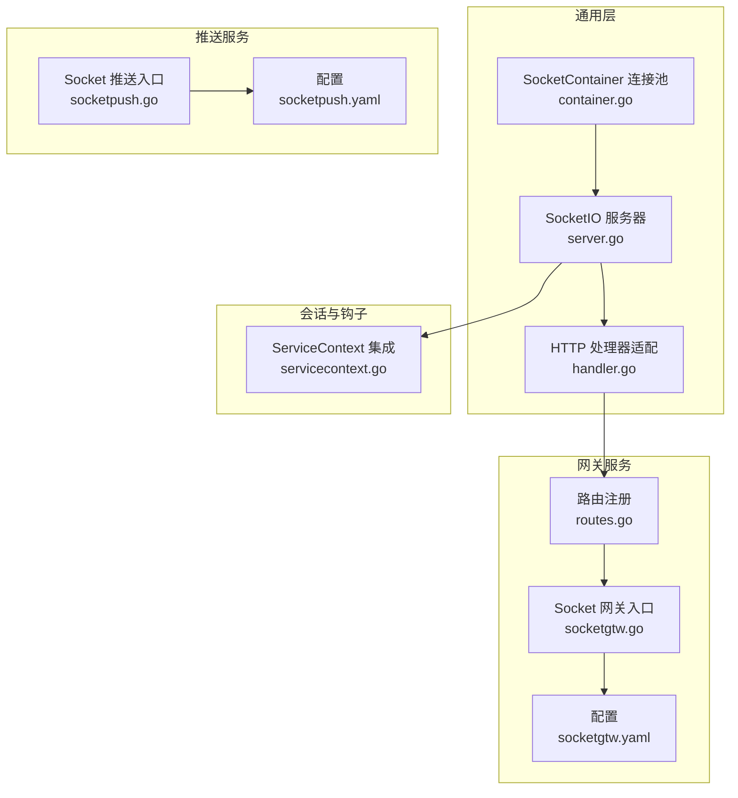
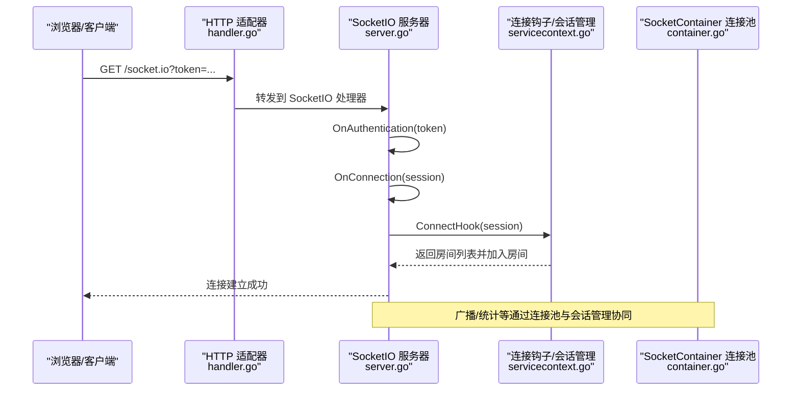
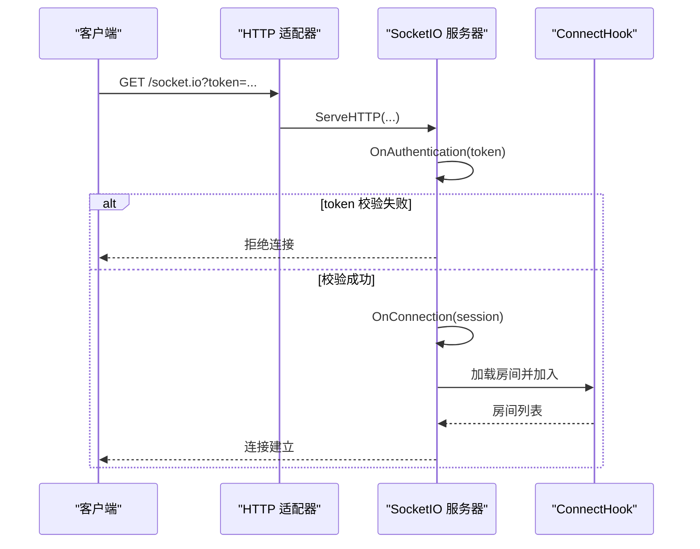
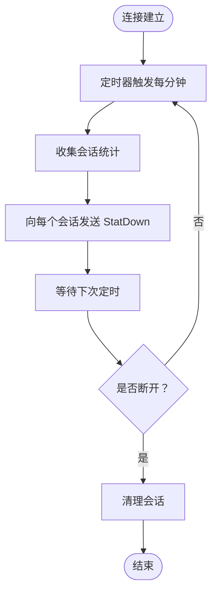
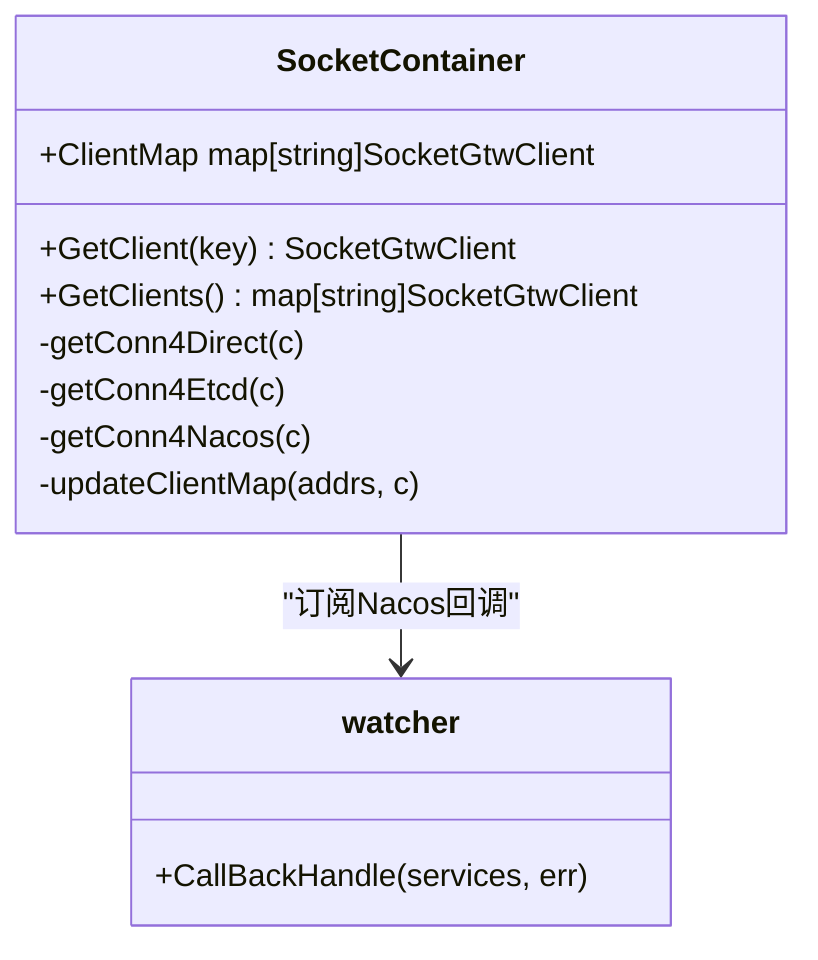
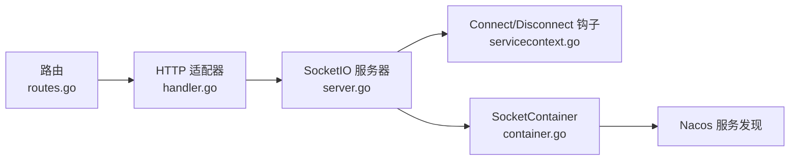

# 连接管理机制

<cite>
**本文引用的文件**
- [server.go](file://common/socketiox/server.go)
- [container.go](file://common/socketiox/container.go)
- [handler.go](file://common/socketiox/handler.go)
- [routes.go](file://socketapp/socketgtw/internal/handler/routes.go)
- [socketgtw.go](file://socketapp/socketgtw/socketgtw.go)
- [socketpush.go](file://socketapp/socketpush/socketpush.go)
- [socketgtw.yaml](file://socketapp/socketgtw/etc/socketgtw.yaml)
- [socketpush.yaml](file://socketapp/socketpush/etc/socketpush.yaml)
- [servicecontext.go](file://socketapp/socketgtw/internal/svc/servicecontext.go)
- [test-socketio.html](file://common/socketiox/test-socketio.html)
</cite>

## 目录
1. [引言](#引言)
2. [项目结构](#项目结构)
3. [核心组件](#核心组件)
4. [架构总览](#架构总览)
5. [详细组件分析](#详细组件分析)
6. [依赖关系分析](#依赖关系分析)
7. [性能考量](#性能考量)
8. [故障排查指南](#故障排查指南)
9. [结论](#结论)
10. [附录](#附录)

## 引言
本技术文档聚焦于基于 go-zero 与 socket.io 的连接管理机制，系统性阐述连接建立流程（握手协议、认证机制、连接参数校验）、心跳检测与断线检测、断线重连策略、连接池管理、连接状态与会话管理、连接生命周期最佳实践以及可操作的配置参数说明。文档以代码为依据，结合图示帮助读者快速理解与落地实施。

## 项目结构
围绕 SocketIO 的连接管理，主要涉及以下模块：
- 通用 SocketIO 服务端与会话管理：common/socketiox
- Socket 网关服务：socketapp/socketgtw
- Socket 推送服务：socketapp/socketpush
- 配置文件：socketapp/*/etc/*.yaml
- 示例页面：common/socketiox/test-socketio.html



图表来源
- [server.go:314-335](file://common/socketiox/server.go#L314-L335)
- [container.go:35-61](file://common/socketiox/container.go#L35-L61)
- [handler.go:19-40](file://common/socketiox/handler.go#L19-L40)
- [routes.go:11-24](file://socketapp/socketgtw/internal/handler/routes.go#L11-L24)
- [socketgtw.go:30-90](file://socketapp/socketgtw/socketgtw.go#L30-L90)
- [socketpush.go:27-70](file://socketapp/socketpush/socketpush.go#L27-L70)
- [socketgtw.yaml:1-37](file://socketapp/socketgtw/etc/socketgtw.yaml#L1-L37)
- [socketpush.yaml:1-28](file://socketapp/socketpush/etc/socketpush.yaml#L1-L28)
- [servicecontext.go:75-102](file://socketapp/socketgtw/internal/svc/servicecontext.go#L75-L102)

章节来源
- [server.go:314-335](file://common/socketiox/server.go#L314-L335)
- [container.go:35-61](file://common/socketiox/container.go#L35-L61)
- [handler.go:19-40](file://common/socketiox/handler.go#L19-L40)
- [routes.go:11-24](file://socketapp/socketgtw/internal/handler/routes.go#L11-L24)
- [socketgtw.go:30-90](file://socketapp/socketgtw/socketgtw.go#L30-L90)
- [socketpush.go:27-70](file://socketapp/socketpush/socketpush.go#L27-L70)
- [socketgtw.yaml:1-37](file://socketapp/socketgtw/etc/socketgtw.yaml#L1-L37)
- [socketpush.yaml:1-28](file://socketapp/socketpush/etc/socketpush.yaml#L1-L28)
- [servicecontext.go:75-102](file://socketapp/socketgtw/internal/svc/servicecontext.go#L75-L102)

## 核心组件
- SocketIO 服务器与会话管理：负责连接建立、事件分发、房间管理、统计上报、会话清理等。
- SocketContainer 连接池：封装 RPC 客户端集合，支持直连、Etcd、Nacos 三种发现方式，动态维护连接集合。
- HTTP 适配器：将 SocketIO 服务暴露为 HTTP 路由，供前端通过 /socket.io 访问。
- 网关与推送服务：分别作为 Socket 服务的接入点与消息推送点，配合配置文件进行部署与注册。

章节来源
- [server.go:119-202](file://common/socketiox/server.go#L119-L202)
- [container.go:30-61](file://common/socketiox/container.go#L30-L61)
- [handler.go:19-40](file://common/socketiox/handler.go#L19-L40)

## 架构总览
SocketIO 连接管理采用“HTTP 适配 + 服务器 + 会话管理 + 连接池”的分层架构。HTTP 层将 /socket.io 请求交由 SocketIO 服务器处理；服务器负责认证、事件处理、房间广播、全局广播与统计上报；连接池负责上游服务（如推送服务）的客户端管理与动态更新。



图表来源
- [handler.go:33-35](file://common/socketiox/handler.go#L33-L35)
- [server.go:337-391](file://common/socketiox/server.go#L337-L391)
- [servicecontext.go:75-96](file://socketapp/socketgtw/internal/svc/servicecontext.go#L75-L96)
- [container.go:83-130](file://common/socketiox/container.go#L83-L130)

## 详细组件分析

### 连接建立流程与握手协议
- 握手阶段：客户端发起 /socket.io 请求，HTTP 适配器将请求转交给 SocketIO 服务器。
- 认证阶段：服务器在 OnAuthentication 中读取握手参数中的 token，并调用外部 TokenValidator 或 TokenValidatorWithClaims 进行校验。
- 连接建立：认证通过后，服务器创建 Session，记录会话元数据（如用户、设备等），并触发 ConnectHook 加载房间并加入。



图表来源
- [server.go:337-391](file://common/socketiox/server.go#L337-L391)
- [handler.go:33-35](file://common/socketiox/handler.go#L33-L35)

章节来源
- [server.go:337-391](file://common/socketiox/server.go#L337-L391)
- [handler.go:33-35](file://common/socketiox/handler.go#L33-L35)

### 认证机制与连接参数校验
- 认证接口：
  - TokenValidator：简单布尔校验。
  - TokenValidatorWithClaims：返回声明映射，可用于提取上下文键值并注入 Session 元数据。
- 连接参数校验：
  - 事件处理前对必要字段进行校验（如 reqId、payload、room、event 等），缺失或非法时返回错误响应。
- 上下文键提取：通过 WithContextKeys 将声明中的键映射到 Session 元数据，便于后续业务使用。

章节来源
- [server.go:246-297](file://common/socketiox/server.go#L246-L297)
- [server.go:359-372](file://common/socketiox/server.go#L359-L372)
- [server.go:482-491](file://common/socketiox/server.go#L482-L491)

### 心跳检测机制与断线检测
- 心跳周期：服务器内置统计上报周期（每分钟一次），用于向客户端发送 StatDown 事件，包含房间、网络性能指标等。
- 断线检测：服务器在 disconnect 事件中清理无效会话；同时，HTTP 层对升级请求做 Connection 头兼容处理，确保 WebSocket 升级正常。



图表来源
- [server.go:702-740](file://common/socketiox/server.go#L702-L740)
- [socketgtw.go:48-60](file://socketapp/socketgtw/socketgtw.go#L48-L60)

章节来源
- [server.go:702-740](file://common/socketiox/server.go#L702-L740)
- [socketgtw.go:48-60](file://socketapp/socketgtw/socketgtw.go#L48-L60)

### 断线重连策略
- 当前实现：SocketIO 服务器未内置自动重连逻辑；断线检测通过 disconnect 事件触发清理。
- 建议策略（最佳实践）：
  - 客户端侧：指数退避重连（如 baseInterval * 2^attempt，上限 maxInterval），达到最大重试次数后停止。
  - 服务端侧：在 ConnectHook 中根据会话元数据恢复房间订阅，避免断线期间丢失消息。
- 说明：本仓库未见服务端主动发起重连的实现，建议在客户端实现重连并在连接恢复后重新订阅房间。

章节来源
- [server.go:620-641](file://common/socketiox/server.go#L620-L641)

### 连接池管理
- SocketContainer 支持三种发现方式：
  - 直连：直接使用 Endpoints 列表创建客户端。
  - Etcd：监听 Etcd Key，动态增删客户端。
  - Nacos：订阅服务实例，定期拉取健康实例列表，维护客户端集合。
- 连接数量控制：通过 subsetSize 对实例进行随机采样，限制连接池规模。
- 资源回收：实例移除时删除对应客户端；新增实例时创建新客户端并加入集合。
- 内存优化：仅保留健康且启用的服务实例，忽略无 gRPC_port 或不健康的实例。



图表来源
- [container.go:30-61](file://common/socketiox/container.go#L30-L61)
- [container.go:244-265](file://common/socketiox/container.go#L244-L265)

章节来源
- [container.go:83-130](file://common/socketiox/container.go#L83-L130)
- [container.go:156-242](file://common/socketiox/container.go#L156-L242)
- [container.go:267-316](file://common/socketiox/container.go#L267-L316)
- [container.go:318-346](file://common/socketiox/container.go#L318-L346)

### 连接状态管理与会话管理
- 会话对象 Session：封装 socket、元数据、房间信息与锁，提供 JoinRoom/LeaveRoom/Emit 等方法。
- 会话统计：每分钟向每个会话发送 StatDown，包含房间列表、网络性能指标、元数据与房间加载错误信息。
- 会话查询：按设备 ID、用户 ID 或任意元数据键查询会话集合，便于精准推送或踢人。
- 会话清理：disconnect 事件触发清理无效会话，避免内存泄漏。

```mermaid
classDiagram
class Session {
-id string
-socket *Socket
-metadata map[string]string
-roomLoadError string
+Close() error
+JoinRoom(room) error
+LeaveRoom(room) error
+EmitDown(event, payload, reqId) error
+ReplyEventDown(code, msg, payload, reqId) error
+SetMetadata(key, val)
+GetMetadata(key) interface{}
}
class Server {
-sessions map[string]*Session
+statLoop()
+cleanInvalidSession(sId)
+GetSession(sId) *Session
+GetSessionByKey(key, value) []*Session
}
Server --> Session : "管理多个会话"
```

图表来源
- [server.go:119-202](file://common/socketiox/server.go#L119-L202)
- [server.go:702-740](file://common/socketiox/server.go#L702-L740)
- [server.go:742-782](file://common/socketiox/server.go#L742-L782)

章节来源
- [server.go:119-202](file://common/socketiox/server.go#L119-L202)
- [server.go:702-740](file://common/socketiox/server.go#L702-L740)
- [server.go:742-782](file://common/socketiox/server.go#L742-L782)

### 连接生命周期管理最佳实践
- 异常处理：
  - 事件处理中捕获错误并通过 Ack 或 ReplyEventDown 返回错误码与消息。
  - 认证失败时拒绝连接并记录日志。
- 资源清理：
  - disconnect 事件中删除会话；连接池中移除实例对应的客户端。
  - 清理 goroutine 与定时器，避免泄露。
- 性能监控：
  - 使用 StatDown 指标（房间数、网络性能、元数据）持续观测连接质量。
  - 结合日志级别与统计接口，定位高延迟、频繁断线等问题。

章节来源
- [server.go:111-117](file://common/socketiox/server.go#L111-L117)
- [server.go:341-348](file://common/socketiox/server.go#L341-L348)
- [server.go:702-740](file://common/socketiox/server.go#L702-L740)

### 配置参数说明
- Socket 网关配置（socketgtw.yaml）
  - Name/ListenOn/Timeout/Log：服务基础配置。
  - http.Name/Host/Port/Timeout：HTTP 服务配置。
  - JwtAuth：JWT 认证配置（可选）。
  - NacosConfig：Nacos 注册与发现配置（可选）。
  - SocketMetaData：会话元数据键列表，用于从声明中提取并注入 Session。
  - StreamEventConf：上游事件流配置（可直连或 Nacos）。
- Socket 推送配置（socketpush.yaml）
  - Name/ListenOn/Timeout/Log：服务基础配置。
  - JwtAuth：JWT 认证配置（可选）。
  - NacosConfig：Nacos 注册与发现配置（可选）。
  - SocketGtwConf：指向 Socket 网关的客户端配置（可直连或 Nacos）。

章节来源
- [socketgtw.yaml:1-37](file://socketapp/socketgtw/etc/socketgtw.yaml#L1-L37)
- [socketpush.yaml:1-28](file://socketapp/socketpush/etc/socketpush.yaml#L1-L28)

## 依赖关系分析
- HTTP 路由到 SocketIO 服务器：/socket.io 由 HTTP 适配器转发至 SocketIO 服务器。
- 服务注册与发现：Socket 网关与推送服务均支持 Nacos 注册与发现，SocketContainer 通过 Nacos 订阅服务实例并维护客户端集合。
- 会话与钩子：ConnectHook 在连接建立时加载房间并加入，DisconnectHook 在断开时清理资源。



图表来源
- [routes.go:11-24](file://socketapp/socketgtw/internal/handler/routes.go#L11-L24)
- [handler.go:33-35](file://common/socketiox/handler.go#L33-L35)
- [server.go:337-391](file://common/socketiox/server.go#L337-L391)
- [servicecontext.go:75-102](file://socketapp/socketgtw/internal/svc/servicecontext.go#L75-L102)
- [container.go:156-242](file://common/socketiox/container.go#L156-L242)

章节来源
- [routes.go:11-24](file://socketapp/socketgtw/internal/handler/routes.go#L11-L24)
- [handler.go:33-35](file://common/socketiox/handler.go#L33-L35)
- [server.go:337-391](file://common/socketiox/server.go#L337-L391)
- [servicecontext.go:75-102](file://socketapp/socketgtw/internal/svc/servicecontext.go#L75-L102)
- [container.go:156-242](file://common/socketiox/container.go#L156-L242)

## 性能考量
- 连接池规模：通过 subsetSize 控制连接池上限，避免过度连接导致资源紧张。
- 实例健康检查：仅保留健康且启用的服务实例，减少无效连接。
- 统计上报：每分钟一次的 StatDown 有助于及时发现异常，但需注意日志与网络开销。
- 广播性能：房间广播与全局广播通过底层库实现，建议在业务侧控制事件频率与负载。

## 故障排查指南
- 连接被拒：
  - 检查 OnAuthentication 是否正确配置 TokenValidator/TokenValidatorWithClaims。
  - 确认握手参数 token 是否正确传递。
- 事件处理失败：
  - 查看事件处理前的参数校验（reqId/payload/room/event）。
  - 关注 Ack 或 ReplyEventDown 的错误响应。
- 断线频繁：
  - 检查 disconnect 事件是否触发清理。
  - 观察 StatDown 指标变化，定位网络问题。
- 连接池异常：
  - 检查 Nacos 订阅与实例健康状态。
  - 确认 subsetSize 与实例数量匹配。

章节来源
- [server.go:337-391](file://common/socketiox/server.go#L337-L391)
- [server.go:482-491](file://common/socketiox/server.go#L482-L491)
- [server.go:620-641](file://common/socketiox/server.go#L620-L641)
- [container.go:318-346](file://common/socketiox/container.go#L318-L346)

## 结论
该 SocketIO 连接管理机制以 go-zero 为基础，提供了完善的连接建立、认证、事件处理、房间管理与统计上报能力。通过 SocketContainer 实现了灵活的服务发现与连接池管理，结合 ConnectHook/DisconnectHook 实现了会话生命周期的精细化控制。建议在客户端侧补充断线重连与指数退避策略，在服务端侧强化异常处理与资源清理，以获得更稳健的实时通信体验。

## 附录
- 示例页面：common/socketiox/test-socketio.html 提供了 SocketIO 连接测试界面，便于本地调试与验证。
- 入口程序：socketgtw.go 与 socketpush.go 分别启动 HTTP 与 gRPC 服务，注册路由与服务。

章节来源
- [test-socketio.html:1-800](file://common/socketiox/test-socketio.html#L1-L800)
- [socketgtw.go:30-90](file://socketapp/socketgtw/socketgtw.go#L30-L90)
- [socketpush.go:27-70](file://socketapp/socketpush/socketpush.go#L27-L70)