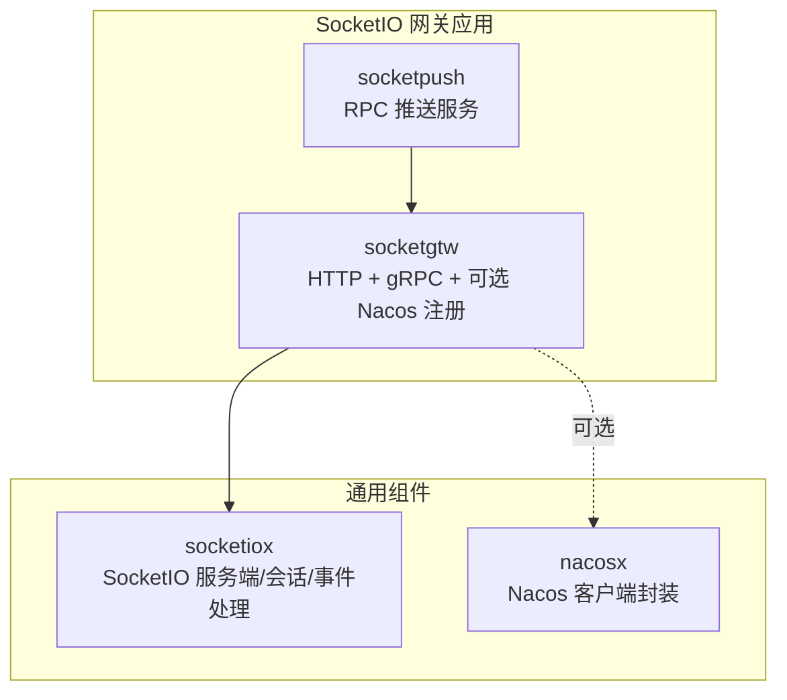
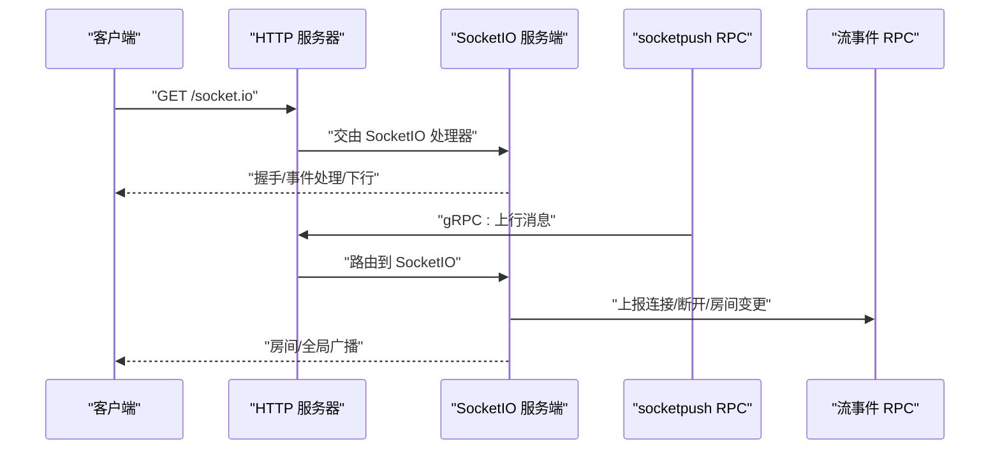
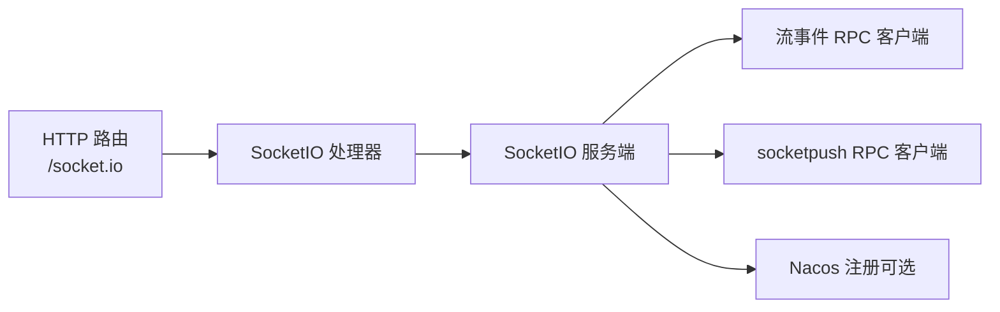

# 配置选项与参数

<cite>
**本文引用的文件**
- [socketgtw.yaml](file://socketapp/socketgtw/etc/socketgtw.yaml)
- [socketpush.yaml](file://socketapp/socketpush/etc/socketpush.yaml)
- [config.go](file://socketapp/socketgtw/internal/config/config.go)
- [server.go](file://common/socketiox/server.go)
- [handler.go](file://common/socketiox/handler.go)
- [routes.go](file://socketapp/socketgtw/internal/handler/routes.go)
- [socketgtw.go](file://socketapp/socketgtw/socketgtw.go)
- [socketpush.go](file://socketapp/socketpush/socketpush.go)
- [options.go](file://common/nacosx/options.go)
- [config.go](file://common/nacosx/config.go)
- [target.go](file://common/socketiox/target.go)
- [resilience-patterns.md](file://.trae/skills/zero-skills/references/resilience-patterns.md)
</cite>

## 目录
1. [简介](#简介)
2. [项目结构](#项目结构)
3. [核心组件](#核心组件)
4. [架构总览](#架构总览)
5. [详细组件分析](#详细组件分析)
6. [依赖关系分析](#依赖关系分析)
7. [性能考虑](#性能考虑)
8. [故障排查指南](#故障排查指南)
9. [结论](#结论)
10. [附录](#附录)

## 简介
本文件为 SocketIO 网关服务的配置选项与参数参考，覆盖以下方面：
- 配置文件结构与字段说明
- 网络配置参数：监听地址、端口、超时、连接限制
- 安全配置：认证方式、访问控制、加密设置
- 性能调优：连接池、缓冲区、并发限制
- 日志配置：日志级别、输出格式、轮转策略
- Nacos 服务注册：注册中心、服务发现、负载均衡参数
- 配置模板与部署示例

## 项目结构
SocketIO 网关由两个子应用组成：
- socketgtw：SocketIO 网关服务，提供 HTTP 入口与 gRPC 服务，并可选注册到 Nacos
- socketpush：Socket 推送 RPC 服务，负责向网关推送消息

图表来源
- [socketgtw.go:30-90](file://socketapp/socketgtw/socketgtw.go#L30-L90)
- [socketpush.go:27-69](file://socketapp/socketpush/socketpush.go#L27-L69)
- [server.go:1-120](file://common/socketiox/server.go#L1-L120)

章节来源
- [socketgtw.go:30-90](file://socketapp/socketgtw/socketgtw.go#L30-L90)
- [socketpush.go:27-69](file://socketapp/socketpush/socketpush.go#L27-L69)

## 核心组件
- 配置模型：socketgtw 的配置结构体包含 gRPC 服务配置、HTTP 配置、JWT 认证、Nacos 注册、Socket 元数据、流事件 RPC 客户端等字段
- SocketIO 服务端：封装了连接、事件、房间广播、全局广播、统计上报、会话元数据等能力
- HTTP 路由：将 /socket.io 映射到 SocketIO 处理器
- Nacos 注册：按配置将服务注册到 Nacos，支持命名空间、用户名密码、元数据等

章节来源
- [config.go:8-27](file://socketapp/socketgtw/internal/config/config.go#L8-L27)
- [server.go:299-335](file://common/socketiox/server.go#L299-L335)
- [handler.go:19-40](file://common/socketiox/handler.go#L19-L40)
- [routes.go:11-24](file://socketapp/socketgtw/internal/handler/routes.go#L11-L24)
- [options.go:11-41](file://common/nacosx/options.go#L11-L41)

## 架构总览
SocketIO 网关通过 HTTP 提供 Socket.IO 协议入口，内部使用 socketiox 实现事件处理与广播；socketpush 作为 RPC 推送方，向网关发送消息以触发广播或下行事件。

图表来源
- [routes.go:11-24](file://socketapp/socketgtw/internal/handler/routes.go#L11-L24)
- [server.go:337-676](file://common/socketiox/server.go#L337-L676)
- [socketpush.go:37-43](file://socketapp/socketpush/socketpush.go#L37-L43)

## 详细组件分析

### 1) 配置文件结构与字段说明
- socketgtw.yaml
  - Name：服务名
  - ListenOn：gRPC 监听地址:端口
  - Timeout：默认请求超时（毫秒）
  - Log：日志配置（Encoding、Path、Level、KeepDays）
  - http：HTTP 配置（Name、Host、Port、Timeout）
  - JwtAuth：可选 JWT 认证（AccessSecret、PrevAccessSecret）
  - NacosConfig：Nacos 注册配置（IsRegister、Host、Port、Username、PassWord、NamespaceId、ServiceName）
  - SocketMetaData：会话元数据键白名单
  - StreamEventConf：流事件 RPC 客户端配置（Endpoints、NonBlock、Timeout）

- socketpush.yaml
  - Name：服务名
  - ListenOn：gRPC 监听地址:端口
  - Timeout：默认请求超时（毫秒）
  - Log：日志配置（Encoding、Path、Level、KeepDays）
  - JwtAuth：JWT 认证（AccessSecret、PrevAccessSecret、AccessExpire）
  - NacosConfig：Nacos 注册配置（IsRegister、Host、Port、Username、PassWord、NamespaceId、ServiceName）
  - SocketGtwConf：网关 RPC 客户端配置（Endpoints、Timeout）

章节来源
- [socketgtw.yaml:1-37](file://socketapp/socketgtw/etc/socketgtw.yaml#L1-L37)
- [socketpush.yaml:1-28](file://socketapp/socketpush/etc/socketpush.yaml#L1-L28)
- [config.go:8-27](file://socketapp/socketgtw/internal/config/config.go#L8-L27)

### 2) 网络配置参数
- 监听地址与端口
  - gRPC：由 RpcServerConf.ListenOn 决定，默认在 socketgtw.yaml 中配置
  - HTTP：由 Http.Host/Http.Port 决定，默认在 socketgtw.yaml 中配置
- 超时配置
  - 服务级 Timeout：影响默认请求超时
  - HTTP 层 Timeout：影响 HTTP 请求处理超时
  - RPC 客户端 Timeout：影响对其他服务的调用超时
- 连接限制
  - SocketIO 层未显式暴露连接数上限配置，可通过上游限流、反向代理或系统资源限制控制

章节来源
- [socketgtw.yaml:2-17](file://socketapp/socketgtw/etc/socketgtw.yaml#L2-L17)
- [socketpush.yaml:2-13](file://socketapp/socketpush/etc/socketpush.yaml#L2-L13)
- [resilience-patterns.md:326-401](file://.trae/skills/zero-skills/references/resilience-patterns.md#L326-L401)

### 3) 安全配置选项
- 认证方式
  - JWT：socketgtw 支持可选 JWT 认证，Secret 与 PrevAccessSecret 可配置；socketpush 提供生成令牌逻辑
  - SocketIO 认证：通过 OnAuthentication 回调进行令牌校验，支持带声明的校验函数
- 访问控制
  - 可通过 ConnectHook/DisconnectHook/PreJoinRoomHook 在连接建立、断开、加入房间前注入业务控制
- 加密设置
  - 建议在反向代理层启用 TLS 终止，确保传输安全

章节来源
- [socketgtw.yaml:18-21](file://socketapp/socketgtw/etc/socketgtw.yaml#L18-L21)
- [socketpush.yaml:10-13](file://socketapp/socketpush/etc/socketpush.yaml#L10-L13)
- [server.go:337-349](file://common/socketiox/server.go#L337-L349)
- [socketgtw.go:48-61](file://socketapp/socketgtw/socketgtw.go#L48-L61)

### 4) 性能调优参数
- 并发与协程
  - 事件处理采用异步协程执行，避免阻塞主事件循环
- 统计与上报
  - statLoop 定期统计会话数量、房间列表、每秒消息数等，周期可配置
- 广播性能
  - 房间广播与全局广播基于底层 Socket.IO 实现，建议合理划分房间与控制消息体大小
- 资源限制
  - 通过上游限流、反向代理连接数限制、系统 ulimit 等手段控制资源占用

章节来源
- [server.go:494-530](file://common/socketiox/server.go#L494-L530)
- [server.go:702-740](file://common/socketiox/server.go#L702-L740)

### 5) 日志配置
- 日志级别：info/error/debug 等
- 输出格式：plain 纯文本
- 路径与保留：Path 指定目录，KeepDays 控制保留天数
- 全局字段：启动时附加 app 名称字段，便于聚合查询

章节来源
- [socketgtw.yaml:4-9](file://socketapp/socketgtw/etc/socketgtw.yaml#L4-L9)
- [socketpush.yaml:4-9](file://socketapp/socketpush/etc/socketpush.yaml#L4-L9)
- [socketgtw.go:82-82](file://socketapp/socketgtw/socketgtw.go#L82-L82)

### 6) Nacos 服务注册配置
- 注册开关：IsRegister 控制是否注册
- 注册中心：Host/Port
- 认证：Username/PassWord
- 命名空间：NamespaceId
- 服务名：ServiceName
- 元数据：注册时附加 gRPC 端口与来源标记
- 解析与目标：支持 nacos://schema 的目标解析，包含 namespaceid、timeout 等参数

章节来源
- [socketgtw.yaml:21-29](file://socketapp/socketgtw/etc/socketgtw.yaml#L21-L29)
- [socketpush.yaml:14-21](file://socketapp/socketpush/etc/socketpush.yaml#L14-L21)
- [socketgtw.go:63-80](file://socketapp/socketgtw/socketgtw.go#L63-L80)
- [socketpush.go:45-62](file://socketapp/socketpush/socketpush.go#L45-L62)
- [options.go:11-41](file://common/nacosx/options.go#L11-L41)
- [config.go:9-37](file://common/nacosx/config.go#L9-L37)
- [target.go:31-42](file://common/socketiox/target.go#L31-L42)

### 7) 配置模板与部署示例
- socketgtw.yaml 模板要点
  - Name、ListenOn、Timeout、Log
  - http.Name、http.Host、http.Port、http.Timeout
  - JwtAuth（可选）、NacosConfig（可选）
  - SocketMetaData、StreamEventConf（Endpoints、NonBlock、Timeout）
- socketpush.yaml 模板要点
  - Name、ListenOn、Timeout、Log
  - JwtAuth（含 AccessExpire）
  - NacosConfig（可选）
  - SocketGtwConf（Endpoints、Timeout）
- 部署建议
  - 将 SocketIO HTTP 入口置于反向代理后方，开启 TLS
  - 启用 Nacos 注册时，确保网络连通与凭据正确
  - 生产环境建议开启日志轮转与监控

章节来源
- [socketgtw.yaml:1-37](file://socketapp/socketgtw/etc/socketgtw.yaml#L1-L37)
- [socketpush.yaml:1-28](file://socketapp/socketpush/etc/socketpush.yaml#L1-L28)

## 依赖关系分析
- socketgtw 依赖 socketiox 提供 SocketIO 事件处理能力
- socketgtw 通过 HTTP 路由将 /socket.io 交给 SocketIO 处理器
- socketgtw 可选注册到 Nacos，提供服务发现与负载均衡
- socketpush 通过 gRPC 与 socketgtw 交互，推送消息触发广播

图表来源
- [routes.go:11-24](file://socketapp/socketgtw/internal/handler/routes.go#L11-L24)
- [handler.go:19-40](file://common/socketiox/handler.go#L19-L40)
- [server.go:337-676](file://common/socketiox/server.go#L337-L676)
- [socketgtw.go:63-80](file://socketapp/socketgtw/socketgtw.go#L63-L80)

章节来源
- [routes.go:11-24](file://socketapp/socketgtw/internal/handler/routes.go#L11-L24)
- [handler.go:19-40](file://common/socketiox/handler.go#L19-L40)
- [server.go:337-676](file://common/socketiox/server.go#L337-L676)
- [socketgtw.go:63-80](file://socketapp/socketgtw/socketgtw.go#L63-L80)

## 性能考虑
- 事件处理异步化：避免阻塞主线程，提升吞吐
- 统计上报：定期上报会话与房间状态，便于容量规划
- 超时策略：服务级、Handler 级、操作级超时分层设计，防止雪崩
- 限流与熔断：结合上游限流与熔断策略，保障稳定性

章节来源
- [server.go:494-530](file://common/socketiox/server.go#L494-L530)
- [server.go:702-740](file://common/socketiox/server.go#L702-L740)
- [resilience-patterns.md:326-401](file://.trae/skills/zero-skills/references/resilience-patterns.md#L326-L401)

## 故障排查指南
- 连接鉴权失败
  - 检查 JwtAuth 配置与 PrevAccessSecret 是否正确
  - 查看 OnAuthentication 回调日志
- 房间加入/离开异常
  - 检查 PreJoinRoomHook/ConnectHook/DisconnectHook 返回值与错误日志
- 广播失败
  - 检查事件名合法性（不可为保留事件名），确认房间存在且有成员
- Nacos 注册失败
  - 校验 Host/Port/Username/PassWord/NamespaceId/ServiceName
  - 查看 Nacos SDK 日志级别与路径

章节来源
- [server.go:337-349](file://common/socketiox/server.go#L337-L349)
- [server.go:415-434](file://common/socketiox/server.go#L415-L434)
- [server.go:678-700](file://common/socketiox/server.go#L678-L700)
- [config.go:9-37](file://common/nacosx/config.go#L9-L37)

## 结论
本文档梳理了 SocketIO 网关服务的配置项、网络与安全、性能与日志、以及 Nacos 注册的关键参数，并提供了模板与部署建议。建议在生产环境中结合限流、熔断、TLS 终止与 Nacos 服务治理，确保高可用与可观测性。

## 附录
- 配置文件模板与字段说明见“详细组件分析”中的“1) 配置文件结构与字段说明”
- 部署示例见“详细组件分析”中的“7) 配置模板与部署示例”