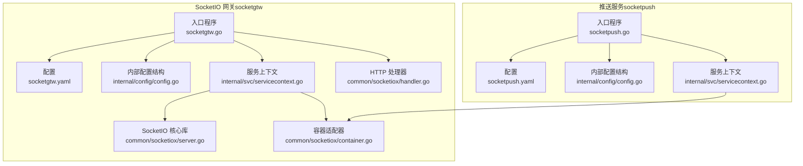
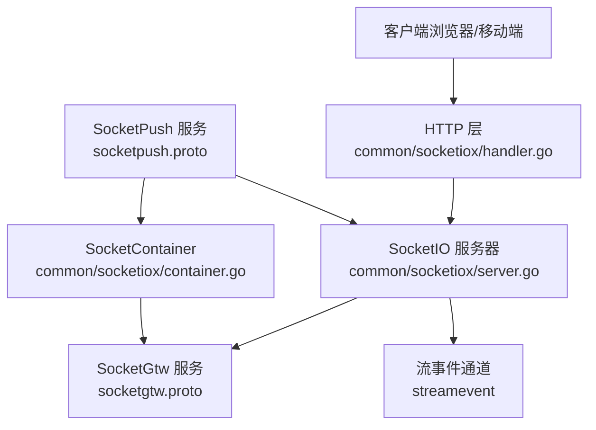
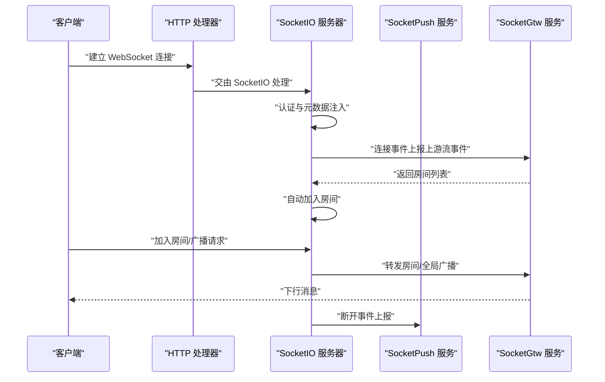
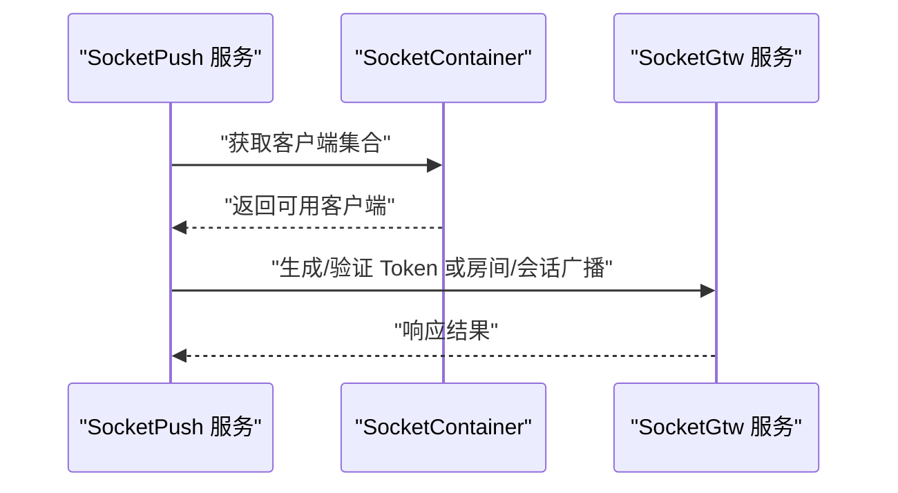
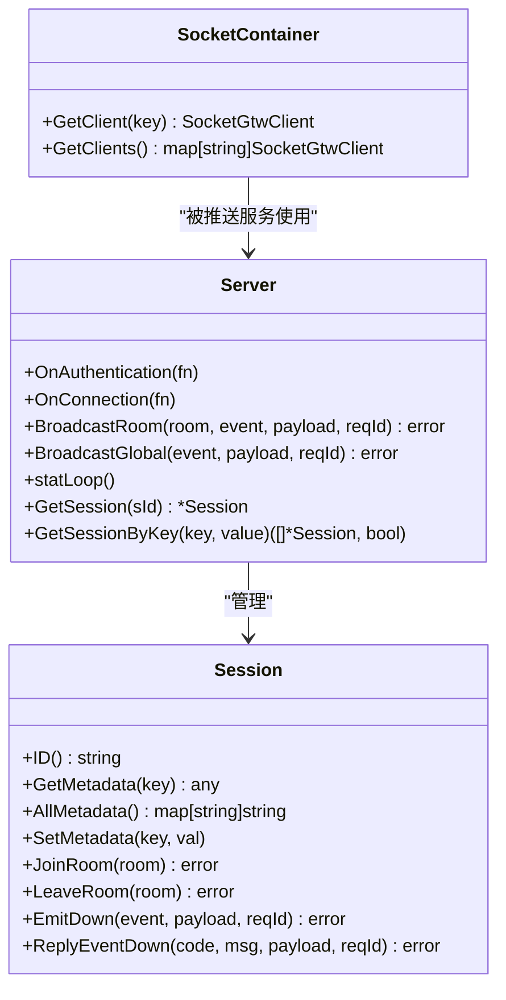
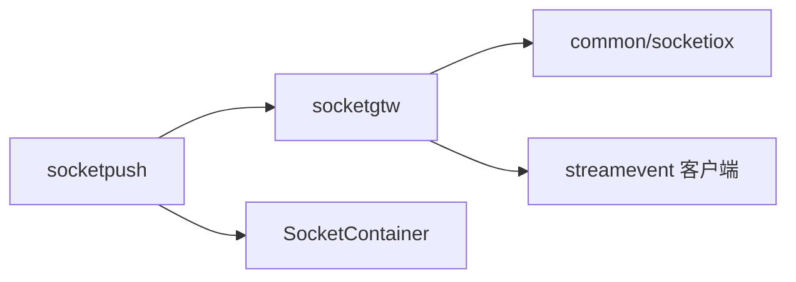

# 实时通信模块

<cite>
**本文引用的文件**   
- [socketgtw.go](file://socketapp/socketgtw/socketgtw.go)
- [socketpush.go](file://socketapp/socketpush/socketpush.go)
- [socketgtw.yaml](file://socketapp/socketgtw/etc/socketgtw.yaml)
- [socketpush.yaml](file://socketapp/socketpush/etc/socketpush.yaml)
- [socketgtw.proto](file://socketapp/socketgtw/socketgtw.proto)
- [socketpush.proto](file://socketapp/socketpush/socketpush.proto)
- [config.go](file://socketapp/socketgtw/internal/config/config.go)
- [config.go](file://socketapp/socketpush/internal/config/config.go)
- [servicecontext.go](file://socketapp/socketgtw/internal/svc/servicecontext.go)
- [servicecontext.go](file://socketapp/socketpush/internal/svc/servicecontext.go)
- [server.go](file://common/socketiox/server.go)
- [container.go](file://common/socketiox/container.go)
- [handler.go](file://common/socketiox/handler.go)
</cite>

## 目录
1. [简介](#简介)
2. [项目结构](#项目结构)
3. [核心组件](#核心组件)
4. [架构总览](#架构总览)
5. [详细组件分析](#详细组件分析)
6. [依赖分析](#依赖分析)
7. [性能考虑](#性能考虑)
8. [故障排查指南](#故障排查指南)
9. [结论](#结论)
10. [附录](#附录)

## 简介
本技术文档聚焦 Zero-Service 的实时通信模块，系统性阐述 SocketIO 网关（socketgtw）与推送服务（socketpush）的设计与实现。重点覆盖以下方面：
- 连接管理机制：认证、握手、元数据注入、生命周期钩子
- 房间管理策略：加入/离开房间、房间广播、全局广播
- 消息路由算法：事件驱动、上行/下行消息封装、广播分发
- 会话状态维护：统计上报、会话查询、按元数据检索
- Token 生成与验证：JWT 签名与校验、声明提取、多密钥支持
- 权限控制与安全策略：基于元数据的房间准入、断连清理
- MQTT 桥接能力：通过流事件通道将外部消息桥接到 SocketIO 房间
- 消息队列集成与可靠性：RPC 客户端连接管理、最大消息尺寸、错误处理
- 性能优化建议：连接池、订阅裁剪、并发控制
- API 接口文档、客户端集成示例与故障排查

## 项目结构
实时通信模块由两部分组成：
- SocketIO 网关（socketgtw）：负责 SocketIO 会话接入、房间管理、消息路由，并通过流事件通道与外部系统交互
- 推送服务（socketpush）：负责生成/验证 Token、向网关发起房间/会话级消息推送、聚合网关统计

**图表来源**
- [socketgtw.go:30-91](file://socketapp/socketgtw/socketgtw.go#L30-L91)
- [socketpush.go:27-70](file://socketapp/socketpush/socketpush.go#L27-L70)
- [socketgtw.yaml:1-37](file://socketapp/socketgtw/etc/socketgtw.yaml#L1-L37)
- [socketpush.yaml:1-28](file://socketapp/socketpush/etc/socketpush.yaml#L1-L28)
- [config.go:8-27](file://socketapp/socketgtw/internal/config/config.go#L8-L27)
- [config.go:5-22](file://socketapp/socketpush/internal/config/config.go#L5-L22)
- [servicecontext.go:18-133](file://socketapp/socketgtw/internal/svc/servicecontext.go#L18-L133)
- [servicecontext.go:8-18](file://socketapp/socketpush/internal/svc/servicecontext.go#L8-L18)
- [server.go:1-814](file://common/socketiox/server.go#L1-L814)
- [container.go:1-426](file://common/socketiox/container.go#L1-L426)
- [handler.go:1-41](file://common/socketiox/handler.go#L1-L41)

**章节来源**
- [socketgtw.go:30-91](file://socketapp/socketgtw/socketgtw.go#L30-L91)
- [socketpush.go:27-70](file://socketapp/socketpush/socketpush.go#L27-L70)
- [socketgtw.yaml:1-37](file://socketapp/socketgtw/etc/socketgtw.yaml#L1-L37)
- [socketpush.yaml:1-28](file://socketapp/socketpush/etc/socketpush.yaml#L1-L28)

## 核心组件
- SocketIO 网关（socketgtw）
  - 提供 gRPC SocketGtw 服务，暴露房间管理、广播、会话操作等 RPC 接口
  - 内置 SocketIO 服务器，支持认证、元数据注入、连接/断开钩子、房间广播/全局广播
  - 通过流事件客户端向上游事件通道上报连接/断开/房间加入等事件
- 推送服务（socketpush）
  - 提供 gRPC SocketPush 服务，包含 Token 生成/验证、房间/会话级消息推送
  - 通过 SocketContainer 统一管理对 socketgtw 的 gRPC 客户端连接，支持直连/ETCD/Nacos 三种发现方式
- SocketIO 核心库（common/socketiox）
  - 封装 SocketIO 会话、房间、事件处理、广播、统计上报、会话查询等能力
  - 提供事件常量、响应/下行消息封装工具函数
- HTTP 处理器
  - 将 SocketIO 服务器挂载到 HTTP 路由，支持自定义中间件（如升级头兼容）

**章节来源**
- [socketgtw.proto:9-32](file://socketapp/socketgtw/socketgtw.proto#L9-L32)
- [socketpush.proto:9-36](file://socketapp/socketpush/socketpush.proto#L9-L36)
- [server.go:20-83](file://common/socketiox/server.go#L20-L83)
- [handler.go:19-41](file://common/socketiox/handler.go#L19-L41)

## 架构总览
SocketIO 网关与推送服务通过 gRPC 协议交互，SocketIO 核心库负责底层协议处理；推送服务可直接或间接调用网关进行消息下发。

**图表来源**
- [handler.go:33-41](file://common/socketiox/handler.go#L33-L41)
- [server.go:337-676](file://common/socketiox/server.go#L337-L676)
- [socketgtw.proto:9-32](file://socketapp/socketgtw/socketgtw.proto#L9-L32)
- [socketpush.proto:9-36](file://socketapp/socketpush/socketpush.proto#L9-L36)
- [container.go:30-61](file://common/socketiox/container.go#L30-L61)

## 详细组件分析

### SocketIO 网关（socketgtw）
- 入口与配置
  - 读取配置、初始化 gRPC 与 HTTP 服务，注册中间件与反射（开发/测试模式）
  - 注册服务到 Nacos（可选），设置元数据字段（如 gRPC 端口）
- 服务上下文
  - 创建 SocketIO 服务器，注入：
    - 上行事件处理器（用于处理业务事件）
    - Token 校验器（支持当前/历史密钥）
    - 连接/断开钩子：连接时根据上游返回的房间列表自动加入；断开时上报断开事件
    - 房间加入前钩子：允许业务侧在加入房间前做鉴权/校验
  - 初始化流事件客户端，用于上报 SocketIO 事件
- 关键流程
  - 认证：从握手参数提取 token，调用校验器
  - 元数据注入：若配置了上下文键列表，从 JWT 声明中提取并写入会话元数据
  - 房间管理：支持加入/离开房间、房间广播、全局广播
  - 广播：将下行消息封装为统一格式后广播至房间或全局

**图表来源**
- [socketgtw.go:40-91](file://socketapp/socketgtw/socketgtw.go#L40-L91)
- [servicecontext.go:38-133](file://socketapp/socketgtw/internal/svc/servicecontext.go#L38-L133)
- [server.go:337-676](file://common/socketiox/server.go#L337-L676)

**章节来源**
- [socketgtw.go:30-91](file://socketapp/socketgtw/socketgtw.go#L30-L91)
- [servicecontext.go:18-133](file://socketapp/socketgtw/internal/svc/servicecontext.go#L18-L133)
- [server.go:337-676](file://common/socketiox/server.go#L337-L676)

### 推送服务（socketpush）
- 入口与配置
  - 读取配置、初始化 gRPC 服务，注册到 Nacos（可选）
- 服务上下文
  - 创建 SocketContainer，用于管理对 socketgtw 的 gRPC 客户端连接
  - 支持直连、ETCD、Nacos 三种发现方式，自动维护客户端集合
- 关键流程
  - Token 生成/验证：基于配置中的密钥生成访问令牌，支持过期时间
  - 房间/会话级消息推送：通过 SocketContainer 选择目标 socketgtw 实例，调用相应 RPC
  - 统计聚合：查询各节点会话数，汇总为列表

**图表来源**
- [socketpush.go:27-70](file://socketapp/socketpush/socketpush.go#L27-L70)
- [servicecontext.go:13-18](file://socketapp/socketpush/internal/svc/servicecontext.go#L13-L18)
- [container.go:35-61](file://common/socketiox/container.go#L35-L61)

**章节来源**
- [socketpush.go:27-70](file://socketapp/socketpush/socketpush.go#L27-L70)
- [servicecontext.go:8-18](file://socketapp/socketpush/internal/svc/servicecontext.go#L8-L18)
- [container.go:30-61](file://common/socketiox/container.go#L30-L61)

### SocketIO 核心库（common/socketiox）
- 会话模型
  - Session：封装 socket 连接、元数据、房间集合、加锁保护
  - 提供 JoinRoom/LeaveRoom、EmitDown/ReplyEventDown 等方法
- 服务器模型
  - Server：持有事件处理器映射、会话表、统计周期、钩子回调
  - 支持动态绑定事件、广播房间/全局、统计上报循环、会话清理
- 事件与消息封装
  - 上行/下行消息结构、响应体封装、错误应答
- 容器与发现
  - SocketContainer：统一管理 gRPC 客户端，支持直连、ETCD、Nacos 三种发现，自动增删改客户端集合

**图表来源**
- [server.go:119-232](file://common/socketiox/server.go#L119-L232)
- [server.go:299-312](file://common/socketiox/server.go#L299-L312)
- [container.go:30-33](file://common/socketiox/container.go#L30-L33)

**章节来源**
- [server.go:119-232](file://common/socketiox/server.go#L119-L232)
- [server.go:299-312](file://common/socketiox/server.go#L299-L312)
- [container.go:30-33](file://common/socketiox/container.go#L30-L33)

### API 接口文档

#### SocketGtw 服务（socketgtw.proto）
- 房间管理
  - JoinRoom：加入房间
  - LeaveRoom：离开房间
- 广播与会话
  - BroadcastRoom：房间广播
  - BroadcastGlobal：全局广播
  - SendToSession/SendToSessions：单/批量会话消息
  - SendToMetaSession/SendToMetaSessions：按元数据匹配的单/批量会话消息
- 会话与踢人
  - KickSession：按会话 ID 踢人
  - KickMetaSession：按元数据踢人
- 统计
  - SocketGtwStat：获取会话数量

**章节来源**
- [socketgtw.proto:9-32](file://socketapp/socketgtw/socketgtw.proto#L9-L32)

#### SocketPush 服务（socketpush.proto）
- Token 管理
  - GenToken：生成访问令牌
  - VerifyToken：验证访问令牌并返回声明
- 房间与会话
  - JoinRoom/LeaveRoom/BroadcastRoom/BroadcastGlobal/KickSession/KickMetaSession
  - SendToSession/SendToSessions/SendToMetaSession/SendToMetaSessions
- 统计
  - SocketGtwStat：聚合各节点会话统计

**章节来源**
- [socketpush.proto:9-36](file://socketapp/socketpush/socketpush.proto#L9-L36)

### 连接管理机制
- 认证与握手
  - 从握手参数提取 token，调用 TokenValidator 校验
  - 若配置了 TokenValidatorWithClaims，则从 JWT 声明中提取上下文键值，注入会话元数据
- 生命周期钩子
  - ConnectHook：连接建立后，可从上游返回房间列表并自动加入
  - DisconnectHook：断开连接时，上报断开事件
  - PreJoinRoomHook：加入房间前执行业务校验
- 会话清理
  - 断开事件触发后清理无效会话，避免内存泄漏

**章节来源**
- [server.go:337-391](file://common/socketiox/server.go#L337-L391)
- [servicecontext.go:75-131](file://socketapp/socketgtw/internal/svc/servicecontext.go#L75-L131)

### 房间管理策略
- 房间加入/离开
  - 通过 EventJoinRoom/EventLeaveRoom 事件处理，支持 Ack 回执
- 广播策略
  - 房间广播：仅向房间内成员广播
  - 全局广播：向所有在线成员广播
- 房间加载
  - 连接钩子阶段根据上游返回的房间列表自动加入，确保一致性

**章节来源**
- [server.go:392-468](file://common/socketiox/server.go#L392-L468)
- [server.go:678-700](file://common/socketiox/server.go#L678-L700)
- [servicecontext.go:97-131](file://socketapp/socketgtw/internal/svc/servicecontext.go#L97-L131)

### 消息路由算法
- 事件驱动
  - 服务器绑定多种事件（连接、断开、房间加入/离开、上行事件、广播事件）
  - 上行事件统一解析为 SocketUpReq，交由注册的 EventUp 处理器处理
- 下行封装
  - 统一下行消息格式（SocketDown），支持字符串或 JSON 原始消息
- 广播分发
  - 房间广播与全局广播分别调用 To().Emit 与 Emit，确保事件名不冲突

**章节来源**
- [server.go:469-619](file://common/socketiox/server.go#L469-L619)
- [server.go:85-93](file://common/socketiox/server.go#L85-L93)

### 会话状态维护
- 统计上报
  - statLoop 按固定周期统计会话数、房间列表、网络指标、元数据与房间加载错误
  - 通过 EventStatDown 下发统计信息
- 会话查询
  - 支持按会话 ID、设备 ID、用户 ID 或任意元数据键值查询
- 并发安全
  - 会话表与客户端集合均采用读写锁保护

**章节来源**
- [server.go:702-782](file://common/socketiox/server.go#L702-L782)
- [container.go:267-316](file://common/socketiox/container.go#L267-L316)

### Token 生成验证机制与权限控制
- 生成与验证
  - SocketPush 提供 GenToken/VerifyToken 接口，支持配置访问密钥与过期时间
- 多密钥支持
  - 网关侧 TokenValidator 支持当前与历史密钥，提升密钥轮换期间的兼容性
- 权限控制
  - 通过元数据键（如用户 ID、部门 ID）进行会话标识与匹配
  - 房间加入前钩子可用于细粒度权限校验

**章节来源**
- [socketpush.proto:48-65](file://socketapp/socketpush/socketpush.proto#L48-L65)
- [servicecontext.go:41-74](file://socketapp/socketgtw/internal/svc/servicecontext.go#L41-L74)

### MQTT 桥接功能
- 桥接思路
  - 通过流事件通道（streamevent）将外部消息（如 MQTT 主题）转换为 SocketIO 事件
  - 网关在连接钩子中根据上游返回的房间列表自动加入房间，实现协议间无缝集成
- 实现要点
  - 网关侧通过 Streamevent 客户端上报连接/断开/房间事件
  - 推送服务可通过 SocketPush 服务向网关发起广播/会话消息

**章节来源**
- [servicecontext.go:24-37](file://socketapp/socketgtw/internal/svc/servicecontext.go#L24-L37)
- [socketgtw.yaml:30-37](file://socketapp/socketgtw/etc/socketgtw.yaml#L30-L37)

### 消息队列集成与可靠性保障
- RPC 客户端连接管理
  - SocketContainer 支持直连、ETCD、Nacos 三种发现方式，自动维护客户端集合
  - 健康实例过滤与权重采样，保证高可用与负载均衡
- 可靠性保障
  - 最大消息尺寸配置（发送/接收），避免超大消息导致失败
  - 错误日志记录与回执处理，便于定位问题
- 重试策略
  - 当前实现未显式重试，建议在上层调用侧结合业务需求增加幂等与重试

**章节来源**
- [container.go:83-154](file://common/socketiox/container.go#L83-L154)
- [container.go:156-242](file://common/socketiox/container.go#L156-L242)
- [servicecontext.go:24-37](file://socketapp/socketgtw/internal/svc/servicecontext.go#L24-L37)

### 性能优化建议
- 连接池与发现
  - 使用 Nacos/ETCD 发现，结合健康实例筛选与子集采样，降低抖动
- 并发控制
  - 事件处理使用异步 goroutine，避免阻塞主事件循环
- 内存优化
  - 会话元数据仅存储字符串类型，避免冗余对象
  - 统计周期合理设置，避免频繁序列化
- 广播优化
  - 房间广播优先于全局广播，减少不必要的广播压力

**章节来源**
- [server.go:494-531](file://common/socketiox/server.go#L494-L531)
- [container.go:348-356](file://common/socketiox/container.go#L348-L356)

### 客户端集成示例（步骤指引）
- 建立 SocketIO 连接
  - 在握手参数中携带 token
  - 设置事件监听（如 __down__ 接收下行消息）
- 房间管理
  - 发送 __join_room_up__ 事件加入房间
  - 发送 __leave_room_up__ 事件离开房间
- 广播与消息
  - 发送 __room_broadcast_up__ 或 __global_broadcast_up__ 触发广播
  - 通过 __up__ 事件提交业务请求，等待 Ack 或下行响应

**章节来源**
- [server.go:20-35](file://common/socketiox/server.go#L20-L35)
- [server.go:392-468](file://common/socketiox/server.go#L392-L468)
- [server.go:532-619](file://common/socketiox/server.go#L532-L619)

### 与前端框架对接方法与最佳实践
- 框架对接
  - 使用标准 SocketIO 客户端库，确保握手参数包含 token
  - 对下行消息统一解析 __down__ 事件，区分业务 payload 与响应码
- 最佳实践
  - 使用元数据键（如 userId、deviceId）标识会话，便于精准推送
  - 房间命名规范，避免冲突与歧义
  - 对广播事件进行去重与幂等处理

**章节来源**
- [server.go:85-93](file://common/socketiox/server.go#L85-L93)
- [socketgtw.yaml:29](file://socketapp/socketgtw/etc/socketgtw.yaml#L29)

## 依赖分析
- 组件耦合
  - socketgtw 依赖 SocketIO 核心库与流事件客户端
  - socketpush 依赖 SocketContainer 与 socketgtw gRPC 客户端
- 外部依赖
  - gRPC、SocketIO、Nacos/ETCD、JWT 工具库
- 潜在风险
  - 事件名冲突（如禁止使用 __down__ 作为业务事件）
  - 会话与 Socket 数量不一致的风险，需定期统计校验

**图表来源**
- [socketgtw.go:33-46](file://socketapp/socketgtw/socketgtw.go#L33-L46)
- [socketpush.go:37-43](file://socketapp/socketpush/socketpush.go#L37-L43)
- [servicecontext.go:24-37](file://socketapp/socketgtw/internal/svc/servicecontext.go#L24-L37)
- [container.go:35-61](file://common/socketiox/container.go#L35-L61)

**章节来源**
- [socketgtw.go:33-46](file://socketapp/socketgtw/socketgtw.go#L33-L46)
- [socketpush.go:37-43](file://socketapp/socketpush/socketpush.go#L37-L43)
- [servicecontext.go:24-37](file://socketapp/socketgtw/internal/svc/servicecontext.go#L24-L37)
- [container.go:35-61](file://common/socketiox/container.go#L35-L61)

## 性能考虑
- 广播路径
  - 房间广播优于全局广播，建议优先使用房间维度
- 事件处理
  - 异步处理上行事件，避免阻塞
- 统计与日志
  - 合理设置统计周期，避免高频序列化
- 连接发现
  - 使用 Nacos/ETCD 发现并裁剪实例子集，降低抖动

[本节为通用指导，无需列出具体文件来源]

## 故障排查指南
- 连接失败
  - 检查 token 是否正确、是否在有效期内
  - 确认握手参数中包含 token
- 房间加入失败
  - 查看 PreJoinRoomHook 返回的错误信息
  - 确认上游返回的房间列表是否为空或异常
- 广播无响应
  - 检查事件名是否为保留名（如 __down__）
  - 确认房间是否存在且成员在线
- 统计异常
  - 检查 statLoop 是否正常运行
  - 核对会话表与 Socket 数量是否一致
- 客户端发现
  - 检查 Nacos/ETCD 地址与服务名配置
  - 确认实例健康状态与 gRPC 端口元数据

**章节来源**
- [server.go:337-391](file://common/socketiox/server.go#L337-L391)
- [server.go:678-700](file://common/socketiox/server.go#L678-L700)
- [container.go:318-346](file://common/socketiox/container.go#L318-L346)

## 结论
该实时通信模块以 SocketIO 为核心，结合 gRPC 与服务发现，实现了高可用、可扩展的会话管理与消息路由能力。通过 Token 管理、元数据注入与钩子机制，满足复杂业务场景下的权限控制与协议桥接需求。建议在生产环境中启用 Nacos/ETCD 发现、合理设置统计周期与消息尺寸，并在上层调用侧完善幂等与重试策略，以进一步提升稳定性与性能。

[本节为总结性内容，无需列出具体文件来源]

## 附录
- 配置参考
  - socketgtw.yaml：服务名称、监听地址、日志、HTTP 端口、Nacos 注册、Socket 元数据键、流事件客户端配置
  - socketpush.yaml：服务名称、监听地址、日志、JWT 密钥与过期时间、socketgtw 客户端配置
- 事件常量
  - 连接/断开/上行/房间广播/全局广播/统计下行等事件名定义

**章节来源**
- [socketgtw.yaml:1-37](file://socketapp/socketgtw/etc/socketgtw.yaml#L1-L37)
- [socketpush.yaml:1-28](file://socketapp/socketpush/etc/socketpush.yaml#L1-L28)
- [server.go:20-35](file://common/socketiox/server.go#L20-L35)