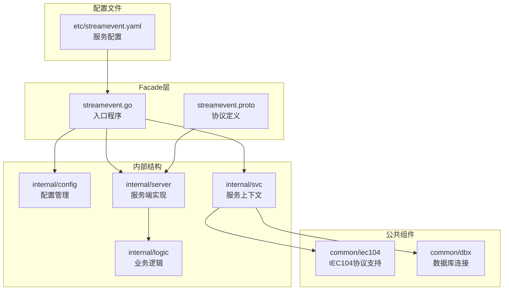
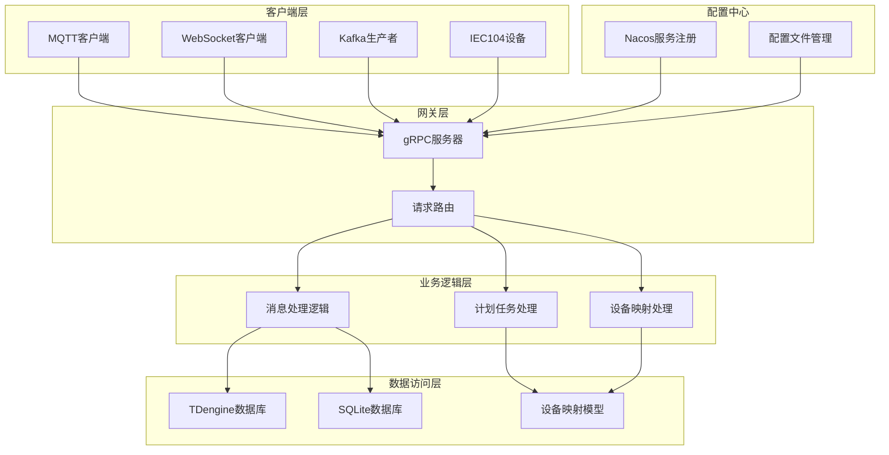
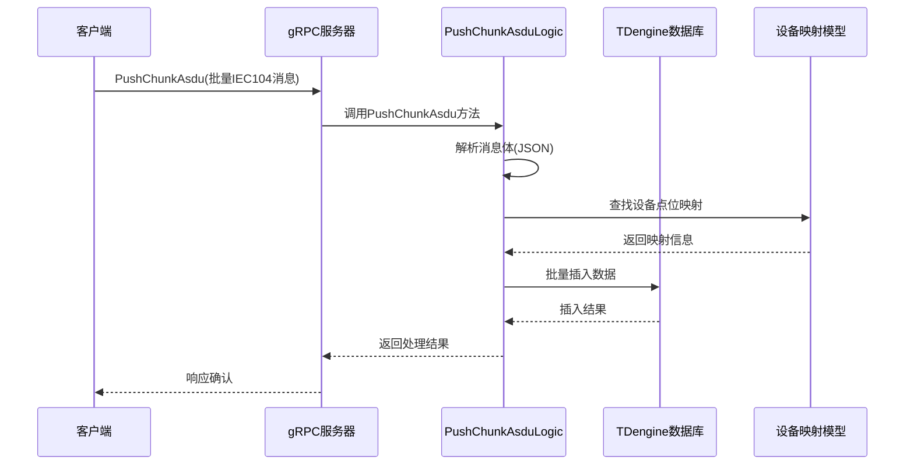
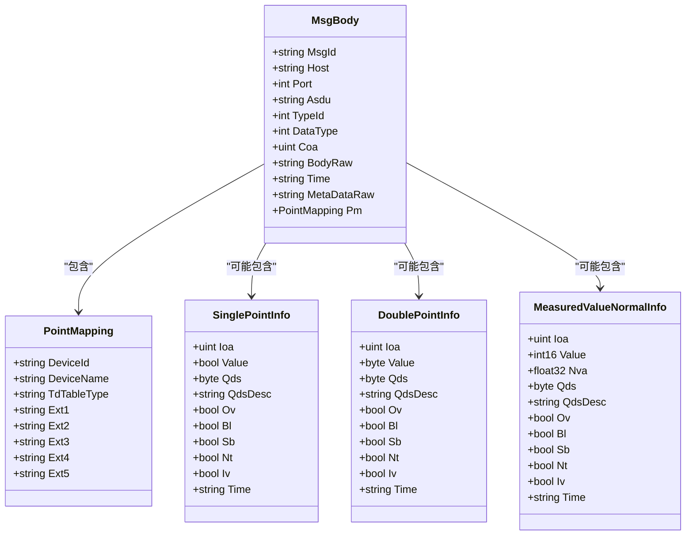
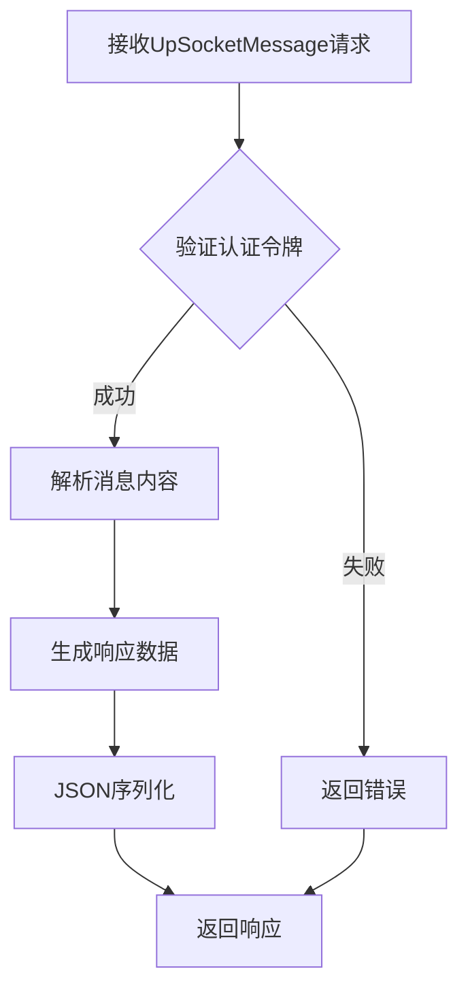
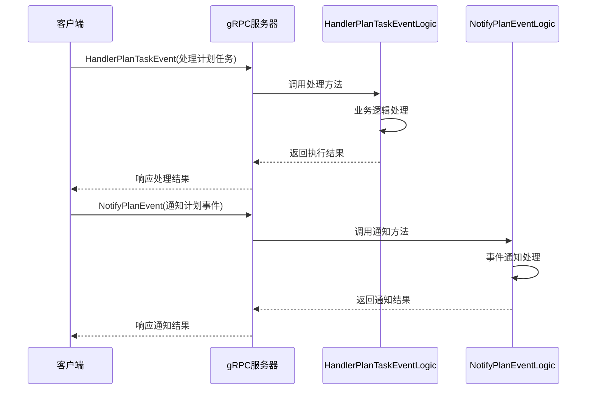
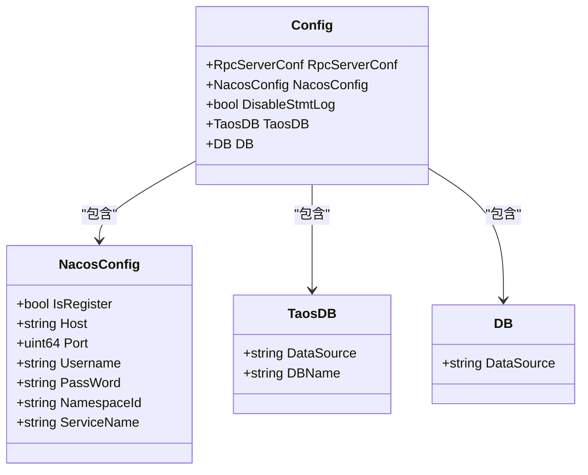
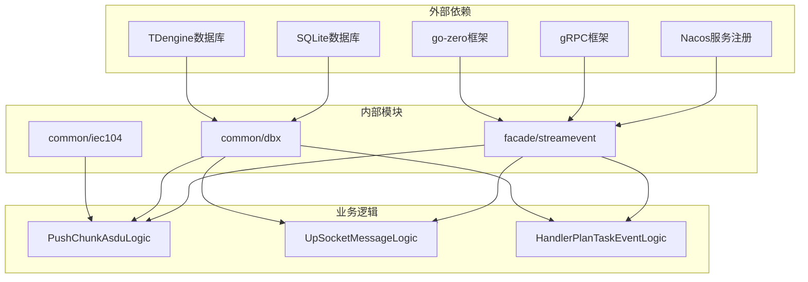

# 工具调用事件系统

<cite>
**本文档引用的文件**
- [facade/streamevent.go](file://facade/streamevent/streamevent.go)
- [streamevent.proto](file://facade/streamevent/streamevent.proto)
- [handlerplantaskeventlogic.go](file://facade/streamevent/internal/logic/handlerplantaskeventlogic.go)
- [notifyplaneventlogic.go](file://facade/streamevent/internal/logic/notifyplaneventlogic.go)
- [receivekafkamessagelogic.go](file://facade/streamevent/internal/logic/receivekafkamessagelogic.go)
- [receivemqttmessagelogic.go](file://facade/streamevent/internal/logic/receivemqttmessagelogic.go)
- [upsocketmessagelogic.go](file://facade/streamevent/internal/logic/upsocketmessagelogic.go)
- [pushchunkasdulogic.go](file://facade/streamevent/internal/logic/pushchunkasdulogic.go)
- [streamevent.yaml](file://facade/streamevent/etc/streamevent.yaml)
- [config.go](file://facade/streamevent/internal/config/config.go)
- [servicecontext.go](file://facade/streamevent/internal/svc/servicecontext.go)
- [streameventserver.go](file://facade/streamevent/internal/server/streameventserver.go)
- [types.go](file://common/iec104/types/types.go)
- [util.go](file://common/iec104/util/util.go)
</cite>

## 目录
1. [简介](#简介)
2. [项目结构](#项目结构)
3. [核心组件](#核心组件)
4. [架构概览](#架构概览)
5. [详细组件分析](#详细组件分析)
6. [依赖关系分析](#依赖关系分析)
7. [性能考虑](#性能考虑)
8. [故障排除指南](#故障排除指南)
9. [结论](#结论)

## 简介

工具调用事件系统是一个基于Go-zero框架构建的微服务系统，专门用于处理各种工业通信协议和事件。该系统主要负责接收和处理IEC 61850标准的104协议消息，同时支持MQTT、WebSocket、Kafka等多种消息传输协议。

系统的核心功能包括：
- IEC 61850 104协议消息的接收和处理
- 多协议消息的统一接口设计
- 实时数据采集和存储
- 计划任务事件处理
- 设备点位映射管理

## 项目结构

工具调用事件系统采用典型的Go-zero微服务架构，具有清晰的层次结构：

**图表来源**
- [facade/streamevent.go:1-72](file://facade/streamevent/streamevent.go#L1-L72)
- [streamevent.proto:1-581](file://facade/streamevent/streamevent.proto#L1-L581)

**章节来源**
- [facade/streamevent.go:1-72](file://facade/streamevent/streamevent.go#L1-L72)
- [streamevent.proto:1-581](file://facade/streamevent/streamevent.proto#L1-L581)

## 核心组件

### 1. 服务入口组件

服务入口通过main函数启动，负责初始化配置、注册gRPC服务和Nacos服务注册。

### 2. 协议定义组件

使用Protocol Buffers定义了完整的gRPC接口，支持多种消息类型的传输。

### 3. 业务逻辑组件

包含针对不同消息类型的处理逻辑，每个逻辑组件都有独立的职责和实现。

### 4. 服务上下文组件

管理数据库连接、模型实例和系统配置，为业务逻辑提供基础设施支持。

**章节来源**
- [facade/streamevent.go:28-71](file://facade/streamevent/streamevent.go#L28-L71)
- [streamevent.proto:10-25](file://facade/streamevent/streamevent.proto#L10-L25)

## 架构概览

系统采用分层架构设计，确保了良好的可维护性和扩展性：

**图表来源**
- [streameventserver.go:15-67](file://facade/streamevent/internal/server/streameventserver.go#L15-L67)
- [servicecontext.go:14-33](file://facade/streamevent/internal/svc/servicecontext.go#L14-L33)

## 详细组件分析

### 1. IEC104协议处理组件

#### PushChunkAsduLogic 分析

该组件负责处理IEC 61850 104协议的批量消息推送：

**图表来源**
- [pushchunkasdulogic.go:118-223](file://facade/streamevent/internal/logic/pushchunkasdulogic.go#L118-L223)
- [streameventserver.go:44-48](file://facade/streamevent/internal/server/streameventserver.go#L44-L48)

该组件实现了以下核心功能：
- **消息解析**：从JSON格式的消息体中提取IEC104协议数据
- **设备映射**：根据设备信息查找对应的点位映射关系
- **批量插入**：使用MapReduce模式进行高效的数据批量插入
- **错误处理**：完善的异常处理和日志记录机制

#### 数据模型类图

**图表来源**
- [types.go:17-40](file://common/iec104/types/types.go#L17-L40)
- [types.go:62-77](file://common/iec104/types/types.go#L62-L77)
- [types.go:81-96](file://common/iec104/types/types.go#L81-L96)
- [types.go:119-138](file://common/iec104/types/types.go#L119-L138)

**章节来源**
- [pushchunkasdulogic.go:1-223](file://facade/streamevent/internal/logic/pushchunkasdulogic.go#L1-L223)
- [types.go:1-323](file://common/iec104/types/types.go#L1-L323)

### 2. 多协议消息处理组件

#### Socket消息处理

UpSocketMessageLogic组件处理WebSocket上行消息：

**图表来源**
- [upsocketmessagelogic.go:29-55](file://facade/streamevent/internal/logic/upsocketmessagelogic.go#L29-L55)

#### 计划任务事件处理

HandlerPlanTaskEventLogic和NotifyPlanEventLogic组件处理计划任务相关的事件：

**图表来源**
- [handlerplantaskeventlogic.go:29-38](file://facade/streamevent/internal/logic/handlerplantaskeventlogic.go#L29-L38)
- [notifyplaneventlogic.go:27-31](file://facade/streamevent/internal/logic/notifyplaneventlogic.go#L27-L31)

**章节来源**
- [upsocketmessagelogic.go:1-56](file://facade/streamevent/internal/logic/upsocketmessagelogic.go#L1-L56)
- [handlerplantaskeventlogic.go:1-39](file://facade/streamevent/internal/logic/handlerplantaskeventlogic.go#L1-L39)
- [notifyplaneventlogic.go:1-32](file://facade/streamevent/internal/logic/notifyplaneventlogic.go#L1-L32)

### 3. 配置管理系统

#### 服务配置结构

**图表来源**
- [config.go:5-24](file://facade/streamevent/internal/config/config.go#L5-L24)

**章节来源**
- [config.go:1-25](file://facade/streamevent/internal/config/config.go#L1-L25)
- [streamevent.yaml:1-28](file://facade/streamevent/etc/streamevent.yaml#L1-L28)

## 依赖关系分析

系统采用模块化的依赖设计，确保各组件之间的松耦合：

**图表来源**
- [servicecontext.go:3-10](file://facade/streamevent/internal/svc/servicecontext.go#L3-L10)
- [facade/streamevent.go:6-24](file://facade/streamevent/streamevent.go#L6-L24)

### 主要依赖关系

1. **框架依赖**：系统基于Go-zero微服务框架构建，提供了完整的微服务基础设施
2. **通信协议**：支持gRPC、MQTT、WebSocket等多种通信协议
3. **数据库集成**：集成了TDengine时序数据库和SQLite关系型数据库
4. **服务注册**：通过Nacos实现服务的自动注册和发现

**章节来源**
- [servicecontext.go:1-33](file://facade/streamevent/internal/svc/servicecontext.go#L1-L33)
- [facade/streamevent.go:1-72](file://facade/streamevent/streamevent.go#L1-L72)

## 性能考虑

### 1. 批量处理优化

系统在处理IEC104协议消息时采用了MapReduce模式进行批量数据处理：

- **并行处理**：利用mr.MapReduce实现并发数据处理
- **内存管理**：通过流式处理避免大量内存占用
- **错误隔离**：单条消息的处理错误不影响整体流程

### 2. 数据库性能优化

- **连接池管理**：合理配置数据库连接参数
- **批量插入**：使用批量操作减少数据库往返次数
- **索引优化**：为常用查询字段建立适当的索引

### 3. 内存和资源管理

- **资源清理**：确保数据库连接和文件句柄正确关闭
- **日志控制**：通过配置控制日志级别和输出方式
- **超时设置**：合理的超时配置避免资源长时间占用

## 故障排除指南

### 1. 常见问题诊断

#### 数据库连接问题
- 检查TDengine和SQLite的连接字符串配置
- 验证数据库服务的可用性和网络连通性
- 确认数据库用户权限配置正确

#### 消息处理异常
- 查看详细的错误日志信息
- 检查消息格式是否符合协议规范
- 验证设备映射配置的准确性

#### 服务注册问题
- 确认Nacos服务的可用性和配置正确性
- 检查服务端口和网络配置
- 验证服务命名和版本信息

### 2. 日志分析

系统提供了详细的日志记录机制，包括：
- **请求日志**：记录所有入站请求的详细信息
- **错误日志**：捕获和记录系统运行时的异常情况
- **性能日志**：监控系统的性能指标和处理时间

**章节来源**
- [pushchunkasdulogic.go:122-125](file://facade/streamevent/internal/logic/pushchunkasdulogic.go#L122-L125)
- [streamevent.yaml:5-13](file://facade/streamevent/etc/streamevent.yaml#L5-L13)

## 结论

工具调用事件系统是一个设计精良的微服务架构，具有以下特点：

### 系统优势

1. **模块化设计**：清晰的层次结构和职责分离
2. **协议兼容性**：支持多种工业通信协议的标准实现
3. **高性能处理**：采用并行处理和批量操作优化性能
4. **可扩展性**：灵活的配置管理和插件化架构
5. **可靠性保障**：完善的错误处理和监控机制

### 技术特色

- **IEC104协议支持**：完整的104协议实现和数据处理能力
- **多协议集成**：统一的接口设计支持多种消息传输协议
- **实时数据处理**：高效的批量处理和实时数据采集能力
- **服务治理**：基于Nacos的服务注册和发现机制

### 应用价值

该系统为工业自动化和电力监控领域提供了可靠的技术解决方案，能够满足高并发、低延迟的数据处理需求，为后续的功能扩展和系统升级奠定了坚实的基础。