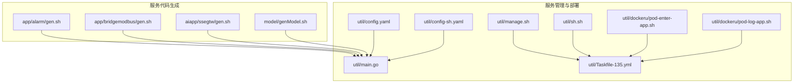
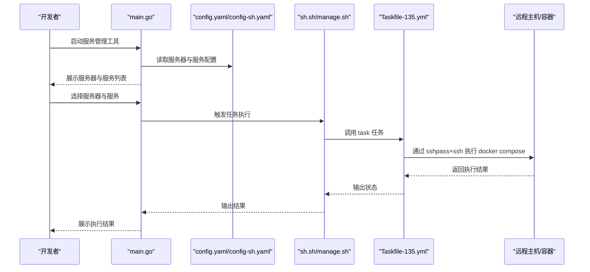
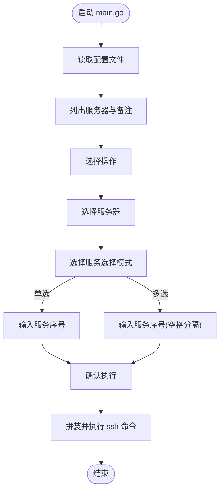
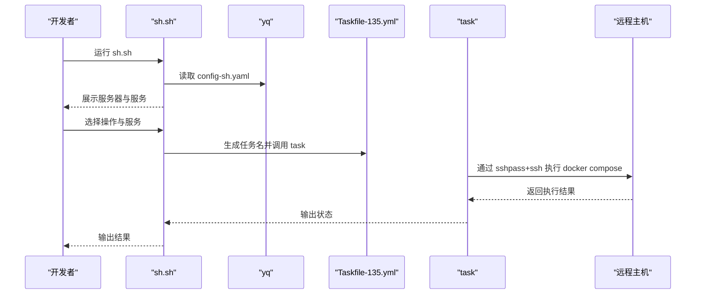
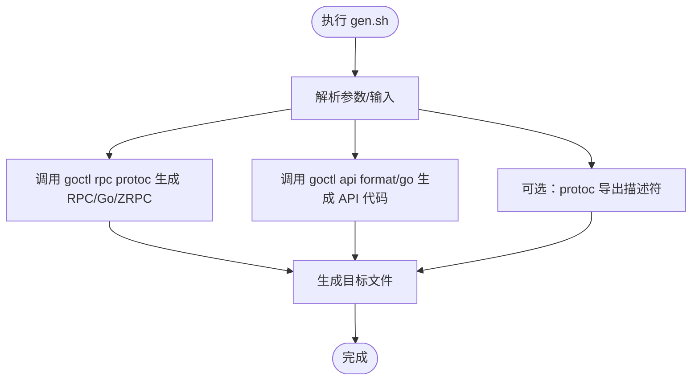
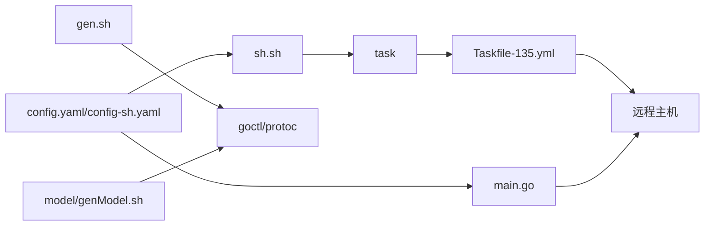

# 代码生成工具

<cite>
**本文引用的文件**
- [util/config.yaml](file://util/config.yaml)
- [util/config-sh.yaml](file://util/config-sh.yaml)
- [util/manage.sh](file://util/manage.sh)
- [util/sh.sh](file://util/sh.sh)
- [util/main.go](file://util/main.go)
- [util/Taskfile-135.yml](file://util/Taskfile-135.yml)
- [util/dockeru/pod-enter-app.sh](file://util/dockeru/pod-enter-app.sh)
- [util/dockeru/pod-log-app.sh](file://util/dockeru/pod-log-app.sh)
- [model/genModel.sh](file://model/genModel.sh)
- [app/alarm/gen.sh](file://app/alarm/gen.sh)
- [app/bridgemodbus/gen.sh](file://app/bridgemodbus/gen.sh)
- [aiapp/ssegtw/gen.sh](file://aiapp/ssegtw/gen.sh)
</cite>

## 目录
1. [简介](#简介)
2. [项目结构](#项目结构)
3. [核心组件](#核心组件)
4. [架构总览](#架构总览)
5. [详细组件分析](#详细组件分析)
6. [依赖关系分析](#依赖关系分析)
7. [性能考虑](#性能考虑)
8. [故障排除指南](#故障排除指南)
9. [结论](#结论)
10. [附录](#附录)

## 简介
本指南面向 Zero-Service 项目中的“代码生成工具”体系，重点覆盖以下内容：
- gen.sh 脚本的使用方法与参数配置，以及代码生成的阶段与输出结果
- 多种配置文件的作用与使用场景，包括 config.yaml、config-sh.yaml 等
- 工具集中辅助脚本的应用场景，如 manage.sh、sh.sh、pod-enter-app.sh、pod-log-app.sh 等
- 基于仓库现有脚本的完整使用示例，帮助提升开发效率
- 最佳实践与常见问题排查建议

## 项目结构
本仓库在多个模块中提供了 gen.sh 用于生成 RPC/API 代码；同时在 util 目录下提供了基于 YAML 配置的服务管理与部署辅助脚本，以及模型代码生成脚本。

图表来源
- [app/alarm/gen.sh:1-4](file://app/alarm/gen.sh#L1-L4)
- [app/bridgemodbus/gen.sh:1-9](file://app/bridgemodbus/gen.sh#L1-L9)
- [aiapp/ssegtw/gen.sh:1-6](file://aiapp/ssegtw/gen.sh#L1-L6)
- [model/genModel.sh:1-25](file://model/genModel.sh#L1-L25)
- [util/config.yaml:1-26](file://util/config.yaml#L1-L26)
- [util/config-sh.yaml:1-20](file://util/config-sh.yaml#L1-L20)
- [util/main.go:1-547](file://util/main.go#L1-L547)
- [util/manage.sh:1-35](file://util/manage.sh#L1-L35)
- [util/sh.sh:1-159](file://util/sh.sh#L1-L159)
- [util/Taskfile-135.yml:1-37](file://util/Taskfile-135.yml#L1-L37)
- [util/dockeru/pod-enter-app.sh:1-17](file://util/dockeru/pod-enter-app.sh#L1-L17)
- [util/dockeru/pod-log-app.sh:1-23](file://util/dockeru/pod-log-app.sh#L1-L23)

章节来源
- [util/config.yaml:1-26](file://util/config.yaml#L1-L26)
- [util/config-sh.yaml:1-20](file://util/config-sh.yaml#L1-L20)
- [util/main.go:1-547](file://util/main.go#L1-L547)
- [util/manage.sh:1-35](file://util/manage.sh#L1-L35)
- [util/sh.sh:1-159](file://util/sh.sh#L1-L159)
- [util/Taskfile-135.yml:1-37](file://util/Taskfile-135.yml#L1-L37)
- [util/dockeru/pod-enter-app.sh:1-17](file://util/dockeru/pod-enter-app.sh#L1-L17)
- [util/dockeru/pod-log-app.sh:1-23](file://util/dockeru/pod-log-app.sh#L1-L23)
- [model/genModel.sh:1-25](file://model/genModel.sh#L1-L25)
- [app/alarm/gen.sh:1-4](file://app/alarm/gen.sh#L1-L4)
- [app/bridgemodbus/gen.sh:1-9](file://app/bridgemodbus/gen.sh#L1-L9)
- [aiapp/ssegtw/gen.sh:1-6](file://aiapp/ssegtw/gen.sh#L1-L6)

## 核心组件
- 代码生成脚本（gen.sh）
  - app/* 下的 gen.sh：调用 goctl 进行 proto 到 go/zrpc 的代码生成，并可附加 protoc 描述符导出
  - aiapp/* 下的 gen.sh：调用 goctl 对 API 文件进行格式化与 Go 代码生成
- 模型代码生成脚本（model/genModel.sh）：通过 goctl model 从数据库表生成模型代码
- 服务管理与部署工具
  - config.yaml / config-sh.yaml：定义远程服务器与服务清单的配置
  - main.go：交互式服务管理工具，支持运行、检查、镜像、保存、日志、进入容器等
  - manage.sh / sh.sh：封装任务执行与交互流程，配合 Taskfile-135.yml 使用
  - Taskfile-135.yml：定义 up/restart/stop/start 等 docker compose 操作任务
  - pod-enter-app.sh / pod-log-app.sh：Kubernetes 环境下进入 Pod 或查看日志的辅助脚本

章节来源
- [app/alarm/gen.sh:1-4](file://app/alarm/gen.sh#L1-L4)
- [app/bridgemodbus/gen.sh:1-9](file://app/bridgemodbus/gen.sh#L1-L9)
- [aiapp/ssegtw/gen.sh:1-6](file://aiapp/ssegtw/gen.sh#L1-L6)
- [model/genModel.sh:1-25](file://model/genModel.sh#L1-L25)
- [util/config.yaml:1-26](file://util/config.yaml#L1-L26)
- [util/config-sh.yaml:1-20](file://util/config-sh.yaml#L1-L20)
- [util/main.go:1-547](file://util/main.go#L1-L547)
- [util/manage.sh:1-35](file://util/manage.sh#L1-L35)
- [util/sh.sh:1-159](file://util/sh.sh#L1-L159)
- [util/Taskfile-135.yml:1-37](file://util/Taskfile-135.yml#L1-L37)
- [util/dockeru/pod-enter-app.sh:1-17](file://util/dockeru/pod-enter-app.sh#L1-L17)
- [util/dockeru/pod-log-app.sh:1-23](file://util/dockeru/pod-log-app.sh#L1-L23)

## 架构总览
整体工作流由“配置驱动 + 交互式/自动化脚本 + 任务编排”构成：
- 配置层：config.yaml 与 config-sh.yaml 定义服务器与服务清单
- 交互层：main.go 提供菜单式交互；sh.sh 提供更友好的选择流程
- 任务层：manage.sh 与 Taskfile-135.yml 统一调度 docker compose 操作
- 生成层：各模块的 gen.sh 负责 API/RPC 代码生成；model/genModel.sh 负责模型生成

图表来源
- [util/main.go:1-547](file://util/main.go#L1-L547)
- [util/config.yaml:1-26](file://util/config.yaml#L1-L26)
- [util/config-sh.yaml:1-20](file://util/config-sh.yaml#L1-L20)
- [util/sh.sh:1-159](file://util/sh.sh#L1-L159)
- [util/manage.sh:1-35](file://util/manage.sh#L1-L35)
- [util/Taskfile-135.yml:1-37](file://util/Taskfile-135.yml#L1-L37)

## 详细组件分析

### 配置文件：config.yaml 与 config-sh.yaml
- config.yaml
  - 用途：定义具体服务器与服务清单，适合固定环境
  - 关键字段：服务器标识、SSH 用户/主机/端口/密码、docker-compose 路径、服务名称列表、备注
- config-sh.yaml
  - 用途：定义通配符或占位符配置，便于批量或跨环境复用
  - 关键字段：同上，但允许使用通配符与占位符

使用建议
- 生产环境优先使用 config.yaml，确保参数明确
- 开发/测试多环境时，可用 config-sh.yaml 作为模板，结合脚本动态填充

章节来源
- [util/config.yaml:1-26](file://util/config.yaml#L1-L26)
- [util/config-sh.yaml:1-20](file://util/config-sh.yaml#L1-L20)

### 交互式服务管理：main.go
- 功能概览
  - 读取 YAML 配置，列出服务器与服务
  - 支持单选/多选服务，支持 start/stop/up/restart 等动作
  - 支持查看镜像、保存镜像、查看日志、进入容器等
- 交互流程
  - 选择操作（run/check/image/save/log/exec）
  - 选择服务器与服务
  - 确认后通过 sshpass+ssh 在远端执行 docker compose 命令
- 注意事项
  - 需要安装 sshpass 并确保远端可达
  - 日志与进入容器功能会建立交互式会话

图表来源
- [util/main.go:1-547](file://util/main.go#L1-L547)

章节来源
- [util/main.go:1-547](file://util/main.go#L1-L547)

### 自动化服务管理：sh.sh 与 manage.sh
- sh.sh
  - 读取 config-sh.yaml，列出服务器与服务
  - 支持单选/多选服务，生成任务名（如 up-docker），调用 task 执行
  - 通过 yq 解析 YAML，支持交互式确认
- manage.sh
  - 接收命令与服务名，生成任务名（如 restart-docker），调用 task
  - 支持 restart/up/stop/start 四类命令

图表来源
- [util/sh.sh:1-159](file://util/sh.sh#L1-L159)
- [util/Taskfile-135.yml:1-37](file://util/Taskfile-135.yml#L1-L37)

章节来源
- [util/sh.sh:1-159](file://util/sh.sh#L1-L159)
- [util/manage.sh:1-35](file://util/manage.sh#L1-L35)
- [util/Taskfile-135.yml:1-37](file://util/Taskfile-135.yml#L1-L37)

### 代码生成：gen.sh 与模型生成
- app/* 下的 gen.sh
  - 典型流程：打印“开始生成”，调用 goctl rpc protoc 生成 go/grpc/zrpc 代码，必要时追加 protoc 导出描述符
  - 参数：--go_out/--go-grpc_out/--zrpc_out，--client=false 控制是否生成客户端
- aiapp/* 下的 gen.sh
  - 典型流程：先格式化 API 文件，再生成 Go 代码
- model/genModel.sh
  - 输入：数据库名与表名（作为参数传入）
  - 功能：调用 goctl model mysql datasource 生成模型代码，支持禁用缓存与风格定制

图表来源
- [app/alarm/gen.sh:1-4](file://app/alarm/gen.sh#L1-L4)
- [app/bridgemodbus/gen.sh:1-9](file://app/bridgemodbus/gen.sh#L1-L9)
- [aiapp/ssegtw/gen.sh:1-6](file://aiapp/ssegtw/gen.sh#L1-L6)
- [model/genModel.sh:1-25](file://model/genModel.sh#L1-L25)

章节来源
- [app/alarm/gen.sh:1-4](file://app/alarm/gen.sh#L1-L4)
- [app/bridgemodbus/gen.sh:1-9](file://app/bridgemodbus/gen.sh#L1-L9)
- [aiapp/ssegtw/gen.sh:1-6](file://aiapp/ssegtw/gen.sh#L1-L6)
- [model/genModel.sh:1-25](file://model/genModel.sh#L1-L25)

### Kubernetes 辅助：pod-enter-app.sh 与 pod-log-app.sh
- pod-enter-app.sh：列出命名空间内运行中的 Pod，交互式选择后进入容器
- pod-log-app.sh：列出运行中的 Pod，交互式选择后实时查看日志（带尾部行数）

章节来源
- [util/dockeru/pod-enter-app.sh:1-17](file://util/dockeru/pod-enter-app.sh#L1-L17)
- [util/dockeru/pod-log-app.sh:1-23](file://util/dockeru/pod-log-app.sh#L1-L23)

## 依赖关系分析
- 配置依赖
  - main.go 依赖 config.yaml 或 config-sh.yaml 提供的服务器与服务清单
  - sh.sh 依赖 config-sh.yaml 与 yq 工具解析 YAML
- 任务依赖
  - manage.sh 与 sh.sh 通过 task 调用 Taskfile-135.yml 中的任务
  - Taskfile-135.yml 依赖 sshpass 与 ssh 连接远端主机
- 生成依赖
  - gen.sh 依赖 goctl 与 protoc
  - model/genModel.sh 依赖 goctl model 与数据库连接

图表来源
- [util/config.yaml:1-26](file://util/config.yaml#L1-L26)
- [util/config-sh.yaml:1-20](file://util/config-sh.yaml#L1-L20)
- [util/main.go:1-547](file://util/main.go#L1-L547)
- [util/sh.sh:1-159](file://util/sh.sh#L1-L159)
- [util/manage.sh:1-35](file://util/manage.sh#L1-L35)
- [util/Taskfile-135.yml:1-37](file://util/Taskfile-135.yml#L1-L37)
- [app/alarm/gen.sh:1-4](file://app/alarm/gen.sh#L1-L4)
- [model/genModel.sh:1-25](file://model/genModel.sh#L1-L25)

章节来源
- [util/config.yaml:1-26](file://util/config.yaml#L1-L26)
- [util/config-sh.yaml:1-20](file://util/config-sh.yaml#L1-L20)
- [util/main.go:1-547](file://util/main.go#L1-L547)
- [util/sh.sh:1-159](file://util/sh.sh#L1-L159)
- [util/manage.sh:1-35](file://util/manage.sh#L1-L35)
- [util/Taskfile-135.yml:1-37](file://util/Taskfile-135.yml#L1-L37)
- [app/alarm/gen.sh:1-4](file://app/alarm/gen.sh#L1-L4)
- [model/genModel.sh:1-25](file://model/genModel.sh#L1-L25)

## 性能考虑
- 生成阶段
  - 使用 goctl 与 protoc 时，尽量避免重复生成，合理组织 API/Proto 文件，减少不必要的重新编译
  - 模型生成建议开启缓存策略（默认 cache=false，按需调整）
- 远程执行
  - sshpass+ssh 的网络往返开销较大，建议合并多次操作或使用本地 docker compose 进行联调
  - 多服务批量操作时，优先使用多选模式减少交互次数

## 故障排除指南
- 配置相关
  - config.yaml 与 config-sh.yaml 字段缺失或格式错误会导致读取失败
  - 通配符与占位符未正确解析时，需检查 yq 版本与语法
- 任务执行
  - sshpass 未安装或权限不足会导致连接失败
  - Taskfile-135.yml 中变量未注入（如 SSH_USER/SSH_HOST 等）会导致任务失败
- 生成工具
  - goctl/protoc 未安装或版本不兼容会导致生成失败
  - 模型生成时数据库连接参数错误会导致生成中断
- Kubernetes
  - pod-enter-app.sh/pod-log-app.sh 需要 kubectl 权限与正确的命名空间

章节来源
- [util/main.go:1-547](file://util/main.go#L1-L547)
- [util/sh.sh:1-159](file://util/sh.sh#L1-L159)
- [util/Taskfile-135.yml:1-37](file://util/Taskfile-135.yml#L1-L37)
- [model/genModel.sh:1-25](file://model/genModel.sh#L1-L25)

## 结论
本指南梳理了 Zero-Service 项目中的代码生成与服务管理工具链：gen.sh 用于快速生成 RPC/API 代码，model/genModel.sh 用于模型生成；config.yaml/config-sh.yaml 驱动交互式与自动化管理工具，配合 manage.sh/sh.sh 与 Taskfile-135.yml 实现统一的任务编排。通过规范配置与脚本使用，可显著提升开发与运维效率。

## 附录

### 使用示例：RPC/API 代码生成
- app/alarm/gen.sh
  - 步骤：在模块根目录执行脚本，自动完成 proto 到 go/zrpc 的生成
  - 参考路径：[app/alarm/gen.sh:1-4](file://app/alarm/gen.sh#L1-L4)
- app/bridgemodbus/gen.sh
  - 步骤：先生成 RPC 代码，再导出描述符
  - 参考路径：[app/bridgemodbus/gen.sh:1-9](file://app/bridgemodbus/gen.sh#L1-L9)
- aiapp/ssegtw/gen.sh
  - 步骤：先格式化 API，再生成 Go 代码
  - 参考路径：[aiapp/ssegtw/gen.sh:1-6](file://aiapp/ssegtw/gen.sh#L1-L6)

章节来源
- [app/alarm/gen.sh:1-4](file://app/alarm/gen.sh#L1-L4)
- [app/bridgemodbus/gen.sh:1-9](file://app/bridgemodbus/gen.sh#L1-L9)
- [aiapp/ssegtw/gen.sh:1-6](file://aiapp/ssegtw/gen.sh#L1-L6)

### 使用示例：服务管理与部署
- 交互式管理（main.go）
  - 步骤：运行程序，按提示选择服务器与服务，执行 start/stop/up/restart 等操作
  - 参考路径：[util/main.go:1-547](file://util/main.go#L1-L547)
- 自动化管理（sh.sh + manage.sh + Taskfile-135.yml）
  - 步骤：运行 sh.sh 选择服务器与服务，生成任务名并调用 task；或直接调用 manage.sh
  - 参考路径：
    - [util/sh.sh:1-159](file://util/sh.sh#L1-L159)
    - [util/manage.sh:1-35](file://util/manage.sh#L1-L35)
    - [util/Taskfile-135.yml:1-37](file://util/Taskfile-135.yml#L1-L37)

章节来源
- [util/main.go:1-547](file://util/main.go#L1-L547)
- [util/sh.sh:1-159](file://util/sh.sh#L1-L159)
- [util/manage.sh:1-35](file://util/manage.sh#L1-L35)
- [util/Taskfile-135.yml:1-37](file://util/Taskfile-135.yml#L1-L37)

### 使用示例：模型代码生成
- model/genModel.sh
  - 步骤：传入数据库名与表名，生成模型代码至 genModel 目录
  - 参考路径：[model/genModel.sh:1-25](file://model/genModel.sh#L1-L25)

章节来源
- [model/genModel.sh:1-25](file://model/genModel.sh#L1-L25)

### 使用示例：Kubernetes 辅助
- 进入 Pod：运行 pod-enter-app.sh，按提示选择 Pod 并进入
  - 参考路径：[util/dockeru/pod-enter-app.sh:1-17](file://util/dockeru/pod-enter-app.sh#L1-L17)
- 查看日志：运行 pod-log-app.sh，按提示选择 Pod 并查看日志
  - 参考路径：[util/dockeru/pod-log-app.sh:1-23](file://util/dockeru/pod-log-app.sh#L1-L23)

章节来源
- [util/dockeru/pod-enter-app.sh:1-17](file://util/dockeru/pod-enter-app.sh#L1-L17)
- [util/dockeru/pod-log-app.sh:1-23](file://util/dockeru/pod-log-app.sh#L1-L23)