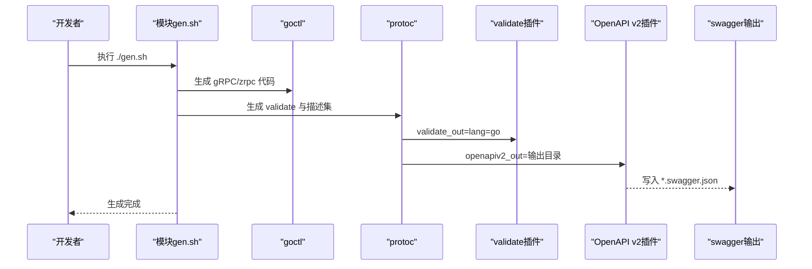
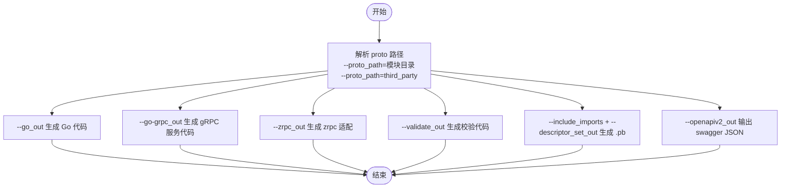
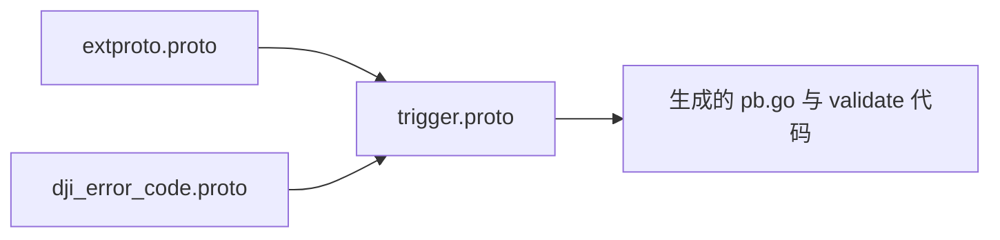
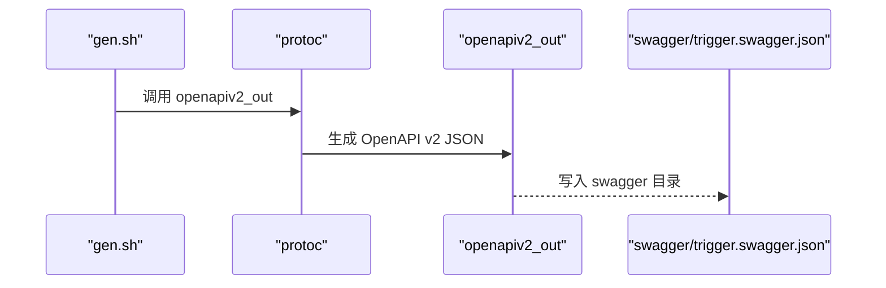
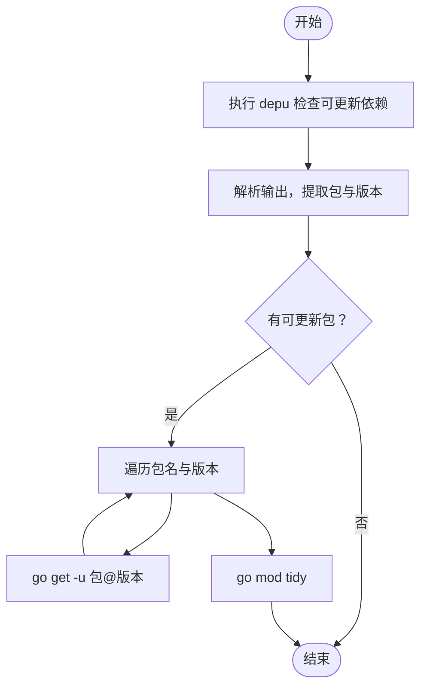
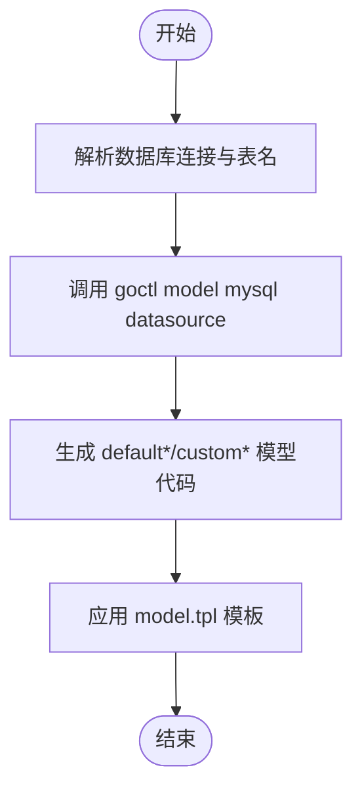
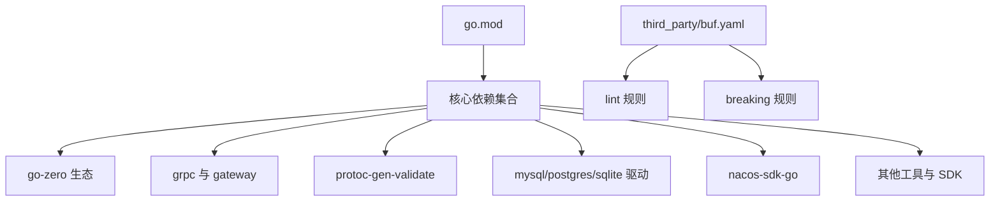

# 代码生成工具

<cite>
**本文引用的文件**
- [third_party/gen.sh](file://third_party/gen.sh)
- [update_deps.sh](file://update_deps.sh)
- [go.mod](file://go.mod)
- [app/trigger/gen.sh](file://app/trigger/gen.sh)
- [app/trigger/trigger.proto](file://app/trigger/trigger.proto)
- [swagger/trigger.swagger.json](file://swagger/trigger.swagger.json)
- [app/trigger/etc/trigger.yaml](file://app/trigger/etc/trigger.yaml)
- [third_party/extproto.proto](file://third_party/extproto.proto)
- [third_party/dji_error_code.proto](file://third_party/dji_error_code.proto)
- [third_party/buf.yaml](file://third_party/buf.yaml)
- [model/genModel.sh](file://model/genModel.sh)
- [1.7.1/model/model.tpl](file://1.7.1/model/model.tpl)
- [util/manage.sh](file://util/manage.sh)
- [util/Taskfile.yml](file://util/Taskfile.yml)
</cite>

## 目录
1. [简介](#简介)
2. [项目结构](#项目结构)
3. [核心组件](#核心组件)
4. [架构总览](#架构总览)
5. [详细组件分析](#详细组件分析)
6. [依赖分析](#依赖分析)
7. [性能考虑](#性能考虑)
8. [故障排查指南](#故障排查指南)
9. [结论](#结论)
10. [附录](#附录)

## 简介
本指南面向 zero-service 项目中的代码生成工具，覆盖以下主题：
- Protocol Buffers 代码生成：如何基于 proto 文件生成 gRPC 服务代码、客户端代码与验证代码，并输出 Swagger 文档。
- Swagger 文档生成：如何将 proto 导出为 OpenAPI v2 JSON，供前端或文档平台消费。
- 第三方依赖管理：如何更新 Go 依赖版本与同步第三方协议定义。
- 最佳实践：版本控制、增量生成、错误处理与一致性保障。
- 常见问题排查：生成失败、依赖不一致、跨模块引用等问题的定位与修复。

## 项目结构
本项目围绕“每个应用模块一个 gen.sh”的约定组织生成脚本，统一通过 goctl 与 protoc 完成生成流程。第三方公共协议定义集中于 third_party 目录，供各模块共享引用。

```mermaid
graph TB
subgraph "应用模块"
A["app/trigger/gen.sh"]
B["app/bridgedump/gen.sh"]
C["app/bridgegtw/gen.sh"]
D["app/bridgemodbus/gen.sh"]
E["app/bridgemqtt/gen.sh"]
F["app/file/gen.sh"]
G["app/gis/gen.sh"]
H["app/iecagent/gen.sh"]
I["app/ieccaller/gen.sh"]
J["app/iecstash/gen.sh"]
K["app/lalhook/gen.sh"]
L["app/lalproxy/gen.sh"]
M["app/logdump/gen.sh"]
N["app/podengine/gen.sh"]
O["app/trigger/gen.sh"]
P["app/xfusionmock/gen.sh"]
Q["zerorpc/gen.sh"]
R["socketapp/socketgtw/gen.sh"]
S["socketapp/socketpush/gen.sh"]
end
subgraph "第三方协议"
TP["third_party/extproto.proto"]
TD["third_party/dji_error_code.proto"]
TB["third_party/buf.yaml"]
TG["third_party/gen.sh"]
end
subgraph "模型生成"
GM["model/genModel.sh"]
MT["1.7.1/model/model.tpl"]
end
subgraph "依赖管理"
UD["update_deps.sh"]
MOD["go.mod"]
end
A --> TP
A --> TD
B --> TP
B --> TD
C --> TP
C --> TD
D --> TP
D --> TD
E --> TP
E --> TD
F --> TP
F --> TD
G --> TP
G --> TD
H --> TP
H --> TD
I --> TP
I --> TD
J --> TP
J --> TD
K --> TP
K --> TD
L --> TP
L --> TD
M --> TP
M --> TD
N --> TP
N --> TD
O --> TP
O --> TD
P --> TP
P --> TD
Q --> TP
Q --> TD
R --> TP
R --> TD
S --> TP
S --> TD
TG --> TP
TG --> TD
GM --> MT
UD --> MOD
```

**图表来源**
- [app/trigger/gen.sh:1-19](file://app/trigger/gen.sh#L1-L19)
- [third_party/extproto.proto:1-75](file://third_party/extproto.proto#L1-L75)
- [third_party/dji_error_code.proto:1-513](file://third_party/dji_error_code.proto#L1-L513)
- [third_party/gen.sh:1-37](file://third_party/gen.sh#L1-L37)
- [model/genModel.sh:1-25](file://model/genModel.sh#L1-L25)
- [1.7.1/model/model.tpl:1-39](file://1.7.1/model/model.tpl#L1-L39)
- [update_deps.sh:1-43](file://update_deps.sh#L1-L43)
- [go.mod:1-245](file://go.mod#L1-L245)

**章节来源**
- [app/trigger/gen.sh:1-19](file://app/trigger/gen.sh#L1-L19)
- [third_party/gen.sh:1-37](file://third_party/gen.sh#L1-L37)
- [model/genModel.sh:1-25](file://model/genModel.sh#L1-L25)
- [update_deps.sh:1-43](file://update_deps.sh#L1-L43)
- [go.mod:1-245](file://go.mod#L1-L245)

## 核心组件
- 应用模块生成脚本：每个模块的 gen.sh 负责调用 goctl 与 protoc，生成 gRPC 代码、zrpc 客户端/服务端适配、validate 校验代码与 OpenAPI v2 文档。
- 第三方协议：extproto.proto 定义通用上下文与错误码，dji_error_code.proto 定义大疆错误码枚举，供多模块复用。
- 依赖管理：update_deps.sh 自动解析依赖更新并执行 go get -u，最后 go mod tidy 整理依赖。
- 模型生成：genModel.sh 基于数据库表生成 Model 层代码，结合模板定制接口与缓存行为。
- 配置与文档：各模块的 etc/*.yaml 提供运行时配置；swagger/*.swagger.json 由生成脚本产出。

**章节来源**
- [app/trigger/gen.sh:1-19](file://app/trigger/gen.sh#L1-L19)
- [third_party/extproto.proto:1-75](file://third_party/extproto.proto#L1-L75)
- [third_party/dji_error_code.proto:1-513](file://third_party/dji_error_code.proto#L1-L513)
- [update_deps.sh:1-43](file://update_deps.sh#L1-L43)
- [model/genModel.sh:1-25](file://model/genModel.sh#L1-L25)

## 架构总览
下图展示一次典型生成流程：应用模块的 gen.sh 调用 goctl 与 protoc，前者生成 gRPC 与 zrpc 代码，后者生成 validate 与 OpenAPI 文档。

**图表来源**
- [app/trigger/gen.sh:4-18](file://app/trigger/gen.sh#L4-L18)
- [swagger/trigger.swagger.json:1-50](file://swagger/trigger.swagger.json#L1-L50)

**章节来源**
- [app/trigger/gen.sh:1-19](file://app/trigger/gen.sh#L1-L19)
- [swagger/trigger.swagger.json:1-50](file://swagger/trigger.swagger.json#L1-L50)

## 详细组件分析

### gen.sh 工作原理与生成流程
- goctl rpc protoc：生成 gRPC 服务与 zrpc 适配代码，支持 go_out、go-grpc_out、zrpc_out，可按需开启/关闭 client 侧生成。
- protoc 链路：
  - validate_out：生成带校验注解的 Go 代码，依赖 validate/validate.proto。
  - include_imports + descriptor_set_out：生成 .pb 文件，便于下游工具或集成。
  - openapiv2_out：生成 OpenAPI v2 JSON 文档，输出到 swagger 目录。
- 第三方 proto 引用：gen.sh 通过 proto_path 指向 third_party，确保 extproto 与 dji_error_code 可被正确解析。

**图表来源**
- [app/trigger/gen.sh:4-18](file://app/trigger/gen.sh#L4-L18)

**章节来源**
- [app/trigger/gen.sh:1-19](file://app/trigger/gen.sh#L1-L19)

### 第三方协议与错误码
- extproto.proto：定义 CurrentUser、Dept 等通用上下文，以及 Code 错误码枚举，供各模块统一使用。
- dji_error_code.proto：定义大疆平台错误码枚举，便于跨模块统一错误语义。
- third_party/gen.sh：清理旧产物、生成目标 proto、移动产物到预期目录，并删除多余目录，确保生成结果稳定。

**图表来源**
- [third_party/extproto.proto:1-75](file://third_party/extproto.proto#L1-L75)
- [third_party/dji_error_code.proto:1-513](file://third_party/dji_error_code.proto#L1-L513)
- [app/trigger/trigger.proto:1-120](file://app/trigger/trigger.proto#L1-L120)
- [third_party/gen.sh:1-37](file://third_party/gen.sh#L1-L37)

**章节来源**
- [third_party/extproto.proto:1-75](file://third_party/extproto.proto#L1-L75)
- [third_party/dji_error_code.proto:1-513](file://third_party/dji_error_code.proto#L1-L513)
- [third_party/gen.sh:1-37](file://third_party/gen.sh#L1-L37)

### Swagger 文档生成
- 触发方式：protoc 的 openapiv2_out 插件将生成的 swagger JSON 写入 swagger 目录。
- 产物位置：swagger/trigger.swagger.json 等。
- 使用场景：前端对接、API 文档平台、Postman 导入等。

**图表来源**
- [app/trigger/gen.sh:17-18](file://app/trigger/gen.sh#L17-L18)
- [swagger/trigger.swagger.json:1-50](file://swagger/trigger.swagger.json#L1-L50)

**章节来源**
- [app/trigger/gen.sh:1-19](file://app/trigger/gen.sh#L1-L19)
- [swagger/trigger.swagger.json:1-50](file://swagger/trigger.swagger.json#L1-L50)

### 依赖更新脚本
- update_deps.sh：解析 depu 输出，提取包名与最新版本，逐个执行 go get -u，最后 go mod tidy。
- 适用场景：批量更新 Go 依赖版本，保持依赖树整洁。

**图表来源**
- [update_deps.sh:1-43](file://update_deps.sh#L1-L43)
- [go.mod:1-245](file://go.mod#L1-L245)

**章节来源**
- [update_deps.sh:1-43](file://update_deps.sh#L1-L43)
- [go.mod:1-245](file://go.mod#L1-L245)

### 模型生成与模板
- model/genModel.sh：基于数据库表生成 Model 代码，支持缓存配置与 gozero 风格。
- 1.7.1/model/model.tpl：模板定义接口与实现，支持自定义扩展与缓存选项。

**图表来源**
- [model/genModel.sh:1-25](file://model/genModel.sh#L1-L25)
- [1.7.1/model/model.tpl:1-39](file://1.7.1/model/model.tpl#L1-L39)

**章节来源**
- [model/genModel.sh:1-25](file://model/genModel.sh#L1-L25)
- [1.7.1/model/model.tpl:1-39](file://1.7.1/model/model.tpl#L1-L39)

### 配置与运行
- 各模块 etc/*.yaml：包含服务监听地址、日志、Nacos、Redis、DB 等配置项，生成后直接参与服务启动。
- 以 trigger 为例：包含 Name、ListenOn、Log、NacosConfig、Redis、DB、StreamEventConf 等。

**章节来源**
- [app/trigger/etc/trigger.yaml:1-37](file://app/trigger/etc/trigger.yaml#L1-L37)

## 依赖分析
- go.mod：集中声明所有依赖与间接依赖，含 go-zero 生态、grpc-gateway、validate、nacos、mysql、pq 等。
- 第三方协议：buf.yaml 定义 lint 与 breaking 规则，third_party 目录作为公共 proto 源。

**图表来源**
- [go.mod:1-245](file://go.mod#L1-L245)
- [third_party/buf.yaml:1-12](file://third_party/buf.yaml#L1-L12)

**章节来源**
- [go.mod:1-245](file://go.mod#L1-L245)
- [third_party/buf.yaml:1-12](file://third_party/buf.yaml#L1-L12)

## 性能考虑
- 生成粒度：按模块独立生成，避免全量重建带来的编译与生成成本。
- 增量生成：仅在 proto 或模板变更时触发生成，减少不必要的 IO 与编译。
- 依赖隔离：third_party 作为公共层，避免重复生成与版本漂移。
- 依赖整理：使用 go mod tidy 保持依赖树最小化，降低构建体积与潜在冲突。

## 故障排查指南
- 生成失败（找不到第三方 proto）
  - 症状：protoc 报错找不到 extproto 或 dji_error_code。
  - 处理：确认 gen.sh 的 proto_path 包含 third_party；确保 third_party/gen.sh 已执行生成。
  - 参考
    - [app/trigger/gen.sh:10-10](file://app/trigger/gen.sh#L10-L10)
    - [third_party/gen.sh:12-29](file://third_party/gen.sh#L12-L29)
- 依赖更新失败
  - 症状：depu 输出解析异常或 go get -u 失败。
  - 处理：检查网络与镜像源；手动执行 go get -u 对应包；最后运行 go mod tidy。
  - 参考
    - [update_deps.sh:25-38](file://update_deps.sh#L25-L38)
    - [go.mod:1-245](file://go.mod#L1-L245)
- Swagger 文档为空
  - 症状：swagger JSON 中 paths 为空。
  - 处理：确认 protoc 的 openapiv2_out 输出目录与模块 API 定义一致；检查服务方法是否正确标注。
  - 参考
    - [app/trigger/gen.sh:17-18](file://app/trigger/gen.sh#L17-L18)
    - [swagger/trigger.swagger.json:1-50](file://swagger/trigger.swagger.json#L1-L50)
- 模型生成异常
  - 症状：数据库连接失败或表名不匹配。
  - 处理：核对 genModel.sh 的数据库连接参数与表名；确认模板路径与风格参数。
  - 参考
    - [model/genModel.sh:14-24](file://model/genModel.sh#L14-L24)
    - [1.7.1/model/model.tpl:1-39](file://1.7.1/model/model.tpl#L1-L39)

**章节来源**
- [app/trigger/gen.sh:1-19](file://app/trigger/gen.sh#L1-L19)
- [third_party/gen.sh:1-37](file://third_party/gen.sh#L1-L37)
- [update_deps.sh:1-43](file://update_deps.sh#L1-L43)
- [swagger/trigger.swagger.json:1-50](file://swagger/trigger.swagger.json#L1-L50)
- [model/genModel.sh:1-25](file://model/genModel.sh#L1-L25)
- [1.7.1/model/model.tpl:1-39](file://1.7.1/model/model.tpl#L1-L39)

## 结论
本指南系统梳理了 zero-service 的代码生成体系：以模块化 gen.sh 为核心，结合 third_party 公共协议、protoc 插件链路与依赖管理脚本，形成可复用、可演进的生成流水线。遵循增量生成、版本控制与一致性规则，可显著提升开发效率与协作质量。

## 附录
- 常用命令速查
  - 生成 gRPC 与 zrpc：在模块目录执行 gen.sh
  - 生成 Swagger：确保 openapiv2_out 正常输出
  - 更新依赖：执行 update_deps.sh
  - 生成模型：执行 model/genModel.sh 并应用模板
- 最佳实践清单
  - 保持 third_party 协议版本与模块 proto 同步
  - 生成后统一执行 go mod tidy
  - 在 CI 中加入生成与格式化检查
  - 对关键模块的 swagger 做回归测试