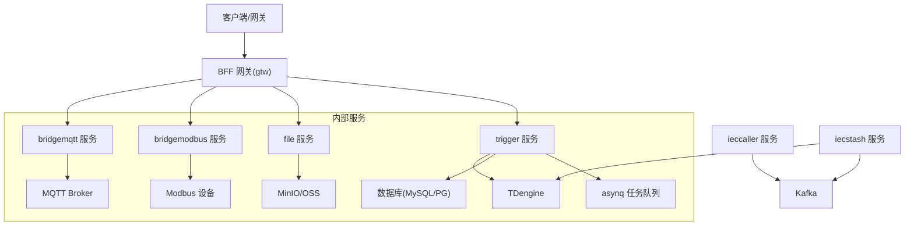
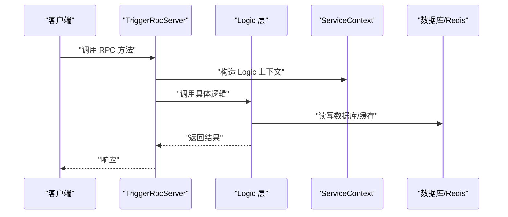
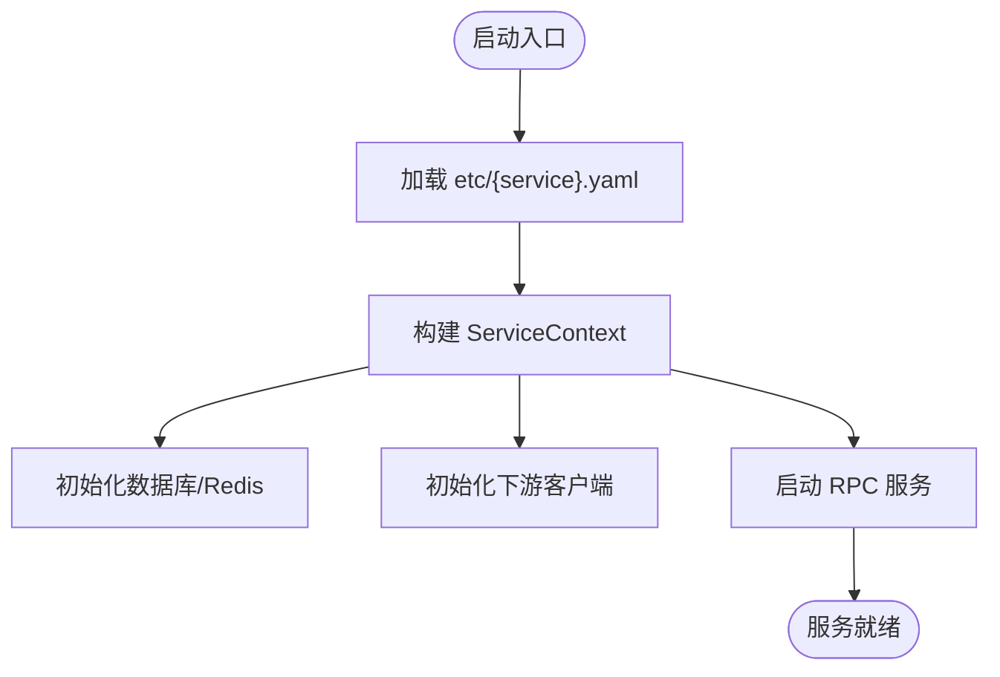
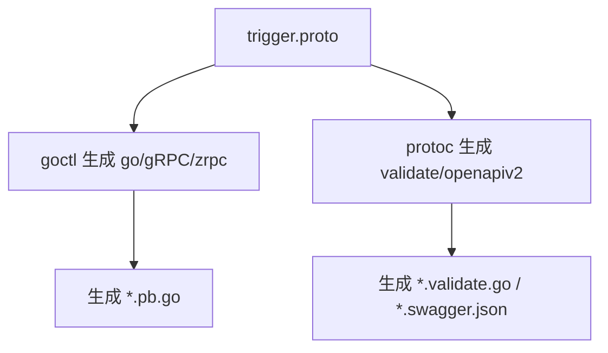
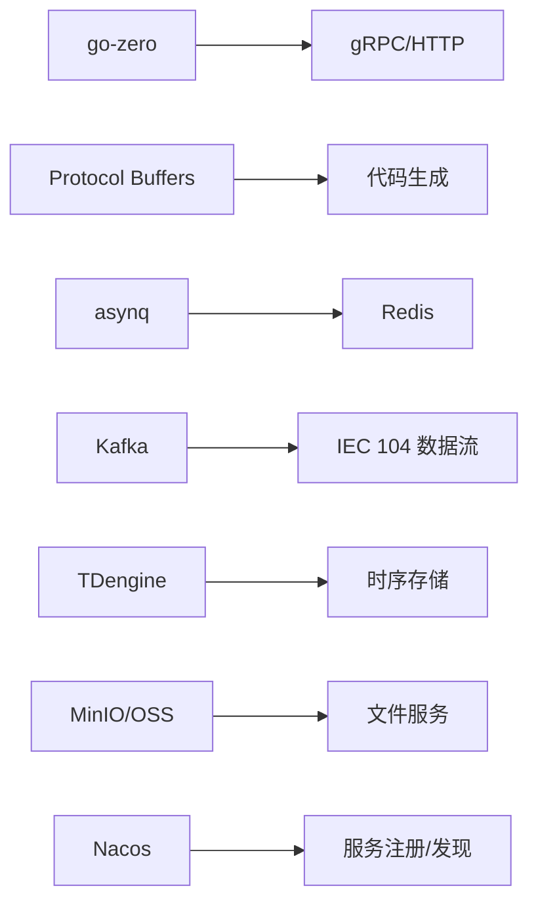

# 开发指南

<cite>
**本文引用的文件**
- [README.md](file://README.md)
- [go.mod](file://go.mod)
- [code.md](file://code.md)
- [app/trigger/trigger.proto](file://app/trigger/trigger.proto)
- [app/trigger/etc/trigger.yaml](file://app/trigger/etc/trigger.yaml)
- [app/trigger/internal/config/config.go](file://app/trigger/internal/config/config.go)
- [app/trigger/internal/server/triggerrpcserver.go](file://app/trigger/internal/server/triggerrpcserver.go)
- [app/trigger/internal/svc/servicecontext.go](file://app/trigger/internal/svc/servicecontext.go)
- [app/trigger/gen.sh](file://app/trigger/gen.sh)
- [common/Interceptor/rpcserver/loggerInterceptor.go](file://common/Interceptor/rpcserver/loggerInterceptor.go)
- [util/manage.sh](file://util/manage.sh)
</cite>

## 目录
1. [简介](#简介)
2. [项目结构](#项目结构)
3. [核心组件](#核心组件)
4. [架构总览](#架构总览)
5. [详细组件分析](#详细组件分析)
6. [依赖分析](#依赖分析)
7. [性能考虑](#性能考虑)
8. [故障排查指南](#故障排查指南)
9. [结论](#结论)
10. [附录](#附录)

## 简介
本指南面向 zero-service 项目的开发者，系统讲解基于 go-zero 的微服务开发范式，涵盖 Protocol Buffers 接口定义、代码生成、业务逻辑实现、配置与启动验证、代码规范、测试策略、调试技巧、开发工具使用、贡献流程以及常见问题与性能优化建议。项目采用 gRPC + grpc-gateway + Protocol Buffers 架构，结合 asynq 任务队列、Kafka、SocketIO、Nacos 等生态，支撑 IEC 104 数采、异步任务调度、实时通信、容器管理、地理信息、文件服务等场景。

## 项目结构
项目采用按服务分层的组织方式，核心目录如下：
- app：核心微服务集合，每个服务包含 proto 定义、配置 etc、内部逻辑 internal、入口文件等
- common：公共组件库，如拦截器、asynq 扩展、Nacos、Modbus、MQTT、OSS、GIS、Docker、工具等
- model：数据库模型与 SQL 脚本，提供模型生成脚本
- deploy：Docker Compose 编排
- docs/swagger/third_party：文档、Swagger 文档与第三方 proto
- util：辅助脚本与工具
- gtw/socketapp/facade：网关、实时通信与对外接口层

```mermaid
graph TB
subgraph "应用层(app)"
TRIGGER["trigger 服务"]
BRIDGEMODBUS["bridgemodbus 服务"]
BRIDGEMQTT["bridgemqtt 服务"]
FILE["file 服务"]
GIS["gis 服务"]
ALARM["alarm 服务"]
PODENGINE["podengine 服务"]
BRIDGEDUMP["bridgedump 服务"]
LALHOOK["lalhook 服务"]
LALPROXY["lalproxy 服务"]
LOGDUMP["logdump 服务"]
XFX["xfusionmock 服务"]
BRIDGEGTW["bridgegtw 服务"]
IECAGENT["iecagent 服务"]
IECCALLER["ieccaller 服务"]
IECSTASH["iecstash 服务"]
end
subgraph "公共库(common)"
INTERCEPTOR["拦截器"]
ASYNQ["asynq 扩展"]
NACOS["Nacos"]
MODBUSX["Modbus 扩展"]
MQTTS["MQTT 扩展"]
OSS["OSS 扩展"]
DBX["数据库扩展"]
GISX["GIS 扩展"]
DOCKERX["Docker 扩展"]
TOOL["工具"]
end
subgraph "基础设施"
REDIS["Redis(asynq)"]
KAFKA["Kafka"]
TDENGINE["TDengine"]
MYSQL["MySQL/Postgres"]
MINIO["MinIO/OSS"]
SOCKETIO["SocketIO"]
NACOS_SVC["Nacos 服务注册"]
end
TRIGGER --- REDIS
IECCALLER --- KAFKA
IECSTASH --- KAFKA
TRIGGER --- MYSQL
TRIGGER --- TDENGINE
FILE --- MINIO
PODENGINE --- DOCKERX
BRIDGEMODBUS --- MODBUSX
BRIDGEMQTT --- MQTTS
GIS --- GISX
TRIGGER --- ASYNQ
TRIGGER --- NACOS_SVC
BRIDGEMODBUS --- NACOS_SVC
BRIDGEMQTT --- NACOS_SVC
SOCKETIO --- SOCKETIO
```

图表来源
- [README.md:59-108](file://README.md#L59-L108)
- [go.mod:5-62](file://go.mod#L5-L62)

章节来源
- [README.md:59-108](file://README.md#L59-L108)

## 核心组件
- go-zero 微服务框架：提供 RPC、HTTP、配置、日志、中间件等基础能力
- gRPC + grpc-gateway：统一的跨语言服务接口，支持 HTTP 访问
- Protocol Buffers：服务契约定义与代码生成
- asynq：分布式任务队列与计划任务引擎
- Kafka：消息总线，支持 IEC 104 数据汇聚
- SocketIO：实时通信网关与推送
- Nacos：服务注册与发现
- 多数据库与对象存储：MySQL/PostgreSQL/SQLite、TDengine、MinIO/OSS/COS
- Docker：容器生命周期管理与编排

章节来源
- [README.md:207-225](file://README.md#L207-L225)
- [go.mod:5-62](file://go.mod#L5-L62)

## 架构总览
下图展示典型服务调用链路与外部系统集成：

图表来源
- [README.md:15-51](file://README.md#L15-L51)
- [README.md:112-131](file://README.md#L112-L131)

## 详细组件分析

### 服务开发标准流程
- 协议定义：在 app/{service}/{service}.proto 中定义服务接口与消息类型
- 代码生成：执行服务目录下的 gen.sh，生成 gRPC、zrpc、validate、swagger 等产物
- 逻辑实现：在 internal/logic 下实现具体业务逻辑
- 配置设置：在 etc/{service}.yaml 中配置监听、日志、Redis、数据库、Nacos、下游服务等
- 启动验证：本地运行入口文件，或使用 util/manage.sh 批量管理

章节来源
- [README.md:262-287](file://README.md#L262-L287)
- [app/trigger/gen.sh:1-19](file://app/trigger/gen.sh#L1-L19)

### gRPC 服务与拦截器
- 服务端拦截器：在 common/Interceptor/rpcserver/loggerInterceptor.go 中，从 gRPC 元数据提取用户上下文信息并注入到 context，统一记录错误日志
- 服务端绑定：app/trigger/internal/server/triggerrpcserver.go 自动生成，将每个 RPC 方法映射到对应的 logic 层
- 客户端拦截器：在 servicecontext 初始化 StreamEventClient 时，配置元数据拦截器与最大消息尺寸

图表来源
- [app/trigger/internal/server/triggerrpcserver.go:15-271](file://app/trigger/internal/server/triggerrpcserver.go#L15-L271)
- [app/trigger/internal/svc/servicecontext.go:29-91](file://app/trigger/internal/svc/servicecontext.go#L29-L91)
- [common/Interceptor/rpcserver/loggerInterceptor.go:12-44](file://common/Interceptor/rpcserver/loggerInterceptor.go#L12-L44)

章节来源
- [common/Interceptor/rpcserver/loggerInterceptor.go:12-44](file://common/Interceptor/rpcserver/loggerInterceptor.go#L12-L44)
- [app/trigger/internal/server/triggerrpcserver.go:15-271](file://app/trigger/internal/server/triggerrpcserver.go#L15-L271)
- [app/trigger/internal/svc/servicecontext.go:29-91](file://app/trigger/internal/svc/servicecontext.go#L29-L91)

### 配置与启动
- 配置结构：app/trigger/internal/config/config.go 定义了 RpcServerConf、NacosConfig、RedisDB、DB、DisableStmtLog、GracePeriod、StreamEventConf 等字段
- 配置文件：app/trigger/etc/trigger.yaml 提供监听地址、日志、Redis、数据库、下游 streamevent 等配置
- 启动命令：进入服务目录，执行 go run {service}.go -f etc/{service}.yaml

图表来源
- [app/trigger/etc/trigger.yaml:1-38](file://app/trigger/etc/trigger.yaml#L1-L38)
- [app/trigger/internal/config/config.go:9-27](file://app/trigger/internal/config/config.go#L9-L27)
- [app/trigger/internal/svc/servicecontext.go:50-91](file://app/trigger/internal/svc/servicecontext.go#L50-L91)

章节来源
- [app/trigger/etc/trigger.yaml:1-38](file://app/trigger/etc/trigger.yaml#L1-L38)
- [app/trigger/internal/config/config.go:9-27](file://app/trigger/internal/config/config.go#L9-L27)
- [app/trigger/internal/svc/servicecontext.go:50-91](file://app/trigger/internal/svc/servicecontext.go#L50-L91)

### 协议定义与代码生成
- 协议文件：app/trigger/trigger.proto 定义 TriggerRpc 服务与大量消息类型、枚举、验证规则
- 生成脚本：app/trigger/gen.sh 使用 goctl 与 protoc 生成 go/gRPC/zrpc/validate/openapiv2 等产物，并输出 swagger 文档
- 验证规则：引入 validate/validate.proto，对字段进行最小长度、范围、必填等约束

图表来源
- [app/trigger/trigger.proto:1-120](file://app/trigger/trigger.proto#L1-L120)
- [app/trigger/gen.sh:4-18](file://app/trigger/gen.sh#L4-L18)

章节来源
- [app/trigger/trigger.proto:1-120](file://app/trigger/trigger.proto#L1-L120)
- [app/trigger/gen.sh:4-18](file://app/trigger/gen.sh#L4-L18)

### 错误码规范
- 项目遵循 google.rpc.Code 错误码标准，HTTP 与 gRPC 错误码映射关系见 code.md
- 建议在业务层抛出标准错误码，并在响应中携带合适的错误详情（如 BadRequest、ResourceInfo、QuotaFailure）

章节来源
- [code.md:1-66](file://code.md#L1-L66)

### 开发工具与辅助脚本
- 代码生成：gen.sh 自动生成 RPC/validate/Swagger
- 服务编排：util/manage.sh 通过 task 命令批量控制服务启停/重启
- Docker Compose：deploy 目录提供默认编排，可按需调整

章节来源
- [app/trigger/gen.sh:1-19](file://app/trigger/gen.sh#L1-L19)
- [util/manage.sh:1-35](file://util/manage.sh#L1-L35)
- [README.md:300-318](file://README.md#L300-L318)

## 依赖分析
- 框架与 RPC：go-zero、grpc、grpc-gateway、protobuf
- 任务与消息：asynq、kafka-go、go-queue
- 数据库与 ORM：sqlx、goqu、mysql/postgres 驱动、sqlite
- 时序数据库：TDengine 驱动
- 对象存储：minio-go
- 实时通信：doquangtan/socketio
- 服务发现：nacos-sdk-go
- 地理信息：h3-go、mmcloughlin/geohash、orb/go-geom
- 容器：docker sdk
- 监控：OpenTelemetry、Prometheus

图表来源
- [go.mod:5-62](file://go.mod#L5-L62)
- [README.md:207-225](file://README.md#L207-L225)

章节来源
- [go.mod:5-62](file://go.mod#L5-L62)

## 性能考虑
- gRPC 最大消息尺寸：在客户端初始化时设置 MaxCallSendMsgSize 以支持大包传输
- 任务队列：合理设置 asynq 的并发与重试策略，避免热点队列阻塞
- 数据库：使用 goqu 与 sqlx，开启连接池与慢查询日志；必要时拆分读写库
- 缓存：Redis 作为 asynq 存储与会话缓存，注意键空间与过期策略
- 网关与上游：grpc-gateway 与 gRPC 负载均衡结合，避免单点瓶颈
- 监控：OpenTelemetry + Prometheus，建立关键指标看板

章节来源
- [app/trigger/internal/svc/servicecontext.go:79-87](file://app/trigger/internal/svc/servicecontext.go#L79-L87)

## 故障排查指南
- 启动失败
  - 检查 etc/{service}.yaml 配置是否正确（监听地址、Redis、数据库、下游服务）
  - 查看日志级别与路径配置，确认日志输出位置
- RPC 调用异常
  - 检查拦截器是否正确注入用户上下文与 TraceId
  - 确认 gRPC 最大消息尺寸设置是否满足业务需求
- 任务队列堆积
  - 使用 asynq Inspector 查看队列状态与延迟任务
  - 调整并发与重试策略，检查下游服务可用性
- 数据库/缓存问题
  - 核对 DataSource 与连接参数
  - 检查 DisableStmtLog 与慢查询日志开关
- Swagger/API 文档
  - 确认 protoc 生成 openapiv2 输出路径与文件名

章节来源
- [app/trigger/etc/trigger.yaml:1-38](file://app/trigger/etc/trigger.yaml#L1-L38)
- [app/trigger/internal/svc/servicecontext.go:50-91](file://app/trigger/internal/svc/servicecontext.go#L50-L91)
- [common/Interceptor/rpcserver/loggerInterceptor.go:12-44](file://common/Interceptor/rpcserver/loggerInterceptor.go#L12-L44)

## 结论
本指南提供了基于 go-zero 的零信任微服务开发全链路方法论，从协议定义、代码生成、逻辑实现、配置与启动验证，到工具使用、测试与调试、贡献流程与性能优化均有覆盖。建议在新服务开发中严格遵循“先协议、再生成、后实现”的流程，并充分利用公共组件与工具脚本提升开发效率与稳定性。

## 附录

### 服务开发最佳实践清单
- 协议设计
  - 使用 validate 规则约束输入参数
  - 保持消息类型简洁，避免过度嵌套
  - 为每个 RPC 方法设计明确的错误码与响应结构
- 代码生成
  - 修改 proto 后及时执行 gen.sh
  - 生成 swagger 文档并纳入版本管理
- 业务实现
  - 将复杂逻辑拆分为多个小逻辑单元，便于测试与维护
  - 使用 ServiceContext 注入依赖，避免直接 new
- 配置与部署
  - etc 下提供 dev/prd 两套配置模板
  - 使用 util/manage.sh 批量管理服务生命周期
- 测试与调试
  - 为关键逻辑编写单元测试
  - 使用 grpcurl 或 Swagger UI 验证接口
- 贡献与协作
  - Fork 仓库，创建特性分支，提交前运行格式化与测试
  - 提交信息清晰描述变更目的与影响范围

章节来源
- [README.md:262-287](file://README.md#L262-L287)
- [app/trigger/gen.sh:1-19](file://app/trigger/gen.sh#L1-L19)
- [util/manage.sh:1-35](file://util/manage.sh#L1-L35)