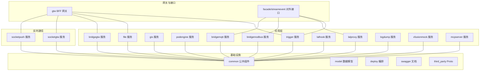
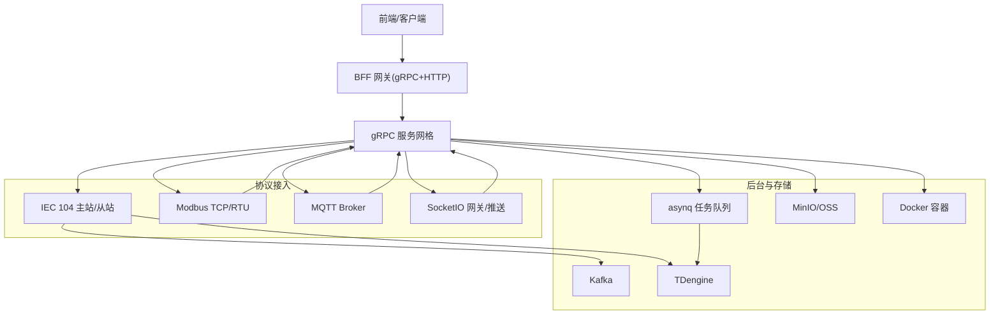
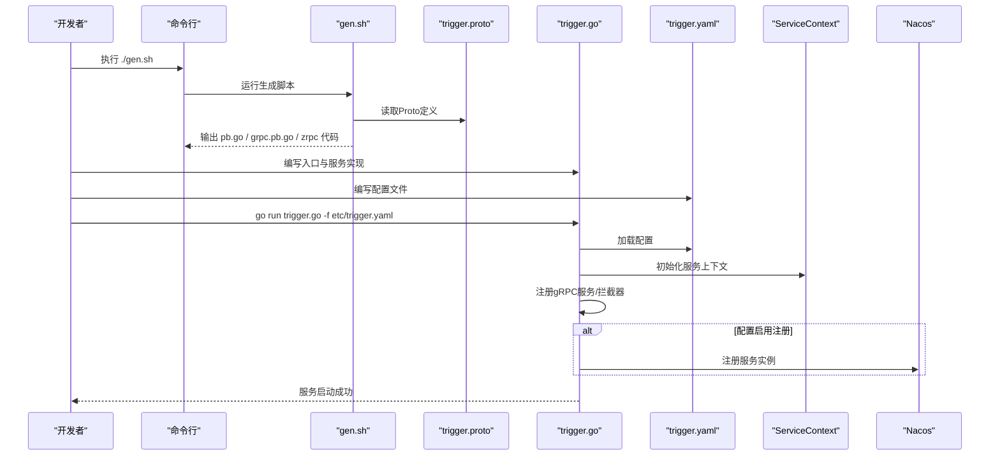
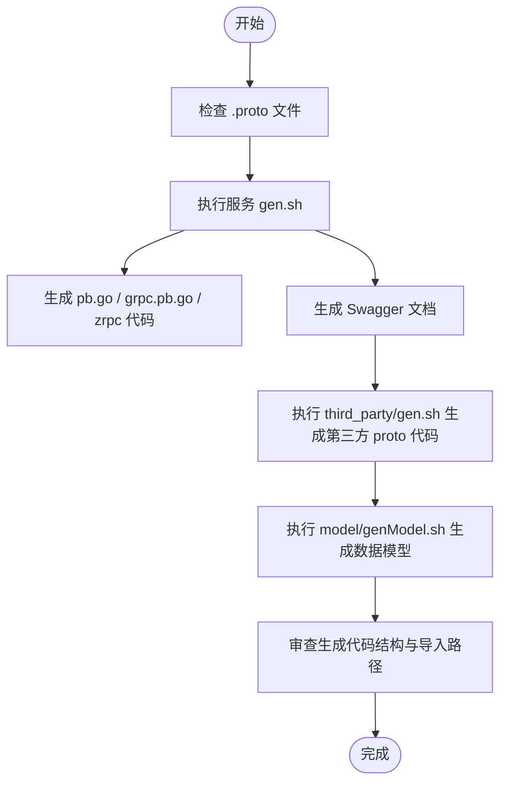
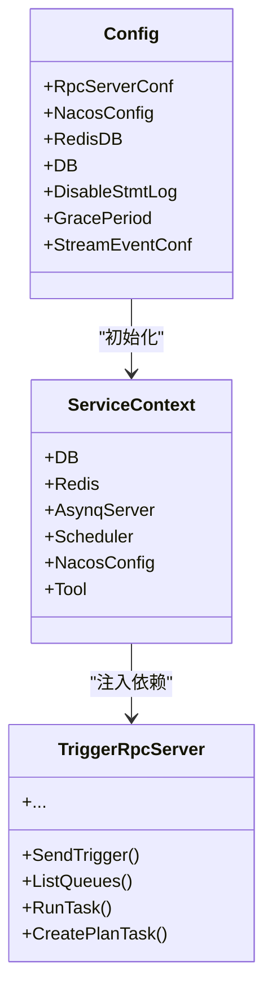
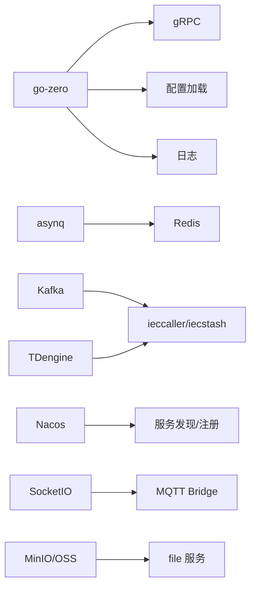

# 开发指南

<cite>
**本文引用的文件**
- [README.md](file://README.md)
- [go.mod](file://go.mod)
- [code.md](file://code.md)
- [app/trigger/gen.sh](file://app/trigger/gen.sh)
- [app/trigger/trigger.proto](file://app/trigger/trigger.proto)
- [app/trigger/trigger.go](file://app/trigger/trigger.go)
- [app/trigger/etc/trigger.yaml](file://app/trigger/etc/trigger.yaml)
- [app/trigger/internal/config/config.go](file://app/trigger/internal/config/config.go)
- [common/tool/tool.go](file://common/tool/tool.go)
- [common/nacosx/register.go](file://common/nacosx/register.go)
- [deploy/docker-compose.yml](file://deploy/docker-compose.yml)
- [model/genModel.sh](file://model/genModel.sh)
- [third_party/gen.sh](file://third_party/gen.sh)
</cite>

## 目录
1. [简介](#简介)
2. [项目结构](#项目结构)
3. [核心组件](#核心组件)
4. [架构总览](#架构总览)
5. [详细组件分析](#详细组件分析)
6. [依赖分析](#依赖分析)
7. [性能考虑](#性能考虑)
8. [故障排查指南](#故障排查指南)
9. [结论](#结论)
10. [附录](#附录)

## 简介
本指南面向Zero-Service项目的开发者，提供从零新增服务的完整流程、代码生成工具使用、项目约定与最佳实践、测试策略、调试技巧以及常见开发场景的解决方案。项目基于go-zero微服务框架，覆盖工业协议接入、异步任务调度、实时通信、容器管理、地理信息、BFF网关等能力。

## 项目结构
- 顶层模块与技术栈：模块名为zero-service，使用Go 1.25+，核心依赖包括go-zero、gRPC、asynq、Kafka、SocketIO、Nacos、TDengine、MinIO等。
- 服务组织：核心微服务集中在app/目录，按领域拆分（如trigger、file、gis、podengine、bridgemodbus、bridgemqtt、bridgegtw、lalhook、lalproxy、logdump、xfusionmock、mcpserver等），另有socketapp（实时通信）、gtw（BFF网关）、facade（对外接口层）、common（公共组件库）、model（数据库模型与SQL脚本）、deploy（Docker编排）、docs/swagger/third_party/util等辅助模块。
- 配置与入口：每个服务通常包含etc/配置文件、internal/内部实现（config、logic、server、svc、types等）、入口文件main.go、以及gen.sh代码生成脚本。

**章节来源**
- [README.md: 59-108:59-108](file://README.md#L59-L108)

## 核心组件
- go-zero微服务框架：提供RPC、HTTP、定时任务、服务治理、配置加载、日志等基础能力。
- gRPC + grpc-gateway：统一的RPC接口，同时支持HTTP访问；Swagger文档自动生成。
- 异步任务调度：基于asynq + Redis，支持定时/延时任务、回调（HTTP POST JSON或gRPC proto字节码）、重试与生命周期管理。
- 服务注册与发现：Nacos集成，支持服务注册、注销与健康检查。
- 协议与中间件：IEC 104（go-iecp5）、Modbus（grid-x/modbus）、MQTT（eclipse/paho.mqtt.golang）、SocketIO（fork）、Kafka（go-queue）。
- 数据与存储：MySQL/PostgreSQL/SQLite、TDengine、MinIO/OSS、Docker SDK。
- 监控与可观测性：OpenTelemetry、Prometheus、Grafana、Filebeat。

**章节来源**
- [README.md: 207-225:207-225](file://README.md#L207-L225)

## 架构总览
系统采用多协议接入与gRPC服务网格，BFF网关统一入口，实时通信通过SocketIO与MQTT桥接，异步任务调度与计划任务引擎支撑后台作业，对外接口层提供跨语言流数据事件协议。

**章节来源**
- [README.md: 15-51:15-51](file://README.md#L15-L51)

## 详细组件分析

### 新增服务全流程（以trigger为例）
- 创建服务目录与Proto定义
  - 在app/trigger下创建trigger.proto，定义服务接口与消息类型，并引入第三方proto（如validate、extproto）。
  - 生成gRPC与zrpc代码：执行gen.sh，内部调用goctl rpc protoc与protoc validate/openapiv2插件。
- 代码生成与自动生成结构
  - gen.sh生成pb.go、grpc.pb.go、zrpc相关代码，并输出Swagger文档到swagger目录。
  - 自动生成的代码结构包含trigger包、服务注册、拦截器、配置加载、服务上下文、定时任务与asynq调度器。
- 业务逻辑实现
  - 在internal/logic中实现具体业务逻辑（如任务发送、队列管理、计划任务等）。
  - 在internal/server中绑定服务实现，在internal/svc中注入依赖（数据库、Redis、asynq、Nacos等）。
- 配置文件编写
  - etc/trigger.yaml包含服务监听、日志、Nacos注册、Redis、数据库、StreamEventConf等配置项。
- 入口程序启动
  - trigger.go作为入口，解析配置、初始化服务上下文、注册gRPC服务、可选开启反射、注册Nacos服务、添加拦截器、启动定时任务与asynq调度器。

**图表来源**
- [app/trigger/gen.sh: 1-19:1-19](file://app/trigger/gen.sh#L1-L19)
- [app/trigger/trigger.proto: 1-106:1-106](file://app/trigger/trigger.proto#L1-L106)
- [app/trigger/trigger.go: 34-88:34-88](file://app/trigger/trigger.go#L34-L88)
- [app/trigger/etc/trigger.yaml: 1-37:1-37](file://app/trigger/etc/trigger.yaml#L1-L37)
- [app/trigger/internal/config/config.go: 9-27:9-27](file://app/trigger/internal/config/config.go#L9-L27)

**章节来源**
- [README.md: 264-281:264-281](file://README.md#L264-L281)
- [app/trigger/gen.sh: 1-19:1-19](file://app/trigger/gen.sh#L1-L19)
- [app/trigger/trigger.proto: 1-1181:1-1181](file://app/trigger/trigger.proto#L1-L1181)
- [app/trigger/trigger.go: 1-89:1-89](file://app/trigger/trigger.go#L1-L89)
- [app/trigger/etc/trigger.yaml: 1-37:1-37](file://app/trigger/etc/trigger.yaml#L1-L37)
- [app/trigger/internal/config/config.go: 1-28:1-28](file://app/trigger/internal/config/config.go#L1-L28)

### 代码生成工具与约定
- 代码生成脚本
  - 服务级gen.sh：调用goctl rpc protoc生成gRPC与zrpc代码，protoc生成validate与openapiv2输出。
  - 第三方gen.sh：生成extproto与dji_error_code的Go代码并整理目录结构。
  - 数据模型genModel.sh：基于数据库URL与表名生成model代码，支持缓存配置。
- 生成产物约定
  - pb.go与grpc.pb.go：gRPC桩代码；zrpc相关：客户端/服务端适配。
  - Swagger：输出到swagger目录，便于API文档浏览与联调。
- 目录结构约定
  - app/{service}/etc：配置文件
  - app/{service}/internal：内部实现（config、logic、server、svc、types）
  - app/{service}/{service}.proto：服务接口定义
  - app/{service}/gen.sh：代码生成脚本
  - app/{service}/{service}.go：入口程序

**图表来源**
- [app/trigger/gen.sh: 1-19:1-19](file://app/trigger/gen.sh#L1-L19)
- [third_party/gen.sh: 1-37:1-37](file://third_party/gen.sh#L1-L37)
- [model/genModel.sh: 1-25:1-25](file://model/genModel.sh#L1-L25)

**章节来源**
- [app/trigger/gen.sh: 1-19:1-19](file://app/trigger/gen.sh#L1-L19)
- [third_party/gen.sh: 1-37:1-37](file://third_party/gen.sh#L1-L37)
- [model/genModel.sh: 1-25:1-25](file://model/genModel.sh#L1-L25)

### 配置与服务上下文
- 配置结构
  - RpcServerConf：gRPC服务监听、超时、日志等
  - NacosConfig：是否注册、主机、端口、用户名、密码、命名空间、服务名
  - Redis/DB：连接信息、DB选择
  - StreamEventConf：下游事件目标、非阻塞、超时、优雅退出周期
- 服务上下文
  - 在svc中注入数据库、Redis、asynq、Nacos、工具库等依赖，供logic层使用
- 启动流程
  - main中加载配置、初始化上下文、注册服务、可选反射、注册Nacos、添加拦截器、启动定时任务与asynq调度器

**图表来源**
- [app/trigger/internal/config/config.go: 9-27:9-27](file://app/trigger/internal/config/config.go#L9-L27)
- [app/trigger/trigger.go: 44-87:44-87](file://app/trigger/trigger.go#L44-L87)

**章节来源**
- [app/trigger/etc/trigger.yaml: 1-37:1-37](file://app/trigger/etc/trigger.yaml#L1-L37)
- [app/trigger/internal/config/config.go: 1-28:1-28](file://app/trigger/internal/config/config.go#L1-L28)
- [app/trigger/trigger.go: 1-89:1-89](file://app/trigger/trigger.go#L1-L89)

### 错误码规范与返回约定
- 统一遵循google.rpc.Code错误码标准，HTTP与gRPC映射关系明确，建议在错误详细信息中使用BadRequest、ResourceInfo、QuotaFailure等类型。
- 在API层统一处理错误，结合validate.proto对请求参数进行校验，确保错误信息清晰可追踪。

**章节来源**
- [code.md: 1-66:1-66](file://code.md#L1-L66)

## 依赖分析
- 模块依赖：go.mod声明了go-zero、gRPC、asynq、Kafka、SocketIO、Nacos、TDengine、MinIO、MQTT、OpenTelemetry等核心依赖。
- 服务间耦合：通过gRPC与Nacos实现服务发现与调用；BFF网关聚合多个后端服务；实时通信通过SocketIO与MQTT桥接。
- 外部集成：Kafka用于异步事件与数据汇聚；Redis用于任务队列与缓存；TDengine用于时序数据存储；Docker SDK用于容器生命周期管理。

**图表来源**
- [go.mod: 5-62:5-62](file://go.mod#L5-L62)

**章节来源**
- [go.mod: 1-245:1-245](file://go.mod#L1-L245)

## 性能考虑
- 任务队列与重试：asynq支持指数退避重试与最大重试次数，合理设置超时与保留周期，避免任务堆积。
- 并发与资源：根据CPU/内存/网络/存储资源设置容器限制，避免资源争抢；使用goroutine池与背压机制。
- 数据库与缓存：开启必要的索引与分区，合理使用连接池与只读副本；对热点数据使用Redis缓存。
- 监控与观测：开启OpenTelemetry链路追踪与Prometheus指标，结合Grafana可视化，定期分析延迟与错误率。
- 网络与I/O：gRPC使用HTTP/2多路复用，减少连接数；文件上传采用分片与流式传输，降低内存占用。

## 故障排查指南
- 启动与注册
  - 检查配置文件路径与参数是否正确（-f etc/xxx.yaml）。
  - 若启用Nacos注册，确认主机、端口、用户名、密码、命名空间与服务名配置。
  - 查看日志级别与路径，定位启动异常。
- 服务发现与调用
  - 确认Nacos服务是否正常，服务实例是否注册成功。
  - 检查gRPC端口与监听地址，确保防火墙放行。
- 任务与队列
  - 检查Redis连接与键空间，确认任务队列状态与延迟。
  - 使用asynq管理界面或API查看任务历史与统计。
- 数据与存储
  - 校验数据库连接串与权限，确认表结构与索引。
  - 对于TDengine，检查时序数据写入与查询性能。
- 实时通信
  - SocketIO与MQTT桥接需检查主题映射与鉴权配置。
- 生成与构建
  - 代码生成失败时，检查protoc与插件版本，确保third_party与proto路径正确。
  - Docker构建失败时，检查镜像标签与网络代理。

**章节来源**
- [app/trigger/trigger.go: 53-71:53-71](file://app/trigger/trigger.go#L53-L71)
- [common/nacosx/register.go: 21-76:21-76](file://common/nacosx/register.go#L21-L76)
- [app/trigger/etc/trigger.yaml: 11-37:11-37](file://app/trigger/etc/trigger.yaml#L11-L37)

## 结论
通过标准化的新增服务流程、完善的代码生成工具、严格的配置与错误码规范、以及丰富的测试与调试手段，Zero-Service能够高效支撑工业协议接入、异步任务调度、实时通信与容器管理等复杂场景。建议在开发过程中严格遵循项目约定与最佳实践，持续完善监控与可观测性，保障系统的稳定性与可维护性。

## 附录

### 开发环境配置指南
- 环境要求：Go 1.25+，Redis，可选Kafka、MySQL/PostgreSQL、TDengine、Docker。
- 一键启动：使用deploy/docker-compose.yml快速启动核心服务与基础设施。
- IDE与工具：建议使用GoLand/VS Code，启用gRPC/Protobuf插件，配置goctl与protoc路径。

**章节来源**
- [README.md: 226-252:226-252](file://README.md#L226-L252)
- [deploy/docker-compose.yml: 1-110:1-110](file://deploy/docker-compose.yml#L1-L110)

### 团队协作规范
- 分支策略：采用feature分支开发，主干保护与CI/CD流水线。
- 提交规范：遵循Conventional Commits，包含type、scope与subject。
- 代码评审：PR必须通过至少一名Reviewer同意，确保代码质量与一致性。
- 文档同步：新增服务需补充Swagger文档与README说明。

### 测试策略与方法
- 单元测试：针对logic层与工具函数编写单元测试，覆盖边界条件与异常路径。
- 集成测试：通过Docker Compose启动最小化环境，验证服务间调用与数据流转。
- 性能测试：使用ab/ghz压测gRPC接口，评估吞吐与延迟；对关键路径进行基准测试。
- 测试工具：使用grpcurl验证gRPC接口，Swagger UI验证HTTP接口，Kafdrop查看Kafka消息。

**章节来源**
- [README.md: 288-294:288-294](file://README.md#L288-L294)

### 常见开发场景解决方案
- 新功能开发：遵循“Proto定义 → 代码生成 → 业务实现 → 配置更新 → 入口启动”的闭环。
- Bug修复：先复现问题，再定位到具体服务与逻辑，使用日志与断点调试，最后回归测试。
- 性能优化：从慢查询、队列积压、网络瓶颈入手，结合监控指标与火焰图分析。
- 重构指导：保持接口稳定，逐步替换实现，确保兼容性与可观测性不降级。

### 调试技巧与开发工具配置
- 断点调试：在IDE中设置断点，结合日志输出定位问题；必要时开启gRPC反射便于本地联调。
- 日志分析：统一日志格式与级别，结合Filebeat与ELK栈进行集中检索。
- 性能分析：使用pprof与Pyroscope采集CPU/内存/阻塞分析，识别热点函数与锁竞争。
- 工具库：利用common/tool中的通用工具（时间戳、编码、JWT解析、二进制转换等）提升开发效率。

**章节来源**
- [common/tool/tool.go: 1-469:1-469](file://common/tool/tool.go#L1-L469)